# LLM Data Factory · Atelier 数据项目工作室

一个面向企业级使用场景的 LLM 数据项目工作室，目标是把目标、版本化设计、独立试制、质量判断和固定发布串成可复核、可恢复、可交付的完整旅程。当前代码已落地主线壳、项目 API 和兼容入口；真实 provider、灰度回退和真实用户验收仍按 Issue #160 保持未完成，见[当前验收边界](#81-当前验收边界)。

本仓库当前产品主线是 **Atelier 数据项目工作室**，按 [Issue #160](https://github.com/1420970597/llm/issues/160) 与 [Discussion #159](https://github.com/1420970597/llm/discussions/159) 的契约推进。旧版控制台仍保留兼容入口，但不再作为新产品的信息架构标准；实现状态和未完成验收项以 `docs/plans/atelier-implementation.md` 为准。

## Atelier 重设计实拍

下面的截图来自本分支执行 `docker compose up -d --build` 后、通过正式入口
`http://127.0.0.1:3210` 打开的真实浏览器，尺寸为桌面 `1440×1024`、移动
`390×844`。它们是运行证据，不是原型图；没有样本/发布数据的页面会诚实呈现空状态。

`3210` 是系统的规范 Web 入口，由根目录 Compose 配置统一发布（只有显式设置 `WEB_USER_PORT` 时才改变映射）。不要使用临时端口或旧工作树启动第二套前端；验收、截图和日常开发都必须从 `http://127.0.0.1:3210` 进入。

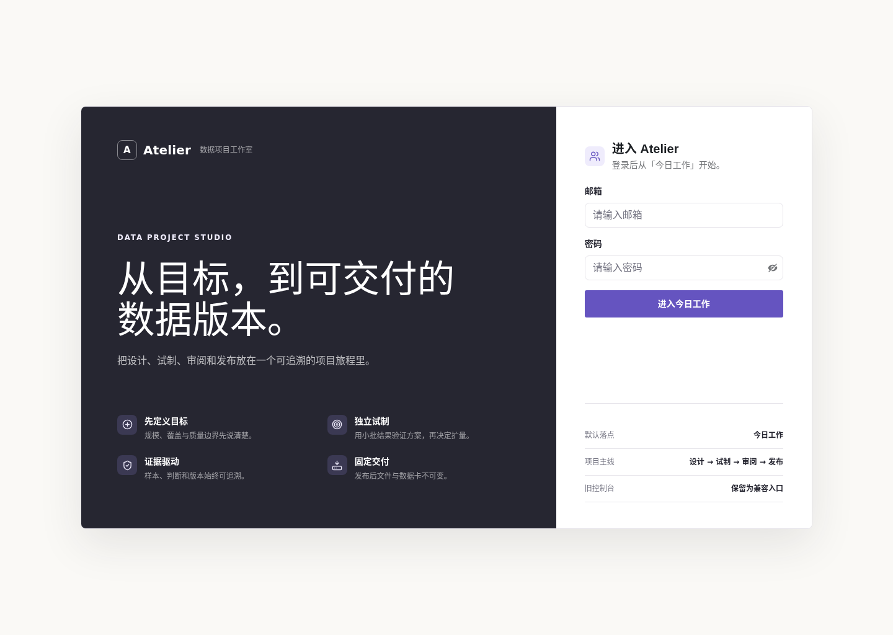

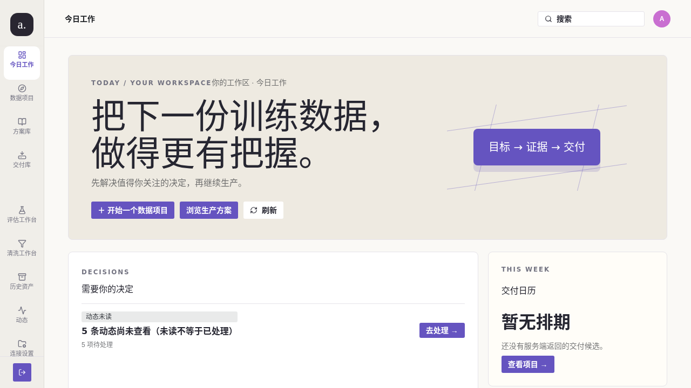

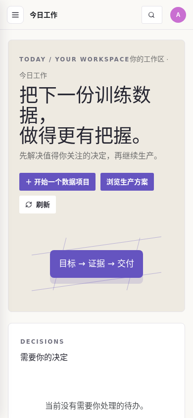

| 页面 | 设计意图 | 运行截图 |
| --- | --- | --- |
| P01 项目概览 | 把旅程、项目约定、下一决定和版本台账放在同一上下文 | 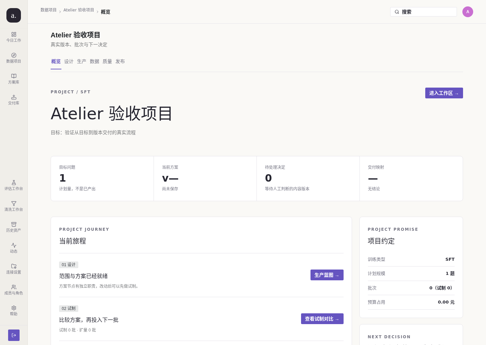 |
| P02 生产蓝图 | 左侧有限语义画布，右侧步骤检查器，底部只读版本历史 | 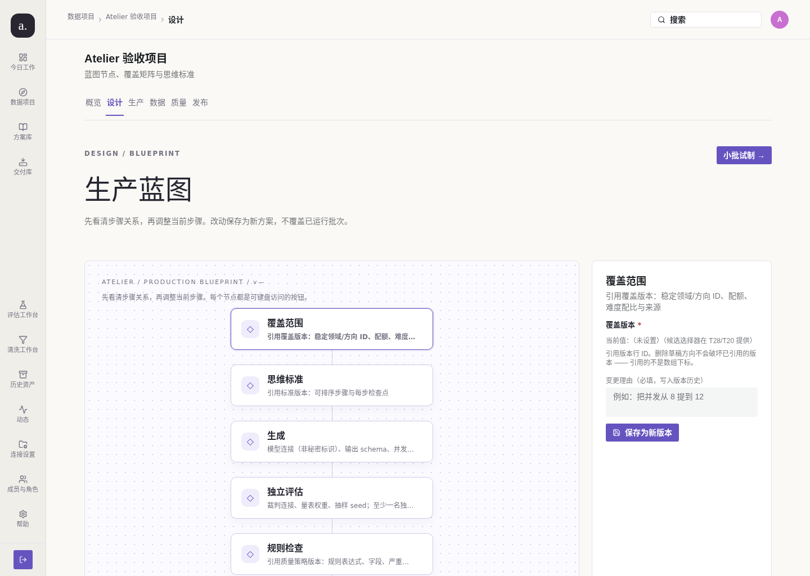 |
| L03 发布版本 | 候选、阻塞、数据卡和固定制品按 release 分层 | 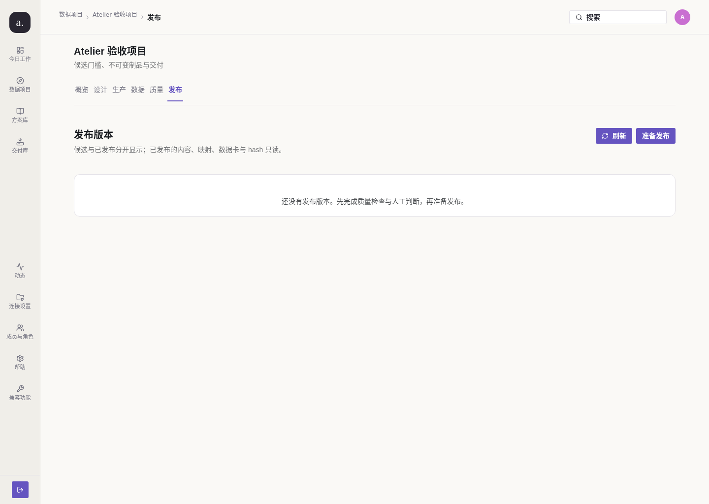 |

### 辅助工作台与旧能力迁移边界

主线页面之外，评估、清洗和管理员治理也已经从同一个 Atelier 壳进入，仍调用原有真实 API；旧版
`/console/*` 深链继续保留。下面是同一次 Compose 启动后的真实运行画面，管理员治理包含模型服务、存储、
策略、提示词、导出映射和审计，普通用户截图则明确不显示管理员区。

| 页面 | 关键交互 | 运行截图 |
| --- | --- | --- |
| 评估工作台 | 维度、创建评估、运行列表、报告与真实数据 | 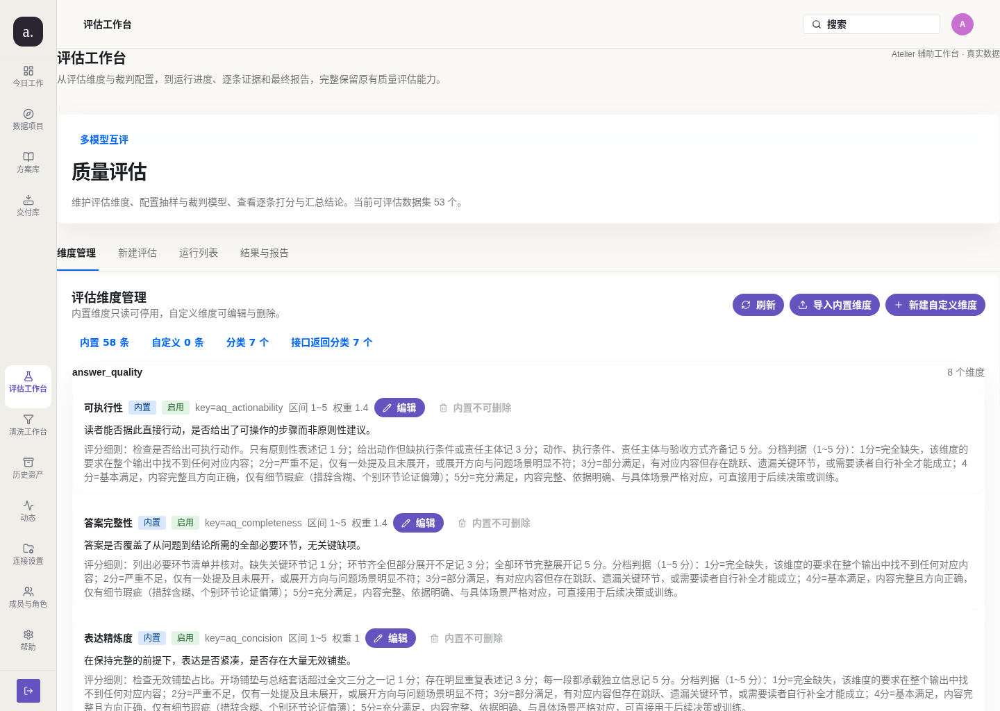 |
| 清洗工作台 | 关键词、规则、扫描、命中证据与交付跳转 | 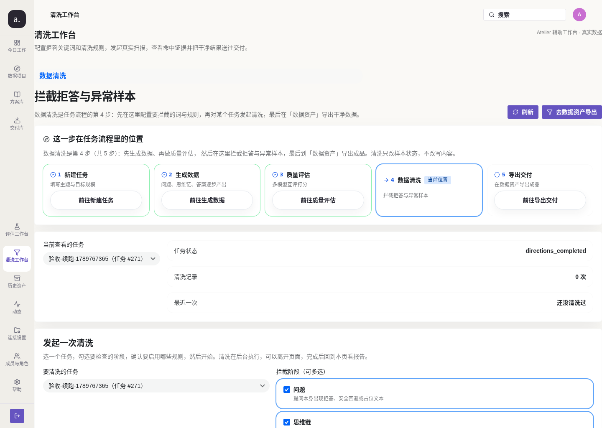 |
| 管理治理 | 运行监控、连接配置、导出映射编辑器与审计 | 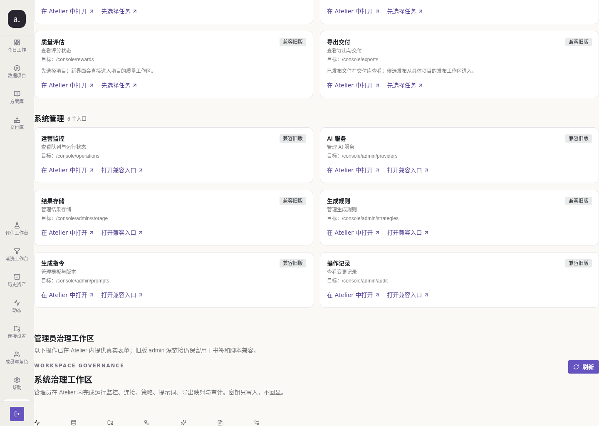 |
| 导出映射编辑器 | 字段增删、表达式、JSON 选项校验和复制内置映射 | 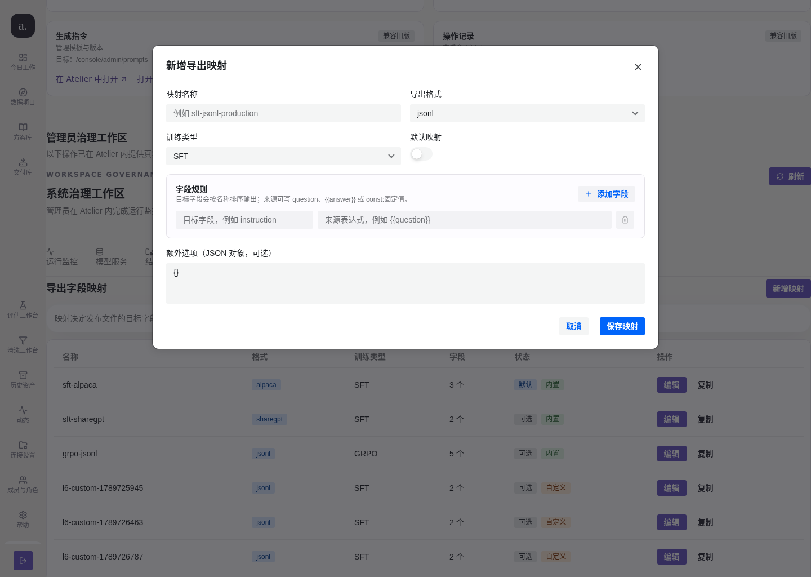 |
| 普通用户移动端 | 390px 抽屉导航与角色隔离 | 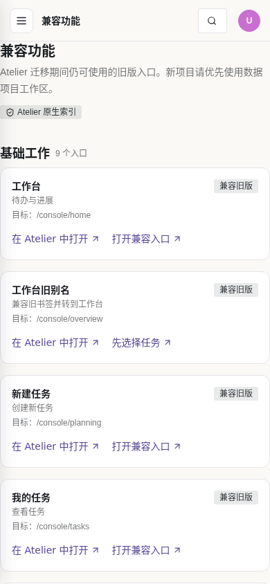 |

登录、旧控制台兼容页和设计图册仍保留在 `docs/screenshots/` 与
`docs/design/2026-09-21-data-studio/`，但不作为 Atelier 的视觉验收证据。

系统支持：
- 用户输入目标数据集规模与关键词
- 生成领域图谱并支持人工审核
- 异步生成问题、长思维链/答案、奖励评估数据
- 将大文本与最终导出工件落到 MinIO / S3 兼容对象存储
- 通过统一控制台中的管理员功能配置模型、存储、策略、Prompt 与审计信息

---

## 1. 当前完成度

### Atelier 信息架构

全局导航围绕用户目标组织：

| 入口 | 用途 |
| --- | --- |
| 今日工作 | 汇总待判断、可比较试制、失败恢复和发布阻塞，并直达具体对象 |
| 数据项目 | 浏览、搜索和创建项目 |
| 方案库 | 保存已验证的方法组合，并从已发布版本复制新项目 |
| 交付库 | 按固定 release 查看和下载不可变交付文件 |

每个项目提供六个工作区：**概览、设计、生产、数据、质量、发布**。项目、批次、样本、实验和发布都使用真实 ID 写入 URL，因此刷新、分享和返回都能恢复上下文。

核心旅程：

```text
创建项目 -> 保存蓝图/覆盖/标准版本 -> 独立试制
  -> 同基准比较 -> 采用并规划扩量 -> 冻结质量实验
  -> 人工判断 -> 创建候选 -> 处理阻塞 -> 固定 release 下载
```

关键语义：试制与扩量是不同批次；样本内容只追加版本；质量实验创建时冻结范围、seed、量表和裁判；发布下载只定位具体 `releaseId`，不使用 `latest` 回退；前端能力位只辅助 UI，服务端授权始终是最终边界。

项目当前已经完成以下能力：

### 统一控制台中的用户能力
- 数据集计划估算
- 数据集创建
- 领域图谱生成与确认
- 问题生成任务触发与预览
- 推理/答案生成任务触发与预览
- 奖励数据生成任务触发与预览
- 导出任务触发与工件预览
- 运行态统计查看
- 原生评估工作台：维度管理、评估创建、运行队列、逐条证据与报告
- 原生清洗工作台：关键词/规则 CRUD、阶段选择、异步扫描与命中报告
- `/settings/capabilities` 兼容索引：20 个旧入口均有新目标和旧深链

### 统一控制台中的管理员能力
- 模型提供方管理
- 模型列表获取
- 模型连通性测试
- 推理强度配置
  - 支持：`low`、`medium`、`high`、`xhigh`
- 存储配置管理
  - 存储表单默认内置本地 MinIO 地址
  - 支持配置多个存储来源
  - 支持启用 / 停用开关
- 生成策略管理
- Prompt 模板管理
- 导出映射管理：格式/训练类型、字段表达式、选项 JSON、默认映射和内置映射复制
- 审计日志查看

### 后端与基础设施
- Go API
- Go Worker
- PostgreSQL 元数据存储
- Redis 异步队列
- MinIO / S3 兼容对象存储
- Docker Compose 本地部署
- JSONL 数据集导出

### 设计调研与产品决策

这次改造先做信息架构和交互调研，再落到代码：把生产过程看成一条可追溯的项目旅程，
而不是把所有动作堆进一个菜单。设计基线、逐元素点击行为和 39 屏画面索引分别见：

- [产品规格与调研结论](docs/design/2026-09-21-data-studio/02-product-spec.md)
- [逐元素交互规格](docs/design/2026-09-21-data-studio/03-interaction-spec.md)
- [交付与状态模型](docs/design/2026-09-21-data-studio/04-delivery.md)
- [画面图册（Atlas）](docs/design/2026-09-21-data-studio/06-atlas.md)
- [实现追踪表](docs/plans/atelier-implementation.md)

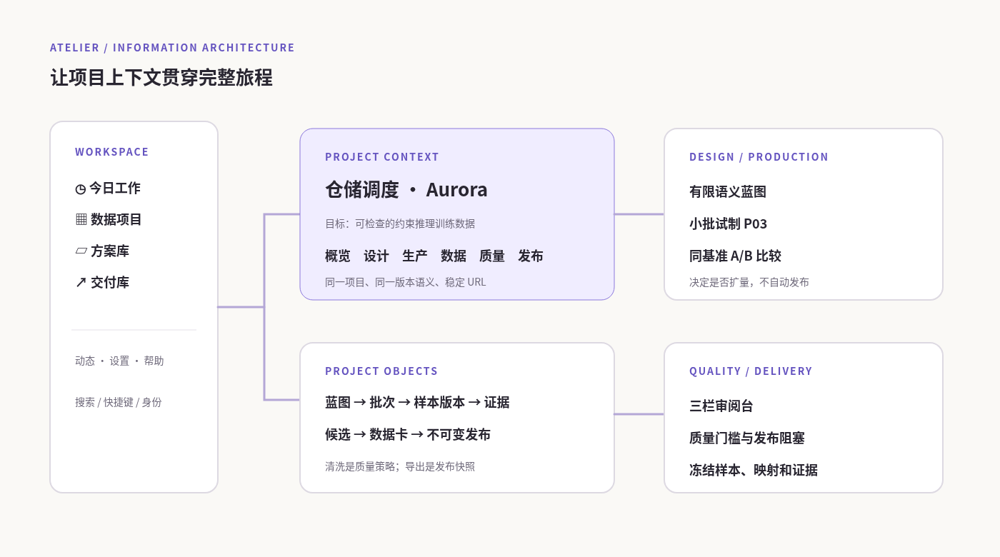

导航只有三层：**今日工作 / 数据项目 / 方案库 / 交付库**是全局入口；进入项目后才出现
**概览、设计、生产、数据、质量、发布**；动态、连接、成员和帮助放在辅助区。所有重要对象
都由 URL 承载 ID，因此刷新、复制链接、浏览器前进/后退不会丢失项目上下文。

---

## 2. 项目结构

```text
apps/
  api/          Go API 服务
  worker/       Go Worker 服务
  web-user/     统一控制台 React 前端（用户与管理员合并）
internal/
  config/       配置加载
  crypto/       密钥加密
  llm/          领域/问题/推理/奖励生成逻辑
  migrate/      SQL 迁移执行器
  model/        领域模型
  storage/      MinIO/S3 对象存储封装
  store/        PostgreSQL/Redis 数据访问层
sql/migrations/ 数据库迁移脚本
deployments/
  docker/       Dockerfile 与 nginx 配置
  compose/      Docker Compose 编排
```

---

## 3. 技术栈

### 前端
- React
- TypeScript
- Vite
- Semi UI
- Tailwind CSS
- React Router
- i18next
- Axios
- Lucide Icons

### 后端
- Go
- pgx / PostgreSQL
- Redis
- MinIO / S3 兼容对象存储

### 部署
- Docker
- Docker Compose
- nginx 反向代理

---

## 4. 启动方式

### 4.1 一键启动

在项目根目录执行：

```bash
docker compose up -d --build
```

> 根目录的 `docker-compose.yml` 通过 `include` 引入 `deployments/compose/docker-compose.yml`。
> 请务必用上面的根入口命令：直接 `-f deployments/compose/docker-compose.yml` 会让 compose
> 去 `deployments/compose/` 找 `.env`，读不到仓库根的 `.env`，从而静默丢失
> `APP_BOOTSTRAP_PROVIDER_*` 等配置（详见根 `docker-compose.yml` 注释）。

#### 带版本构建（推荐）

上面那条命令**不会**注入 git 版本。镜像一旦不带版本，就无法回答
「我现在跑的是哪一版」 —— 曾经因此把一次「部署的是旧镜像」误判成产品缺陷（issue #88）。

知道要重建时，请用包装脚本，它会把 HEAD 注入产物并在结束后自动校验：

```bash
./scripts/build-with-version.sh          # 只重建前端
./scripts/build-with-version.sh --all    # 重建全部服务
```

### 4.1.1 部署版本自检（排查「行为与源码不符」时先跑这条）

```bash
./scripts/check-deployed-version.sh                      # 默认 http://localhost:3210
./scripts/check-deployed-version.sh http://<host>:3210
```

5 秒内回答「部署中的前端是不是本地 HEAD 构建的」：

| 输出 | 含义 | 处理 |
|---|---|---|
| `✅ 一致` | 部署的就是本地 HEAD | 可以用它做验收 |
| `❌ 不一致` | 部署落后于本地 HEAD | **不要**用它做验收，先重建 |
| `⚠️ 未注入版本号` | 镜像没带版本，无法判定 | 用 `./scripts/build-with-version.sh` 重建 |

> 控制台「帮助」页也有「**构建版本**」与「**部署自检**」两个区块，
> 直接显示当前页面是哪一版构建的 —— 不用翻文档就能发现自己在跑旧代码。

### 4.2 访问地址

- 统一控制台：<http://localhost:3210>

Compose 服务：

| 服务 | 作用 | 对宿主机暴露 |
| --- | --- | --- |
| `web-user` | nginx + React 控制台 | `3210` |
| `api` | Go HTTP API | 不暴露 |
| `worker` | 异步作业执行 | 不暴露 |
| `postgres` | 元数据与权威状态 | 不暴露 |
| `redis` | 持久化任务队列 | 不暴露 |
| `minio` | S3 兼容对象存储 | 不暴露 |

当前 `docker-compose.yml` 已移除冗余对外端口映射：
- 不再暴露重复的 `3211` 前端入口
- 不再对宿主机暴露 API / Worker / PostgreSQL / Redis / MinIO 端口
- 浏览器与用户仅需访问统一控制台 `3210`

### 4.3 默认登录账号

系统启动后会自动引导两个默认账号：

- 管理员：`admin@company.com` / `admin123456`
- 普通用户：`user@company.com` / `user123456`

管理员拥有全部用户功能，并可直接进入系统治理页面。

### 4.4 旧数据迁移

旧 Dataset 不会因为出现在“历史资产”页就被视为已迁移。迁移需要将内容实际写入
`projects`、快照批次和 `sample_versions`，并由 `studio_legacy_imports` 台账记录来源、游标、
计数和内容摘要。

先盘点，再对每个已确认归属的数据集单独导入：

```bash
# 只读盘点，生成可审计报告
make legacy-inventory

# 真正导入：明确数据集、执行人和目标工作区；可重复执行且会从台账续跑
make legacy-import DATASET_ID=12 ACTOR_ID=1 OWNER_ID=1 WORKSPACE_ID=1
```

`studio-migrate` 已随 `api` 镜像提供。导入会拒绝没有可靠 owner 的数据集，也会拒绝同名
项目冲突，除非通过 `-target-project` 明确指定现有目标。当前本地 Compose 数据库已经应用
全部 39 个 SQL 迁移。当前开发库已执行 9 个真实导入批次：9 个旧 dataset 映射为
`legacy_dataset_id` 项目，追加 67 个 sample version，失败数为 0；没有 SFT 内容的旧问题
仍按对账规则保留为未导入项，不能伪装成已迁移。真实库的盘点 JSON 与每次导入输出应归档
到变更记录或 PR，而不是写进产品页面。

停止本地栈：

```bash
docker compose down
```

保留数据库和对象存储卷；如需清理本地数据，必须明确执行：

```bash
docker compose down -v
```

---

## 5. 前端网络设计

### 5.1 为什么不会再出现浏览器访问 localhost 的问题

前端已改为**同源 API 调用**模式：

- 前端代码默认请求 `/api/...`
- `web-user` 容器中的 nginx 会把 `/api/` 反向代理到 Go API 容器

因此：
- 浏览器不会直接请求 `http://localhost:38080`
- 不会再触发公网域名页面去访问 loopback 地址导致的 CORS / Private Network Access 错误

### 5.2 检查 frontend 是否写死 localhost

当前前端源码中的 API 请求已全部移除写死的 `localhost`。

可以用以下命令自检：

```bash
rg -n "localhost|127\.0\.0\.1" apps/web-user -g '!**/dist/**'
```

如果命令无输出，说明前端源码没有写死本地回环地址。

补充说明：
- `deployments/compose/docker-compose.yml` 中的 `127.0.0.1` 仅用于 **容器内部健康检查**
- 这些健康检查不会暴露给浏览器，也不会让公网访问的页面去请求宿主机或用户本机的 loopback 地址

### 5.3 同源代理自检

可以直接通过前端入口验证同源 `/api` 代理是否正常：

```bash
curl http://127.0.0.1:3210/api/v1/platform/runtime
curl http://127.0.0.1:3210/api/v1/admin/generation-strategies
```

如果以上命令返回 JSON，说明：
- 浏览器侧请求走的是前端站点同源 `/api`
- `web-user` 的 nginx 反向代理已经生效
- 前端不会因为写死 `localhost:38080` 而触发浏览器私网访问问题

---

## 6. 主要业务流程

### 6.1 Atelier 项目流程
1. 在“数据项目”创建草稿，填写目标、训练类型和计划规模；创建阶段不调用模型。
2. 在“设计”保存蓝图、覆盖、标准和质量策略版本；每次保存生成新版本并要求变更理由。
3. 在“生产”创建独立的 pilot 批次，运行前冻结版本、模型配置和预算快照。
4. 在“比较”用同一基准查看方案差异；采用方案只会规划新的 scale 批次。
5. 在“数据/质量”查看追加式样本版本、规则证据、实验结果和人工判断。
6. 在“发布”冻结候选范围，逐项处理 blocker，再构建带 manifest、hash 和数据卡的 release。
7. 从“交付库”按具体 `releaseId` 下载不可变制品；后续项目修改不会改变历史下载。

SFT 与 GRPO 共用项目壳和批次生命周期，但 GRPO 的档位、逐档判据、质量维度和 JSONL 字段保持独立；不会用 SFT 的 `answer/reasoning` 或固定统计填充 GRPO。旧 Dataset/Console 链路只作为兼容读写边界，迁移状态与未等价能力见[兼容入口与迁移边界](#辅助工作台与旧能力迁移边界)。

### 6.2 系统治理流程
管理员在连接、存储、成员与角色、预算和帮助页面维护工作区；管理员身份不自动绕过项目成员授权。
连接测试、保存配置、成员变更和发布操作分别写入审计事件，密钥不会进入版本快照或数据卡。

---

## 7. 数据持久化设计

### PostgreSQL
保存：
- 模型配置
- 存储配置
- 生成策略
- Prompt 模板
- Atelier 工作区、项目、成员与项目授权
- 蓝图/覆盖/标准/质量策略/映射的不可变版本
- pilot/scale 批次、作业租约、样本与追加式样本版本
- 质量实验、规则证据、人工判断、同基准比较与采用记录
- release 候选、冻结清单、manifest、制品 hash、方案库与交付索引
- 动态/评论、预算与用量台账、旧数据导入台账和灰度健康读模型
- 数据集元数据
- 领域/问题/推理/奖励记录元数据
- 审计日志
- 导出工件元数据

### Redis
保存：
- 异步任务队列
- Worker 消费消息
- 队列长度统计

### MinIO / S3
保存：
- 推理长文本 JSON
- 奖励数据 JSON
- 旧版导出与 Atelier release 的不可变导出工件（对象路径带 release/hash）

---

## 8. 已验证功能

### 8.0 本次 Compose + 真实浏览器验收

- 使用 `docker compose up -d --build` 实际构建并启动 API、Worker、Web、PostgreSQL、Redis、MinIO；Web 通过默认 `3210` 端口访问。
- 真实浏览器登录后访问 `/today`、`/projects`、`/p/1/overview`、`/p/1/blueprint`、`/p/1/review`、`/p/1/releases`。
- 已保存 `1440×1024` 桌面端和 `390×844` 移动端截图，并在本文开头展示。
- 已验证全局四入口、项目六标签、深链接面包屑、P02 节点检查器和 L03 空发布态。
- 已验证 `/tools/evaluation`、`/tools/cleaning` 的真实数据、规则/维度操作区和 390px 无横向溢出；管理员治理页的
  七个标签、导出映射字段编辑器、空名称/JSON 校验和 `#admin-governance` 深链接均已实测。
- 当前数据库没有真实样本、实验或 release，因此 D02/L03 的有内容状态没有被伪造；截图中的空状态是实际 API 返回。

产品菜单只展示当前工作流。旧 `/console/*` 书签仍会被路由桥解析并跳转到相应项目或历史对象；
迁移状态、台账和冻结策略属于运维记录，不作为用户面对的产品页面。历史资产仅用于查阅尚未导入或无法完整
映射的旧对象，真实迁移命令和对账要求见本 README 的“旧数据迁移”及迁移报告。

### 8.1 当前验收边界

已验证不等于全部生产验收完成。以下项目仍按 Issue #160 如实保留：

- 真实 provider 下的完整 SFT/GRPO 业务旅程。
- 真实 Chromium 断网切换、键盘走查和 10 万样本性能基准。
- 生产灰度/回退演练、对象存储故障注入和 5–8 名真实用户任务验收。

### 8.2 文档索引

按阅读目的选择入口：

| 文档 | 用途 |
|---|---|
| `docs/architecture/phase-1-foundation.md` ~ `phase-8-eval-and-cleaning.md` | 各阶段架构设计（第一轮） |
| `docs/architecture/round2-remediation.md` | **第二轮缺陷治理**：修复语义、新不变量与运维影响 |
| `docs/guides/eval-and-cleaning-usage.md` | 评估与清洗的使用说明 |
| `docs/plans/issue-remediation-plan.md` | 第二轮冻结契约（lane 划分与跨 lane 接口） |
| `docs/plans/atelier-implementation.md` | #159 → #160 的 39 屏、路由、命令、对象、迁移和任务追踪表 |
| `docs/plans/atelier-api-contract.md` | Atelier API 信封、错误、分页、能力和增量端点契约 |
| `docs/plans/atelier-acceptance-protocol.md` | 真实用户任务、角色旅程和 DoD 证据记录模板（未执行项明确标注） |
| `docs/plans/atelier-field-schema-and-retention.md` | 样本/导出字段、版本语义、保留策略与未知边界 |
| `docs/plans/studio-rollout-runbook.md` | 开关、部署顺序、观测、灰度、回退和故障处理 |
| `docs/plans/legacy-migration-report.md` | 旧 Dataset 盘点、映射、导入和对账边界 |

运维需重点读 `docs/architecture/round2-remediation.md`，它记录了本轮引入的
**新不变量**（活跃 run 唯一约束、`invalid` 记录状态、阶段路由单一事实来源）与
**错误契约变更**（未知子路径 404、admin 必填校验 400、`providerId` 校验 400）。
该文档逐节标注每条修复在 `main` 上的真实合并状态，并提供自行核对命令。

文档的链接、锚点与代码路径引用由 `node scripts/check-docs.mjs` 校验。

### 8.3 自动化验证

已做自动化/半自动验证：

- `npm run build`
- Dockerized `go test ./...`
- API 镜像构建
- Worker 镜像构建
- 前端镜像构建
- PostgreSQL + Redis + MinIO + API + Worker 的 Compose 健康状态与旧版兼容链路烟雾验证（不等同于 Atelier 的真实 provider 全旅程）
- 通过 `http://127.0.0.1:3210/api/...` 的同源代理验证
- 登录鉴权：`/api/v1/auth/login`、`/api/v1/auth/me`、`/api/v1/auth/logout`
- 统一控制台真实链路脚本：`python3 scripts/frontend_same_origin_smoke.py http://127.0.0.1:3210`

已验证的旧版兼容业务链路包括：
- 管理员角色配置模型提供方
- 管理员角色配置存储配置
- 管理员角色配置生成策略
- 管理员角色配置 Prompt
- 用户角色计划估算
- 用户角色创建数据集
- 用户角色生成领域
- 用户角色确认领域
- 用户角色生成问题
- 用户角色生成推理
- 用户角色生成奖励数据
- 用户角色导出 JSONL 数据集工件

最近一次同源烟雾验证结果：
- 管理员登录成功：`admin@company.com`
- 普通用户登录成功：`user@company.com`
- 普通用户访问 `/api/v1/admin/dashboard` 被正确拒绝（403）
- 普通用户仍可读取只读策略列表供计划编排使用
- 通过统一控制台同源 `/api` 完成管理员配置与用户数据链路
- 验证结果：`domainCount=10`、`questionCount=20`、`reasoningCount=20`、`rewardCount=20`、`artifactCount=1`、`runtimeQueueDepth=0`

截图采集时的数据库状态（不是对所有部署环境的永久保证）：
- 已清空验收阶段残留的临时业务数据
- 当前不再预置模型提供方、存储配置、生成策略、Prompt 模板、数据集、问题、推理、奖励、导出工件
- 登录账号保留，用于进入统一控制台

本地联调、集成测试或其他用户操作可能会改变这些数据；需要重新得到空状态时，请按[维护说明](#131-清理临时验收数据)执行清理脚本，不要把截图中的空状态当成业务约束。

---

## 9. Atelier UI 规则

Atelier 不是旧控制台换一组菜单名称，而是按用户决策重新组织页面。

实现约束：React + TypeScript + Vite + Semi UI + React Router；API 采用同源 `/api` 反向代理。

### 9.1 页面与点击语义

| 层级 | 页面 | 关键点击结果 |
| --- | --- | --- |
| 全局 | 今日工作 | 待办的“去处理”使用服务端 `links.page` 直达对象 |
| 全局 | 数据项目 | 服务端搜索/分页；新建项目先保存草稿 |
| 全局 | 方案库 | 复制完整方法组合生成新项目草稿 |
| 全局 | 交付库 | 只展示已发布 release，下载必须带具体 ID |
| 项目 | 概览 | 旅程行跳到设计、试制、质量或发布 |
| 项目 | 设计 | `?node=` 选择节点，`?version=` 历史只读 |
| 项目 | 生产 | 试制与扩量是独立批次，恢复不重跑成功项 |
| 项目 | 数据/质量 | 内容只读，判断追加记录，实验范围冻结 |
| 项目 | 发布 | 阻塞带证据链接，发布后 manifest/hash 固定 |

登录、旧任务阶段和管理员治理页仍作为兼容入口存在，但不改变 Atelier 的主信息架构。

### 9.2 兼容入口与角色策略
- 旧版兼容入口仍保留，Atelier 主壳按项目成员能力显示页面
- 管理员可以进入系统治理页，但项目内容仍由服务端项目授权决定
- 两种角色共用同一个前端应用；能力位只辅助 UI，API 授权是最终边界
- 默认不预置 Atelier 样本或发布数据，空状态显示真实 API 结果

### 9.3 兼容与布局
- 顶部面包屑、同源搜索和用户入口
- 82px 左侧图标栏承载四个全局入口与辅助入口
- 项目内使用六个文本标签和 URL 深链接
- 页面按目标 → 证据 → 交付组织，旧控制台不作为设计基线
- 全部中文界面文案
- 保留同源 `/api` 调用方式，不写死运行时 localhost

说明：
- 少量技术专有名词（如 S3、MinIO、JSONL）保留英文，便于和基础设施配置保持一致

---

## 10. 常见问题

### 10.1 为什么用户端页面打不开 API？
请确认：
- `compose-api-1` 已启动
- `web-user` 已重建到最新版本
- nginx 配置中的 `/api/` 反代已生效

可用以下命令测试：

```bash
curl http://127.0.0.1:3210/api/v1/platform/runtime
```

### 10.2 如果磁盘空间不足怎么办？
根据项目执行约束，优先清理 Docker 构建缓存：

```bash
docker builder prune -af
```

### 10.3 如果端口冲突怎么办？
禁止停止现有服务，直接修改 `deployments/compose/docker-compose.yml` 中的对外端口映射即可。

---

## 11. 停止服务

```bash
docker compose down
```

如需连同卷一起删除：

```bash
docker compose down -v
```

---

## 12. 后续建议

旧版 `/console/*` 仍保留从计划到导出的兼容链路；Atelier 主线已经接入真实项目 API 和页面路由，但这不等于 Issue #160 的全部生产验收已经完成。后续工作包括：

- 管理端代码分割与包体优化
- 更完整的浏览器端自动化测试
- 更强的任务状态可视化
- 真正的第三方 OpenAI 协议模型联调验证
- 更细粒度的失败重试与补偿机制
- 数据导出格式扩展（如 Parquet）

---

## 13. 维护说明

### 13.1 清理临时验收数据

如果后续联调或验收再次生成了临时数据，可执行：

```bash
./scripts/clear_demo_data.sh
```

该脚本会清空：
- 模型提供方
- 存储配置
- 生成策略
- Prompt 模板
- 审计日志
- 数据集及其领域 / 问题 / 推理 / 奖励 / 工件

但会保留登录账号。

如果你要继续迭代本项目，建议优先遵循以下顺序：
1. 先修改数据模型与迁移
2. 再修改 store / llm / worker 逻辑
3. 再修改 API
4. 最后修改前端展示
5. 每次变更后都执行：

```bash
npm run build
docker compose config
docker run --rm -v /root/llm:/workspace -w /workspace --entrypoint /bin/sh golang:1.24 -lc 'export PATH=/usr/local/go/bin:$PATH && go test ./...'
```
