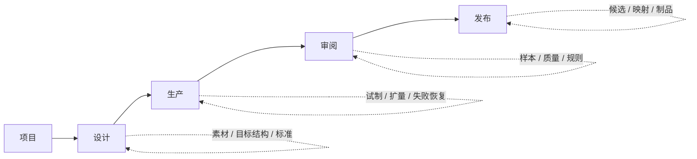
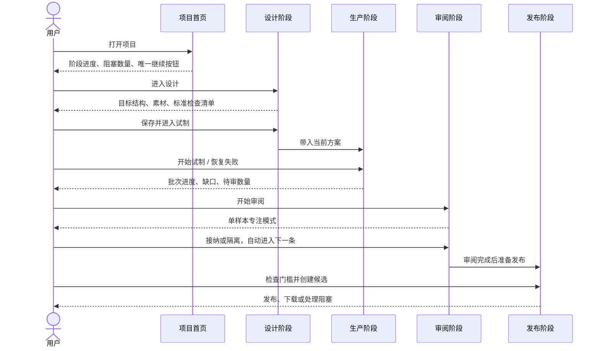
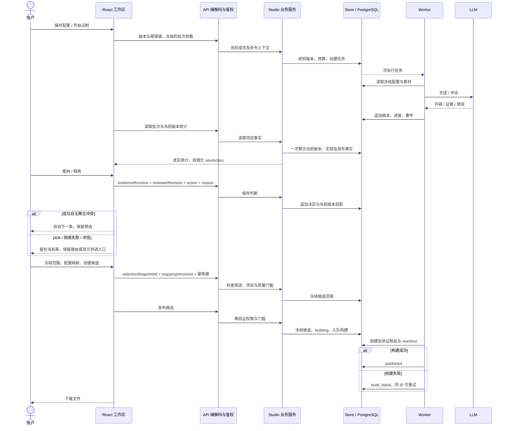
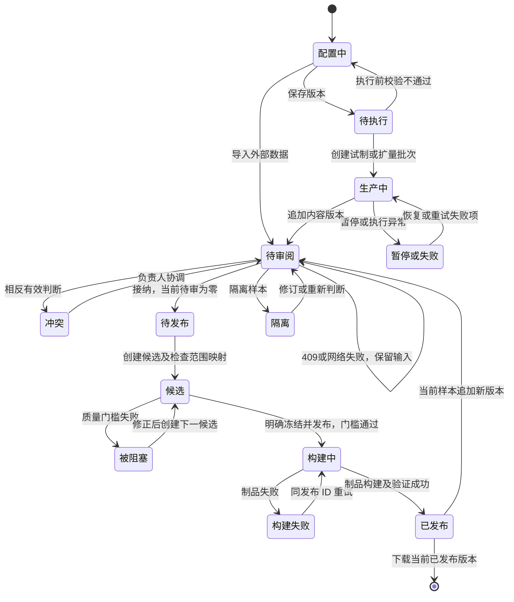

# Atelier 产品主线与页面重构方案

## 1. 重构目标

当前页面把功能目录当成了产品流程：项目下同时展示概览、设计、生产、数据、质量、发布，素材、规则、审阅和交付又分别藏在三十多个子路由中。用户必须理解系统内部模块，才能完成一次数据项目。

本次重构把产品改成一个明确的生产闭环：

> 选择项目 → 完成设计 → 启动生产 → 处理审阅 → 创建并发布交付

每个阶段首屏只回答三个问题：当前到哪一步、还缺什么、下一步做什么。页面保留真实 API 和旧深链接，改变入口与组合方式。

## 2. 目标信息架构



全局导航按“数据项目、待处理、方案库、交付库”排列；工具、设置、动态、历史资产进入同一个菜单。项目内突出“项目首页、设计、生产、审阅、发布”五入口；待处理是全局收件箱，不是第五个生产阶段。数据、质量、素材、规则等页面通过阶段内任务导航进入。

| 旧入口 | 新入口 | 页面内任务 |
|---|---|---|
| 概览 | 项目首页 | 当前阶段、阻塞、唯一继续操作 |
| 蓝图、覆盖、标准、素材、外部导入 | 设计 | 目标结构、素材、生成标准、设计检查 |
| 生产、试制、扩量、批次详情、失败 | 生产 | 采用当前方案、启动批次、恢复失败 |
| 数据、样本、质量、规则、审阅 | 审阅 | 待审队列、样本判断、质量门 |
| 发布、数据卡、映射、制品 | 发布 | 范围、格式、门槛、候选与发布 |

旧 URL 继续可访问，并通过 `navParent` 归入新阶段；不创建平行业务实现。

## 3. 关键操作流程



`nextAction` 由服务端事实及当前成员权限驱动，kind 为 design/run/review/release/done。前端直接使用服务端操作名称，不把只读用户的“查看”改成“开始”。版本存在仅显示“已配置”，不能代替执行前校验。发布完成要求当前已接纳版本全部包含在真实已发布范围内；新版内容必须重新审阅。

### 3.1 全链路职责



### 3.2 业务状态及边界



这张图是项目业务过程，不替代数据库枚举。批次、审阅、候选分别保留自己的状态机；部分接纳数据允许冻结候选，最终能否发布仍由后端质量门判断。

## 4. 页面布局规则

```text
┌──────────────────────────────────────────────────────────────────────────┐
│ Atelier │ 项目 │ 待处理 │ 方案库 │ 交付库               工具 账号        │
│ 项目面包屑                                                搜索          │
├──────────────────────────────────────────────────────────────────────────┤
│ 项目名称       设计 ─── 生产 ─── 审阅 ─── 发布       当前阶段 / 状态       │
├──────────────────────────────────────────────────────────────────────────┤
│ 阶段标题                         [唯一主操作]                             │
│ 当前状态 · 阻塞原因 · 预计下一步                                            │
│ ┌──────────────────────────────┬────────────────────────────────────────┐ │
│ │ 当前任务/列表                 │ 详情/检查器                             │ │
│ │ 每行直接提供下一操作           │ 默认收起高级参数与历史                   │ │
│ └──────────────────────────────┴────────────────────────────────────────┘ │
│                         [保存并继续 / 创建候选 / 发布] sticky action bar   │
└──────────────────────────────────────────────────────────────────────────┘
```

首屏删除口号、长篇契约解释、重复统计和英文装饰。规则说明放入 tooltip 或折叠；错误说明原因及修复动作。一个操作区只有一个主按钮，不在同一首屏重复“继续”。必要参数及安全确认不能为了减少点击而隐藏。完整逐页线框与五态见 [页面原型](../prototypes/product-flow-rebuild.md)。

## 5. 分步执行

| 阶段 | 实现范围 | 完成标准 |
|---|---|---|
| P0 主线冻结 | 阶段模型、路由归属、文案规则、兼容策略 | 所有页面能映射到一个阶段 |
| P1 项目壳层 | 五阶段导航、阶段进度、项目首页 | 用户从首页一步进入唯一下一步 |
| P2 行动台 | 今日页改为待处理数字与项目继续列表 | 待审、运行、发布阻塞都有直接入口 |
| P3 设计工作区 | 素材/导入/目标/标准组合成设计任务流 | 保存设计后直接进入试制 |
| P4 生产工作区 | 当前方案一键带入、批次进度、失败恢复 | 每个批次只有一个主动作 |
| P5 审阅工作区 | 单样本专注模式、接纳/隔离自动下一条 | 不离开审阅页即可完成队列 |
| P6 发布工作区 | 范围→格式→门槛三步 | 创建候选与处理阻塞在同一工作流 |
| P7 验证清理 | Chromium 主线、移动端、旧深链、状态五态 | 无横向溢出、无死路、主线可闭环 |

本轮范围是完整 P0–P7，不以导航或配色改动替代核心操作区。并行分工按文件边界展开；所有阶段集成后再运行统一流水线。

### 5.1 重构范围与安全约束

| 页面 | 默认任务与关键字段 | 主操作 | 必须保留的边界 |
|---|---|---|---|
| 项目列表 / 首页 | 名称、目标、计划量、真实状态；首页阶段事实及 nextAction | 新建项目 / 服务端下一步 | 搜索分页、稳定项目 ID、错误不是空列表 |
| 新项目 | 项目信息 → 规模 → 质量与预算 | 下一步 / 创建 | 草稿恢复、预算单位、重复提交幂等 |
| 设计 | 左侧配置步骤，右侧当前字段；目标结构、素材、标准直接进入 | 保存当前方案 / 进入试制 | 未保存不能执行，历史只读，409 保留草稿 |
| 素材 | 来源清单、内容预览；切分策略及导入记录折叠 | 上传 / 关联到目标结构 | 上传容量、解析轮询、当前版本范围 |
| 数据导入 | 文件、自动格式、导入名称、服务端预览 | 确认导入 | 无写权限禁用；修改输入使预览失效；明确确认才写入 |
| 生产 | 当前方案、试制数量、预算；批次完成量、缺口和失败 | 试制 / 扩量 / 查看当前批次 | 执行前检查、冻结版本、只重试失败项 |
| 审阅 | 内容与判断两栏，接纳/隔离、理由、自动下一条 | 保存并下一条 | 草稿导航确认、409 不跳、聚合冲突不跳、权限只读 |
| 发布 | 范围 → 格式映射 → 确认候选；候选门槛及文件 | 创建候选 / 发布 / 下载 | 跨项目及错误用途快照禁止；映射未保存禁止继续；创建不等于发布 |

统计口径：generated 统计历史内容版本；structureValid、accepted、quarantined 使用当前内容版本；inspected、scored 按当前版本去重实验事实。pendingReview 包含 pending 与 conflict。接纳率分子为“进入实验且已接纳”的当前版本，分母为 inspected；无实验显示未评测，不返回虚构 0%。聚合查询失败必须返回错误，不得显示成功的零统计。

| 对比维度 | 重构前问题 | 本轮处理 |
|---|---|---|
| 首屏 | Hero、口号、解释、版本账本竞争注意力 | 标题、状态、列表及唯一当前操作 |
| 导航 | 内部模块六页并列，子路由难发现 | 四阶段 + 项目首页，阶段内任务导航 |
| 设计 | 画布优先，填写区被压缩 | 步骤表单优先，依赖图按需展开 |
| 生产 | 用户重新找版本，日志淹没进度 | 默认当前配置，进度优先，高级版本折叠 |
| 审阅 | 三栏挤压正文，反复返回队列 | 内容 + 判断，成功自动下一条 |
| 发布 | 范围/映射/说明混排 | 三步确认，候选页文件及门槛优先 |
| 可靠性 | 状态/CTA 无法进入审阅与发布，零统计误导 | service 判定 nextAction，store 当前版本聚合 |
| 窄屏 | 多层 padding 与旧 rail 覆盖 | 单一壳层样式、单列操作区、局部滚动 |

## 6. 五种界面状态

| 状态 | 设计要求 |
|---|---|
| `Default` | 显示真实项目状态、待办数量和唯一主操作 |
| `Loading` | 保留页面结构，局部加载，不让导航或操作跳动 |
| `Empty` | 说明缺少的事实，并提供直接创建/上传按钮 |
| `Error` | 错误就地展示，附带重试或返回上一步动作 |
| `Edge-Case` | 长文本换行，列表可横向滚动，窄屏改为单列，按钮不重叠 |

## 7. 验收

- 项目首页不再出现重复的“旅程、承诺、版本账本”叙事卡片。
- `/today` 首屏保留六项真实事实及待办队列，动态默认折叠。
- 项目导航只突出五个业务阶段，辅助页面通过阶段内入口进入。
- 从项目首页开始，最多一次点击进入服务端返回的 `nextAction`。
- 旧 Atelier 深链接 `/p/p_1/blueprint`、`/p/p_1/sources`、`/p/p_1/runs/b_2`、`/p/p_1/review`、`/p/p_1/releases/3` 等仍可打开，并高亮所属阶段、保留 query。`/console/...` 历史桥接遵循既有路由映射，可落到只读历史资产，不混同为项目深链。
- 桌面 1440px 与移动 390px 下无横向溢出；所有阶段覆盖 Default、Loading、Empty、Error、Edge-Case。

### 7.1 可复现验收方法

| 验收项 | 方法 | 判定 |
|---|---|---|
| 主线可发现性 | 项目首页 nextAction；每阶段任务导航 | 下一步一次点击可进入，不依赖全局已选项目 |
| 导入效率 | 上传 Alpaca/ShareGPT/JSONL 文件 | 自动识别并预览；一次明确确认后导入 |
| 审阅效率 | 两条待审样本，保存第一条 | 不回列表，筛选不丢，直接第二条 |
| 审阅安全 | 修改理由后离开、409、冲突、viewer | 取消离开保留；失败不跳；viewer 无提交按钮 |
| 发布安全 | 错用途/跨项目快照、dirty mapping、网络重试 | 阻止继续，重试使用同一有效命令幂等键 |
| 状态事实 | 临时 PostgreSQL 新版本及发布范围测试 | 历史接纳不继承，已发布不能覆盖新版待审 |
| 响应式 | Chromium 1440×900、390×844 截图及 scrollWidth | 正文可读，页面无横向溢出；表格/画布局部滚动 |
| 兼容 | 旧深链、浏览器返回、刷新、动态路由 | 正确项目和阶段高亮，参数及权限保留 |

验证包括 Docker 前端类型检查与构建、导航/生产/审阅发布守卫及 Chromium 交互、Go 格式/vet/build/test、临时数据库测试、全部 SQL 迁移冒烟和 Compose 集成。执行结果单独记录在交付说明，不用方案目标冒充已通过结果。

## 8. 参考来源

> UI 参考：EasyDataset，https://github.com/ConardLi/easy-dataset ，本地审计版本 `4002b09`。借鉴其紧凑工作区、直接项目操作、内容与配置层次；不是仅复制蓝色主题，也不引入其另一套业务逻辑。
>
> 项目既有设计：`docs/design/2026-09-20-console-rebuild/`、`docs/architecture/blueprint-workflow-rearchitecture.md`。旧路由、版本及权限契约保留，本方案更新用户入口及操作顺序。
