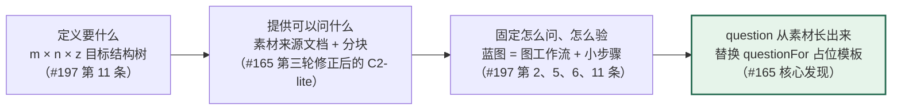
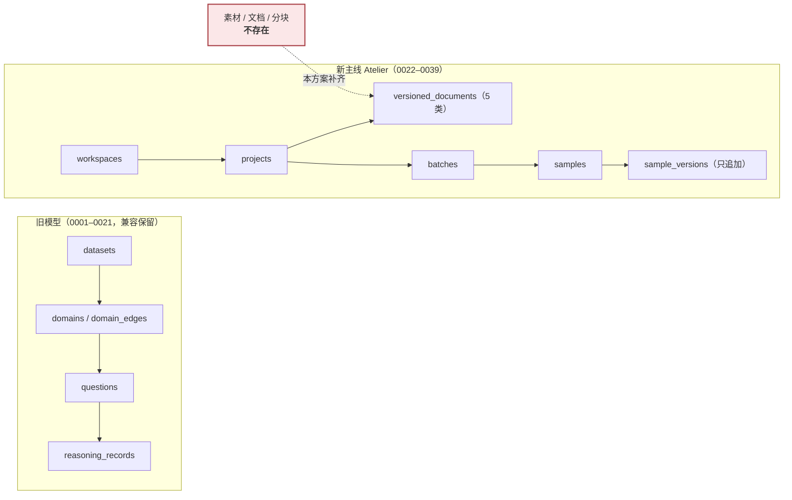
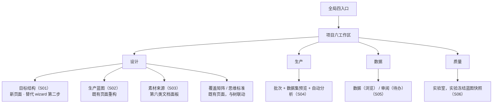
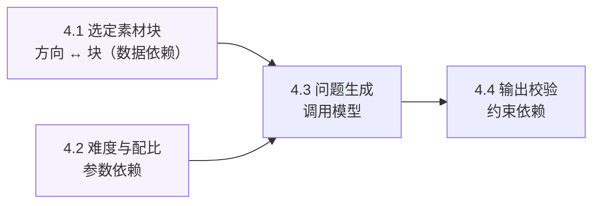
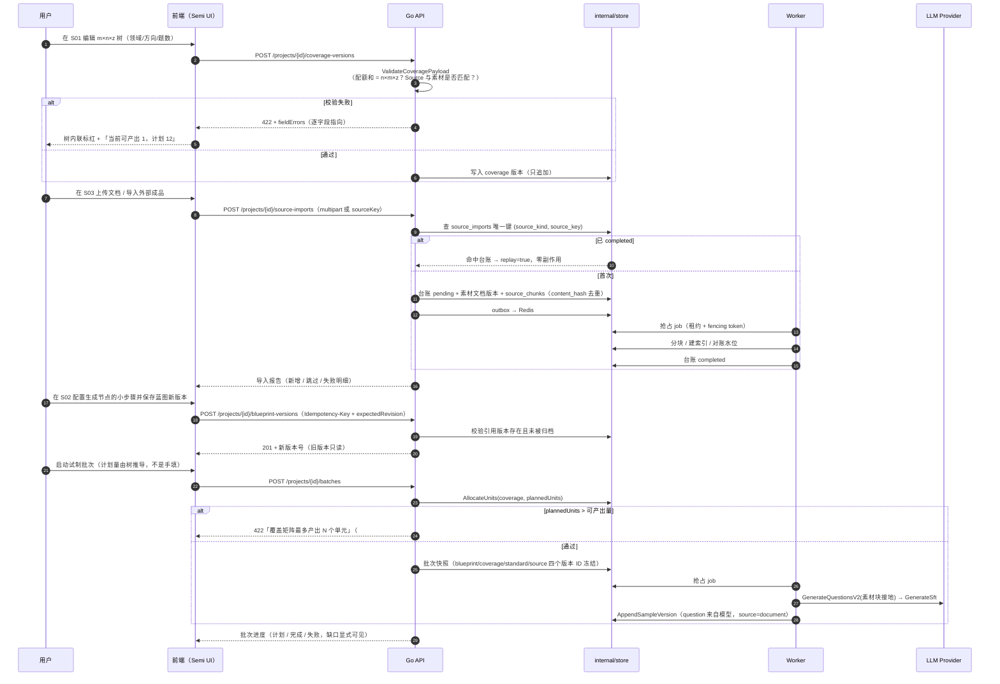
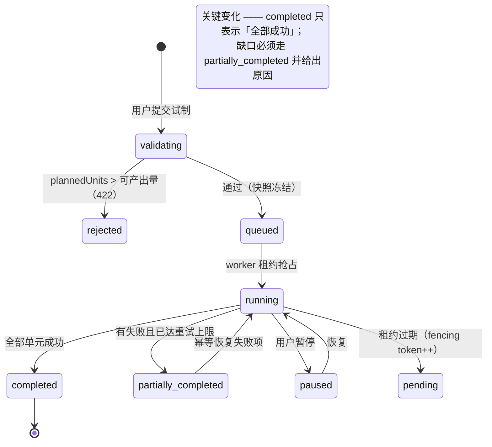

# 蓝图工作流化改造：数据结构与前端架构

> **状态**：设计提案（未修改任何产品代码）
> **输入**：讨论 [#165](https://github.com/1420970597/llm/discussions/165)（Easy Dataset 集成可行性调研，含三轮勘误）、Issue [#197](https://github.com/1420970597/llm/issues/197)（用户测试问题汇总 17 条）
> **代码基线**：`main` @ [`0b18145`](https://github.com/1420970597/llm/commit/0b18145)
> **可运行原型**：`docs/prototypes/blueprint-workflow-rearchitecture/prototype.html`（单文件，双击可开）
> **逐项 TODO**：`docs/prototypes/blueprint-workflow-rearchitecture/README.md`

---

## 0. 一句话结论

**#165 的结论「只接产物，不合库、不嵌 UI」在第三轮勘误后只剩半句成立：连产物也不必接 —— 上游没有为中间产物设计导出面；真正缺的能力在本仓库内部（素材输入 + 真实问题生成），而 #197 里 17 条中的 12 条，都是这条链路断裂在界面上的投影。**

因此本次改造不是「再做一个页面」，而是三件事的同一件事：



---

## 1. 两条线的交汇点（为什么必须一起做）

### 1.1 #165 提供的三条硬事实

第三轮勘误（讨论评论 3）推翻了前两轮的核心前提，修正后的事实是：

| 事实 | 证据 | 对设计的影响 |
|---|---|---|
| **上游不导出中间产物** | `app/api/**/chunks/*` 与 `app/api/**/tags/*` 下 0 个 export 路由；chunks 导出仅存在于客户端 `ChunkListHeader.js` 的 `new Blob` 按钮 | 「导入 chunks + tags」这条路径**不存在**，不能作为设计前提 |
| **标签挂在问题上，不在素材块上** | `prisma/schema.prisma:95` `Questions.label`；`Tags` 表无 chunk 外键 | 「素材块 ↔ 领域标签」是伪耦合；方向与素材的关联必须**人工建立**（原型 S03 的大纲面板已按此修正） |
| **`question` 在生成链路上是模板占位符** | `apps/worker/studio_batch.go:210` 与 `apps/worker/studio_grpo.go:236` 两份 `questionFor` 逐字相同；`GenerateQuestionsV2` 唯一调用点是旧路径 `job_questions_v2.go:77` | 这是真正要修的接口；素材能力是它的**前置输入**，不是新功能 |

### 1.2 #197 中与本次方案直接相关的条目

17 条里，有 12 条落在同一条链路上：

| #197 条目 | 归类 | 本次方案中的落点 |
|---|---|---|
| 2、5、6 | 蓝图节点配置不可用/晦涩/强制版本耦合 | S02 图工作流 + 小步骤 + 参数三层归位；保存即新版本，不需要用户理解"历史版本关联" |
| 11 | **业务主体 m×n×z 未体现；蓝图应为 Dify 式工作流画布** | S01 目标结构树 + S02 图工作流（**本次主轴**） |
| 3、13 | 数据不可预览；生产缺数据集结构与内容预览 | S04 数据集预览 + 自动分析面板 |
| 9 | 评估/清洗工作台与蓝图是信息孤岛 | S06 实验冻结蓝图版本快照，两处互链 |
| 12 | 「数据」菜单到底是什么 | S05 拆为「数据=浏览」与「审阅=待办」两种语义 |
| 10 | 今日工作数据不对 | S07 工作台总览，数字全部来自真实对象 |
| 14 | 质量页分子分母；新建实验无法获取模型列表 | S06「被评测数据集」表达 + 连接目录下拉 |
| 7、8 | 连接设置跳旧页面；列表项缺行内编辑 | S07 表内抽屉表单 |
| 15 | 新建用户未实现 | S07 用户名 + 密码直接创建（本部署无出站邮件） |
| 16 | 历史资产是否迁移完成 | S07 盘点表：未迁移 = 0 才允许移除入口 |

其余 5 条（1 分页、4 页面超长、17 样式）是**横切质量项**，本次以"不新增同类缺陷"为约束，集中修复排在改造之后（见 TODO W3）。

### 1.3 与 Issue #190 的关系

#190（批次「已完成」却只产出 1/12）不是独立缺陷，它是**同一个断裂的第二种表现**：

`PlannedUnits` 是用户填的数，`AllocateUnits()` 的输出受覆盖配额限制，两者从不比较（`internal/studio/batch_runner.go:430-458`），
于是「计划 12」与「可产出 1」可以同时存在，而状态机照样走到 `completed`。

目标结构树（S01）把**可产出量**变成服务端在保存版本时就能算出的确定值，这正是 #190 建议的修复方向 2 与 3 的合并版。

---

## 2. 数据模型设计

### 2.1 现状：两代模型并存，新主线缺素材



### 2.2 新增：第六类版本化文档 `source`

落点：`internal/model/studio_docs.go` 的 `AllDocumentKinds()` 多一个常量，`routes_documents.go` 的循环注册自动生效（该文件已用循环注册五类文档，新增一类**不需要新增路由代码**）。

```go
// KindSource 是第六类版本化文档：素材来源与切分策略。
//
// 为什么必须是版本化文档而不是附属表：切分参数（算法、长度、分隔符）会改变
// 最终产生的问题。如果它不随版本冻结，批次快照就无法解释「为什么这批问题是
// 这样的」—— 而这正是 Atelier 存在的理由（可复现）。
KindSource DocumentKind = "source"
```

payload 形状（`source.v1`）：

| 字段 | 类型 | 语义 |
|---|---|---|
| `documents[].stableId` | string | 稳定 ID，供方向引用与跨版本沿用 |
| `documents[].kind` | enum `markdown`/`txt`/`pdf`/`docx` | 解析器选择依据 |
| `documents[].contentHash` | string | 幂等去重依据（**本系统自行计算**，不依赖上游 —— 勘误 1 的修正） |
| `documents[].chunkCount` | int | 块数快照 |
| `chunking.algorithm` | enum `recursive`/`text`/`token`/`code` | 沿用上游真实词表；本系统默认 `recursive` |
| `chunking.separator` / `maxLength` / `minLength` | string / int / int | 切分参数（默认 `\n\n` / 2000 / 200） |
| `chunking.keepHeadingPath` | bool | 是否把章节路径写入块元数据 |

### 2.3 新增：`source_chunks`（素材块）

| 列 | 类型 | 说明 |
|---|---|---|
| `id` | bigserial | |
| `project_id` | bigint → projects | |
| `source_document_stable_id` | text | 指向 `source` 文档内的 `stableId` |
| `heading_path` | text | 章节路径，例如 `§1.2 温控验证` |
| `ordinal` | int | 块在该文档内的序号 |
| `content` | text | 块正文 |
| `content_hash` | text | **本系统计算的 sha256**，唯一键 `(project_id, content_hash)` |
| `created_at` | timestamptz | |

> **为什么 `content_hash` 由本系统算**：勘误 1 指出上游产物既无 `hash` 也无 `tagPath`；
> 把幂等依据放在一个不存在的上游字段上，会让"重复导入零副作用"这条承诺变成空话。
> 幂等的锚点必须在自己手里。

### 2.4 方向 ↔ 素材的关联：落地死字段 `CoverageDirection.Source`

`internal/model/studio_docs.go:236` 的 `Source` 字段**全仓库只有定义、从未被读取**。
本方案让它成为真实语义：

```
source ∈ { "document"（有素材接地）, "ai"（显式降级，按关键词生成）, "manual"（人工编写）, "none"（缺口） }
```

服务端校验规则（`ValidateCoveragePayload`）：

| 条件 | 结果 |
|---|---|
| `source = "document"` 且无素材块关联 | **422**，`fieldErrors` 指向该方向 |
| `source = "none"` 或 `quota = 0` | 允许保存，但在 UI 与导出数据卡中标为缺口 |
| `source = "ai"` | 允许，但必须在界面上显式确认过降级 |
| 全部方向的 `quota` 之和 ≠ 项目 `PlannedQuestions()` | **422**（这是 #190 的根因修复） |

**默认拒绝而非默认降级**：静默退回模板问题正是要消除的行为。

---

## 3. 前端架构

### 3.1 页面在既有信息架构中的位置（不新增顶级菜单）



**注意**：`m×n×z` 树**不是**新菜单，它是「设计 › 目标结构」，与「生产蓝图」「覆盖矩阵」「思维标准」「素材来源」同级。
这一点很关键 —— #197 第 11 条要的是「业务主体被明确体现」，而**再加一个菜单并不能体现主体，让主体成为所有页面的引用源才能**。

### 3.2 蓝图页面：从「纵向卡片列表」到「图工作流」

| 维度 | 现状 | 目标 |
|---|---|---|
| 画布 | `.blueprint-canvas` 是 `flex-direction: column` 的 7 张卡片，宽 890px，高 791px；无连线、无缩放、不可拖拽 | 点阵画布 + 绝对定位节点 + SVG 连线 + 缩放/适应 |
| 布局 | 画布 890px，右栏检查器 320px | 画布 `minmax(0,1fr)` + 检查器 420px；画布内部横向滚动 |
| 节点配置 | 右侧检查器一次性列出全部字段 | 节点级 → 小步骤级 → 运行级三层；小步骤在画布内展开 |
| 版本耦合 | 用户需理解「历史版本」与「强制关联」 | 保存即新版本；历史版本只读；不要求用户理解关联语义 |
| 可访问性 | 节点是可聚焦按钮（这一点**要保留**） | 保留键盘可访问；新增 `aria-current="step"`，Tab 顺序 = 视觉顺序 |

**小步骤（sub-steps）的设计约束**（#197 第 11 条明确要求「步骤不是单一的顺序结构」）：



4.1 与 4.2 是**并列的前置**（都要先定，才轮到 4.3），4.4 是**后置校验**。这就是「先明确参数结构，再做设计」的具体含义：
如果按顺序流程画，用户会以为 4.1 完成后 4.2 才可用。

### 3.3 参数三层归位（防止每个节点长出一套自己的表单）

| 层级 | 参数 | 存在哪里 | 改动影响 |
|---|---|---|---|
| 节点级 | 模型连接、温度 | `blueprint.v1` 生成节点字段 | 新批次生效；已运行批次用快照 |
| 小步骤级 | 每方向题数 z、难度配比 | 目标结构版本 + 生成节点 | 改变计划量，须重新校验可产出量 |
| 文档级 | 切分算法、块长度 | 第六类文档 `source` | 只影响之后导入与生成的批次 |
| 运行级 | 并发数、预算上限、批次大小 | 批次记录（**不属于蓝图**） | 只影响该次执行 |

> 这张表是 #197 第 11 条「先明确对应流程的参数结构再做设计」的直接回答。
> 没有这张表，7 个节点会各自演化出一套语义不同的表单 —— 那正是当前"配置方法不够明确"的成因。

### 3.4 与既有路由元数据的关系

`apps/web-user/src/studio/routes.ts` 是「路由 → 导航 → 面包屑 → 权限 → 实现状态」的唯一来源（该文件的注释解释了为什么必须只有一份）。
本次改造**只新增两条路由元数据**，不新增导航分组：

```
project.targetStructure   /p/:projectId/target-structure   设计 · 目标结构
project.source            /p/:projectId/source             设计 · 素材来源
```

两条都 `navParent: 'design'`，因此侧边栏高亮、面包屑、权限派生全部自动成立。

---

## 4. 端到端时序（目标态）



---

## 5. 批次状态机（#190 修复后的语义）



**与现状的差别**：现在只要 `ListBatchItems(Pending)` 为空就置 `completed`（`RefreshBatchCounts` + `BatchEventCompleted`），
不比较 `completedUnits` 与 `plannedUnits`。新语义要求两者相等才允许 `completed`。

---

## 6. 可复现性

```bash
# 1. 构建单文件原型（宿主机无 Node，走容器 —— AGENTS.md §1）
cd docs/prototypes/blueprint-workflow-rearchitecture
docker run --rm -v "$PWD":/w -w /w node:20-alpine node build.mjs

# 2. 起静态服务
cd docs && python3 -m http.server 8899 --bind 127.0.0.1

# 3. 采集原型截图（真实 Chromium，桌面 1440×1024 / 移动 390×844，断言无横向溢出）
cd /root/llm && node test/prototypes/capture-blueprint-flow.mjs

# 4. 采集现状基线（需要 docker compose up -d --build，真实栈 :3210）
node test/prototypes/capture-current-baseline.mjs
```

两个采集脚本都会在**任何一条断言失败时以非零退出**，因此可以直接当作 CI 守卫。

---

## 7. 风险与未验证项

| 编号 | 风险 | 等级 | 缓解 |
|---|---|---|---|
| R1 | **素材解析能力自建成本被低估** | 🟡 中 | 一期只做 Markdown + TXT；PDF/DOCX 独立成任务并允许无该能力时明确提示，不做伪实现 |
| R2 | 画布拖拽引入新的无障碍缺陷 | 🟡 中 | 拖拽是**增强**不是唯一路径：节点顺序与连接关系仍可用键盘与显式按钮编辑（现状的键盘可访问性必须保留） |
| R3 | 目标结构树与覆盖矩阵两份编辑入口 | 🟡 中 | 两者编辑同一个版本化文档；树是结构化视图，矩阵是表格视图，不允许出现第二份 payload |
| R4 | 替换 `questionFor` 会改变已有测试期望 | 🟡 中 | 先补回归测试再替换；两份副本合并为一处，`grpoQuestionFor` 删除 |
| R5 | 存量样本中 `question` 是模板形态 | 🟡 中 | **必须先查库盘点规模**；`sample_versions` 只追加，不得 UPDATE，只能新增规则命中证据或作废候选 |
| R6 | 上游 easy-dataset 活跃度 | 🟢 低 | 本方案**不依赖上游任何产物形状**（第三轮修正的结论），因此该风险被消除 |
| R7 | 许可传染 AGPL §13 | 🟢 低 | 不复制其代码、不部署其界面、不调用其 API；仅在设计思路上参考（第五节的竞品矩阵已注明） |

**未验证项**（诚实标注）：

- ❌ 未实际运行 easy-dataset：本方案的第三轮结论来自**上游源码静态审计**（`main`，含 `app/api/**` 导出面枚举），未运行其服务；但由于方案不再依赖其产物形状，该未验证项不影响结论。
- ❌ 未做性能评估：10 万级文档下 Go 侧分块与 `source_chunks` 写入的吞吐未实测。
- ❌ 未做用户访谈：五态定义与信息架构来自 #197 的 17 条反馈与既有设计文档，不是新访谈结果。
- ❌ 存量 `question` 模板形态规模未查库（R5），TODO P0-1 的第一步就是它。
