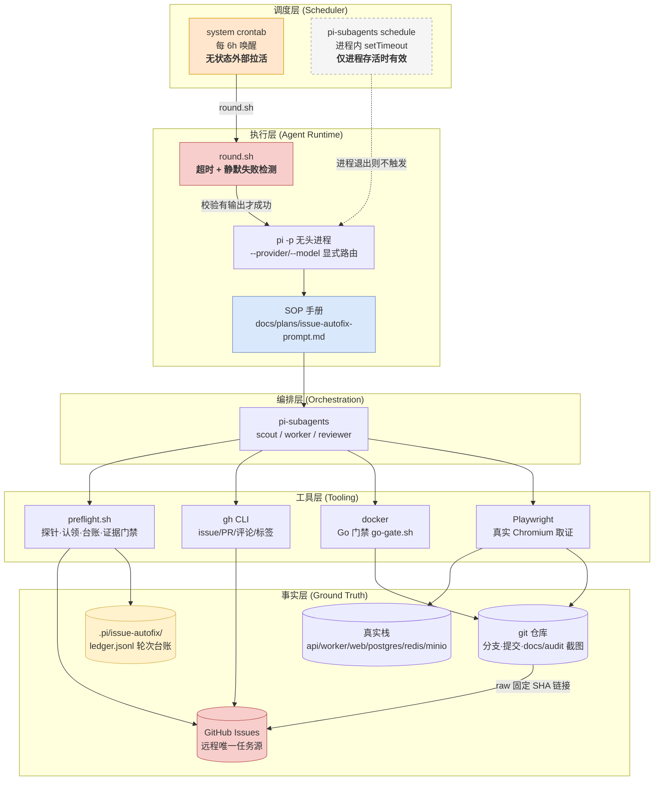
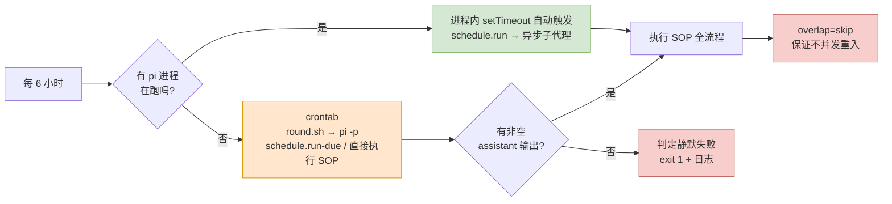
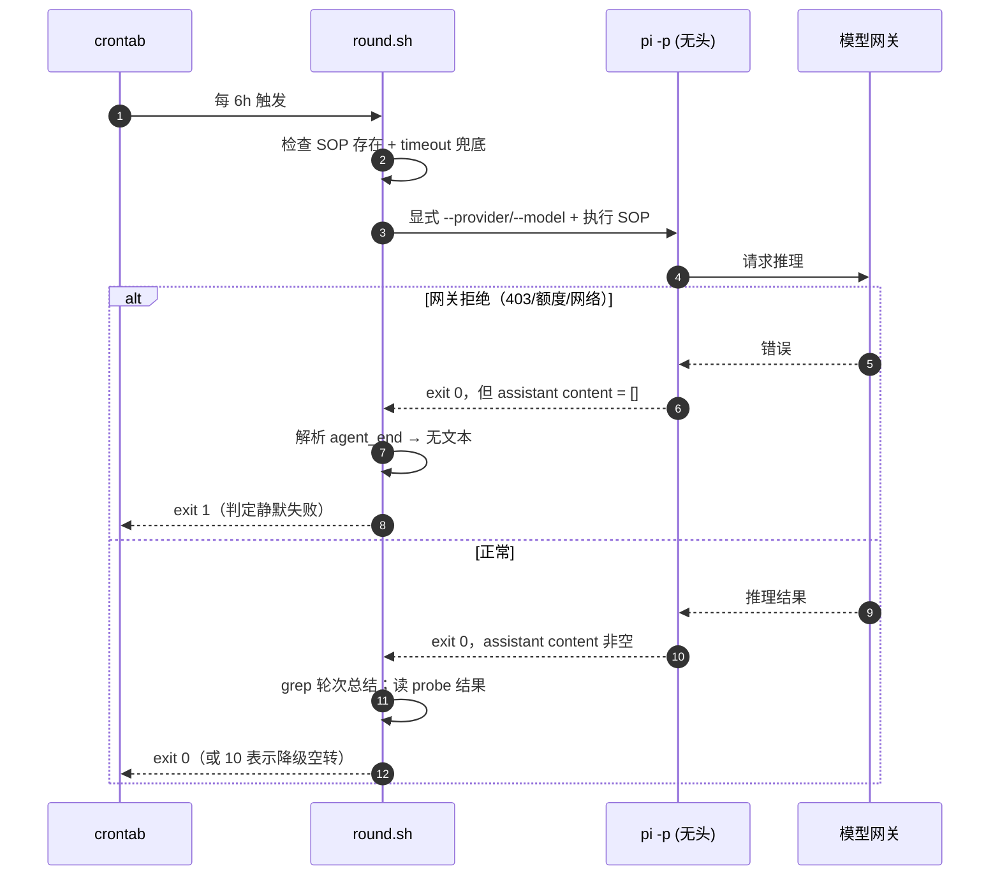
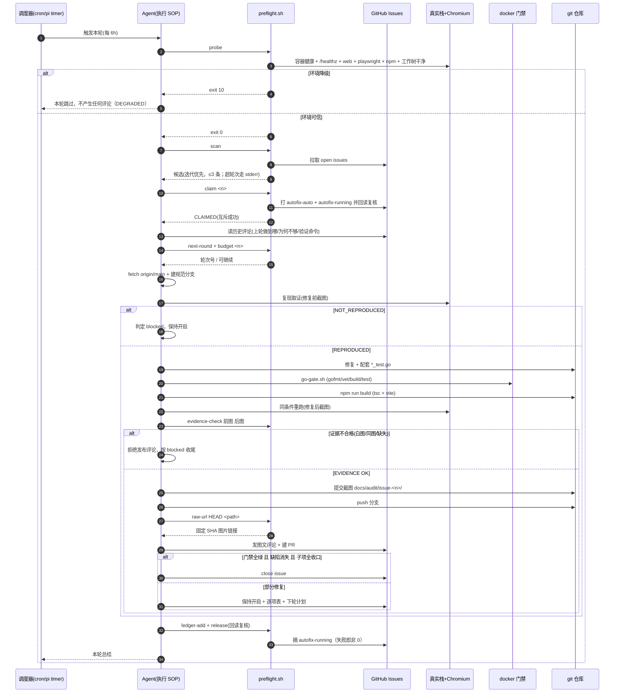
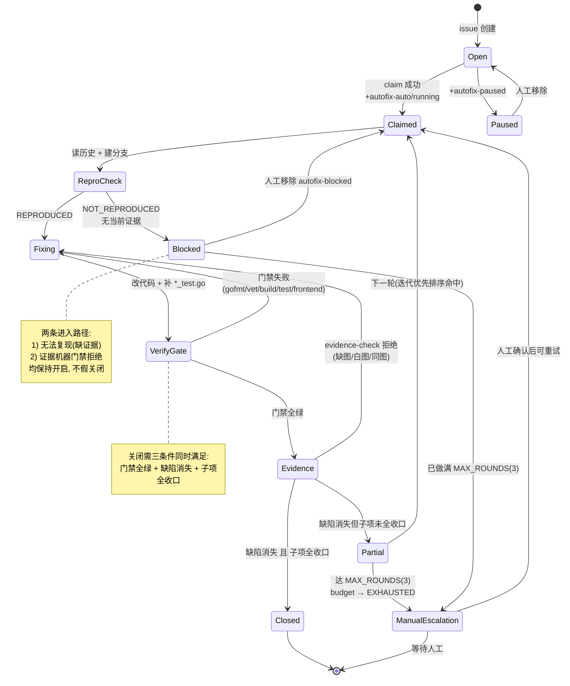
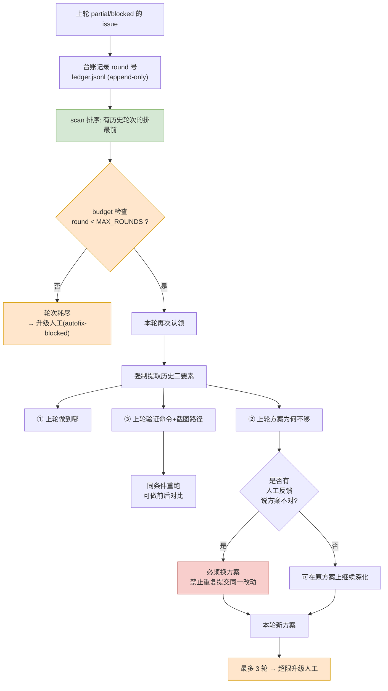
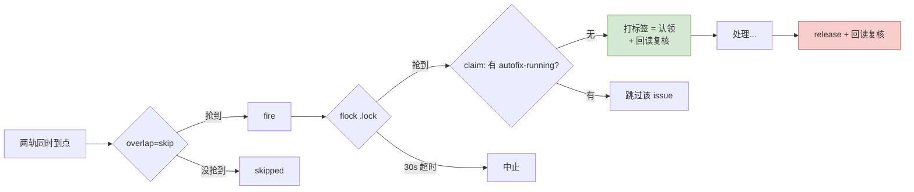
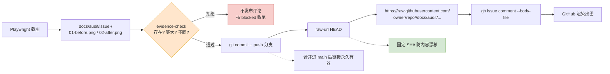

# issue-autofix：issue 自动修复迭代环架构设计

> 状态：已实施（v1） · 日期：2026-09-28 · 适用仓库：`1420970597/llm`
>
> 关联交付物：
> - 操作手册（定时任务执行依据）：[`docs/plans/issue-autofix-prompt.md`](../plans/issue-autofix-prompt.md)
> - 前置探针 / 认领锁 / 轮次台账：`scripts/issue-bot/preflight.sh`
> - 外部调度轨道（cron 拉活）：`scripts/issue-bot/round.sh`
> - 仓库运行约束：[`AGENTS.md`](../../AGENTS.md)

---

## 1. 需求与问题定义

### 1.1 需求

每 6 小时自动从远程仓库拉取最新 issue，逐条分析并修复；修复后需**图文并茂**回评到
issue 并操作其状态；对上一轮未解决的疑难 issue，需依据历史评论制定并实现进一步修复
方案，**自动迭代**直至收敛。

### 1.2 真正的难点（不是「调用 LLM 修 bug」）

| # | 难点 | 为什么难 | 本设计对策 |
| --- | --- | --- | --- |
| D1 | **无人值守下的可信度** | 没人复核评论。最危险的失败不是「没修好」，而是**谎报修好了** —— 缺陷被埋进历史 | §4.3 硬门禁 + §4.4 关闭三条件 + §4.5 证据自检表 |
| D2 | **环境不可信导致误判** | 判定标准是「真实栈 + 真实 Chromium 复现」。环境坏了会把「环境故障」误判成「缺陷仍在/已修复」 | §4.1 前置探针 + **降级即空转** |
| D3 | **疑难问题需要真正迭代** | 一轮修不完的 issue 必须跨轮次累积进展，且要吸收人工反馈换方案 | §4.6 台账 + 迭代优先排序 + 历史三要素 + **代码级轮次上限** |
| D4 | **图文并茂的图片无法通过 API 上传** | GitHub 评论 API 不支持图片附件 | §4.7 截图入库 + `raw.githubusercontent.com` **固定 SHA** 引用 + 机器证据门禁 |
| D5 | **无头进程的静默失败** | `pi -p` 在模型/网关失败时**仍可能 exit 0** 且无任何 assistant 输出；cron 直调会「什么都没做」却看起来成功 | §3.3 外层包装器校验「有非空 assistant 输出」 |
| D6 | **并发与重复处理** | cron 拉活与进程内定时器撞车可能重复处理同一 issue | §4.6 标签锁 + `flock` 跨进程互斥 + `overlap=skip` |

---

## 2. 系统关系与模块分层



**分层职责边界**（对齐 `AGENTS.md` §3）：

| 层 | 职责 | 明确不做 |
| --- | --- | --- |
| 调度层 | 唤起执行层；提供 catch-up | **不**承载业务逻辑；不判断 issue 是否该修 |
| 执行层 | 读取 SOP 并严格执行；检测静默失败 | **不**把规则烧进 prompt（规则变更不该改调度配置） |
| 编排层 | 子代理分工（复现/修复/评审） | **不**直接操作 GitHub |
| 工具层 | 可判定的机器事实 | **不**做「心证」——一切判定二选一 |
| 事实层 | 唯一权威来源 | 台账仅记轮次，**不**复制 issue 正文（避免双源冲突） |

> **设计要点：SOP 与调度解耦。** prompt 只写「读这份 SOP 并执行」，
> 所有判定规则、门禁命令、评论模板都在版本化管理的手册里。
> 这样改规则 = 改文档 + 提交，可 review、可回滚、可追溯，而不是改一段看不见的调度配置。

---

## 3. 调度架构：为什么是双轨 + 一层包装

### 3.1 关键事实（已实测确认，非推测）

| 事实 | 证据 | 影响 |
| --- | --- | --- |
| pi-subagents 的 schedule 用**进程内 `setTimeout`** 触发 | `runs/background/scheduled-runs.ts:799` `this.timersApi.setTimeout(...)`，`:808` `timer.unref?.()` | 无 pi 进程存活时不会**自动**触发 |
| 定时器只在工具调用时 `restore()` 恢复 | 同文件 `:968` `this.restore(store)` | 进程重启后需有一次工具调用才会重新武装 |
| **`schedule.run-due` 能从一个短命进程里真正拉起独立运行** | **实测**：用 `pi -p`（跑完即退）执行 `run-due`，schedule 事件流出现 `schedule.run.started` → `attached_async` → `completed`；子运行在 `/tmp/pi-subagents-uid-0/async-subagent-runs/<id>/` 有**自己的 pid** 与 42s 真实执行时长 | cron 轨道是**有效**的补足手段（不只是「催醒」，而是真的把活干完） |
| **`pi -p` 在模型失败时仍 exit 0** | 实测：默认 provider 被网关拒绝（403），事件流无 assistant 文本，退出码 **0** | **必须外层校验输出**，否则 cron 静默空转 |
| `~/.pi/agent/settings.json` 的默认模型 id 无效 | 实测：`defaultModel = deepseek/deepseek-v4-flash`，而 provider 实际只提供 `deepseek-v4.1-flash` → 裸 `pi -p` 无输出 | 调度**必须**显式写死 provider/model |
| **cron 的 PATH 不含 pi 的安装目录** | **实测**：首次 cron 触发产出 `timeout: failed to run command 'pi': No such file or directory` + **exit 127** | 必须补全 PATH，否则「已注册」的定时任务一次都跑不成 |
| 系统 cron 可用 | `systemctl is-active cron` → `active` | 可作为无状态拉活器 |

### 3.2 双轨设计



- **轨道一（进程内）**：pi 进程存活时由 `setTimeout` 自动触发，是常规路径。
- **轨道二（外部拉活）**：crontab 调用 `round.sh --due-only`，用 `pi -p` 执行
  `schedule.run-due`，把「进程已退出」导致的漏跑补回来。
  **实测确认它真的能把活干完**：schedule 事件流会记下 `started → attached_async → completed`，
  且子运行是**脱离父进程的独立运行**（自己的 pid + 独立 async 目录），
  因此 `pi -p` 退出不会杀掉它。
- **`overlap: skip`（默认，不可配）**：两轨同时到点也只会跑一个，天然防重入。
- **`catchUp: latest`**：长时间停机后只补最近一次，不雪崩式补跑历史。

> **PATH 是本轨道的真实绊脚石（已踩到并修复）**：cron 的默认 PATH 只有
> `/usr/local/sbin:/usr/local/bin:/usr/sbin:/usr/bin:/sbin:/bin`，**不包含** pi 的安装目录。
> 首次 cron 触发的实际结果是
> `timeout: failed to run command 'pi': No such file or directory` + **exit 127** ——
> 定时任务看起来「已注册」实则一次都跑不成。现由两处共同防护：
> `round.sh` 自行前置 `~/.local/share/pi-node/current/bin`（版本无关的符号链接）
> 并在找不到 `pi` 时输出可读的 FATAL 原因；crontab 里另显式声明 `PATH=` 作为纵深防御。
>
> **两个已上线后才暴露、且都很隐蔽的缺陷（实测）**：
>
> 1. **锚点与 cron 边界不对齐**：schedule 的 `anchorAt` 是创建时刻（如 `:23`），
>    而 crontab 是 `0 */6`（`:00`）。于是 `--due-only` 在 `:00` 检查时
>    「下一次运行是 `:23`」→ **判定无到期任务**。实测 18:00 那次的输出正是
>    `No schedules are due.` —— 轨道二看着装好了，实际每次都是空跑。
> 2. **未设 `timeoutMs` 会退回 30 分钟默认值**：`pi-subagents` 对单代理异步运行的
>    默认超时是 30 分钟（`runs/background/subagent-wait.ts:76`），而真实轮次耗时
>    跨度是 **11 分钟 ~ 2.5 小时**。实测 20:23 那轮**恰好卡在 30.0 分钟被杀**，
>    来不及收尾，以致 `#191/#160/#214` 的认领锁全部残留。
>
> 教训：**“配置看起来对”不等于“配置真的生效”**。两个缺陷都不报错、不崩溃，
> 只是安静地什么都不做（或做一半），必须靠“检查实际事件流/耗时”才能发现。
>
> 这是本设计的诚实之处：不假装 pi 自带守护进程能力。定时任务的**正确性**由
> 「标签锁 + 台账 + overlap=skip + 陈旧锁自愈」保证，**触发可靠性**由双轨补足。

### 3.3 为什么还需要 `round.sh` 这一层（D5 的落地）

无头调用有一个反直觉的失败模式。实测事件流显示：当 provider 路由不可用时，
`pi -p --mode json` 会正常输出 `session`/`agent_start`/`message_start` 等事件、
正常 `agent_settled`、并**以退出码 0 结束**，但 assistant 的 `content` 是**空数组**。



因此 `round.sh` 做三件事，缺一不可：

1. **显式写死 `--provider` / `--model`** —— 因为本机默认模型 id 无效（§3.1）；
2. **解析 JSON 事件流，要求至少一次非空 assistant 文本** —— 把「exit 0 但什么都没说」变成硬失败；
3. **超时兜底 + 日志落盘 + 受契约约束的退出码** —— 让 cron 侧的失败可被发现。

> 注意：`--mode json` 下 **stdout 不是纯文本报告**，而是逐行 JSON 事件。
> 直接把 stdout 当轮次总结会得到一堆噪声 —— 必须解析 `agent_end` 事件里的消息体。

---

## 4. 核心流程

### 4.1 全链路时序



### 4.2 前置探针门禁

```bash
scripts/issue-bot/preflight.sh probe   # 0=可开工 10=降级 1=配置错误
```

| 探针项 | 判定 | 为什么必要 |
| --- | --- | --- |
| `gh auth status` | 必须通过 | 否则无法取 issue/评论 |
| 仓库解析 | 必须成功 | 否则不知道操作对象 |
| `scripts/go-gate.sh` 可执行 | 必须存在 | 后端门禁唯一权威入口；缺失属配置错误 |
| **工作树干净** | 必须为空 | 脏基线会让「修复前证据」不可信 |
| `origin` 可达 | 必须通过 | 无法 fetch 最新 issue / main |
| 6 个容器 running | 必须全绿 | 判定标准依赖真实栈 |
| api `/healthz` + web `200` | 必须 200 | 栈可用性 |
| playwright 存在 | 必须存在 | 缺它无法产出「图文并茂」证据 |
| npm 可用 | 必须存在 | 前端 `tsc + vite` 门禁需要 |
| `docs/audit` 已跟踪 | **输出非空** | 决定评论贴图路径是否可用 |

任一项失败 → `exit 10`（或配置性错误 `exit 1`）→ **本轮空转，不写任何评论**。

> **一个真实的空判陷阱**：`git ls-tree <dir>` 对**不存在的目录也返回 exit 0 且无输出**。
> 若像直觉那样写 `git ls-tree ... >/dev/null 2>&1` 判退出码，这一项**永远是绿的**，
> 探针会假装检查了贴图路径。必须判「输出非空」。

### 4.3 状态机（issue 生命周期）



**唯一允许的四种落点**（无第五种）：

| 落点 | 条件 | GHA 操作 | 台账 |
| --- | --- | --- | --- |
| 关闭 | 门禁全绿 **且** 复现确认消失 **且** 子项全收口 | `close` | `fixed` |
| 部分修复 | 有真实进展，仍有子项未收口 | 保持开启 + 下轮计划 | `partial` |
| 升级人工 | 满 3 轮无实质进展 / 超能力边界 | `+autofix-blocked`，保持开启 | `blocked` |
| 无法取证 | 环境或复现手段不足 | 保持开启 | `blocked` |

### 4.4 自动迭代机制（D3 的落地）

「疑难问题自动迭代」由四件事共同实现，缺一不可：



| 机制 | 实现位置 | 作用 |
| --- | --- | --- |
| 轮次台账 | `.pi/issue-autofix/ledger.jsonl`（append-only） | 记住每条 issue 走到第几轮、上轮结论 |
| 迭代优先排序 | `scan` 子命令：有历史轮次的排前，同组内按 `updatedAt` 升序 | 未收口问题每轮都被优先处理 |
| **轮次预算执行** | `scan` 过滤 + `claim` 前置检查（`budget`，退出码 3） | 超限不再自动重试，强制转人工 |
| 历史三要素提取 | SOP §3 | 让本轮**站在上一轮之上**，而非从零重来 |

> **轮次预算必须由代码执行，不能只写在文档里。**
> 一个只在文档中声明、而没有任何代码路径检查的「上限」，等于没有上限；
> 模型一旦不遵守手册，就会无限重试同一条 issue。本设计把它做成
> `scan` 的过滤条件 **与** `claim` 的前置退出码（`3`），让「超限」成为机器事实。
>
> **为什么台账是 append-only**：需要回答「第 3 轮到底做了什么」，用于复盘自动化
> 流程本身。改写历史会让这个能力失效。台账放在 `.pi/`（已在 `.gitignore`），
> 不污染工作树。

### 4.5 防谎报的硬约束（D1 的落地）

| 约束 | 机制 | 防的是哪种失败 |
| --- | --- | --- |
| 先证伪再动手 | §5 必须先 `REPRODUCED` 才允许改代码 | 「代码看起来有问题」就改 → 改错地方 |
| 同条件前后对比 | 复现命令/视口/账号必须与修复前一致 | 用「换个环境就好了」冒充修复 |
| **证据机器门禁** | `evidence-check` 校验两图存在、非空白、**互不相同** | 用文字代替截图 / 用同一张图冒充前后 |
| 门禁按**输出**判定 | 必须用 `scripts/go-gate.sh` | `gofmt -l` 有问题时仍 `exit 0`，假绿 |
| 关闭三条件 | 门禁 ∩ 缺陷消失 ∩ 子项收口 | 为「本轮有产出」而假关闭 |
| 未收口必须列出 | 评论模板 §7 强制小节 | 聚合型 issue 只报喜不报忧 |
| 无法复现即 blocked | 保持开启 + 打标签 | 把「复现失败」美化成「已修复」 |
| 认领后必须释放并复核 | `release` 回读标签 | 残留 `autofix-running` 导致该 issue 永久失联 |

> `go-gate.sh` 的必要性有仓库内的前车之鉴：本仓库已因 `gofmt -l && go test` 的
> 短路语义漏过两次（#94 与 PR #151）。

### 4.6 并发与重复保护



| 层级 | 机制 | 覆盖场景 |
| --- | --- | --- |
| 调度 | `overlap: skip` | 同一 schedule 的两轨并发 |
| 进程 | `flock -w 30 .pi/issue-autofix/.lock` | 两个 pi 进程同时进入认领临界区 |
| 业务 | `autofix-running` 标签 + 认领后复核 | 跨机器/跨会话的 issue 级互斥 |
| 突发 | `MAX_PER_ROUND=3` | 大量 issue 一次涌入 |

> **认领后必须复核标签真的落下**：`gh` 返回成功 ≠ 状态已可见。
> 同理，收尾**必须 `release` 且复核**，否则该 issue 被永久认定为「已被认领」，
> 再也不会被任何一轮处理 —— 这是最隐蔽的故障模式。

### 4.7 图文并茂的证据链（D4 的落地）

GitHub 评论 API **不支持**上传图片附件，因此：



**链接保鲜规则**：用**固定 commit SHA** 而非分支名（防止后续提交让链接内容漂移）；
在 issue 关闭前不要删除承载证据的分支（未合并的 SHA 在分支删除后 404）。

---

## 5. 竞品对比与选型评估

候选方案对比（≥3 个市面成熟竞品 + 本方案），维度 ≥6：

| 维度 | **GitHub Copilot coding agent** | **Sweep AI** | **Devin / Devin Action** | **纯 shell 脚本自研** | **本方案（pi-subagents + SOP）** |
| --- | --- | --- | --- | --- | --- |
| 触发架构 | 云托管，issue 指派即触发（assign → PR） | 云托管，issue/PR 事件驱动 | 云托管/API，Devin Action 触发 | 本地 cron 串命令 | **双轨：进程内 setTimeout + cron 拉活 `run-due`**，外层包装器防静默失败 |
| 扩展复杂度 | 低（开箱），但**行为不可编程** | 低-中 | 中（需 API/额度接入） | 高（每个 issue 类型都要手写逻辑） | **低-中（改 SOP 文档即改行为）** |
| 数据/证据标准 | PR diff + 会话日志 | PR diff | PR diff + 会话回放 | 取决于自研 | **强制「修复前+修复后」截图 + 机器门禁校验 + 固定 SHA raw 链接 + 门禁原始输出** |
| 容错与重试 | 平台托管重试 | 平台托管重试 | 平台托管 | 需自研（易漏幂等） | **overlap=skip + flock + 标签锁（含回读复核）+ 轮次台账 + 代码级 3 轮上限** |
| 自研成本 | 极低（但绑定平台） | 低（订阅） | 中-高（额度贵） | 高（幂等/证据/迭代全自建） | **中（两个 shell 脚本 + SOP 文档 + 一次调度注册）** |
| 依赖风险 | 依赖 GitHub 云与额度；**代码出域** | 依赖第三方云；**代码出域** | 依赖第三方云；**代码出域** | 无外部依赖 | **代码不出域（本地/自有基础设施），仅用 gh CLI 与仓库既有栈** |
| 疑难问题迭代 | 单轮为主，需人工继续引导 | 单轮为主 | 单轮/会话式 | 需自行设计 | **显式多轮迭代：台账记轮次 + 迭代优先排序 + 代码强制的轮次预算** |
| 与本仓库约束契合 | **弱**：不认 `AGENTS.md` 容器门禁/分支规范/测试配套 | 弱 | 弱 | 中（需手写全部规则） | **强：容器门禁、分支命名、`*_test.go`、图文文档规范全部内置** |
| 图文并茂评论 | 无（只有 PR） | 无 | 部分（会话链接） | 需自研 | **内置（截图入库 + 固定 SHA 引用 + 证据机器门禁 + 强制模板）** |
| 可审计性 | 平台黑盒 | 平台黑盒 | 平台黑盒 | 取决于自研 | **台账 append-only + SOP 版本化 + 完整会话留存 + 轮次日志** |

### 5.1 选型结论

选择**本方案**，核心理由：

1. **代码不出域**：本仓库是私有业务数据工厂，缺陷证据含真实用户界面与数据形态，
   不宜交给第三方云 agent 读取代码与截图。
2. **约束契合度是决定性的**：本仓库有强制的容器门禁（宿主机无 Go 工具链）、
   分支命名规范、`*_test.go` 配套要求、调研文档图文规范。
   通用云 agent 不认这些约束，产出会被 `AGENTS.md` §6 打回。
3. **迭代能力是硬需求**：需求明确要求「疑难问题自动迭代」。云 agent 普遍以单轮为主，
   本方案的轮次台账 + 迭代优先排序 + 代码级轮次预算是**显式设计**而非事后补救。
4. **可审计**：append-only 台账 + 版本化 SOP + 轮次日志，能回答「第 3 轮做了什么、
   为什么判 blocked」。

**代价（诚实记录）**：

- 触发可靠性弱于云托管（依赖 cron 拉活补足，见 §3.2），无高可用；
- 单轮吞吐有限（3 条/轮），大规模积压时需人工提高 `MAX_PER_ROUND`；
- 依赖本机存活（机器宕机则整体停摆）；
- 需要本机同时具备真实栈与 Playwright，环境不可用时整轮空转（这是刻意的取舍）。

---

## 6. 接口契约

### 6.1 `preflight.sh` 命令契约

| 命令 | 输出 | 退出码 | 幂等 |
| --- | --- | --- | --- |
| `probe` | 探针明细 | `0` 可信 / `10` 降级 / `1` 配置错误 | 是（只读） |
| `ensure-labels` | 标签创建结果 | `0` | 是（`--force`） |
| `scan` | `编号\t轮次\t标题`（≤3 行）；超轮次提示走 **stderr** | `0` | 是（只读） |
| `claim <n>` | `CLAIMED <n>` | `0` 成功 / `2` 已被认领或已暂停 / `3` 轮次耗尽 | 否（有副作用，但重入安全） |
| `release <n> [--blocked]` | 释放提示 | `0` 成功（含回读复核）/ `1` 复核失败 | 是（重入安全） |
| `next-round <n>` | 轮次号（≥1） | `0` | 是（只读） |
| `budget <n>` | `OK …` / `EXHAUSTED …` | `0` 可继续 / `3` 已达上限 | 是（只读） |
| `ledger-add <n> <r> <result> <branch> <pr> [note]` | 写入的记录 JSON | `0` / `1`（非法 result 或 round） | 否（append） |
| `ledger-show [n]` | 台账原文（按 issue 过滤走 JSON 解析） | `0` | 是（只读） |
| `evidence-check <before> <after>` | `EVIDENCE OK` / `MISSING`/`TOO_SMALL`/`IDENTICAL` | `0` / `1` | 是（只读） |
| `raw-url <ref> <path>` | 固定 SHA 的 raw 链接 | `0` / `1` | 是（只读） |

`result` 取值受约束为 `fixed` / `partial` / `blocked`（与 §4.3 四落点对应）。

### 6.2 `round.sh` 契约

| 项 | 行为 |
| --- | --- |
| 正常完成 | `exit 0`，轮次总结追加到 `.pi/issue-autofix/logs/round-<UTC>.log` |
| 探针降级 | 检测到 `probe: DEGRADED` → `exit 10` |
| 静默失败（退出码 0 但无 assistant 输出） | `exit 1` |
| 超时 | `exit 124`（`timeout` 语义） |
| SOP 缺失 | `exit 1`（拒绝无规则空跑） |
| `--due-only` | 只拉活 pi 内定时器 |
| `ISSUE_AUTOFIX_DRY_RUN` | 只打印将执行的命令 |

### 6.3 环境变量

| 变量 | 默认 | 含义 |
| --- | --- | --- |
| `REPO_ROOT` | `/root/llm` | 仓库根 |
| `ISSUE_AUTOFIX_DIR` | `$REPO_ROOT/.pi/issue-autofix` | 台账与日志目录 |
| `ISSUE_AUTOFIX_MAX_PER_ROUND` | `3` | 每轮认领上限 |
| `ISSUE_AUTOFIX_MAX_ROUNDS` | `3` | 单 issue 最大迭代轮数（**由代码执行**） |
| `ISSUE_AUTOFIX_MIN_SHOT_BYTES` | `5120` | 截图最小字节数（防白图） |
| `ISSUE_AUTOFIX_PROVIDER` | `my-custom-provider` | 调度用 provider |
| `ISSUE_AUTOFIX_MODEL` | `deepseek-v4.1-flash` | 调度用 model |
| `ISSUE_AUTOFIX_TIMEOUT` | `10800` | 单轮超时（秒） |

### 6.4 标签契约

| 标签 | 语义 | 谁设置 |
| --- | --- | --- |
| `autofix-auto` | 该 issue 由自动守护处理过 | 守护（claim） |
| `autofix-running` | **认领锁**，表示正在处理 | 守护（claim）→ 必须 release |
| `autofix-paused` | **人工刹车**，禁止自动处理 | 人工 |
| `autofix-blocked` | 已升级人工，退出自动重试队列 | 守护 / 人工 |

---

## 7. 界面状态定义（轮次报告 + 评论区渲染）

本系统是 CLI/无人值守形态，其「界面」有两处渲染面：**轮次总结输出**与
**issue 评论正文**。按 `AGENTS.md` §5.2 要求，逐一定义 5 大状态。

### 7.1 轮次总结输出（终端 / 轮次日志）

| 状态 | 触发条件 | 输出样例 |
| --- | --- | --- |
| **Default** | 正常完成 | `[issue-autofix round] probe: OK / claimed: #191(round 2) / #191 → partial · PR #205 / 台账已写 · 已释放` |
| **Loading** | 单条 issue 处理中（长耗时） | `[#191 r2] 复现取证中… (容器门禁运行 3m12s)` 逐步追加阶段行 |
| **Empty** | `scan` 无候选 | `[issue-autofix round] probe: OK / claimed: (无) — 无可认领 issue` |
| **Error** | 门禁失败 / 证据被拒 / gh 调用失败 | `[#191 r2] GATE FAILED: go test ./internal/store — 未提交评论；已 release；保持开启`；`[#191 r2] EVIDENCE REJECTED: 前后截图完全一致 — 不发布评论` |
| **Edge-Case** | 降级 / 超轮次 / 静默失败 / 大批积压 | `probe: DEGRADED(容器未运行: llm-worker-1) — 本轮跳过，未产生任何评论`；`#197 → blocked(round 3/3 已满)`；`FATAL: exit 0 但无 assistant 输出`；`scan 命中 27 条，本轮处理前 3 条` |

### 7.2 issue 评论正文（GitHub 渲染）

| 状态 | 触发条件 | 渲染要求 |
| --- | --- | --- |
| **Default** | 完整闭环 | 7 小节齐全：复现图 + 根因 + 改动表 + 验证图 + 门禁输出 + 残留风险 + 下轮计划 |
| **Loading** | 不适用（评论为终态发布） | — 长任务在**发布前**不产生任何评论，避免半成品污染时间线 |
| **Empty** | 不适用 | — 无进展时不发「本轮无进展」这类噪声评论；仅在状态变化时发 |
| **Error** | 门禁失败但仍需沟通 | 必须**明确写出未通过项**与失败原始输出，禁止模糊表述 |
| **Edge-Case** | 聚合型 issue（如 #197 的 17 条） | 必须逐项列表标注 `已修复/未修复/无法复现`，禁止只报喜 |

### 7.3 字符线框图：轮次总结输出布局

```text
┌──────────────────────────────────────────────────────────────────────┐
│ [issue-autofix round]                                                │  ← Header（轮次标识）
│  probe: OK            claimed: #191(r2), #197(r1)                    │  ← 门禁与认领摘要
├──────────────────────────────────────────────────────────────────────┤
│ ┌── 每条 issue 一行（进度区）─────────────────────────────────────┐  │
│ │ #191  → partial   评论已发 · PR #205 · 未收口: 旧控制台审计页   │  │  ← Content
│ │ #197  → partial   评论已发 · 未收口: 17 条中已修 6 条           │  │
│ └────────────────────────────────────────────────────────────────┘  │
├──────────────────────────────────────────────────────────────────────┤
│ 台账已写 · autofix-running 已释放（复核通过）            [DONE]      │  ← Footer（收尾自检）
└──────────────────────────────────────────────────────────────────────┘
```

### 7.4 字符线框图：issue 评论正文布局

```text
┌──────────────────────────────────────────────────────────────────────┐
│ ## 第 2 轮自动修复：部分修复                                          │  ← 轮次与结论
│ **分支** `fix/TASK-191-...` · **提交** `a1b2c3d` · **环境** 真实栈    │  ← 可复现溯源
├──────────────────────────────────────────────────────────────────────┤
│ ### 1. 复现（修复前）                                                 │
│   [ 截图：01-before.png ]                                             │  ← 证据图（raw 固定 SHA）
│   实测读数：可见单元格文本 = `workspace_member` —— 缺陷成立           │
├──────────────────────────────────────────────────────────────────────┤
│ ### 2. 根因            <具体文件 + 行为>                              │
│ ### 3. 改动            | 文件 | 改动 | 目的 |                         │
├──────────────────────────────────────────────────────────────────────┤
│ ### 4. 验证（修复后）                                                 │
│   [ 截图：02-after.png ]    同条件重跑：缺陷消失 / 仍存在             │
├──────────────────────────────────────────────────────────────────────┤
│ ### 5. 门禁结果   gofmt clean · vet clean · build ok · test ok        │  ← 原始输出
├──────────────────────────────────────────────────────────────────────┤
│ ### 6. 未收口 / 残留风险   <逐项表，含未修复项>                       │  ← 防只报喜
│ ### 7. 下一轮计划         <若未收口的具体动作>                        │
└──────────────────────────────────────────────────────────────────────┘
```

---

## 8. 运维手册

### 8.1 注册与查看

```bash
# 注册（每 6 小时）—— 见 §8.4 实际注册命令
subagent({ action: "schedule.list" })
subagent({ action: "schedule.show",    id: "issue-autofix-loop" })
subagent({ action: "schedule.history", id: "issue-autofix-loop" })
```

### 8.2 常用干预

| 场景 | 操作 |
| --- | --- |
| 整体暂停 | `schedule.pause` `id=issue-autofix-loop` |
| 立即跑一次 | `schedule.run` `id=issue-autofix-loop` |
| 无 pi 进程时补跑 | `scripts/issue-bot/round.sh` |
| 单条 issue 免打扰 | 加 `autofix-paused` 标签 |
| 让升级过的 issue 重试 | 去掉 `autofix-blocked` 标签 |
| 查某条做了几轮 | `scripts/issue-bot/preflight.sh ledger-show <n>` |
| 查轮次预算 | `scripts/issue-bot/preflight.sh budget <n>` |
| 提高吞吐 | `ISSUE_AUTOFIX_MAX_PER_ROUND=5` |
| 提高迭代忍耐度 | `ISSUE_AUTOFIX_MAX_ROUNDS=5` |

### 8.3 故障排查

| 现象 | 可能原因 | 处置 |
| --- | --- | --- |
| 长时间无任何评论 | probe 反复降级 | 手动跑 `probe` 看哪项失败；修栈 |
| 某 issue 再也不被处理 | `autofix-running` 残留（未 release） | `preflight.sh release <n>` |
| cron 跑了但什么都没发生 | **静默失败**（provider/模型 id 无效） | 看 `logs/round-*.log`；`round.sh` 应已 `exit 1` |
| 同一 issue 反复做同一方案 | 台账未写入 / 未读历史 | 检查 `ledger-show`；确认 SOP §3 被执行 |
| 某 issue 永远在重试 | 轮次上限未生效 | 确认代码含 `budget` 检查（本文档 §4.4） |
| 评论图片 404 | 分支被删（未合并的 SHA） | 恢复分支，或重推并改链接 |
| 定时器不触发 | 无 pi 进程存活 | 依赖 cron 轨道（§3.2）补活 |

### 8.4 实际注册命令（本方案落地时执行）

```bash
# 轨道一：pi 进程内定时器（每 6h）
subagent({ action: "schedule.create", id: "issue-autofix-loop", every: "6h",
           catchUp: "latest", quiet: true,
           workflowScript: "return runs.run('main', { agent: 'worker', task: args.task })",
           args: { task: "读取 /root/llm/docs/plans/issue-autofix-prompt.md 并严格执行一轮 issue-autofix。" } })

# 轨道二：crontab 拉活（无 pi 进程时补足）
#   用 --due-only：只催醒 pi 内定时器（且受 due / overlap=skip 约束），
#   而不是再独立跑一整轮 —— 后者会与轨道一双重消耗 token。
0 */6 * * * /root/llm/scripts/issue-bot/round.sh --due-only >> /root/llm/.pi/issue-autofix/logs/cron.log 2>&1
```

---

## 9. 已知限制与后续演进

| # | 限制 | 影响 | 后续方向 |
| --- | --- | --- | --- |
| L1 | 触发依赖本机存活，无高可用 | 宕机期间完全停摆；`quiet` 下失败通知无处投递（只能看日志/台账） | 迁到常驻主机 + 系统级 timer + 失败外部告警 |
| L2 | 单轮 3 条，吞吐有限 | 大批积压消化慢 | 动态扩缩 + 并行 lane |
| L3 | 无法自动判断「聚合型 issue 是否全部收口」 | 需模型逐项核对，可能漏判 | 引入结构化子项清单 + 校验器 |
| L4 | 截图对比依赖人眼 | 无视觉回归自动判定 | 接入像素/结构 diff 阈值 |
| L5 | 台账在 `.pi/`（未入库，机器本地） | 跨机器迁移会丢轮次记忆 | 迁移到受管存储 |
| L6 | 模型自评可能过于乐观 | 存在假关闭风险 | 已用「关闭三条件 + 门禁原始输出 + 证据机器门禁」缓解；可加独立 reviewer 关卡 |
| L7 | `evidence-check` 只判「不同」不判「变好」 | 前后图不同 ≠ 缺陷已修 | 由模型按同条件命令裁决；L4 的 diff 阈值是正解 |
| L8 | 调度模型 id 硬编码在 `round.sh` 默认值 | provider 变更需改脚本/环境变量 | 后续可读 `~/.pi/agent/models.json` 校验有效性并在探针中报告 |

---

## 10. 交付物清单

| 文件 | 作用 |
| --- | --- |
| `scripts/issue-bot/preflight.sh` | 前置探针、认领锁、轮次台账、证据门禁、raw 链接（唯一权威实现） |
| `scripts/issue-bot/round.sh` | cron 拉活入口：超时兜底 + 静默失败检测 + 轮次日志 |
| `scripts/issue-bot/preflight_test.sh` | 契约回归（正常 + 边界/异常路径） |
| `docs/plans/issue-autofix-prompt.md` | 定时任务执行 SOP（规则唯一来源） |
| `docs/architecture/issue-autofix-loop.md` | 本文件：架构、时序、状态机、选型评估、状态定义 |
| pi schedule `issue-autofix-loop` | 每 6 小时触发 |
| crontab 条目 | 轨道二：无 pi 进程时拉活 `round.sh` |

参考来源（竞品对比依据）：

- GitHub Docs — Assigning and completing issues with coding agent：<https://docs.github.com/en/copilot/how-tos/use-copilot-agents/cloud-agent/use-cloud-agent-on-github>
- GitHub Blog — From idea to PR: agentic workflows：<https://github.blog/ai-and-ml/github-copilot/from-idea-to-pr-a-guide-to-github-copilots-agentic-workflows/>
- Sweep AI 文档：<https://github.com/sweepai/sweep/blob/main/docs/pages/index.mdx>
- Devin Action（Marketplace）：<https://github.com/marketplace/actions/devin-action>
- SWE-bench 数据集构建与人工成本（NeurIPS 2025）：<https://proceedings.neurips.cc/paper_files/paper/2025/file/d83c4a745789690f82e86d0ef752ae7c-Paper-Datasets_and_Benchmarks_Track.pdf>
