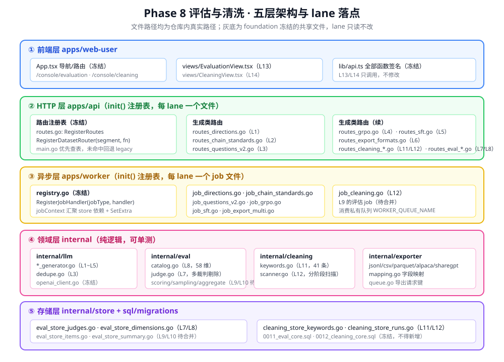
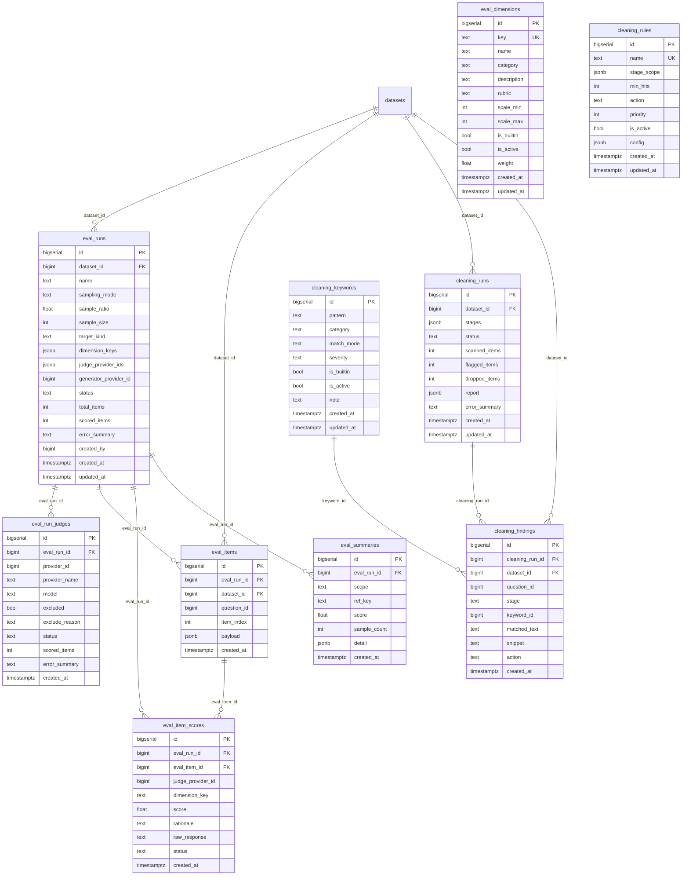
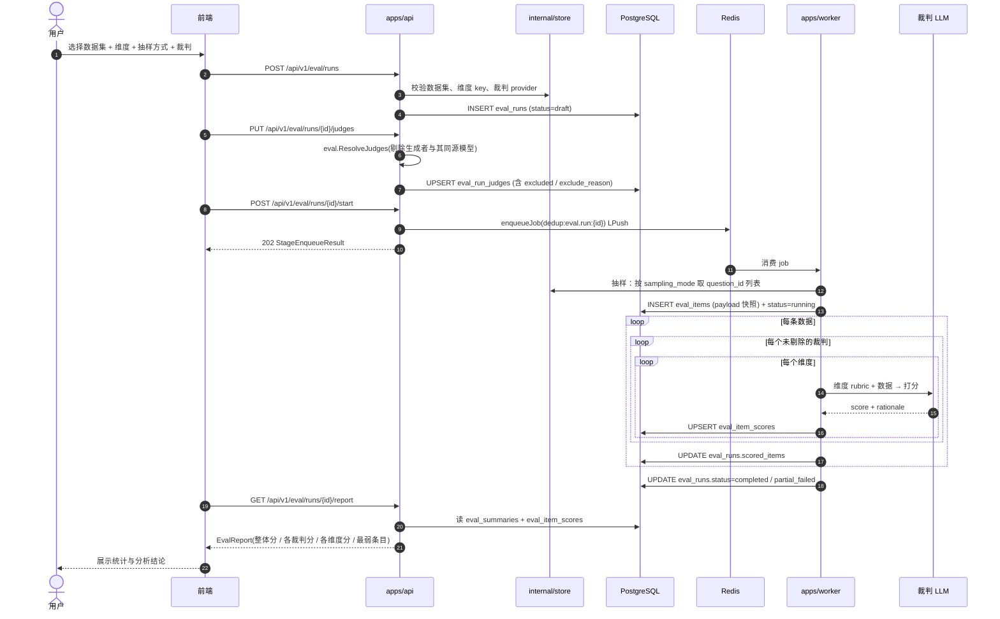
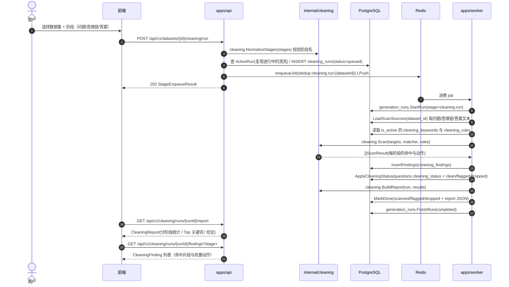

# Phase 8 评估与清洗能力（长链思考数据工厂）

> 本文档由 lane L15 编写，描述「数据集评估」与「数据清洗」两块能力的真实实现。
> 契约权威文档是 `docs/plans/eval-and-cleaning-plan.md`（冻结版 v1.0），本文所有接口、表名、字段名均以该文档与仓库实际代码为准。
> **诚实性约定**：凡尚未合并到 `main` 的模块，本文一律标注「待合并（Lx）」，不写成已完成。状态汇总见第 0 节与第 12 节。



---

## 0. 范围与状态总览

Phase 8 把系统从「只会生成数据」升级为「生成 → 评估 → 清洗 → 导出」的闭环。共 15 条 lane，本文覆盖其中与评估/清洗/文档直接相关的 10 条。

| lane | 交付物 | 主要落点 | 状态 |
|---|---|---|---|
| L1 | 关键词 → n 领域 → m 方向，断点续跑 | `apps/api/routes_directions.go`、`apps/worker/job_directions.go` | 已合并 |
| L2 | 每个方向的长链思维标准步骤（可编辑、版本化） | `apps/api/routes_chain_standards.go`、`apps/worker/job_chain_standards.go` | 已合并 |
| L3 | 每方向 x 个问题，难度分层 + 去重 | `apps/api/routes_questions_v2.go`、`apps/worker/job_questions_v2.go` | 已合并 |
| L4 | GRPO 教师模型评判提示词 | `apps/api/routes_grpo.go`、`apps/worker/job_grpo.go` | 已合并 |
| L5 | SFT 思维链 + 答案 | `apps/api/routes_sft.go`、`apps/worker/job_sft.go` | 已合并 |
| L6 | 多格式导出 + 字段映射 | `apps/api/routes_export_formats.go`、`apps/worker/job_export_multi.go` | 已合并 |
| L7 | 多 LLM 裁判接入、剔除生成者自评 | `internal/eval/judge.go`、`apps/api/routes_eval_judges.go` | 已合并 |
| L8 | 58 个内置评估维度 + 自定义维度 | `internal/eval/catalog.go`、`apps/api/routes_eval_dimensions.go` | 已合并 |
| L9 | 评估运行：全量/抽样 + 逐条多维打分 | `internal/eval/scoring.go`、`internal/eval/sampling.go`、`internal/store/eval_store_items.go`、`apps/api/routes_eval_runs.go`、`apps/worker/job_eval.go` | **待合并（L9）** |
| L10 | 汇总统计与分析结论 | `internal/eval/aggregate.go`、`internal/eval/report.go`、`internal/store/eval_store_summary.go`、`apps/api/routes_eval_report.go` | **待合并（L10）** |
| L11 | 拒答关键词库与匹配引擎 | `internal/cleaning/keywords.go`、`apps/api/routes_cleaning_keywords.go` | 已合并 |
| L12 | 分步清洗 + 清洗报告 | `internal/cleaning/scanner.go`、`apps/worker/job_cleaning.go`、`apps/api/routes_cleaning_runs.go` | 已合并 |
| L13 | 前端评估 UI | `apps/web-user/src/views/EvaluationView.tsx` | **待合并（L13）** |
| L14 | 前端清洗 UI | `apps/web-user/src/views/CleaningView.tsx` | **待合并（L14）** |
| L15 | 中文图文架构文档 + 使用说明 | `docs/architecture/phase-8-eval-and-cleaning.md`、`docs/guides/eval-and-cleaning-usage.md` | 本文 |

---

## 1. 需求到实现的映射

需求原文来自 `功能说明.txt`（本地需求文档，按 `.gitignore` 不入库）。7 项需求逐条对应如下，**每条都可按下表核对到真实文件**。

### 需求 1：关键词 → n 个领域 → m 个方向（n、m 用户可控）

| 项 | 内容 |
|---|---|
| lane | L1（m 层 + 断点续跑）；n 层沿用既有实现 |
| 生成器 | m 层：`internal/llm/direction_generator.go`（`GenerateDirections`）；n 层：`internal/llm/domain_generator.go`（`GenerateDomains`） |
| 存储 | `internal/store/dataset_store_directions.go`（`ListRootDomains` / `ListDirections` / `ListDirectionsByParent` / `UpsertDirections`）、`internal/store/generation_run_store.go`（断点续跑） |
| HTTP | `apps/api/routes_directions.go`：`POST /api/v1/datasets/{id}/directions/generate`、`GET /api/v1/datasets/{id}/directions`、`POST /api/v1/datasets/{id}/generation-runs/{stage}/resume`、`GET /api/v1/datasets/{id}/generation-runs`；n 层走 legacy 路由 `POST /api/v1/datasets/{id}/domains/generate`（`apps/api/datasets.go` 的 `generateDomains`） |
| worker | `apps/worker/job_directions.go`，jobType `directions.generate` |
| 表 | `domains`（`level=1` 领域、`level=2` 方向）、`generation_runs`、`datasets.direction_count`（m）；n 来自生成策略 `generation_strategies.domain_count` |
| 迁移 | `sql/migrations/0016_generation_runs.sql` |
| 测试 | `test/test_l1_directions.py`、`internal/store/dataset_store_directions_test.go` |

### 需求 2：为每个方向生成长链思维标准步骤

| 项 | 内容 |
|---|---|
| lane | L2 |
| 生成器 | `internal/llm/chain_standard_generator.go`（`GenerateChainStandard`、`MarshalChainSteps`） |
| 存储 | `internal/store/chain_standard_store.go`（`UpsertFromAI` / `UpdateStepsWithVersion` / `ListVersions`） |
| HTTP | `apps/api/routes_chain_standards.go`：`POST /api/v1/datasets/{id}/chain-standards/generate`、`GET .../chain-standards`、`PUT .../chain-standards/{domainId}`、`GET .../chain-standards/{domainId}/versions` |
| worker | `apps/worker/job_chain_standards.go`，jobType `chain-standards.generate` |
| 表 | `chain_standards`、`chain_standard_versions` |
| 迁移 | `sql/migrations/0013_chain_standards.sql` |
| 测试 | `test/test_l2_chain_standards.py`、`internal/llm/chain_standard_generator_test.go`、`internal/store/chain_standard_store_test.go` |

### 需求 3：为每个方向生成 x 个具体问题（x 可控）

| 项 | 内容 |
|---|---|
| lane | L3 |
| 生成器 | `internal/llm/question_generator_v2.go`（`GenerateQuestionsV2`、`AllocateDifficultyMix`、`ReconcileDifficulty`）、`internal/llm/dedupe.go`（`NormalizeForDedupe`、`DedupeKey`） |
| 存储 | `internal/store/question_store_v2.go`（`InsertQuestions` / `ExistingDedupeKeys` / `DifficultyStats`） |
| HTTP | `apps/api/routes_questions_v2.go`：`POST /api/v1/datasets/{id}/questions/generate`、`GET .../questions`、`GET .../questions/difficulty-stats` |
| worker | `apps/worker/job_questions_v2.go`，jobType `questions.generate` |
| 表 | `questions`（`difficulty` / `difficulty_score` / `dedupe_key` / `source` / `cleaning_status`） |
| 迁移 | `sql/migrations/0014_questions_v2.sql` |
| 测试 | `test/test_l3_questions_v2.py`、`internal/llm/dedupe_test.go`、`internal/llm/question_generator_v2_test.go`、`internal/store/question_store_v2_test.go`、`apps/api/routes_questions_v2_test.go` |

### 需求 4：GRPO 生成教师模型提示词 / SFT 生成思维链与答案

这是需求原文的一项，实现上拆成两条独立 lane。

| 项 | GRPO 分支（L4） | SFT 分支（L5） |
|---|---|---|
| 生成器 | `internal/llm/grpo_prompt_generator.go`（`NormalizeLevels`、`GenerateGrpoPrompt`） | `internal/llm/sft_generator.go`（`GenerateSft`、`NormalizeChainSteps`、`CountAlignedSteps`、`SftStatus`） |
| 存储 | `internal/store/grpo_store.go` | `internal/store/sft_store.go` |
| HTTP | `apps/api/routes_grpo.go`：`PUT /api/v1/datasets/{id}/reward-levels`、`POST .../grpo/generate`、`GET .../grpo` | `apps/api/routes_sft.go`：`POST .../sft/generate`、`GET .../sft` |
| worker | `apps/worker/job_grpo.go`，jobType `grpo.generate` | `apps/worker/job_sft.go`，jobType `sft.generate` |
| 表 | `grpo_prompts`（`levels` / `judge_prompt` / `level_rubrics`） | `sft_records`（`chain_of_thought` / `answer` / `chain_steps`） |
| 迁移 | `sql/migrations/0017_grpo_prompts.sql` | `sql/migrations/0018_sft_records.sql` |
| 测试 | `test/test_l4_grpo.py`、`internal/llm/grpo_prompt_generator_test.go` | `test/test_l5_sft.py` |

分支由 `datasets.target_kind` 决定（`sft` / `grpo`）；GRPO 的奖励档次存 `datasets.reward_levels`。

### 需求 5：结果支持多种格式导出

| 项 | 内容 |
|---|---|
| lane | L6 |
| 导出器 | `internal/exporter/jsonl.go`、`csv.go`、`parquet.go`、`alpaca.go`、`sharegpt.go`、`exporter.go`（`canonicalFormats = jsonl/csv/parquet/alpaca/sharegpt`）、`mapping.go`（内置映射与字段解析） |
| 存储 | `internal/store/export_mapping_store.go`（`SeedBuiltins` / `EnsureSeeded` / `ResolveDefault`） |
| HTTP | `apps/api/routes_export_formats.go`：`GET /api/v1/datasets/{id}/export/formats`、`POST /api/v1/datasets/{id}/export`、`GET/POST/PUT /api/v1/admin/export-mappings` |
| worker | `apps/worker/job_export_multi.go`，jobType `export.generate` |
| 表 | `export_mappings` |
| 迁移 | `sql/migrations/0015_export_mappings.sql` |
| 测试 | `test/test_l6_export.py`、`internal/exporter/exporter_test.go` |

### 需求 6：已生成数据集的评估（多 LLM 互评 / ≥50 维度 / 全量+抽样 / 剔除自评 / 汇总分析展示）

| 子需求 | lane | 实现文件 | 状态 |
|---|---|---|---|
| 接入多个 LLM 作为裁判 | L7 | `internal/eval/judge.go`、`internal/store/eval_store_judges.go`、`apps/api/routes_eval_judges.go` | 已合并 |
| 剔除生成者自评 | L7 | `internal/eval/judge.go` 的 `ResolveJudges` / `LoadJudgeRefs` / `sourceKey` | 已合并 |
| 内置 ≥50 个长链维度 + 用户自定义 | L8 | `internal/eval/catalog.go`（`BuiltinDimensions` / `Categories` / `Seed` / `Validate`）、`internal/store/eval_store_dimensions.go`、`apps/api/routes_eval_dimensions.go` | 已合并（58 个） |
| 全量 / 按比例 / 按数量抽样 | L9 | `internal/eval/sampling.go`、`apps/api/routes_eval_runs.go` | **待合并（L9）** |
| 逐条 × 逐维度打分 | L9 | `internal/eval/scoring.go`、`internal/store/eval_store_items.go`、`apps/worker/job_eval.go` | **待合并（L9）** |
| 汇总、统计、分析、得出结论 | L10 | `internal/eval/aggregate.go`、`internal/eval/report.go`、`internal/store/eval_store_summary.go`、`apps/api/routes_eval_report.go` | **待合并（L10）** |
| 前端展示 | L13 | `apps/web-user/src/views/EvaluationView.tsx`（+ `apps/web-user/src/views/eval/*.tsx`） | **待合并（L13）** |

接口契约见 `docs/plans/eval-and-cleaning-plan.md` 第 3.7~3.10 节；前端契约见第 4 节。
测试：`test/test_l7_eval_judges.py`、`test/test_l8_eval_dimensions.py`、`internal/eval/judge_test.go`、`internal/eval/catalog_test.go`、`internal/store/eval_store_dimensions_test.go`。

### 需求 7：数据清洗（拒答关键词 / 问题·思维链·答案分步拦截 / 报告）

| 子需求 | lane | 实现文件 | 状态 |
|---|---|---|---|
| 拒答关键词库与匹配 | L11 | `internal/cleaning/keywords.go`（`BuiltinKeywords` / `MatchKeywords` / `Snippet` / `EvaluateRules`）、`internal/store/cleaning_store_keywords.go`、`apps/api/routes_cleaning_keywords.go` | 已合并（41 条内置） |
| 清洗规则（阶段范围 / 阈值 / 动作） | L11 | 同上（`cleaning_rules`，`UpsertRule` / `ListRules`） | 已合并 |
| 分阶段扫描与命中明细 | L12 | `internal/cleaning/scanner.go`（`Scan` / `FindingsFromResults` / `CleaningStatusUpdates` / `BuildReport`） | 已合并 |
| 清洗运行与报告 | L12 | `internal/store/cleaning_store_runs.go`、`apps/worker/job_cleaning.go`（jobType `cleaning.run`）、`apps/api/routes_cleaning_runs.go` | 已合并 |
| 前端展示 | L14 | `apps/web-user/src/views/CleaningView.tsx`（+ `apps/web-user/src/views/cleaning/*.tsx`） | **待合并（L14）** |

测试：`test/test_l11_cleaning_keywords.py`、`test/test_l12_cleaning_runs.py`、`internal/cleaning/keywords_test.go`、`internal/cleaning/scanner_test.go`。

### 需求 8（隐含）：中文图文并茂架构文档 + 使用说明

lane L15，即 `docs/architecture/phase-8-eval-and-cleaning.md`（本文）与 `docs/guides/eval-and-cleaning-usage.md`。

---

## 2. 总览架构（五层）

见文首 `` 引用的 `docs/assets/phase-8-overview.svg`。分层与职责：

| 层 | 目录 | 职责 | 是否可被 lane 修改 |
|---|---|---|---|
| ① 前端层 | `apps/web-user` | 页面、导航、调用 API；`lib/api.ts` 集中声明全部请求函数 | 仅 `src/views/EvaluationView.tsx`、`src/views/CleaningView.tsx`、`src/views/eval/*.tsx`、`src/views/cleaning/*.tsx` 可被 L13/L14 新增 |
| ② HTTP 层 | `apps/api` | 鉴权、参数校验、入队、读写 store、返回 JSON | 每 lane 只新增自己的 `routes_*.go` |
| ③ 异步层 | `apps/worker` | 消费 Redis 队列，调用 LLM，落库，维护 `generation_runs` 进度 | 每 lane 只新增自己的 `job_*.go` |
| ④ 领域层 | `internal` | 纯逻辑：LLM 生成器、评估目录与裁判、清洗匹配与扫描、导出器 | lane 按归属表新增文件 |
| ⑤ 存储层 | `internal/store` + `sql/migrations` | SQL 与行映射；迁移编号区间冻结 | 已存在的 `*_store.go` 与全部迁移冻结 |

请求的两条通路：

```
同步读路径：浏览器 → apps/api 路由 → internal/store → PostgreSQL → JSON 响应
异步写路径：浏览器 → apps/api 路由 → enqueueJob（Redis LPush）→ worker 消费 → LLM → store → 浏览器轮询 generation_runs
```

---

## 3. 数据流水线

见 `docs/assets/phase-8-pipeline.svg`。逐阶段要点：

| 阶段 | jobType | 入队接口 | 产出表 | 用户可控参数 |
|---|---|---|---|---|
| n 领域 + m 方向 | `directions.generate` | `POST /api/v1/datasets/{id}/directions/generate` | `domains` | `datasets.direction_count`（m）、请求体 `directionCount`；n 来自 `generation_strategies.domain_count` |
| 长链标准步骤 | `chain-standards.generate` | `POST /api/v1/datasets/{id}/chain-standards/generate` | `chain_standards`、`chain_standard_versions` | `domainIds` |
| x 个问题 | `questions.generate` | `POST /api/v1/datasets/{id}/questions/generate` | `questions` | `questionsPerDirection`、`difficultyMix` |
| GRPO 提示词 | `grpo.generate` | `POST /api/v1/datasets/{id}/grpo/generate` | `grpo_prompts` | `datasets.reward_levels`、请求体 `levels` |
| SFT 样本 | `sft.generate` | `POST /api/v1/datasets/{id}/sft/generate` | `sft_records` | 请求体 `includeAnswer` |
| 导出 | `export.generate` | `POST /api/v1/datasets/{id}/export` | 对象存储产物 + `artifacts` 元数据 | `format`、`mappingId`、`filters` |
| 清洗 | `cleaning.run` | `POST /api/v1/datasets/{id}/cleaning/run` | `cleaning_runs`、`cleaning_findings` | `stages`、`ruleIds` |

所有异步阶段的进度统一落 `generation_runs`（`stage` / `status` / `cursor` / `total_units` / `done_units` / `attempts` / `error_summary`），前端通过 `GET /api/v1/datasets/{id}/generation-runs` 轮询；断点续跑通过 `POST /api/v1/datasets/{id}/generation-runs/{stage}/resume` 触发（`GenerationRunStore.ResumeRun` / `ResumeTarget` / `SaveCursor`）。

入队统一走 `apps/api/http_util.go` 的 `enqueueJob`，用 Redis 键 `dedup:<jobType>:<datasetID>`（`SetNX`，TTL 10 分钟）抑制重复入队。被抑制时接口仍返回 202 且 `state="queued"`，但 `message` 会变成「已在队列中」——**这一点对使用者与测试都重要**，详见使用说明的排查章节。

---

## 4. 模块职责

### 4.1 `internal/eval` —— 评估领域逻辑

| 文件 | lane | 职责 |
|---|---|---|
| `internal/eval/catalog.go` | L8 | 58 个内置维度的静态定义（`Dimension` 结构 + `BuiltinDimensions()`）、分类常量（`CategoryLongChain` 等 7 个）、统一分档判据 `tierRubric`、`Categories()`、`ToModel()`、`Validate()`、`Seed()` |
| `internal/eval/judge.go` | L7 | 裁判解析与剔除：`JudgeRef`、`ResolveJudges`（纯函数）、`LoadJudgeRefs`（带 I/O）、`sourceKey`、`markExcluded`、`ScoreJSON`、剔除原因常量 |
| `internal/eval/sampling.go` | L9 | 抽样策略（全量 / 比例 / 数量），**待合并** |
| `internal/eval/scoring.go` | L9 | 单条数据 × 单裁判 × 单维度打分，**待合并** |
| `internal/eval/aggregate.go` | L10 | 聚合统计，**待合并** |
| `internal/eval/report.go` | L10 | 报告组装，**待合并** |

维度分类与数量（来自 `internal/eval/catalog.go` 的 `Category*` 常量与 `BuiltinDimensions()`，合计 58）：

| 分类常量 | 分类值 | 数量 | 关注点 |
|---|---|---|---|
| `CategoryLongChain` | `long_chain` | 12 | 推理链结构：步数充分性、步骤衔接、自我纠错、分支论证 |
| `CategoryFaithfulness` | `faithfulness` | 9 | 忠实性：幻觉控制、引用可追溯、数值单位、前提不臆造 |
| `CategoryInstruction` | `instruction` | 7 | 指令遵循：约束遵守、格式合规、边界处理、歧义澄清 |
| `CategoryDomainFit` | `domain_fit` | 8 | 领域贴合：术语、场景、法规、资源约束、相关方视角 |
| `CategoryAnswerQuality` | `answer_quality` | 8 | 答案质量：结论明确、可执行、风险提示、备选方案、成功标准 |
| `CategoryRobustness` | `robustness` | 8 | 稳健性：抗诱导、拒答处理、安全合规、偏见控制、跨次一致性 |
| `CategoryEfficiency` | `efficiency` | 6 | 效率：Token 效率、思考密度、关键信息占比、适时收敛 |

### 4.2 `internal/cleaning` —— 清洗领域逻辑

| 文件 | lane | 职责 |
|---|---|---|
| `internal/cleaning/keywords.go` | L11 | 关键词匹配：`BuiltinKeywords()`（41 条）、`MatchKeywords()`、`Snippet()`、`compilePattern()`、`normalize()`、`EvaluateRules()`、`ruleAppliesToStage()`；分类常量 `CategoryRefusal` / `CategorySafety` / `CategoryUncertaintyEvasion` / `CategoryEnglishRefusal` / `CategoryPlaceholder`；严重度 `SeverityBlock` / `SeverityWarn`；匹配模式 `ModeContains` / `ModeRegex` / `ModePrefix`；错误 `ErrBuiltinKeywordImmutable` |
| `internal/cleaning/scanner.go` | L12 | 分阶段扫描：`DefaultStages()`、`ValidStage()`、`NormalizeStages()`、`Scan()`、`FindingsFromResults()`、`CleaningStatusUpdates()`、`BuildReport()`、`TopKeywords()`；阶段常量 `StageQuestion` / `StageReasoning` / `StageAnswer`；动作常量 `ActionClean` / `ActionFlag` / `ActionDrop` / `ActionRetry` |

内置关键词分布（来自 `BuiltinKeywords()`，合计 41 条；模式分布：`contains` 37 条、`prefix` 3 条、`regex` 1 条）：

| 分类 | 严重度 | 条数 | 示例 |
|---|---|---|---|
| `refusal` | `block` | 13 | 对不起、我不能、我无法提供、作为一个AI |
| `safety` | `block` | 8 | 违反、涉及敏感、违法违规、使用政策 |
| `english_refusal` | `block` | 10 | I cannot、I'm sorry、As an AI、violates policy |
| `uncertainty_evasion` | `warn` | 5 | 请咨询专业人士、无法保证准确性 |
| `placeholder` | `warn` | 5 | TODO、待补充、此处省略、N/A、连续省略号（regex） |

`scanner.go` 刻意**不引用** L11 的任何符号，命中结果由 `apps/worker/job_cleaning.go` 里的适配器逐字段拷贝成 `ScannerMatch`；这样两条 lane 可以并行开发，`Scan` 也能注入 fake matcher 独立单测。

**两个需要注意的实现现状**（读代码时别被名字误导）：

1. `severity`（`block` / `warn`）只写入命中明细，**不参与动作判定**。`decideAction`（`scanner.go`）只看规则：按 `priority` 降序取第一条 `minHits` 满足的规则，其 `action` 即结果；没有规则命中则返回 `ActionFlag`。`normalizeAction` 对无法识别的动作也一律回退到 `ActionFlag`，即**默认永不误删**。
2. `cleaning_rules` 表**没有内置数据**（迁移里没有 INSERT，也没有 Seed 函数），因此开箱默认状态下命中只会被标记为 `flagged`，不会有任何数据被 `drop`。要真正剔除，必须由用户配一条 `action=drop` 的规则。
3. **两条 lane 各有一套规则判定函数，且优先级排序方向相反**（已知问题，待父代理统一）：
   - 生产路径走 L12 的 `scanner.decideAction`，按 `priority` **降序**（数值大的先匹配，先命中者决定动作）；
   - L11 的 `keywords.EvaluateRules` 按 `priority` **升序**（数值小的先匹配），且它**目前只被单测调用，不在生产路径上**。

   本文与使用说明描述的都是生产路径（`decideAction`）的行为。两处语义不一致属于潜在陷阱，已在第 12 节列为待处理项。

### 4.3 `internal/store` —— 存储层

| 文件 | lane | 关键方法 |
|---|---|---|
| `internal/store/eval_store_dimensions.go` | L8 | `List` / `Get` / `ListByKeys` / `Categories` / `UpsertBuiltin` / `Count` / `Upsert` / `Delete` |
| `internal/store/eval_store_judges.go` | L7 | `ListProviderOptions` / `GeneratorProviderID` / `ListRunJudges` / `UpsertRunJudges` / `UpdateJudgeStatus` |
| `internal/store/eval_store_items.go` | L9 | 待合并 |
| `internal/store/eval_store_summary.go` | L10 | 待合并 |
| `internal/store/cleaning_store_keywords.go` | L11 | `List` / `Get` / `Upsert` / `Delete` / `Import` / `SeedBuiltin` / `CountBuiltin` / `ListRules` / `UpsertRule` |
| `internal/store/cleaning_store_runs.go` | L12 | `Create` / `GetRun` / `ListByDataset` / `UpdateProgress` / `MarkDone` / `MarkFailed` / `InsertFindings` / `ListFindings` / `LoadScanSources` / `ApplyCleaningStatus` / `GetReport` / `ActiveRun` |
| `internal/store/generation_run_store.go` | L1 | `StartRun` / `ActiveRun` / `GetRun` / `ListRuns` / `SaveCursor` / `FinishRun` / `ResumeTarget` / `ResumeRun` |

`LoadScanSources` 的取值语义（清洗报告的「答案」阶段数据来源）：`answer` 优先取 `sft_records.answer`，缺失时回退 `reasoning_records.answer_summary`。

### 4.4 `apps/api` —— HTTP 层

每个 lane 一个文件，全部通过 `init()` 注册，不改 `main.go`：

| 文件 | 注册的路由前缀 / 数据集段 |
|---|---|
| `apps/api/routes_directions.go` | 数据集段 `directions`、`generation-runs` |
| `apps/api/routes_chain_standards.go` | `POST/GET/PUT /api/v1/datasets/{id}/chain-standards...` |
| `apps/api/routes_questions_v2.go` | 数据集段 `questions` |
| `apps/api/routes_grpo.go` | 数据集段 `grpo` + `PUT /api/v1/datasets/{id}/reward-levels` |
| `apps/api/routes_sft.go` | 数据集段 `sft` |
| `apps/api/routes_export_formats.go` | 数据集段 `export` + `/api/v1/admin/export-mappings` |
| `apps/api/routes_eval_judges.go` | `GET /api/v1/admin/eval/judges`、`PUT /api/v1/eval/runs/{runId}/judges` |
| `apps/api/routes_eval_dimensions.go` | `/api/v1/eval/dimensions...` |
| `apps/api/routes_eval_runs.go` | `/api/v1/eval/runs...`，**待合并** |
| `apps/api/routes_eval_report.go` | `/api/v1/eval/runs/{id}/report`、`.../scores`，**待合并** |
| `apps/api/routes_cleaning_keywords.go` | `/api/v1/cleaning/keywords`、`/api/v1/cleaning/rules` |
| `apps/api/routes_cleaning_runs.go` | 数据集段 `cleaning` + `/api/v1/cleaning/runs/{id}/report`、`.../findings` |

### 4.5 `apps/worker` —— 异步层

| 文件 | jobType |
|---|---|
| `apps/worker/job_directions.go` | `directions.generate` |
| `apps/worker/job_chain_standards.go` | `chain-standards.generate` |
| `apps/worker/job_questions_v2.go` | `questions.generate` |
| `apps/worker/job_grpo.go` | `grpo.generate` |
| `apps/worker/job_sft.go` | `sft.generate` |
| `apps/worker/job_export_multi.go` | `export.generate` |
| `apps/worker/job_cleaning.go` | `cleaning.run` |
| `apps/worker/job_eval.go` | 评估运行，**待合并（L9）** |

### 4.6 `internal/exporter` —— 导出

`internal/exporter/exporter.go` 定义统一 `Exporter` 接口与 `canonicalFormats`（`jsonl` / `csv` / `parquet` / `alpaca` / `sharegpt`）；`mapping.go` 提供内置字段映射（`BuiltinSpecs`）、字段解析（`recordFields` / `normalizeKey` / `lookupField` / `resolveAny` / `stringify`）与 `FieldNames`；`queue.go` 提供导出请求键 `RequestKey`。

---

## 5. 数据模型（ER）

以下 ER 图的字段**逐个来自** `sql/migrations/0011_eval_core.sql` 与 `sql/migrations/0012_cleaning_core.sql`，未做任何推测。



关键唯一约束（决定了「重复执行」时的行为）：

| 表 | 约束 | 语义 |
|---|---|---|
| `eval_dimensions` | `key UNIQUE` | 内置维度按 key 幂等 upsert（`UpsertBuiltin`） |
| `eval_run_judges` | `UNIQUE (eval_run_id, provider_id)` | 同一次评估里同一 provider 只能有一个裁判记录 |
| `eval_items` | `UNIQUE (eval_run_id, question_id)` | 同一次评估里同一问题只入样一次 |
| `eval_item_scores` | `UNIQUE (eval_item_id, judge_provider_id, dimension_key)` | 同一裁判对同一条同一维度只留一个分数 |
| `eval_summaries` | `UNIQUE (eval_run_id, scope, ref_key)` | 汇总按 (范围, 引用键) 幂等重算 |
| `cleaning_keywords` | `UNIQUE (pattern, category)` | 导入同 pattern 同分类时计入 skipped |
| `cleaning_rules` | `name UNIQUE` | 规则按名字覆盖更新 |

评估侧的状态机：`eval_runs.status` ∈ `draft` / `queued` / `running` / `partial_failed` / `failed` / `completed`；`eval_run_judges.status` 记录单个裁判的进度与错误。
清洗侧：`cleaning_runs.status` 由 `Create`（`queued`）→ `MarkDone` / `MarkFailed` 推进；`questions.cleaning_status` ∈ `clean` / `flagged` / `dropped`（由 `ApplyCleaningStatus` 写回）。

---

## 6. 评估时序



（L9 的抽样、打分与 L10 的汇总当前**待合并**；上图是契约第 3.9/3.10 节与 `internal/model/eval.go` 已冻结的类型共同确定的完整流程。）

---

## 7. 清洗时序



---

## 8. 评估维度分类

见 `docs/assets/phase-8-eval-dimensions.svg`（58 个维度 × 7 分类，逐条列出 key）。要点：

- 所有内置维度统一 **1~5 分制**（`ScaleMin=1`、`ScaleMax=5`），共用 `tierRubric` 分档判据，避免不同维度分档口径不一致导致汇总失真。
- 每个维度都带 `rubric`（判据）与 `weight`（权重，例如 `lc_step_sufficiency` 为 1.5）。
- `Seed()` 通过 `DimensionSink` 接口（由 `internal/store/eval_store_dimensions.go` 实现）幂等写入，返回 `(inserted, total)`。
- 用户可以新增自定义维度（`is_builtin=false`），通过 `POST /api/v1/eval/dimensions` 保存；内置维度可停用但不应删除，`Delete` 对内置维度会拒绝。

---

## 9. 关键设计决策与理由

这一节是本文最有价值的部分：每条决策都对应代码里的一个具体选择。

### 9.1 为什么评估必须剔除「生成者自评」

代码位置：`internal/eval/judge.go` 的 `ResolveJudges` / `sourceKey` / `ExcludeReasonGenerator` / `ExcludeReasonSameSource`。

用同一个模型评自己生成的数据，会出现系统性的分数虚高：模型对自身措辞、句式、推理风格有天然偏好，且共享同一批训练偏见，评出来的高分不反映数据质量，只反映「自洽」。需求原文也明确要求「存在由 A 生成的数据集 A1，评估 A1 则需要除去 A 之外的 llm」。

两个关键细节：

1. **不能只比对 provider id**。同一个模型可能在 `model_providers` 里注册成多行（不同名字、不同 id、同一 base_url + model）。因此 `sourceKey` 归一化为 `baseURL + "|" + model`（都小写、去尾斜杠）后再比较，命中即按 `ExcludeReasonSameSource` 剔除。
2. **剔除结果要留痕**。被剔除的候选不是直接丢掉，而是以 `excluded=true` + `exclude_reason` 写进 `eval_run_judges`，前端因此能向用户解释「为什么这个模型不能当裁判」。缺 API Key 的候选也在 `LoadJudgeRefs` 阶段以 `ExcludeReasonNoAPIKey` 追加剔除，而不是留到打分时才静默失败。

### 9.2 为什么抽样必须确定性

代码位置（待合并）：`internal/eval/sampling.go`，被 `apps/worker/job_eval.go` 调用。

如果抽样用随机数，同一个 `eval_run` 重跑一次就会得到不同样本，于是：

- 报告分数变化无法区分「数据变了」还是「样本变了」；
- 用户拿着两次报告无法对比，评估结论不可复现；
- `eval_items` 的 `UNIQUE (eval_run_id, question_id)` 语义也被破坏（同一次评估的样本集合本应稳定）。

因此抽样必须以 `eval_run.id`（或等价的稳定种子）为种子做确定性选择，保证「同 runID 同结果」。全量模式（`sampling_mode=full`）天然确定；比例/数量模式由种子保证。这一条同时也是可测性要求：给定同一 runID，两次抽样结果必须逐元素相等。

### 9.3 为什么「单裁判」时一致性指标需要特殊语义

代码位置（待合并）：`internal/eval/aggregate.go`、`internal/eval/report.go`。

多 LLM 互评的核心价值之一是「分歧度」：同一维度上不同裁判给的分数差得越大，结论可信度越低。但一致性指标在只有一个有效裁判时会退化：

- 单裁判时不存在「裁判间差异」，若实现按「方差/极差」计算并直接返回 0，用户看到 0 会理解成「完全不一致」——与事实（只有一家之言，无从判断一致性）恰好相反；
- 因此单裁判场景必须返回**特殊语义**（例如「不适用 / 样本不足」的显式标记），而不是一个看起来像正常数值的 0；
- 同一条原则适用于「某维度只有部分裁判给出分数」的稀疏情形：分母要用实际参与打分的裁判数，并在报告中显式标注样本数（`eval_summaries.sample_count` 就是为此存在的）。

一句话：**数值 0 与「无法计算」必须在契约层区分开**，否则报告会给出反向结论。

### 9.4 为什么清洗要「按阶段分别拦截」

代码位置：`internal/cleaning/scanner.go` 的 `StageQuestion` / `StageReasoning` / `StageAnswer`、`Scan`、`decideAction`、`NormalizeStages`。

问题、思维链、答案三处的污染模式完全不同：

| 阶段 | 典型污染 | 处置倾向 |
|---|---|---|
| `question` | 问题本身就被拒答/改写（生成阶段就失败了） | 整条样本无价值，倾向 `drop` |
| `reasoning` | 思维链中途出现「我不能」「As an AI」等拒答 | 思维链断裂，倾向 `drop` 或 `retry` |
| `answer` | 答案里出现「请咨询专业人士」等免责/回避 | 有时仍可用，倾向 `flag` 交人工复核 |

如果只做一次全局匹配、或对三阶段用同一套阈值，就会出现两种坏结果：把答案里的免责声明当成整体拒答而误删可用样本；或者反过来，思维链里的拒答因为答案正常而被放过。所以：

- 扫描按阶段分别产出 `ScanResult`，命中明细带 `stage` 字段落 `cleaning_findings`；
- 规则（`cleaning_rules`）带 `stage_scope`（`ruleAppliesTo` / `ruleAppliesToStage` 判定），可以为不同阶段设不同 `min_hits` 与 `action`；
- `NormalizeStages` 对非法阶段名**返回错误而不是静默丢弃**——否则用户会以为某个阶段被清洗过、实际没有。

### 9.5 为什么 `apps/api` 用 `init()` 注册表而不是集中式路由表

代码位置：`apps/api/routes.go`（`RegisterRoutes` / `RegisterDatasetRouter` / `applyRouteRegistrars` / `lookupDatasetRouter`）、`apps/worker/registry.go`（`RegisterJobHandler`）。

15 条 lane 并行改同一个 Go 模块，如果路由与 job 分发都集中在一个文件里，每个 lane 都要改同一份代码——必然产生 merge 冲突，且冲突处往往是「同一张 switch 表」这种语义级冲突，git 无法自动合并。注册表机制把写冲突降级为零：

- lane 只**新增**自己的 `routes_*.go` / `job_*.go`，在 `init()` 里注册；
- 共享文件 `main.go` / `routes.go` / `registry.go` 一次性冻结，之后无人修改；
- 重复注册会 **panic**（`duplicate dataset router segment: ...` / `duplicate job handler: ...`），把「两个 lane 抢同一个路径」这种错误在启动时立刻暴露，而不是运行时静默覆盖；
- 未注册的 jobType 回退到 legacy 分支，旧行为不受影响。

代价与约束：注册必须在包初始化期完成，所以拿到 `app` 需要一点技巧——`RegisterRoutes` 的 registrar 签名带 `app`，而 `RegisterDatasetRouter` 的签名是 `func(w http.ResponseWriter, r *http.Request, id int64, rest string)`、拿不到 `app`。因此各 lane 的写法是：在 `RegisterRoutes` 的闭包里**先捕获 app**，再用闭包注册数据集子路由（见 `apps/api/routes_directions.go`、`routes_cleaning_runs.go` 等文件的注释）。

### 9.6 为什么 GRPO / SFT 用一等公民表，而不是复用旧表

代码位置：`sql/migrations/0017_grpo_prompts.sql`、`sql/migrations/0018_sft_records.sql` 的文件头注释。

- 复用 `reward_records` 存 GRPO 提示词会冲突：`reward_records.question_id` 带 `UNIQUE` 约束，且 `apps/api/exports.go` 在 reward 行数上设了导出硬门禁；GRPO 提示词与 SFT 奖励分是两种语义的数据，叠加在同一行会互相覆盖，导致提示词静默丢失或导出 `reward_score` 全为 0。
- 复用 `reasoning_records` 存 SFT 样本会冲突：`reasoning_records` 是「推理生成」阶段的旧语义（`answer_summary` + MinIO 对象键），而 SFT 样本需要结构化保存「问题 → 思维链 → 答案」以及对齐的长链标准步骤（`chain_steps`）。两者生命周期不同，混用会让 SFT 样本被后续推理生成覆盖。

### 9.7 为什么内置关键词只能停用、不能删除

代码位置：`internal/cleaning/keywords.go` 的 `ErrBuiltinKeywordImmutable`。

内置关键词库是全系统清洗的基线。如果允许删除，一次误操作就会让清洗静默失效（匹配不到任何东西 → 报告显示 0 命中 → 用户以为数据很干净），且无法追溯是谁删了什么。因此契约规定内置关键词只允许 `is_active=false`，删除请求返回错误并提示改为停用。

---

## 10. 契约冻结机制

### 10.1 冻结文件清单

以下文件由 foundation 阶段一次性写入后冻结，lane 不得修改（见 `docs/plans/eval-and-cleaning-plan.md` 第 1 节与第 6 节）：

| 冻结文件 | 冻结内容 |
|---|---|
| `apps/api/main.go` | 服务启动、legacy 路由分发 |
| `apps/api/routes.go` | 路由注册表与数据集子路由查表 |
| `apps/worker/main.go` | worker 启动、队列消费循环 |
| `apps/worker/registry.go` | job handler 注册表与 `jobContext` |
| `internal/model/*.go` | 全部领域类型（跨 lane 共享的唯一合法依赖） |
| `internal/store/*_store.go` | 既有 store 构造器与行映射 |
| `apps/web-user/src/lib/api.ts` | 全部前端请求函数签名 |
| `apps/web-user/src/App.tsx` | 导航与路由 |
| `internal/llm/openai_client.go`、`internal/llm/json_content.go` | LLM 调用与结构化输出解析 |
| `sql/migrations/*` | 全部迁移（编号区间已冻结） |

### 10.2 三个注册点的用法

**顶层路由**（新前缀，例如 `/api/v1/eval/`、`/api/v1/cleaning/`）：

```go
func init() {
    RegisterRoutes(func(mux *http.ServeMux, app *application) {
        mux.HandleFunc("GET /api/v1/eval/dimensions", app.listEvalDimensions)
    })
}
```

**数据集子路由**（`/api/v1/datasets/{id}/{segment}/...`）：segment 不得与 `main.go` 内置段（`domains` / `questions` / `reasoning` / `rewards` / `export` / `pipeline`）冲突，重复注册会 panic。签名固定为：

```go
func(w http.ResponseWriter, r *http.Request, id int64, rest string)
```

`rest` 是 segment 之后的剩余路径（例如 `/generate`、`/12/versions`），lane 自己在闭包里做方法与子路径分发：

```go
func init() {
    RegisterRoutes(func(_ *http.ServeMux, app *application) {
        RegisterDatasetRouter("directions", func(w http.ResponseWriter, r *http.Request, id int64, rest string) {
            routeDatasetDirections(app, w, r, id, rest)
        })
    })
}
```

**worker job**：

```go
func init() {
    RegisterJobHandler("cleaning.run", handleCleaningRun)
}
```

`jobContext` 已汇聚 `queue` / `redis` / `datasets` / `pipeline` / `prompts` / `reasoning` / `rewards` / `artifacts` / `generationRuns`；需要额外共享依赖时用 `jc.SetExtra(key, value)` / `jc.Extra(key)`，避免改签名引发跨 lane 冲突。

### 10.3 这套机制如何避免写冲突

`docs/plans/eval-and-cleaning-plan.md` 第 1.2 节的「lane 文件归属表」把每个文件的写权限指派给唯一一条 lane。配套的三条纪律：

1. **只允许新增归属文件**，禁止修改任何已存在的共享文件；
2. **跨 lane 依赖的唯一允许形式**是 foundation 冻结的 `internal/model/*.go` 类型与 `internal/store/*_store.go` 构造器；
3. 同一包内两条 lane 共存时（`internal/eval` 的 L7/L8/L9/L10、`internal/cleaning` 的 L11/L12），**标识符不得重叠**，并写进文件头注释。`internal/cleaning/keywords.go` 就明确列出 L11 占用 `Match` / `BuiltinKeywords` / `MatchKeywords` / `Snippet` / `EvaluateRules`，L12 占用 `ScannerMatch` / `Matcher` / `ScanTarget` / `ScanResult` / `RuleSpec` / `Scan`；因此匹配函数叫 `MatchKeywords` 而不是 `Match`（Go 包级不允许类型与函数同名）。

包级测试辅助函数是这套机制的高危区：多个 lane 在同包写 `contains` / `assertEqual` 之类的小工具，合并后必然重名。历史教训是 main 曾因此编译失败（提交 `daab658` 重命名测试辅助函数）。约定做法是给辅助函数加 lane 前缀。

---

## 11. 迁移编号区间（0011 ~ 0018）

| 迁移 | 内容 | 契约节 |
|---|---|---|
| `sql/migrations/0011_eval_core.sql` | `eval_dimensions` / `eval_runs` / `eval_run_judges` / `eval_items` / `eval_item_scores` / `eval_summaries` | 第 2 节 |
| `sql/migrations/0012_cleaning_core.sql` | `cleaning_keywords` / `cleaning_rules` / `cleaning_runs` / `cleaning_findings` | 第 2 节 |
| `sql/migrations/0013_chain_standards.sql` | `chain_standards` / `chain_standard_versions` | 第 2 节 |
| `sql/migrations/0014_questions_v2.sql` | `questions` 扩展：`direction_domain_id` / `difficulty` / `difficulty_score` / `dedupe_key` / `source` / `cleaning_status` | 第 2 节 |
| `sql/migrations/0015_export_mappings.sql` | `export_mappings` | 第 2 节 |
| `sql/migrations/0016_generation_runs.sql` | `generation_runs` + `datasets` 扩展（`target_kind` / `direction_count` / `questions_per_direction` / `reward_levels` / `cleaning_enabled`） | 第 2 节 |
| `sql/migrations/0017_grpo_prompts.sql` | `grpo_prompts` | 第 9.6 节 |
| `sql/migrations/0018_sft_records.sql` | `sft_records` | 第 9.6 节 |

**为什么后续不得新增迁移文件**：

1. **编号是契约的一部分**。前端契约、接口契约、表结构三者共用同一套冻结编号，任何 lane 自行加一个 `0019_*.sql` 都会让「契约 = 代码」这条不变量失效，评审无法再用编号定位契约条款。
2. **迁移执行是全局的**。所有 lane 共享同一个 PostgreSQL 实例与 `schema_migrations` 表，多个 lane 并行加迁移会互相插入序号，导致执行顺序不确定；`ALTER TABLE` 顺序错误会让其他 lane 的测试随机失败。
3. **改表影响面跨 lane**。例如给 `eval_item_scores` 加一列会影响 L9（写入）与 L10（读取）两条 lane，属于典型的必须先对齐契约、后动手的变更。
4. 因此规则是：**若确需字段，走 issue 由父代理统一加**，而不是 lane 自行新增迁移。

---

## 12. 已知缺口与待合并项（诚实性声明）

| 缺口 | 说明 |
|---|---|
| L9 待合并 | 抽样（`internal/eval/sampling.go`）、打分（`internal/eval/scoring.go`）、`internal/store/eval_store_items.go`、`apps/api/routes_eval_runs.go`、`apps/worker/job_eval.go` 在编写本文时**不存在于当前分支**。因此第 3.9 节的接口、第 6 节的评估时序、第 9.2 / 9.3 节的两条决策属于「契约已冻结、实现待合并」，本文按此如实标注。 |
| L10 待合并 | `internal/eval/aggregate.go`、`internal/eval/report.go`、`internal/store/eval_store_summary.go`、`apps/api/routes_eval_report.go` 同上；`EvalReport` 相关前端类型已冻结在 `apps/web-user/src/lib/api.ts`，但后端接口尚未落地。 |
| L13 / L14 未合并 | `apps/web-user/src/views/EvaluationView.tsx` 与 `apps/web-user/src/views/CleaningView.tsx` 目前仍是 foundation 的占位实现（仅渲染数据集数量），真实 UI 在各自 lane 分支上。因此使用说明中「前端怎么点」的部分，凡涉及这两个页面的具体交互，均以契约（`docs/plans/eval-and-cleaning-plan.md` 第 4 节）为准，并标注「待 L13/L14 合并」。 |
| 全仓库测试基线 | `go test ./...` 在 Phase 8 之前长期为空跑；本阶段各 lane 已配套新增单测与 `test/test_l*.py` 接口测试，但端到端（前端 + 后端 + worker + LLM）仍需按各 lane 的接口测试脚本单独执行。 |
| `priority` 语义在两条 lane 里相反 | `internal/cleaning/scanner.go` 的 `decideAction` 按 `priority` 降序匹配，`internal/cleaning/keywords.go` 的 `EvaluateRules` 按升序匹配。两者名字相近、语义相反，而后者当前**只被单测调用、不在生产路径上**（worker 用的是 `Scan` → `decideAction`）。建议由父代理裁定保留哪一个、删掉另一个，否则后续维护者很容易改错一处。 |
| `job_cleaning.go` 里有临时匹配器 | `apps/worker/job_cleaning.go` 的 `newKeywordMatcher` / `keywordMatcher` 带 `ponytail:` 注释，写明它是 L11 落地前的临时实现，应换成 `cleaning.MatchKeywords` + `cleaning.Snippet`（以复用全角半角归一化）。当前生产路径用的仍是临时匹配器，与 L11 的单测覆盖的 `MatchKeywords` 不是同一份代码。已合并但**接线未完成**，属于真实缺口。 |

---

## 附：相关文件索引

- 契约：`docs/plans/eval-and-cleaning-plan.md`
- 使用说明：`docs/guides/eval-and-cleaning-usage.md`
- 图片：`docs/assets/phase-8-overview.svg`、`docs/assets/phase-8-pipeline.svg`、`docs/assets/phase-8-eval-dimensions.svg`
- 前序阶段文档：`docs/architecture/phase-1-foundation.md` ~ `docs/architecture/phase-7-export-observability.md`
