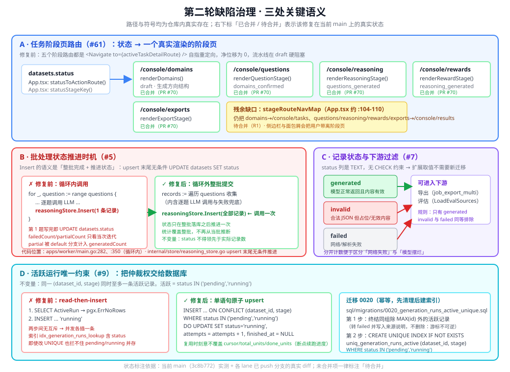

# 第二轮缺陷治理：修复语义与运维影响

> 本轮（第二轮）是**缺陷治理**，不新增产品功能。契约权威文档是 `docs/plans/issue-remediation-plan.md`（冻结版），
> lane 看板是 `docs/plans/round2-lane-board.md`。
> 第一轮的评估与清洗能力见 `docs/architecture/phase-8-eval-and-cleaning.md`。
>
> **诚实性约定**：本文逐节标注该修复在当前 `main` 上的真实状态。
> 标注「已合并」的，读者可以直接在当前代码里找到；标注「待合并（Rx）」的，是 lane 分支上的实现，
> 本文只描述**契约与已 push 分支的实际形状**，不写成已完成。状态汇总见 [第 9 节](#9-状态总览与已知缺口)。



---

## 0. 本轮为什么要单独写一份文档

第一轮把「生成 → 评估 → 清洗 → 导出」四段能力补齐，验证跑的是**功能是否可达**（73/73 断言）。
第二轮处理的是另一类问题：**能力都在，但在特定路径上给出错误结果或静默失败**。这类缺陷有三个共同特征，
使得它们必须用文字固化下来，而不是只靠测试断言：

| 特征 | 后果 | 本文对应章节 |
|---|---|---|
| 缺陷表现为**语义**而非崩溃（状态推进过早、占位内容被当成有效数据、未知路径静默 200） | 数据静静地变脏，没有报错可查 | [3](#3-批处理状态推进语义5)、[4](#4-记录状态与下游过滤7)、[6](#6-错误契约8-63-58) |
| 修复引入了**新的不变量**（数据库级唯一约束、状态取值扩展） | 后续任何改动都可能破坏它，必须写清 | [5](#5-活跃运行唯一约束与孤儿清理9)、[4](#4-记录状态与下游过滤7) |
| 缺陷的根因在**跨层约定**（前端路由 ↔ 状态机、调用点 ↔ 共享入口语义） | 只看单个文件看不出问题，必须在文档里画出链路 | [2](#2-任务阶段页的真实路径61)、[3](#3-批处理状态推进语义5) |

---

## 1. 修复清单与状态

| 编号 | Issue | 一句话 | 关键落点 | 状态 |
|---|---|---|---|---|
| #61 | 阶段页不可达 | 五个阶段路由是自指重定向，流水线在 `draft` 硬阻塞 | `apps/web-user/src/App.tsx` 路由表 | **主体已合并**（PR #70）；`stageRouteNavMap` 待合并（R1） |
| #5 | 批处理状态推进 | `Insert` 在逐题循环内调用，第 1 条写完就写死数据集终态 | `apps/worker/main.go`、`internal/store/reasoning_store.go` | 待合并（R2） |
| #7 | 占位内容被判有效 | 合法 JSON 但内容无效（`"..."`）仍记为 `generated` | `internal/llm/reasoning_generator.go` | 待合并（R3） |
| #9 | 孤儿 `running` 记录 | `StartRun` 是 read-then-insert，并发产生永久孤儿 | 迁移 `0020`、`internal/store/generation_run_store.go` | 待合并（R4，分支已 push） |
| #8 | 未知子路径静默 200 | `routeDatasetGet` 的 `default:` 把未知路径交给 `getDataset` | `apps/api/main.go`、`apps/api/routes.go` | 待合并（R5） |
| #63 | admin 配置零校验 | 空 body 直接落库，可写出 `domainCount:1000` 的脏策略 | `apps/api/main.go` 四个 upsert | 待合并（R6） |
| #58 | `providerId` 不校验 | 数据集能建出来，到生成阶段才失败 | `apps/api/datasets.go` | 待合并（R7，分支已 push） |
| #10 / #11 | 小 total 丢难档 | `total=2` 时 `hard` 恒为 0（生产 `dataset 6` 已复现） | `internal/llm/difficulty.go` | 待合并（R9） |
| #64 | 未选中任务静默失败 | 5 处守卫静默 `return`，无请求无提示 | `apps/web-user/src/App.tsx` | 待合并（R8） |
| #65 | 后端能力无 UI 入口 | `lib/api.ts` 存在未被任何视图调用的方法 | `apps/web-user/src/**` | 待合并（R10） |
| #66 | 不存在资源返回 500 | `pgx.ErrNoRows` 未降级 404 | `apps/api/main.go` 的 `writeError` | **已合并**（PR #68） |

---

## 2. 任务阶段页的真实路径（#61）

### 2.1 缺陷的形状

`5b90c2e`（"统一任务生命周期视图"）把 5 个阶段路由改成自指重定向：

```tsx
// 修复前（apps/web-user/src/App.tsx:3647-3651）
<Route path="/console/domains"   element={<Navigate to={activeTaskDetailRoute} replace />} />
<Route path="/console/questions" element={<Navigate to={activeTaskDetailRoute} replace />} />
<Route path="/console/reasoning" element={<Navigate to={activeTaskDetailRoute} replace />} />
<Route path="/console/rewards"   element={<Navigate to={activeTaskDetailRoute} replace />} />
<Route path="/console/exports"   element={<Navigate to={activeTaskDetailRoute} replace />} />
```

`activeTaskDetailRoute` 在选中任务时正是 `/console/tasks/{id}`（`App.tsx:937`）。于是
`statusToActionRoute('draft')` 返回 `/console/domains` → 跳到 `/console/domains`
→ 又被送回 `/console/tasks/{id}`，**净位移为 0**。

这条链路只有在把「状态机 → 路由 → 渲染函数」三段连起来看时才成立，单看任何一段都是合法的：

- `statusToActionRoute()`（`App.tsx:332-358`）—— 合法 switch，返回正确的阶段路径；
- 路由表 —— 合法 TSX，`<Navigate>` 是合法组件；
- `renderDomains()`（`App.tsx:2521`）—— 函数完整存在。

**这就是 `tsc --noEmit && vite build` 完全拦不住的原因**：路由指向死代码是合法 TypeScript。

### 2.2 修复后的真实路径

`<Route>` 改回渲染各自页面，并为 `questions/reasoning/rewards/exports` 补 4 个具名包装函数
（避免在 `Route` 上内联超长 props）：

| 阶段 | 路由 | 渲染函数 | 进入条件（`datasets.status`） | 主操作按钮 |
|---|---|---|---|---|
| 1 主题结构 | `/console/domains` | `renderDomains()`（`App.tsx:2521`） | `draft` | 「先确认主题结构，再启动问题生成」→ `generateDomains()` |
| 2 问题生成 | `/console/questions` | `renderQuestionStage()`（`App.tsx:2750`） | `domains_confirmed` | 「开始生成题目」→ `generateQuestions()` |
| 3 答案内容 | `/console/reasoning` | `renderReasoningStage()`（`App.tsx:2754`） | `questions_generated` | 「开始生成答案」→ `generateReasoning()` |
| 4 质量评估 | `/console/rewards` | `renderRewardStage()`（`App.tsx:2758`） | `reasoning_generated` / `reasoning_partial` | 「开始质量评估」→ `generateRewards()` |
| 5 导出交付 | `/console/exports` | `renderExportStage()`（`App.tsx:2762`） | `rewards_generated` / `rewards_partial` | 「开始导出结果」→ `generateExport()` |

**用户怎么点到**（三条入口都可用）：

1. **任务详情页的主按钮**：`renderTaskDetail()` 的主按钮调用
   `statusToActionRoute(activeDataset.status)`（`App.tsx:2364`），按当前状态跳到对应阶段页；
2. **阶段卡片**：任务详情页的阶段条用 `statusStageKey()`（`App.tsx:360`）高亮当前阶段，
   点阶段卡片直接 `navigate()` 到阶段路径；
3. **数据资产页**：`renderResultsHub()` 的「交付与复核入口」区块直接给出
   `/console/exports`、`/console/rewards`、`/console/reasoning` 三个按钮。

四个阶段页共用 `renderRecordPage()`（`App.tsx:2666`）这个模板：统一的
「摘要卡片 + 下一步建议 + 异常提示 + 记录列表 + 刷新/主操作按钮」结构，
因此切换阶段时信息架构保持一致。

### 2.3 为什么「失败后能重试」被刻意保留了

`statusToActionRoute()` 把失败态（`questions_failed` / `reasoning_failed` / `rewards_failed` /
`export_failed`）也映射回对应的阶段页，而不是映射到一个「错误页」。这是**行为契约**，不是遗漏：

- 失败态的恢复动作就是「回到那一阶段、改参数、重跑」；
- 因此阶段页上的主操作按钮在失败态下必须是**可点**的。

这条约束直接决定了 `canGenerateQuestions` / `canGenerateReasoning` / `canGenerateRewards` /
`canGenerateExport`（`App.tsx:940-943`）这几个变量的用法。它们是**就绪态**判定
（例如 `canGenerateQuestions = activeDataset?.status === 'domains_confirmed'`），
**不含失败态**。如果把它们直接接到阶段页按钮的 `disabled` 上，失败后按钮会变灰，
用户就再也无法重试 —— 这是一个比原缺陷更隐蔽的回归。因此 PR #70 明确**刻意不接线**这几个变量。

> 后续如果要让按钮在失败态下有引导文案，正确做法是新增「失败态集合」判定
> （`status === 'questions_failed'` 等），而不是复用就绪态变量。

### 2.4 残余缺口：`stageRouteNavMap` 与路由不一致

`stageRouteNavMap`（`App.tsx:104-110`）目前仍是：

```ts
const stageRouteNavMap: Record<string, string> = {
  '/console/planning': '/console/planning',
  '/console/domains': '/console/tasks',      // ← 把用户带离阶段页
  '/console/questions': '/console/results',  // ← 同上
  '/console/reasoning': '/console/results',
  '/console/rewards': '/console/results',
  '/console/exports': '/console/results',
}
```

这张表用于从阶段路径反查「侧边栏高亮项」与面包屑父级。五条阶段路由既然已改为真实渲染页面，
它们就应该映射回自身（或映射到对应的工作台分组），否则会出现「人在 `/console/domains`，
侧边栏却高亮『我的任务』」的错位。契约 §1.4 要求一并修正，由 R1 处理。

---

## 3. 批处理状态推进语义（#5）

### 3.1 缺陷的形状：不是「漏写」，是「共享入口自带状态推进」

`internal/store/reasoning_store.go` 的 `Insert` 语义是「**整批完成 + 推进数据集状态**」：

```go
func (s *ReasoningStore) Insert(ctx, datasetID, records) error {
    return s.upsert(ctx, datasetID, records, true)   // markGenerated = true
}
```

`upsert(..., markGenerated=true)` 在写完传进来的这批记录之后，**无条件**执行状态推进：

```go
// internal/store/reasoning_store.go（upsert 末尾）
nextStatus := "reasoning_generated"
if failedCount > 0 || partialCount > 0 {
    nextStatus = "reasoning_partial"
    if generatedCount == 0 && partialCount == 0 {
        nextStatus = "reasoning_failed"
    }
}
_, err := s.db.Exec(ctx, `UPDATE datasets SET status = $2, updated_at = NOW() WHERE id = $1`, datasetID, nextStatus)
```

而 `apps/worker/main.go` 在**逐题循环内**调用它：

```go
// 修复前（apps/worker/main.go:263-282，奖励侧同形于 :331-350）
for _, question := range questions {
    ...
    if upsertErr := reasoningStore.Insert(ctx, datasetID, records); upsertErr != nil { ... }
}
```

两个语义叠加，结果是三处错误同时发生：

1. **第 1 题写完就推进状态**：`records` 只含当次迭代的那一条，于是 `UPDATE datasets` 把数据集
   标成 `reasoning_generated`，尽管后面还有 N−1 道题没跑；
2. **`failedCount/partialCount` 只看当次迭代**：某题失败只影响那一轮的状态推算，
   整批的失败信息在后续轮次被覆盖掉，最终状态可能显示「全部成功」；
3. **`partial` 被算进 `generatedCount`**：`switch status` 的 `default:` 分支把非 `failed`、
   非 `partial` 之外的**一切**都计入 `generatedCount`，而 `"partial"` 走的是显式 `case "partial"`；
   但 worker 写入的其他非常规状态值会落到 `default:` 从而被当成成功计数。

### 3.2 修复：把调用点移出循环，整批一次提交

契约 §1.3 冻结的规则：

- `Insert` 的**语义不变**（仍然是「整批完成 + 推进状态」），只把**调用点**从循环内移到循环外；
- 允许调用方**显式传入整批统计**，避免 `Insert` 从当批推断；
- 不新增导出函数，仅调整 `apps/worker` 的调用方式。

修复后的形状：

```
records := 遍历全部 questions 收集（逐题 LLM 调用与失败兜底都在这里）
↓
reasoningStore.Insert(ctx, datasetID, records)   ← 每阶段只调用一次
↓
（此刻才 UPDATE datasets.status，统计覆盖整批）
```

这条修复引入了一条**新不变量**，R2 必须用测试锁死：

> **`datasets.status` 不得领先于实际记录数。**
> 即 `status` 声称某阶段已完成时，该阶段的记录数必须与问题数一致。

### 3.3 为什么「整批提交」而不是「分批推进更细的进度」

一个自然的疑问是：整批提交会不会让用户看不到进度？答案是**进度不靠 `datasets.status` 表达**。

细粒度进度由 `generation_runs` 表承担（`stage` / `status` / `cursor` / `total_units` /
`done_units` / `attempts`），前端通过 `GET /api/v1/datasets/{id}/generation-runs` 轮询，
断点续跑走 `POST /api/v1/datasets/{id}/generation-runs/{stage}/resume`。

而 `datasets.status` 是一个**状态机**，它的每个取值都被下游当作「该阶段已产出完整数据」来消费：

- `apps/api/exports.go` 在入队导出前校验 `len(rewards) >= len(questions)`，
  不完整直接 409（`cannot enqueue export: dataset %d rewards incomplete`）；
- 前端 `statusToActionRoute()` 按状态决定把用户送到哪个阶段页；
- `datasets.status` 的取值集合本身是有限的、语义化的（`draft` → `domains_confirmed` →
  `questions_generated` → `reasoning_generated` → `rewards_generated` → `export_generated`），
  没有「完成 37%」这种中间值可表达。

所以两者分工明确：**`generation_runs` 表达进度，`datasets.status` 表达「是否完整」**。
把状态推进放在循环内，等于让一个布尔语义的字段去承担进度表达，必然出错。

`partial` 相关的状态（`reasoning_partial` / `rewards_partial`）是允许的中间态，
但它的语义是「整批跑完了，其中有失败」——**必须先跑完整批**才有资格说 partial。

---

## 4. 记录状态与下游过滤（#7）

### 4.1 缺陷的形状

`internal/llm/reasoning_generator.go` 只在 **JSON 解析失败**时走兜底路径：

```go
var generated reasoningPayload
if err := unmarshalStructuredContent(decoded.Choices[0].Message.Content, &generated); err != nil {
    fallback := strings.TrimSpace(decoded.Choices[0].Message.Content)
    if fallback == "" {
        return reasoningPayload{}, err
    }
    return reasoningPayload{Answer: fallback, Reasoning: ""}, nil
}
return generated, nil      // ← 解析成功即返回，无任何内容校验
```

调用方把「没有 err」等同于「内容有效」：

```go
generated, err := generateReasoningForQuestion(...)
status := "generated"
if err != nil {
    status = "failed"
}
```

于是模型返回 `{"answer": "……", "reasoning": "..."}` 这种**结构合法但内容是占位符**的响应时，
记录被判为 `status="generated"`，占位数据**静默进入训练集**。`reward_generator.go`
（`status := "generated"`，`reward_generator.go:24`）与 `question_generator.go`
（`Status: "generated"`，`question_generator.go:89`）是同一个形状。

### 4.2 修复：新增内容有效性判定与 `invalid` 状态

契约 §1.3 冻结：

```go
// internal/llm —— #7
// 新增内容有效性判定，不改动 GenerateReasoning 的对外签名。
// 不合格记录返回 status = "invalid"，不返回 "generated"。
const ReasoningStatusInvalid = "invalid"
```

状态取值集合扩展为 **`generated | failed | invalid`**，三者的语义严格区分：

| `status` | 含义 | 判定依据 | 处理倾向 |
|---|---|---|---|
| `generated` | 模型正常返回且内容有效 | 结构化解析成功 **且** 内容通过有效性判定 | 可进入导出与评估 |
| `invalid` | 模型返回了合法 JSON 但是**占位/无效内容** | 解析成功但内容不达标 | 与 `failed` 同等排除，单独计数 |
| `failed` | 网络失败 / 解析失败 / provider 未配置 | 调用或解析返回 error | 与 `invalid` 同等排除，单独计数 |

**为什么要把 `invalid` 与 `failed` 分开**：两者的运维含义完全不同。
`failed` 是**基础设施或配置问题**（超时、401、provider 没配 API Key），重试或修配置就能恢复；
`invalid` 是**模型行为问题**（模型在摆烂、输出占位符），重试大概率还是同样的结果，
需要换模型、改提示词，或对这批数据做人工复核。混在一起计数会让「今天失败率飙升」
无法区分到底是网关挂了还是模型退化了。

### 4.3 下游过滤规则：只有 `generated` 可进入导出与评估

契约 §1.3 明确：**只有 `generated` 可进入导出与评估；`invalid` 与 `failed` 同等看待。**

这条规则的落地位置（当前 `main` 上的真实过滤点）：

| 链路 | 位置 | 当前写法 | 需要的语义 |
|---|---|---|---|
| 导出 | `apps/worker/job_export_multi.go:216`（SFT） | `sft.Status != "failed"` | 改为「仅 `generated`」 |
| 导出 | `apps/worker/job_export_multi.go:221`（推理回退） | `reasoning.Status != "failed"` | 同上 |
| 导出 | `apps/worker/job_export_multi.go:234`（奖励） | `reward.Status != "failed"` | 同上 |
| 评估 | `internal/store/eval_store_items.go` 的 `LoadEvalSources` | **完全不看 `reasoning_records.status`** | 需要加入状态过滤 |

> ⚠️ 注意「`!= "failed"`」与「`== "generated"`」并不等价。
> 前者是一个**白名单的反面**（除了 failed 都要），后者才是白名单。
> 状态集合一旦扩展出 `invalid`，`!= "failed"` 会把 `invalid` 记录放行 —— 这正是
> 契约要强调「只有 `generated`」的原因。R3 的测试必须覆盖这一点。

### 4.4 为什么这个状态扩展不需要新迁移

契约 §1.3 要求 lane **自行核实** `status` 字段没有 CHECK 约束。核实方法：

```bash
grep -rn "status" sql/migrations/0005_reasoning.sql sql/migrations/0006_rewards.sql
```

结果是两个迁移里都只有：

```sql
status TEXT NOT NULL DEFAULT 'generated',
```

`TEXT` 类型 + 无 `CHECK` 约束 ⇒ 数据库层不限制取值集合，新增 `invalid` 是纯应用层的语义扩展，
**不需要迁移**。这也符合契约 §1.2 的迁移编号纪律：本轮只允许 `0020` 一条新迁移（#9 用），
其余修复一律不动 schema。

---

## 5. 活跃运行唯一约束与孤儿清理（#9）

### 5.1 缺陷的形状

`sql/migrations/0016_generation_runs.sql` 只有**非唯一**索引：

```sql
CREATE INDEX idx_generation_runs_lookup ON generation_runs (dataset_id, stage, status);
```

而 `internal/store/generation_run_store.go` 的 `StartRun` 是 **read-then-insert**：

```go
existing, err := s.ActiveRun(ctx, datasetID, stage)
if err == nil { /* UPDATE 复用 */ }
if !errors.Is(err, pgx.ErrNoRows) { ... }
// 两步之间没有任何互斥
INSERT INTO generation_runs (...) VALUES (..., 'running', ...)
```

并发请求（同一数据集同一阶段被重复入队、worker 重试、用户连点两次）都会查到
`pgx.ErrNoRows`，然后**各插一条 `running`**。其中一条成为**永久孤儿**：

- `ActiveRun` 用 `ORDER BY id DESC LIMIT 1`，永远只读到最新的那条；
- 孤儿既不会被读到，也不会被 `FinishRun` 结束，于是永远停在 `running`；
- 前端轮询 `generation_runs` 时会看到一条永不结束的「进行中」记录。

**为什么把 `status` 放进索引列也拦不住**：即使把 `idx_generation_runs_lookup` 改成
`UNIQUE (dataset_id, stage, status)`，`'pending'` 与 `'running'` 是**不同的值**，
两条记录都能通过唯一性检查并存活。必须用**部分唯一索引**，只约束活跃态。

### 5.2 修复：迁移 0020 + 单语句原子 upsert

契约 §1.2 冻结了新迁移的唯一名字与纪律：

```
sql/migrations/0020_generation_runs_active_unique.sql
```

迁移必须**幂等**，且必须能在**已存在重复 `running` 记录的历史库**上成功执行
（契约 §0.3 记录线上实测有 11 条孤儿 `running`）。唯一索引会直接拒绝这类数据，
所以**必须先清理孤儿再建索引**，且清理语句要明确写在迁移里并带注释。

R4 已 push 的实现（`origin/lane/r4-generation-run-unique`）采取了
「**终结**而非删除」的策略，理由写在迁移文件头：

1. **那些记录携带真实的断点游标**。并发情况下两条记录都可能被各自的请求写过
   `SaveCursor` 进度，删除是不可逆的，会让已完成的领域丢失；
2. 因此保留 `MAX(id)` 一条（与 `ActiveRun` 的 `ORDER BY id DESC` 语义一致）作为活跃记录，
   其余转为 `failed` 并写入来源说明 `error_summary`，用户仍可通过「续跑」把它们跑完；
3. 迁移**不做任何删除**；若运维确认这些记录无价值，可用精确条件人工清理
   （迁移注释里给出了那条 `DELETE ... WHERE error_summary LIKE '并发 StartRun 产生的重复活跃记录%'`）。

两个步骤：

```sql
-- 第 1 步：终结同一 (dataset_id, stage) 下除 MAX(id) 以外的活跃记录
UPDATE generation_runs AS target
SET status = 'failed', error_summary = '并发 StartRun 产生的重复活跃记录…', finished_at = ..., updated_at = NOW()
WHERE target.status IN ('pending','running')
  AND EXISTS (SELECT 1 FROM generation_runs AS other
              WHERE other.dataset_id = target.dataset_id AND other.stage = target.stage
                AND other.status IN ('pending','running') AND other.id > target.id);

-- 第 2 步：建立部分唯一索引（幂等）
CREATE UNIQUE INDEX IF NOT EXISTS uniq_generation_runs_active
  ON generation_runs (dataset_id, stage)
  WHERE status IN ('pending','running');
```

`StartRun` 随之改为**单语句原子 upsert**，由数据库仲裁：

```sql
INSERT INTO generation_runs (dataset_id, stage, status, cursor, total_units, done_units, attempts, started_at, updated_at)
VALUES ($1, $2, 'running', '{}'::jsonb, $3, 0, 1, NOW(), NOW())
ON CONFLICT (dataset_id, stage) WHERE status IN ('pending','running')
DO UPDATE SET status = 'running',
              attempts = generation_runs.attempts + 1,
              finished_at = NULL,
              updated_at = NOW()
RETURNING <columns>
```

**复用时刻意不覆盖 `cursor` / `total_units` / `done_units`**：那是断点续跑的进度，
覆盖会让已完成的领域全部重跑。

### 5.3 这条修复的两个可观察后果

1. **`generation_runs` 的结构约束变了**：从「惯例上每组一条活跃记录」变成
   **数据库强制**「每组至多一条活跃记录」。任何绕过 `StartRun` 直接 `INSERT` 的代码
   在并发下会收到唯一约束冲突（而不是静默产生孤儿）——这是期望的行为，冲突是**响亮**的失败。
2. **`ActiveRun` 的 `ORDER BY id DESC` 语义降级为「确定性排序」**：部分唯一索引保证
   匹配行至多 1 条，因此「读到哪一条」不再依赖 id 顺序，也不可能漏下孤儿。
   这条注释已写进 R4 的实现，避免后续维护者误以为排序仍在承担仲裁职责。

---

## 6. 错误契约（#8 / #63 / #58）

本轮**不新增任何 HTTP 路由**（契约 §1.1）。所有修复落在已有端点上，
HTTP 路径与请求/响应 JSON 形状**保持不变**，前端 `lib/api.ts` 的函数签名不变。

唯一的响应语义变更是**错误路径** —— 这是修复目标本身：

| 端点 | 变更前 | 变更后 |
|---|---|---|
| `GET /api/v1/datasets/{id}/<未知子路径>` | 200 + 数据集图（静默） | **404** `{"error":"未找到该子资源"}` |
| `POST /api/v1/datasets/{id}/<未知子路径>` | 200 + 数据集图（静默） | **404** `{"error":"未找到该子资源"}` |
| `GET /api/v1/datasets/{id}`（精确） | 200 数据集图 | 200 数据集图（**不变**） |
| `POST/PUT /api/v1/admin/{providers,storage-profiles,generation-strategies,prompts}` 空 body | 200 + 脏数据 | **400** `{"error":"<字段名> 必填"}` |
| `POST /api/v1/datasets` 带不存在的 `providerId` | 201 而后到生成阶段才失败 | **400** `{"error":"指定的 AI 服务不存在"}` |

### 6.1 `writeError` 的既有约定

所有错误都经过 `writeError`（`apps/api/main.go:294-306`），它是**唯一**的错误出口：

```go
func (app *application) writeError(w http.ResponseWriter, status int, err error) {
    msg := err.Error()
    if status >= 500 {
        if errors.Is(err, pgx.ErrNoRows) {
            status = http.StatusNotFound        // #66：不存在 → 404
            msg = "请求的资源不存在"
        } else {
            log.Printf("internal error: %v", err)   // 详细信息只进日志
            msg = "服务暂时不可用，请稍后重试"        // 5xx 不外泄内部细节
        }
    }
    app.writeJSON(w, status, map[string]string{"error": msg})
}
```

约定因此是：**4xx 原样透出中文业务提示；5xx 不泄漏内部详情**（只写日志，
并顺带把 `pgx.ErrNoRows` 降级为 404）。所有新增校验错误都必须走这条出口，
用 4xx + 中文文案，而不是自己 `http.Error` 或返回英文。

### 6.2 #8：未知子路径静默 200

`routeDatasetGet`（`apps/api/main.go:339-362`）的 `default:` 分支把**任意未知子路径**
静默交给 `getDataset`：

```go
case strings.HasSuffix(r.URL.Path, "/pipeline/progress"):
    app.pipelineProgress(w, r)
default:
    app.getDataset(w, r)     // ← 未知子路径也返回 200 + 数据集图
}
```

后果有两层：

1. **用户级**：`GET /api/v1/datasets/5/questons`（拼错）返回 200 和数据集图，
   调用方以为成功，拿到的是完全无关的响应；同理 `/api/v1/datasets/5` 与
   `/api/v1/datasets/5/anything` 的响应**无法区分**；
2. **工程级**：漏注册端点不会报错。契约 §0.1 记录 `RegisterDatasetAction` /
   `RegisterDatasetGet` 这两个冻结符号在实现里根本不存在（实现是
   `RegisterDatasetRouter`，`apps/api/routes.go:45`），而因为 `default:` 静默兜底，
   这个文档与实现的漂移**没有任何信号**。

修复要点（R5）：`default:` 改为返回 404，**同时**修正
`docs/plans/eval-and-cleaning-plan.md:72-73` 里与实现不符的冻结符号，
并新增一个**契约一致性测试**，让「文档提到的注册符号」与「实现里存在的符号」绑定，
防止再次漂移。

### 6.3 #63：四个 admin upsert 零校验

`upsertProvider` / `upsertStorageProfile` / `upsertStrategy` / `upsertPrompt`
（`apps/api/main.go:189/213/237/261`）只检查 JSON 能否解码：

```go
var input model.GenerationStrategy
if err := json.NewDecoder(r.Body).Decode(&input); err != nil {
    app.writeError(w, http.StatusBadRequest, err)
    return
}
// 直接落库 —— 没有任何字段校验
```

空 body 也能解码成功（`{}`），于是**空表单可以直接保存出脏数据**。
契约 §0.1 记录实测可写出 `domainCount:1000` + `isDefault:true` 的脏策略。

这里还有一个**前端配合的坑**：`renderStrategies()` 的「领域数」输入框默认值是
`strategyDraft.domainCount ?? 1000`（`App.tsx`，新建表单），而 `1000` 是**前端占位默认值**。
用户如果只是想改个名字、没注意领域数，就会把这个 1000 存下去。
因此修复必须**双管**：后端 400 + 字段名（拦住 API 直调与程序化写入），
前端表单给出合理默认（拦住 UI 误操作）。

契约要求的响应形状是 `400 {"error":"<字段名> 必填"}` —— **错误文案必须带具体字段名**，
否则用户看到「参数错误」不知道要改哪个框。

### 6.4 #58：`providerId` 不校验

`createDataset`（`apps/api/datasets.go`）只检查 `input.Name`，`ProviderID` 直接落库：

```go
if input.Name == "" { input.Name = input.RootKeyword + " dataset" }
if input.Status == "" { input.Status = "draft" }
item, err := app.datasets.CreateDataset(r.Context(), input)
```

后果：`providerId=999999` 创建返回 **201，数据集已落库**，用户拿到一个注定跑不通的任务 ——
要到几分钟甚至几十分钟后的生成阶段才失败。

R7 已 push 的实现（`origin/lane/r7-dataset-provider-exists`）明确了两个关键语义：

- **`providerId == 0` 必须放行**。0 表示「暂不绑定模型服务」，是既有的合法语义
  （列默认值就是 0），这类数据集仍能建出来，到具体生成阶段才由该阶段自己报错；
- **查库失败必须报 500 而不是 400**。`resolveDatasetProvider` 显式区分
  「用户的错」（列表里没有该 id → 400 + `指定的 AI 服务不存在`）与
  「查库失败」（→ 500），否则用户会以为是自己填错了 id。

校验放在 INSERT **之前**，确保无效 `providerId` 不会留下半成品数据集。

---

## 7. 难度分层规则（#10 / #11）

### 7.1 缺陷的算术

`internal/llm/difficulty.go` 的默认分配器用**整数除法**落桶：

```go
bucket := (index * 10) / total
switch {
case bucket < 3:  return DifficultyEasy    // 0,1,2
case bucket < 7:  return DifficultyMedium  // 3,4,5,6
default:          return DifficultyHard     // 7,8,9
}
```

`total=2` 时 `index ∈ {0,1}`，`bucket = (index*10)/2 ∈ {0, 5}` ⇒ 只会命中 `easy` 与 `medium`，
**`hard` 恒为 0**。生产数据 `dataset 6` 已复现。`total=3` 时 `bucket ∈ {0,3,6}` ⇒ 出
`easy/medium/medium`，同样没有 `hard`。这是**整数除法的分辨率损失**：
`bucket` 只能取 10 个整数值，而 `total` 越小，落点越稀疏。

`DifficultyFromMix` 是同一个病，只是形式不同：

```go
position := float64(index) / float64(total)   // total=2 → {0.0, 0.5}
for _, level := range order {
    cumulative += weight
    if position < cumulative { return level }
}
return DifficultyHard
```

`total=2, mix={easy:0.3, medium:0.5, hard:0.2}` 时 `position ∈ {0.0, 0.5}`，
落桶为 `easy`（0.0 < 0.3）与 `medium`（0.5 < 0.8）⇒ **`hard` 依然为 0**。
注意注释里写的是「保证每档至少出现一次（当数量足够时）」，**注释承诺与实现不符**——
这也正是 issue #10 的标题。

### 7.2 修复规则

契约 §1.3 冻结：**签名不变**，只修实现。

```go
func DifficultyAssigner(index, total int) string                        // 签名不变
func DifficultyFromMix(mix map[string]float64, index, total int) string // 签名不变
```

必须满足的规则：

1. **`total >= 档位数（3）` 时每档至少 1 条**。这是「保证分层」的最低含义，
   也是 issue #10 直接要求的行为；
2. **`total < 档位数` 时给出确定且可解释的分配**，并在注释里写清规则
   （例如 `total=2` 时如何取舍、为什么舍的那档不可能是 `hard`）；
3. **配比总数守恒**：`AllocateDifficultyMix` 返回的各档数量之和恰好等于 `total`。

### 7.3 #11 的剩余缺口与已落地部分

契约 §0.2 明确 **#11 的一半已修复**：`DifficultyFromMix` / `NormalizeDifficultyMix`
不再是「零调用」—— `internal/llm/question_generator_v2.go` 通过 `AllocateDifficultyMix`
（`question_generator_v2.go:61`）落地了配比。因此 #10/#11 合并为一条 lane，
**只修算术与配比落地缺口**，不要重做已落地的部分。

`AllocateDifficultyMix` 用的是**最大余数法**，本身是守恒的
（注释里写明：`total=10, mix={easy:0.3,medium:0.5,hard:0.2}` → `easy=3, medium=5, hard=2`）。
问题在于**它只对配比中出现的档位分配，其余档位保持 0**，
因此如果用户的 mix 里 `hard` 权重很小、`total` 又很小，`hard` 仍可能被分到 0 条。
这正是「配比落地缺口」：**配比守恒 ≠ 每档都有**。

生产上为什么值得修：训练集里如果完全没有 `hard` 档样本，模型的难度泛化能力就没有监督信号，
而这一点在数据集的元数据上是**看不出来**的（`difficulty` 字段每行都有值，只是值域缺了一档）。
`datasets.questions_per_direction` 与 `difficultyMix` 都允许用户设成小值，所以小 `total`
是真实使用场景，不是边界情况。

---

## 8. 「未选中任务」的提示行为（#64）

### 8.1 缺陷的形状：静默 `return`

`apps/web-user/src/App.tsx` 全文有 **5 处**同类守卫，其中两处是静默的：

```tsx
// App.tsx:2557 —— 「刷新结构」按钮
onClick={() => activeDatasetId && void loadDatasetWorkspace(activeDatasetId, '方向结构已刷新')}

// App.tsx:2847 —— 「刷新结果」按钮
onClick={() => activeDatasetId && void loadDatasetWorkspace(activeDatasetId, '数据资产页已刷新')}
```

`activeDatasetId` 为空时，`&&` 短路 ⇒ **不发起任何请求，也不给任何提示**。
用户点「刷新结构」，界面毫无反应，无法区分「刷新成功但数据没变」与「根本没发请求」。

其余三处是另一种静默形式：

```tsx
// App.tsx:1517 / 1547 / 1577 / 1607 —— generateQuestions / generateReasoning / generateRewards / generateExport
if (!activeDatasetId) return          // ← 静默 return
```

### 8.2 修复规则：5 处行为一致，统一给明确提示

契约 §1.4 要求：

> `#64` 的静默守卫统一改为：未选中任务时给出明确提示（toast），不静默 return。
> **全文 5 处同类守卫必须行为一致。**

代码里**已经有正确的范本**可以参考 —— `generateDomains`（`App.tsx:1437`）：

```tsx
const generateDomains = async () => {
  if (!activeDatasetId) return Toast.warning('请先选择任务')   // ← 有提示
  ...
}
```

所以这条修复的实质是：**把已有的正确写法推广到其余 4 处加 2 处内联守卫**，
使全文行为一致。`Toast` 组件已从 Semi UI 导入（`App.tsx:22`），
`Toast.warning` / `Toast.error` / `Toast.success` 在全文广泛使用，无需引入新依赖。

**为什么「一致」是硬要求**：一个应用里「同样的前置条件不满足」这件事，如果有的地方提示、
有的地方静默，用户会形成错误的心智模型 —— 他学到的是「点了没反应 = 系统出问题了」，
于是遇到真正静默的守卫时会去重启、重登、报障，而不是「先选一个任务」。
一致性的价值不在于那 5 个按钮本身，而在于它维护了「点击必有反馈」这条全局约定。

---

## 9. 状态总览与已知缺口

### 9.1 已合并

| 项 | 落点 | 验证 |
|---|---|---|
| #61 主体（阶段路由可达） | `App.tsx` 5 个 `<Route>` + 4 个包装函数 | PR #70；`test/frontend_routes_test.go` 源码级守卫 |
| #66（不存在资源 404） | `writeError`（`apps/api/main.go:294-306`） | PR #68 |
| compose 根入口（基础设施） | `docker-compose.yml`（root，`name: llm` + `include`） | PR #71 |

### 9.2 待合并（本轮 lane 负责）

| Issue | Lane | 分支 | 交付物 |
|---|---|---|---|
| #9 | R4 | `lane/r4-generation-run-unique`（**已 push**） | 迁移 `0020` + `StartRun` 原子 upsert + `test/l15_worker_concurrency.py` |
| #58 | R7 | `lane/r7-dataset-provider-exists`（**已 push**） | `resolveDatasetProvider` + Go 测试 + `test/l15_dataset_provider.py` |
| #61 残余 | R1 | `lane/r1-stage-routes` | `stageRouteNavMap` 一致性 + `test/l15_stage_routes.mjs` |
| #5 | R2 | `lane/r2-worker-batch-status` | 循环外整批提交 + `test/l15_worker_batch_status.py` |
| #7 | R3 | `lane/r3-placeholder-content` | `ReasoningStatusInvalid` + 表驱动测试 |
| #8 | R5 | `lane/r5-route-contract` | `default:` → 404 + `test/l15_route_contract.py` |
| #63 | R6 | `lane/r6-admin-validation` | 4 个 upsert 校验 + 表驱动测试 |
| #64 | R8 | `lane/r8-silent-guards` | 5 处守卫一致 + `test/l15_silent_guards.mjs` |
| #10/#11 | R9 | `lane/r9-difficulty-buckets` | 算术修复 + 表驱动测试 |
| #65 | R10 | `lane/r10-capability-entries` | UI 入口 + `test/l15_capability_entries.mjs` |

### 9.3 本轮**不覆盖**的既有缺口（诚实性声明）

以下缺口在第二轮之前就已存在，**本轮契约没有把它们列为 lane 的交付范围**。
写在这里是为了避免读者误以为「第二轮之后这些问题都解决了」。

| 缺口 | 现状 | 影响 |
|---|---|---|
| `questions.cleaning_status` 取值与契约不符 | 契约与前端类型声明 `clean` / `flagged` / `dropped`，而 `ApplyCleaningStatus` 实际写入动作常量 `clean` / `flag` / `drop` | 前端按 `flagged` / `dropped` 判断会全部落空；`LoadScanSources` / `LoadEvalSources` 里的 `cleaning_status <> 'dropped'` **永远不会命中**，被剔除的数据在下次清洗时仍会被重新扫描 |
| 导出链路完全不看 `cleaning_status` | `apps/worker/job_export_multi.go` 的 `loadExportRecords` 无此过滤 | 被判定 `drop` 的数据**仍会出现在导出里** |
| `priority` 语义在两处相反 | `internal/cleaning/scanner.go` 的 `decideAction` 按 `priority` **降序**；`internal/cleaning/keywords.go` 的 `EvaluateRules` 按**升序**，且只被单测调用 | 生产路径走前者，但两处同名相反语义是维护陷阱 |
| `job_cleaning.go` 有临时匹配器 | `newKeywordMatcher` 带 `ponytail:` 注释，是 L11 落地前的临时实现 | 生产路径用的不是 L11 单测覆盖的 `MatchKeywords`，归一化行为可能不一致 |

这四条属于**清洗链路的取值语义统一**，需要跨 `internal/cleaning`、`internal/store`、
`apps/worker` 三处一起改，且会改变已有数据的语义（存量 `flag` / `drop` 值需要迁移或兼容读取），
属于「必须先对齐契约、后动手」的变更，因此单独留作后续工作。

### 9.4 读取本文时容易踩的两个坑

1. **`!= "failed"` 不是白名单**。见 [4.3](#43-下游过滤规则只有-generated-可进入导出与评估)。
   状态集合扩展后，形如 `status != "failed"` 的过滤会放行新状态。
2. **测试通过 ≠ 缺陷不存在**。本轮的 #8（未知路径静默 200）与 #61（路由指向死代码）
   都能让既有 CI 全绿：前者因为「返回 200」本身就是被测断言期望的形状没写，
   后者因为死代码是合法 TypeScript。**验证必须来自真实请求与真实渲染**，
   这也是契约 §6.1 为每条 lane 指定可运行测试文件的原因。

---

## 附：相关文件索引

- 契约（冻结）：`docs/plans/issue-remediation-plan.md`
- lane 看板：`docs/plans/round2-lane-board.md`
- 第一轮评估与清洗架构：`docs/architecture/phase-8-eval-and-cleaning.md`
- 使用说明：`docs/guides/eval-and-cleaning-usage.md`
- 本文配图：`docs/assets/round2-remediation-states.svg`
- 阶段文档（沿用既有结构，增量补充）：`docs/architecture/phase-1-foundation.md` ~ `phase-8-eval-and-cleaning.md`
