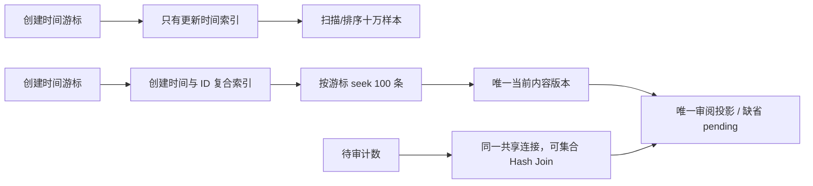
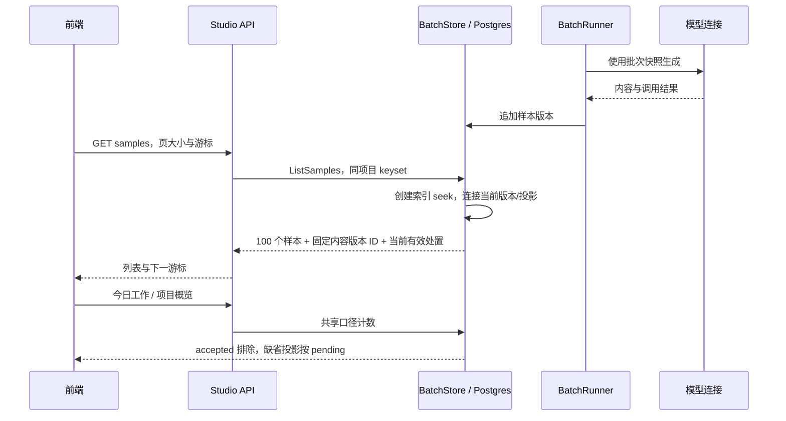

# 十万样本分页与待审计数性能验证

本交付落实 Issue #160 T29 的十万样本数据库基准，不替代真人任务验证或 48 小时灰度。2026-10-08 在独立临时 Postgres 上测量生产 `BatchStore.ListSamples` 与待审计数，发现分页排序索引错位及逐行连接瓶颈，随后修复并在同资源配置下复测。

## 环境与数据

| 项目 | 本次实测设置 |
| --- | --- |
| 数据库 | Docker `postgres:17-alpine`，Postgres 17.11，每次新建临时容器、全量迁移 |
| 数据库资源 | 2 CPU 配额，2 GiB 内存上限 |
| 测量进程 | Docker Go 1.24.13，2 CPU 配额，2 GiB 内存，`GOMAXPROCS=2` |
| 数据 | 100,000 个样本身份、100,000 个内容版本、90,000 个审阅投影 |
| 内容 | 每版含问题、约 280 字推理和答案；十个相邻样本共享创建时间以验证游标全序 |
| 审阅分布 | 80% accepted、10% 显式 pending、10% 无投影，待审计数应为 20,000 |
| 时间分布 | 创建时间递增、更新时间反向，避免原更新索引偶然满足创建排序 |
| 单次分页 | 每页 100 条；首页、后页、50,001–50,100 和 99,901–100,000 页段 |
| 重复与并发 | 每类分页单并发 30 次；计数单并发 15 次；首页 4 并发、每 worker 20 次 |
| 分位 | P50/P95 使用最近秩法；首读单列，之后为已装载/ANALYZE 的温缓存测量 |

资源配置由临时数据库 runner 的可选参数固定，既有默认行为保持原样。Go 模块及编译缓存复用，仅影响构建耗时。计时包含真实 Store 调用、连接池和结果解码；不包含 HTTP、前端渲染或模型调用。宿主机同时有其他服务运行，因此这些数字是本环境测量，不能直接视作生产 SLA。首读也不是操作系统冷缓存测试。

## 根因与改动

分页按 `(project_id, created_at DESC, id DESC)` 筛选、排序并推进游标，既有索引却按 `updated_at`。十万样本下首页计划出现并行扫描和排序，拿到 100 条也要处理整个项目。

审阅状态共享连接原先使用 `LEFT JOIN LATERAL ... LIMIT 1`。待审计数对每个样本查当前内容版本及投影，形成十万次循环；列表为取版本 ID 又执行了一次相似查询。

现在增加匹配游标的索引，直接以唯一键连接当前版本及投影，列表复用这一个当前版本连接。`UNIQUE(sample_id, version)` 和投影主键保证一对零或一，无投影继续按 pending 计算。所有读模型继续复用同一连接和 `COALESCE` 口径。





## 实测结果

修复前原始记录：[before.json](../audit/issue-160-performance/before.json)。修复后：[after.json](../audit/issue-160-performance/after.json)。两份记录包含全部指标、版本、实际索引定义、完整 `EXPLAIN (ANALYZE, BUFFERS, FORMAT JSON)`。

| 调用 | 次数/并发 | 前 P50 ms | 后 P50 ms | 前 P95 ms | 后 P95 ms | 后最大 ms |
| --- | --- | ---: | ---: | ---: | ---: | ---: |
| 首页 | 30 / 1 | 262.11 | 1.31 | 378.98 | 5.08 | 5.36 |
| 后页 | 30 / 1 | 293.31 | 1.84 | 446.27 | 8.14 | 13.05 |
| 中页 | 30 / 1 | 165.72 | 1.53 | 262.06 | 6.91 | 13.44 |
| 末页 | 30 / 1 | 106.17 | 1.48 | 186.23 | 7.63 | 16.28 |
| 未接纳首页 | 30 / 1 | 222.59 | 2.58 | 347.35 | 6.40 | 11.11 |
| 当前待审计数 | 15 / 1 | 667.38 | 193.35 | 989.41 | 304.63 | 304.63 |
| 首页并发 | 80 / 4 | 513.80 | 5.95 | 715.30 | 39.61 | 67.44 |

| 查询计划 | 修复前 | 修复后 |
| --- | --- | --- |
| 首页样本访问 | 两个并行扫描各约 50,000 行，再排序 | 创建索引 seek 100 行 |
| 中页 | 扫描/过滤全表，再排序约 50,000 行 | 创建索引按复合游标 seek 100 行 |
| 末页 | 仍扫描全表才筛出末尾 100 行 | 创建索引 seek 100 行 |
| 未接纳首页 | 扫描排序十万行再过滤 | 索引约 495 行即可得到 100 个未接纳样本 |
| 待审计数 | 十万次 LATERAL 循环 | 两个 worker 集合 Hash Join，真实计数 20,000 |
| 内容版本读取 | 列表重复当前版本查找 | 当前版本连接一次，同时提供版本 ID 和审阅投影 |

这次实测证明分页不会随页码推进重复扫描排序整个项目；准确待审计数仍须处理当前内容及投影集合，保持 O(n)，本改动没有把计数改成缓存或估计值。索引创建通过正常迁移执行，已有大库应用时会承担索引构建的写锁与磁盘成本。

## 行为回归与复现

`internal/store/sample_query_test.go` 覆盖参数正常化、限额边界、同时间戳游标不重复/漏项、取消返回错误且数据不改变，以及 v1 已接纳/v2 无投影时仍按当前 v2 待审计算。既有列表、今日工作、项目概览与待审计数一致性测试也在真实 Postgres 上执行。

性能用例默认不运行，必须显式打开并通过临时数据库 runner 执行。Fixture 只用于真实数据库装载；没有替换 Store 查询，也不以模拟响应时间作为证据。用例获取测试位置时使用 OFFSET，但该准备工作位于计时外，生产查询仍为 keyset。

```bash
TEST_POSTGRES_PORT=55441 TEST_POSTGRES_CPUS=2 TEST_POSTGRES_MEMORY=2g \
TEST_GO_CPUS=2 TEST_GO_MEMORY=2g \
TEST_GO_BUILD_CACHE=llm-workflow-go-cache TEST_GO_MOD_CACHE=llm-workflow-go-mod \
scripts/go-test-postgres.sh sh -c \
  'GOMAXPROCS=2 LLM_RUN_SAMPLE_PERFORMANCE=1 \
   LLM_SAMPLE_PERFORMANCE_REPORT=/w/docs/audit/issue-160-performance/after.json \
   go test -v ./internal/store -run "TestSampleQueryPerformance100K" -count=1'
```

每次 runner 新建数据库，逐个应用全量迁移，并在成功/失败退出时清理唯一临时容器。报告输出路径可配置，复测时应选新文件名以保留既有证据。测试不操作共享全栈或生产库。

T29 的十万样本数据库基准已具备真实数据与查询计划；真人任务、触屏产品验收和 48 小时灰度仍由各自验收要求决定，本报告不把这些条件标记为完成。
