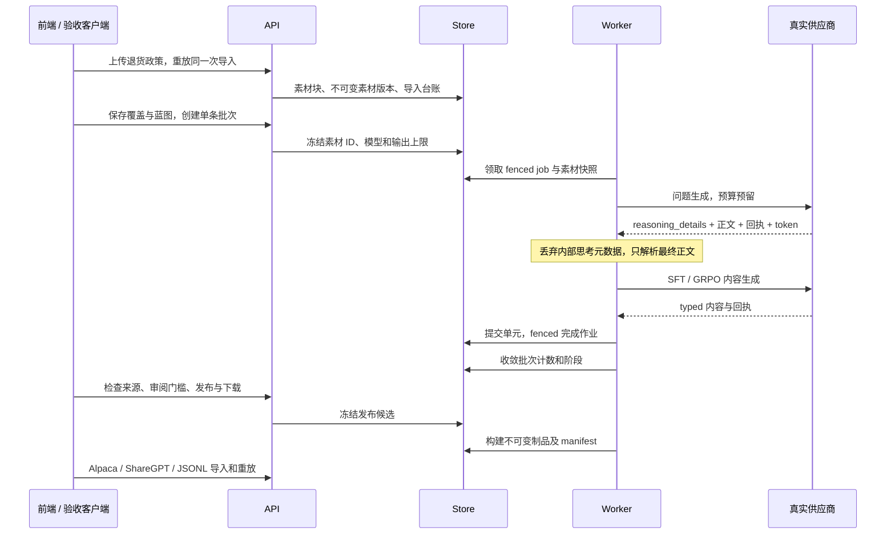
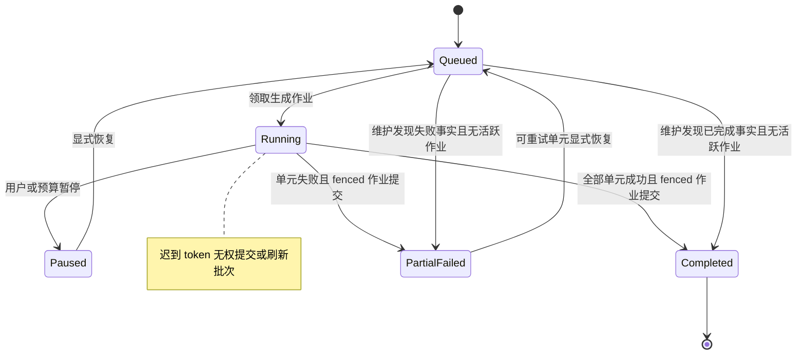

# 素材接地与 EasyDataset 对接的真实验收

本记录对应 Discussion #165 的原生素材生成、公开格式导入与发布追溯验收；实现说明见 [素材问题生成与交付追溯](source-grounded-generation.md)。它记录实际运行及修复，不替代 Issue #160 的独立质量评估、真人会话和 48 小时灰度要求。

## 环境和验收范围

验收使用独立 Compose 项目 `llmgrounding`，API 为本机 18086 端口，前端为 13216 端口，数据、对象存储与业务项目均与现有栈隔离。起始 API/前端版本为 `aef49ad-grounding-wip`；Worker 使用 `e381256` 加本次修复。这是混合版本验收，不能作为精确 main 版本验收。

现有连接 1、32、33、34 使用相同接入点及凭据。不同模型名称或连接 ID 不构成独立接入点。本轮只通过连接 API 修正隔离栈连接 1 的模型名为真实 `/models` 返回的 `deepseek-v4.1-flash`，加密凭据前后不变，未修改其他栈。

| 接入验证 | 实际结果 | 判定 |
| --- | --- | --- |
| `/models` | HTTP 200，返回 canonical 模型 ID | 模型名应使用供应商公开 ID |
| `global:hy3` 最小请求 | HTTP 404 `model_not_found` | 旧别名不能用于当前接入点 |
| `deepseek-v4.1-flash` 最小请求 | HTTP 200；另有 HTTP 503 | 可使用，但仍有上游可用性波动 |
| `gpt-5.5`、`gpt-5.6-terra`、`gpt-6-astra`、`gpt-5.4-mini` 最小请求 | HTTP 502 `upstream_error` | 此次不能证明这些模型可正常执行 |
| 裁判独立性 | 只有一个接入点及凭据 | 不声明独立质量评估已完成 |

## 实际故障及原地修复

首轮真实项目 2、批次 2 获得两次供应商回执，但包装 JSON 中的 `reasoning_content` 与 `content` 被混合。思考中的格式示例被当作输出：reasoning 为“第1步...第2步...”，answer 为“...”。样本未改写；验收在发布前停止。修复后包装响应正文优先，正文遍历排除 reasoning 子树；缺少正文的结构化 `reasoning_details` 不能替代最终答案。

同一轮单元成功后，作业完成但批次仍保持 queued。根因是批次刷新发生在作业提交前，Store 正确保留了仍有 running job 的批次，却没有提交后的刷新。Worker 现在仅在 fenced `CompleteJob` 成功后刷新批次；维护查询额外发现已无 pending/running 单元与生成作业的 queued/running 批次，覆盖崩溃窗口。暂停状态与迟到租约不会被强行改写。

第二轮运行 ID `2026-10-08T05-58-53-681Z` 新建项目 3、批次 3。素材导入与幂等重放通过，真实问题生成失败；批次正确进入 partial_failed，completed=0、failed=1，证明终态修复已经覆盖真实失败路径。用量台账记录供应商 request ID `gen_01M4D1FVJ2ZF25E1D7816FH4X0`、模型 `deepseek-v4.1-flash`、input=546、output=3405。费用仍为 estimated，项目 uncertainMinor=5，不能当作实际账单。

该失败最初呈现 invalid_json。随后独立安全探针发现供应商 SSE 在 `delta.reasoning_details[].text` 中发送思考；原 generic SSE 解析把该 text 合并入正文。探针并非上次请求回放，只证明当前供应商形态：HTTP 200、3418 个 SSE 记录、`finish_reason=stop`、最终 JSON 完整、思考正文 5052 字符、input=214、output=3417，其中 reasoning_tokens=3245。因此不将问题归咎于 HTTP 状态或未经证实的截断。修复扩展原有思考字段隔离；正文多个 chunk 仍按顺序合并，同 chunk 的思考元数据不混入正文。

第三轮运行 ID `2026-10-08T06-09-29-692Z` 新建项目 4、批次 4。真实问题生成通过，批次正常收敛 completed；随后脚本拒绝 reasoning/answer 均为“...”的样本，未进入发布。问题回执 `gen_01M4D2397J2T7BEJ6E73R23YFG` 报告 input=546、output=2987；SFT 回执 `gen_01M4D23RN2RF6FC8C5KYMFXD3F` 报告 input=760、output=4097。旧生成器只检查推理非空，因此合法 JSON 占位内容通过了结构校验。

SFT 独立探针先遇 HTTP 503，重试后 HTTP 200，但 `finish_reason=length`，final content 为空，4096 个 completion token 全为 reasoning token。该探针也不是原请求的回放；不能断言第三轮对应回执具有完全相同响应体。它证明 4096 输出上限存在真实的思考耗尽边界。现在客户端在正文或思考 fallback 前检查 `finish_reason=length`，明确返回 truncated，仍先结算真实用量，不再重复请求同一冻结上限。`GenerateSft` 复用原内容校验拒绝占位、过短与自我复制；不需要答案时仅校验推理并清空答案。默认提示改为字段说明，去除可复制的省略号 JSON 示例。

下一轮脚本通过 `JOURNEY_MAX_TOKENS` 显式设置输出上限，并把实际值写入 evidence；改变上限只对新项目和新蓝图生效，不改写原批次或样本。

运行 `2026-10-08T06-18-23-783Z` 使用 16384 上限，项目 5 / 批次 5 生成有效 SFT：推理 1946 字符、答案 533 字符，样本版本 3 引用素材块 9、10。发布 2 下载 SHA-256 为 `a5449ae75d38f11be9f6e90943a6307341fe4fcbabe563f85572fcbf99eb7d51`；manifest 两个素材块均 available，groundedSamples=1、missing=0。两次真实回执分别 input/output=546/2288 与 786/9866；项目 uncertainMinor=15，仍不是实际账单。该运行随后在 GRPO 项目 6 的 missing levels 配置检查处失败，未发出 GRPO 模型请求。

恢复运行 `2026-10-08T06-22-51-232Z` 保留并复用上述 SFT 发布，另建 GRPO 项目 7，并显式冻结“不合格、合格、优秀”三个档位。它使用两次模型调用后因模型未返回请求的档位失败；三种产品格式的 preview、导入、重放及 Alpaca 第二行失败记录均通过，但末段样本列表使用了错误参数 `reviewStatus=all`，只看到未审阅项，未通过最终冻结发布复查。脚本现在使用 API 的 `status=all` 契约，并记录所有并行阶段错误，避免 GRPO 错误遮住产品阶段错误。

独立 GRPO 探针按相同中文档位请求，HTTP 200、`finish_reason=stop`，最终 JSON 却使用 `-1/0/1`；criteria 长度分别为 187、223、279，input/output=484/4961。这也是独立请求，不能冒充项目 7 原请求回放。原提示硬编码 `level="-1"` 示例，与自定义档位矛盾。现在提示使用字段契约，数字字符串和中文标识均逐字保留；生成器明确拒绝未知、空白、重复或缺少的档位，不替模型改写 ID。GRPO 判据和非空边界例共用既有的空值/完整占位识别规则，不套用 SFT 长文本阈值；短真实判据及只提供接受或拒绝其中一种边界例仍符合既有契约。

恢复证据保留 `reusedSFTFromRun` 与旧源码版本/输出上限；产品导入沿用稳定 sourceKey，后续恢复不会再导入一遍同一产品。该流程是多个真实运行的连续验收，不能描述成所有数据都在一次全新运行中生成。

运行 `2026-10-08T06-34-56-014Z` 的 GRPO 项目 8 / 批次 8 完成真实生成，样本版本 7 保留“不合格、合格、优秀”三个中文档位及素材块 15、16。同源裁判拒绝、pending 审阅阻断、自动 accepted 技术流程均通过。发布 4 则进入 build_failed：冻结映射版本 67 使用裸 `levels` / `levelRubrics` 字段引用，既有 exporter 的裸引用按文本转换，将数组变成字符串；逐行 GRPO 校验正确阻止了错误制品发布。

修复只调整新项目默认 GRPO 映射：数组字段使用 `{{levels}}` / `{{levelRubrics}}` 单占位符保留类型，不改变 exporter 既有裸字段语义，不改写旧冻结映射。真实 PostgreSQL 回归从项目创建与原生配置 bootstrap 出发，持久化样本后直接构建发布，验证档位、判据和边界例数组完整；错误裸映射仍拒绝且不返回制品，保存新映射后旧冻结版本的制品 hash 不变，重复 bootstrap 保留现有版本。恢复脚本验证原样本版本、内容 hash 和来源 ID，再显式保存新映射版本、新建发布候选，保留失败发布 4；恢复不重新生成样本或调用模型。

恢复运行 `2026-10-08T06-47-29-957Z` 已完整通过，沿用项目 8 样本版本 7，新增映射版本 73、发布 5，保留旧映射 67 和失败发布 4。GRPO 下载 SHA-256 为 `6f310bf4528d58202de6948a53a357a2f2ccd6d1fa988eec67ce999410a4f7f7`，逐字比对三个中文档位及每档 criteria/accept_case/reject_case；manifest groundedSamples=1、missing=0。项目 8 仍只有两条模型用量记录，恢复无新增模型请求，uncertainMinor=12。三种公开产品格式再次通过 preview/导入/稳定重放、Alpaca 错误第二行、external_import 无素材来源声明、旧 SFT 冻结清单和下载 hash 不变的检查。浏览器保存了 SFT 与 GRPO 发布页截图，显示制品已校验及两块素材、零缺失。

该恢复仍是混合版本及跨轮证据：API/Web 为先前 WIP，Worker 镜像为 `sha256:bec7605fb30d0e9cad41c771c239a66234f38316e175dc49fe2ddf3eb8fd0a4a`；不是精确 main 新项目默认映射验收。合并后将 API/Worker/Web 全部从同一精确 main SHA 重建，再执行不设置 resume/repair 的新 SFT、GRPO 和三格式完整旅程。

## 验证矩阵与可复查证据

| 检查 | 结果 | 限制或解释 |
| --- | --- | --- |
| Worker 作业完成后批次收敛 | 真 Postgres 正常、暂停、迟到 token 测试通过 | 无供应商假响应参与此状态测试 |
| 维护循环处理提交后崩溃窗口 | 真 Postgres pending/leased/committed 测试通过 | 活跃作业不能被误收敛 |
| 包装 JSON 正文与思考隔离 | 正常、空正文、示例 JSON、嵌套思考测试通过 | 兼容既有字符串 reasoning-only 行为 |
| SSE reasoning_details 隔离 | 多 chunk、同 chunk 混合、思考元数据单独返回覆盖 | 单独结构化思考不会生成最终答案 |
| SFT 内容准入 | 正常、无答案、占位、缺少必需答案用例覆盖 | 复用既有 validator，不制造平行校验逻辑 |
| GRPO 自定义档位与内容准入 | 中文/数字 ID、短判据、单边界例、缺档/重复/空档/占位用例覆盖 | 不将模型数字档位伪映射为用户指定档位 |
| 原生 GRPO 默认映射到发布 | 真实 PostgreSQL bootstrap、样本、冻结映射正常/异常回归通过 | 默认数组用单占位符；旧版本与文本映射语义保持不变 |
| 输出截断与计费 | JSON、包装、SSE length 与 quoted 示例边界覆盖 | 真实 token 先结算；冻结上限耗尽不重复付费重试 |
| 最终全量 Go/真实数据库门禁 | 1318 PASS、11 可选 SKIP、必需零缺失，包含 SFT 正常/未知目标子用例 | 43 个迁移完成，gofmt、vet、build 通过 |
| 完整 SFT/GRPO 到下载 | 混合版本跨轮恢复通过，制品与来源核验通过 | 精确 main 全新完整旅程待合并后复验 |
| 独立裁判、真人接受与 48 小时灰度 | 缺少真实证据 | 保留 Issue #160 的未满足边界 |

真实旅程脚本为 `test/audit/source-grounded-journey.mjs`，必须在 Node/Playwright 容器中指定隔离 API、前端和真实连接 ID。脚本为每轮保存 evidence、制品与截图；它检查素材来源 ID、同源裁判拒绝、pending 审阅阻断发布、自动 accepted 后发布下载及 SHA-256、三种公开格式的导入重放和失败明细、冻结发布内容不变。自动 accepted 仅检验技术流程，不能冒充人工审阅。

响应探针只在内存中解密现有凭据，不打印或保存凭据。输出目录保留脱敏响应与简明正文/usage 形态。原失败项目、批次和样本继续保留，没有通过 SQL 改写结果。旧版本恢复显式新增映射与发布；精确 main 复验将使用新项目，避免以改写旧证据制造成功。
