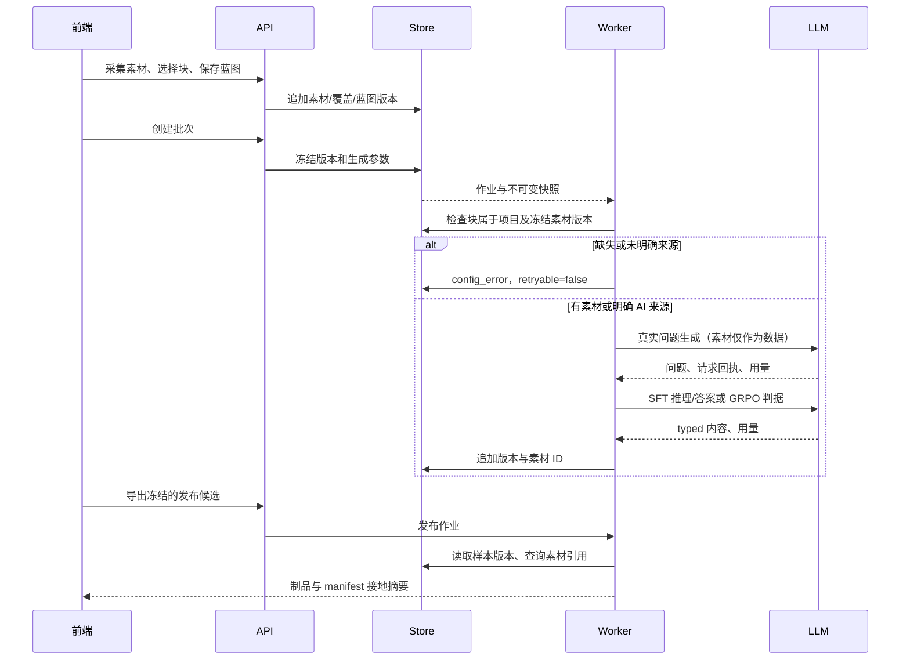
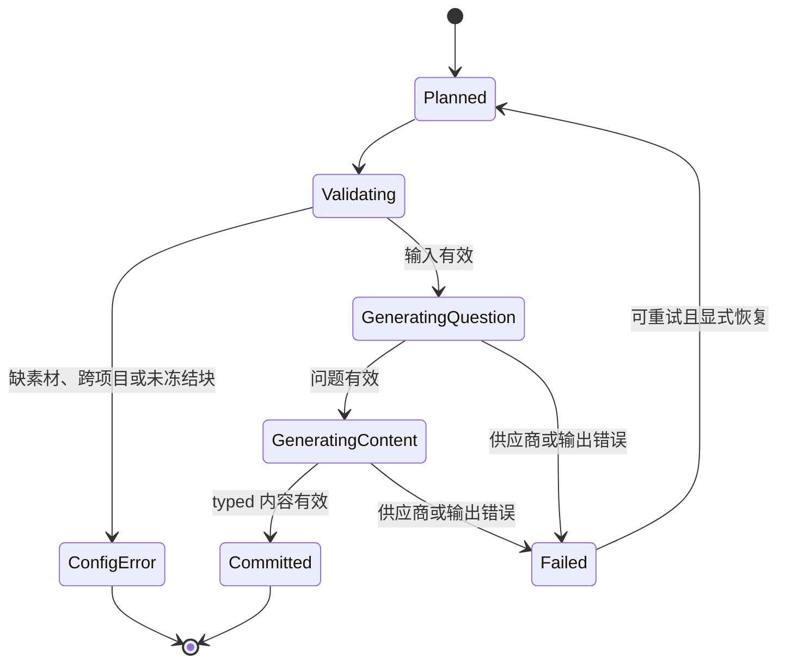
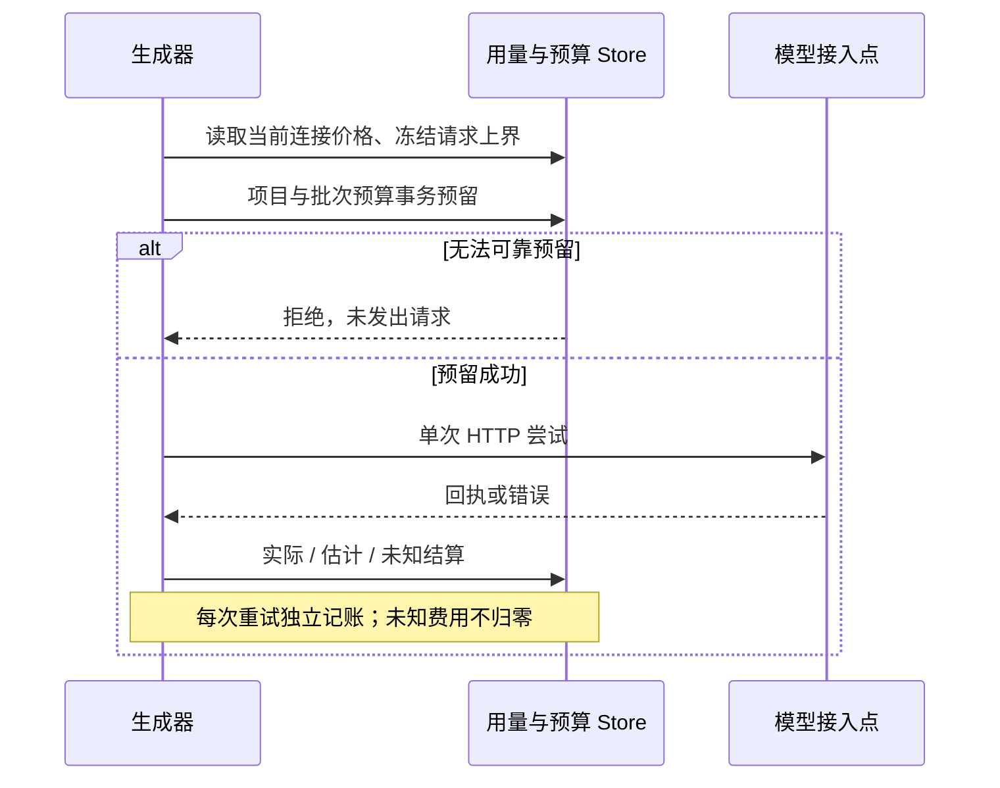

# 素材问题生成与交付追溯

对应 Discussion #165 与 Issue #217。接入边界是公开导出格式及原生素材采集；SFT 和 GRPO 共用一个问题生成函数。

| 来源 | 生成行为 | 样本标记 | 追溯 |
| --- | --- | --- | --- |
| document | 校验冻结版本里的块 ID，读取块并调用模型生成问题 | document | source_chunk_ids、manifest ID/内容摘要/章节 |
| ai | 用户显式选择后按主题与难度生成问题 | keyword_only | 不计为素材接地 |
| manual / none / 未指定 | 拒绝自动生成，给出不可重试配置错误 | 无新样本 | 保留失败原因 |
| external_import | 导入 Alpaca、ShareGPT 或 JSONL 成品 | external_import | 导入台账，不宣称素材接地 |

素材查询不会回退到当前默认版本。SFT 与 GRPO 的两次调用均使用批次冻结的最大 token 数和温度；回执用量聚合，任何未报告的输入或输出项继续保持未知。

预算在每个 HTTP 尝试之前事务预留，每个响应、空响应、解码失败和重试分别结算；成功的问题生成不会因为后续内容失败而从账目消失。超时使用独立的有界上下文记录未知费用并占用当时的预留，不补零。缺少价格、价格与当前接入点不一致、预留失败均不发出模型请求。管理员可在连接页保存价格版本；保守报价以 `isEstimated` 明确标记，即使 token 来自真实供应商，金额仍为 estimated，不能冒充实际账单。免费连接须显式声明。

实验裁判复用同一记账入口，冻结模型、接入点、输出上限及可选温度；旧实验缺少输出上限时拒绝付费执行，需创建新的实验。项目级实验使用项目预算，绑定批次的实验同时使用批次预算；同作业尝试重放已结算请求不会重复付费，新尝试保留独立回执。裁判预算耗尽后，同一次作业尝试的其他裁判停止发出请求，并保留逐条错误证据。

批次因预算暂停时，正在等待调用的单元恢复为 pending，已成功单元保持成功；恢复后从待处理单元继续，单元尝试号保留递增历史。手动暂停同样在每次请求预留时检查，已在途的响应仍结算，暂停后的答案调用和 HTTP 重试不再发出。

发布清单为每条样本保存来源和素材引用。素材不存在或正文被擦除时，保留 `missing_chunk` 记录；文件可以继续导出，接地摘要明确计入缺失。历史内容 hash 的计算字段保持原契约；manifest hash 包含新增追溯信息。

输入素材用于提供事实依据，关联块不等于自动证明模型答案正确；既有规则、实验和人工审阅继续决定是否接纳及发布。
