# 甲方验收审计报告（Atelier 数据项目工作室）

> 审计身份：**甲方验收方**（付费方，非项目组成员）
> 审计对象：`main` @ `3838067`
> 审计方式：Docker 全栈真实启动 + 真实 Chromium 逐页操作 + 截图取证
> 审计日期：2026-09-24

---

## 0. 总体结论

**不予验收。**

这不是"有几个小 bug"的问题。系统在**核心业务主链路上是断的**：
我作为甲方，从注册进入系统开始，**无法走完"设计 → 试制 → 审阅 → 发布"中的任何一条完整链路**，
最终**一份可交付的训练数据也拿不到**。

更要紧的是：系统**知道自己断了，但给出的指引是错的** ——
失败提示让我"去设计页的生成节点补齐"，而设计页那个字段**根本没有输入框**。

### 0.1 一句话结论表

| 维度 | 结论 | 最严重证据 |
| --- | --- | --- |
| 业务流程完整性 | ❌ **阻断** | 设计页模型连接字段只读，批次必然全失败 |
| 功能可用性 | ❌ 不合格 | 6/6 项目工作区页首屏被"能力覆盖"表占据 |
| 视觉与信息层级 | ⚠️ 不合格 | 核心操作被推到首屏之外（最远 1017px） |
| 文案与诚实性 | ⚠️ 不合格 | Markdown `**` 未渲染；指引指向不存在的控件 |
| 国际化 | ❌ 缺失 | 全站中文硬编码，无语言切换 |
| 工程可信度 | ⚠️ 不合格 | 构建未注入版本号，部署无法自证 |

---

## 1. 🔴 P0 — 核心业务链路彻底阻断（不可验收）

### 1.1 设计页"模型连接"必填字段没有任何输入方式

**这是本次审计最严重的发现，它让整个产品无法交付。**

生产蓝图 → 生成节点，`模型连接` 标记为**必填**（红星 `*`），
但右侧检查器渲染的是**纯文本**，不是输入框：

```
当前值：0（候选选择器在 T28/T20 提供）
```

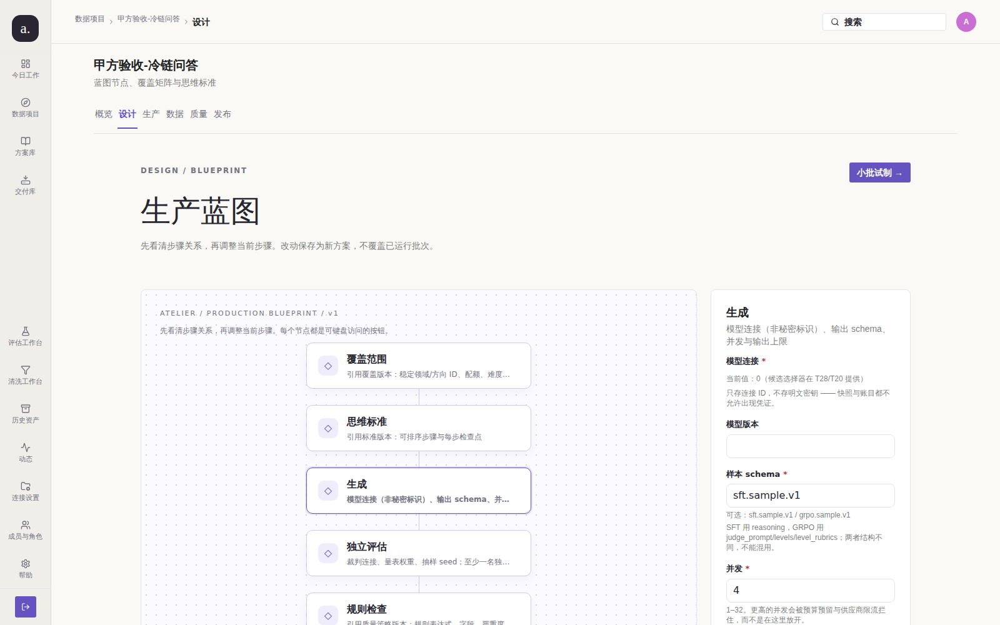

代码确认（`apps/web-user/src/studio/pages/BlueprintPages.tsx:546`）：

```tsx
// 复杂引用字段先只读展示：给一个能编辑但无法选值的输入框
// 会制造「看起来能配、其实配不了」的错觉。
<Text type="tertiary" size="small">
  当前值：{display || '（未设置）'}（候选选择器在 T28/T20 提供）
</Text>
```

而服务端元数据（`internal/model/blueprint_nodes.go:167`）把它定义为**必填**：

```go
Name: "modelConnectionId", Label: "模型连接", Kind: FieldKindID, Required: true,
```

**验证：全站没有任何页面能设置这个值。**

| 页面 | 含 `modelConnection` 的可编辑控件 | 结果 |
| --- | --- | --- |
| `/p/1/blueprint` | 0 | ❌ |
| `/settings/connections` | 0（页面**没有任何输入框**） | ❌ |
| `/p/1/runs/new` | 0 | ❌ |
| `/p/1/pilot` | 0 | ❌ |
| `/p/1/rules` | 0 | ❌ |
| `/p/1/quality/new` | 0 | ❌ |
| `/p/1/releases/new` | 0 | ❌ |

"连接设置"页只显示非秘密标识，**一个可编辑控件都没有**：

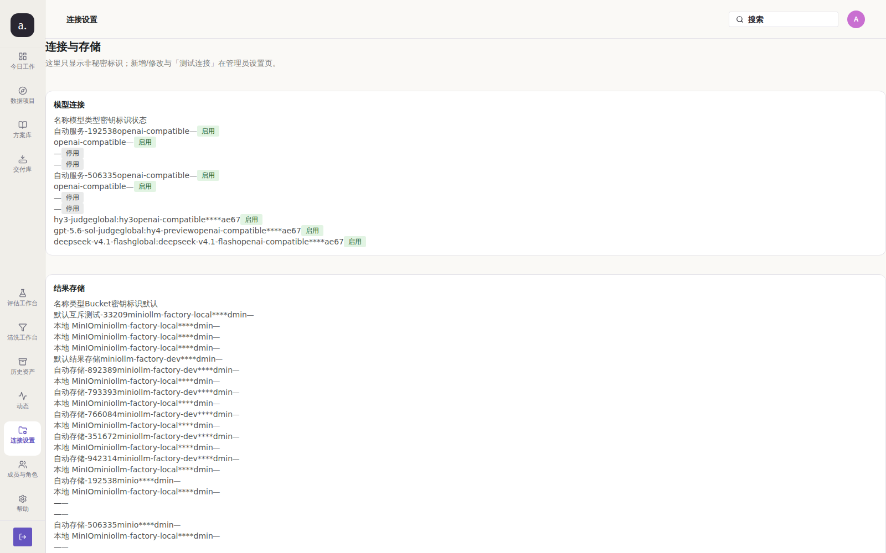

**甲方影响**：我无法让系统调用任何模型。数据生成能力 = 0。

---

### 1.2 失败提示把用户指向一个不存在的控件

因为 1.1，批次必然全失败。但失败页给出的建议是：

> 建议：生成配置有问题（例如缺少连接），请到**连接设置**补齐后新建批次
> 原始信息：missing model connection: 批次快照没有模型连接，请到**设计页的生成节点**补齐

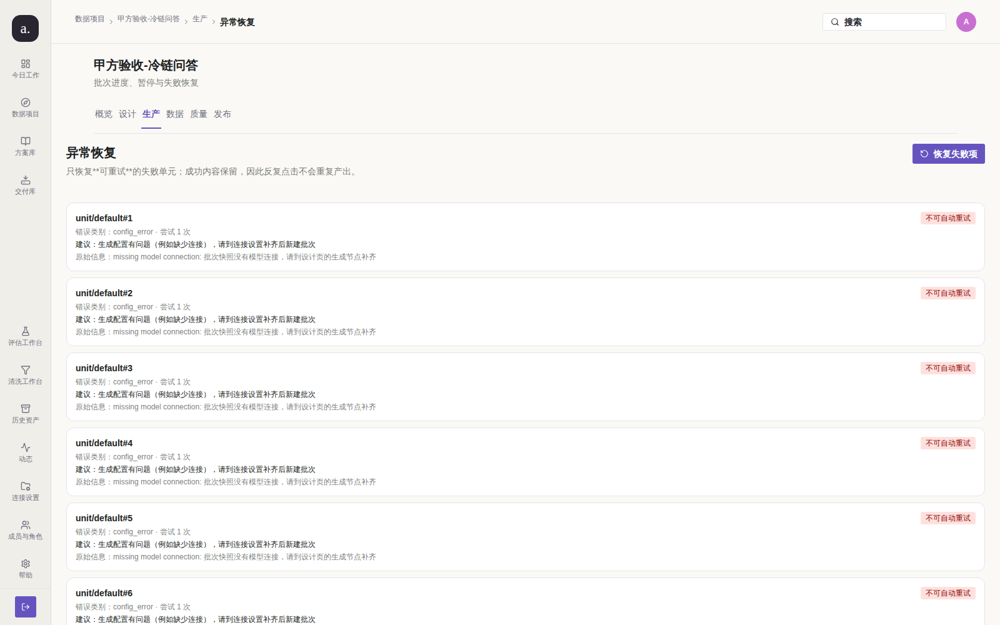

**两个指引互相矛盾，而且都指向死路**：
- "连接设置"页没有可编辑控件（见 1.1）
- "设计页的生成节点"正是那个只读字段

这是**最伤害信任的一类缺陷**：用户按提示操作，走到的还是同一个死胡同，
而且**没有任何一处告诉用户"这是产品还没做完"**。

**同时暴露：批次可以在必填配置缺失的情况下被创建。**
我用 API 直接验证（无 `blueprintVersionId`）：

```bash
POST /api/v1/projects/1/batches {"purpose":"pilot","unitCount":12}
→ 202 {"resourceId":"b_1","status":"queued"}      # 创建成功
```

前端有"执行前核对"清单，但它**只拦 UI 按钮、不拦服务端**，
而且服务端在快照缺必填字段时**不在创建阶段拒绝**，而是让 12 个单元全部跑到失败：

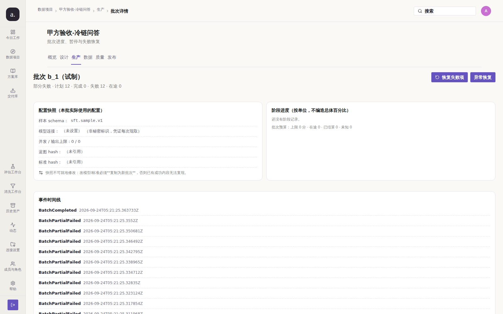

配置快照显示：`模型连接：（未设置）`、`蓝图 hash：（未引用）`、`标准 hash：（未引用）`、`并发 / 输出上限：0 / 0`。
**这些空值在创建时就应该被拒绝**，而不是烧掉一次批次后再告诉用户。

---

## 2. 🔴 P0 — 信息架构错误：6 个页面首屏被"能力覆盖与迁移边界"占据

`LegacyCapabilityWorkbench`（一张**面向迁移期的内部能力对照表**）
被硬编码进了 **6 个项目工作区的首屏**：

```
ProjectsPages.tsx:420   QualityPages.tsx:123    ReleasePages.tsx:138
ReviewPages.tsx:211     RunPages.tsx:125        BlueprintPages.tsx:477
```

**实测各页"能力覆盖"卡片的真实位置与高度：**

| 页面 | 卡片起始 Y | 卡片高度 | 主内容起始 Y | 结论 |
| --- | --- | --- | --- | --- |
| 质量 | 308px | **741px** | **1017px** | 主内容在首屏之外 |
| 数据 | 308px | **705px** | **981px** | 主内容在首屏之外 |
| 发布 | 338px | 449px | 755px | 主内容在首屏之外 |
| 生产 | 308px | 431px | 550px | 占满首屏上半部 |
| 设计 | 1491px | 800px | 494px | 被推到页面最底部 |

### 证据：质量页

首屏（1000px 高）**全是内部迁移对照表**，"质量实验室"在 1017px 处 —— 首屏完全看不到：

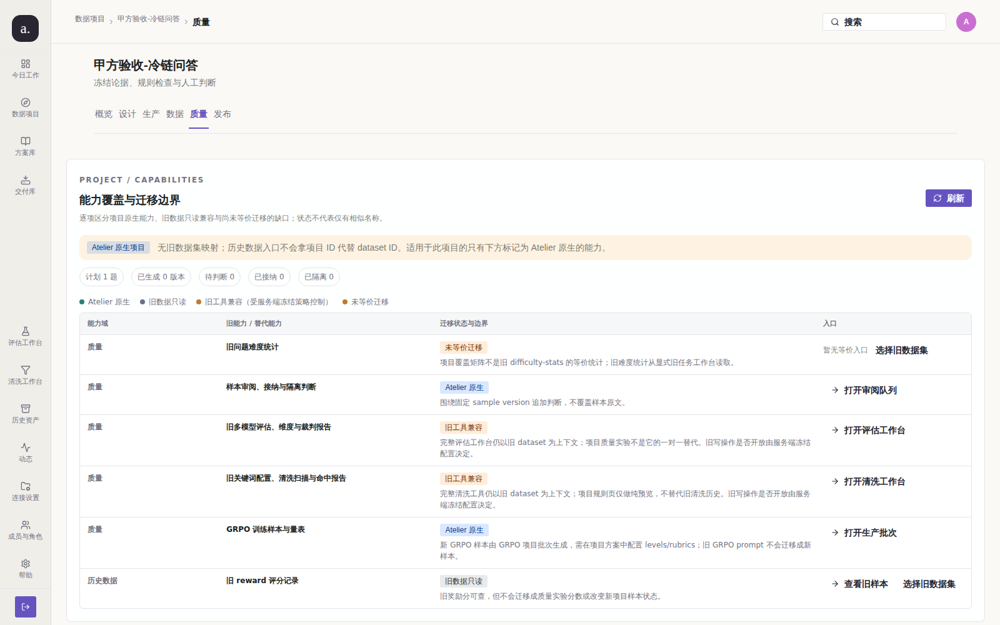

向下滚动后，才看到真正要干活的"质量实验室"：


### 证据：数据页

同样，"样本工作区"被压到 981px：


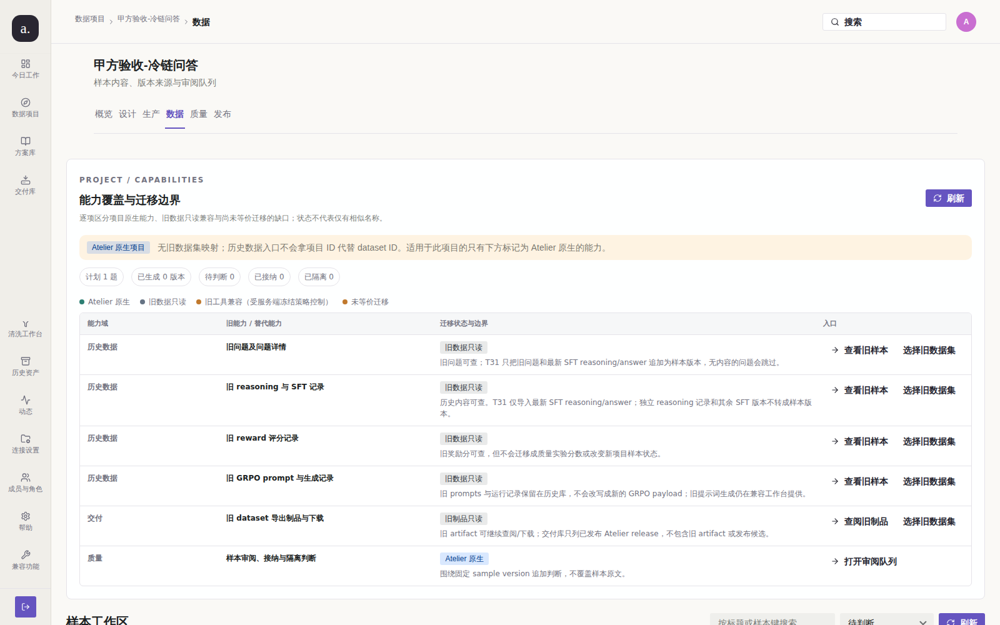

### 甲方影响

1. **我要干的活，第一屏看不见。** 每次进入质量/数据页，都要先滚过一整屏
   "旧能力 / 替代能力 / 迁移状态与边界"的内部对账表。
2. **这张表对甲方毫无价值。** "T31 只把旧问题和最新 SFT reasoning/answer 追加为样本版本"
   —— 这是给**开发团队**看的迁移说明，不是给**用户**看的。
3. **同一张表在 6 个页面重复出现**，其中大部分条目完全相同，
   用户会认为"每个页面都一样，我是不是点错了"。
4. **它把自己标注为"能力覆盖"**，却在标题上叫"能力覆盖与**迁移边界**" ——
   迁移是内部过程，用户不关心边界在哪。

---

## 3. 🟠 P1 — 视觉与信息层级

### 3.1 生产蓝图页：核心画布被 1491px 的说明表挤到页面底部

设计页的主内容是"生产蓝图"节点画布，但能力覆盖表出现在 **1491px** 处（卡片高 800px）。
页面总高 2342px，**真正的设计工作占不到 1/3**。

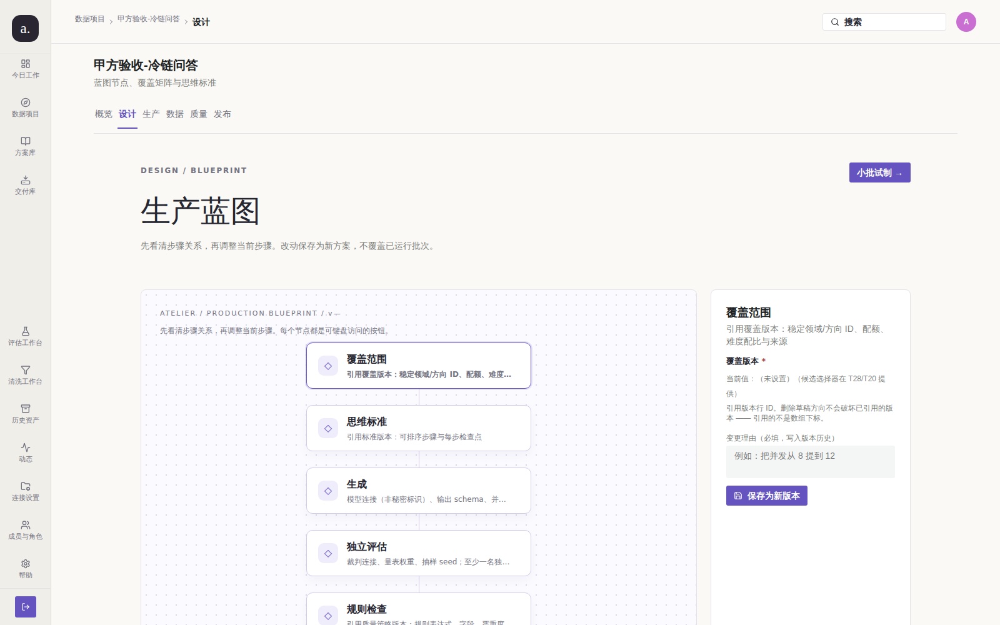

### 3.2 "运行态"页面在蓝色画布上放了一个悬浮按钮，语义不明

今日工作页右侧有一个 `目标 → 证据 → 交付` 的紫色按钮，
它**压在装饰性线条上**，视觉上像数据/标签，实际是可点击按钮，
点击无任何提示地跳转。**用户无法判断它是按钮还是图示。**

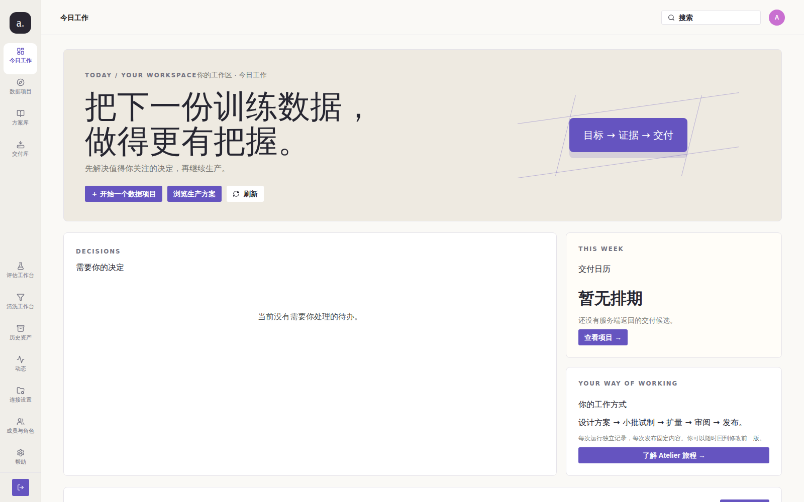

### 3.3 移动端：首屏字号 38px，一行只放 6 个字

移动端（390px）主标题 `font-size: 38px / line-height: 41px`，
标题块宽 312px、高 123px，**"把下一份训练数据，做得更有把握。"被拆成 3 行**，
且首屏内出现了两次（顶栏 + 正文），首屏信息密度极低：

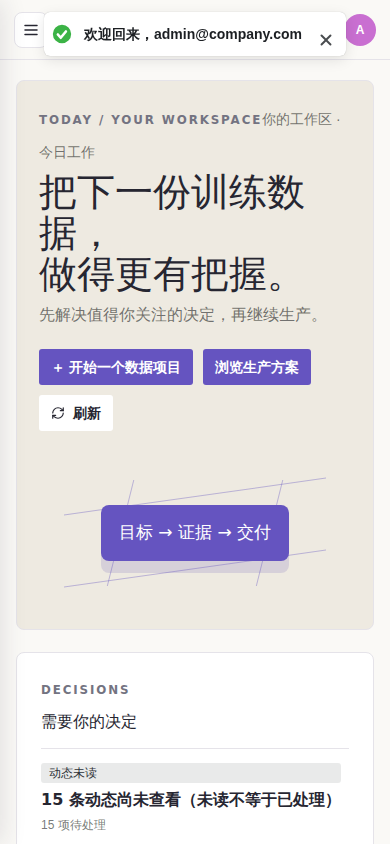

### 3.4 侧边栏：13 个图标菜单，"兼容功能"混在正式菜单里

侧边栏共 13 项，其中"评估工作台 / 清洗工作台 / 历史资产 / 兼容功能"
是**过渡期的旧入口**，但它们与"今日工作 / 数据项目"同级同权重呈现，
没有任何视觉区分说明"这些是要被淘汰的"：


---

## 4. 🟠 P1 — 文案与诚实性

### 4.1 Markdown 星号未渲染，直接显示在界面上

至少 4 处界面上出现裸露的 `**`：

| 文件 | 行 | 界面显示 |
| --- | --- | --- |
| `RunPages.tsx` | 572 | 只恢复**可重试**的失败单元 |
| `ComparePage.tsx` | 206 | 比较的是**相同输入下**两个方案的输出 |
| `QualityPages.tsx` | 130 | 报告的分母是实验创建时**冻结**的样本版本数 |
| `QualityPages.tsx` | 674 | 预览是**纯读**：不改内容、不改处置 |


**这是低级但高频的观感事故**：在一份以"严谨、可追溯"为卖点的企业产品里，
界面直接漏出 Markdown 源码，会让人怀疑整个产品的完成度。

### 4.2 方案库空状态指向不存在的功能

方案库空状态写：

> 还没有方案。方案由已经跑通的项目保存而来（**设计页 → 保存为方案**）。

**但"保存为方案"这个按钮在全站不存在。** 实测设计页全部按钮：

```
搜索 / A / 小批试制 → / ◇覆盖范围 / ◇思维标准 / ◇生成 / ◇独立评估
/ ◇规则检查 / ◇人工检查点 / ◇版本交付 / 保存为新版本 / 复制此版本
/ 查看覆盖矩阵 / 刷新 / …
```

只有"**保存为新版本**"，没有"保存为方案"。
全仓库搜索 `保存为方案` 只命中这行空状态文案本身。

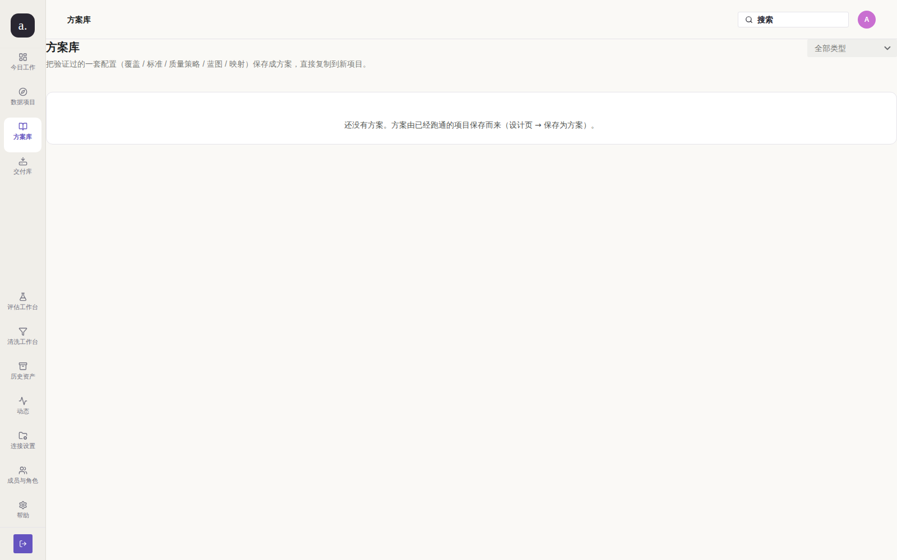

### 4.3 "准备发布"页要求填"映射版本 ID"，但用户无从得知 ID

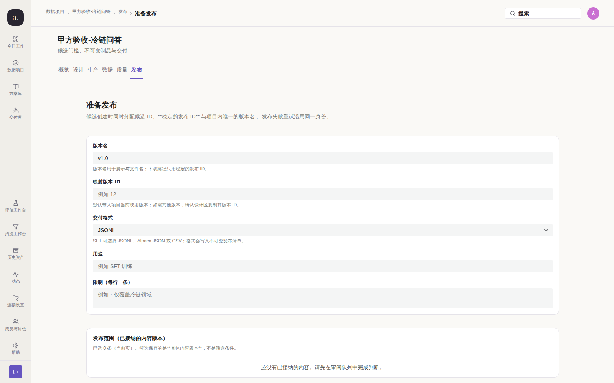

`映射版本 ID` 提示"例如 12"，用户必须**手输一个内部数字 ID**。
`蓝图版本 ID`（试制页）同样提示"例如 9"。
这是把内部主键暴露给用户，且**没有任何下拉或选择器**。

---

## 5. 🟠 P1 — 缺失的基础能力

### 5.1 无国际化

全站中文硬编码，**没有任何语言切换入口**。搜索 `i18n` 相关的界面控件为零。
若甲方是跨国团队，此项目直接不可用。

### 5.2 无 404 页面，未知路由静默跳首页

```
/totally-bogus-page  →  /today   (HTTP 200，无任何提示)
/catalog             →  /today   (设计工具路由，生产未挂载，静默重定向)
```


**用户拼错 URL 会以为自己进对了页面**，而不是得到"页面不存在"。

### 5.3 构建未注入版本号，部署无法自证

```
GET /version.json → {"version":"unknown","buildTime":"2026-09-24T05:10:11.965Z"}
```

帮助页诚实地承认了这一点：

> 未注入构建版本（构建时未传入 GIT_SHA，无法自证与源码的对应关系）

**这份诚实值得肯定**，但结果是我作为验收方**无法确认我测的就是这份源码**。
README 里写了 `./scripts/build-with-version.sh`，但 `make compose-up` /
`docker compose up -d --build`（README 推荐的标准命令）**不会**注入版本。

### 5.4 动态列表被同一条事件刷屏

一个批次失败，动态页产生 **12 条**几乎相同的"批次部分失败（批次 1）"，
把其他所有动态挤走：

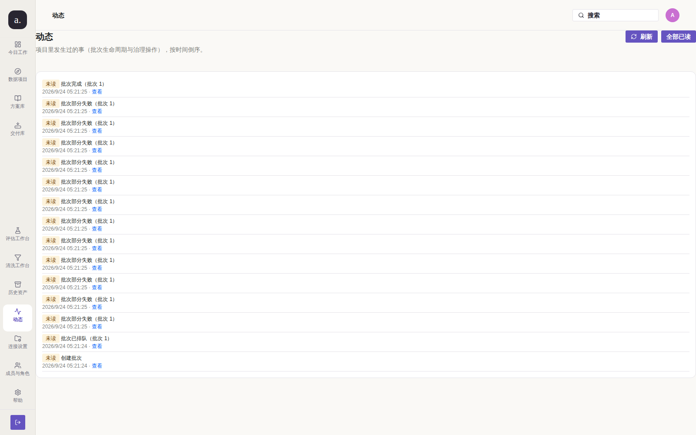

今日工作页因此显示"动态未读 15 条 · 15 项待处理"，
**把 1 个问题放大成 15 个待办**，用户会被噪音淹没。

### 5.5 恢复按钮可点击但必然无效

"异常恢复"页的「恢复失败项」按钮**未置灰**，点击后提示：

> 已重置 0 个可重试单元：当前没有可重试的失败项

**按钮应该在没有可重试项时禁用**，而不是让用户白点一次。

---

## 6. 🟡 P2 — 一致性

### 6.1 "刷新"按钮在同一页出现 2 个，作用域不清

| 页面 | 可见"刷新"按钮数 |
| --- | --- |
| 生产 | 2 |
| 数据 | 2 |
| 发布 | 2 |

一个刷"能力覆盖"，一个刷主内容，**文案完全一样**。

### 6.2 命令搜索：侧边栏的实例是死元素

DOM 中存在两个 `[data-command-search-trigger]`：

| 实例 | 位置 | 可见 | 尺寸 |
| --- | --- | --- | --- |
| #0 | 侧边栏 `.atelier-command-search-slot` | ❌ `display:none` | 0×0 |
| #1 | 顶栏 `.atelier-topbar__actions` | ✅ | 198×28 |

（`styles.css:1102` 显式 `display:none`。）搜索本身**工作正常**：

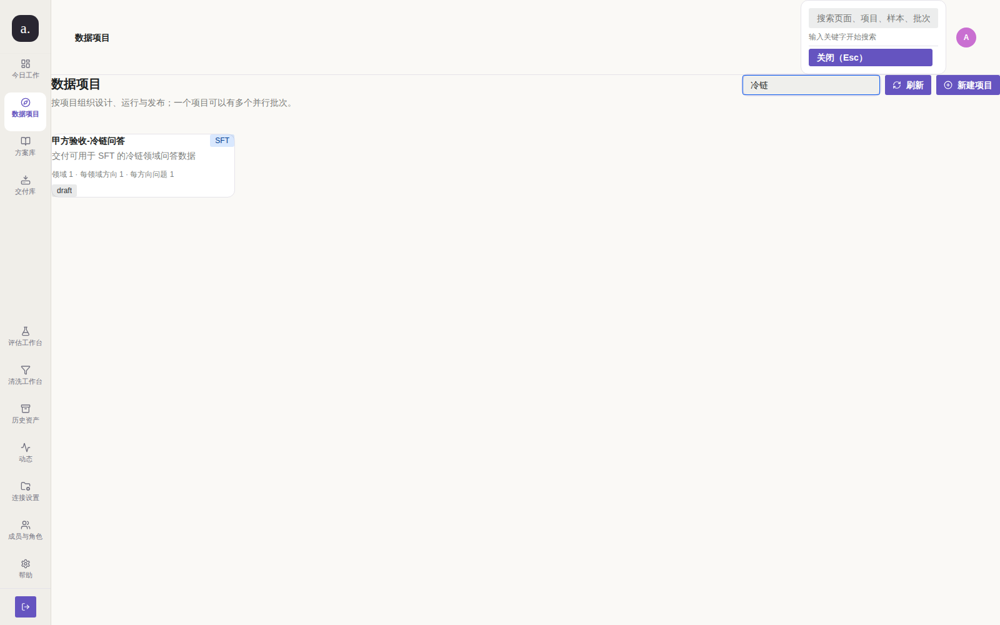

但渲染一个隐藏的死实例属于遗留代码，且会让自动化测试选错元素。

---

## 7. ✅ 做得好的部分（应保留）

作为严格甲方，也要如实说明哪些达到了要求：

| 项 | 说明 |
| --- | --- |
| 权限边界正确 | 匿名访问任何受保护路由 → `/login?next=...`，登录后正确回跳；会话失效同样回跳 |
| 移动端无横向溢出 | 390px 下 5 个页面 `scrollWidth == clientWidth`，无横向滚动 |
| 无障碍基础扎实 | 41 个按钮 0 个无标签，0 个 `img` 缺 `alt`，0 个输入缺 label |
| 键盘可达性 | 蓝图节点全部为可键盘访问的 `<button>` |
| 空状态文案质量高 | 多数空状态说明了"为什么空"和"下一步做什么" |
| 术语表清晰 | 帮助页对"试制/扩量/接纳率/缺分/未知费用/发布候选"的定义准确 |
| 失败分类诚实 | 明确区分"不可自动重试"与可重试，不假装能修 |
| 版本只读语义正确 | 蓝图版本不可就地修改，必须新建（符合"已发布不可变"要求） |

**特别肯定**：`/version.json` 与帮助页的"构建版本"区块**主动暴露了
"未注入 GIT_SHA，无法自证"**，而不是伪造一个版本号。
这种诚实是企业级产品最该有的品质，请保持。

---

## 8. 验收结论与整改要求

### 8.1 阻断项（必须修复后才能重新验收）

| # | 问题 | 验收标准 |
| --- | --- | --- |
| B1 | 模型连接无法配置 | 提供可选连接的下拉/选择器；或明确标注"该能力未交付"并**禁止**创建批次 |
| B2 | 失败指引指向不存在的控件 | 提示必须指向真实可操作的位置，或明确说明"当前版本不支持" |
| B3 | 必填缺失仍可创建批次 | 服务端在创建阶段用 422 拒绝，而不是烧掉批次后全失败 |
| B4 | 6 个页面首屏被能力覆盖表占据 | 迁移表移入折叠区/独立"兼容功能"页，主内容回到首屏 |

### 8.2 重要项（本次验收必须整改）

| # | 问题 |
| --- | --- |
| I1 | 清理 4 处裸露的 Markdown `**` |
| I2 | 修正方案库空状态（"保存为方案"不存在） |
| I3 | `映射版本 ID`/`蓝图版本 ID` 改为选择器，不暴露内部主键 |
| I4 | 补 404 页面，未知路由不得静默跳首页 |
| I5 | `docker compose up -d --build` 默认注入 `GIT_SHA` |
| I6 | 动态列表按批次聚合，1 次失败不得产生 12 条 |
| I7 | 无可用项时"恢复失败项"按钮置灰 |
| I8 | 移动端主标题降字号（38px → ≤28px），提升首屏密度 |
| I9 | 国际化方案（若甲方有多语言需求） |

### 8.3 建议项

- 同页多个"刷新"按钮增加作用域说明（"刷新配置"/"刷新批次"）
- 删除侧边栏 `display:none` 的命令搜索死实例
- 今日工作页 `目标 → 证据 → 交付` 悬浮按钮改为明确的 CTA 样式

---

## 9. 复现方式

```bash
cd /root/llm
git fetch origin main && git checkout main && git pull
cp .env.example .env
docker compose up -d --build

# 采集证据
node test/audit/capture.mjs      # 全路由截图 + capture.json
node test/audit/functional.mjs   # 深链/边界/无障碍/移动端

# 手工复现 P0-1.1（模型连接死锁）
#   1. 登录 admin@company.com / admin123456
#   2. 打开 http://127.0.0.1:3210/p/1/blueprint
#   3. 点击左侧「生成」节点
#   4. 观察「模型连接 *」——只有文本「当前值：0（候选选择器在 T28/T20 提供）」，无输入框
#   5. 访问 http://127.0.0.1:3210/settings/connections ——页面无任何输入控件
#   6. 打开 http://127.0.0.1:3210/p/1/pilot，点「启动试制批次」
#   7. 结果：12/12 全部失败，提示指向上述两个死路
```

完整截图证据见 [`docs/audit/screenshots/`](screenshots/)，结构化采集数据见
[`capture.json`](capture.json) 与 [`functional.json`](functional.json)。
