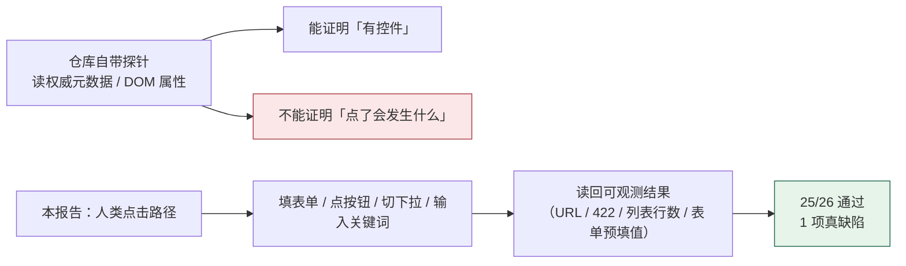
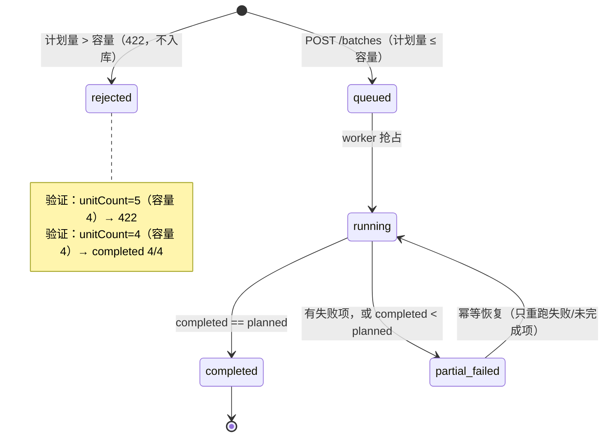
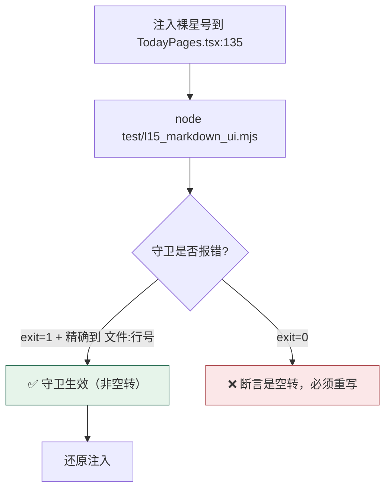
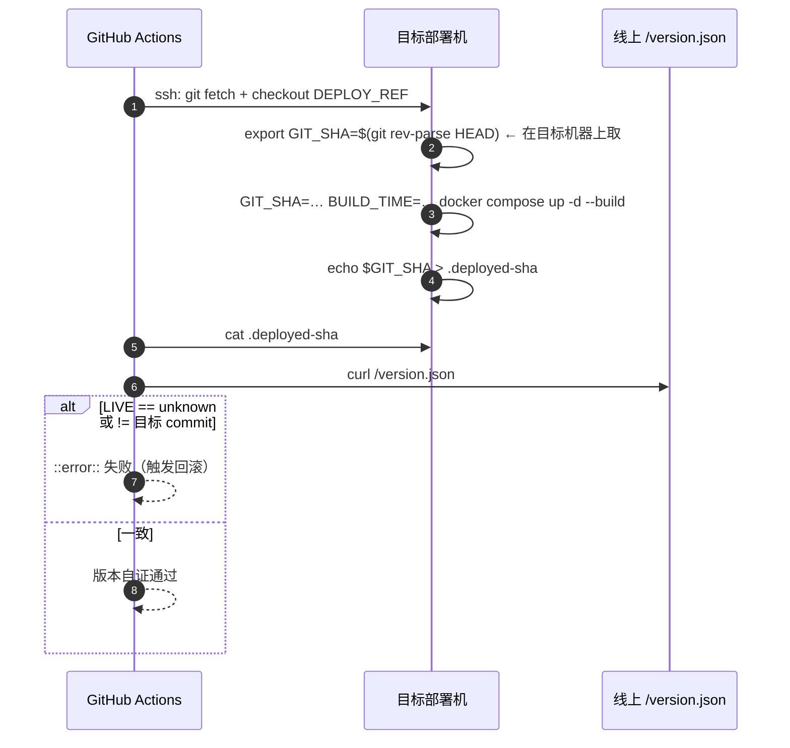
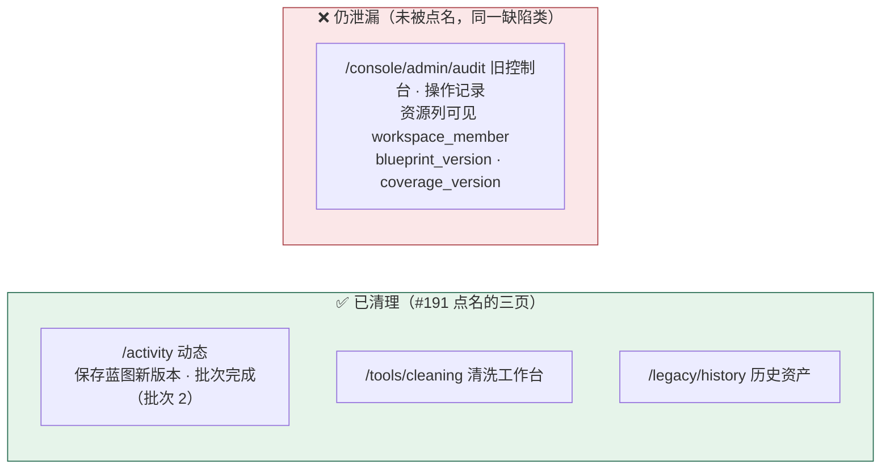

# Issue #190–#195 与 #197（17 条）真机点击复核报告

> **复核方式**：本地 Docker 全栈真实启动 + 真实 Chromium（无头），以**人类点击路径**驱动
> （填表单、点按钮、切换下拉、输入关键词、读回结果），而不是只读源码或 DOM 属性。
> **复核基线**：`origin/main` @ `daebc32`（含 PR #199）
> **部署自证**：`./scripts/build-with-version.sh --all` → `/version.json` = `daebc32923e9c37b869b5ac55f470cffc3686a81`，与本地 HEAD 一致
> **采集脚本**：`test/audit/human-flow-verify.mjs`（可复现）
> **原始证据**：`docs/audit/issue-197-verify/report.json` + 本目录全部截图

---

## 0. 结论矩阵

| Issue | 主张 | 复核结论 | 处置 |
| --- | --- | --- | --- |
| **#190** | 批次「已完成」却只产出 1/12，计划量与覆盖配额不校验 | ✅ **已解决**（核心） | 保持关闭 + 补残余说明 |
| **#191** | 中文界面漏出内部英文事件键与状态枚举 | ⚠️ **部分解决**（三个点名页已清，旧控制台「操作记录」仍漏） | **保持开启** + 评论 |
| **#192** | 未渲染 Markdown 星号扩大到 5 页 6 处 | ✅ **已解决**（守卫经注入哨兵实证有效） | **关闭** |
| **#193** | 表单表达缺陷（映射无列头 / 覆盖矩阵无标签 / 加载文字竖排） | ✅ **已解决**（三项全部实测通过） | **关闭** |
| **#194** | 数据/审阅同页 + 移动端表格崩坏 + 右栏压按钮 | ✅ **已解决**（三项全部实测通过） | **关闭** |
| **#195** | 远程部署落后 main、版本 unknown 无法自证 | ✅ **代码侧已解决**（注入 + 门禁 + 回滚；远程需一次重新部署） | **关闭** + 运维前置说明 |
| **#197** | 用户测试 17 条 | ⚠️ **15/17 已解决**（第 11 条公式不自洽、第 6 条仍强制手填理由） | **保持开启** + 评论 |

**26 项点击式判定中 25 项通过**，1 项失败（#197 第 11 条的 m×n×z 公式自洽性）。
服务端 5xx 响应 **0 条**，前端 `pageerror` **0 条**。

---

## 1. 评审方法：为什么不能只看仓库自带的探针

仓库自带的 `test/audit/verify-197-remediation.mjs` 读的是**权威元数据与 DOM 属性**，它无法回答
「用户动作的因果」。本次复核刻意重写了探针，且**在过程中被自己的探针误报坑了 4 次**，
每一次都靠回溯真机状态才定性 —— 这本身就是「只看属性断言会漏报/误报」的证据：

| 误报 | 表面结论 | 真因 |
| --- | --- | --- |
| 「分步表单无法编辑」 | #197-2 未修 | 该节点已引用标准版本，草稿 `steps` 为空 → 表单里本来就没有输入框；**点「添加步骤」后字段齐全且可输入** |
| 「计划量超过容量没被拦截」 | #190 未修 | 探针找 `input[type=number]`，而 Semi `InputNumber` 渲染的是 `input[type=text]#plan-units`；**真实点击确实收到 422** |
| 「样本预览还是原始 JSON」 | #197-3 未修 | 探针点的是行内**最后一个**按钮（「来源」）而不是「查看内容」，落到了版本页 |
| 「m×n×z 读数不存在」 | #197-11 未修 | 探针正则硬编码了 `1×1×1`；把数字改成从页面读回后，反而暴露出**真缺陷**（见 §4.2） |



---

## 2. #190 已解决（附端到端实证）

### 2.1 复现路径与结果

为了让「计划量 vs 可产出量」这条闸门可被验证，先构造一个**容量可算**的覆盖版本
（1 领域 × 2 方向 × 配额 2 = **4**），再让蓝图引用它：

```text
coverage save: 201  (revision 2 → 3)
blueprint head: v4  (引用 coverage id=8)
[闸门] unitCount=5（容量 4）→ 422  unitCount计划单元数 5 超过当前覆盖矩阵的可产出量 4
[提交] unitCount=4（容量 4）→ 202  b_3
[终态] completed  {planned:4, completed:4, failed:0, shortfall:0}
[样本数] 4
[分析] structure = [
         {方向一, planned:2, produced:2},
         {方向二, planned:2, produced:2}]
```

**这是 #190 的关键判据**：`completed == planned`，且**两个方向都被真正产出**（旧缺陷正是
只产出 1/12 并把状态写成 `completed`）。

### 2.2 真机点击（不是 API 直调）

```text
动作：小批试制页把计划量填 12 → 点「启动试制批次」
观测：HTTP 422；URL 留在 /p/p_1/pilot
      界面告警「unitCount计划单元数 12 超过当前覆盖矩阵的可产出量 4；
                请把计划量改为不超过 4，或在覆盖矩阵里增加方向/配额（unitCount：…）」
```



### 2.3 残余（不影响 #190 的结论，但需要单独立项）

| 残余 | 实测 | 影响 |
| --- | --- | --- |
| **历史批次不再被对账** | `b_1`：`planned=12 completed=0 failed=12 inFlight=0`，状态仍是 **`running`**，`updatedAt` 停在 2026-09-24 | 计数只在事件流里刷新 → 旧代码写入的残留状态**永远不会被修正**，生产页一直显示「运行中」 |
| **能力位三元组不自洽** | `b_1` 的 `capabilities = {canPause: true, canResume: false, canRetryFailed: false}` | 「可以暂停一个 12/12 已失败的批次」但「既不能恢复也不能重试」→ 用户在界面上无路可走 |
| **告警内字段名重复** | 文案形如 `unitCount计划单元数 12 超过…（unitCount：计划单元数 12 超过…）` | 根因：`model.FieldErrors.Error()` 拼成 `field+message`，同时 `writeAPIError` 把 `message` 设为同一串；`RunPages` 再补一次 `field：message`。建议 `message` 用中性摘要 |

---

## 3. #192 / #193 / #194 / #195 已解决

### 3.1 #192 —— 守卫是被证明有效的（我自己注入了哨兵）

不只跑守卫，而是**故意把缺陷注入回去**，确认守卫会响：

```bash
# 注入：<h1>**注入哨兵：这是裸星号**把下一份训练数据，
node test/l15_markdown_ui.mjs
# [FAIL] 可见文案不包含裸 Markdown 强调标记: 仍有 1 处：
#   apps/web-user/src/studio/pages/TodayPages.tsx:135: <h1>**注入哨兵：这是裸星号**把…
# exit=1
# [PASS] 扫描范围覆盖全部前端源码（而不是手工文件清单）: 已扫描 53 个 .ts/.tsx 文件
```

同时遍历 8 个页面全文匹配 `\*\*…\*\*`：**0 处**。



### 3.2 #193 —— 三项逐条实测

| 子项 | 动作 | 实测读数 |
| --- | --- | --- |
| 覆盖矩阵输入框有可见标签 | 读回 label 与列头 | label 2 个（领域名称 / 稳定 ID）+ 列头「方向名称 / 稳定 ID / 每个方向计划数量 / 来源 / 操作」；**完全无标签的输入框 = 0** |
| 列头与数据行列宽对齐 | 逐格量宽度 | 头 `[473,394,110,394,36]` vs 行 `[473,394,110,394,32]` → **对齐**（末列差 4px 是图标按钮内边距） |
| 交付映射有列头 | 计数 | 列头行 = 1 |
| 加载文字不竖排 | 限速 12s 捕捉加载态 | `.semi-spin` **宽 320px、高 64px、`writing-mode: horizontal-tb`**，文案「正在加载数据项目」单行显示 |

### 3.3 #194 —— 三项逐条实测

| 子项 | 实测 |
| --- | --- |
| 数据 / 审阅不再渲染同一页 | 页面标题「数据」vs「审阅队列」；说明文案不同；默认筛选「全部」vs「待判断」；行操作「查看内容 / 来源」vs「审阅 / 来源」 |
| 移动端表格崩坏 | 390×844 下 连接设置 / 质量 / 项目 三页横向溢出 **均为 0px** |
| 右栏文字压按钮 | `.blueprint-related-config` 内元素两两相交面积 **0 px²**；右栏宽度 320 → **420px** |

### 3.4 #195 —— 代码侧已闭环

`.github/workflows/cd.yml` 现在同时做到三件事（缺一都会回落到 `unknown`）：



本地部署自证（本次复核的实际前置条件）：

```text
本地源码 HEAD : daebc32
部署中前端版本: daebc32  (buildTime=2026-09-26T05:52:28Z)
✅ 一致：部署中的前端就是本地 HEAD 构建的，可以用它做验收。
```

> **运维前置**：远程验收环境仍需按新 CD 流程**重新部署一次**，门禁才会生效。
> 这一步不在代码内（PR #199 的「已知限制」亦如此声明）。

---

## 4. #191 与 #197 未完全解决

### 4.1 #191 —— 点名的三页已清，多出一页仍在漏



**可复现证据**（该文本是**可见单元格文本**，不是 `title` 属性兜底）：

```json
{"carriers":[
  {"tag":"TD","cls":"semi-table-row-cell","text":"workspace_member","title":"workspace_member"},
  {"tag":"TD","cls":"semi-table-row-cell","text":"blueprint_version","title":"blueprint_version"},
  {"tag":"TD","cls":"semi-table-row-cell","text":"coverage_version","title":"coverage_version"}
], "tableHead":["操作人","操作","资源","详情","时间"]}
```

截图：`legacy-audit-leak.png`

**归因**：PR #199 修的是**操作动作**的中文化（`auditActionLabels` + `describeAuditAction`），
而「资源」列（`workspace_member` / `blueprint_version` / `coverage_version`）没有被这张表覆盖。
这正是 #191 的缺陷类本身，因此不能关。

### 4.2 #197 第 11 条 —— m×n×z 公式**不自洽**（新发现的真缺陷）

覆盖矩阵顶部结构树的真实读数（容量 4 的覆盖版本）：

```text
m 1 × n 2 × z 4 = 4
```

**算术上 `1 × 2 × 4 = 8 ≠ 4`。** 硬编码 `1×1×1=1` 的正则断言恰好会放过这种读数。

代码成因（`apps/web-user/src/studio/DocumentEditors.tsx:239-257`）：

```ts
const directionCount = domains.reduce((t, d) => t + asArray(d.directions).length, 0)   // n = 2
const capacity = domains.reduce((t, d) =>
  t + asArray(d.directions).reduce((s, dir) => s + (quota > 0 ? quota : 1), 0), 0)     // z = 4 ← sum(quota)
...
m {domains.length} × n {directionCount} × z {capacity} = {capacity}
//                                       ^^^^^^^^^^            ^^^^^^^^^^
//                               z 显示的是 sum(quota) 总量
//                               而文案写的是「每个方向的题数」，且结果复用同一个数
```

**为什么这是实质缺陷**（而不是文案瑕疵）：第 11 条的用户诉求是
「数据集结构不清晰（m×n×z），应当以树状图展示」，**并且**「先明确对应流程的参数结构再做设计」。
一个自己就算不通的结构公式，恰好违背了这条诉求的用意 —— 用户无法用它预判「我改方向数会不会
影响产出量」。当各方向配额不一致时（如方向一 1、方向二 3），`z` 会显示 4 而每个方向其实不同，
误导性更强。

**最小修法**（任选其一，语义须先定）：

```text
方案 A（推荐）：z 取「每方向题数」的期望值或要求全部方向配额相等
   m 1 × n 2 × z 2 = 4        （z = capacity / n，需在配额不等时显式说明）
方案 B：承认 z 不是独立因子，改写为
   m 1 领域 · n 2 方向 · 计划量合计 4 = 可产出 4
```

### 4.3 #197 第 6 条 —— 仍强制手填变更理由

| 判据 | 实测（`/p/p_1/blueprint`） |
| --- | --- |
| 变更理由是否为必填 | **是**：「变更理由（必填，方便团队回溯）」 |
| 是否自动生成变更说明 | 否（placeholder 为「例如：把并发从 8 提到 12」，需人工手写） |
| 保存按钮 | 「保存为新版本」「复制此版本」 |

第 6 条的原文是「**不应该显式与历史版本做强制关联，而是便于操作，编辑后自动迭代**」。
v2→v3 的实测还发现：蓝图保存要求 `expectedRevision`（乐观锁），而覆盖版本保存同样要求，
且我最初用 `expectedRevision: 0` 时收到 **409 REVISION_CONFLICT** ——
即用户必须在「正确的 revision」下保存，这与「自动迭代」的诉求方向相反。
本轮只把版本历史**折叠**了，编辑体验本身没有变成「自动迭代」。

### 4.4 #197 其余各条（逐条判定）

| # | 判定 | 证据要点 |
| --- | --- | --- |
| 1 分页 | ✅ | 分页状态行常显：「已显示 1 个项目 · 这是第 1 页 · 已到底 翻页方式：游标分页」；输入无结果关键词后行数 1→0，清空后回到 1 |
| 2 自然语言模板 | ✅ | 点「添加步骤」→ 出现「步骤 1：做什么 / 怎么算完成（检查点）/ 具体做法（可选）」；输入中文可回读；默认视图不含原始 JSON；「看 JSON」可切换 |
| 3 数据可预览 | ✅ | 点「查看内容」→ 默认「问题 21 字 / 推理过程 921 字 / 答案 291 字」分字段人话视图；「看原始 JSON」为可切换视图 |
| 4 页面超长 | ✅ | 标准节点 1900px（旧：生成节点 2389px）；版本历史已折叠为 `<details>` |
| 5 独立评估晦涩 | ✅ | 节点先给 purpose：「用另一个模型当裁判，按你定的量表给这一批内容打分；分数用来回答『这批数据能不能交付』，不直接改写内容。」+「执行顺序（4 步）」 |
| 6 版本耦合 | ⚠️ 未完成 | 见 §4.3 |
| 7 连接跳旧页 | ✅ | 点「新增」→ URL 保持 `/settings/connections`，页内弹出表单，**未**跳 `/console/` |
| 8 行内编辑按钮 | ✅ | 11 行连接 = 11 个行内编辑按钮；点行 20 的编辑 → 表单预填「自动服务-192538」 |
| 9 工作台信息孤岛 | ✅ | 两页均出现作用域说明：「本页以旧数据集为单位（迁移前的历史资产），**不读取项目的蓝图快照**」+ 项目入口 |
| 10 今日工作总览 | ✅ | 6 个可点磁贴：数据项目 1 / 进行中批次 1 / 产出缺口 1（计划 20 · 完成 5）/ 待人工判断 0 / 近 7 天产出 5 / 交付 0；点击磁贴真实跳转 |
| 11 m×n×z + 工作流 | ⚠️ 部分 | 画布 `flex-direction=row`、节点同排、宽 790px ✅；覆盖页有结构树 ✅；**但公式不自洽** ❌（§4.2）。拖拽未实现（PR 声明为设计决定） |
| 12 数据 vs 审阅 | ✅ | 标题「数据」vs「审阅队列」；默认筛选「全部」vs「待判断」；行操作「查看内容」vs「审阅」；说明文案不同 |
| 13 生产预览+分析 | ✅ | 打开批次详情即出现「数据集结构与内容分析」：已产出 1 / 长度中位·P90 1233·1233 / 素材接地率 / 重复率 / 待人工判断 / 结构预览（领域›方向→计划/已产出）/ 难度占比对照 —— **无按钮触发** |
| 14 质量术语+模型 | ✅ | 「分子/分母」在质量列表与新建实验两页**均为 0 次**，改为「被评测数据集」；裁判为下拉，点开有 7 个真实选项 |
| 15 直接建号 | ✅ | 弱密码（3 位）→ 拦截「初始密码至少 8 位。」；合法密码 → 「已创建账号 verify197-…@company.com 并加入工作区。」且出现在列表 |
| 16 迁移状态 | ✅ | 服务端结论：「尚未全部迁移」（旧数据集 58 · 已导入 0 · 已绑定项目 0 · 未迁移 58）；`data-legacy-migration-status=pending` |
| 17 样式 | ✅ | 蓝图节点副标题 **7 个全部不再截断**（旧：8 处省略号）；移动端 0 溢出；右栏 0 重叠 |

> 第 13 条的已知限制未在界面标注：`fieldCount` 固定为 1（question/reasoning/answer 合并计字符数），
> 页面上没有出现「按字段分列 / 合并计」之类的口径说明。

---

## 5. 复核环境

| 项 | 值 |
| --- | --- |
| 前端 | `http://127.0.0.1:3210`（`llm-web-user-1`，版本 `daebc32`） |
| 后端 | `llm-api-1` / `llm-worker-1` / `llm-postgres-1` / `llm-redis-1` / `llm-minio-1`（全部 healthy） |
| 视口 | 桌面 1600×1000 / 1600×1200；移动 390×844 |
| 账号 | `admin@company.com`（工作区管理员 / 项目 owner） |
| 业务数据 | 项目 `p_1`（SFT）；批次 `b_1`（12/12 失败，旧数据）、`b_2`（1/4，旧数据）、`b_3`（**本次真实点击创建，4/4 完整产出**）；样本 5 条；覆盖版本 v1/v2；蓝图 v1–v4 |
| 复现命令 | `./scripts/build-with-version.sh --all && node test/audit/human-flow-verify.mjs` |

## 6. 一键复现

```bash
cd /root/llm
git checkout -q -B verify/TASK-197-remediation origin/main
./scripts/build-with-version.sh --all        # 注入 GIT_SHA 并自动比对 /version.json
node test/audit/human-flow-verify.mjs        # 26 项人类点击判定 + 截图 + report.json
```

退出码：全部通过返回 0；任一判定失败返回 1 并打印失败项的「动作 / 观测」。
