# Issue #197「用户测试问题汇总」17 条逐条补充说明（对应页面 · 截图 · 含义 · 意图）

> 配套 Issue：<https://github.com/1420970597/llm/issues/197>
> 取证方式：**本地真实全栈 + 真实 Chromium 无头浏览器逐页操作**，非设计稿、非 mock。
> 采集脚本：`test/audit/issue197.mjs`（可复现），结构化原始证据：`docs/audit/issue-197/evidence.json`。

---

## 0. 环境与可复现性

| 项 | 值 |
| --- | --- |
| 源码 | `origin/main` @ `0b18145`（`fix(TASK-160): 修复移动端导航无障碍 (#189)`） |
| 前端 | `http://127.0.0.1:3210`（`llm-web-user-1`） |
| 后端 | `llm-api-1` / `llm-worker-1` / `llm-postgres-1` / `llm-redis-1` / `llm-minio-1` |
| 部署版本自证 | `/version.json` → `{"version":"0b181459d7bc…","buildTime":"2026-09-24T20:35:30Z"}`，`./scripts/check-deployed-version.sh` 判定 ✅ 一致 |
| 视口 | 桌面 `1600×1000`；移动 `390×844` |
| 账号 | `admin@company.com`（工作区管理员 / 项目 owner） |
| 业务对象 | 项目 `p_1`「甲方验收-冷链问答」（SFT，1 领域 × 1 方向 × 1 题）；批次 `b_1`（失败 12/12，模型连接缺失）、`b_2`（已完成，4 计划 / 1 完成，样本 `s_1`）；旧数据集 58 个；模型连接 11 条 |

重建环境并复核版本：

```bash
cd /root/llm
./scripts/build-with-version.sh --all      # 注入 GIT_SHA 后重建，并自动跑版本自检
node test/audit/issue197.mjs               # 重新采集本文全部截图与 DOM 事实
```

**证据采集的一个必要修正**：本布局是 `body(100vh) > main.app-layout__content(overflow:auto)`，
Playwright 的 `fullPage` 默认只能截到视口高度（1000px），长页面会被**截断成看起来正常**。
采集脚本因此会先把 `html / body / .app-layout / main` 四层的高度约束解除再截图，
所以「页面超长」（第 4 条）这类问题在证据里不会凭空消失。

---

## 1. 结论总览矩阵

| # | 用户表述（原文） | 系统对应页面 | 截图 | 复核结论 |
| --- | --- | --- | --- | --- |
| 1 | 数据项目页面中没有分页 | `/projects` 数据项目 | `01-projects-list.png` | 代码有游标分页，**界面在单页装得下时不出现任何分页控件** → 观感成立 |
| 2 | 蓝图思考步骤应是自然语言模板而非 json | `/p/:id/blueprint?node=standard` 设计 · 思维标准节点 | `02-blueprint-standard-node.png`、`02b-standard-steps-json.png` | **成立**：同一实体在蓝图内是 JSON 文本框，在「思维标准」页却是自然语言分步编辑器 |
| 3 | 数据应当可以预览 | `/p/:id/data` 数据（列表）→ `/p/:id/data/:sampleId` 三栏审阅 | `03-data-no-preview.png`、`03b-sample-review.png` | **成立**：列表无内容摘要；内容预览是只读的**原始 JSON** |
| 4 | 蓝图页面部分节点存在页面超长 | `/p/:id/blueprint` 设计 | `04-blueprint-long-page.png` | **成立**：内容高 1561px（1.56 屏），画布与检查器各 791px，历史区在 1275px 处 |
| 5 | 独立评估没实现预想效果，页面晦涩难懂 | `/p/:id/blueprint?node=evaluation` 独立评估节点 | `05-blueprint-evaluation-node.png`、`05b-evaluation-node-filled.png` | **成立**：术语与执行语义同屏堆叠（量表版本 / 维度权重 / 缺分策略 / 抽样编号），无一句「它会做什么」 |
| 6 | 节点编辑不应强制关联历史版本，编辑后自动迭代 | `/p/:id/blueprint` 设计（版本栏 + 检查器） | `06-blueprint-version-coupling.png` | **部分成立**：必填项是**版本行 ID**；已有「复制此版本」作为「取已存配置来改」的补救入口 |
| 7 | 连接设置点新增/编辑仍跳旧页面 | `/settings/connections` → `/console/admin/providers` | `07-connections-entry.png`、`07b-connections-after-click.png` | **成立**：确实跳到旧「兼容控制台」；且旧页存在空名/非法 URL 的脏连接数据 |
| 8 | 列表项应有元素级编辑按钮 | `/settings/connections` 连接与存储 | `08-connections-row-edit.png` | **成立**：11 行连接 + 24 行存储，行内按钮数 = 0 |
| 9 | 评估/清洗工作台与当前蓝图未连接，信息孤岛 | `/tools/evaluation`、`/tools/cleaning` | `09a-tools-evaluation.png`、`09b-tools-cleaning.png` | **成立**：两页以「旧数据集」为单位（58 个），字面不出现「蓝图 / 思维标准」，语境是旧任务流水线 |
| 10 | 今日工作数据不对，应是工作台总览 | `/today` 今日工作 | `10-today-overview.png` | **成立**：全页只有一个数字（`7` 条未读动态）；项目块只显示内部 `项目 #id` |
| 11 | 业务流程不连贯，未体现 m×n×z；画布要改造 | 设计画布 + 覆盖矩阵 + 新建向导 | `11a-blueprint-canvas.png`、`11b-coverage-tree.png` | **成立**：画布是 7 节点纵向链路，不可拖拽（`draggable=false`）；m×n×z 只体现在新建向导 |
| 12 | 「数据」菜单到底是什么？是否应改名「审阅」 | `/p/:id/data` vs `/p/:id/review` | `12a-project-data.png`、`12b-project-review.png` | **成立**：两入口是同一张表、同一段说明、同一个 CTA |
| 13 | 「生产」缺数据集预览与自动分析 | `/p/:id/runs`、`/p/:id/runs/:batchId` | `13-runs-no-preview.png`、`13b-run-detail.png` | **成立**：批次详情只有计划/完成/失败/在途，无预览、无长度/占比/分布分析 |
| 14 | 「质量」用词不准 + 新建实验配模型有问题 | `/p/:id/quality`、`/p/:id/quality/new` | `14a-quality-list.png`、`14b-quality-new.png` | **成立**：页头与列头使用「分母/已评分/缺分」；裁判是**手填数字 ID** 的文本框 |
| 15 | 新建用户未实现，应用户名+密码直接新增 | `/settings/team` 团队与角色 | `15-team-new-user.png` | **成立**：只有「按邮箱添加已有账号」，后端明确回 422「邮件邀请尚未接入」 |
| 16 | 历史资产是否已全部迁移？成功则删菜单 | `/legacy/history` 历史资产 | `16-legacy-history.png` | **未迁移**：本库 `legacy_imports` = 0 行、`projects.legacy_dataset_id` 映射 = 0，旧数据集仍有 58 个 |
| 17 | 大量样式问题（文字布局 / 超长遮盖 / 配色不一致） | 全站 | `17a-styles-help.png`、`17b-styles-blueprint.png`、`17c/17d/17e-mobile-*.png` | **成立**：蓝图节点副标题 8 处被 `text-overflow: ellipsis` 截断（312px 内容压进 187px） |

---

## 2. 每条问题的含义与意图

### 第 1 条 · 数据项目页面没有分页

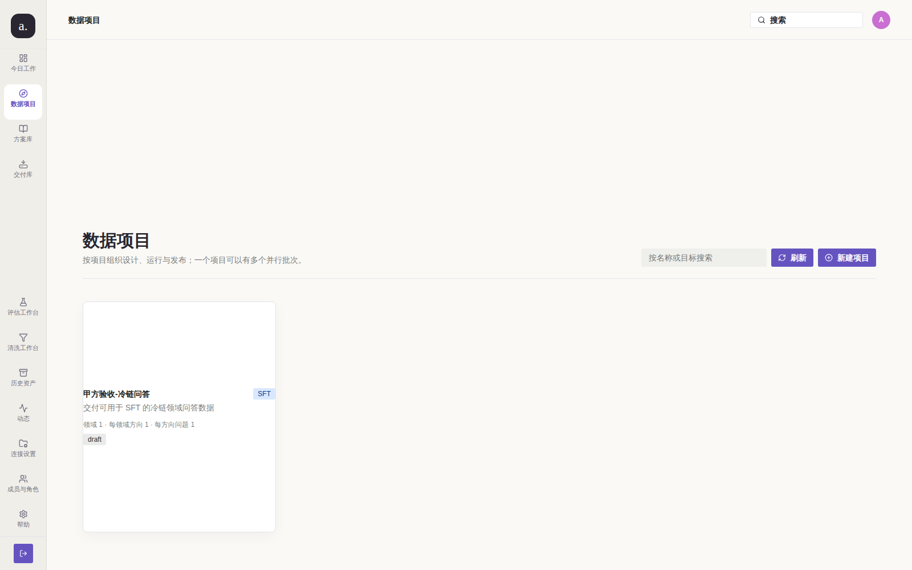

**对应页面**：`/projects`（全局入口「数据项目」，任务 T10）

**含义**：用户在这个列表上找不到任何「第 N 页 / 每页多少 / 共多少条 / 下一页」的东西。

**技术事实**：分页是**服务端游标分页**，前端只在 `nextCursor !== ''` 时渲染「加载更多（第 N 页）」按钮
（`apps/web-user/src/studio/pages/ProjectsPages.tsx:273`）。当前库只有 1 个项目，一页装得下，
于是**一个分页控件都不出现**。

**意图**：用户要的不是某个具体控件，而是**「我在哪、还有多少」的可判定性**。
只有「加载更多」时，用户无法回答「一共几个项目」「我是不是已经翻到底了」，
项目一多就会怀疑自己漏看了。意图应拆成两条可验收项：
① 列表必须常显总数或「已显示 N / 共 M」；② 翻页方式（页码 / 无限滚动）必须与实际分页策略一致并显式声明。

---

### 第 2 条 · 蓝图中的思考步骤应当是自然语言模板，而不是 JSON

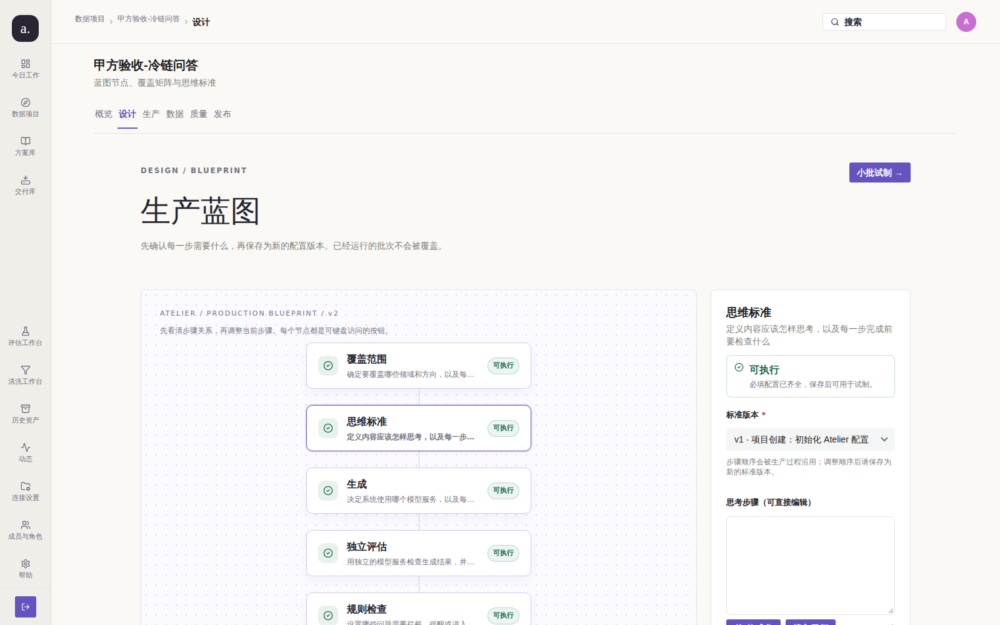

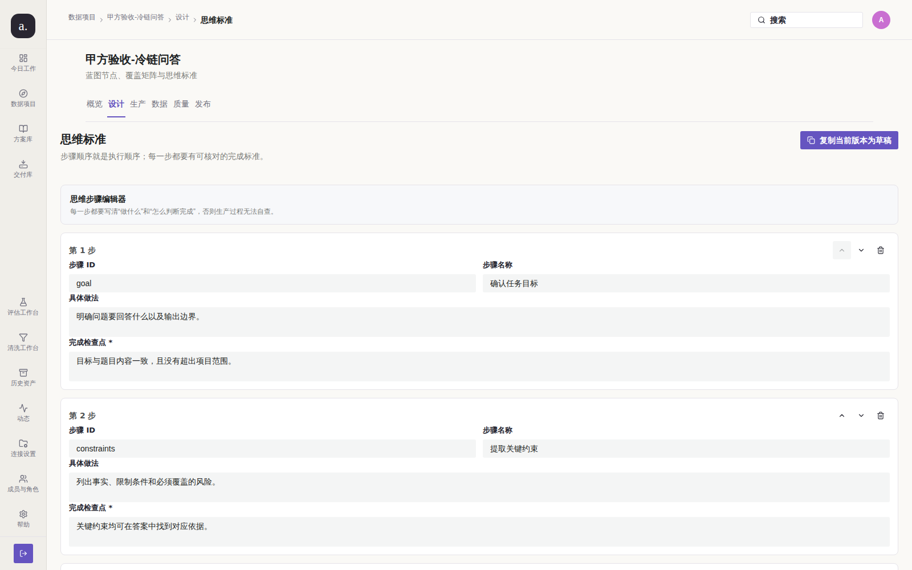

**对应页面**：`/p/p_1/blueprint?node=standard`（设计 · 思维标准节点）与 `/p/p_1/standard`（思维标准页）

**含义**：在蓝图右侧检查器里，「思考步骤（可直接编辑）」是一个 `rows=6` 的**原始 JSON 文本框**，
用户必须手写 `{"id":…,"title":…,"checkpoint":…}` 这样的结构才能定义「模型该怎么思考」。

**技术事实**：服务端元数据把它定义为 `FieldKindJSON`（`internal/model/blueprint_nodes.go:151`），
前端按 kind 渲染 `JSONFieldEditor`（`BlueprintPages.tsx:791`）。
但**同一个实体**在独立页 `/p/1/standard` 里已经有完整的自然语言编辑器：
「步骤 ID / 步骤名称 / 具体做法 / 完成检查点」，4 步全部可编辑（见第二张截图）。

**意图**：这是一条**产品语汇**要求，不是渲染要求 —— 「思考步骤」在产品语义上是**给模型看的中文提示词模板**
（做什么 + 怎么算完成），而 JSON 是**存储表示**。让用户直接编辑存储表示，等于把内部序列化格式当界面。
意图：蓝图内的步骤编辑应复用已有的分步表单（或至少提供「分步表单 ↔ JSON」双视图，
默认分步表单），并且**同一实体只有一套编辑体验**，不允许蓝图用 JSON、独立页用表单。

---

### 第 3 条 · 数据应当可以预览

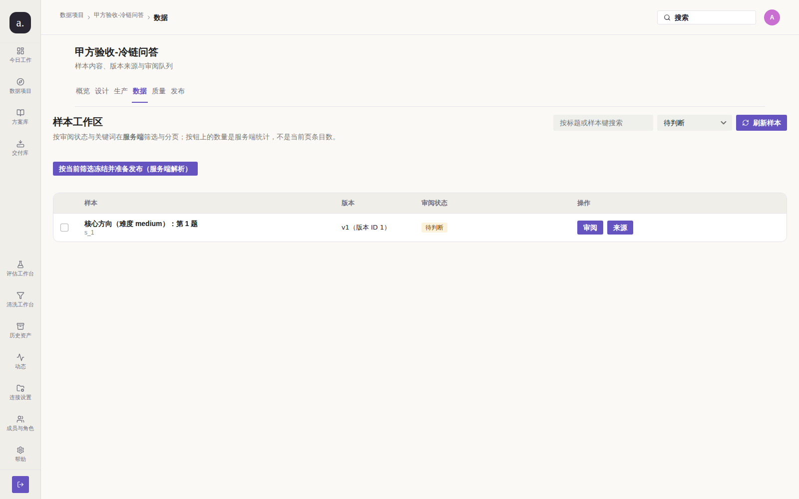

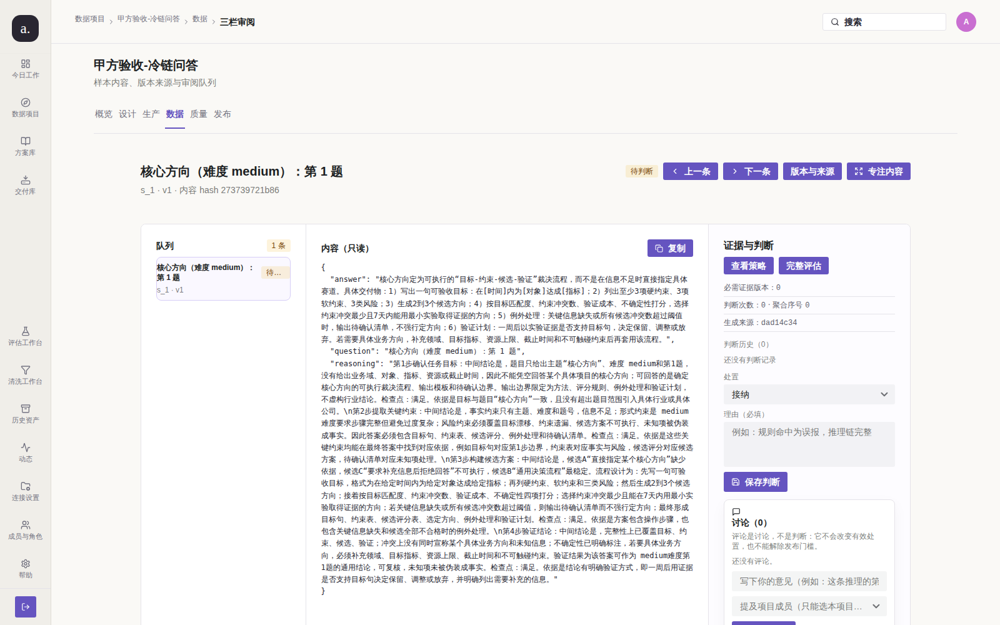

**对应页面**：`/p/p_1/data`（列表）→ `/p/p_1/data/s_1`（三栏审阅）

**含义**：在列表里看不到任何样本内容，只有一个标题（就是题目本身）；点「审阅」进去，
「内容（只读）」面板给出的是**整段转义过的原始 JSON**。

**技术事实**：列表行只有「标题 / 资源 ID / 版本 / 审阅状态 / 操作」（`ReviewPages.tsx` 的 `sample-table`），
不含内容摘要。详情页的内容面板直接渲染 payload（上面截图里 `{"answer": "...", "question": "...", "reasoning": "..."}`
连同 `\n` 转义一起显示）。

**意图**：用户要的是**「不下载、不点进详情，也能判断这批数据长什么样」**。
当前形态把「预览」做成了「原始结构 dump」：用户想确认的是
「问题的问法对不对、答案是不是完整的中文长链推理」，而不是 JSON 是否合法。
意图应拆成：① 列表行加**内容摘要**（截断的问答首句 + 长度）；② 详情页按 **question / reasoning / answer 分栏渲染**，
并用「原始 JSON」作为可切换的次要视图（因为调试确实需要它）。

---

### 第 4 条 · 蓝图页面部分节点存在页面超长


**对应页面**：`/p/p_1/blueprint`（设计，任务 T11）

**含义**：选到某些节点后页面被拉得很长，需要多次滚动才能碰到「变更理由 / 保存」；
节点之间信息密度不均，下方还挂着一整块版本历史。

**技术事实**（实测，已解除滚动容器截断）：

| 区块 | 纵向起点 | 高度 |
| --- | --- | --- |
| 页头 `.blueprint-page-intro` | 260 | 145 |
| `.blueprint-layout`（画布 + 检查器） | 463 | 995 |
| 其中 `.blueprint-canvas` | 463 | 791 |
| 其中 `.blueprint-inspector` | 463 | 791 |
| 版本历史 `.blueprint-history` | 1275 | 182 |
| **内容总高** | — | **1561（= 1.56 屏）** |

检查器第一个控件在 685px 处（仍在首屏内），但**保存条在 791px 之后**，
`?node=evaluation` 时进一步涨到 1902px、`?node=generation` 到 2389px。

**意图**：「超长」在这里不是审美问题，而是**操作可达性**问题 ——
「改完节点 → 填变更理由 → 保存」这条主链被推到首屏之外，用户改完会以为没有保存入口。
意图：① 画布与检查器各自独立滚动，保存条**粘性吸底**在检查器内；
② 版本历史折叠为抽屉/标签，不参与主列高度；③ 节点配置按「必填 / 可选 / 高级」分组折叠。

---

### 第 5 条 · 独立评估晦涩难懂


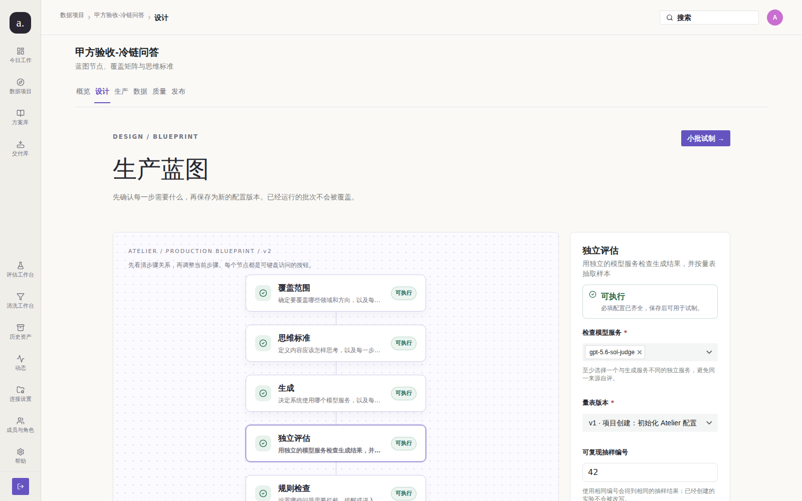

**对应页面**：`/p/p_1/blueprint?node=evaluation`（设计 · 独立评估节点）

**含义**：这一屏同时出现「检查模型服务 / 量表版本 / 可复现抽样编号 / 维度权重（合计需等于 1.00）/ 缺分策略」，
以及一句推导性说明「缺分不计入归一化分母的分子」。用户看不懂**它到底替我做什么**，
也看不懂填错了会怎样。

**技术事实**：字段与帮助文本全部来自服务端元数据（`internal/model/blueprint_nodes.go:201-226`），
维度权重在未配置时显示「合计 0.00（需等于 1.00）」+「+ 添加维度」。
配置完整后状态确实会变成「可执行 · 必填配置已齐全」（第二张截图），
即**功能是通的，缺的是解释**。

**意图**：用户要的是**「先讲结论，再讲参数」**。评分/评估这类概念对用户是黑箱：
意图应在节点顶部先给一段可执行的因果说明（「它会用 A 模型给 B 内容按 C 量表打分，
结果是 D；缺分不会被当成 0 分」），再展开参数；参数本身需要**默认值 + 推荐值 + 反例**，
而不是把「权重必须等于 1」这种约束当作说明。

---

### 第 6 条 · 节点编辑不该显式与历史版本强制关联

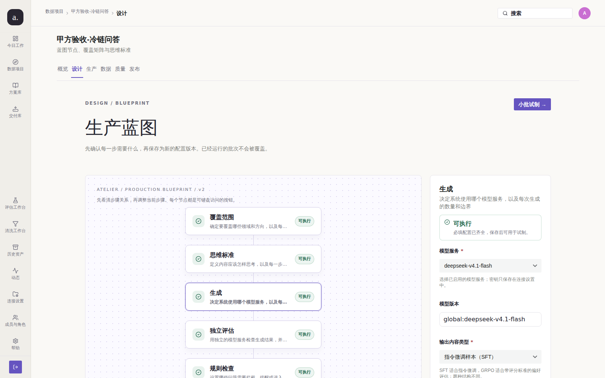

**对应页面**：`/p/p_1/blueprint`（设计，版本选择器 + 检查器 + 版本历史）

**含义**：用户想「把并发从 8 改成 12」，但在界面上先遇到的是「选择一份已保存的覆盖方案 /
标准版本 / 量表版本 / 映射版本」，还要填「变更理由（必填）」，感觉每次改一个数字都要先选版本、
再写理由，操作很重。

**技术事实**：`coverageVersionId / standardVersionId / qualityPolicyVersionId / mappingVersionId / rubricVersionId`
都是 `kind: "id"` 且 `required: true`（服务端元数据），前端渲染为「选择已保存版本」的下拉；
保存按钮文案是「保存为新版本」，另有「复制此版本」。

**意图**：用户接受「配置要版本化」，反对的是**「版本化被暴露成前置步骤」**。
意图：编辑应**自动迭代** —— 默认从当前版本派生草稿、保存时自动生成新版本 + 自动生成可读的变更说明
（如「并发 8 → 12」），「变更理由」降级为可自动生成、可覆盖的字段；
把「显式选择历史版本」收敛到一处（例如「基于某个版本新建」），而不是散落在每个引用字段上。

---

### 第 7 条 · 连接设置点新增/编辑仍跳转旧页面

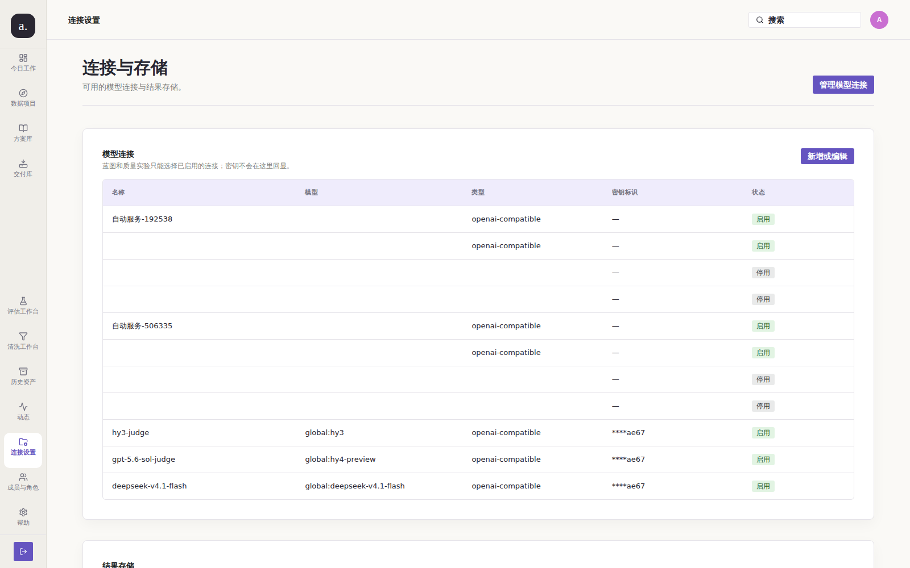

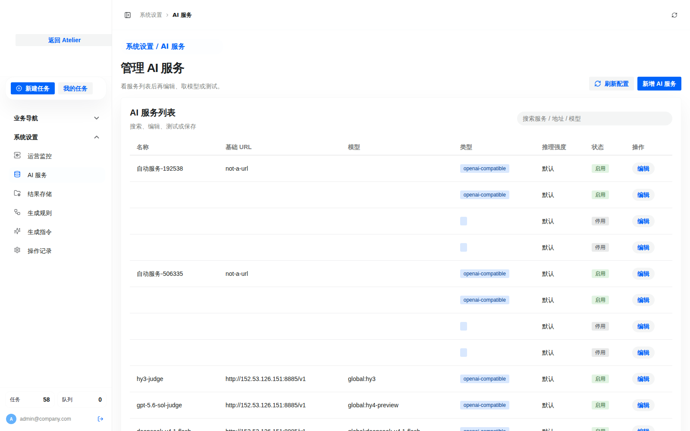

**对应页面**：`/settings/connections` → 点击后落到 `/console/admin/providers`

**含义**：`/settings/connections` 上有「管理模型连接」「新增或编辑」两个按钮，
点下去整页跳到旧控制台（顶栏出现「兼容控制台 / 旧版入口」，左栏换成「新建任务 / 我的任务 / 系统设置」），
用户的语境被打断。

**技术事实**：两个按钮都执行 `navigate('/console/admin/providers')`
（`apps/web-user/src/studio/pages/SettingsPages.tsx`），实测 `urlBefore=/settings/connections`、
`urlAfter=/console/admin/providers`、`isLegacyConsole=true`。
顺带发现**旧页的数据质量问题**：AI 服务列表里存在名称为空、`baseUrl = "not-a-url"`、
模型为空且状态为「启用」的连接（`自动服务-192538`、`自动服务-506335` 等）。

**意图**：这是「统一控制台」承诺被打破的观感问题：用户要的是**同一个壳里完成新增/编辑**，
而不是被丢回旧版。意图：把连接的新增/编辑做成 **Atelier 内的抽屉/弹窗或原生页**；
旧控制台只能作为「兼容期只读回退」，且跳转必须提前声明（例如按钮标注「在兼容控制台打开」）；
同时清理非法连接数据（空名、`not-a-url`）——否则用户会认为「新页面做不了是因为旧数据坏」。

---

### 第 8 条 · 列表项应有元素级编辑按钮


**对应页面**：`/settings/connections`（连接与存储，任务 T28）

**含义**：表里有 11 行模型连接、24 行结果存储，但每一行都没有「编辑 / 停用 / 删除」。

**技术事实**：实测 `connectionRows = 11`、`storageRows = 24`、**`rowsWithEditButton = 0`**、
`perRowButtons = []`、页面 `input/select/textarea` 数量 = **0**。
页面上唯一可写入口就是顶部那两个跳旧页的按钮（见第 7 条）。

**意图**：用户的心智模型是**「表格行 → 行内操作列」**。把写操作集中到页面顶部，
用户必须先「找到正确的全局按钮」再「在长列表里二次定位自己刚看到的那一行」，
这在 35 行数据下已经很难用。意图：每行提供**元素级操作**（编辑 / 启用停用 / 删除，删除需二次确认），
并且行内操作与顶部「新增」是同一套权限与同一条 API。

---

### 第 9 条 · 评估工作台和清洗工作台没有与当前蓝图连接起来

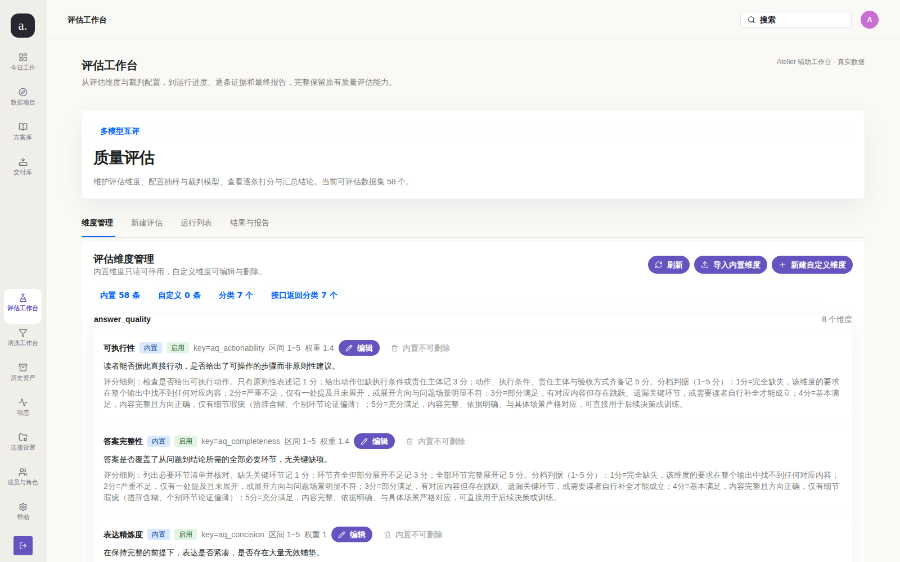

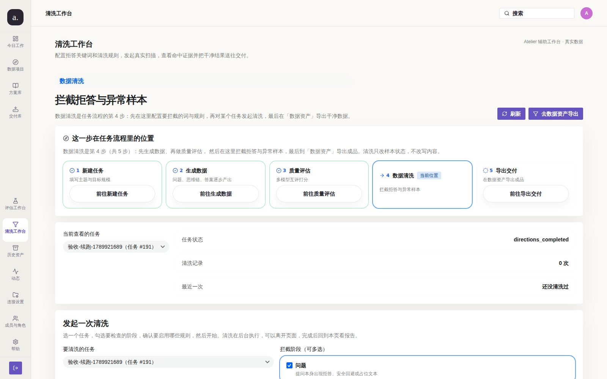

**对应页面**：`/tools/evaluation`（评估工作台）、`/tools/cleaning`（清洗工作台）（辅助区，任务 T32）

**含义**：用户在「设计 → 生产 → 数据 → 质量 → 发布」主线上建立了项目，
进到评估/清洗工作台却发现要重新从**58 个旧数据集**里挑一个，找不到自己刚配的蓝图和刚跑的批次。

**技术事实**：
- 评估工作台文案：「评估维度管理 · 当前可评估数据集 58 个」，**字面不出现「蓝图」「思维标准」**；
- 清洗工作台文案：「数据清洗是任务流程的第 4 步（共 5 步）……最后在『数据资产』导出干净数据」——
  它自述属于**旧任务流水线**，且「去数据资产导出」指向旧入口 `/console/results`；
- 两页均由 `LegacyToolPages.tsx` 包壳渲染旧实现（`views/EvaluationView`、`views/CleaningView`），
  数据源是 `consoleApi.listDatasets()`。

**意图**：这是**信息孤岛**的精确表述：同一个用户、同一份数据，两套词表（「数据集」vs「项目/蓝图/批次」）、
两套导航（旧五步 vs Atelier 六工作区）。意图：辅助工作台必须**以项目/蓝图/批次为主键**接入，
旧数据集降级为「历史资产」入口下的只读来源；页面必须显式说明它读取的是**哪一个蓝图的哪一版配置**。

---

### 第 10 条 · 今日工作不是工作台总览

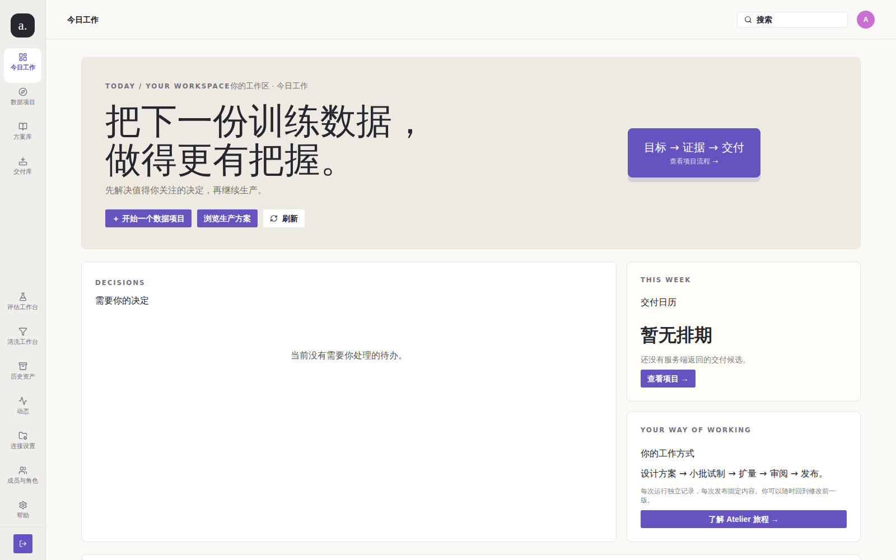

**对应页面**：`/today`（全局入口「今日工作」，任务 T27）

**含义**：用户打开默认首页，看到的是「需要你的决定 / 交付日历 / 你的工作方式 / 继续项目」，
但**几乎没有任何数字**：整页唯一一个数字是「7 条动态尚未查看」。

**技术事实**：`GET /api/v1/today` 实测返回 `todos=[{kind:"unread_activity", count:7, projectId:0, …}]`，
即**只有未读动态**。项目块标题是 `项目 #1`（用内部 ID，不是项目名），
且服务端契约里 `/v1/today` 不含项目名称（前端注释明确说明「不用示例项目名或猜测项目详情链接」）。

**意图**：用户把「今日工作」当成**工作台总览（Dashboard）**：期望看到
「有多少项目在跑 / 产出多少条 / 今天失败多少 / 有多少待审阅 / 覆盖完成度」这类可横向比较的口径。
当前实现只回答「有什么待办」，而且是最弱的那个待办（未读）。
意图：把 `/today` 拆成两层 —— 上层是**运行态总览指标**（项目数、在跑批次、今日产出、失败率、待审阅量），
下层保留现在的待办与日历；并且**任何数字都必须能点进去看到明细**。

---

### 第 11 条 · 业务流程不连贯，画布要改造（m×n×z 主体缺失）

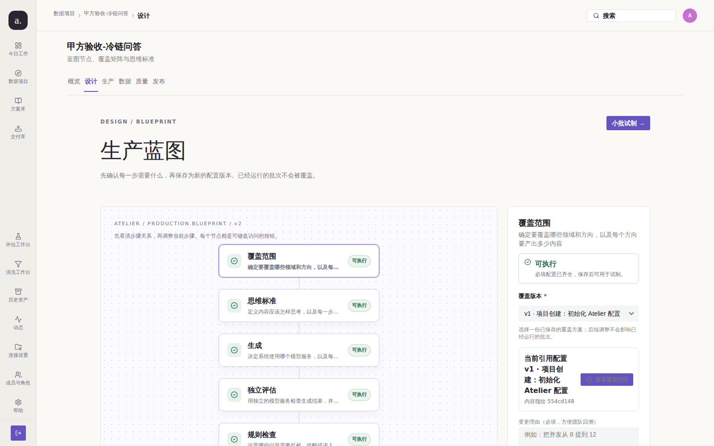

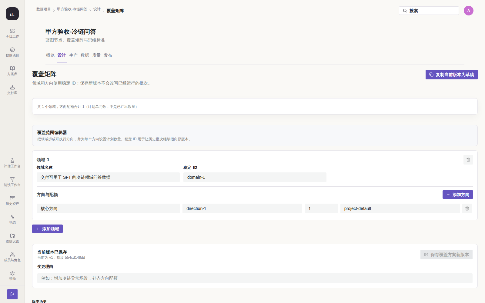

**对应页面**：`/p/p_1/blueprint`（设计画布）、`/p/p_1/coverage`（覆盖矩阵）、`/new/*`（新建向导）

**含义**（用户原话拆解）：① 主体目标是「1 个关键词 → m 个领域 × n 个方向 × z 条/方向」，
但业务流里看不出来；② 数据集结构（m×n×z）不清晰，应该用**可编辑树状图**表达；
③ 蓝图定位是**工作流**，应该参考 Dify 的工作流界面：把画布拉宽，左侧是流程，
点节点在**同一张画布内右侧**展开该流程的工作流信息；
④ 用拖拉拽配置具体执行步骤，把现有节点配置**下放到小步骤**；
⑤ 步骤不是单一顺序结构，**要先定清楚每个流程的参数结构再设计**。

**技术事实**：
- 画布 `.blueprint-nodes` 是 `display:flex; flex-direction:column`，7 个节点**纵向单链**，
  宽度 890px；**`draggable` 全部为 false**，没有任何拖拽/连线/分支能力；
- 右侧检查器是**独立卡片**（`.blueprint-inspector`，320px 宽），不是同一张画布内的浮层；
- m×n×z 目前只体现在**新建向导**的 `domainCount / directionsPerDomain / questionsPerDirection`
  三个标量，以及覆盖矩阵页的「领域 → 方向 → 配额」表单（第二张截图），
  两者都不是树，也不在画布上；
- 真实数据里 `m=1, n=1, z=1`（项目 `p_1`），`b_2` 批次 4 个计划单元 → 1 条样本。

**意图**：这是 17 条里唯一一条**产品定位级**的要求，其余 16 条是它的表象。用户的意图是：

```text
关键词
  └── 领域 m（可编辑，树的一级）
        └── 方向 n（树的二级）
              └── 每个方向 z 条数据（树的叶，带配额）
```
这张树必须是**可编辑的数据集结构**（= 现在的覆盖矩阵，但以树呈现）；
而「工作流」是**另一件事**：每个流程（覆盖/标准/生成/评估/规则/人工/交付）内部应该能展开成
**由小步骤组成的、可拖拽编排的有向结构**（不是固定 7 步顺序链），
参数结构必须先定清楚，再决定 UI。
意图可转成两条可验收能力：**① m×n×z 树编辑器**（可增删改、实时汇总计划量）；
**② 流程编排画布**：宽画布 + 同屏节点配置面板 + 拖拉拽 + 分支/并行 + 参数结构先行的 schema 定义。

---

### 第 12 条 · 「数据」菜单到底是什么功能？是否应改名「审阅」


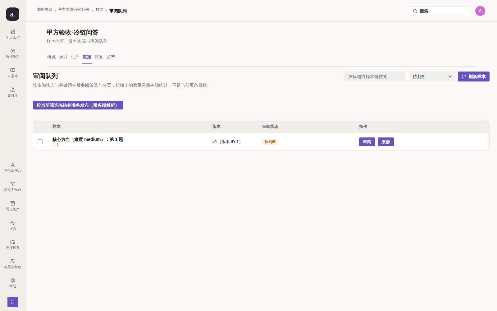

**对应页面**：`/p/p_1/data`（标签「数据」）与 `/p/p_1/review`（子页「审阅队列」）

**含义**：两个菜单进去是**同一张表、同一段说明、同一个主按钮**，用户无法判断差异，也不知道「数据」到底是不是人工审阅。

**技术事实**（DOM 实测对比）：

| | `/p/1/data` | `/p/1/review` |
| --- | --- | --- |
| `data-studio-page` | `sample-list` | `review-queue` |
| 标题 | 样本工作区 | 审阅队列 |
| 说明 | 「按审阅状态与关键词在服务端筛选与分页；按钮上的数量是服务端统计，不是当前页条目数。」 | **完全相同** |
| 主操作 | 「按当前筛选冻结并准备发布（服务端解析）」 | **完全相同** |
| 首行样本 | `核心方向… 第 1 题 / s_1 / v1 / 待判断 / 审阅 / 来源` | **完全相同** |

两者由同一个组件渲染，只差 `queueMode` 一个布尔（`ReviewPages.tsx`）。

**意图**：用户要的是**「一个入口一个职责」**。「数据」应当是**资产视角**（有哪些数据、质量和结构如何、
能不能用），「审阅」应当是**任务视角**（待我判断的队列、判断完去哪）。意图：
① 明确二者差异并落到界面（数据 = 只读资产浏览 + 预览 + 分析；审阅 = 工作队列 + 判断 + 批量处置）；
② 若暂时无法拆分职责，**合并为单一入口**，不要用两个菜单名指向同一页；
③ 若「数据」实质就是人工审阅，就按用户建议改名「审阅」。

---

### 第 13 条 · 「生产」缺数据集预览与自动分析

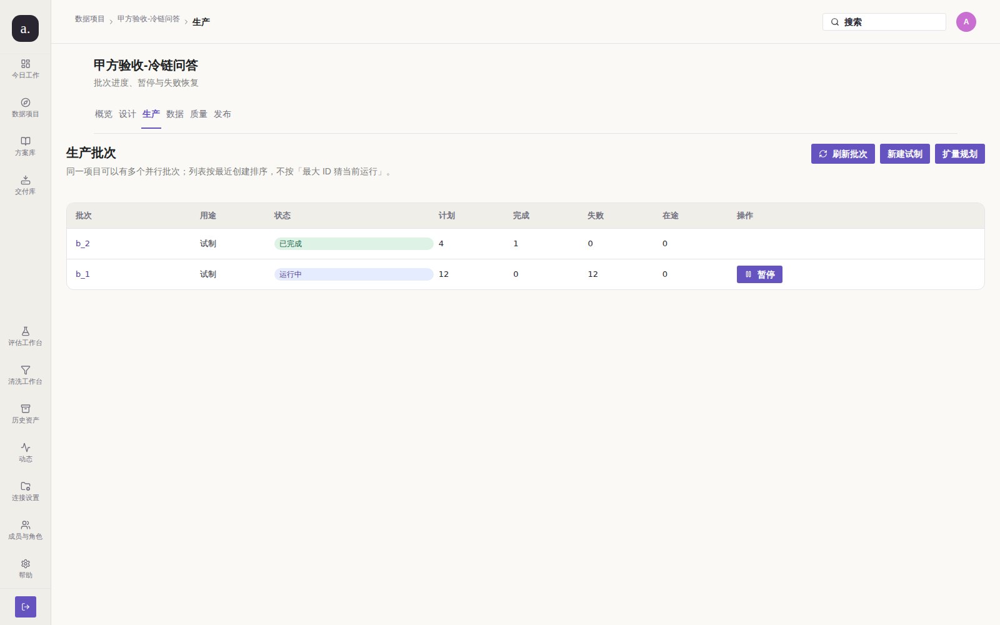

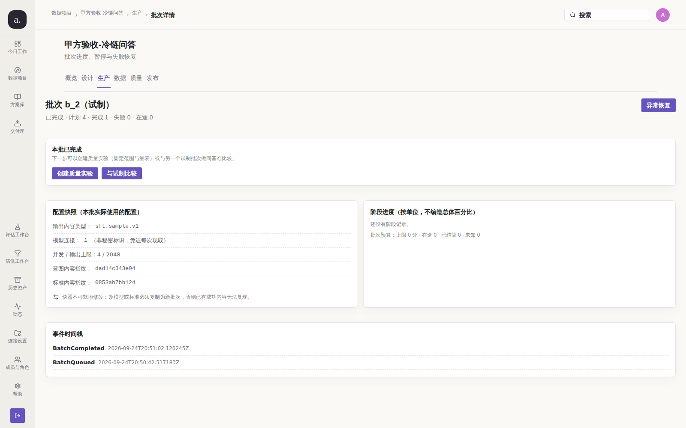

**对应页面**：`/p/p_1/runs`（生产）与 `/p/p_1/runs/b_2`（批次详情，任务 T13）

**含义**：用户在生产里能看到「跑了多少」，但看不到「跑出来什么」——没有数据集结构预览，
也没有自动的质量/规模分析，必须跳到别的页面手工统计。

**技术事实**：批次列表列头为 `批次/用途/状态/计划/完成/失败/在途/操作`（四个数字分列，不合成百分比，这是刻意的）；
批次详情实测 `hasPreview=false`、`hasAnalysis=false`、`mentionsDatasetStructure=false`，
正文只有「配置快照（输出内容类型/模型连接/并发·输出上限/蓝图指纹/标准指纹）+ 阶段进度 + 预算 + 事件时间线」。
内容高仅 913px（不足一屏）。

**意图**：用户要的是**「生产页自带产出的体检报告」**。意图（含用户要求「由你扩充」的指标）：
- **结构预览**：当前批次产出的样本结构（字段、示例 N 条、schema 版本）；
- **自动分析**（不是按钮，是进页面即算）：样本条数、平均/中位/极值长度（题面 / 推理 / 答案分别统计）、
  各领域×方向的**实际占比 vs 计划占比**（缺口最直观）、去重率、拒答/异常标记数、失败类别分布。

---

### 第 14 条 · 「质量」表达不准确 + 新建实验配模型有问题

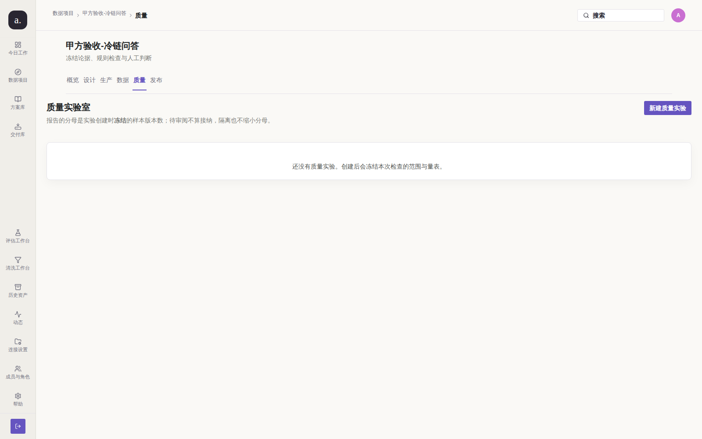

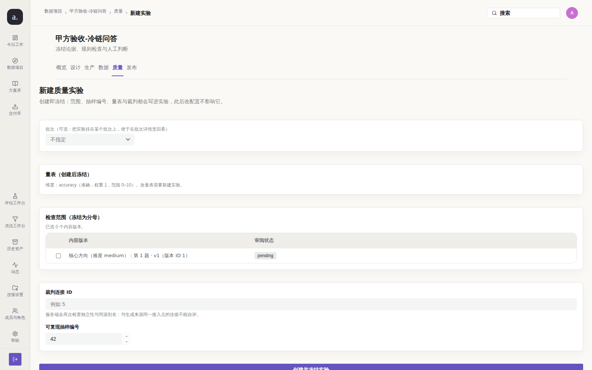

**对应页面**：`/p/p_1/quality`（质量实验室）、`/p/p_1/quality/new`（新建实验，任务 T19/T24）

**含义**：① 用户认为不该用「分子/分母」这类数学词，应说「被评测数据集」；
② 新建实验时配置模型的方式不对，应该给**模型列表**让用户选。

**技术事实**：
- 页头文案：「报告的**分母**是实验创建时**冻结**的样本版本数；待审阅不算接纳，隔离也不缩小**分母**。」
  （实测「分子/分母」共命中 2 处；列头里是「分母 / 已评分 / 缺分 / 出错」）；
- 新建实验页的裁判字段（`data-field="judge-connection"`）是
  **`<input type="text" placeholder="例如 5">`**，标签为「**裁判连接 ID**」，
  帮助文本是「服务端会再次检查独立性与同源别名」；全页只有 1 个 Select（批次），
  **没有任何模型下拉**。用户必须先去别处查到连接的数字 ID 再回来手填。

**意图**：① 术语要**贴近用户的业务对象**：用户评估的对象是「被评测的数据集」，
不是抽象的比值结构；「分母」这种词在需求方语境里等于「内部实现细节泄漏」。
意图：把统计语言换成语义语言（被评测数据集 / 已完成评测 / 缺分 / 出错），
保留「冻结范围」这个**真正重要的语义**（它防止事后挑样本），但用业务词表达。
② 配置模型必须**列表化**：直接读取 `/v1/settings/connection-options` 渲染连接下拉
（蓝图页已经这么做了），并在选中时即时校验「与生成来源不同」，
把「独立性与同源别名」从一句警告变成**选项级别的禁用与说明**。

---

### 第 15 条 · 新建用户还没实现

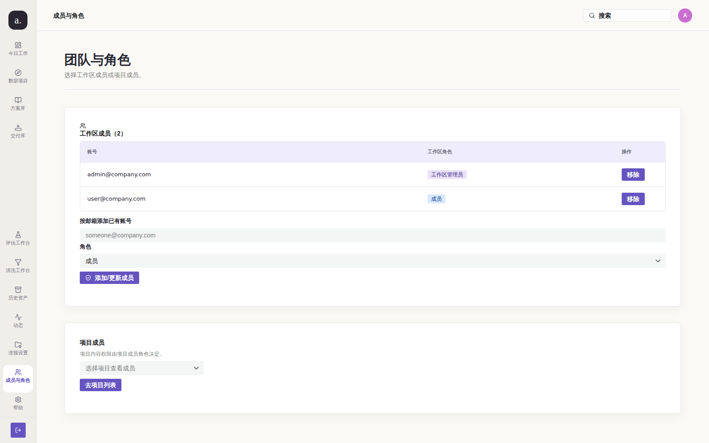

**对应页面**：`/settings/team`（成员与角色，任务 T28）

**含义**：管理员要新增一个人，界面只给「按邮箱添加已有账号」，没有「用户名 + 密码」的创建表单。
用户明确表示**不要邮件邀请**，要**直接配置用户名与密码新增**。

**技术事实**：实测页面 `hasCreateUserForm=false`、`mentionsUsername=false`、`mentionsPassword=false`，
表单标签只有「按邮箱添加已有账号 / 角色」，唯一输入框 `placeholder="someone@company.com"`。
后端同口径：`POST /api/v1/workspace/members` 用未注册邮箱调用返回 **422**：

```json
{"error":{"code":"VALIDATION_FAILED",
 "message":"email没有这个账号：首版只能选择已有账号（邮件邀请尚未接入）"}}
```

即：**管理员 API 无法创建账号**，账号只能来自启动引导（`APP_DEFAULT_ADMIN_EMAIL` / `..._USER_EMAIL`）。

**意图**：用户的意图是**自托管的账号生命周期**，不是「邀请」：
在企业内网/离线场景里，管理员必须能直接建号并交付初始凭据。
意图（含必须有的安全语义）：新增「创建用户」表单（用户名/邮箱 + 初始密码 + 工作区角色），
创建后**强制首次登录改密**、密码强度校验、操作写入 `audit_logs`、
并在界面上明确区分「新建账号」与「把已有账号加入工作区」这两种动作。

---

### 第 16 条 · 历史资产是否已全部迁移？

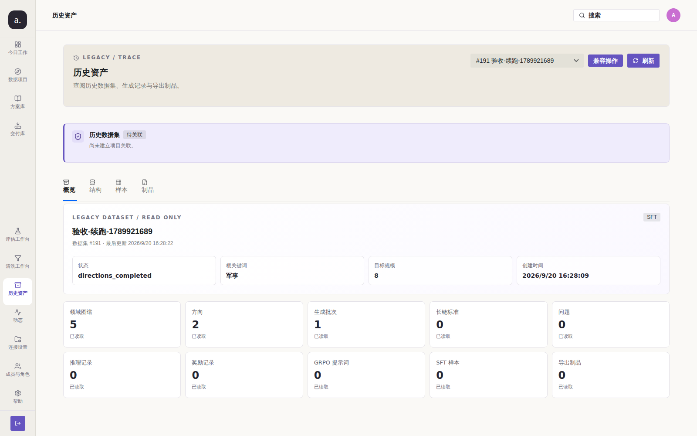

**对应页面**：`/legacy/history`（历史资产，任务 T31）

**含义**：用户问「迁移完了吗？完成了就把这个菜单删掉」。

**技术事实**（本库实测，**结论：未迁移**）：

| 指标 | 值 | 说明 |
| --- | --- | --- |
| `datasets`（旧数据集） | **58** | 仍全量存在 |
| `legacy_imports`（迁移台账行数） | **0** | 没有任何一次导入被记录 |
| `projects.legacy_dataset_id` 非空的项目 | **0** | 没有任何旧数据集映射到新项目 |
| 唯一项目 `p_1` | 手工创建（向导） | 与旧数据无关 |

页面本身**不呈现迁移状态**：截图上「历史数据集」下只写「待关联 / 尚未建立项目关联」，
没有「已迁移 / 未迁移 / 待对账」的口径，也没有×/√汇总，所以用户无法从界面回答自己的问题。

**意图**：用户要的是**一个可判定的删除条件**，不是一次口头汇报。意图：
① 页面顶部给出迁移总账（旧数据集 N 个，已导入 M，未导入 K，失败 F，最后导入时间）；
② 明确区分「已映射到项目」「已在内容层导入（sample_versions）」「不可导入（如无 SFT 内容）」三类，
并给出逐条原因；③ 当且仅当 K=F=0 且不可导入项已确认，才**下线该菜单**。
在此之前保留菜单是对的（删除会丢失唯一的旧数据入口），但必须把状态说清楚。

---

### 第 17 条 · 大量样式问题（文字布局 / 超长遮盖 / 配色不一致）

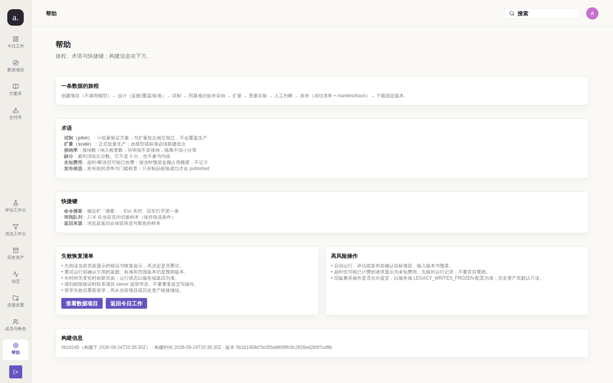


**对应页面**：全站（此处以 `/help` 与 `/p/p_1/blueprint` 为代表）

**含义**：文字被控件边缘遮住、布局被超长文本挤坏、配色不一致。

**技术事实**（自动扫描实测）：

- `/help`：文档宽度 1600px，**无横向溢出**；仅命中 `span.sr-only`（无障碍专用隐藏文本，非缺陷）；
- `/p/p_1/blueprint`：**8 处** `.blueprint-node__caption` 因 `overflow+hiding` 被截断，例如
  「确定要覆盖哪些领域和方向，以及每个方向要产出多少内容」内容宽 **312px** 被压进 **187px**；
- 移动端 390×844：连接设置（35 行数据表）、质量、蓝图三页均已截图（见 `17c/17d/17e`）。

**意图**：用户把一组观感问题合并成了「样式问题」，但**根因不同**，需要分开处理：
① **截断类**（节点副标题）：这是设计选择（单行省略）与内容长度的冲突 —— 应改为两行截断或悬停完整显示；
② **表格类**（连接/存储）：表格在窄屏必然崩坏，应改卡片式；
③ **配色类**：需要一份 design token（同一语义同一颜色：成功/警告/危险/中性），
并写一条 lint/CI 断言，而不是逐处手改。
意图的关键是**可回归**：这些问题不该靠人眼发现，应固化进自动化扫描（第 17 条的扫描逻辑已在
`test/audit/issue197.mjs` 中给出，可直接升级为 CSS 回归测试）。

---

## 3. 系统关系与数据流（解释「为什么会出现这 17 条」）

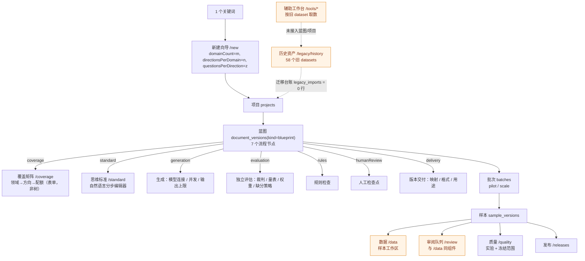
```mermaid
graph TD
  KW["1 个关键词"] --> WIZ["新建向导 /new<br/>domainCount=m, directionsPerDomain=n, questionsPerDirection=z"]
  WIZ --> PROJ["项目 projects"]
  PROJ --> BP["蓝图 document_versions(kind=blueprint)<br/>7 个流程节点"]

  BP -->|coverage| COV["覆盖矩阵 /coverage<br/>领域→方向→配额（表单，非树）"]
  BP -->|standard| STD["思维标准 /standard<br/>自然语言分步编辑器"]
  BP -->|generation| GEN["生成：模型连接 / 并发 / 输出上限"]
  BP -->|evaluation| EVA["独立评估：裁判 / 量表 / 权重 / 缺分策略"]
  BP -->|rules| RUL["规则检查"]
  BP -->|humanReview| HUM["人工检查点"]
  BP -->|delivery| DEL["版本交付：映射 / 格式 / 用途"]

  BP --> BATCH["批次 batches<br/>pilot / scale"]
  BATCH --> SAMPLE["样本 sample_versions"]
  SAMPLE --> DATA["数据 /data<br/>样本工作区"]
  SAMPLE --> REV["审阅队列 /review<br/>与 /data 同组件"]
  SAMPLE --> QUAL["质量 /quality<br/>实验 + 冻结范围"]
  SAMPLE --> REL["发布 /releases"]

  LEGACY["历史资产 /legacy/history<br/>58 个旧 datasets"] -.->|"迁移台账 legacy_imports = 0 行"| PROJ
  TOOLS["辅助工作台 /tools/*<br/>按旧 dataset 取数"] -.->|"未接入蓝图/项目"| LEGACY

  classDef iso fill:#fff4e6,stroke:#d97706,color:#7c2d12;
  class TOOLS,LEGACY,REV,DATA iso;
```

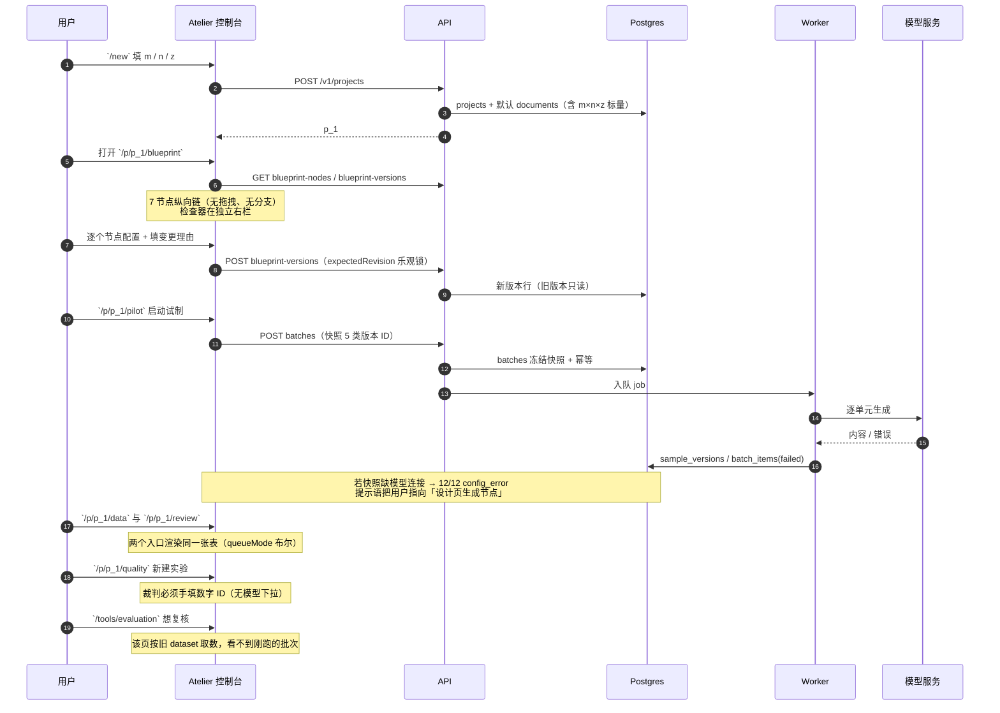
```mermaid
sequenceDiagram
  autonumber
  participant U as 用户
  participant W as Atelier 控制台
  participant A as API
  participant DB as Postgres
  participant WK as Worker
  participant LLM as 模型服务

  U->>W: `/new` 填 m / n / z
  W->>A: POST /v1/projects
  A->>DB: projects + 默认 documents（含 m×n×z 标量）
  A-->>W: p_1

  U->>W: 打开 `/p/p_1/blueprint`
  W->>A: GET blueprint-nodes / blueprint-versions
  Note over W: 7 节点纵向链（无拖拽、无分支）<br/>检查器在独立右栏
  U->>W: 逐个节点配置 + 填变更理由
  W->>A: POST blueprint-versions（expectedRevision 乐观锁）
  A->>DB: 新版本行（旧版本只读）

  U->>W: `/p/p_1/pilot` 启动试制
  W->>A: POST batches（快照 5 类版本 ID）
  A->>DB: batches 冻结快照 + 幂等
  A->>WK: 入队 job
  WK->>LLM: 逐单元生成
  LLM-->>WK: 内容 / 错误
  WK->>DB: sample_versions / batch_items(failed)

  Note over W,DB: 若快照缺模型连接 → 12/12 config_error<br/>提示语把用户指向「设计页生成节点」
  U->>W: `/p/p_1/data` 与 `/p/p_1/review`
  Note over W: 两个入口渲染同一张表（queueMode 布尔）
  U->>W: `/p/p_1/quality` 新建实验
  Note over W: 裁判必须手填数字 ID（无模型下拉）
  U->>W: `/tools/evaluation` 想复核
  Note over W: 该页按旧 dataset 取数，看不到刚跑的批次
```

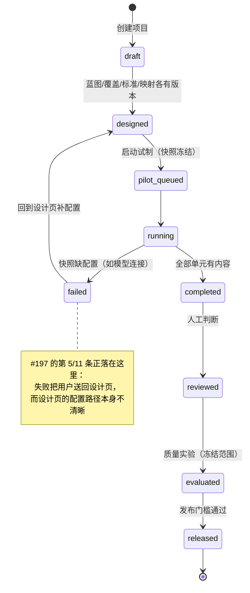
```mermaid
stateDiagram-v2
  [*] --> draft: 创建项目
  draft --> designed: 蓝图/覆盖/标准/映射各有版本
  designed --> pilot_queued: 启动试制（快照冻结）
  pilot_queued --> running
  running --> failed: 快照缺配置（如模型连接）
  running --> completed: 全部单元有内容
  failed --> designed: 回到设计页补配置
  completed --> reviewed: 人工判断
  reviewed --> evaluated: 质量实验（冻结范围）
  evaluated --> released: 发布门槛通过
  released --> [*]

  note right of failed
    #197 的第 5/11 条正落在这里：
    失败把用户送回设计页，
    而设计页的配置路径本身不清晰
  end note
```

---

## 4. 17 条 → 意图归类

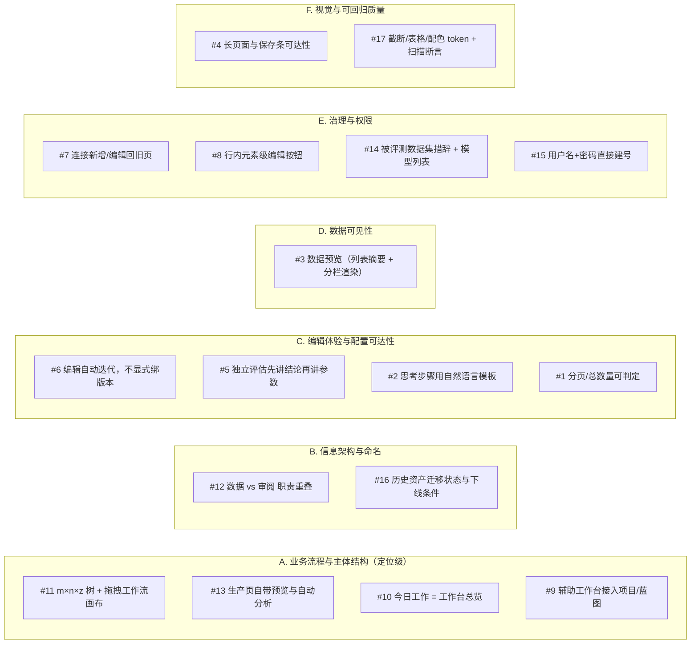
```mermaid
flowchart LR
  subgraph A["A. 业务流程与主体结构（定位级）"]
    A1["#11 m×n×z 树 + 拖拽工作流画布"]
    A2["#13 生产页自带预览与自动分析"]
    A3["#10 今日工作 = 工作台总览"]
    A4["#9 辅助工作台接入项目/蓝图"]
  end
  subgraph B["B. 信息架构与命名"]
    B1["#12 数据 vs 审阅 职责重叠"]
    B2["#16 历史资产迁移状态与下线条件"]
  end
  subgraph C["C. 编辑体验与配置可达性"]
    C1["#6 编辑自动迭代，不显式绑版本"]
    C2["#5 独立评估先讲结论再讲参数"]
    C3["#2 思考步骤用自然语言模板"]
    C4["#1 分页/总数量可判定"]
  end
  subgraph D["D. 数据可见性"]
    D1["#3 数据预览（列表摘要 + 分栏渲染）"]
  end
  subgraph E["E. 治理与权限"]
    E1["#7 连接新增/编辑回旧页"]
    E2["#8 行内元素级编辑按钮"]
    E3["#14 被评测数据集措辞 + 模型列表"]
    E4["#15 用户名+密码直接建号"]
  end
  subgraph F["F. 视觉与可回归质量"]
    F1["#4 长页面与保存条可达性"]
    F2["#17 截断/表格/配色 token + 扫描断言"]
  end
```

| 分类 | 条目 | 修复的**共同根因** |
| --- | --- | --- |
| A 业务流程与主体结构 | #9 #10 #11 #13 | 系统把「数据集结构（m×n×z）」「工作流（可编排步骤）」「产出体检（预览+分析）」三件事都藏在了配置层之下 |
| B 信息架构与命名 | #12 #16 | 入口按**历史实现**划分，而不是按**用户职责**划分 |
| C 编辑体验与配置可达性 | #1 #2 #5 #6 | 界面直接暴露了存储表示（版本行 ID / JSON / 统计术语 / 游标分页） |
| D 数据可见性 | #3 | 「有没有数据」与「数据长什么样」被拆到了两个页面，且后者是结构 dump |
| E 治理与权限 | #7 #8 #14 #15 | 写操作缺少**元素级入口**与**列表化选择器**；账号生命周期不完整 |
| F 视觉与可回归质量 | #4 #17 | 长内容与长页面缺约束，且缺自动化扫描（靠人眼发现） |

---

## 5. 与既有 Issue 的关系（避免重复报告）

本轮取证确认 #197 与仓库已开启的若干条互为**同一根因的不同表述**，建议合并处理：

| #197 条目 | 关联既有 Issue | 关系 |
| --- | --- | --- |
| #2（JSON 而非自然语言）、#14（术语）、#17（样式） | #191 #192 #193 #194 | 同一批「界面裸露内部表示 / 文案缺陷」；#193 已覆盖「表单表达缺陷」、#192 覆盖「Markdown 星号」、#191 覆盖「中英混杂」 |
| #3（数据预览）、#12（数据=审阅） | #194 | #194 §5.1 已认定「数据与审阅渲染同一页面」 |
| #7（连接入口跳旧页） | #195、#179（`0fadcd4`）、#168 | #195 指出远程部署落后导致 #179 未上线；本轮本地 `main` 上入口已存在，但**跳转仍是旧控制台**，属于 #179 的未完成部分 |
| #13（批次少交付） | #190 | #190 描述「批次已完成却只产出 1/12」；本轮 `b_2` 实测 4 计划 → 1 完成，与 #190 同形态 |
| #16（历史资产迁移） | #160 T31 | 迁移台账为空，需按 `docs/plans/legacy-migration-report.md` 执行 |

---

## 6. 证据边界（诚实声明）

1. 本文所有结论都来自**本地真实全栈 + 真实 Chromium**，但**远程验收环境未同步**——
   `#195` 已记录远程部署落后于 `main` 导致「已修复问题仍复现」。本文结论以本地 `0b18145` 为准。
2. 第 7 条的「旧页面」判定依据是实际跳转后的 URL（`/console/admin/providers`）与页面顶栏文案
   （「兼容控制台 / 旧版入口」），不是代码推断。
3. 第 16 条的迁移结论依据本库数据（`legacy_imports=0`、`legacy_dataset_id` 映射 0、旧数据集 58）。
   **其他环境可能不同** —— 这正是第 16 条要求「把迁移总账做进界面」的理由。
4. 第 11 条画布「不可拖拽」的判定来自 DOM 属性（`draggable=false`）与计算样式
   （`display:flex; flex-direction:column`），不含对「是否计划支持拖拽」的推测。
5. 第 5/6 条中「功能是否可用」的区分很关键：配置完整后生成/评估节点状态会变为
   「可执行 · 必填配置已齐全」（见 `05b/11c` 截图），说明**问题在可用性与表达，不在功能缺失**。
6. 截图统一为 1600×1000（移动端 390×844）；长页面已解除滚动容器高度截断后整页截取，
   因此图中纵向尺寸反映真实内容高度。

---

## 7. 建议的落地顺序（供维护者裁剪）

| 优先级 | 建议动作 | 覆盖条目 |
| --- | --- | --- |
| P0 | 明确并拆分「数据 / 审阅」职责（或合并为一个入口） | #12、#3 |
| P0 | 连接设置改成 Atelier 内可写页 + 行内操作列 + 清理脏连接 | #7、#8 |
| P0 | 质量页术语替换 + 裁判改为模型连接下拉 | #14 |
| P1 | 生产页加入结构预览与自动分析（长度/占比/失败分布） | #13 |
| P1 | 蓝图编辑自动迭代；步骤改自然语言模板；保存条吸底 | #2、#4、#6 |
| P1 | 「团队与角色」新增「创建用户（用户名+密码）」 | #15 |
| P1 | 历史资产页加入迁移总账并明确下线条件 | #16 |
| P2 | 独立评估节点「先结论后参数」重排 | #5 |
| P2 | 今日工作升级为运行态总览 | #10 |
| P2 | 辅助工作台接入项目/蓝图主键 | #9 |
| P3 | m×n×z 树编辑器 + 拖拽式流程编排画布（需先定参数 schema） | #11 |
| P3 | design token + 截断/表格样式 + CI 扫描断言 | #17 |

> #11 是路线级改造，建议先产出「流程参数结构（schema）与步骤模型」的设计文档
> （按仓库规范落在 `docs/architecture/`，含 Mermaid 状态机与数据流），
> 再动 UI；否则会在画布上重复一遍今天「配置不明确」的问题。
