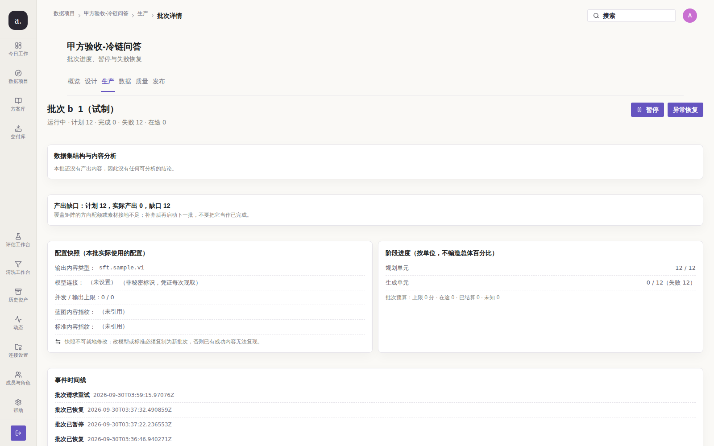
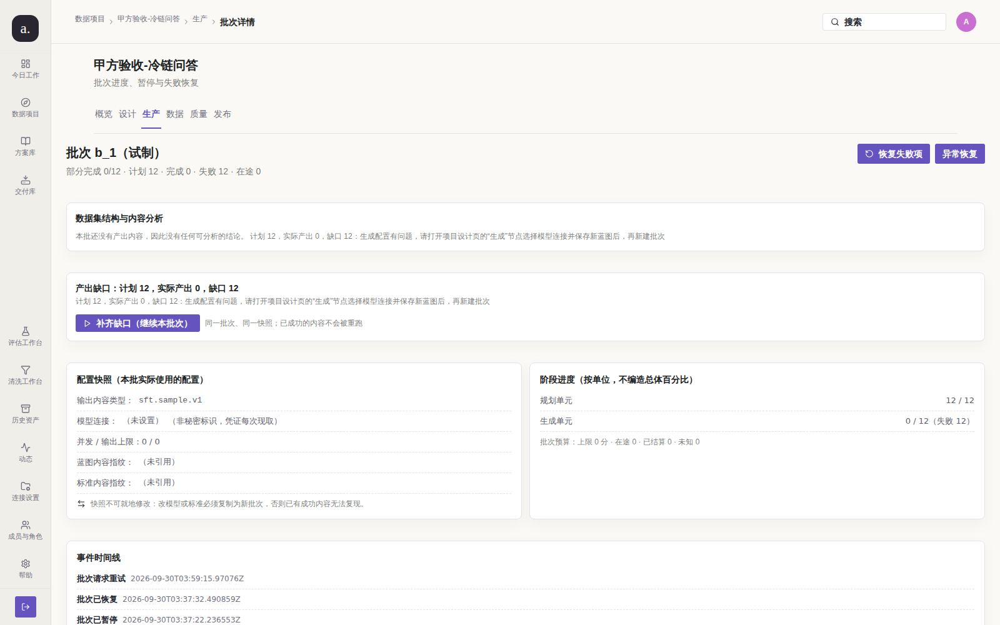

# Issue #202 — 批次「运行中」但全部单元失败且无在途作业（僵尸批次）

> 代码基线 `origin/main` @ `a889b43`（含修复 PR #228 提交 `1381667`）；修复前对照 `f615353`。
> 验证环境 真实容器栈 `127.0.0.1:3210` + 真实 Postgres + 真实 Chromium 1600×1000。
> 采集脚本：`test/audit/issue-202/repro.mjs`（`--phase before|after`，默认拒绝覆盖已提交证据）
> 与 `test/audit/issue-202/check-resume.mjs`（核对建议方向 1(b)）。

## 结论

**已修复，本轮无产品代码改动。** 缺陷在 `main` 上已由 PR #228（提交 `1381667`）修复
（与 #201 / #208 **同一个根因**，三条在同一提交里收口；#201 / #208 已关单，本 issue 只是被漏关），
但 issue 从未关闭。

> 为什么不能只「读一下现在的状态」就判定已修复：`b_1` 在 2026-09-30 就被那一轮的
> 维护循环纠正过。直接读到的 `partial_failed` 可能只是**历史遗留的正确状态**，
> 与当前部署的代码是否正确无关。因此本轮做了**可控的单变量复核**。

## 复现（修复前，`f615353`）

在预修复栈上把 `b_1` 的库内状态手工置回缺陷形态
（`running` + `control_state=run` + `finished_at=NULL`；单元事实不变：12 条 `failed`、
`retryable=false`，无在途；`jobs` 无活作业），再等一个完整维护轮次（30s 间隔，脚本等 45s）：

```text
[issue-202] phase=before deployed=f615353 armed=running|run|12|0|12|0|t
  单元事实: failed=12 retryable=0 活作业=0
  status=running capabilities={"canPause":true,"canResume":false,"canRetryFailed":false}
  可点按钮=["搜索","A","暂停","异常恢复"]
  本次新增维护纠正=0（历史 0 条）ok=false
```



实测读数：等满一个维护轮次（45s）后状态**没有任何变化**，worker 日志也没有任何纠正记录 ——
即没有任何收敛路径。因为 `canRetryFailed=false` 且 `status=running` 只给 `canPause`，
12 条 `retryable=false` 的失败项让「恢复失败项」永不出现，用户**拿不到任何出口**。
缺口卡还把它归因于「覆盖矩阵的方向配额或素材接地不足」，而真因是批次快照缺模型连接。
**缺陷成立。**

## 根因（修复前）

| 位置 | 形态 |
| --- | --- |
| `internal/store/batch_store.go` `RefreshBatchCounts` | 状态聚合把「已在库里的状态」当不可变事实：`status == running` 且所有单元已定稿时**没有收敛分支** |
| 同上 `controlBatch("resume")` | 只改 `status`/`control_state` 并写事件，**不创建 job、不写 outbox** —— 对「作业早已 ended」的批次点「继续」等于把状态指针拨回 `running` 后什么都不做 |
| 同上 `MarkRetryableItemsPending` | SQL 带 `AND retryable` 故重置 0 条，却仍无条件把状态改成 `running`，制造出同一个僵尸 |
| 同上（缺失） | 没有 `ListDivergentBatchIDs`：即使聚合修好了，**也没有任何路径**会把已跑完的历史批次再算一次 |
| `apps/worker/studio_jobs.go` | 维护循环里没有 `reconcileDivergentBatches`：不符状态的批次不会被扫描重算 |

## 修复（已在 `main`，本轮未改动代码）

| 位置 | 修复 |
| --- | --- |
| `RefreshBatchCounts` | 状态聚合重写为**从事实推导的不动点**：只有「无活作业且无在途单元」时才判终态；全部失败 → `partial_failed` |
| `controlBatch("resume")` | 只有真的产生待办工作（有待执行单元或有未创建单元）才回 `running` 并**在同一事务内派发新作业**（`enqueueBatchGenerateTx`）；无待办时落到 `partial_failed`/`completed` |
| `MarkRetryableItemsPending` | 重置 0 项时**不改状态**，也不再派空转作业 |
| 同上 | 新增 `ListDivergentBatchIDs`，把「状态与事实不符」变成可扫描事实 |
| `apps/worker/studio_jobs.go` | 维护循环每 30 秒重算不一致批次（**可达性**：没有它，修复只对未来的批次生效） |
| `internal/studio/service.go` | `BatchCapabilitiesFor`：`partial_failed` 给出 `canResume`/`canRetryFailed`（出口） |

## 验证（修复后，`a889b43`）

**同栈、同账号、同视口、同路由、同数据、同脚本**：`before` 采于由 `f615353` 构建的栈，
`after` 采于由 `a889b43` 构建的栈。两次都先把 `b_1` 手工置回缺陷形态，因此差异**只来自部署的代码**。

```text
[issue-202] phase=after deployed=a889b43ba00d1f9b1d6fccbdea735b04ca13e299 armed=running|run|12|0|12|0|t
  单元事实: failed=12 retryable=0 活作业=0
  status=partial_failed capabilities={"canPause":false,"canResume":true,"canRetryFailed":true}
  可点按钮=["搜索","A","恢复失败项","异常恢复","补齐缺口（继续本批次）"]
  本次新增维护纠正=1（历史 2 条）ok=true
```



| 判定（机器事实） | 修复前（`f615353`） | 修复后（`a889b43`） |
| --- | --- | --- |
| 置回缺陷后的状态 | `running`（僵尸） | **`partial_failed`** |
| 能力位 | `canPause:true` · `canResume:false` · `canRetryFailed:false` | `canPause:false` · **`canResume:true`** · **`canRetryFailed:true`** |
| 可点操作按钮 | 「暂停」「异常恢复」 | 「**恢复失败项**」「异常恢复」「**补齐缺口（继续本批次）**」 |
| 维护轮次内 worker 纠正日志 | **0** | **1**（`studio.maintain.divergence_corrected batch=1`） |
| 缺口归因 | 「覆盖矩阵的方向配额或素材接地不足」（误导） | 「生成配置有问题……选择模型连接」（与失败详情同源） |
| `pageerror` | 0 | 0 |

### 逐条核对 issue 的「建议修复方向」

| # | 建议 | 状态 | 证据 |
| --- | --- | --- | --- |
| 1(a) | `resume` 必须**同时**重置状态**且**在事务内创建/派发新作业 | **已落地** | `enqueueBatchGenerateTx` 与状态变更同事务；对有未创建单元的缺口形态改为派作业（`TestResumeBatchEnqueuesJobWithoutClaimingZombie` 场景 2） |
| 1(b) | 对无待办工作的批次，不得把状态判成 `running` | **已落地** | `resume-check.json`：`status_after=partial_failed`、新增空转作业 **0**（http 202） |
| 2 | `RefreshBatchCounts` 增加收敛分支：全部定稿 + 无在途时不得停留在 `running` | **已落地** | `TestRefreshBatchCountsConvergesZombieRunningBatch`；活体：置回缺陷后维护轮次内收敛 |
| 3 | 补一条真实 Postgres 测试：全部单元 `failed retryable=false` → 断言批次不是 `running` | **已落地** | `internal/store/batch_store_test.go` 的 `TestRefreshBatchCountsConvergesZombieRunningBatch`（真实 Postgres 门禁实跑，见下） |

## 门禁结果

```text
go-gate.sh: gofmt clean · go vet clean · go build ok · go test ok（EXIT=0）
go-test-postgres.sh（真实 Postgres，本 issue 相关 4 条）：
  PASS TestRefreshBatchCountsCorrectsStaleCompletedWithShortfall
  PASS TestRefreshBatchCountsConvergesZombieRunningBatch
  PASS TestListDivergentBatchIDsFindsStaleStates
  PASS TestResumeBatchEnqueuesJobWithoutClaimingZombie   （未 skip，真实执行）
npm run build: 通过（tsc + vite）
node scripts/check-docs.mjs: 通过
evidence-check: EVIDENCE OK（before + after）
git diff origin/main..HEAD -- apps internal sql cmd: 空（本轮无产品代码改动）
```

## 未收口 / 残留风险

- **无残留风险**：本轮只新增取证脚本与证据，未触碰产品代码。
- 复核手段的边界（如实说明）：本脚本依赖一个**完整的维护轮次**（30s 间隔，脚本等 45s）。
  若维护循环被关停或间隔被放大，after 相位会如实报 `ok=false`。
- 证据图链指向本分支的固定 SHA，**在承载 PR 合并前请不要删除该分支**。
