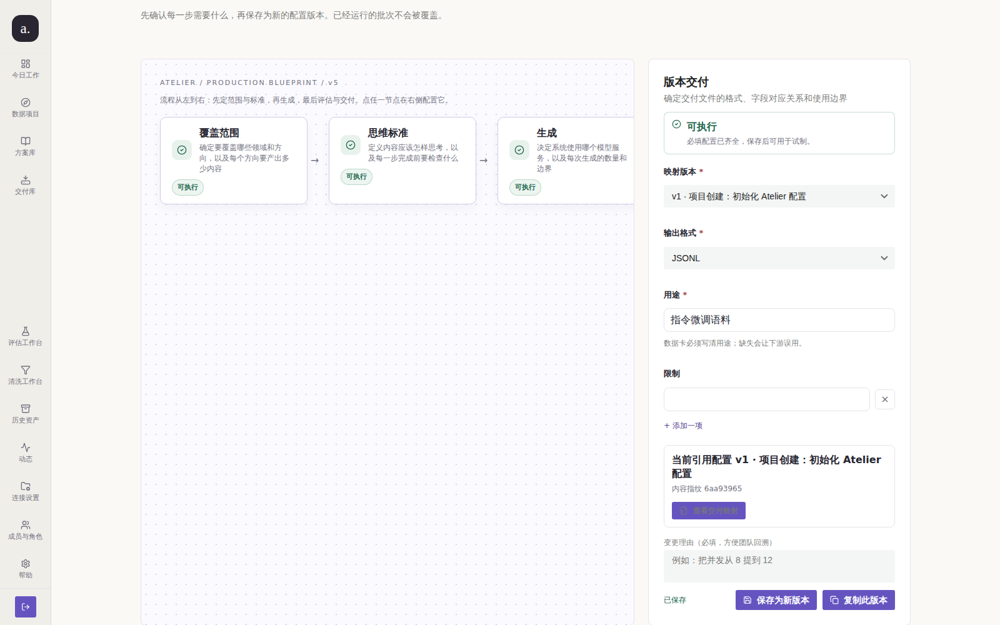
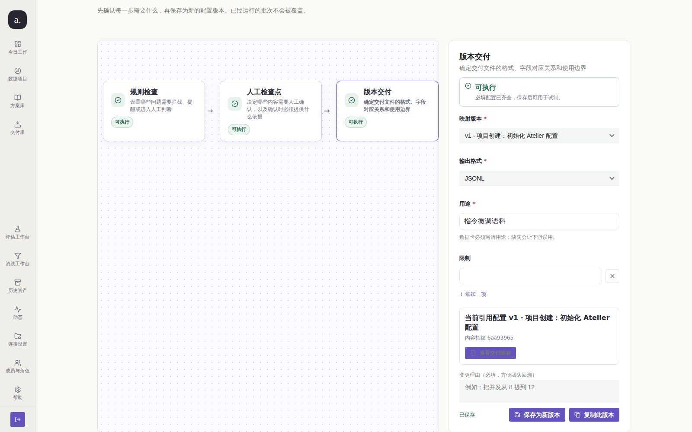

# Issue #204 — 蓝图画布靠后节点不可达（复核轮）

## 结论

**当前已修复（2026-10-08，main `5986da8` / PR #259）**：原 #235 的深链可达性修复仍有效；#259 已加入可见的画布滚动提示、缩放与适应工具栏。下文记录的是历史复核轮，末尾“滚动提示未收口”已被后续实现取代。

当前交互证据见 `docs/audit/issue-197-closure/result.json` 与 `test/audit/blueprint-workflow.mjs`：逐节点命中、拖拽/键盘移动、390/768/1440px 页面无横向溢出。该浏览器测试使用生产页面与受控文档 API；不会被表述成真人验收。

## 实测机制与 issue 原文的差异（本轮修正，不照抄结论）

issue #204 原文写：「节点被右栏**覆盖**，点击命中 inspector，7 个节点里 4 个不可点」。
本轮在 `origin/main @ a889b43` 用真实栈 + 真实 Chromium 复跑，得到的机制**不同**：

| 判定项 | issue 原文 | 本轮实测 |
| --- | --- | --- |
| 画布与右栏的关系 | 节点被右栏覆盖 | 画布 `overflow-x:auto`，宽 790px、`scrollWidth=1886`；右栏在其右侧（gap 22px），**不重叠** |
| 为什么命中 inspector | 右栏压在节点上 | 第 4~7 个节点被画布**横向滚动裁掉**；对布局坐标直接 `elementFromPoint` 落到 inspector（那里确实是该坐标的顶层元素） |
| 节点能否点击 | 4/7 不可点 | 节点滚入可视区后 **7/7 可正常点击与选中**（`probe-click.json`，真实鼠标） |
| 点击反馈是否不一致 | 三种不同反应 | 滚入可视区后逐一点击，`?node=` 与右栏标题**全部一致**（`probe-click.json: failures=0`） |

因此「被右栏覆盖」与「点击反馈不一致」在当前 main 上**不成立**；
**站得住的缺陷**是可达性：`?node=` 是
`docs/plans/atelier-implementation.md` §3.2 明确「可分享」的参数，
但深链到靠后节点时它不可见。

## 复现（修复前）

同条件脚本：`docs/audit/issue-204/repro-node-reachability.mjs`（真实栈 + 真实 Chromium 1600×1000）。
逐个打开 `?node=<key>`，断言当前节点几何中心是否落在画布可见矩形内。



实测读数（`before-node-reachability.json`）：

| 深链目标 | canvasScrollLeft | 当前节点可见 | 右栏标题 |
| --- | --- | --- | --- |
| coverage | 0 | ✅ | 覆盖范围 |
| generation | 0 | ✅ | 生成 |
| **evaluation** | 0 | ❌ | 独立评估 |
| **rules** | 0 | ❌ | 规则检查 |
| **human_review** | 0 | ❌ | 人工检查点 |
| **delivery** | 0 | ❌ | 版本交付 |

缺陷成立：**6 个深链目标里 4 个打开后当前节点不可见** —— 用户拿到一个指向
「版本交付」的分享链接，看到的却是被截断的左端。

## 根因

`BlueprintPages.tsx` 把当前节点写进 URL（`?node=`），但界面从不把它带入可视区。
画布是 `overflow-x: auto` 的横向流程带，窄屏下只有前几个节点在可视区内；
滚动条在画布底部（首屏之下），用户既看不到靠后节点，也没有「还能往右滚」的提示。

## 改动

| 文件 | 改动 | 目的 |
| --- | --- | --- |
| `apps/web-user/src/studio/pages/BlueprintPages.tsx` | 画布节点登记 DOM ref；`activeSpec`/`loading` 变化时 `scrollIntoView({inline:'nearest'})` | 让「可分享的当前节点」在界面层面也真的可见（兑现契约 §3.2） |

`dep` 必须包含 `loading`：加载中页面提前 `return <Spin>`，节点尚未挂载（refs 为空），
只在 `activeSpec` 变化时跑会在深链场景**静默失效** —— 本轮调试中已实测该陷阱。

## 验证（修复后）



同条件重跑结果（`after-node-reachability.json`）：**深链后不可见的当前节点 4/6 → 0/6**。

## 门禁结果

```text
gofmt: clean        go vet: clean        go build: ok
go test: ok（未改动 Go 代码）
npm run build: 通过（tsc + vite）
node test/l15_studio_shell.mjs: 全部通过
  （新增 problemsWithBlueprintActiveNodeReachability 谓词 + 2 条变异自证：
   摘掉 scrollIntoView / 退回缺少 loading 的依赖，断言都必须报错）
CI 冻结的 23 个 l15 守卫全部通过
```

## 未收口 / 残留风险

1. **画布滚动条仍在首屏之下**（画布高 680px，底部 y=1143 > 视口 1000）。
   本轮**刻意未改布局高度**：`docs/architecture/blueprint-workflow-rearchitecture.md`
   §3.2 明确批准「画布内部横向滚动」，改动整体高度属于未获批的 UX 决策；
   且实测各种 `max-height` 取值在不同视口下会与 `align-items: stretch` 的检查器
   产生高度不一致或裁切（见本轮 204 探针过程）。当前缓解：`?node=` 深链保证
   当前节点可见；键盘 Tab 逐个聚焦节点时浏览器会自动滚动（实测 `scrollLeft` 0→1098）。
2. **建议下一轮/人工决策**：是否要把「画布内可横向滚动」做成显式提示
   （如原型 `canvas-tools` 的「适应/缩小/放大」工具栏），或给画布加固定高度。
   这需要产品决策，超出自动修复边界。
