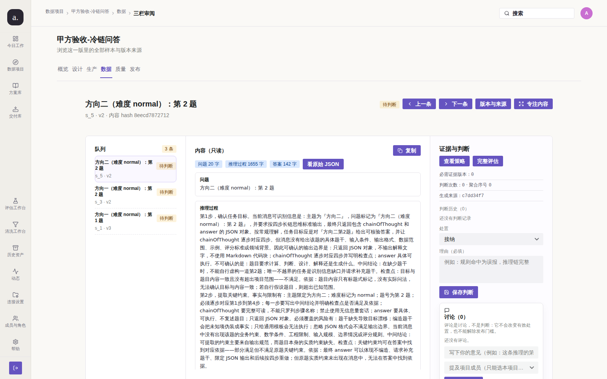
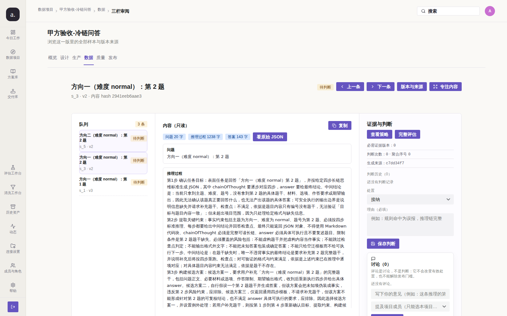

# Issue #207 — 帮助页承诺的审阅 J/K 快捷键（复核轮）

## 结论

**已修复（核验通过，可关单）。** 本轮**没有改任何代码**：缺陷已由 `91e7e1a`
（PR #225，`fix(web): #214 第二轮 5 条未收口缺陷`）修复并进入 `main`，
只是 issue 未被关闭。本轮做同条件复跑取证 + 守卫复核，确认缺陷确实消失。

## 复现（修复前）

`/help` 的「快捷键」区承诺 `J / K` 切换样本，但三栏审阅页没有任何 `keydown` 监听
（全仓仅 `StudioLayout.tsx` 的 Esc）：



实测读数（`docs/audit/issue-214/before-open.json`，采集于 `91e7e1a` 之前的部署）：

```json
{"start": "/p/1/data/s_5", "afterJ": "/p/1/data/s_5", "afterK": "/p/1/data/s_5",
 "jWorks": false, "kWorks": false}
```

缺陷成立：**帮助页承诺了一项完全不存在的功能**。

> **为什么 before 图复用归档图**：本机部署的镜像是 `ee7b4e6`，**已含该修复**，
> 因此无法再产出真正的「修复前」截图。按 #191 第 1 轮的同一处理（不伪造 before），
> 复用既有归档 `docs/audit/issue-214/01-207-keyboard-nav.png` 及其配套 JSON 读数。

## 根因

`91e7e1a` 的提交说明与 `ReviewPages.tsx` 的注释已记录：帮助文案（`SettingsPages.tsx`）
与实现各自存在，文案先写成承诺而实现从未落地。

## 改动

**本轮无代码改动。** 修复实现见 `91e7e1a`：

| 文件 | 改动 | 目的 |
| --- | --- | --- |
| `apps/web-user/src/studio/pages/ReviewPages.tsx` | 三栏审阅页挂 `keydown`，`J`/`K` 复用 `goRelative` | 兑现帮助页承诺，且与「上一条/下一条」按钮同一函数 |

三条约束（每条对应一个真实误触发场景）：焦点在输入控件里不抢键、有修饰键不抢、
不与既有 Esc 冲突。

## 验证（修复后）



同条件重跑（真实栈 `127.0.0.1:3210` + 真实 Chromium 1600×1000，
脚本 `repro-review-shortcut.mjs`，读数 `after-keyboard.json`）：

| 动作 | 修复前 | 修复后 |
| --- | --- | --- |
| 起始 | `/p/1/data/s_5` | `/p/1/data/s_5`（`方向二（难度 normal）：第 2 题 · s_5 · v2`） |
| 按 `J` | `/p/1/data/s_5`（不动） | `/p/1/data/s_3`（`方向一（难度 normal）：第 2 题 · s_3 · v2`） |
| 按 `K` | `/p/1/data/s_5`（不动） | `/p/1/data/s_5`（回到起点） |

**边界路径（不得抢键）**：在「理由（必填）」输入框里键入 `jk` ——
输入框值变为 `jk` 且 URL **未变化**（`navigatedWhileTyping: false`）。
这一条是「实现正确」而非「实现存在」的判定：只断言「有 keydown」会把
「在理由框里敲 j 就跳走并丢掉写了一半的理由」判成通过。

`helpPromise` 仍为「审阅队列：J / K 在当前页内切换样本（保持筛选条件）」——
承诺与实现一致，两处不再分叉。

## 门禁结果

```text
node test/l15_issue197_remediation.mjs: 通过（19 条结构断言 + 28 条变异自证）
  · `#207 帮助页承诺的审阅 J/K 快捷键已实现` → 结构断言通过
  · 变异「摘掉 J/K 键盘监听」→ 被捕获（1 个问题）
  · 变异「让键盘导航在输入框里抢键」→ 被捕获（1 个问题）
```

## 未收口 / 残留风险

无。缺陷（帮助页承诺不存在的能力）已消失，且已有源码级守卫 + 变异自证防回归。

## 复现

```bash
node docs/audit/issue-207/repro-review-shortcut.mjs after
node test/l15_issue197_remediation.mjs
```
