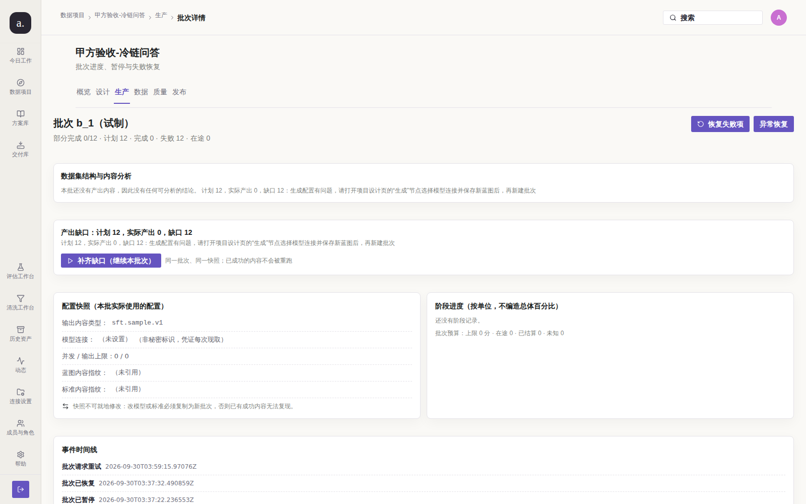

# Issue #208 — 批次缺口文案与真实失败原因矛盾（复核轮）

## 结论

**已修复（核验通过，可关单）。** 本轮**没有改任何代码**：缺陷已由
`1381667`（PR #228，`fix(studio): 批次状态机收敛与缺口原因归因`）修复并进入 `main`，
只是 issue 未被关闭。本轮做同条件复跑取证 + 守卫复核，确认缺陷确实消失。

## 复现（修复前）

`/p/1/runs/b_1` 同一页面上两条说明互相冲突：

| 位置 | 文案 |
| --- | --- |
| 缺口横幅 | 「覆盖率不足或无素材接地，请补充方向配额/素材后重跑」 |
| 异常恢复页 | 「生成配置有问题，请打开项目设计页的"生成"节点**选择模型连接**并保存新蓝图后，再新建批次」 |


真实原因（`batch_items.error_message`，12 行全部相同）：
`missing model connection: 批次快照没有模型连接，请到设计页的生成节点补齐`。
照着缺口文案去改覆盖矩阵配额是**无效操作**。

## 根因

`internal/model/batch.go` 的 `ShortfallNote()` 对**所有**缺口套同一句写死文案，
从不读 `batch_items.error_class`。而 `#190` 的容量校验已在**启动前**挡住
「配额不足」这一类（计划 12 > 容量 4 → 422），因此能落到运行期的缺口基本都**不是**
覆盖率问题 —— 那句文案恰好指向了最不可能的原因。

## 改动

**本轮无代码改动。** 修复实现见 `1381667`：

| 文件 | 改动 | 目的 |
| --- | --- | --- |
| `internal/model/batch.go` | `ShortfallNote()` 从 `DominantFailureClass`（失败单元的 `error_class` 分布）推导原因，复用 `ErrorClassAction` 作为单一文案来源 | 原因来自失败事实；与「异常恢复」页**同源**，两处不可能各说一套 |
| `internal/store/batch_store.go` | 聚合带上 `DominantFailureClass`；状态改为从 `batch_items` 事实推导的不动点 | #201/#202/#208 同一根因 |
| `apps/web-user/src/studio/pages/RunPages.tsx` | 缺口卡只渲染服务端文案，**删除**写死的兜底句 | 前端不再存在第二份文案 |

## 验证（修复后）



同条件重跑（真实栈 `127.0.0.1:3210` + 真实 Chromium 1600×1000，
脚本 `repro-shortfall-note.mjs`，读数 `after-shortfall.json`）：

| 判定（机器事实） | 修复前 | 修复后 |
| --- | --- | --- |
| 缺口卡归因「覆盖率不足/方向配额/素材接地」 | ✅ 命中 | ❌ 不命中（`blamesCoverage: false`） |
| 缺口卡与 `/failures` 的 `suggestedAction` 同句 | ❌ 矛盾 | ✅ 逐字包含（`agreesWithSuggestion: true`） |

实测读数：

```json
{"batch": "b_1", "blamesCoverage": false, "agreesWithSuggestion": true,
 "failure": {"errorClass": "config_error",
             "suggestedAction": "生成配置有问题，请打开项目设计页的“生成”节点选择模型连接并保存新蓝图后，再新建批次"},
 "shortfallCard": "产出缺口：计划 12，实际产出 0，缺口 12 / 计划 12，实际产出 0，缺口 12：生成配置有问题，请打开项目设计页的“生成”节点选择模型连接并保存新蓝图后，再新建批次 / 补齐缺口（继续本批次）"}
```

**第二例（b_2，无失败单元的缺口 —— 边界路径）**：
计划 4、实际产出 1、失败 0，缺口 3。真因是单元从未被创建（#201），
同样与覆盖率无关。修复后文案为
「有 3 个计划单元没有产出（未创建或被跳过），请先查看批次事件确认原因后再新建批次」
（`02-after-shortfall-b_2.png` / `after-shortfall-b_2.json`，`blamesCoverage: false`）。
这条证明修复**不是**把一句写死文案换成另一句写死文案：无失败项时走的是第三条分支
（不断言覆盖率 —— 那条断言正是 #208 的误导来源）。

## 门禁结果

```text
node test/l15_issue197_remediation.mjs: 通过（19 条结构断言 + 28 条变异自证）
docs/audit/issue-214/REPORT-round3.md 记录的门禁（本修复合入时）：
  go test: ok（internal/store/batch_store_test.go 新增 4 条真实 Postgres 用例）
  scripts/go-test-postgres.sh: PASS=1154 SKIP=2（必需 0 项缺失）
  npm run build: 通过（tsc + vite）
```

## 未收口 / 残留风险

无。判定 #208 的两条机器事实（不得归因覆盖率、必须与失败建议同句）本轮均已成立。

## 复现

```bash
node docs/audit/issue-208/repro-shortfall-note.mjs after            # b_1
BATCH_ID=b_2 node docs/audit/issue-208/repro-shortfall-note.mjs after
node test/l15_issue197_remediation.mjs
```
