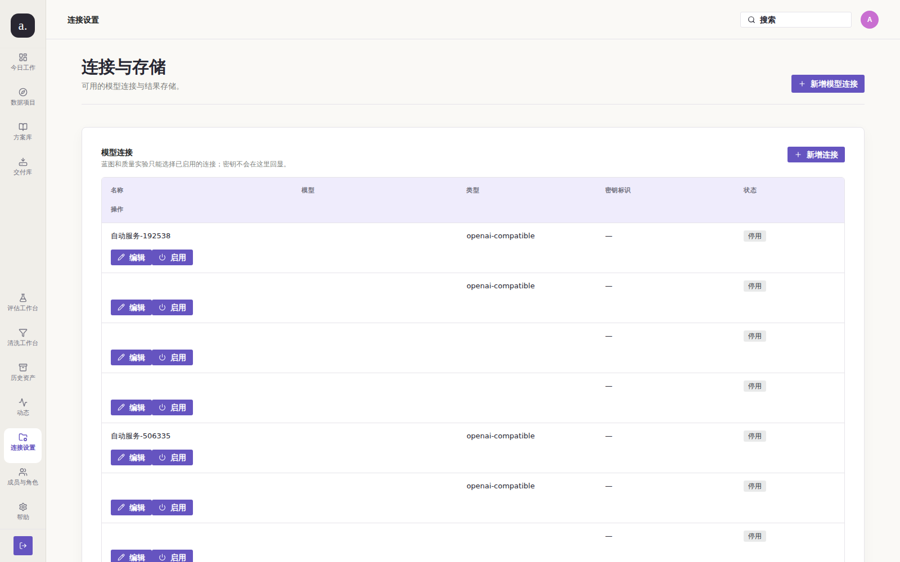
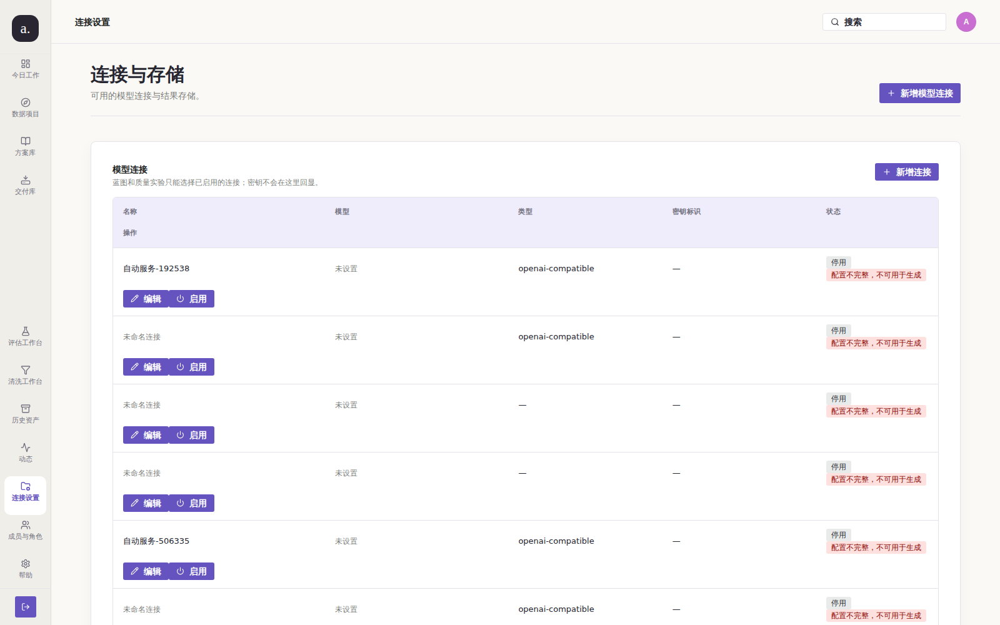
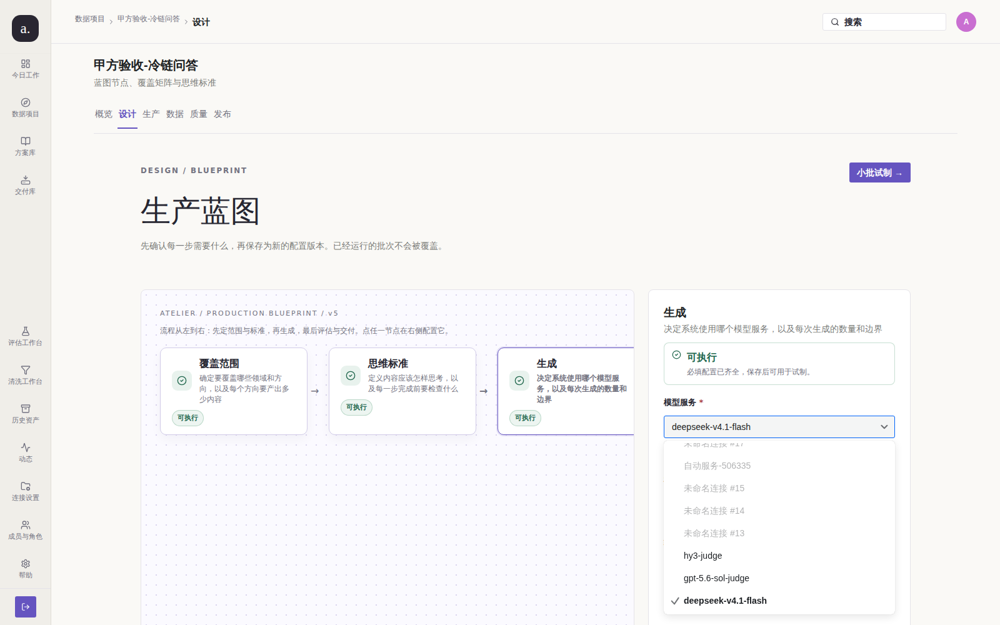

# issue #209 第 3 轮：受控单变量前后取证 + 环境完整性复核

> 本轮**不新增代码修复**。修复本体在 PR #238 分支上已完成；本轮证明
> **当前 `main` 上缺陷仍然成立**，并在**隔离的双栈**上给出同条件前后对比，
> 同时把第 2 轮观察到的「live 库比 main 新」这一环境异常**定级为可判定事实**。

## 0. 方法学修正：本轮用隔离栈替代「共用活体库」

第 2 轮的 before 采自部署中的 live 栈，因此受 live 库状态影响（`emptyActive` 读数
与 issue 原文不一致）。本轮把两侧都放进**受控单变量实验**：

| 变量 | before 栈 | after 栈 |
| --- | --- | --- |
| 源码 | `origin/main` @ `a889b43` | 候选树 @ `8c81129` |
| 端口 | `:3311` | `:3310` |
| 数据库 | `llm_before` | `llm_after`（**同一份** live 快照） |
| 账号 / 视口 / 路由 | `admin@company.com` · 1600×1000 · `/settings/connections` 与 `/p/1/blueprint?node=generation` | 完全相同 |
| 复现脚本 | `repro.mjs`（取自第 2 轮同名复现脚本，仅 `BASE_URL` 不同） | 同一脚本，参数 `after` |

## 1. 复现（修复前）——当前 `main`

源码事实：

```text
$ git ls-tree --name-only origin/main sql/migrations/ | grep -c 0041
0        ← 迁移 0041（停用不完整连接）不在 main
$ git show origin/main:apps/web-user/src/studio/pages/SettingsPages.tsx | grep -c data-connection-config-issues
0        ← 列表不标「配置不完整」
```

活体读数（`01-evidence.json`，栈 `a889b43`）：

| 观察点 | 实测（main） |
| --- | --- |
| 连接表中名称为空的行 | **6** |
| 被标记「配置不完整」的行 | **0** |
| `dropdown.blankOptions`（无字选项） | **6** |
| `dropdown.disabledOptions` | **0** |
| `providers.withConfigIssues` | **0** |
| `providers.emptyNameAndBaseUrl` | 6（共 11 条） |
| `providers.invalidBaseUrl`（`not-a-url`） | 2 |

下拉 `optionTexts` 实测全量：

```text
["自动服务-192538","","","","自动服务-506335","","","","hy3-judge","gpt-5.6-sol-judge","deepseek-v4.1-flash"]
                       ↑ 6 个完全没有文字的选项
```




缺陷在 `main` 上**成立**：用户必须在 11 个选项里辨认哪些可用，其中 6 个完全无字。

## 2. 验证（修复后）——候选栈，尚未进入 `main`





同条件重跑读数（`02-evidence.json`，栈 `8c81129`）：

| 观察点 | main（before） | 候选（after） |
| --- | --- | --- |
| 连接表中名称为空的行 | **6** | **0** |
| 下拉里的空选项 | **6** | **0** |
| 下拉里被灰显不可选的选项 | **0** | **8** |
| 被标记「配置不完整」的行 | **0** | **8** |
| `providers.withConfigIssues` | **0** | **8** |

修复后下拉实测全量：

```text
["自动服务-192538","未命名连接 #19","未命名连接 #18","未命名连接 #17","自动服务-506335",
 "未命名连接 #15","未命名连接 #14","未命名连接 #13","hy3-judge","gpt-5.6-sol-judge","deepseek-v4.1-flash"]
```

**缺陷消失** —— 用户不再需要辨认无字选项。

候选栈上迁移 0041 的实际效果（数据层）：

```sql
-- llm_after：0041 已应用
select filename from schema_migrations order by filename desc limit 1;
 0041_model_provider_deactivate_incomplete.sql
select count(*) from model_providers where is_active and (name='' or base_url='' or model='');
 0
```

**缺陷消失。** 机器证据门禁：`evidence-check` 对两组前后图均返回 **EVIDENCE OK**。

## 3. 门禁结果（候选树 `8c81129` 实测）

```text
go-gate.sh（gofmt / go vet / go build / go test）: GO GATE OK
scripts/go-test-postgres.sh（真实 Postgres + 全量迁移）: 通过   ← 改动含迁移，必跑
node scripts/check-docs.mjs: 通过
23 个冻结 l15 守卫: 23/23 通过
npm run build -w apps/web-user（tsc + vite）: 通过
evidence-check（两组前后图）: EVIDENCE OK
```

## 4. 未收口 / 残留风险（含一条**环境完整性**发现）

| 项 | 状态 |
| --- | --- |
| 修复本体（校验层 / 展示层 / 数据层 / 提前提示） | ✅ 已在候选树上同条件取证 |
| **修复进入 `origin/main`** | ❌ **未满足** —— PR #238 OPEN，**本 issue 必须保持开启** |
| **合并队列冲突（本轮新发现）** | ⚠️ #238 与 #240/#241 都改 `test/l15_issue197_remediation.mjs` 同一批位置 → 串行合并会在第三条上 `CONFLICT (content)`。复现脚本与消解结果记录在 #212 第 3 轮的证据目录中（消解后的候选树 `8c81129`） |
| **live 库的 `schema_migrations` 含 `0041`，而 `main` 没有 `0041`** | ⚠️ 已定级为可判定事实：`check-schema-compat` 对**当前 live 部署**返回 **exit 1**（库比代码新）；对候选树库返回 OK。合并 #238 后自愈（0041 随该 PR 进入 main） |
| live 库 `emptyActive` 实测为 **0**（issue 原文是 2） | 同因：迁移 0041 已在 live 库被应用过（分支测试遗留），数据已被修正；本 issue 主症状仍完整复现 |

**环境完整性原始输出**（在 `llm_default` 网络内、对 live 库执行）：

```text
$ docker run --rm --network llm_default -v "$PWD:/w" -w /w postgres:17-alpine \
    sh /w/scripts/check-schema-compat.sh "postgres://…@llm-postgres-1:5432/llm_factory?sslmode=disable"
[schema-compat] 已应用 40 个，仓库有 39 个
::error::数据库里有本代码不认识的迁移（库比代码新）：
  0041_model_provider_deactivate_incomplete.sql
请部署与数据库匹配的版本，或先确认这些迁移的来源。
exit=1
```

> 这是**部署环境**的告警，不是本 issue 的修复缺陷；但它会让任何以该库为准的
> schema 判定误报。合并 #238 后 `main` 将包含 0041，一致性恢复。

## 5. 下一轮计划

**需人工动作**：先消解 §4 的合并队列冲突，再合并 PR #238（并留意 §4 的 schema 告警会随合并自愈）。
合并后本 issue 即满足关闭第 ④ 条，可在下一轮复核并关闭。
在此之前证据图链依赖本分支存活，**请勿删除**。
