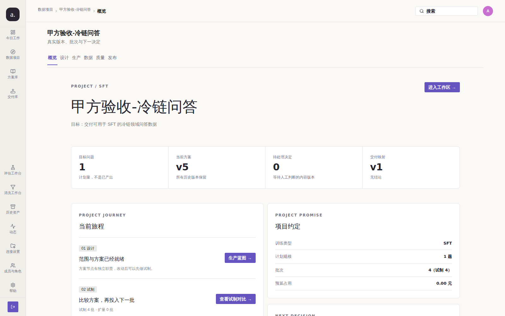
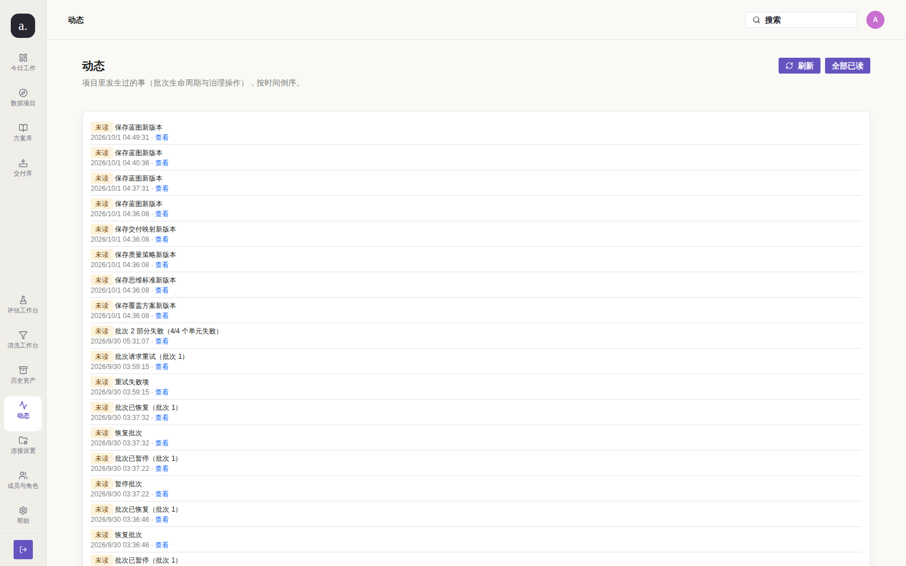

# Issue #210 — 动态列表审计类事件的「查看」落点（复核轮）

## 结论

**已修复（核验通过，可关单）。** 本轮**没有改任何代码**：缺陷已由 `91e7e1a`
（PR #225，`fix(web): #214 第二轮 5 条未收口缺陷`）修复并进入 `main`，
只是 issue 未被关闭。本轮做**全量**同条件复跑 + 守卫复核，确认缺陷确实消失。

## 复现（修复前）

`/activity` 上审计类动态的「查看」**19 条全部**指向 `/p/1/overview`：



实测读数（`docs/audit/issue-214/before-open2.json`，采集于修复之前的部署）：

```json
{"rowText": "未读 |  重试失败项 | 2026/9/28 06:03:53 · 查看",
 "href": "/p/1/overview", "landedOn": "/p/1/overview", "isOverview": true}
```

全量扫描（issue 正文）：`{"batch -> /p/1/runs/N": 12, "audit -> /p/1/overview": 19}`
—— 审计类是**一条也没落到对象**，而 `batch` 类正确落到了 `/p/1/runs/{id}`。
这说明链接机制是有的，只是审计类没填。**缺陷成立。**

> **为什么 before 图复用归档图**：本机部署的镜像已含该修复（`91e7e1a` 在 `main`），
> 因此无法再产出真正的「修复前」截图。按 #191 / #207 的同一处理（**不伪造 before**），
> 复用既有归档图 `docs/audit/issue-214/01-210-audit-target.png` 及其配套 JSON 读数。

## 根因

`internal/store/activity_store.go` 的 `activityLinks` 只区分「批次」与「其它」：
批次落到 `/p/{id}/runs/{batchId}`，**其余一律落 `/p/{id}/overview`**。
审计记录（`source = audit`）因此全部落到概览 —— 而审计记录讲的恰恰是
「谁在什么时候改了哪个对象」，是**最需要跳转细节**的一类。

## 改动

**本轮无代码改动。** 修复实现见 `91e7e1a`：

| 文件 | 改动 | 目的 |
| --- | --- | --- |
| `internal/store/activity_store.go` | 新增 `auditActivityLink`：按 `resource_type` + 对象标识推导落点；无法映射时给 `/activity` 而**不是**概览 | 审计记录指向该操作的对象 |
| `internal/store/activity_store.go` | `LoadActivity` 的审计分支改用 `auditActivityLink` | 接线（只有函数、没人调用等于没修） |
| `internal/store/activity_store_test.go` | `TestAuditActivityLinkMapping` + `TestAuditActivityLinkPointsAtObject` | 正常 + 边界路径 |

**为什么「无法映射时给 `/activity`」而不是继续给概览**：给概览会**重现本缺陷**
（链接假装能定位对象，点进去却什么都没有）；`/activity` 至少诚实地表达
「这条记录不能跳到对象」。这一条在测试里被显式断言。

## 验证（修复后）

全量扫描（`02-after.json`，真实栈 + 真实 Chromium 1600×1000）：

```text
审计类记录 18 条，全部有「查看」链接
落到 /overview 的：0 条   ← #210 的缺陷判据
落点分布：
  8  /p/1/runs/b_1                （批次对象）
  1  /p/1/runs/b_4
  1  /p/1/data/s_4                （样本身份，不是版本行 ID）
  1  /p/2/blueprint?version=4     （文档历史版）
  1  /p/2/releases/new?version=1  （映射版本的编辑器页）
  1  /p/2/rules?version=1         （质量策略版本的编辑器页）
  1  /p/2/standard?version=1
  1  /p/2/coverage?version=1
```



**真实点击**（不是只读 href —— 只读 href 无法证明点击后真到那一页）：

```json
{"rowText": "未读 保存蓝图新版本 2026/10/1 04:49:31 · 查看",
 "href": "/p/2/blueprint?version=4",
 "landedOn": "/p/2/blueprint", "landedOnOverview": false}
```

对照 `docs/audit/issue-214/after-open2.json`（修复当时）：`/p/1/runs/b_1`，非概览。

## 未收口 / 残留

1. **`REPORT.md` D15 把「全局搜索不覆盖批次/样本 ID」也挂在 #210 之下**，
   但 issue 正文**没有**这一条（#210 的唯一诉求是「查看」的落点）。
   实测该行为**未修复**：`?q=b_3` / `?q=s_5` 均 0 命中，且空结果文案把
   「不存在」与「无权限」混成一句。**它不属于 #210 的验收范围**，
   因此本轮**不**据此保持 #210 开启；如需处理建议单独开单。
2. **未登记资源类型仍回退到项目概览**（`auditActivityLink` 的 default 分支）。
   实测当前库里项目内审计记录的 `resource_type` 全部已被显式覆盖
   （`batch` / `sample_version` / `release` / 五类文档版本），
   因此该分支**当前不可达**。它是一处**刻意保留的降级**（注释已写明理由：
   概览至少属于本项目，且不假装能定位对象），不是缺陷残留。

## 复现命令

```bash
cd /root/llm
docker compose up -d --build          # 或对已部署栈直接跑
node docs/audit/issue-210/repro-audit-links.mjs
```
