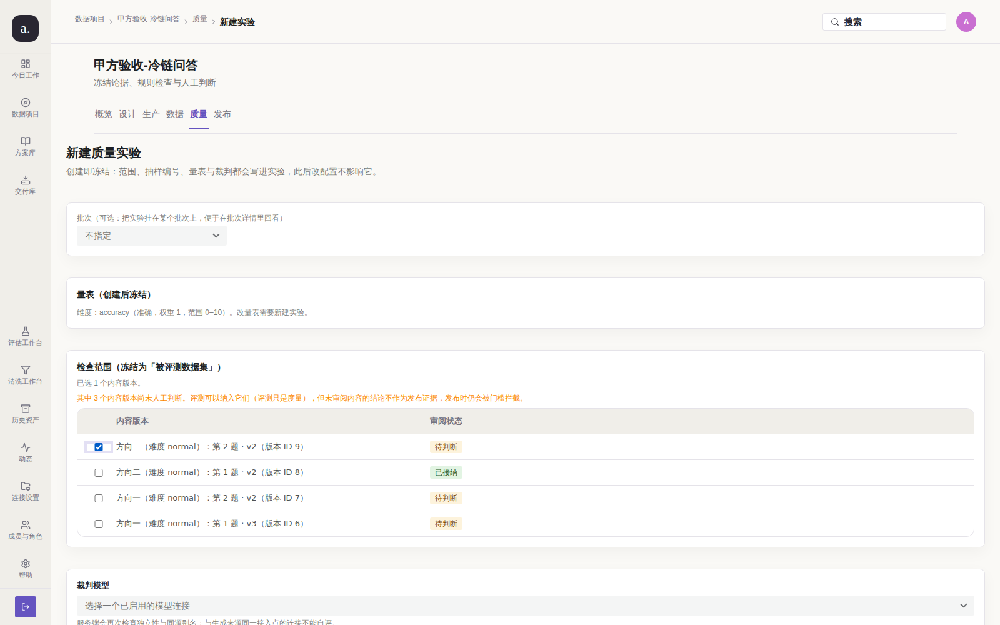
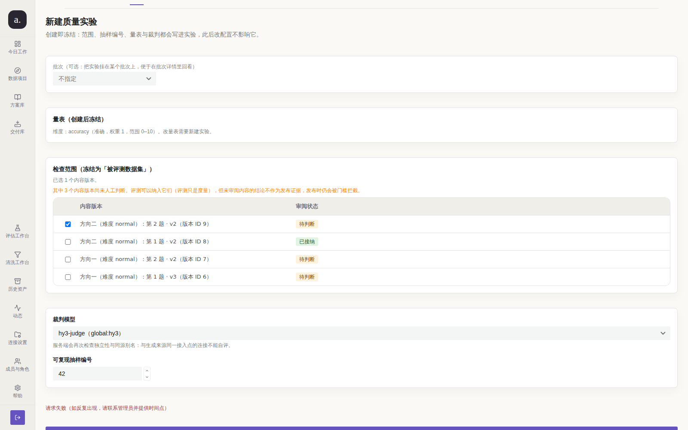
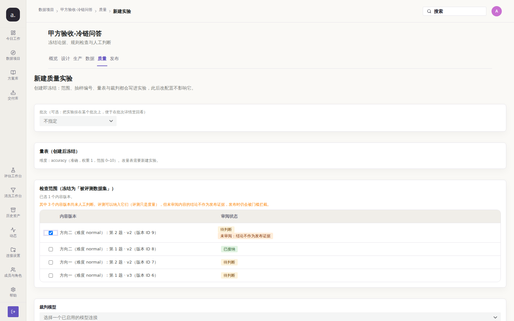
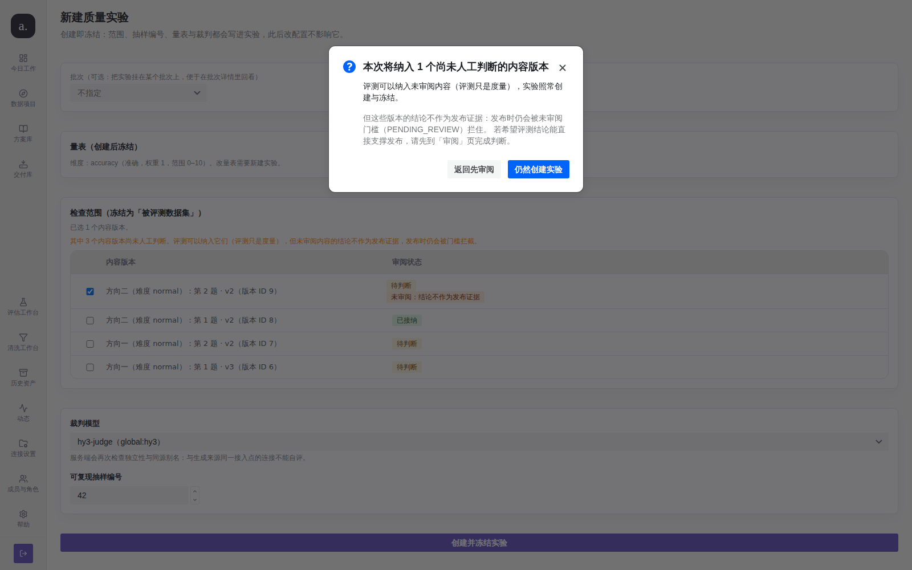

# issue #211 第 3 轮：受控单变量前后取证

> 本轮**不新增代码修复**。修复本体在 PR #240 分支上已完成；本轮证明
> **当前 `main` 上缺陷仍然成立**，并在**隔离的双栈**上给出同条件前后对比。

## 0. 方法学修正：本轮用隔离栈替代「共用活体库」

第 2 轮把三条 PR 合成候选树后重建了一套隔离栈（`:3310`），但 before 仍采自**部署中的
live 栈**（`:3210`）。本轮把两侧都放进**受控单变量实验**：两栈同一份 live 库快照快照出来的
独立库、同账号、同视口、同路由、同一组选择器，唯一变量是**源码版本**。

| 变量 | before 栈 | after 栈 |
| --- | --- | --- |
| 源码 | `origin/main` @ `a889b43` | 候选树 @ `8c81129` |
| 端口 | `:3311` | `:3310` |
| 数据库 | `llm_before` | `llm_after`（同一份 live 快照） |
| 账号 / 视口 / 路由 | `admin@company.com` · 1600×1000 · `/p/1/quality/new` | 完全相同 |
| 复现脚本 | `repro.mjs`（`repro-main.mjs` 抄本，仅 `BASE_URL` 不同） | 同一脚本，`STAGE=after` |

## 1. 复现（修复前）——当前 `main`

源码事实：

```text
$ git show origin/main:apps/web-user/src/studio/pages/QualityPages.tsx | \
    grep -c 'selectedUnreviewedCount\|Modal.confirm\|data-scope-unreviewed-row'
0        ← 行内未审阅标记与提交前确认在 main 上不存在
```

活体读数（`01-before.json`，栈 `a889b43`）：

| 观察点 | 实测（main） |
| --- | --- |
| 勾选 pending 行后的行内标记数 | **0** |
| 该行可见文本 | `方向二（难度 normal）：第 2 题 · v2（版本 ID 9） 待判断` |
| 点「创建并冻结实验」是否先弹知情确认 | **否** —— 直接 `POST /api/v1/projects/1/experiments` |
| `postAttemptedWithoutConfirm` | **true** |
| 页顶背景说明（`74c9153` 已进 main 的部分） | 存在（但不回答「我刚勾的这条算不算证据」） |





> 复现脚本用 `page.route` 拦掉真实创建请求：修复前的**真实后果**就是真的建出实验
> （会排队跑 LLM、消耗额度），本脚本要比较的是「有没有弹确认框」，因此不应产生副作用。

缺陷在 `main` 上**成立**。

## 2. 验证（修复后）——候选栈，尚未进入 `main`





同条件重跑读数（`02-after.json`，栈 `8c81129`）：

| 观察点 | main（before） | 候选（after） |
| --- | --- | --- |
| 勾选 pending 后的行内标记数 | **0** | **1** |
| 该行可见文本 | `… 待判断` | `… 待判断 未审阅：结论不作为发布证据` |
| 点提交是否先弹知情确认 | **否** | **是** |
| `postAttemptedWithoutConfirm` | **true** | **false** |
| 被拦截的创建请求数 | 1（已发出） | **0**（未发出） |

确认框实测全文：

```text
本次将纳入 1 个尚未人工判断的内容版本
评测可以纳入未审阅内容（评测只是度量），实验照常创建与冻结。
但这些版本的结论不作为发布证据：发布时仍会被未审阅门槛（PENDING_REVIEW）拦住。
若希望评测结论能直接支撑发布，请先到「审阅」页完成判断。
[返回先审阅] [仍然创建实验]
```

**缺陷消失。** 机器证据门禁：`evidence-check` 对两组前后图均返回 **EVIDENCE OK**。

## 3. 门禁结果（候选树 `8c81129` 实测）

```text
go-gate.sh（gofmt / go vet / go build / go test）: GO GATE OK
scripts/go-test-postgres.sh（真实 Postgres + 全量迁移）: 通过
node scripts/check-docs.mjs: 通过
23 个冻结 l15 守卫: 23/23 通过（含 l15_issue197_remediation）
npm run build -w apps/web-user（tsc + vite）: 通过
evidence-check（两组前后图）: EVIDENCE OK
```

## 4. 未收口 / 残留风险

| 项 | 状态 |
| --- | --- |
| 修复本体（行内标记 + 提交前确认 + 全树守卫） | ✅ 已在候选树上同条件取证 |
| **修复进入 `origin/main`** | ❌ **未满足** —— PR #240 OPEN，**本 issue 必须保持开启** |
| **合并队列冲突（本轮新发现）** | ⚠️ #240 与 #238/#241 都改 `test/l15_issue197_remediation.mjs` 同一批位置 → 串行合并会在第三条上 `CONFLICT (content)`。复现脚本与消解结果记录在 #212 第 3 轮的证据目录中（候选树 `8c81129` 即消解后的树） |
| 全树守卫只覆盖 `reviewStatus` / `effectiveAction` 两个字段名 | 新增枚举字段时仍需同步扩守卫（已写在守卫注释里） |
| 页顶说明与确认框措辞略有重叠 | 刻意保留（常驻背景 vs 本次行动后果），属产品取舍 |

## 5. 下一轮计划

**需人工动作**：先消解 §4 的合并队列冲突，再合并 PR #240。
合并后本 issue 即满足关闭第 ④ 条，可在下一轮复核并关闭。
在此之前证据图链依赖本分支存活，**请勿删除**。
