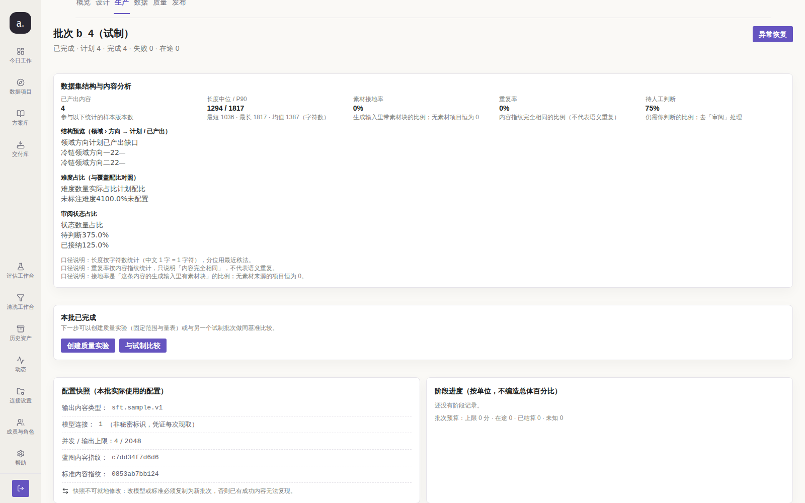
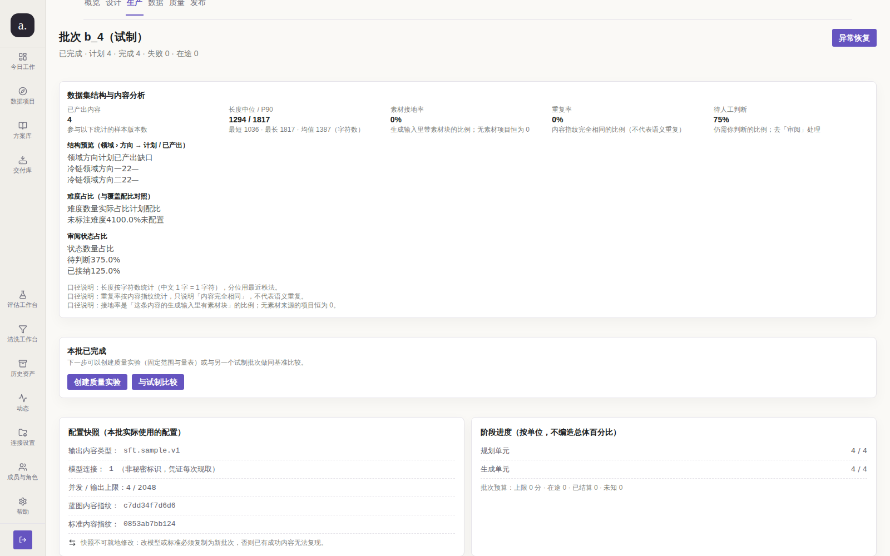

# issue #212 第 3 轮：受控单变量前后取证 + 在办 PR 合并队列冲突

> 本轮**不新增代码修复**。修复本体在 PR #241 分支上已完成；本轮证明
> **当前 `main` 上缺陷仍然成立**，并给出一个**此前每一轮都漏掉的新事实**：
> 三条在办载体 PR 无法串行干净合并。

## 1. 为什么本轮要重建一套隔离栈（方法学修正）

第 2 轮的 before 取证建立在**共用活体库**上，而该库被 PR #241 的分支测试写过 8 行
`batch_steps` —— 于是「main 上该区块恒空」这一论断，只能靠**源码事实**（0 命中）来支撑，
活体读数反而被污染（第 2 轮评论里已如实说明这一红鲱鱼）。

本轮把不确定性消掉：**受控单变量实验**。

| 变量 | before 栈 | after 栈 |
| --- | --- | --- |
| 源码 | `origin/main` @ `a889b43` | 候选树 @ `8c81129`（见 §3） |
| 部署端口 | `:3311` | `:3310` |
| 数据库 | `llm_before`（live 快照） | `llm_after`（**同一份** live 快照） |
| `batch_steps` 起始行数 | **0**（显式 `DELETE`） | **0**（显式 `DELETE`） |
| 账号 / 视口 / 路由 / 批次 | `admin@company.com` · 1600×1000 · `/p/1/runs/b_4` | 完全相同 |

两栈的 `batch_steps` 都从 0 行开始（main 从不写它），因此「有无阶段行」**唯一归因于源码版本**。

## 2. 复现（修复前）——当前 `main`

```text
$ git grep -c 'RefreshBatchSteps\|ListBatchIDsWithStaleSteps' origin/main -- apps internal
（0 命中）
$ git show origin/main:internal/store/batch_store.go | grep -n 'SELECT.*FROM batch_steps'
（ListBatchSteps 直接读该表；main 上无任何写入调用点）
$ git show origin/main:apps/web-user/src/studio/pages/RunPages.tsx | sed -n 760p
              还没有阶段记录。
```

活体读数（`before.json`，栈 `a889b43`）：

| 取证点 | 实测（main，`batch_steps` 干净） |
| --- | --- |
| `/api/.../batches/4` 的 `steps` 行数 | **0** |
| 页面「阶段进度」卡片行数 | **0** |
| 卡片可见文本 | `阶段进度（按单位，不编造总体百分比）还没有阶段记录。批次预算：上限 0 分 · 在途 0 · 已结算 0 · 未知 0` |
| 批次状态 / 计划 / 完成 | `completed` / 4 / 4 |
| 判定 | `completedBatchWithEmptyProgress = true` —— **缺陷成立** |



> 对照语义：这不是中性空态，而是一句**关于事实的断言** —— 它宣称「这次没有执行任何阶段」，
> 而事实是它执行完了全部 4 个单元。

## 3. 修复后：候选树 + 合并队列冲突（本轮新发现）

### 3.1 先给一条**新的机器事实**：三条在办 PR 不能串行干净合并

`docs/audit/issue-212-r3/check-merge-queue.sh`（本轮新增）在 6 种顺序下逐一实测：

```text
order[238 240 241] -> CONFLICT at #241 ; files=[test/l15_issue197_remediation.mjs]
order[238 241 240] -> CONFLICT at #241 ; files=[test/l15_issue197_remediation.mjs]
order[240 238 241] -> CONFLICT at #241 ; files=[test/l15_issue197_remediation.mjs]
order[240 241 238] -> CONFLICT at #241 ; files=[test/l15_issue197_remediation.mjs]
order[241 238 240] -> CONFLICT at #238 ; files=[test/l15_issue197_remediation.mjs]
order[241 240 238] -> CONFLICT at #240 ; files=[test/l15_issue197_remediation.mjs]
```

**为什么这条事实重要**：前几轮把剩余动作写成「合并 PR 即可」，隐含假设合并可串行完成。
实测不成立 —— 三条 PR 都往 `test/l15_issue197_remediation.mjs` 的**同一批数组位置**追加
各自的守卫与变异自证，git 无法自动归并（3 处 `CONFLICT (content)`）。

> 单看每条 PR：`MERGEABLE / CLEAN`、CI 4/4 通过。**单条全绿证明不了合并后全绿** ——
> 这正是「多 PR 共享一个冻结契约文件」的典型冲突。

### 3.2 候选树：人工消解后的 `8c81129`

本轮把三条 PR 合成一棵候选树，并**人工消解**那 3 处冲突（两侧守卫都保留 ——
它们是不同 issue 的独立断言，不存在语义冲突，只是落点重叠）。



同条件重跑读数：

| 判定项 | main（before） | 候选（after） |
| --- | --- | --- |
| `/api` 的 `steps` 行数 | 0 | **2** |
| 页面卡片行数 | 0 | **2** |
| 卡片可见文本 | `还没有阶段记录。` | `规划单元 4 / 4` · `生成单元 4 / 4` |
| 各阶段 `done == total` | 无行可判 | ✅ 均为 `4 / 4` |
| `progressMatches` | false | **true** |

候选栈上 `batch_steps` 的**存量收敛**（worker 维护循环，issue 要求的历史批次也补出来）：

```sql
select batch_id, phase, total_units, done_units, failed_units from batch_steps order by batch_id, phase;
 1 | generate | 12 |  0 | 12
 1 | plan     | 12 | 12 |  0
 2 | generate |  4 |  1 |  0
 2 | plan     |  4 |  1 |  0
 3 | generate |  4 |  4 |  0
 3 | plan     |  4 |  4 |  0
 4 | generate |  4 |  4 |  0
 4 | plan     |  4 |  4 |  0
```

即：`b_1`（部分失败）如实显示 `12/0` 与失败数；`b_3`/`b_4` 显示 `4/4`。
**没有编造总体百分比**（issue 明确要求）。

## 4. 门禁结果（候选树 `8c81129` 实测）

```text
docker run --rm -v $PWD:/w -w /w golang:1.24-alpine sh /w/scripts/go-gate.sh
  → ✓ gofmt clean ✓ go vet clean ✓ go build ok ✓ go test ok  （GO GATE OK）
bash scripts/go-test-postgres.sh（真实 Postgres + 全量 39 份迁移）
  → 全部 ok（含 internal/store 52.5s）
node scripts/check-docs.mjs → 全部通过
23 个冻结 l15 守卫 → 23/23 通过（含 l15_issue197_remediation：22 条结构断言 + 37 条变异自证）
npm run build -w apps/web-user（tsc + vite）→ 通过
evidence-check（before + after）→ EVIDENCE OK
check-schema-compat：
  - 候选树 `llm_after` → OK
  - **live 库（main）→ exit 1**（见 §5 环境完整性）
```

## 5. 未收口 / 残留风险（如实逐项）

| 项 | 状态 |
| --- | --- |
| 修复本体（阶段进度改为 `batch_items` 事实投影 + 存量收敛） | ✅ 已在候选树上同条件取证（分支修复，已生效） |
| **修复进入 `origin/main`** | ❌ **未满足** —— PR #241 OPEN，**本 issue 必须保持开启** |
| **三条载体 PR 的合并队列冲突** | ⚠️ **新发现**（§3.1）：人工串行合并会在第三条卡住，需先消解 `test/l15_issue197_remediation.mjs` |
| live 库 `schema_migrations` 含 `0041` 而 main 无 | ⚠️ 环境完整性：`check-schema-compat` 对**当前 live 部署**返回 exit 1（库比代码新）。合并 #238 后自愈（0041 随 #238 进入 main） |
| 阶段粒度是 2 个（规划/生成），非「每覆盖方向一个阶段」 | 需 runner 按方向分批提交，超出本 issue 范围；如需请追加需求 |

## 6. 下一轮计划

**需人工动作**（两步，且有先后）：

1. **先消解合并队列冲突**：三种 PR 在 `test/l15_issue197_remediation.mjs` 的重叠需保留两侧
   （本轮的候选树 `8c81129` 即消解结果，门禁全绿）；或按 §3.1 脚本自行复现后再合。
2. 合并 PR #241（以及 #238 / #240）。

合并后本 issue 即满足关闭第 ④ 条，可在下一轮复核并关闭。
在此之前证据图链依赖本分支 `docs/TASK-212-r3-main-facts` 存活，**请勿删除**。
