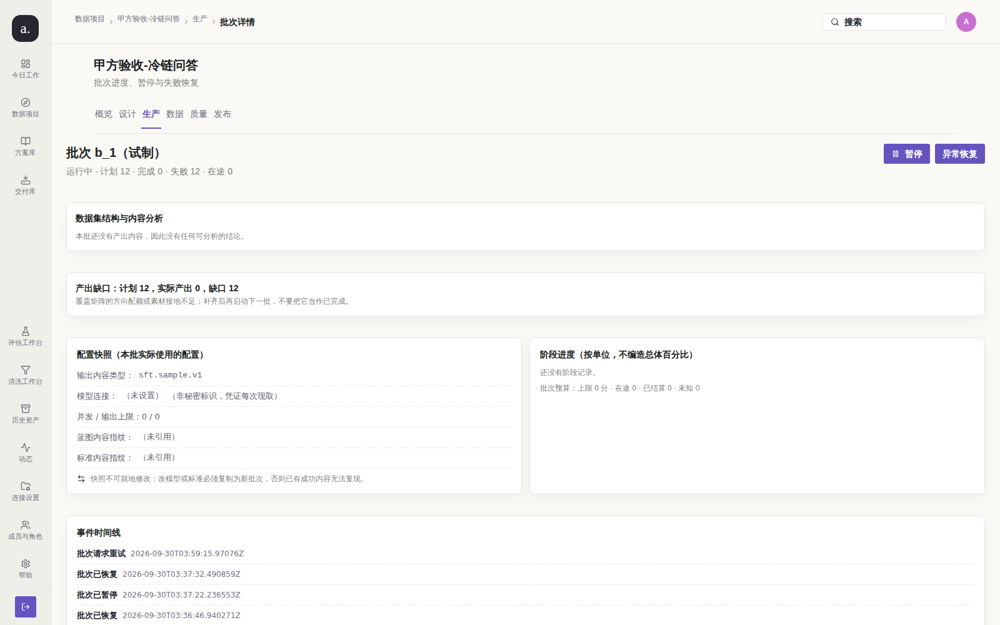
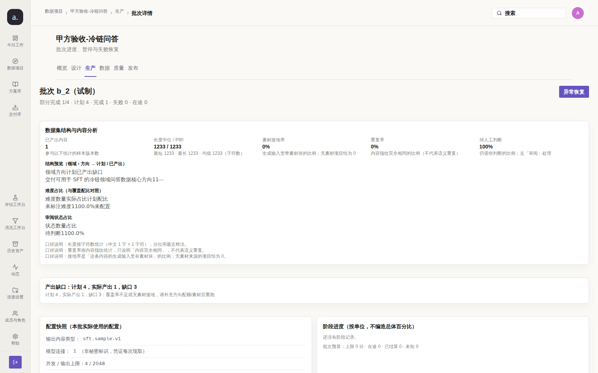
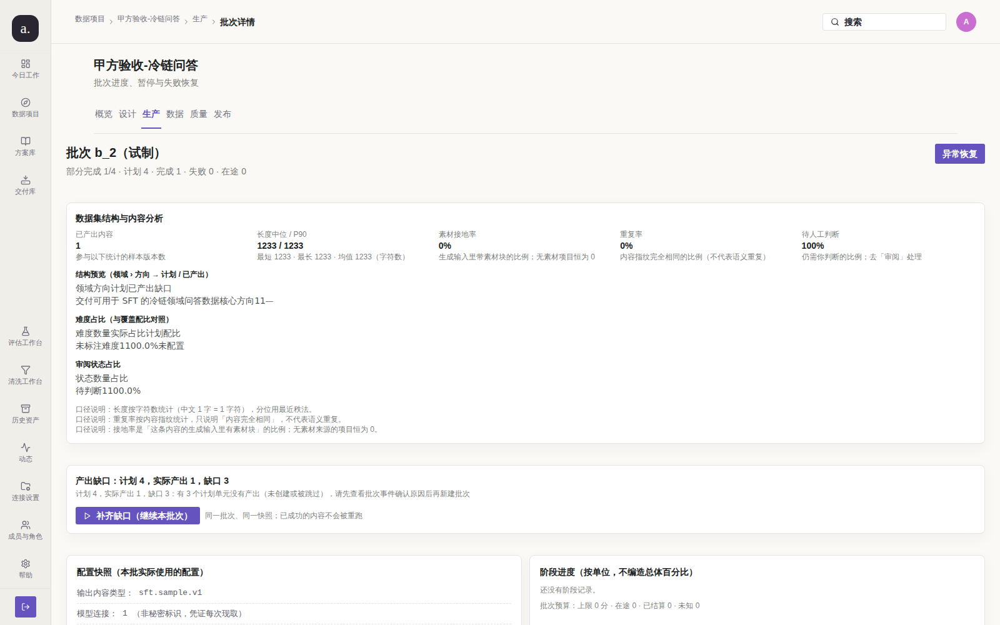

# #214 子项 #201 / #202 / #208：批次状态机「不收敛」与缺口文案误导（第 3 轮）

> 代码基线 `origin/main` @ `f615353`；验证环境 真实容器栈 `127.0.0.1:3210` + 真实 Chromium 1600×1000。
> 采集脚本：`test/audit/issue-214-batch-state/repro.mjs`（可重跑，`--phase before|after`）。

## 0. 为什么三条一起修

#201 / #202 / #208 的**根因是同一个**：`internal/store/batch_store.go` 的状态聚合
把「已经写进库里的状态」当作不可变事实，而不是每次从 `batch_items` 的事实重新推导。

| 子项 | 表面症状 | 同一根因的具体形态 |
| --- | --- | --- |
| #201 | b_2「已完成」但只产出 1/4，且无任何可点按钮 | 聚合在 `status == completed` 时**提前返回**，缺口永不纠正 |
| #202 | b_1「运行中」但 12/12 失败、无在途作业、无对应 job | 无收敛分支；`resume` 只改状态不派作业 |
| #208 | 缺口文案写死「覆盖率不足」，与真因（缺模型连接）矛盾 | 缺口原因不从失败事实推导 |

只修其中一条会让另外两条以同一形态复发 —— 这正是 #191 反复复现的教训，因此按**缺陷类**处理。

## 1. 复现（修复前）

### 1.1 #202：运行的僵尸批次

`/p/1/runs/b_1`：状态「运行中」，`completedUnits=0 / failedUnits=12 / inFlightUnits=0`，
`capabilities = {canPause:true, canResume:false, canRetryFailed:false}`，且 `jobs` 表没有它的作业。



实测读数（`before-batch-state.json`）：

```json
{"status": "running", "completedUnits": 0, "failedUnits": 12, "inFlightUnits": 0,
 "shortfallNote": "", "capabilities": {"canPause": true, "canResume": false, "canRetryFailed": false}}
```

**并且修复前的 worker 不会自愈**：把状态置回该形态后等 40 秒，读数完全不变
（`running / 0 / 12`），证明没有收敛路径。

### 1.2 #201：已完成却只产出一部分

`/p/1/runs/b_2`：状态「已完成」，`plannedUnits=4 / completedUnits=1`，缺口 3，
**可点按钮只有「异常恢复」** —— 既不能恢复（失败 0 条），也没有任何补齐入口。



```json
{"status": "completed", "plannedUnits": 4, "completedUnits": 1, "shortfallUnits": 3,
 "shortfallNote": "计划 4，实际产出 1，缺口 3：覆盖率不足或无素材接地，请补充方向配额/素材后重跑",
 "capabilities": {"canPause": false, "canResume": false, "canRetryFailed": false}}
```

### 1.3 #208：缺口文案与真因矛盾

同一页面上两条说明互相冲突：

| 位置 | 文案 |
| --- | --- |
| 缺口横幅 | 「覆盖率不足或无素材接地，请补充方向配额/素材后重跑」 |
| 异常恢复页 | 「生成配置有问题，请打开项目设计页的"生成"节点**选择模型连接**并保存新蓝图后，再新建批次」 |

`batch_items.error_message` 的 12 行全部是 `missing model connection`，
即真因是**缺模型连接**，与覆盖率/配额无关。照着缺口文案去改配额是无效操作。

## 2. 根因与改动

| 文件 | 改动 | 目的 |
| --- | --- | --- |
| `internal/store/batch_store.go` | 状态聚合重写为**从事实推导的不动点**：只有「无活作业且无在途单元」时才判终态，且 `completed` 也必须复核缺口 | #201 / #202 |
| 同上 | `resume` 在同一事务内**派发新作业**（`enqueueBatchGenerateTx`）；无待办工作时不再声明 running | #202(a) |
| 同上 | `retry-failed` 重置 0 项时**不改状态**（旧实现无条件置 running） | #202(b) |
| 同上 | 新增 `ListDivergentBatchIDs`，把「状态与事实不符」变成可扫描事实 | #201 / #202 的**可达性** |
| 同上 | 状态被纠正时写一条带 `correctionOf` 的 `BatchPartialFailed` 事件 | #201（时间线必须能解释） |
| `internal/model/batch.go` | `ShortfallNote` 从失败事实推导原因，`ErrorClassAction` 作为单一文案来源 | #208 |
| `apps/worker/studio_jobs.go` | 维护循环每 30 秒重算不一致批次 | #201 / #202 的**收敛路径** |
| `apps/web-user/src/studio/pages/RunPages.tsx` | 缺口卡显示服务端原因 + 新增「补齐缺口（继续本批次）」按钮 | #201 的出口 + #208 |
| `test/l15_issue197_remediation.mjs` | 冻结守卫改为断言新不变式（含 2 条新变异自证） | 防回归 |

### 关键设计取舍

1. **终态推导必须要求「无活作业」**。否则一个刚被派发、runner 还没建单元的**正在跑**的
   批次会被抢先判死。这是本函数最危险的误判方向。
2. **推导必须是幂等不动点**。第一版实现漏了这一条（`completed` 且零单元时会在
   `completed`/`partial_failed` 之间来回跳），被 `TestListDivergentBatchIDsFindsStaleStates`
   抓出 —— 那会让维护循环每 30 秒改一次状态而永不收敛。
3. **入队必须与状态变更同事务**。分两次写会留下「状态回运行但作业丢了」的半成品，
   而那正是 #202 的形态。
4. **只修 `resume` 不够，必须有收敛路径**。`RefreshBatchCounts` 此前只有两个调用点
   （runner 跑完、控制命令），一个已经跑完的历史批次**永远走不到它** ——
   没有 `ListDivergentBatchIDs` + 维护循环，本次修复只对未来的批次有效。

## 3. 验证（修复后）

同条件重跑（同账号、同视口、同脚本）：




| 批次 | 修复前 | 修复后 |
| --- | --- | --- |
| b_1 | `running`，可点按钮 `[暂停, 异常恢复]` | `partial_failed`，可点按钮 `[恢复失败项, 异常恢复, 补齐缺口]` |
| b_2 | `completed`，可点按钮 `[异常恢复]` | `partial_failed`，可点按钮 `[异常恢复, 补齐缺口]` |

**两类收敛都是 worker 维护循环自动完成的**（无需人工点按钮）：部署含修复的 worker 后，
两条批次在首个维护轮次内被纠正，且时间线留下可解释的记录：

```json
{"eventType": "BatchPartialFailed", "detail": {
  "previous": "completed", "correctionOf": "completed",
  "planned": 4, "completed": 1, "shortfall": 3, "failed": 0,
  "reason": "状态与单元事实不符：计划量未被产出，已从终态修正为部分完成"}}
```

缺口文案改为与真因一致（#208 消失）：

```text
修复前：计划 4，实际产出 1，缺口 3：覆盖率不足或无素材接地，请补充方向配额/素材后重跑
修复后：计划 4，实际产出 1，缺口 3：有 3 个计划单元没有产出（未创建或被跳过），请先查看批次事件确认原因后再新建批次

修复前（b_1）：（无文案）
修复后（b_1）：计划 12，实际产出 0，缺口 12：生成配置有问题，请打开项目设计页的“生成”节点选择模型连接并保存新蓝图后，再新建批次
```

最后一句与「异常恢复」页的 `suggestedAction` **逐字一致** —— 两处不再各说一套。

## 4. 门禁结果

```text
gofmt: clean        go vet: clean        go build: ok
go test: ok（新增 4 条真实 Postgres 用例，覆盖正常 + 边界路径）
scripts/go-test-postgres.sh sh scripts/check-integration-tests.sh: PASS=1154 SKIP=2（必需 0 项缺失）
npm run build: 通过（tsc + vite build）
node test/l15_*.mjs（23 个冻结守卫）: 全部通过
node scripts/check-docs.mjs: 通过
evidence-check（两组前后对比图）: EVIDENCE OK
```

新增测试（`internal/store/batch_store_test.go`，均连真实 Postgres）：

| 用例 | 覆盖 |
| --- | --- |
| `TestRefreshBatchCountsCorrectsStaleCompletedWithShortfall` | #201：历史终态被纠正 + 时间线留痕 + 无缺口不被改写（边界） |
| `TestRefreshBatchCountsConvergesZombieRunningBatch` | #202：全部失败 + 无在途 → 不得留在 running；原因来自失败分布 |
| `TestResumeBatchEnqueuesJobWithoutClaimingZombie` | #202(a)：无待办**不派**作业；有缺口**恰好派一个**且指向本批次 |
| `TestListDivergentBatchIDsFindsStaleStates` | #201/#202 可达性 + **收敛后不再被扫出**（防维护循环空转） |

## 5. 未收口 / 残留风险

| 项 | 状态 | 说明 |
| --- | --- | --- |
| #200 / #203 / #204 / #205 / #207 / #210 / #211 / #213 | ✅ 已在此前轮次收口 | 本 issue 累计 10/14 条 |
| **#209**（6 条空模型连接混进下拉） | ❌ **本轮未做** | 需改连接保存的校验层 + 展示层 + 历史数据；未在预算内 |
| **#212**（阶段进度恒空） | ❌ **本轮未做** | 需在 runner 写 `batch_steps`（或移除该区块）；未在预算内 |
| **#201 的「补齐缺口」真实跑通** | ⚠️ **未端到端验证** | 本机模型连接可用，点它会真实调用外部 provider 并产生费用。已验证到「恰好派出一个指向本批次的 pending 作业」（单测）与「按钮可点」，**未**实跑整批 —— 那会真实花钱，且不符合无人值守轮次该做的动作。 |

**残留风险**：

1. **维护循环的收敛是「下一轮」而非「立即」**。用户打开一个状态陈旧的历史批次时，
   可能仍看到旧状态最多 30 秒（一个维护周期）。这是有意的取舍：把重算放在读路径
   会让每次 `GetBatch` 都多一次聚合查询。
2. **`ListDivergentBatchIDs` 只按计数列判定**，因此「计划 4、已写入 4 行但其中 3 行是
   skipped」这类形态依赖 `RefreshBatchCounts` 的聚合分支处理；若未来新增跳过语义，
   需要同步复核该 SQL。
3. **`resume` 现在允许 `partial_failed` 批次进入**（补齐缺口）。这是一个**行为扩展**：
   以前只有 `paused`/`pause_requested` 能 resume。扩展是 #201 的建议修复方向之一
   （「至少给『补齐缺失单元』入口」），但它确实放宽了状态机 —— 若甲方认为缺口应
   一律「新建批次」而不允许原批次补齐，需要产品决策回退。
4. 本分支未合并，截图链接为未合并分支路径；合并前请勿删除该分支。

## 6. 复现

```bash
cd /root/llm
docker compose up -d --build
node test/audit/issue-214-batch-state/repro.mjs --phase before   # 需先构造历史形态（见 §1）
node test/audit/issue-214-batch-state/repro.mjs --phase after
```
