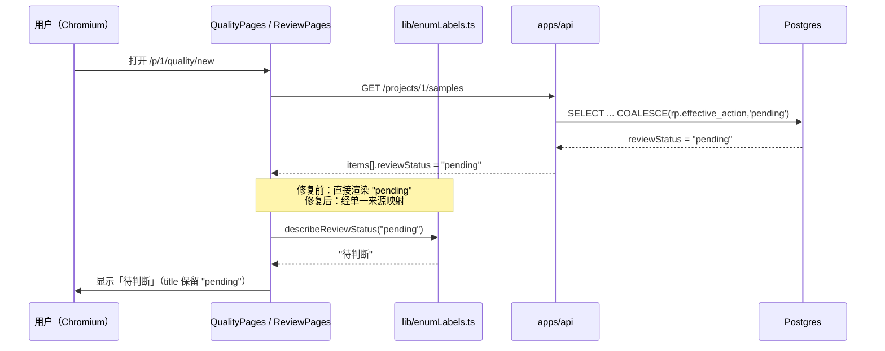
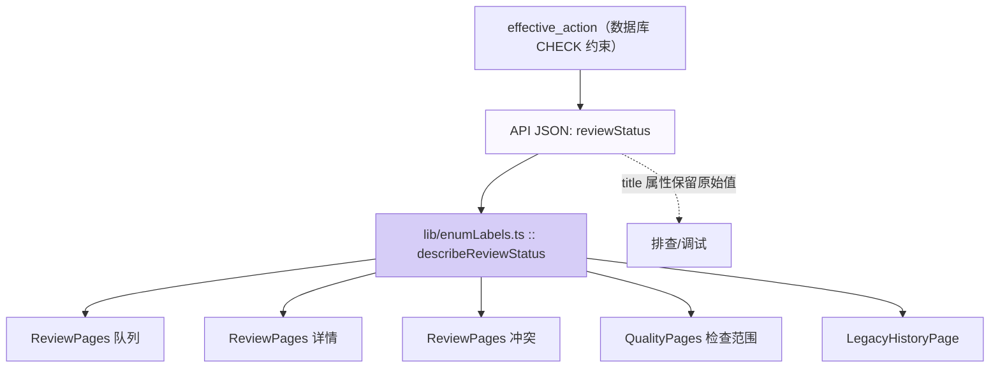

# #214 第二轮自动修复：已修复项证据包

> 本文件是 Issue [#214](https://github.com/1420970597/llm/issues/214)
> （2026-09-28 第二轮全量使用测试，14 条确认缺陷）的**第 1 轮自动修复证据**。
> 所有截图均由真实 Chromium 在真实容器栈上采集，非设计稿、非 mock。
>
> 采集时间：2026-09-28 · 账号 `admin@company.com` · 视口 `1600×1000`

## 1. 本轮修复的条目

| 子单 | 一句话 | 状态 | 证据 |
| --- | --- | --- | --- |
| #211 | 新建质量实验「检查范围」漏出英文枚举 `pending`/`accepted`，且未说明未审阅内容能否纳入评测 | ✅ 已修复 | `01-211-before.png` / `02-211-after.png` |
| #206 | 批次详情「事件时间线」漏出内部英文事件键（`BatchResumed` 等） | ✅ 已修复 | 结构守卫 + Go 单测（见 §4） |

其余 12 条子单（#200–#205、#207–#210、#212、#213）**本轮未处理**，见 §5。

## 2. #211 复现与修复

### 复现（修复前）

`/p/1/quality/new` 的「检查范围（冻结为「被评测数据集」）」表格：

| 内容版本 | 审阅状态（修复前） |
| --- | --- |
| 方向二（难度 normal）：第 2 题 · v2（版本 ID 9） | `pending` |
| 方向二（难度 normal）：第 1 题 · v2（版本 ID 8） | `accepted` |
| 方向一（难度 normal）：第 2 题 · v2（版本 ID 7） | `pending` |
| 方向一（难度 normal）：第 1 题 · v3（版本 ID 6） | `pending` |

机器判定：`visibleEnumKeys = ["pending","accepted","pending","pending"]` —— **缺陷成立**。

### 根因

`QualityPages.tsx:451` 直接渲染 `sample.reviewStatus`，从未经过任何映射。
而 `ReviewPages.tsx` 另有一份本地 `REVIEW_STATUS_LABEL`，兜底是 `?? sample.reviewStatus`
（未知值同样漏出内部枚举）。**同一个 `effective_action` 存在两套写法，且都能漏。**

### 改动

1. `apps/web-user/src/lib/enumLabels.ts` 新增**单一来源**：
   - `REVIEW_EFFECTIVE_ACTION_LABELS`（待判断 / 已接纳 / 已隔离 / 存在冲突）
   - `describeReviewStatus()` —— 契约「**永不返回原始枚举**」，未知值落「结论未知」
   - `reviewStatusColor()` —— 颜色与文案同表，避免两处各自演化
   - `unreviewedScopeNotice()` —— 直接产出「未审阅内容能否纳入评测」的说明文案
2. `QualityPages.tsx` 的审阅状态列接入上述函数，并新增未审阅提示（含计数）；
3. `ReviewPages.tsx` 删除本地表，四处渲染点统一改用同一来源；原始值移入 `title`。

### 数据流



### 验证（修复后）

同条件重跑（同账号、同视口、同路由）：

```json
{
  "statusCells": [
    {"text": "待判断", "title": "pending"},
    {"text": "已接纳", "title": "accepted"},
    {"text": "待判断", "title": "pending"},
    {"text": "待判断", "title": "pending"}
  ],
  "visibleEnumKeys": []
}
```

`visibleEnumKeys` 为空 —— **缺陷消失**。页面同时出现：

> 其中 3 个内容版本尚未人工判断。评测可以纳入它们（评测只是度量），
> 但未审阅内容的结论不作为发布证据，发布时仍会被门槛拦截。

（这回答了 #211 的第 2 项要求：未审阅内容**可以**纳入评测，但结论**不作为发布证据**。）

## 3. 状态机：审阅状态文案的收敛方向



**为什么要画这张图**：#211 的成因不是「某处忘了翻译」，而是**同一个取值域有多个渲染点、
每个渲染点各自处理**。#191 已经证明「修一处漏一处」会反复复现（动作列修了、资源列漏；
动态修了、时间线漏）。因此本轮的修法是**把渲染点收敛到一个函数**，并让守卫断言不存在
`?? reviewStatus` 这类原始值回退。

## 4. #206 的验证方式（结构 + 单测，非截图）

#206 的修复引入了一个**跨层**改动（服务端下发 `eventTypeLabel`），因此验证以
结构守卫与 Go 单测为主：

```text
[PASS] #206 批次事件时间线不再漏出内部事件键: 结构断言通过
[PASS] 变异：#206 让时间线退回原样渲染 eventType -> 断言必须报错: 捕获到 2 个问题
[PASS] 变异：#206 删掉服务端下发的文案字段 -> 断言必须报错: 捕获到 1 个问题

go test ./internal/store/ -run 'TestDescribeBatchEvent|TestBatchEventLabels'
--- PASS: TestDescribeBatchEventNeverLeaksRawCode
--- PASS: TestBatchEventLabelsCoverModelConstants
```

`TestBatchEventLabelsCoverModelConstants` 从 `internal/model/batch.go` **提取常量后比对**，
因此「后端新增事件类型、忘了补文案」会直接让 `go test` 失败 —— 而不是等甲方再发现一次。

## 5. 未收口的 12 条子单（如实列出）

| 子单 | 严重度 | 一句话 | 状态 |
| --- | --- | --- | --- |
| #200 | 🔴 | 今日工作「待人工判断」恒为 0，与审阅队列矛盾 | 未处理（本轮已定位根因：`activity_store.go:246` 只数投影行） |
| #201 | 🔴 | 批次已完成却只产出 1/4 且无恢复入口 | 未处理 |
| #202 | 🔴 | 批次「运行中」但全部单元失败——resume 不重新入队 | 未处理 |
| #203 | 🟠 | 冻结发布范围把未审阅内容当「已接纳」 | 未处理 |
| #204 | 🟠 | 蓝图画布 7 个节点中 4 个点击命中右栏 | 未处理 |
| #205 | 🟠 | 今日工作 6 个磁贴中 3 个指向 `/today` 自身 | 未处理 |
| #206 | 🟡 | 批次详情时间线漏出英文事件键 | ✅ **本轮修复** |
| #207 | 🟡 | 帮助页承诺的 J/K 快捷键未实现 | 未处理 |
| #208 | 🟡 | 批次缺口文案与真实原因矛盾 | 未处理 |
| #209 | 🟡 | 6 条空模型连接混进下拉 | 未处理 |
| #210 | 🔵 | 动态列表 19 条审计事件「查看」全部指向概览 | 未处理 |
| #211 | 🟡 | 质量实验检查范围漏出英文枚举 | ✅ **本轮修复** |
| #212 | 🔵 | 批次详情「阶段进度」恒为空 | 未处理 |
| #213 | 🔵 | 交付映射「必填」复选框无可访问名 | 未处理 |

> 本轮修复 2 条、定位根因 1 条（#200）。剩余条目按迭代优先在后续轮次处理；
> 每轮最多 3 条 issue 的预算约束见 SOP §2。

## 6. 复现脚本

```bash
cd /root/llm
docker compose up -d --build
node docs/audit/issue-214/repro-211.mjs before   # 期望 exit 2（有英文枚举）
node docs/audit/issue-214/repro-211.mjs after    # 期望 exit 0（无英文枚举）
```
