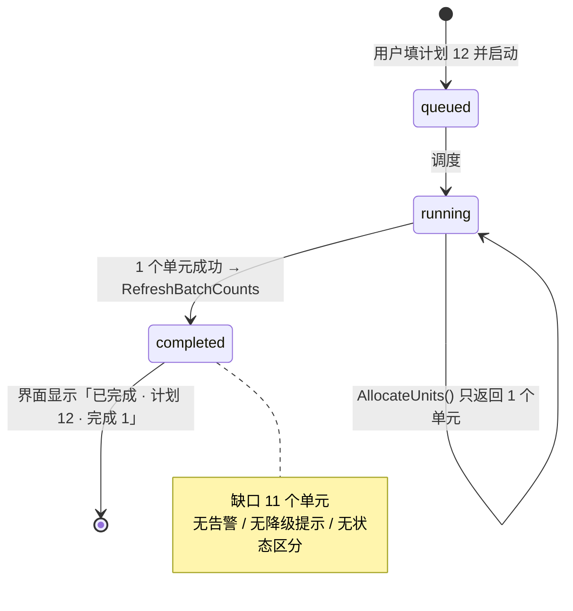
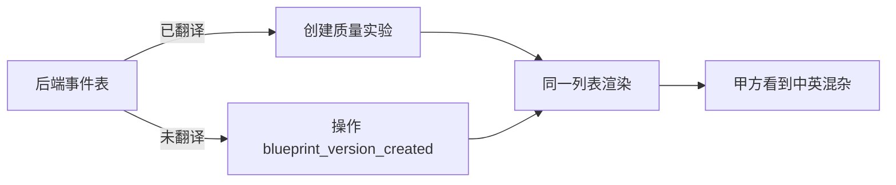
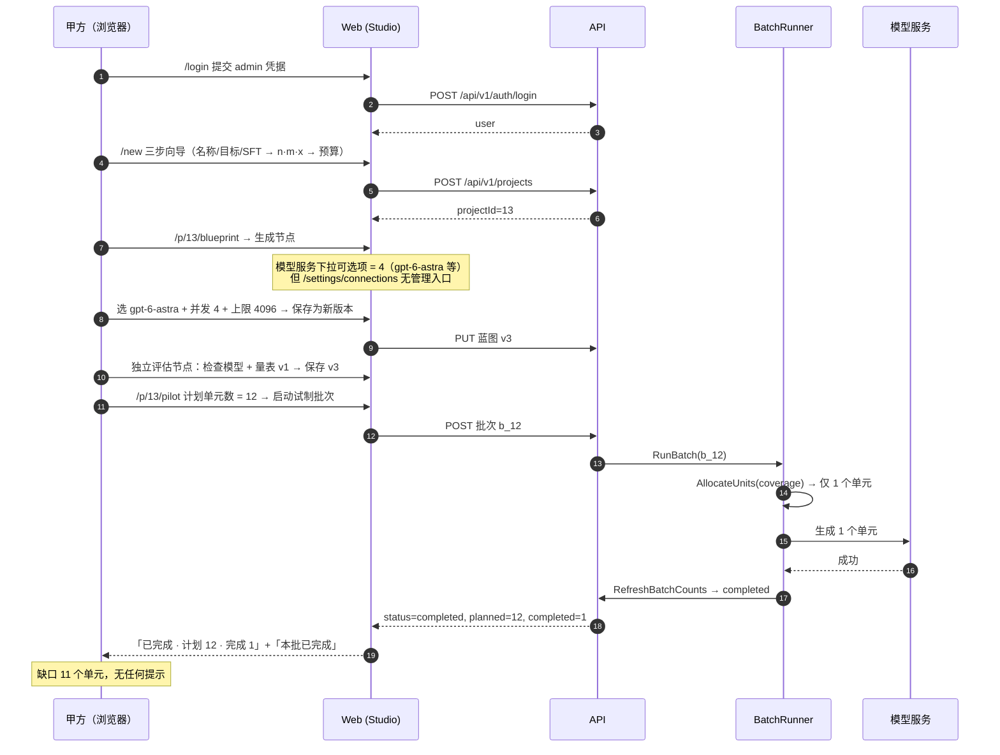

# 第二轮甲方验收审计报告（远程部署实测）

- **审计对象**：远程验收环境（地址脱敏为 `<AUDIT_HOST>`）
- **审计方式**：真实浏览器（Chromium）+ 逐张人工读图 + 真实业务链路点击
- **审计角色**：甲方（严格、不客气、只看结论）
- **证据**：本目录下 19 张截图 + `capture.json`（已脱敏，不含主机地址）

---

## 0. 结论先行（甲方判词）

| 维度 | 判定 | 说明 |
| --- | --- | --- |
| 功能可用性 | 🔴 **不合格** | 核心链路虽已打通，但「已完成」批次只产出 1/12 单元却不报警 |
| 视觉效果 | 🟠 **勉强** | 多处未渲染的 Markdown 星号直接漏给用户 |
| 业务流程 | 🔴 **不合格** | 计划量与覆盖配额冲突时，系统静默少产出并宣告成功 |
| 废话信息 | 🔴 **不合格** | 动态列表、清洗工作台直接漏出内部英文枚举 |
| 控件缺失 | 🟠 **有隐患** | 连接设置无任何新增/编辑入口（main 已修，部署未含） |
| 表达易懂性 | 🟠 **部分不合格** | 交付映射无列头、覆盖矩阵第 4 个输入框无标签 |
| 跳转合理性 | 🟠 **部分不合格** | 数据 / 审阅队列 两个菜单渲染出几乎同一页面 |
| 布局合理性 | 🟡 **可接受** | 首屏信息密度尚可，但移动端表格布局崩坏 |

**与第一轮对比**：第一轮报告的 4 个 P0 中，`#168`（模型连接）在 **main 已被 #179 修复，但本次部署未包含该修复**；`#169/#170` 在本轮未复现。

---

## 1. 本轮最重要的新发现（P0）

### 1.1 批次「已完成」但只产出 1/12，且不告警

在 `/p/13/pilot` 填入 **计划单元数 = 12** 并启动，系统接受并跑批。结果：

```text
批次 b_12（试制）
已完成 · 计划 12 · 完成 1 · 失败 0 · 在途 0
本批已完成
```

接口原始数据（`GET /api/v1/projects/13/batches?limit=50`）：

```json
{
  "resourceId": "b_12",
  "purpose": "pilot",
  "status": "completed",
  "plannedUnits": 12,
  "completedUnits": 1,
  "failedUnits": 0,
  "inFlightUnits": 0
}
```

**根因（代码级）**：`internal/studio/batch_runner.go` 的 `AllocateUnits()` 按覆盖矩阵的领域/方向配额展开单元，本项目的覆盖配置为 1 领域 × 1 方向 × 配额 1，因此只能产出 **1** 个单元；但 `batch.PlannedUnits` 被写为 12 且从未回写为实际分配数。批处理结束后 `RefreshBatchCounts` + `BatchEventCompleted` 直接把状态置为 `completed`。

**甲方视角的问题**：
1. 系统在用户填 12 时**本应校验**「覆盖矩阵最多只能产出 1 个单元」，或者自动把计划量收敛为 1；
2. 跑完只有 1 条产出，界面显示**「本批已完成」**且无任何缺口提示，属于**静默少交付**；
3. 用户据此判断「方案已验证」，会在扩量时得到完全错误的结论。

证据：`evidence-runs.png`、`evidence-batch-detail.png`。



---

## 2. 废话信息 / 内部实现泄漏（P1）

### 2.1 动态列表直接漏出内部英文事件键

`/activity` 中，同一份列表里**部分行是中文**、**部分行是英文内部键**：

| 行内容 | 是否可读 |
| --- | --- |
| 创建质量实验 | ✅ |
| 创建批次 | ✅ |
| 批次已排队（批次 9） | ✅ |
| 操作 `blueprint_version_created` | ❌ 内部键 |
| 操作 `mapping_version_created` | ❌ 内部键 |
| 操作 `quality_policy_version_created` | ❌ 内部键 |
| 操作 `standard_version_created` | ❌ 内部键 |
| 操作 `coverage_version_created` | ❌ 内部键 |

同一缺陷在 `/console/operations`（旧控制台操作记录）与 `/console/admin/audit` 中重复出现。
证据：`08-activity.png`、`42-legacy-console-operations.png`。



### 2.2 清洗工作台 / 历史资产漏出内部状态枚举

| 页面 | 泄漏位置 | 值 |
| --- | --- | --- |
| `/tools/cleaning` | 当前查看的任务 → 任务状态 | `directions_completed` |
| `/legacy/history` | 数据集卡片 → 状态 | `directions_completed` |

一个中文界面把 `directions_completed` 当作「状态」显示给用户，属于典型的内部枚举未做展示层映射。
证据：`10-tools-cleaning.png`、`11-legacy-history.png`。

---

## 3. 未渲染的 Markdown 源码（P1，较第一轮扩大）

界面直接显示 `**双星号**`，说明文案写进了 Markdown 语法但渲染层未解析。本轮在**部署版本**上共发现 **5 个页面 6 处**（第一轮报告仅 4 处）：

| # | 路由 | 原样显示的文本 |
| --- | --- | --- |
| 1 | `/new/coverage` | 计划问题数：1（= n × m × x，`**计划量**`，不是当前已产出） |
| 2 | `/p/13/compare` | 比较的是`**相同输入下**`两个方案的输出；不是拿两个任意批次的百分比相减。 |
| 3 | `/p/13/data` | 按审阅状态与关键词在`**服务端**`筛选与分页；按钮上的数量是服务端统计，不是当前页条目数。 |
| 4 | `/p/13/review` | 同上 |
| 5 | `/p/13/quality` | 报告的分母是实验创建时`**冻结**`的样本版本数；待审阅不算接纳，隔离也不缩小分母。 |

证据：`06-new-step2.png`、`30-p-compare.png`、`31-p-data.png`、`32-p-review.png`、`33-p-quality.png`。

---

## 4. 控件缺失 / 表达不清（P1）

### 4.1 连接设置没有任何管理入口（部署版本）

`/settings/connections` 页面 DOM 统计：

```text
input / select / textarea 数量 = 0
可见按钮 = [搜索, A]（只有顶栏搜索与头像）
```

即：用户能看到 4 个模型连接与 2 个存储，但**无法新增、无法编辑、无法删除**。

> ⚠️ 重要说明：该问题在 `origin/main` 上已被 **#179 (`fix(TASK-168): expose model connection management entry`)** 修复（在连接设置页加了「管理模型连接 / 新增或编辑」按钮）。
> **本次审计的部署版本未包含该提交**，因此实测仍然缺失。参见 `15-help.png` 的构建信息：`版本 unknown`。

### 4.2 交付映射没有列头，两个相同值无法区分

`/p/13/releases/new` 的字段映射区域：

```text
[question      ]  [question      ]  [✓ 必填]  [🗑]
[reasoning     ]  [reasoning     ]  [✓ 必填]  [🗑]
[answer        ]  [answer        ]  [✓ 必填]  [🗑]
```

左右两列的输入框**都没有表头**，用户无法判断哪一列是「内部字段」、哪一列是「交付字段」。

### 4.3 覆盖矩阵第 4 个输入框没有标签

`/p/13/coverage` 的「方向与配额」行有 4 个输入框：

```text
[核心方向      ] [direction-1   ] [1 ] [project-default ] [🗑]
 ↑方向名(有标签)  ↑稳定ID(有标签) ↑配额  ↑无标签
```

前两个有 `方向名称 / 稳定 ID` 标签，第 3 个（配额）只有数字没有标签，**第 4 个 `project-default` 完全没有标签**，用户无从知道它是什么。

### 4.4 评估工作台加载态文字竖排

`/tools/evaluation` 首屏加载时，Spin 的提示文案「正在加载数据项目」在窄容器内**逐字竖排**，形成一条竖线状的文字。证据：`09-tools-evaluation.png`。

---

## 5. 跳转与信息架构合理性（P2）

### 5.1 「数据」与「审阅队列」渲染几乎同一页面

| 路由 | 标题 | 描述文案 | 主操作按钮 | 列表内容 |
| --- | --- | --- | --- | --- |
| `/p/13/data` | 样本工作区 | 按审阅状态与关键词在`**服务端**`筛选与分页… | 按当前筛选冻结并准备发布（服务端解析） | 完全相同 |
| `/p/13/review` | 审阅队列 | 按审阅状态与关键词在`**服务端**`筛选与分页… | 按当前筛选冻结并准备发布（服务端解析） | 完全相同 |

两个菜单项（`project.data` 与 `project.review`，后者 `navParent` 指向前者）进入后是**同一张表、同一段描述、同一个 CTA**。甲方视角：这是两个页面还是一个页面？为什么要占两个入口？

证据：`31-p-data.png`、`32-p-review.png`。

### 5.2 旧控制台深链全部跳转（需确认是否为预期）

`/console/*` 系列全部重定向到新工作区页面：

| 请求 | 实际落地 |
| --- | --- |
| `/console/home` | `/today` |
| `/console/planning` | `/new` |
| `/console/tasks` | `/projects` |
| `/console/results` | `/deliveries` |
| `/console/operations` | `/activity` |
| `/console/admin/providers` | `/settings/connections` |
| `/console/admin/storage` | `/settings/connections` |
| `/console/admin/strategies` | `/recipes` |
| `/console/admin/prompts` | `/recipes` |
| `/console/admin/audit` | `/activity` |

代码核对：`origin/main` 的 `App.tsx` 确实保留了 `/console/*` 路由（含 admin providers/storage/strategies/prompts/audit 的 `renderProviders()` 等），但在 Atelier 主线下 `/console` 外壳被 `studioRouteTree` 接管。**这属于迁移期设计**，但如果管理员仍按旧习惯访问 `/console/admin/providers`，会被静默送到一个**没有管理入口**的连接设置页——与 4.1 叠加后形成死路。

---

## 6. 布局与响应式（P2）

### 6.1 移动端连接设置表格崩坏

390px 宽度下，`/settings/connections` 的表格被压成两列，表头「名称 / 模型 / 类型 / 密钥标识 / 状态」与数据行**错位混合**，无法阅读。证据：`53-m-settings.png`。

### 6.2 蓝图右栏「当前引用配置」文字与按钮重叠

`/p/13/blueprint` 右栏的「当前引用配置」卡片中，版本名 `v1 · 项目创建：初始化 Atelier 配置` 换行后与「查看模型连接」按钮**在视觉上重叠**。证据：`24-p-blueprint.png`。

---

## 7. 第一轮问题的回归核查

| 编号 | 状态 | 本轮实测证据 |
| --- | --- | --- |
| #168 模型连接必填无控件 | **main 已修（#179），部署未包含** | `/settings/connections` 输入控件数 = 0；蓝图「生成」节点模型服务下拉虽有选项，但连接管理入口缺失 |
| #169 批次失败提示指向不存在控件 | 未复现 | 本轮试制批次成功，未产生失败路径 |
| #170 首屏被能力覆盖表占据 | **未复现（已改善）** | `/p/13/overview`、`/p/13/blueprint` 首屏为主内容 |
| #171 Markdown `**` 泄漏 | **仍存在，且扩大到 5 页 6 处** | 见第 3 节 |
| #172 方案库空状态指向不存在按钮 | **仍存在** | `/recipes`：还没有方案。方案由已经跑通的项目保存而来（设计页 → 保存为方案）。页面无任何相关按钮 |
| #173 单批失败产生 12 条重复动态 | 未复现（本轮无失败批次） | `/activity` 事件数 16，未观察到失败放大 |
| #174 无 404，未知路由跳首页 | **仍存在** | `/this-page-does-not-exist` → 落地 `/today`（标题与按钮签名与 `/today` 完全一致） |
| #175 未注入 GIT_SHA | **仍存在** | `/help` 构建信息：`未注入构建版本（构建时未传入 GIT_SHA，无法自证与源码的对应关系）· 版本 unknown` |
| #176 要求手填内部主键 ID | **仍存在** | `/p/13/quality/new`：裁判连接 ID = 裸数字输入框，占位符「例如 5」 |
| #177 一致性缺陷汇总 | 部分仍存在 | 移动端字号、CTA 语义等未逐项复测 |

---

## 8. 全链路时序（本轮实测）



---

## 9. 交付清单

| 文件 | 说明 |
| --- | --- |
| `capture.json` | 51 个路由的 DOM 快照（已脱敏：`base` 为占位符，`finalUrl` 只保留路由路径） |
| `01-today.png` | 今日工作 |
| `06-new-step2.png` | 新建向导第 2 步（`**计划量**` 泄漏） |
| `08-activity.png` | 动态（英文事件键泄漏） |
| `09-tools-evaluation.png` | 评估工作台（加载态文字竖排） |
| `10-tools-cleaning.png` | 清洗工作台（`directions_completed` 泄漏） |
| `11-legacy-history.png` | 历史资产（`directions_completed` 泄漏） |
| `12-settings-connections.png` | 连接设置（无管理入口） |
| `15-help.png` | 帮助（版本 unknown） |
| `24-p-blueprint.png` | 生产蓝图（右栏重叠） |
| `25-p-coverage.png` | 覆盖矩阵（第 4 输入框无标签） |
| `30-p-compare.png` | 试制对比（`**相同输入下**` 泄漏） |
| `31-p-data.png` | 样本工作区（`**服务端**` 泄漏） |
| `32-p-review.png` | 审阅队列（与样本工作区同页） |
| `33-p-quality.png` | 质量实验室（`**冻结**` 泄漏） |
| `37-p-release-new.png` | 准备发布（字段映射无列头） |
| `42-legacy-console-operations.png` | 旧控制台操作记录（英文事件键泄漏） |
| `53-m-settings.png` | 移动端连接设置（表格崩坏） |
| `evidence-runs.png` | 生产批次列表（b_12 已完成的 1/12） |
| `evidence-batch-detail.png` | 批次详情（1/12 已完成 + BatchCompleted 事件） |

---

## 10. 甲方要求（按优先级）

1. **P0**：修复「计划单元数 > 覆盖矩阵可产出单元数」时的静默少交付。要么在保存覆盖时校准、要么在启动批次前校验并拒绝、要么在批次详情明确展示缺口并降级状态。
2. **P1**：动态 / 清洗 / 历史资产三处的内部英文枚举做展示层映射。
3. **P1**：修掉 5 个页面的 `**` 未渲染。
4. **P1**：把 `#179` 部署上去，让连接设置真的有「新增/编辑」。
5. **P1**：交付映射补列头；覆盖矩阵第 4 个输入框补标签。
6. **P2**：合并或明确区分「数据」与「审阅队列」。
7. **P2**：移动端表格与蓝图右栏重叠。
