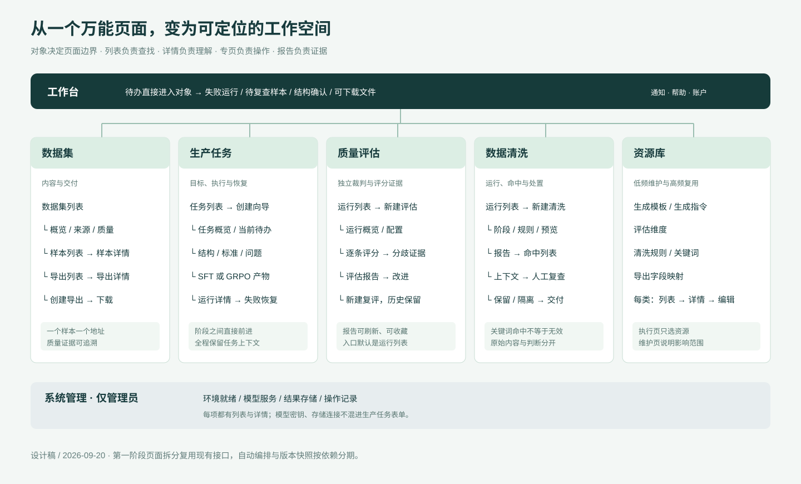
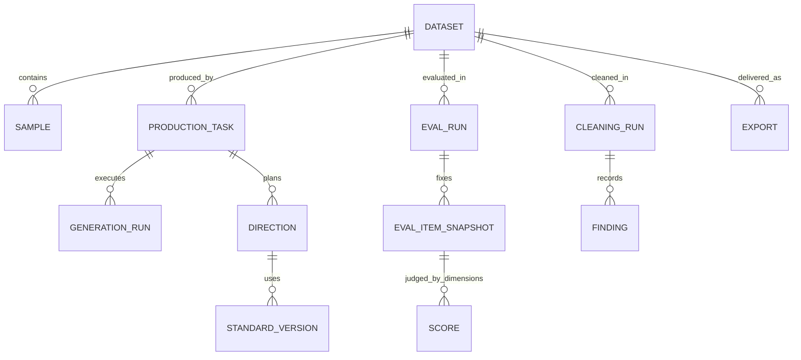
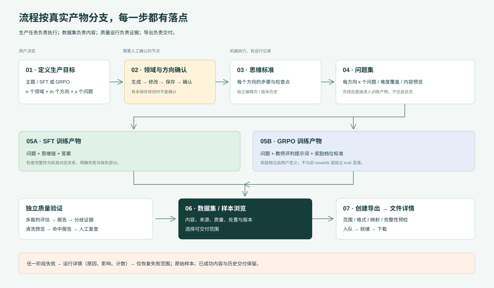
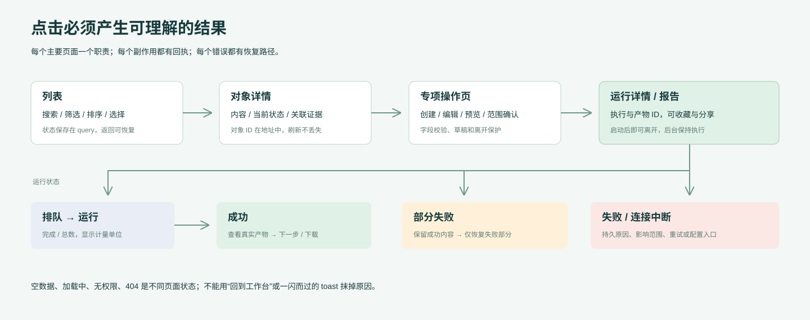

# 产品方案与信息架构

## 1. 最终体验与范围

用户从训练目标开始创建任务；进入任务后总能知道当前对象、当前阶段、实际产出和下一步。数据集用于浏览内容与交付，质量评估和清洗分别管理自己的运行与报告，公共配置在资源库及管理区维护。

此次设计覆盖登录、工作台、通知、账户、帮助，以及生产、数据、评估、清洗、资源、管理全流程。不是一次正式生产代码重写。交互原型使用虚构的仓储调度样例，不连接 API。



### 一层入口只承载一种稳定职责

| 菜单 | 默认落点 | 回答的问题 | 不在此页直接展开的内容 |
|---|---|---|---|
| 工作台 | `/home` | 我现在该处理什么？ | 完整模型配置、全部运行日志 |
| 数据集 | `/datasets` | 我的训练内容在哪里，质量与交付如何？ | 生成阶段的所有操作表单 |
| 生产任务 | `/tasks` | 生产进行到哪，哪里需要恢复？ | 共享维度、全局关键词维护 |
| 质量评估 | `/evaluations` | 哪次评估完成了，结论和证据是什么？ | 默认展示全部维度编辑器 |
| 数据清洗 | `/cleaning` | 哪次清洗命中了什么，如何处置？ | 关键词、规则、导入表单同屏展开 |
| 资源库 | `/resources` | 可复用的模板、规则、指令在哪里？ | 执行记录及跨阶段按钮 |
| 系统管理（管理员） | `/admin` | 环境是否就绪，哪些配置有问题？ | 普通任务的业务决策 |
| 帮助 / 头像 | `/help` / `/account` | 如何使用，当前身份是什么？ | 系统配置混进账户页 |

“新建”是当前列表的主动作，不再占一个一级菜单；一级菜单最多显示当前对象域的一组职责。资源库和系统管理可以有二级列表，但每种资源仍有独立详情、编辑及新增地址。

## 2. 核心对象与 ID 关系



图中是目标产品对象，不代表所有独立表已存在。当前 `Dataset` 同时承担任务与资产属性；第一阶段 `/tasks/:id` 与 `/datasets/:id` 的 id 都映射到现有 dataset ID，不迁移或复制已有数据。第二阶段引入独立生产任务、冻结配置/内容版本后，一份数据集才允许多个补充生产任务。API 路径暂不按 UI 地址强行重命名。

### 术语一一对应

| 产品术语 | 含义 | 与其它对象的区别 |
|---|---|---|
| 数据集 | 可浏览、评估、清洗、交付的样本集合 | 不等同于一次生成运行 |
| 生产任务 | 目标、范围与执行计划 | 包含多个阶段运行 |
| 领域 / 方向 | 一级业务范围 / 领域下的具体方向 | n × m 个方向；不能把两层都叫主题 |
| 思维标准 | 每个方向的长链推理步骤与检查点 | 是生成约束，不是某条样本的真实思维链 |
| SFT 产物 | 问题、思维链、答案 | 服务监督微调 |
| GRPO 产物 | 问题、教师评判提示词、奖励档位标准 | 不是 SFT 答案，也不是评估运行的分数 |
| 多模型评估 | 独立裁判对既定内容的多维评分 | 排除生成者及后端判定的同源模型 |
| 自动评分（历史流程） | 旧 `rewards` 记录 | 保留旧数据入口，不与 GRPO 或独立 eval 合并 |
| 清洗命中 | 文本与规则产生的匹配证据 | 命中不自动代表应删除 |
| 导出 | 某次范围、格式、字段映射对应的交付文件 | 文件可重复生成，每次有独立记录 |

## 3. 页面层级与地址契约

遵循“列表 → 详情 → 子资源 / 编辑 / 运行报告”。所有页面路由以 `/console` 为正式部署前缀；文档和原型省略该前缀便于阅读。原型用 `#/...`，正式 React Router 用路径。

```text
/home
/datasets
  /:datasetId                         概览
  /:datasetId/samples                  样本列表
  /:datasetId/samples/:sampleId         单条内容与追溯
  /:datasetId/exports                  导出列表
  /:datasetId/exports/new              导出配置
  /:datasetId/exports/:exportId         导出结果 / 下载
/tasks
  /new?step=1|2|3                      创建向导
  /:taskId                            总览与待办
  /:taskId/structure                   领域 / 方向确认
  /:taskId/standards                   标准列表
  /:taskId/standards/:directionId       标准编辑 / 历史
  /:taskId/standards/:directionId/versions/:version 只读历史版本
  /:taskId/questions                   问题集
  /:taskId/output                      按训练类型显示产物
  /:taskId/scoring                     旧 rewards 内容承接
  /:taskId/runs                        阶段运行记录
  /:taskId/runs/:runId                  运行错误 / 恢复
/evaluations
  /new                                范围、维度、裁判
  /:runId                             运行概览
  /:runId/scores                       逐条评分
  /:runId/items/:itemId                 评分证据
  /:runId/report                       汇总报告
  /:runId/dimensions/:snapshotKey       运行时维度快照
/cleaning
  /new                                阶段、规则、预览
  /:runId                             清洗报告
  /:runId/findings                     命中列表
  /:runId/findings/:findingId           人工复查
/resources
  /templates|dimensions|rules|keywords|prompts|mappings
    /new                              新建资源
    /:id                              资源详情
    /:id?mode=edit                     编辑模式，可直达
  /keywords/import                    批量导入
/admin
  /providers|storage                  配置列表
    /new | /:id | /:id?mode=edit       新建、详情、编辑
  /audit                              记录列表
  /audit/:id                          变更详情
/notifications  /account  /help  /help/:articleId  /login
```

规则：

1. 所有导航都携带当前对象 ID，服务端再次验证对象存在性与访问权。`taskId` 不等于任意全局选中值。
2. 子资源校验父子关系，例如数据集 24 下访问不属于它的 sampleId 返回明确 404，不渲染其它数据集的内容。
3. 当前筛选、搜索、排序、分页写进 query；浏览器前进/后退恢复。详情“返回列表”保留来时筛选与滚动位置。
4. 面包屑是可点击父级链；页面标题是当前对象。进入任务任何阶段时，一级导航始终高亮生产任务，不随阶段跳到数据集。
5. 页面内导航页签本质是链接，有独立 URL，支持新标签打开。创建、编辑和运行报告不放在隐藏的内存页签中。
6. 未登录时记录安全的站内 `returnTo`，登录后恢复；403 / 404 显示专页，不静默跳工作台。
7. 不提供虚假的全局任务选择器；全局质量列表有显式数据集筛选，新建页有数据集字段，从数据集发起则预填。

## 4. 核心流程与分支



### J1：制备 SFT 数据

1. 工作台 / 生产任务 → 创建。第 1 步填写主题、名称与 SFT；第 2 步填写 n/m/x；第 3 步检查范围、可用模型/存储和执行方式。
2. 提交后进入任务详情，结构生成运行有状态。完成后直接进入领域与方向；修改保存与确认是两个明确动作。
3. 确认结构 → 生成方向的思维标准 → 检查标准 → 生成问题 → 检查覆盖 → 生成思维链与答案。
4. 打开数据集样本浏览，任选互评或清洗，检查证据后处理异常。
5. 在数据集新建导出中选范围、格式和映射，预览后提交，进入独立导出详情，文件就绪再下载。

自动执行目标仅在用户选择的机器阶段之间推进；结构确认、显式人工复查、重大配置变化是停靠点。第一阶段后端不支持编排时，每页显示真实可用的“启动本阶段”和“下一步”按钮，不让前端假装有后台自动流转。

### J2：GRPO 分支

共同前置为领域/方向、思维标准、问题。创建时选择 GRPO 并定义奖励档位，例如 `-1, 0, 1`。训练产物页展示教师提示词、档位标准与问题关联；不出现“生成 SFT 答案”的默认主动作。等级要求至少两个不同数值，排序展示，重复/非法值就地报错。修改档位后产生新的产物版本，不默默覆盖既有交付。

原型底部为评审提供 SFT/GRPO 示例切换；正式产品类型由任务固定，不通过页面切换按钮改变同一任务的训练类型。

### J3：独立质量评估

评估列表 → 新建 → 选择数据集和目标内容 → 全量 / 比例 / 条数 → 维度 → 独立裁判 → 工作量确认 → 创建运行 → 运行详情 → 报告 → 分歧样本 → 原始内容或标准。

- 生成者及同源模型的排除以数据集裁判接口为准；禁用项展示原因，不能仅按显示名称判断。
- 抽样 120 条、6 维度、2 裁判 = 1,440 个评分单元，不误写成 1,440 条样本或 1,440 次 API 请求。
- 全体裁判使用同一组样本快照。报告展示样本覆盖率、评分完成率、量表、权重、失败分母与结论适用范围。
- 未完成不得展示完整结论；部分完成显示“基于已完成评分的临时结果”。失败提供有边界的重试，不能重复创建含糊的运行。

### J4：清洗与人工复查

清洗列表 → 新建 → 数据集 / 阶段 / 规则 → 命中预览 → 执行 → 报告 → 命中列表 → 单条上下文 → 判断保留 / 隔离 → 返回原筛选位置 → 再导出。

- 关键词和规则是共享资源，新建清洗仅选择，不在底部附整套管理表单。
- 默认选择“标记复查”；历史 `drop` 行为必须实际核对，不能仅改标签为隔离就宣称可撤销。
- 目标设计保留原始内容和复查记录；撤销隔离、逐条复查、预览接口均列为后端增量。
- 统计同时区分扫描条目、独立样本数与阶段命中数，一个问题/答案可重复命中，不能简单相加。

### J5：失败恢复

通知 / 工作台待办 / 任务状态 → 运行详情 → 原因、影响阶段、成功/失败计数、最后更新时间 → “仅重试失败部分” → 确认影响 → 入队，重复点击去重 → 新的尝试事件。进入此页面不自动重试，不要求用户重新创建完整任务。

## 5. 视觉与组件规则

设计目标是可扫描、能长时间处理数据的专业工作区。采用浅色内容区、深色导航与低饱和青绿色主动作。示例品牌“序列”用于原型展示，实施时可保留当前产品名称，不需作为品牌决策先行条件。

| 项目 | 设计约束 |
|---|---|
| 布局 | 1440px 基准；侧栏 216px，顶部 64px，内容左右 36px；列表尽量满宽，复杂表单主栏 + 摘要栏 |
| 层级 | 一级标题 28px，区域标题 17px，正文 14px，辅助 12px；文字必须能放大，图表有可读表格/文字替代 |
| 列表 | 工具栏仅搜索、筛选、主动作；最多 6–7 个默认列；详情不靠行展开承载 |
| 按钮 | 页面一个主动作，最多两个直接次动作；批量动作仅在选择后出现；无意义的全局刷新去掉 |
| 状态 | 成功绿、运行蓝、待处理黄、失败红；文字与图标辅助，不仅用颜色区分 |
| 进度 | 优先“已完成 / 总数 + 工作单位”；没有可靠分母时不显示百分比；不以状态字符串固定映射伪造进度 |
| 空与错误 | 空状态给第一次行动；筛选空给清除筛选；系统错误给持久原因和重试；403 / 404 不伪装空数据 |
| 弹窗 | 仅短确认、快速预览；长表单独立页面；Esc 关闭、焦点捕获/返回，禁止多层弹窗 |
| 响应式 | 1280/1440 主桌面，1024 缩小摘要区，≤760 导航抽屉、单栏；数据表局部横向滚动，不让整页横向溢出 |
| 键盘 | Tab 顺序可预测，原生链接/按钮可键盘操作，焦点可见；路由跳转后聚焦标题；屏幕阅读器收到状态消息 |

## 6. 统一状态与动作契约



每个异步动作的状态是 `idle → validating → submitting → accepted/queued → running → succeeded/partial_failed/failed`。没有 job ID 的既有接口不能凭空承诺一个持久执行对象，第一阶段从 generation-runs 查询并定位；第二阶段提交接口直接返回 runId。

| 场景 | 页面表现 | 可用动作 | 要保留的数据 |
|---|---|---|---|
| 首次加载 | 局部骨架、加载说明 | 离开页面 | 地址与筛选 |
| 无数据 | 空状态与主动作 | 新建 / 回上游 | 当前对象上下文 |
| 筛选无结果 | 原工具栏不消失 | 清除筛选 | 输入值 |
| 提交中 | 按钮 loading / 去重 | 查看状态；必要时允许离开 | 表单草稿、幂等键 |
| 前置未完成 | 提交按钮禁用并说明依赖 | 直接进入所缺阶段 | 当前参数 |
| 部分失败 | 成功/失败分别计数，持久原因 | 看失败明细、允许时续跑 | 已成功内容 |
| 网络中断 | 最后更新时间、暂停自动刷新 | 重连；读旧内容 | 表单与最近成功数据 |
| 409 配置冲突 | 字段级或页级冲突说明 | 重新加载配置、调整后再提交 | 用户尚未提交内容 |
| 401 | 登录失效说明 + 站内返回地址 | 登录后回来 | 非敏感草稿 |
| 403 / 404 | 清晰状态页 | 返回父级、工作台 | 安全的返回路径 |
| 离开未保存表单 | 仅对实际未保存更改提示 | 留在页面 / 放弃本次修改 | 不反复提醒已保存内容 |

该表是产品交互设计中的防误操作规则，不是本次代理执行工作的审批流程。
