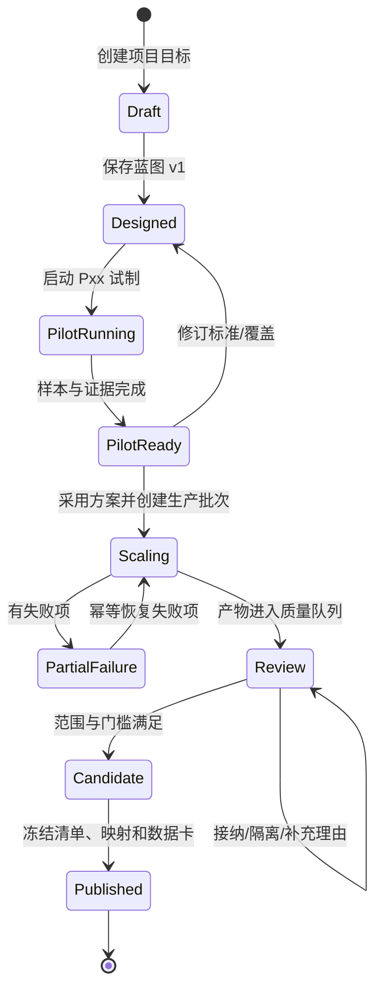

# Atelier 产品规格

## 1. 产品目标

让数据研发人员在一个项目上下文中回答五个问题：我要交付什么？方案如何产生内容？小批结果是否值得扩量？哪些内容需要人判断？最终交付的文件能否被别人复现？

成功不是“页面上有更多按钮”，而是每个关键决定都具备对象、证据、版本和下一步。任何会改变未来产出的操作都应创建新版本或新批次；任何已经交付的内容都能通过固定清单重新解释。

## 2. 核心对象

| 对象 | 身份与不可变部分 | 可以改变什么 | 关系 |
|---|---|---|---|
| Project 项目 | project_id、目标、训练类型、负责人、预算策略 | 项目描述、下一版目标、成员 | 包含所有下列对象 |
| Blueprint 生产蓝图 | blueprint_version、节点图、模型/标准/质量引用 | 复制为新版本 | 项目当前采用一个版本，批次引用自己的快照 |
| Coverage 覆盖计划 | coverage_version、领域/方向/难度/抽样 | 增补下一批切片 | 被蓝图的范围节点引用 |
| Standard 思维标准 | standard_version、步骤、检查点 | 发布新标准版本 | 生成批次引用快照 |
| Batch 批次 | batch_id、purpose、输入快照、状态、预算、事件 | 暂停、恢复失败项、追加事件 | 一个蓝图版本可产生多个批次 |
| Sample 内容版本 | sample_id、content_version、原始内容、来源批次 | 产生 v2；原始 v1 永不覆盖 | 质量证据和人工判断指向版本 |
| Experiment 质量实验 | experiment_id、抽样快照、裁判、量表、规则版本 | 重新运行创建新实验 | 产出分数、分歧、证据 |
| Decision 人工判断 | decision_id、处置、理由、操作者、时间 | 更正创建审计事件 | 只改变处置，不改原始内容 |
| Release 发布版本 | release_id、版本名、样本清单、映射、数据卡、哈希 | 发布后只读；下一版复制候选 | 可以被交付库检索和下载 |
| Recipe 方案 | recipe_version、可复用组合和适用范围 | 发布新方案版本 | 新项目复制，不暗改已有项目 |

这套对象模型刻意不把一切压成“dataset_id”。项目、批次、样本版本、实验和发布的独立身份，是用户理解历史、复现实验和处理回滚的前提。

## 3. 生命周期

状态是对象的事实，不是页面颜色。暂停只阻止新请求；已提交请求可能继续完成。失败恢复沿用批次快照和幂等键；如果要换模型或标准，创建新批次。

## 4. 菜单与页面职责

### 工作区层

“今日工作”聚合待判断样本、已完成试制和即将交付的候选；卡片动作指向具体对象。它不显示无法采取行动的总量 KPI。

“数据项目”是长期项目列表，按目标、训练类型、当前方案、待处理决定和最近事件排序。搜索只过滤项目，不改变项目数据。

“方案库”存储完整工作方法：覆盖、思维标准、质量实验和适用限制一起版本化。选择方案会复制为新项目草稿；升级共享方案不会修改现有项目。

“交付库”只面向已发布版本，按项目、训练类型、用途和版本过滤。评审期可以显示候选，但必须明确候选不能被下游当成正式交付。

### 项目层

| 菜单 | 设计问题 | 关键出口 |
|---|---|---|
| 概览 | 现在处在旅程哪一步、下一个决定是什么 | 进入蓝图、试制对比、质量实验、发布准备 |
| 设计 | 蓝图、覆盖、标准、试制和 A/B 比较 | 新方案版本、独立试制批次、采用某方案 |
| 生产 | 每个批次运行到什么阶段，失败是否可恢复 | 暂停、失败定位、幂等恢复 |
| 数据 | 样本版本和来源如何查看、选择和审阅 | 打开三栏审阅、选择固定范围 |
| 质量 | 实验统计、规则命中和人工判断如何合并 | 新实验、进入队列、修订质量策略 |
| 发布 | 哪些条件已满足，交付内容会冻结什么 | 候选、数据卡、发布和下载 |

### 辅助层

动态将事件直接连接到批次、实验或样本；设置分为连接/预算和成员/角色；帮助页解释推荐旅程和键盘快捷键。辅助入口不与项目工作区争夺主导航位置。

## 5. SFT 与 GRPO 的理想体验

SFT 项目蓝图的生成节点产出问题、推理、答案；评估节点比较逻辑一致、约束识别、推理完整、答案正确和边界验证。GRPO 项目使用同一套项目旅程，但生成节点改为教师提示词和奖励判据，输出字段为 `question`、`judge_prompt`、`levels`、`level_rubrics`；质量节点增加档位覆盖、边界稳定性和评分解释一致性。

原型展示两套一等体验，即使当前后端还没有全部 GRPO 能力。理想产品不应因为实现缺口把用户引到不相干的空白页；分阶段交付时可以在连接校验或能力状态处清楚说明可用范围。

## 6. 发布规则

发布候选按以下顺序检查：

1. 所选样本具有唯一内容版本，来源批次和质量证据可追溯。
2. 已隔离内容自动排除，但必须在数据卡中记录排除数量和理由。
3. 待审阅内容不能静默通过；用户必须进入证据或缩小范围。
4. 字段映射与训练类型匹配。SFT 的最小字段是问题、推理、答案；GRPO 的最小字段是问题、教师提示词、档位和档位判据。
5. 发布动作记录标准、蓝图、清洗策略、裁判量表、样本 ID、导出格式、用途限制和内容哈希。
6. 发布后原项目的后续修改只能影响下一版，不能改变下载文件或数据卡。

## 7. 权限与审计

质量阈值必须有固定分母：项目“接纳率目标”按本次批次的有效生成样本快照计算（接纳数 / 纳入质量检查的样本数），隔离后不能缩小分母伪造改进。发布候选的“无待审阅”是另一项条件，不等同于达到接纳率目标。用户缩小发布范围时，数据卡同时保留原批次通过率、选中范围、排除数量、切片覆盖损失；不能只展示筛选后 100%。原型实现样本处置门槛与排除，百分比门槛和完整量表聚合属于正式实现契约。

角色以项目动作定义：项目负责人可以设计、执行、判断和发布；质量审阅者可以查看授权项目的内容与证据并记录判断；只读访客可以阅读授权项目和发布版本，不能改配置、暂停、判断或发布。成员变更、项目范围、连接密钥和发布操作均写入服务端审计日志。

原型的身份切换只用于验证交互。正式实现必须以服务端授权为准，前端禁用按钮不构成安全边界。

## 8. 边界与异常

- 空项目：显示创建目标，不显示伪造的成功指标。
- 加载中：保留工作区和项目上下文，内容区域使用骨架或明确等待状态。
- 无权限：解释缺少的动作权限，并提供已授权项目或交付库入口。
- 断网：只允许查看最近读取内容；写入操作进入待同步队列，显示冲突风险。
- 模型超时：保留问题、标准和请求幂等键；可恢复失败项，不重跑成功项。
- 预算达到：暂停新请求，显示在途请求和可能计费的状态。
- 规则误报：规则命中只是证据，人工判断可以保留或隔离并写理由。
- 发布冲突：如果候选期间样本处置发生变化，重新计算清单并提示用户确认，而不是覆盖旧候选。
