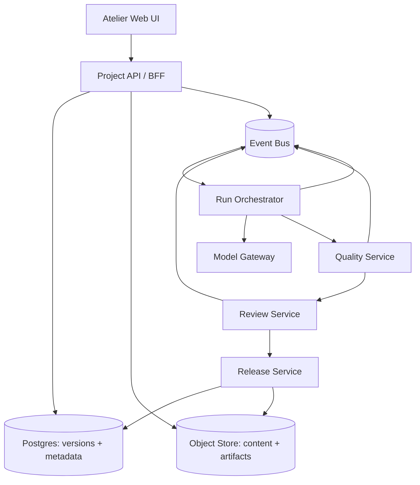

# Atelier 理想交付与架构方案

设计先于实现约束。本文件描述为了兑现产品语义需要的理想边界，然后给出现有系统的渐进落地方式。当前仓库的 Go 服务和前端可以复用，但不应让旧接口反向决定用户只能看到什么。

## 1. 服务边界

- Project API/BFF 负责项目上下文、权限、候选聚合和 URL 所需的读模型；不把页面拼成一份无法版本化的大 JSON。
- Run Orchestrator 为 pilot、scale、recovery 分配批次 ID，保存输入快照、幂等键、预算和阶段事件。
- Model Gateway 统一模型连接、重试、超时、费用估计和真实用量，返回可审计的请求/响应元数据。
- Quality Service 运行抽样、裁判、量表和规则；不直接替人工做处置。
- Review Service 保存样本版本、证据关联、决策和审计；数据内容只追加版本。
- Release Service 在事务内校验门槛、写 release manifest、生成数据卡和文件索引，发布后只读。
- Event Bus 让动态、实时状态和失败恢复不依赖轮询一个巨型运行记录。

## 2. 读写模型

读页面需要的视图可以由多个对象组成，但写操作必须指向一个明确命令：

| UI 动作 | 命令 | 事务/幂等要求 |
|---|---|---|
| 保存蓝图 | `CreateBlueprintVersion` | 版本号唯一，引用的标准/规则版本存在 |
| 启动试制 | `StartBatch(pilot)` | client token 幂等；保存完整快照 |
| 处理失败 | `RetryBatchItems` | 原批次 + 条目幂等键，成功项不重跑 |
| 保存判断 | `RecordDecision` | sample content version + reviewer 唯一约束，可审计更正 |
| 创建实验 | `CreateExperiment` | 抽样快照、裁判、规则版本固定 |
| 创建候选 | `CreateReleaseCandidate` | 清单和证据状态重新校验 |
| 发布 | `PublishRelease` | 单次不可逆状态转换，manifest/hash 写入同一事务 |
| 下载 | `GetReleaseArtifact` | 只接受 release ID，不接受 latest |

API 返回对象的 `version`, `status`, `updated_at`, `links` 和 `warnings`，使前端可以在数据变化时告诉用户“候选清单已变化，请重新确认”。错误码必须区分权限、冲突、门槛阻塞、超时和暂时不可用。

## 3. 快照和文件

每个 Batch 保存：blueprint、coverage、standard、model connection 的非秘密标识、quality policy、sampling 和预算快照。每个 Sample content version 保存来源 batch、输入问题、输出内容、模型请求摘要和内容哈希。每个 Experiment 保存 sample version 列表、裁判版本、量表、规则版本、原始结果与聚合方法。每个 Release manifest 保存最终 sample version ID、排除项、mapping version、数据卡、artifact hash、生成器版本和发布时间。

密钥只存在密钥管理系统或加密配置存储；数据卡对外显示连接名称和模型版本，不泄露 API key。对象存储使用不可变路径，例如 `releases/{release_id}/artifacts/{sha256}.jsonl`，数据库保存摘要和访问策略。

## 4. 事件和恢复

推荐事件：`ProjectCreated`、`BlueprintVersionCreated`、`BatchQueued`、`BatchItemCompleted`、`BatchItemFailed`、`BatchPaused`、`BatchResumed`、`ExperimentQueued`、`EvidenceReady`、`DecisionRecorded`、`CandidateCreated`、`ReleasePublished`。事件载荷包含对象 ID 和版本，不把大段样本内容塞进消息总线。

消费者必须允许重复和乱序。运行状态由事件投影得到；恢复失败项带原请求的 `idempotency_key` 和新尝试 ID。预算服务在提交模型请求前预留额度，完成后按真实 usage 结算；暂停只阻止新提交，已经进入网关的请求继续记录。

## 5. 权限、审计和数据治理

权限判断在 BFF 和每个写服务都执行。对象权限采用工作区 → 项目 → 发布版本的层级，发布下载还需 artifact 访问权限。审计事件包含操作者、角色、对象、旧/新版本、原因和请求 ID；人工判断可以更正，但不会删除原始判断。

数据卡还应支持保留期限、敏感字段标签、许可证/来源说明、抽样限制和已知缺口。删除请求应采用保留政策与软删除标记，不能因为 UI 的“移除”按钮让已发布数据不可追溯。

## 6. 分阶段落地

### 阶段 A：先建立产品语义

在现有 Go API 上增加 project、blueprint version、batch 和 release manifest 的最小表/读接口；前端先使用 Hash 原型中的信息架构和路由。保留旧数据入口作为只读迁移视图，任何新运行都走批次快照。

### 阶段 B：完成垂直旅程

打通一个 SFT 项目：目标向导 → 蓝图 → P03 pilot → B18 scale → 样本三栏审阅 → release v1.2。此阶段必须能真实演示暂停、失败恢复、样本判断、候选阻塞和不可变下载；没有这条链就不扩展更多菜单。

### 阶段 C：质量与 GRPO

将规则、裁判、抽样和证据拆成质量服务；引入 GRPO 字段、档位检查和评分解释。保持相同的项目旅程，只替换节点产物和评估适配器。若某个后端能力尚不可用，页面显示能力状态和待接入信息，但不把理想交互删除。

### 阶段 D：协作与迁移

加入成员角色、评论/提及、共享方案和交付库；通过导入任务把旧 dataset 记录映射为项目/批次/样本版本。迁移报告必须列出无法映射的字段、缺失来源和需要重新生成的证据。旧导出 API 在过渡期标记 deprecated，不能继续以“最新数据”语义覆盖新发布。

## 7. 生产前验收

验收至少包括：版本并发冲突、重复提交、模型超时、预算边界、规则误报、访客越权、发布后修改原项目、下载哈希、GRPO 字段、断网重连和窄屏审阅。功能测试和数据库迁移测试应补齐当前仓库的空缺；浏览器任务测试只验证交互，不替代服务端授权和幂等测试。

附录中的现有文件/接口映射只作为实施线索，不能用来否决本方案需要的对象或操作。
