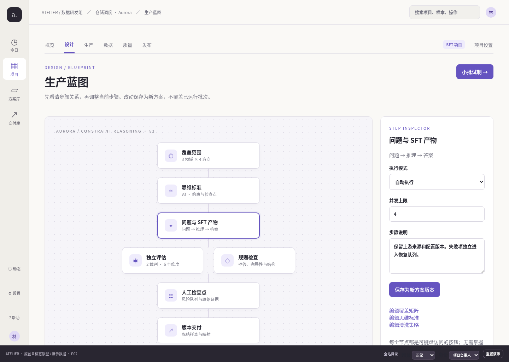
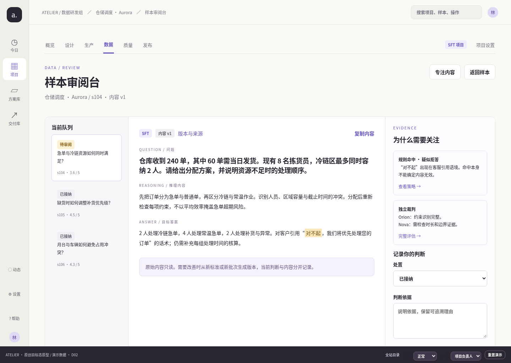
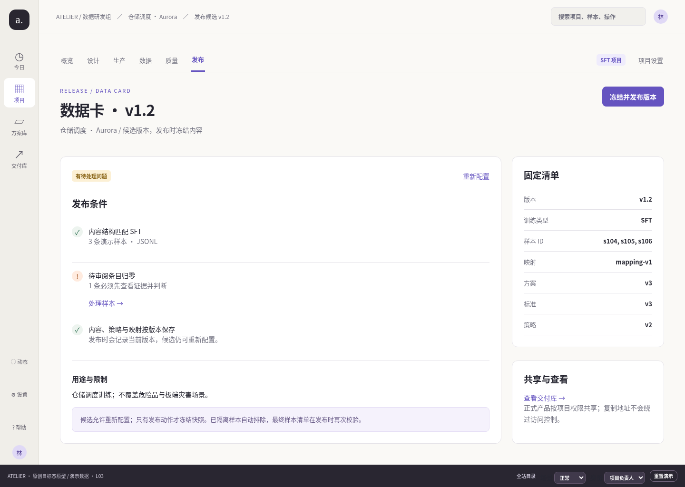

# Atelier 画面图册与路径索引

原型总共 37 个主要画面（36 个原计划画面加上独立试制批次 P03），另有动态状态、样本切换、筛选参数和角色状态。路径均可直接复制到 `prototype.html#` 后使用。

## 代表画面

| 画面 | 说明 |
|---|---|
|  | 工作区首页只聚合需要决定的事项 |
|  | 有限语义节点 + 右侧步骤检查器 |
|  | 队列、内容、证据同屏，可进入专注模式 |
|  | 质量门槛、冻结清单和版本数据卡 |

## 全站主路径

| ID | URL | 画面 | 点击重点 |
|---|---|---|---|
| W01 | `/today` | 今日工作 | 待决定、试制比较、继续项目、交付日历 |
| W02 | `/projects` | 数据项目 | 搜索、项目卡、从方案开始 |
| W03 | `/new` | 定义交付目标 | 名称、目标、SFT/GRPO、下一步 |
| W04 | `/new/coverage` | 规划覆盖与规模 | n×m×x、试制样本、实时规模 |
| W05 | `/new/quality` | 设定质量门槛 | 接纳率、预算、预算策略、创建 |
| P01 | `/p/aurora/overview` | 项目概览 | 旅程进度、当前版本、下一个决定 |
| P02 | `/p/aurora/blueprint` | 生产蓝图 | 节点选择、检查器、保存新方案 |
| P03 | `/p/aurora/coverage` | 覆盖矩阵 | 缺口、下一批切片计划 |
| P04 | `/p/aurora/standard` | 思维标准 | 多行检查步骤、变更说明、新版本 |
| P05 | `/p/aurora/pilot` | 小批试制 | 数量、覆盖方式、版本、启动 P03 |
| P06 | `/p/aurora/compare` | 试制对比 | 同一基准 A/B、采用方案确认 |
| R01 | `/p/aurora/runs` | 生产批次 | B18、P03、A/B 的独立身份 |
| R02 | `/p/aurora/runs/b18` | 批次 B18 | 阶段、暂停、费用、快照 |
| R03 | `/p/aurora/runs/b18/failures` | 异常与恢复 | 错误、幂等恢复、成功内容保留 |
| R04 | `/p/aurora/runs/p03` | 试制批次 P03 | 独立事件、快照、扩量决策 |
| D01 | `/p/aurora/data` | 样本工作区 | 搜索、状态、checkbox、发布选择 |
| D02 | `/p/aurora/data/s104` | 样本审阅台 | 三栏、证据、判断、专注模式 |
| D03 | `/p/aurora/data/s104/history` | 样本版本与来源 | 时间线、批次、标准、判断 |
| Q01 | `/p/aurora/quality` | 质量实验室 | 风险切片、实验、规则、队列 |
| Q02 | `/p/aurora/quality/new` | 新建质量实验 | 抽样、裁判、规则、排队 |
| Q03 | `/p/aurora/quality/e9` | 质量实验 E9 | 排队→完成、维度、分歧证据 |
| Q04 | `/p/aurora/review` | 审阅队列 | 默认待审阅、显式筛选其它状态 |
| Q05 | `/p/aurora/rules` | 清洗策略 | 正则校验、预览、策略版本 |
| L01 | `/p/aurora/releases` | 发布版本 | 候选/已发布、数据卡 |
| L02 | `/p/aurora/releases/new` | 准备发布 | 范围、格式、用途限制 |
| L03 | `/p/aurora/releases/v1.2` | 发布候选 v1.2 | 门槛阻塞、冻结、下载 |
| G01 | `/p/boreal/blueprint` | GRPO 生产蓝图 | 教师评判材料、奖励档位 |
| G02 | `/p/boreal/data/g201` | GRPO 样本审阅 | 教师提示词、档位、规则 |
| G03 | `/p/boreal/releases/new` | GRPO 发布配置 | JSONL 专属字段 |
| B01 | `/recipes` | 方案库 | 方案卡和整套方法 |
| B02 | `/recipes/reasoning` | 约束推理方案 | 适用范围、组成、复制项目 |
| B03 | `/deliveries` | 交付库 | 跨项目已发布版本 |
| S01 | `/activity` | 动态与待办 | 事件→对象、全部已读 |
| S02 | `/settings/connections` | 模型与存储连接 | 测试/保存分离、密钥不回显 |
| S03 | `/settings/team` | 成员与角色 | 能力和权限说明 |
| S04 | `/help` | 使用指南 | 旅程、快捷键、原型说明 |
| S05 | `/catalog` | 全站原型目录 | 全路径评审入口 |

## 状态、参数和身份变体

- `/p/aurora/data?status=待审阅&q=冷链`：筛选条件写入地址，浏览器返回恢复筛选。
- `/p/aurora/data?selection=s104,s105`：发布准备锁定已选样本。
- `/p/aurora/blueprint?node=evaluation`：右侧检查器随节点改变。
- `/p/boreal/data/g201`：同一审阅台改为 GRPO 内容标签和字段。
- 底部场景选择：空数据、加载、失败、断网、无权限、不存在。
- 底部身份选择：项目负责人可保存/暂停/发布；只读访客不能进入设置或写入。
- 视口 1440×1024 展示桌面密度，390×844 展示移动端队列、画布和表单堆叠。

原型目录本身是评审工具，不应成为正式产品的第七个业务菜单。
