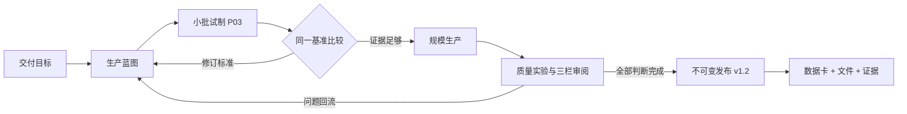
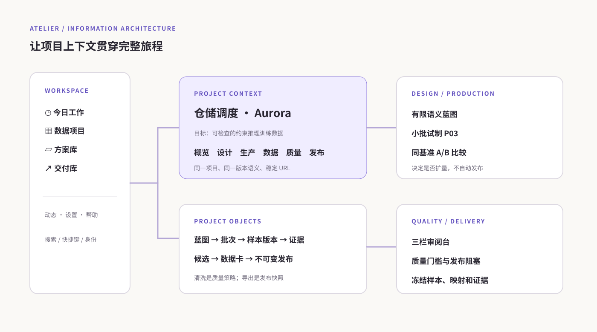
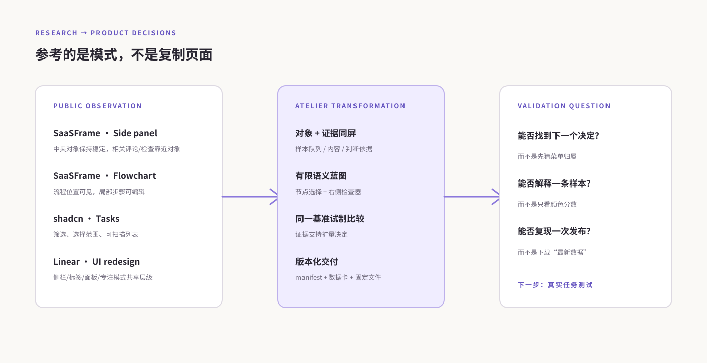

# Atelier：数据项目工作室

> 从交付目标、生产蓝图、小批试制，到质量审阅和不可变交付版本的一套全新产品设计。

这是一份理想目标态的产品与交互方案。它故意不把现有前端菜单、当前 API 或当前数据表当成产品边界：先定义一个数据研发团队真正需要完成的工作，再在附录中说明如何分阶段落到现有系统。它不替换生产前端；仓库中的原型是可以点击的独立评审稿。

## 先看懂新系统

Atelier 的核心单位不是“一个功能页面”，而是“一个要交付的数据项目”。项目从一个目标开始，经过有版本的生产蓝图和小批试制，比较证据后才扩量；质量证据直接回到样本审阅；发布时冻结样本版本、配置快照、映射、限制和哈希。

## 公开原型

- [独立 HTML 原型](./prototype.html)：无需构建工具，打开后可以使用 Hash 路由浏览 36 个主要画面。
- [原型画面图册](./06-atlas.md)：每个菜单、主要状态和响应式行为的索引。
- [调研与参考](./01-research.md)：实际访问过的公开 Web UI 页面、观察到的模式和未访问到的内容。
- [产品规格](./02-product-spec.md)：对象、生命周期、菜单和业务规则。
- [交互规格](./03-interaction-spec.md)：每个画面和每个重要控件的点击、结果、校验、失败和返回语义。
- [交付与架构](./04-delivery.md)：理想服务边界、事件、快照、权限和分阶段落地。
- [验证报告](./05-validation.md)：实际跑过的浏览器任务、屏幕尺寸、已知边界和后续用户研究。

原型使用虚构的 Aurora（SFT）和 Boreal（GRPO）项目，以及极少量样本。它不调用模型、不写业务 API、不估算真实账单；下载按钮只生成明确标注为演示数据的本地文件。

## 信息架构

研究观察到的模式如何转成设计决策：

全局导航保持四个长期入口，临时任务和平台管理被放到独立位置：

| 层级 | 菜单 | 解决的问题 |
|---|---|---|
| 工作区 | 今日工作 | 只显示需要决定或继续的事项，而不是指标墙 |
| 工作区 | 数据项目 | 按交付目标进入项目上下文 |
| 工作区 | 方案库 | 复用有版本的覆盖、标准、质量组合 |
| 工作区 | 交付库 | 跨项目查找已冻结版本 |
| 项目 | 概览、设计、生产、数据、质量、发布 | 项目全生命周期，所有页面保留同一项目上下文 |
| 辅助 | 动态、设置、帮助 | 事件、连接/角色、完整旅程与快捷键 |

项目内不会把“评估、清洗、导出”拆成互不相干的顶级菜单。清洗策略仍有自己的 URL 和版本，但它从质量工作区进入；数据卡从发布工作区进入；每条证据都能回到产生它的样本版本和批次。

## 视觉和交互原则

视觉使用暖象牙底、墨色标题、紫色主动作和少量绿色/琥珀状态。窄侧栏给工作对象让出空间；项目页顶部一直显示工作区、项目和当前页面。流程蓝图只允许有限语义节点，节点右侧检查器负责编辑；普通生产者无需学习任意节点编程。

页面不是静态看板。主要对象都有稳定 URL、浏览器返回语义和脏表单离开提示。试制、批次、样本版本、实验和发布版本分别拥有独立身份；改变标准不会改写已经运行的批次。发布后按钮改为“创建下一版本”，旧数据卡仍可下载同一份冻结记录。

## 这次调研改变了什么

公开案例没有被当成模板照抄，而是作为模式证据：SaaSFrame 的侧栏案例说明对象和相关证据应同屏；流程画布案例说明可以选择步骤并在局部编辑；Page Flows 的公开 Notion 步骤目录提醒我们要设计完整旅程，而不是只画仪表盘；shadcn Tasks 展示了筛选、选择范围和列表密度；Linear 的公开重设计文章验证了侧栏、标签、面板和专注模式需要共享一套层级。具体页面、访问限制和取舍见 [调研记录](./01-research.md)。

最终方案因此采用“项目工作室 + 有限生产蓝图 + 试制比较 + 三栏审阅 + 不可变发布”这条主线，放弃把所有功能继续塞进一个后台菜单。

## 评审建议

先打开今日工作，进入 Aurora 的生产蓝图，点击“问题与 SFT 产物”节点并在右侧保存一个新方案版本；然后启动 P03 试制，打开生产批次查看独立记录。接着到数据页打开 s104，在三栏审阅台记录判断；最后到准备发布页观察未处理样本如何阻塞候选，处理后再冻结版本。切换底部“身份”为只读访客，可以看到设置被拒绝以及表单不能保存。

理想设计并不假装已经有真实用户验证。下一步需要让真实数据研发人员完成同一条任务链，观察他们是否能找到试制问题、理解蓝图节点、区分项目数据与交付库，以及是否能从发布阻塞原因回到正确的样本证据。
