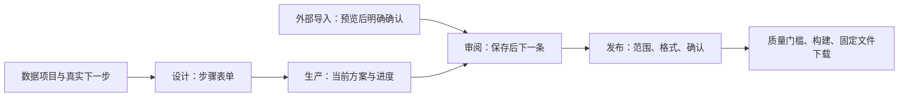

# 产品主线重构交付记录

## 范围与流程

本轮落实 [重构方案](../architecture/atelier-product-flow-rebuild.md) P0–P7 及 [页面原型](../prototypes/product-flow-rebuild.md)，参考 EasyDataset `4002b09` 的紧凑工作区，不只是替换配色。

| 用户问题 | 本轮交付 |
| --- | --- |
| 首屏废话过多 | 删除 Hero、口号、重复工作方式及账本解释；高级参数与历史按需展开 |
| 操作不简便 | 当前方案自动带入生产；文件自动识别并预览；审阅成功自动下一条；发布三步确认 |
| 核心主线不明确 | 全局项目优先；项目内设计、生产、审阅、发布；各阶段辅助任务直接可达 |
| 状态及入口不可信 | 当前版本统计、权限化 nextAction、查询失败不伪造零统计；新版本重新审阅 |

## 2026-10-09 已执行验证

| 验证 | 结果与边界 |
| --- | --- |
| Docker Go 格式、vet、build、test | 通过；普通测试中的真实数据库测试会跳过，另执行下列临时 PostgreSQL 门禁 |
| 临时 PostgreSQL 全仓库集成门禁 | PASS=1344，SKIP=11，必需测试零缺失；本轮六项新增事实、权限与故障测试加入必需清单 |
| 全部迁移冒烟 | 43 个迁移在干净数据库成功执行，核心表存在 |
| Docker 前端类型检查及 Vite build | 通过；保留既有大 chunk / Browserslist 警告 |
| 27 个 UI 守卫及文档一致性 | 通过；旧文案守卫调整为当前语义强调，裸 Markdown 仍全树扫描 |
| 导航真实 Chromium | 27 项通过，含桌面、390px、resize、键盘焦点、错误恢复及无横溢出 |
| 审阅/发布真实 Chromium | 58 项通过，含冲突协调、409、离线草稿、浏览器返回、范围冻结、幂等命令、权限错误重试和项目壳 |
| 设计/生产真实 Chromium | 27 项通过，含 409 草稿、成功保存后继续、历史只读、当前方案指针、预算准入、失败重试幂等命令、恢复失败项及直接审阅；API 受控，不调用付费模型 |
| 来源/导入/工具 Chromium runner | 新构建静态预览 `13310` 完整通过；同值格式事件不会清除预览，权限故障进入 Error 状态 |
| Compose 全栈 | `make compose-up` 成功；API、Worker healthz 成功；43 个迁移已登记；最终提交后需再注入准确 SHA 重建前端 |
| 差异格式 | `git diff --check` 通过 |

浏览器执行生产组件，业务 API 使用受控合同夹具，不代替真实 Worker/商业模型、账单或真人质量判断。可复现脚本在 `test/l15_product_*.mjs` 与 `test/audit/run-source217-ui.mjs`；截图、trace、报告位于忽略目录 `output/playwright/`，CI 上传对应 artifact 并执行断言。

## 远程验收边界

Discussion #165 的有效接入范围为本仓库原生素材通路和公开 Alpaca/ShareGPT/JSONL 导入，早期中间产物桥接已被勘误取代。#197、#217 已关闭；本轮继续保留其回归门禁。

#160 不能因页面重构或自动化全绿而关闭：仍需连续至少 48 小时真实部署灰度/SLO、5–8 名真实用户三角色任务记录，以及与生成端实际不同接入点的独立裁判完整质量旅程。资源和原始证据要求见 [最终审计矩阵](final-issue-delivery-audit.md) 与 [验收协议](atelier-acceptance-protocol.md)。本轮不虚构这些记录。
