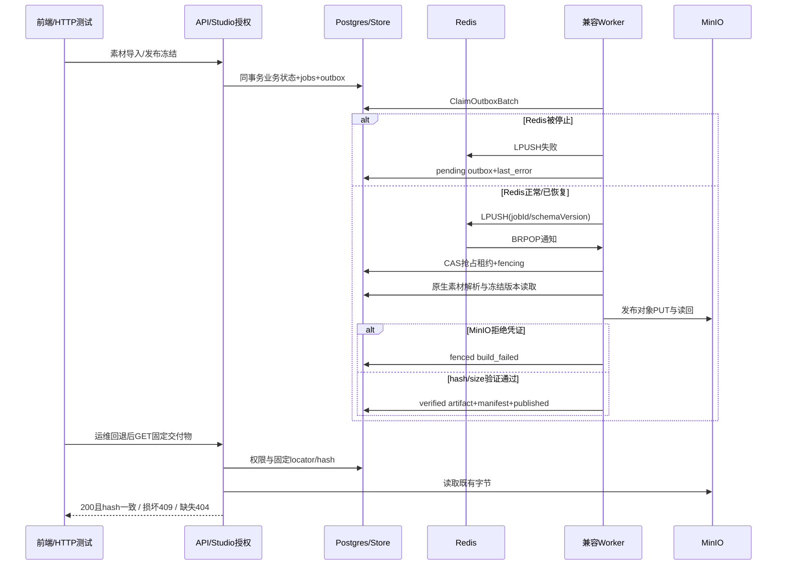
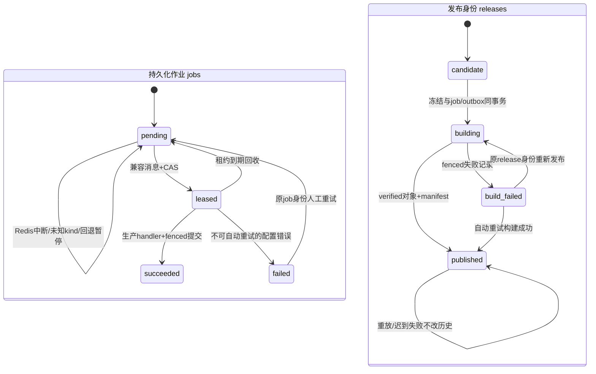

# Atelier 故障与回滚自动验收（Issue #160 T32/T33）

本记录对应隔离临时环境的工程验收。Postgres、Redis、MinIO 均为真实 Docker 服务；Redis 中断使用容器真实 stop/start，MinIO 故障使用服务端拒绝签名凭证。测试驱动生产 dispatcher、consumer、maintenance、source ingestion、release builder 和 HTTP download handler，不注册返回假成功的业务处理器。没有调用外部商业模型，没有执行生产部署，也没有将测试脚本执行时间冒充 48 小时灰度或真实用户会话。

## 1. 复现与证据

```bash
# Go/格式化/检查/编译均由脚本在 golang 容器中运行。
TEST_GO_BUILD_CACHE=/tmp/llm-studio-go-build TEST_GO_MOD_CACHE=/tmp/llm-studio-go-mod \
  bash scripts/go-test-studio-failures.sh

# 全仓库真实 Postgres 集成门禁（与故障验收分开）。
TEST_GO_BUILD_CACHE=/tmp/llm-studio-go-build TEST_GO_MOD_CACHE=/tmp/llm-studio-go-mod \
  scripts/go-test-postgres.sh sh scripts/check-integration-tests.sh
```

故障脚本只管理本次调用命名的 `llm-studio-fault-*` 容器和 `llm-test-pg-*` 容器。MinIO 使用随机 localhost 端口；Redis 默认 localhost 56389，可用 `TEST_REDIS_PORT` 修改，固定映射保证容器 stop/start 后地址不变；Postgres 默认 55549，可用 `TEST_POSTGRES_PORT` 改为空闲端口。故障控制文件放在 `mktemp -d` 的目录。退出时 trap 清理这些资源。现存 Compose 项目不在目标范围内。

| 服务/证据 | 规格 | 真实性边界 |
|---|---|---|
| Go | `golang:1.24-alpine` | 生产 Go 代码编译与执行 |
| Postgres | `postgres:17-alpine` + 全量 SQL 迁移 | 真正的事务、行锁、租约与 outbox |
| Redis | `redis:7-alpine`，禁用持久化 | 真正的 LPUSH/BRPOP、容器 stop/start；丢消息恢复 |
| MinIO | Compose 同一公开 Bitnami legacy 镜像（digest `sha256:451fe6858cb770cc9d0e77ba811ce287420f781c7c1b806a386f6896471a349c`） | 真正的签名请求、拒绝凭证、PUT、读回与固定 hash；避免依赖已无法匿名拉取的旧 Quay 标签 |
| LLM | 本验收不调用外部 provider | source handler 不需要 LLM；不宣称真实商业 provider 端到端通过 |
| CI artifact | `studio-failure-report/report.log` | CI job 必须获得下表全部 `--- PASS`，Skip/缺失均失败 |

## 2. 故障覆盖矩阵

| 场景 | 故障/动作 | 必须成立的断言 | 测试/探针 |
|---|---|---|---|
| Redis 中断 | 容器 stop，dispatch，再 start | 作业不丢，outbox 保留 pending 和错误；恢复只写一份真实 source chunk | `TestStudioFaultRedisInterruptionPreservesOutboxAndRecovers` |
| Worker 崩溃/租约到期 | 抢占后停止心跳，提前临时夹具租约时钟 | maintenance 重投；旧 token 提交被拒绝；恢复结果不能被迟到结果覆盖 | `TestStudioFaultLeaseRedeliveryRejectsStaleWorker` |
| Redis 通知丢失 | 删除临时队列，提前 outbox 分派时钟 | DB 为权威，maintenance 重新武装通知，生产 handler 完成一次 | `TestStudioFaultLostNotificationIsRearmed` |
| 消息 schema 不兼容 | `schemaVersion=999` | 原始字节完整保留在 rejected 队列，job 不被 claim；正确消息仍能完成 | `TestStudioFaultIncompatibleEnvelopeIsPreservedAndValidReplaySucceeds` |
| Worker 类型不兼容 | durable job kind 改为未知未来类型 | job 保持 pending/attempt=0，outbox 可解释；恢复兼容 kind 后实际入库 | `TestStudioFaultUnknownWorkerKindPreservesPendingUntilCompatible` |
| Worker 总开关回退 | consume 前关闭开关，再重启兼容消费者 | 队列消息留在 Redis，job 不 claim；恢复后同作业完成 | `TestStudioFaultRollbackPausesQueueAndResumeCompletes` |
| 对象写入失败 | 正常 MinIO 服务 + 错误 secret | release=`build_failed`，未验证对象不会登记成有效制品；修复后复用 release/job 身份 | `TestStudioFaultObjectStoreFailureRetriesSameReleaseAndHash` |
| HTTP 写入口回退 | 总开关、项目开关 | source 写入 503、无导入 ledger；已有项目读取 200；非成员仍为隐藏 404 | `TestStudioRollbackStopsLegacyProjectWritesAndKeepsReadsAvailable` |
| 已发布下载/损坏 | 回退后下载，随后受控改写对象字节与 locator | 固定文件仍 200/hash 一致；损坏 409；缺失 404；非成员 404；不重生成 latest | `TestStudioFaultRollbackKeepsPublishedDownloadAndRejectsCorruption` |
| 发布失败的迟到结果 | 失效 owner/token、已 published 状态 | 失败状态写入有租约与候选 revision fence，不能覆盖已发布版本 | `TestMarkBuildFailedIsIdempotentAndDoesNotOverwritePublished` |
| 冻结入队 | 两次发布同一候选 | building 与 durable release job/outbox 同事务；单 release 身份 | `TestFreezeReleaseIsIdempotentAndStartsBuilding` |
| DB 版本错配 | fresh/current/未来迁移标记/移除标记 | fresh/current 放行；未来迁移拒绝（exit 1）；修复后重新放行 | `scripts/check-schema-faults.sh` 调用原 `check-schema-compat.sh` |

临时夹具的数据库时钟提前只缩短等待时间，不更改生产租约、30 秒退避或 60 秒通知修复阈值。测试的 SQL 写入仅用于数据夹具和受控故障，业务执行仍调用原实现。





## 3. 验收发现并修复的根因

1. `requireProject` 直接调用 AuthzStore，绕过 Studio 灰度判定，使 documents/source 写入口在运维回退后仍可能写入。现在统一调用原 `Service.Authorize`，授权在开关之前，因此不会向非成员泄露运维状态。
2. `FreezeRelease` 原来只写 `releaseId` 通知；生产 dispatcher 只执行 `jobId` 通知，因此 202 后 release 会停留 building。冻结事务现在同时调用原 `EnqueueJobTx`，以 release/candidate revision 为幂等键创建 durable build 作业。
3. 对象存储失败原来只返回错误，release 留在 building。现在原 handler 调用 store 的失败转换；转换检查实际 job owner、token、租约与当前候选 revision，并保护 published。人工修复原因后，原冻结命令复用同一 release/job 身份和原有 RetryJob 状态转换。
4. 多次人工重试复用同一 outbox event 时，原 `ON CONFLICT DO NOTHING` 会保留 dispatched 状态。原 RetryJob 的事务逻辑现在立即重新武装该事件，避免用户点击重试后等待维护阈值。

## 4. 执行状态与验收边界

执行日期：2026-10-08。实际运行结果由本 PR 的本地验证记录与 CI artifact 对应；后续版本需重新运行，不能用历史 PASS 替代当前提交验收。

| 本地执行 | 实际结果 |
|---|---|
| Compose 同一 Bitnami digest 的故障脚本 | exit 0；11/11 必需测试 PASS，fresh/current/future rejected/recovered 四个 schema 探针 PASS |
| Docker `gofmt -s` / `go vet ./...` / `go build ./...` | exit 0 |
| 首次完整真实 PG 门禁 | exit 0；1233 PASS，必需 0 缺失；8 个只依赖 Redis/MinIO 的故障测试在本行按缺少服务 Skip，已由上一行全部真实执行；另有 2 个历史输入条件 Skip |
| `make db-migrate-smoke` | exit 0；41 份迁移全部应用且核心表存在（基线 6c169af） |
| Node 容器 `scripts/check-docs.mjs` | exit 0；相对链接、锚点、代码引用全部通过 |

| 验收项 | 状态/边界 |
|---|---|
| 本报告的自动故障矩阵 | 由必需 PASS 门禁判定；不允许用 Skip 计为成功 |
| 完整商业 provider 的 SFT/GRPO 全链路 | 本故障脚本未覆盖；保留现有 provider/E2E 的单独证据口径 |
| 内部新项目连续 48 小时灰度 | 未执行；需要真实 elapsed window、health 采样和部署版本 |
| 生产 SLO 阈值 | 未标定；需要生产采样，不能从临时容器性能推算 |
| T34 的 5–8 名真实研究人员与多角色任务 | 未执行；需要真实会话及首次点击/迷路/阻塞/帮助次数记录 |

因此本交付补齐 T32/T33 的自动工程故障验收，不把 #160 总体验收视为已完成，不关闭 #160。
