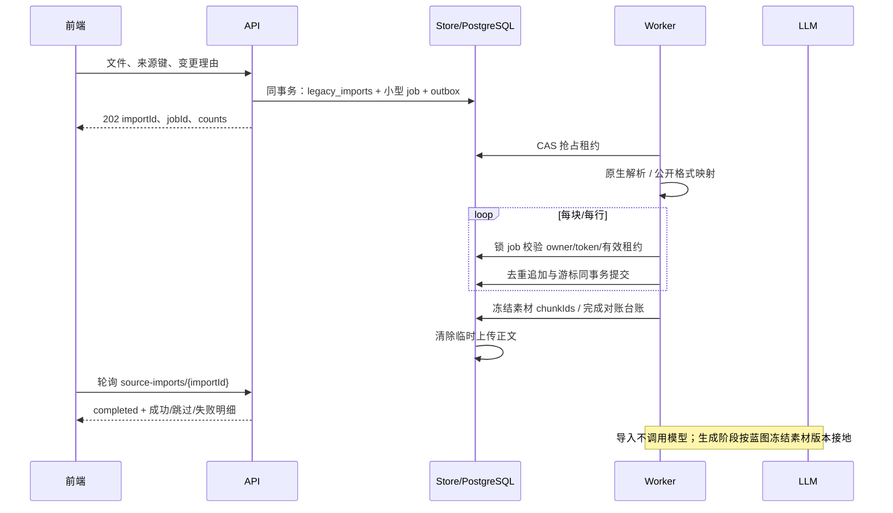
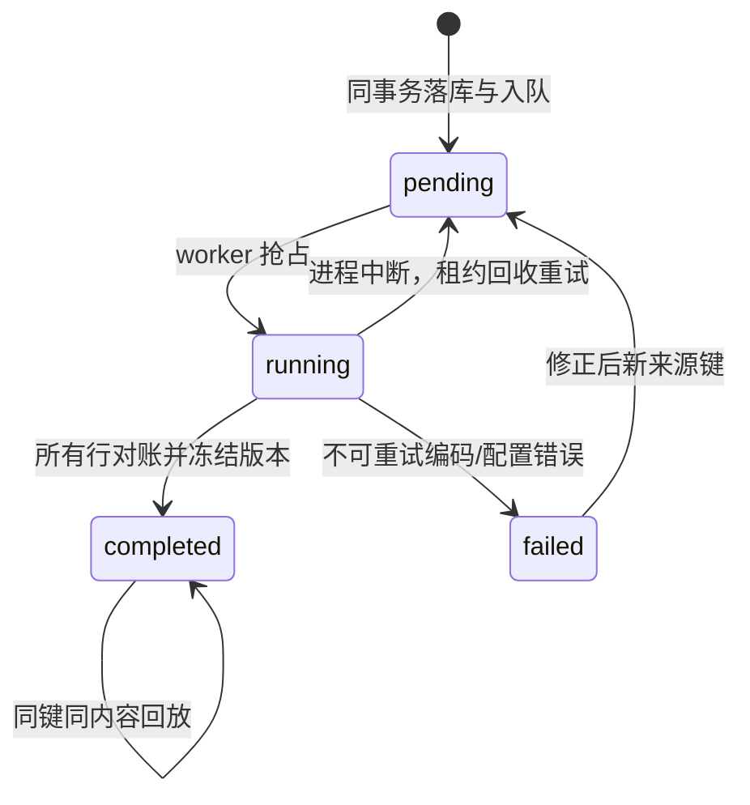

# 外部素材与 Easy Dataset 成品导入契约

讨论 #165 的最后勘误与 Issue #217 是实施依据。两条通路由本仓库原生实现：Markdown/TXT 素材解析，以及公开 Alpaca/ShareGPT/JSONL 成品导入。接口不调用 Easy Dataset 私有 API，不读取其 SQLite，不复制上游代码。

| 通路 | 请求 | 大小与行数 | 写入结果 |
|---|---|---|---|
| 素材 | `POST /api/v1/projects/{projectId}/source-imports` multipart | 200 MB；UTF-8 Markdown/TXT | 素材来源不可变版本与去重素材块 |
| 成品 | `POST /api/v1/projects/{projectId}/source-import-products` JSON | 20 MB；5000 行 | SFT 不可变样本版本，`source=external_import` |
| 成品预检 | `POST /api/v1/projects/{projectId}/source-import-products/preview` 相同请求 | 相同限制 | 通过/文件内重复/逐行失败；零写入 |

| 格式 | 必需字段 | 可选字段 | 映射 |
|---|---|---|---|
| Alpaca | `instruction`, `output` 字符串 | `input`, `reasoning` 字符串 | question 为 instruction + input；answer 为 output |
| ShareGPT | `conversations` 数组，`from`, `value` 字符串 | 首条 system | 接受 human/gpt 交替；保存所有历史，主字段为最后一个完整轮次 |
| JSONL | `question`, `answer` 字符串 | `reasoning`；或每行上述两种公开格式 | 不猜私有字段，不把未提供推理伪造成模型产物 |

JSON 数组与逐行 JSON 都支持。缺必需字段、类型错误、空答案或不完整对话只影响该行，失败 `sourceId` 为原始行号（数组为条目序号），失败明细最多 200 条但总计数完整。`<think>...</think>` 已有推理可拆分，未提供推理保留空串。固定样例位于 `test/fixtures/source-import/`，由实际映射测试读取。

成品请求形状：`{format,sourceKey,content,targetKind:"sft",changeReason?}`；可用 `contentBase64` 代替 content，不能同时提供。未提供理由时自动记录「导入公开成品 <sourceKey>」。通用问答格式没有 GRPO 判据，GRPO 项目会返回字段级 422，避免伪造成教师数据。

素材 form 字段：file、expectedRevision、可选 changeReason/sourceKey、chunking.algorithm、chunking.separator、chunking.maxLength、chunking.minLength、chunking.keepHeadingPath。未提供理由时自动记录「上传素材 <filename>」。缺省来源键由文件摘要与切分策略摘要组成，同文件调整策略可以重新导入。算法只公开已实现的 recursive/text，默认 2000/200 字符、换行段落分隔、保留标题路径。PDF/DOCX/目录导入明确不支持。正文规范化 CRLF/BOM；非 UTF-8 转换后再上传。超长段落按 Unicode 字符硬切，不丢正文。

三层幂等复用 `legacy_imports`：唯一来源键绑定 project → 本系统内容 hash → 确定性样本键。不同项目同来源键互不冲突；相同键变更内容或策略返回 409，必须用新键。相同 completed 请求返回 200 replay 且零副作用。并发成品按内容身份加事务锁，去重与样本追加同事务；旧版本永不 UPDATE。

第六类 source 文档通过原有循环注册得到 source-versions 三个端点，新增的路径映射与 typed 解码是必要接线。上传排队保存 pending 来源版本，解析完成再追加包含 chunkIds 的版本。generation.sourceVersionId 固定该不可变版本，避免后续上传改变批次接地依据。方向 document 必须关联本项目素材块；ai 为显式关键词降级；显式 none 为缺口；manual 不冒充文档接地。既有空来源版本保留旧配额容量语义，避免使历史版本失效，但自动生成不会因此获得来源或静默降级；新方案应显式选择来源，缺少来源的生成仍拒绝执行。

项目概览 `versions.source` 返回当前来源版本摘要，尚未上传为 null。样本版本视图 `source.sourceChunkIds` 固定实际使用素材块 ID，旧样本为空数组。素材块预览可传 `sourceVersionId`，先按该版本 documents 的冻结 chunkIds 过滤，再进行搜索、总数计算与分页；历史版本不混入后来上传的素材。

覆盖配额是最新 #190 已确立的容量事实。项目 m×n×z 是初始估算，与覆盖不同必须在界面显示；批次不允许计划量超过冻结覆盖容量。这是对旧 #217「一律拒绝不等于项目估算」的兼容性修正，不使历史版本失效。配额 0 为缺口，负配额拒绝。

上传正文暂存同一台账 BYTEA（PostgreSQL TOAST，最大 200 MB）而不是 JSON/job/Redis 中，成功后清除；保留 hash/报告。素材块保留至显式项目删除，无静默定期清理。不可变样本保存独立 source_chunk_ids；导出发现内容缺失时保留 missing_chunk 证据。目录枚举未实现，因此不暴露。

接口错误：未登录 401，无项目执行权限 403，未知资源 404，版本/来源键冲突 409，超限 413，未支持类型 415，字段或跨项目引用错误 422。GET 台账与素材块列表均为 `{items,total,limit,offset}`，每页最多 200 条。GET 台账详情保留 beforeSnapshot、afterSnapshot、failures、counts、cursor、jobId；不会返回暂存原文件。

该契约冻结为 source.v1 与公开格式映射 v1。新增格式或语义不替换历史内容，应扩展明确的格式/版本标识与对应样例；不接受悄悄猜测新字段。
