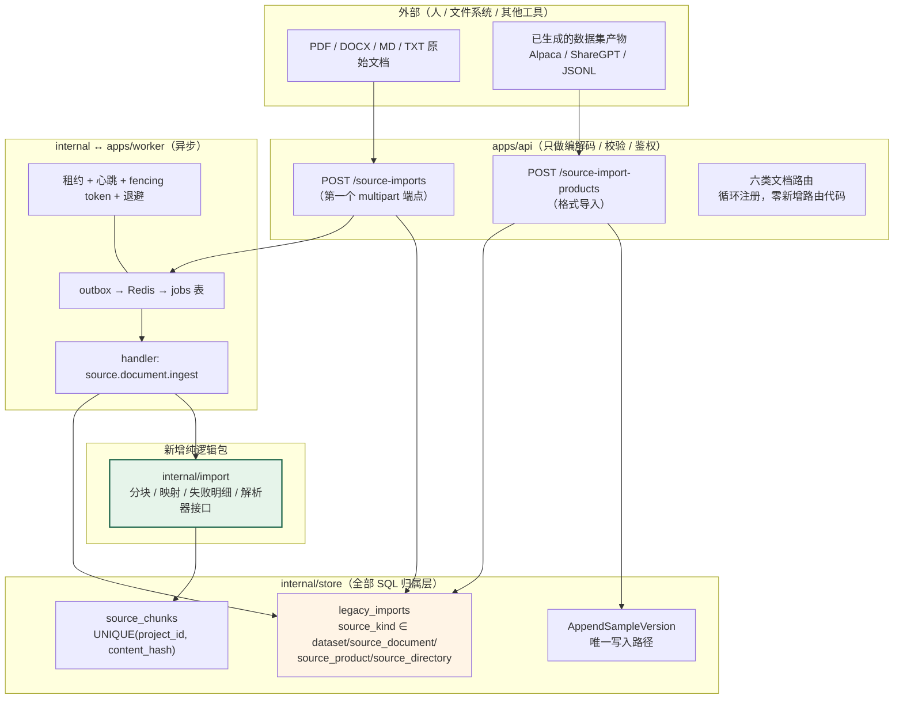
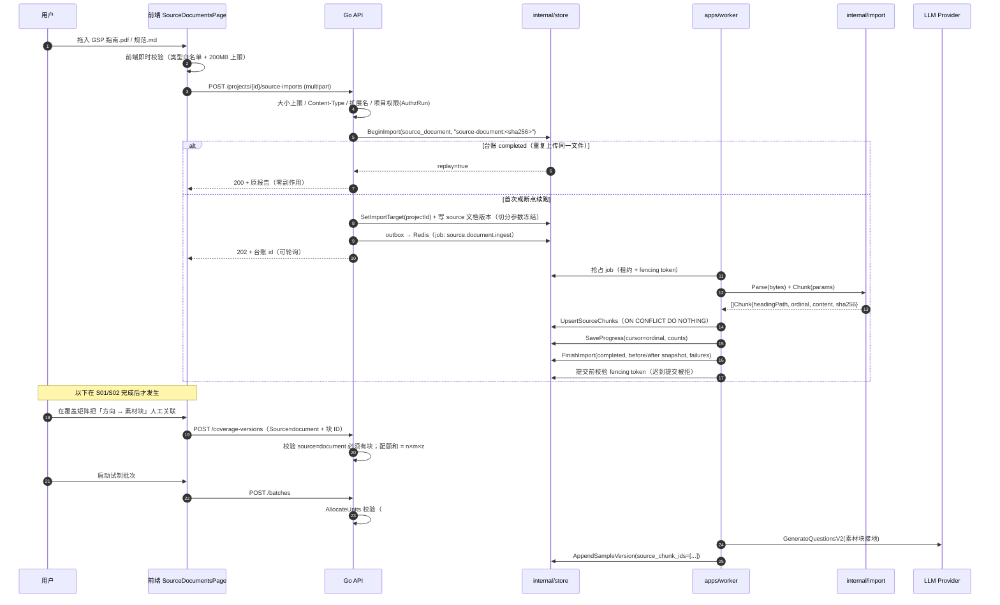
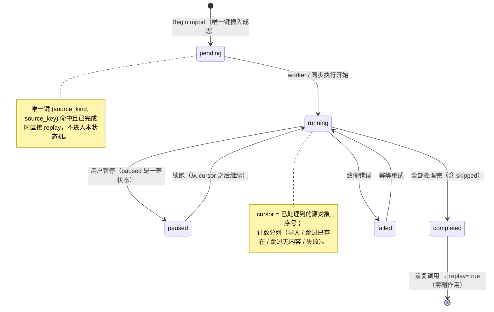
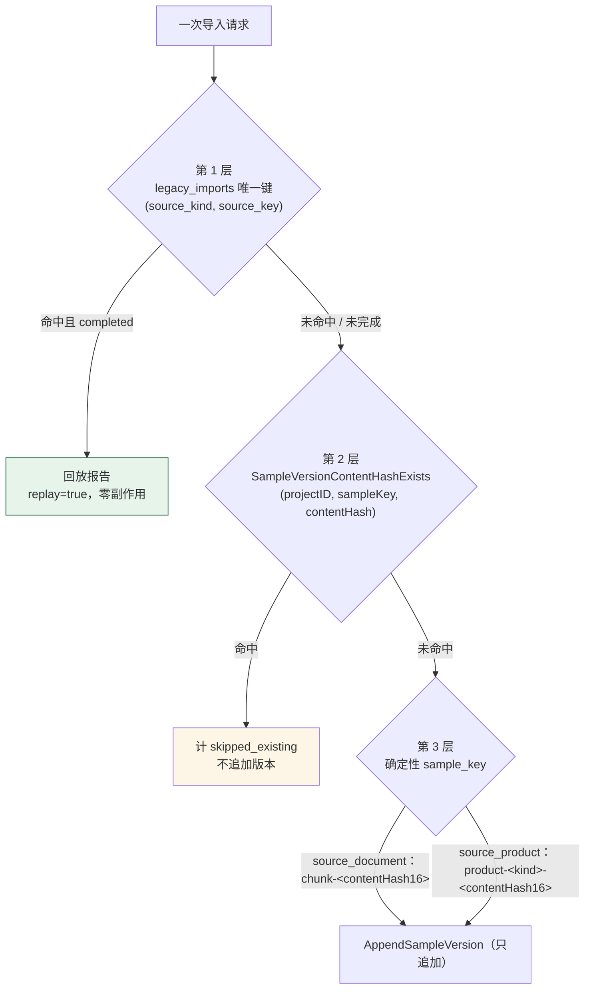
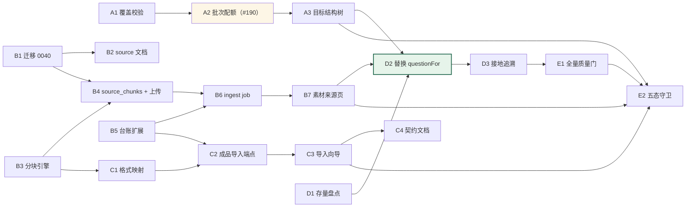

# 外部素材与成品导入：原始计划与落实记录

> 原始计划来自 [Discussion #165](https://github.com/1420970597/llm/discussions/165) 与 [Issue #217](https://github.com/1420970597/llm/issues/217)，下方保留原始提案供核对。2026-10-08 实施采用两条原生通路：Markdown/TXT 素材采集，以及 Alpaca/ShareGPT/JSONL 成品导入。实时实现与验证以 [生成追溯架构](../architecture/source-grounded-generation.md)、[成品导入契约](external-product-import-contract.md) 和本次交付审计为准。
>
> 实施调整：沿用最新 #190 的覆盖容量权威口径，项目 m/n/z 为估计；成品导入使用 jobs/outbox 异步执行；素材原文持久化于已有导入台账，作业仅携带 importId；source_directory、PDF/DOCX 返回明确不支持。历史未指定来源的零配额仍按原契约处理，新的显式来源零配额表示缺口。

---

<!-- 本 Issue = 仓库文档 docs/plans/external-source-import-plan.md 全文（外部素材与数据集产物集成计划）。

     双层结构（避免内容重复、单一权威）：
       * 权威正文：docs/plans/external-source-import-plan.md（本 Issue 正文与其一致）
       * 承载 issue：#197（用户测试问题汇总）—— 本计划是其中 P0-3 / P0-4 的完整展开
       * 讨论来源：#165（Easy Dataset 集成可行性调研）
       * 上级设计：docs/architecture/blueprint-workflow-rearchitecture.md
       * 逐项 TODO 摘要：docs/prototypes/blueprint-workflow-rearchitecture/README.md

     基线：main @ 0b18145 ｜ 分支 docs/TASK-165-197-blueprint-workflow-rearchitecture @ 3fc7ce2
     本轮未修改任何产品代码：git diff --stat origin/main..HEAD -- apps internal sql cmd 为空。-->

# 外部素材与数据集产物集成计划（讨论 #165 落地）

> **状态**：设计 + 实施计划（**本轮未修改任何产品代码**）
> **上级文档**：`docs/architecture/blueprint-workflow-rearchitecture.md`（数据结构与前端架构）
> **逐项 TODO 摘要**：`docs/prototypes/blueprint-workflow-rearchitecture/README.md`
> **原型**：`docs/prototypes/blueprint-workflow-rearchitecture/prototype.html`（S03 = 素材来源，S02 = 图工作流检查器）
> **代码基线**：`main` @ [`0b18145`](https://github.com/1420970597/llm/commit/0b18145)
> **关系**：本文是 `README.md` 中 **P0-3（素材来源文档）** 与 **P0-4（问题生成接线）** 的完整展开，并新增产物导入的收窄方案
> **被引用**：`docs/architecture/blueprint-workflow-rearchitecture.md` §2.2（第六类文档）与 §3.3（参数归位）指向本文的详细契约

---

## 0. 结论与范围

### 0.1 三句话

1. **不做 easy-dataset 集成。** 上游 `app/api/**/chunks/*` 与 `app/api/**/tags/*` 下 **0 个 export 路由**（第三轮勘误的核实结论），中间产物无法交接；成品导出可用，但成品问答对**不含任何素材接地信息**，只接成品等于关掉 `GenerateQuestionsV2`（链路反而更断）。
2. **收窄为「本仓库自建」两条通路。** 通路 A = 素材文档（Markdown/TXT → 分块 → 台账）；通路 B = **对齐公开数据集格式**（Alpaca / ShareGPT / JSONL）的通用导入，用于人工搬运的成品数据，`source = external_import` 显式标注、不参与接地。两条都走**同一套三层幂等**。
3. **本文只依赖上游的「导出格式」，不依赖任何中间产物形状。** 因为它不集成上游代码、不调用其 API、不读它的 SQLite，所以它的字段变动、版本升级、AGPL 传染风险全部与本方案无关。

### 0.2 范围边界

| 在范围内 | 不在范围内 |
|---|---|
| 第六类版本化文档 `source`（切分策略 + 来源台账） | 嵌入 easy-dataset 的界面（MUI vs Semi、无鉴权 vs 会话 Cookie、App Router vs React Router 三重冲突） |
| `source_chunks` 表 + Go 侧 Markdown/TXT 解析与分块 | 合并其代码库或数据库（运行时与任务模型不可调和） |
| `POST /source-imports`（上传）与 `POST /source-import-products`（格式导入）两个端点 | 调用其 104 条无鉴权 HTTP API（无 OpenAPI、无版本前缀、AGPL §13 风险最高） |
| 幂等台账 + 对账水位 + 逐条失败明细 | PDF / DOCX / EPUB 解析（Go 侧后置，独立任务，**不做伪实现**） |
| `questionFor` 从模板占位符改为素材接地生成 | 标签树自动生成（勘误 3：上游标签树输入是 TOC，不是 chunks） |
| 批次配额校验（#190） | 自动建立「素材块 ↔ 方向」匹配（勘误 2：该耦合不存在，必须人工建立） |

### 0.3 关键设计决策

| 决策 | 选择 | 理由 |
|---|---|---|
| 幂等台账 | **在 `legacy_imports` 上扩 `source_kind` 的 CHECK，不建第二张台账表** | 三层幂等已在该表上用结构保证（唯一键 + 游标 + 分列计数 + 前后对账快照）。建第二套台账等于两套「重复执行零副作用」的语义，将来必然漂移（AGENTS.md §3.1） |
| `content_hash` 由谁算 | **本系统算 sha256** | 上游产物既无 `hash` 也无 `tagPath`（勘误 1）。把幂等依据放在不存在的上游字段上 = 承诺作废 |
| 成品导入的 `sample_key` | `product-<sourceKind>-<contentHash16>`（**含哈希**） | `legacy-<datasetId>-<questionId>` 是「同一条源记录的新版本」；成品导入是「同一份文件的重复导入」，语义不同，键必须不同 |
| 重复内容的处理 | **按 `(sampleKey, contentHash)` 跳过，不追加新版本** | `AppendSampleVersion` 的语义是「重生成了一次」= 消耗了预算。导入不消耗预算，因此同内容重复导入不应产生版本（与 `legacy` 的 `SampleVersionContentHashExists` 一致） |
| 缺口方向默认行为 | **拒绝生成**（返回 `config_error`，不重试） | 静默退回模板问题正是要消除的行为；无素材时的"生成"会产出看起来专业但无据可依的问题，比占位符更危险 |
| 素材块与样本的关联 | 新增 `sample_versions.source_chunk_ids JSONB`（**不改 payload**） | 不触碰已冻结的 `sft.v1` / `grpo.v1` schema 与既有内容 hash；旧行默认 `'[]'`，语义完全向后兼容 |
| 新迁移号 | `0040` | 已核实：`main` 上 `sql/migrations/` 最大为 `0039_workspace_bootstrap_members.sql`（`ls sql/migrations \| tail -1`）。⚠️ 我没有 `0022–0039` 是否全部应用到验收库的直接证据 |
| 迁移验证方式 | **不用 `make db-migrate-smoke`** | 已读 `Makefile:34-40`：该 target 只执行 `sql/migrations/0001_phase1_foundation.sql`，不覆盖新迁移。必须用 `docker compose`（api 启动时应用迁移）或对局部 postgres 逐文件 psql |

---

## 1. 现状契约事实（全部带 `文件:行`，可逐条复核）

> 下表的每一行都是本次计划所依赖的**既有契约**。任何一行如果与你的认知不同，本计划对应的设计就需要重新讨论。

| # | 事实 | 位置 | 对计划的影响 |
|---|---|---|---|
| F1 | 台账唯一键 `UNIQUE (source_kind, source_key)`，`source_kind` CHECK **只允许 `'dataset'`** | `sql/migrations/0034_studio_legacy_imports.sql:34-35`、`:70` | 必须改 CHECK 才能复用台账 |
| F2 | 状态机 `pending / running / paused / completed / failed`，`paused` 是一等状态 | 同上 `:44-45` | 上传/导入的暂停续跑直接复用，不新增状态 |
| F3 | 分列计数：`source_items / imported_versions / skipped_existing / skipped_no_content / failed_items` | 同上 `:53-57` | 跳过与导入是不同事实；导入报告直接复用这套形状 |
| F4 | 对账快照 `before_snapshot` / `after_snapshot` / `failures`（JSONB），`failures` 精确到对象 | 同上 `:60-62` | 「同一份源数据是否得到同一份结果」的唯一判据 |
| F5 | 台账是审计记录：`target_project_id` / `batch_id` 均 `ON DELETE SET NULL` | 同上 `:41-42` | 删项目不抹掉「曾经导入过什么」 |
| F6 | `legacy_imports` 无 `created_by` 列 | 同上（全表 33 列，无 `created_by`） | 审计用户名**借用 `before_snapshot.actorId`**（诚实标注，不假装有列） |
| F7 | `samples UNIQUE (project_id, sample_key)` | `sql/migrations/0025_studio_batches_samples.sql:180`（表定义）`:195`（唯一约束） | 幂等的最终锚点；键必须在同一 project 内稳定 |
| F8 | `sample_versions UNIQUE (sample_id, version)`，写入路径**只有** `AppendSampleVersion`（无 UPDATE） | `0025_…sql:216`（表定义）与 `internal/store/batch_store.go:969-976` 的注释（「追加」语义） | 「不覆盖已迁移后产生的新版本」是**结构保证**，不是约定 |
| F9 | `AppendSampleVersion` 校验 payload schema + **服务端算内容 hash** + 同事务推进 `latest_version` + 版本号冲突重试 | `internal/store/batch_store.go:977`（`func (s *BatchStore) AppendSampleVersion`），输入类型在 `:949` | 导入不得自己写 `sample_versions`，必须走这一条 |
| F10 | 三层幂等：台账唯一键 → 内容 hash → 确定性 `sample_key` | 论证在 `internal/legacy/import.go:23-38`；判重函数 `internal/store/legacy_import_store.go:224`（`SampleVersionContentHashExists`） | 本次导入的第 2、3 层可直接复用该函数 |
| F11 | `BeginImport` 用 `INSERT … ON CONFLICT DO NOTHING` + 失败回查，返回 `replay` 标志 | `internal/store/legacy_import_store.go:82`（`func (s *LegacyImportStore) BeginImport`） | `replay=true` 时**零副作用**回放是已实现的语义 |
| F12 | 五类版本化文档由 `registerDocumentRoutes` **循环注册**（GET/POST list + GET version） | `apps/api/routes_documents.go:59-66`（`for _, kind := range model.AllDocumentKinds()`） | 新增第六类文档**不需要新增路由代码**（验收项必须证明） |
| F13 | `projectPrefix = "/api/v1/projects"`；权限动作 `read/design/run/review/publish` | `apps/api/routes_projects.go:34`；动作常量在 `internal/store/authz_store.go:38-47` | 新端点用 `AuthzDesign`（定义方案）与 `AuthzRun`（执行导入） |
| F14 | 路由注册守卫：未登录返回 404 视为「未注册」→ 测试失败（要求 401） | `apps/api/routes_studio_contract_test.go:131`（`func TestStudioRoutesAreRegistered`） | 新端点必须加入该表，否则不算交付 |
| F15 | `ImportFailure{SourceID int64, Reason string}`；失败列表上限 200 条（计数不截断） | `internal/legacy/import.go:97-100`、`:43-47`（`maxRecordedFailures = 200`） | 导入报告的失败形状直接复用 |
| F16 | 零处 `multipart` / `FormFile`（全仓库） | `grep -rn "multipart\|FormFile" apps internal` 无输出 | 上传是**净新增能力**，不是接线；必须同时定义大小上限、类型白名单、Content-Type 校验、审计 |
| F17 | `CoverageDirection.Source` 字段存在但**全仓库只有定义、从未读取** | `internal/model/studio_docs.go:236`（`type CoverageDirection` 内） | 方案里它落地为 `document/ai/manual/none` 并参与服务端校验 |
| F18 | `AllocateUnits` 在 `len(units) >= plannedUnits` 时截断，**从不回写实际分配数** | `internal/studio/batch_runner.go:447-475` | #190 根因；配额校验必须加在调用点 |
| F19 | 项目管理 `PlannedQuestions() = DomainCount × DirectionsPerDomain × QuestionsPerDirection` | `internal/model/project.go:183`（`func (p Project) PlannedQuestions()`） | 与覆盖配额之和的比较对象 |
| F20 | `sql/migrations/` 最大号 = `0039_workspace_bootstrap_members.sql` | `ls sql/migrations` | 新迁移用 `0040` |
| F21 | `make db-migrate-smoke` **只跑 `0001`** | `Makefile:34-40` | 新迁移不能用它验证（这是 Makefile 自身的缺口，计划中单独列出） |

---

## 2. 集成架构

### 2.1 系统关系图



**读法**：红色边的 `internal/import` 是唯一新增的纯逻辑包（可 mock、可单测、零 IO）；`internal/store` 仍然拥有全部 SQL；`apps/api` 不做业务判断。

### 2.2 端到端时序（通路 A：素材文档上传）



### 2.3 端到端时序（通路 B：成品产物导入）

```mermaid
sequenceDiagram
    autonumber
    participant U as 用户
    participant API as Go API
    participant ST as internal/store
    participant IMP as internal/import

    U->>API: POST /source-import-products {format, sourceKey, content}
    API->>API: 校验 format ∈ {alpaca, sharegpt, jsonl}; content 大小上限
    API->>ST: BeginImport(source_product, sourceKey)
    alt 台账 completed
        ST-->>API: replay=true → 回放报告
    else 首次
        API->>IMP: MapProductRows(format, content)
        IMP-->>API: rows[] + failures[]（缺字段 / 类型不符 / 重复 hash）
        loop 每条 row（确定性 sample_key = product-<kind>-<hash16>）
            API->>ST: SampleVersionContentHashExists(projectID, key, hash)
            alt 已存在同内容
                Note over ST: 计 skipped_existing，不追加版本
            else 新内容
                API->>ST: AppendSampleVersion(source=external_import, source_chunk_ids=[])
            end
        end
        API->>ST: FinishImport(completed, 前后对账, failures)
    end
    API-->>U: 导入报告（新增 / 跳过 / 失败明细）
    Note over U,API: 成品导入 marks source=external_import，<br/>不生成任何新问题、不消耗模型预算
```

### 2.3b 本计划对应的界面原型（真实 Chromium 截图）

> 计划里的每个契约都有一屏可以点开看的界面。原型与截图的可复现命令见 §11。

**通路 A 的入口（素材来源，含切分策略与导入边界）**


**通路 A 的前置（目标结构树：方向 ↔ 素材的关联在此建立）**


**通路 A 的下游落点（蓝图检查器：素材接地在小步骤 4.1 生效）**


**通路 B 与 A 的共同出口（数据集预览与分析，接地率在此可见）**


**五态定义（本计划 §6.3 要求每个新页面逐条实现）**


---

### 2.4 导入台账状态机（复用 F2，不新增状态）



### 2.5 幂等三层（与 `internal/legacy` 同构）



**为什么三层缺一不可**（直接沿用 `internal/legacy/import.go:19-40` 的论证）：

- 只有第 1 层：中途失败未标完成时，重跑会把同一内容追加成 `version+1`；
- 只有第 2 层：`sample_key` 不稳定时第 2 层无从命中（同一内容落到不同样本）；
- 只有第 3 层：无法回答「这份源数据是否已经导入过」。

---

## 3. 数据契约

### 3.1 迁移 `0040_studio_source_documents.sql`

```sql
-- 0040: 外部素材与数据集产物集成（讨论 #165 落地）
--
-- 三件事：
--  1. 放开 legacy_imports.source_kind 的 CHECK（复用既有三层幂等台账，而非新建第二套）；
--  2. 新增 source_chunks（素材块，本系统自己算 content_hash）；
--  3. 新增 sample_versions.source_chunk_ids（接地追溯，不改已冻结的 payload schema）。

-- 1) 放宽 source_kind。
--    为什么复用而不是建新表：唯一键、游标、分列计数、前后对账快照这四件事
--    在 0034 已经用表结构保证过一次；再建一张就是两套「重复执行零副作用」的
--    语义，必然漂移。ALTER 前先删旧约束名（PG 默认名 legacy_imports_source_kind_check）。
ALTER TABLE legacy_imports DROP CONSTRAINT IF EXISTS legacy_imports_source_kind_check;
ALTER TABLE legacy_imports ADD CONSTRAINT legacy_imports_source_kind_check
  CHECK (source_kind IN ('dataset', 'source_document', 'source_product', 'source_directory'));

-- 2) 素材块。
CREATE TABLE IF NOT EXISTS source_chunks (
  id BIGSERIAL PRIMARY KEY,
  project_id BIGINT NOT NULL REFERENCES projects(id) ON DELETE CASCADE,
  -- 指向 source 文档版本内的 documents[].stableId（不是行 ID：版本引用的必须是稳定 ID）
  source_document_stable_id TEXT NOT NULL,
  -- 章节路径，例如 '§1.2 温控验证'；没有标题层级时为空串
  heading_path TEXT NOT NULL DEFAULT '',
  -- 该文档内的块序号（从 1 开始），断点续跑的水位
  ordinal INTEGER NOT NULL CHECK (ordinal >= 1),
  content TEXT NOT NULL,
  -- **本系统计算的 sha256**，不是上游字段（上游没有该字段，见勘误 1）
  content_hash TEXT NOT NULL,
  created_at TIMESTAMPTZ NOT NULL DEFAULT NOW(),
  -- 幂等锚点：同一项目内相同内容只存一份
  UNIQUE (project_id, content_hash)
);
CREATE INDEX IF NOT EXISTS idx_source_chunks_project_document
  ON source_chunks (project_id, source_document_stable_id, ordinal);

-- 3) 接地追溯。JSONB 数组，元素是 source_chunks.id（bigint）。
--    为什么是独立列而不是塞进 payload：
--    * payload 的 schema 已冻结（sft.v1 / grpo.v1），改它会让既有内容 hash 全部变化，
--      破坏「同一份内容在任何环境得到同一 hash」这条对账基础；
--    * 旧行默认 '[]'，语义完全向后兼容；
--    * 素材块被清理后 id 悬空，导出时留痕为 missing_chunk（诚实，而不是静默丢弃）。
ALTER TABLE sample_versions
  ADD COLUMN IF NOT EXISTS source_chunk_ids JSONB NOT NULL DEFAULT '[]'::jsonb;

COMMENT ON TABLE source_chunks IS
  '素材块：文档解析后的正文单元，content_hash 由本系统计算，UNIQUE(project_id, content_hash) 保证重复导入零新增。';
COMMENT ON COLUMN sample_versions.source_chunk_ids IS
  '该样本版本接地到的素材块 ID 数组（本系统自建素材通路）；外部成品导入为空数组。';
```

### 3.2 两个新 `source_kind` 的台账语义

| `source_kind` | `source_key` 形状 | 谁的 `content_hash` | 幂等粒度 |
|---|---|---|---|
| `source_document` | `source-document:<文件 sha256>` | 文件内容 | 同一文件重复上传 → 零新增 |
| `source_product` | 用户填写 + 机器校验，如 `easy-dataset/medical-v1` | 产物文件内容 | 同一 sourceKey 重复导入 → `replay` |
| `source_directory` | `source-directory:<路径 sha256>` | 目录清单内容 | 保留（阶段 C 仅落枚举 + CHECK，**不实现扫描**） |

> ⚠️ `source_directory` 在阶段 C 只落地枚举值与 CHECK 约束，**不提供实现**。
> 保留它的理由与 0034 的注释一致：将来导入「独立工件目录」时不用改唯一键语义。
> 若不希望出现「枚举了但没实现」的字段，请见 §8 决策问题 3。

### 3.3 `source` 文档 payload（第六类版本化文档）

```
source.v1
{
  "schemaVersion": "source.v1",
  "documents": [
    {
      "stableId": "gsp-guide-2026",        // 稳定 ID，供方向引用与跨版本沿用
      "fileName": "GSP 实施指南（2026 修订）.pdf",
      "kind": "pdf",                        // markdown | txt | pdf | docx（阶段 C 只实现 markdown/txt）
      "contentHash": "sha256:9f2c…",        // 本系统计算
      "chunkCount": 128,
      "parsedAt": "2026-09-24T14:20:00Z"
    }
  ],
  "chunking": {
    "algorithm": "recursive",               // recursive | text | token | code（沿用上游真实词表）
    "separator": "\n\n",
    "maxLength": 2000,
    "minLength": 200,
    "keepHeadingPath": true
  }
}
```

校验（`ValidateSourcePayload`）：

| 规则 | 失败结果 |
|---|---|
| `schemaVersion == "source.v1"` | 422 `fieldErrors` |
| `documents[].stableId` 非空且不重复 | 422 |
| `documents[].contentHash` 非空 | 422 |
| `chunking.maxLength >= chunking.minLength >= 1` | 422 |
| `chunking.algorithm ∈ {recursive, text, token, code}` | 422 |
| `documents` 长度上限（建议 500） | 422（防止单版本无限膨胀） |

### 3.4 `coverage.v1` 的 `Source` 字段落地（F17）

```
direction.source ∈ { "document" | "ai" | "manual" | "none" }   // 空串视为 "none"（兼容既有版本）
direction.sourceChunkIds: []int64                              // 仅 source=document 时非空
```

| 条件 | 结果 |
|---|---|
| `source = "document"` 且 `sourceChunkIds` 为空 | **422**，`fieldErrors` 指向 `domains[i].directions[j].sourceChunkIds` |
| `source = "document"` 且块 ID 不存在或属于别的项目 | **422**（防串项目） |
| `source = "ai"` | 允许，但样本 `source` 标为 `keyword_only`，导出数据卡标注「无素材接地」 |
| `sum(direction.quota) != project.PlannedQuestions()` | **422**（#190 的根因修复之一） |
| `plannedUnits > len(AllocateUnits(coverage, plannedUnits))` | **422**（#190 修复，在批次创建处，见 F18） |

---

## 4. API 契约

### 4.1 端点清单（全部挂在 `projectPrefix = /api/v1/projects`，F13）

| # | 方法 | 路径 | 权限 | 说明 |
|---|---|---|---|---|
| 1 | POST | `/projects/{projectId}/source-imports` | `AuthzRun` | **multipart 上传**（本仓库第一个）。字段：`file`、`changeReason`、`chunking.*` |
| 2 | GET | `/projects/{projectId}/source-imports` | `AuthzRead` | 分页台账列表（复用既有分页形状） |
| 3 | GET | `/projects/{projectId}/source-imports/{importId}` | `AuthzRead` | 单条台账（含 `beforeSnapshot` / `afterSnapshot` / `failures`） |
| 4 | POST | `/projects/{projectId}/source-import-products` | `AuthzRun` | 成品产物导入（JSON body） |
| 5 | GET | `/projects/{projectId}/source-chunks` | `AuthzRead` | 素材块分页列表（筛选：`sourceDocumentStableId` / `q`） |
| 6 | GET | `/projects/{projectId}/source-chunks/{chunkId}` | `AuthzRead` | 单块详情 |
| 7–9 | GET/POST/GET | `/projects/{projectId}/source-versions[/{version}]` | `AuthzDesign` / `AuthzRead` | **由 F12 的循环注册自动产生，零新增路由代码** |

**请求体（端点 1，multipart）**

| 字段 | 类型 | 约束 |
|---|---|---|
| `file` | file | 扩展名 ∈ 白名单；大小 ≤ `MAX_SOURCE_UPLOAD_BYTES`（默认 200 MB）；`Content-Type` 与扩展名一致性校验（不一致时以扩展名为准并记 warning） |
| `changeReason` | string | 必填（与既有版本化文档契约一致，§2.2） |
| `expectedRevision` | int | 必填（乐观锁） |
| `chunking.algorithm` | enum | `recursive` / `text`（阶段 C 只实现这两个） |
| `chunking.separator` | string | 默认 `\n\n` |
| `chunking.maxLength` / `minLength` | int | 默认 2000 / 200 |

**响应（201 首次 / 200 回放）**

```jsonc
{
  "importId": 17,
  "sourceKind": "source_document",
  "sourceKey": "source-document:9f2c…",
  "status": "pending",
  "replay": false,
  "counts": { "sourceItems": 1, "importedVersions": 0, "skippedExisting": 0, "skippedNoContent": 0, "failedItems": 0 },
  "sourceVersion": 3,
  "warnings": ["Content-Type application/octet-stream 与扩展名 .md 不一致，已按扩展名解析"],
  "links": { "self": "/api/v1/projects/p_1/source-imports/17", "project": "/api/v1/projects/p_1" }
}
```

**请求体（端点 4，JSON）**

```jsonc
{
  "format": "alpaca",                       // alpaca | sharegpt | jsonl
  "sourceKey": "easy-dataset/medical-v1",   // 用户可见的台账键
  "content": "<文件正文>" 或 "contentBase64": "…",
  "targetKind": "sft",
  "changeReason": "从外部工具搬运的成品问答对"
}
```

### 4.2 错误码映射（沿用 §1.2 的错误信封）

| HTTP | code | 场景 |
|---|---|---|
| 400 | `INVALID_ARGUMENT` | 扩展名不在白名单 / format 不合法 |
| 401 | — | 未登录（中间件先拦，不泄露资源存在性，见 F14） |
| 403 | `FORBIDDEN` | 已登录但无 `run` 权限 |
| 404 | `NOT_FOUND` | 未知子资源（必须 404，F14 有测试断言） |
| 409 | `REVISION_CONFLICT` | `expectedRevision` 不匹配（保留用户草稿） |
| 413 | `PAYLOAD_TOO_LARGE` | 超过 `MAX_SOURCE_UPLOAD_BYTES` |
| 415 | `UNSUPPORTED_MEDIA_TYPE` | 扩展名白名单外（PDF/DOCX 在阶段 C 明确返回「尚未支持」而不是解析失败） |
| 422 | `VALIDATION_FAILED` | `fieldErrors` 逐字段（项目/方向/块 ID） |
| 429 | `BUDGET_EXHAUSTED` | 既有语义（`TestStudioBudgetExhaustedMapsTo429` 已覆盖该形状） |

---

## 5. Worker 与流水线

### 5.1 job kind：`source.document.ingest`

| 项 | 内容 |
|---|---|
| 注册 | `apps/worker/job_source_document.go` 的 `init()` 调用 `RegisterJobHandler("source.document.ingest", handleSourceDocumentIngest)`（与 `apps/worker/job_sft.go:16` / `apps/worker/job_grpo.go:16` 同形） |
| 幂等键 | `source-document:<contentHash>`（对应 `jobs.idempotency_key`，`ON CONFLICT DO NOTHING` 已由 `internal/store/job_store.go:113-117` 保证） |
| 抢占 | 复用 `jobs` 表的租约 + 心跳 + `fencing_token`；**迟到提交必须被拒**（提交前校验 token，与既有批次提交同一机制） |
| 重试 | `attempt / max_attempts / next_run_at` 退避；解析错误归类为 `config_error`（**不重试**，避免白跑） |
| 进度 | `SaveProgress(cursor=已处理块序号, counts)`；前端用 `GET /source-imports/{id}` 轮询 |
| 崩溃恢复 | 租约过期 → 重新租给其他 worker；第 1/2 层幂等保证重复执行零新增 |

### 5.2 `internal/import` 包（唯一新增的纯逻辑包）

```
internal/import/
├── source_document.go      Markdown/TXT 的 recursive/text 切分（零依赖）
├── source_document_test.go 正常标题路径及空文件、编码异常、CRLF、超长文本
├── product.go          MapAlpaca / MapShareGPT / MapJSONL → []MappedSample + []ImportFailure
├── product_test.go     缺字段 / 类型不符 / 重复 hash / 正常 四类
├── failure.go          复用 legacy.ImportFailure 形状（SourceID + Reason），失败上限 200
└── document.go         IngestDocument(ctx, deps, params) —— worker 与同步路径共用
```

**为什么必须是新包**（而不是塞进 `internal/legacy`）：`internal/legacy` 的职责是「旧 datasets 模型 → 新主线」，它的 `SampleKey` 形状（`legacy-<datasetId>-<questionId>`）与外部导入完全不同。塞进去会让一个包承担两种来源语义。**但三层幂等的实现不复制** —— 直接调用 `store.LegacyImportStore` 的三个既有方法（F10 / F11）。

**禁止**（AGENTS.md §3.1）：不得以 v2/new 文件复制既有导入实现；不得在 `apps/api` 的 handler 里写导入 SQL。

### 5.3 队列选择（需决策）

| 方案 | 实现 | 取舍 |
|---|---|---|
| **A. 复用 jobs/outbox（推荐）** | 走 `outbox → Redis → jobs`，与批次共用租约/fencing/退避 | 需要注册新 job kind，约 1 天；语义与既有任务一致 |
| B. 请求内同步解析 | 直接 `internal/import` + 落库 | 200 MB 文件会阻塞请求；无重试与崩溃恢复；违背 AGENTS.md「异步任务消费放 worker」的分层 |

**计划按方案 A 展开**，方案 B 仅作为「阶段 C 中先打通接口、worker 随后接入」的临时过渡 —— 若采用过渡，**必须在 PR 中显式标注为临时且带移除 TODO**（而不是留一个 `// TODO: implement later`）。

---

## 6. 前端契约

### 6.1 新增两条路由（`apps/web-user/src/studio/routes.ts`）

| key | path | label | navParent | permission | moduleStatus | task |
|---|---|---|---|---|---|---|
| `project.targetStructure` | `/p/:projectId/target-structure` | 目标结构 | `project.blueprint` | `design` | `available` | T-165-A |
| `project.source` | `/p/:projectId/source` | 素材来源 | `project.blueprint` | `design` | `available` | T-165-B |

**`navParent` 必须指向 `project.blueprint`**：`routes.ts` 是「路由 → 导航 → 面包屑 → 权限」的唯一来源（该文件的注释解释过为什么必须只有一份）；指向既有设计标签页即可让侧边栏高亮、面包屑、权限派生全部自动成立，**不新增导航分组**。

### 6.2 组件清单

| 文件 | 类型 | 说明 |
|---|---|---|
| `studio/pages/TargetStructurePage.tsx` | 新增 | m×n×z 树 + 实时公式 + 缺口标红 |
| `studio/pages/SourceDocumentsPage.tsx` | 新增 | 来源清单 / 文档大纲 / 切分检查器 / 两个导入入口 |
| `studio/pages/SourceImportWizard.tsx` | 新增 | 成品导入四步向导（选格式 → 上传 → 字段映射 → 预检提交） |
| `studio/pages/BlueprintPages.tsx` | 原地重构 | 点阵画布 + SVG 连线，由 `blueprint-nodes` 元数据驱动检查器；复用原页面 |
| `studio/pages/BlueprintPages.tsx` | **重构** | 替换现有纵向卡片画布（不是新增平行页面） |
| `studio/pages/RunPages.tsx` | 扩展 | 批次详情增加数据集预览 + 自动分析 |
| `studio/pages/SettingsPages.tsx` | 扩展 | 连接行内编辑抽屉；用户名+密码建号 |
| `studio/pages/TodayPages.tsx` | 扩展 | 工作台总览 |

### 6.3 五态定义（每个新页面必须逐条实现）

| 状态 | 目标结构树 | 素材来源 | 成品导入向导 |
|---|---|---|---|
| **Default** | 树可编辑；公式实时；有版本 | 状态徽标 + 块数；大纲可展开 | 文件名/大小/hash 已读；预检结果三类 |
| **Loading** | 骨架条；公式显示「计算中」；**无写按钮** | 骨架条；清单 3 行骨架 | 解析中进度；表单禁用 |
| **Empty** | 居中「先决定要覆盖什么」+「从方案库复制」 | 居中「还没有素材来源」+「上传文档」「导入外部产物」 | 拖放区 + 「选择文件」 |
| **Error** | 配额不匹配 → 树内联标红 + 「最多产出 N 个单元」 | 解析失败 Banner 含支持格式清单；**部分失败不阻断整体** | 缺字段逐行高亮 + 具体行号 / chunk 编号 |
| **Edge-Case** | 方向 > 200 时虚拟滚动；z 极值输入钳制 | 文件名中段省略 + 悬停全名；>200MB 后台解析可离开；块数 >10 万显示约数 | >5 MB 走后台；重复 hash 在预检中列出「将跳过」 |

---

## 7. TODO（逐项，含文件路径 / 验收标准 / 测试文件）

> **格式**：`[ ]` 未开始 · `[~]` 进行中 · `[x]` 完成（附 PR + 证据）
> **通用约束**：❌ 禁止平行文件与副本函数（AGENTS.md §3.1）｜❌ 禁止 `TODO: implement later` / `panic("unimplemented")` / 假数据｜✅ 每个新 Go 模块同目录配套 `*_test.go`，覆盖 ≥1 正常 + ≥1 异常

### 阶段 A：目标结构树（#190 修复，无外部依赖，先做）

#### [ ] A1 服务端：覆盖 payload 的类型与配额校验

| 项 | 内容 |
|---|---|
| 改动 | `internal/model/studio_docs.go`：`CoverageDirection` 增加 `SourceChunkIDs []int64`（`json:"sourceChunkIds,omitempty"`）；`ValidateCoveragePayload` 增加 §3.4 的五条规则 |
| 改动 | `internal/model/studio_docs.go`：`source` 取值集合常量（`SourceDocument/SourceAI/SourceManual/SourceNone`），空串归一为 `none`（兼容既有版本） |
| 测试 | `internal/model/studio_docs_test.go`：① 正常（`source=document` 且有块）② 异常（`source=document` 无块 → 422 且 `fieldErrors[0].field == "domains[0].directions[0].sourceChunkIds"`）③ 空串兼容 ④ 块 ID 跨项目 → 422 |
| 验收 | `go test ./internal/model/...` 全绿；异常用例断言到**具体字段名**而不是「有错误」 |
| 依赖 | 无 |

#### [ ] A2 服务端：批次创建前的可产出量校验（#190 直接修复）

| 项 | 内容 |
|---|---|
| 改动 | 批次创建处（`apps/api/routes_studio_batches.go`）在 `AllocateUnits` 之后、写库之前比较 `plannedUnits` 与 `len(units)`；不匹配返回 422，`message` 含「当前覆盖矩阵最多产出 N 个单元」 |
| 改动 | `internal/studio/batch_runner.go`（`AllocateUnits` 在 `:447`，`RefreshBatchCounts` 相邻）：批次状态推进处，`completedUnits < plannedUnits` 时不得置 `completed`，改为 `partial_failed` 并写入原因（与 §5 状态机一致） |
| 测试 | `internal/studio/batch_runner_test.go`：① 正常（计划 = 可产出）② 异常（计划 12 / 可产出 1 → 拒绝）③ `completedUnits=1 < plannedUnits=12` → 状态不是 `completed` |
| 验收 | 复现 #190 的输入被拒绝；已有测试不回归 |
| 依赖 | A1（配额之和必须先被约束，否则计划量本身就是错的） |

#### [ ] A3 前端：目标结构树页面

| 项 | 内容 |
|---|---|
| 新增 | `apps/web-user/src/studio/pages/TargetStructurePage.tsx` |
| 改动 | `apps/web-user/src/studio/routes.ts` + `StudioRoutes.tsx` 注册 `AVAILABLE_PAGES['project.targetStructure']`（**注册表缺条目会在启动抛错**，见 `apps/web-user/src/studio/StudioRoutes.tsx:47-55` 的 `assertAvailablePagesRegistered`） |
| 验收 | 树可编辑；公式实时；缺口标红；保存走既有 `useVersionedDocument`（乐观锁 + 变更理由 + 历史只读） |
| 测试 | `test/` 增加守卫：树页面存在且 `data-studio-page="target-structure"` |
| 依赖 | A1 |

### 阶段 B：素材来源（通路 A 前半）

#### [ ] B1 迁移 `0040` + 迁移验证补齐

| 项 | 内容 |
|---|---|
| 新增 | `sql/migrations/0040_studio_source_documents.sql`（§3.1 契约） |
| 新增 | `sql/migrations/0040_*.down.sql`（若仓库约定有 down；**先核实既有迁移是否有 down 目录**，没有则不加，并在 PR 说明） |
| 缺口 | `Makefile:34-40` 的 `db-migrate-smoke` **只跑 0001**。本项同时提出修复：改为 `for f in sql/migrations/*.sql; do psql -f "$f"; done`（或至少覆盖新增迁移） |
| 测试 | 局部 postgres 内 `psql` 逐文件应用全部迁移 → `\dt` 与 `\d source_chunks` 结构符合预期；`INSERT` 两条同 `content_hash` → 第二条被 `ON CONFLICT` 拒绝 |
| 验收 | 全量迁移在干净库上无错误；`source_chunks` 唯一约束生效 |
| 依赖 | 无（可与 A 并行） |

#### [ ] B2 `source` 第六类版本化文档

| 项 | 内容 |
|---|---|
| 改动 | `internal/model/studio_docs.go`：`KindSource`、`AllDocumentKinds()` 追加（**放在 `KindMapping` 之后**）、`schemaVersionFor` 加 `source.v1`、`SourcePayload` + `ValidateSourcePayload`（§3.3） |
| 无改动 | `apps/api/routes_documents.go` —— **验收项要求证明这一点**（F12 循环注册自动覆盖 GET/POST/version） |
| 测试 | ① `apps/api/routes_source_imports_test.go` 与真实 HTTP 集成验证 ② `ValidateSourcePayload` 正常/异常用例 ③ `TestBlueprintNodeSpecsCoverPayload` 不受影响 |
| 验收 | 五类 → 六类后既有五类的路由与测试无回归 |
| 依赖 | B1 |

#### [ ] B3 分块引擎（纯函数 + 单测）

| 项 | 内容 |
|---|---|
| 新增 | `internal/import/source_document.go` |
| 规则 | `recursive`：按 `separator` 递归切分，块长 ≤ `maxLength`，尽量不切断标题；`text`：定长切分；`keepHeadingPath` 时记录最近标题路径 |
| 边界 | 单块 > `maxLength` 且无分隔符 → **硬切**（不丢内容）；空文档 → 0 块且 `skippedNoContent=1`；CRLF / BOM / 全角空格 |
| 测试 | `internal/import/source_document_test.go`：① 标题路径 ② 空文件 ③ 无分隔符超长单行 ④ CRLF/编码 |
| 验收 | 同一输入两次执行产出**逐字节相同**的块序列（顺序与内容都确定，这是幂等与对账的前提） |
| 依赖 | 无（纯函数，可与 B1/B2 并行） |

#### [ ] B4 `source_chunks` store + 上传端点

| 项 | 内容 |
|---|---|
| 新增 | `internal/store/source_chunk_store.go`：`UpsertSourceChunks`（`INSERT … ON CONFLICT (project_id, content_hash) DO NOTHING`，返回新增/跳过计数）+ `ListSourceChunks`（分页）+ `GetSourceChunk` + `ChunkIDsExistInProject` |
| 新增 | `apps/api/routes_source_imports.go`：端点 1/2/3/5/6（§4.1），`RegisterRoutes` 注册 |
| 校验 | 大小上限、扩展名白名单、`Content-Type` 一致性（不一致记 warning 并按扩展名解析）、`AuthzRun` |
| 测试 | ① `internal/store/source_chunk_store_test.go`：同内容二次 upsert 新增 0 ② `apps/api/routes_source_imports_test.go`：非白名单扩展名 → 415；超限 → 413；无权限 → 403；未知子资源 → 404 |
| 验收 | 上传两个内容相同的文件 → `source_chunks` 总数只增加一次；台账 `skipped_existing` 计数正确 |
| 依赖 | B1、B3 |

#### [ ] B5 采集台账扩展（复用 `legacy_imports`）

| 项 | 内容 |
|---|---|
| 改动 | `internal/store/legacy_import_store.go`：`source_kind` 允许新取值（SQL 已放宽，Go 侧补常量与注释）；`BeforeSnapshot` 内记录 `actorId`（F6：该表无 `created_by` 列，诚实借用快照字段） |
| 改动 | `internal/legacy/import.go`：把「三层幂等 + 失败明细」的**可复用部分**抽出为不依赖旧 datasets 模型的函数（例如 `IngestRows`），供 `internal/import` 调用；**不复制逻辑** |
| 测试 | ① 同 `sourceKey` 二次导入 → `replay=true` 且 `imported_versions` 不增 ② 中途 failed 后重跑 → 按第 2 层跳过已导入内容 |
| 验收 | `internal/legacy` 既有测试全绿（重构不改变行为） |
| 依赖 | B1 |

#### [ ] B6 `source.document.ingest` job + worker handler

| 项 | 内容 |
|---|---|
| 新增 | `apps/worker/job_source_document.go`：`RegisterJobHandler("source.document.ingest", …)` |
| 行为 | 抢占租约 → 分块 → `UpsertSourceChunks` → `SaveProgress(cursor)` → `FinishImport`；**提交前校验 fencing token** |
| 错误 | 解析/编码错误 → `config_error`（不重试）；IO/DB 瞬时错误 → `internal_error`（退避重试） |
| 测试 | ① `apps/worker/job_source_document_test.go`：正常 ingest 落库 ② 迟到提交（token 过期）被拒 |
| 验收 | 上传 → 轮询 `GET /source-imports/{id}` 直到 `completed`；块数与报告一致 |
| 依赖 | B4、B5 |

#### [ ] B7 前端：素材来源页面 + 五态

| 项 | 内容 |
|---|---|
| 新增 | `SourceDocumentsPage.tsx`（来源清单 / 文档大纲 / 切分检查器 / 两个入口） |
| 改动 | `routes.ts` 注册 `project.source`（`navParent: 'project.blueprint'`） |
| 关键 | 「影响范围」提示**必须在保存按钮之前可见**（Atelier 核心不变量：已运行批次不被改写） |
| 验收 | §6.3 五态逐条实现；390px 下 `document.scrollWidth - innerWidth <= 1` |
| 依赖 | B6 |

### 阶段 C：成品产物导入（通路 B，收窄到格式级）

#### [ ] C1 格式映射（纯函数 + 单测）

| 项 | 内容 |
|---|---|
| 新增 | `internal/import/product.go`：`MapAlpaca` / `MapShareGPT` / `MapJSONL` |
| 契约 | 只依赖**公开格式**（Alpaca: `instruction/input/output`；ShareGPT: `conversations[{from,value}]`），**不依赖任何上游私有字段** |
| 缺字段处理 | 必需字段缺失 → 该条进 `failures`（`sourceId` = 行号，`reason` 中文可操作），其余继续 |
| 测试 | `internal/import/product_test.go`：① 正常 ② 缺 `output` ③ 类型不符（数组当字符串）④ 重复内容 hash |
| 验收 | 逐条失败明细精确到**行号**；不因单条失败中断整批 |
| 依赖 | B3（复用 `ImportFailure` 与解析基础设施） |

#### [ ] C2 成品导入端点（同步实现，不依赖 easy-dataset）

| 项 | 内容 |
|---|---|
| 新增 | `apps/api/routes_source_imports.go` 增加端点 4 `POST /source-import-products` |
| 落库 | 确定性 `sample_key = product-<sourceKind>-<contentHash16>`；先 `SampleVersionContentHashExists` 判重；再 `AppendSampleVersion`；样本 payload 标 `source: "external_import"`，`source_chunk_ids: []` |
| 边界 | 单次导入条数上限（建议 5000，超出要求分片）；`content` 大小上限（建议 20 MB） |
| 测试 | ① 同 `sourceKey` 二次导入 → `replay`，`sample_versions` 计数不变 ② 内容变化后二次导入 → 只有变化的行新增版本 ③ 缺字段行进 `failures` |
| 验收 | 导入报告的「新增/跳过/失败」三类计数与实际库内增量**逐一对账** |
| 依赖 | B1、B5、C1 |

#### [ ] C3 前端：导入向导 + 字段映射表

| 项 | 内容 |
|---|---|
| 新增 | `SourceImportWizard.tsx`（四步：选格式 → 上传 → 字段映射 → 预检提交） |
| 关键 | 字段映射表必须**只列真实存在的字段**；明写「成品导入不生成问题、不消耗模型预算、不参与接地」 |
| 验收 | 预检结果三类可操作结论（通过 N / 缺字段 M 条附行号 / 重复 K 条将跳过） |
| 依赖 | C2 |

#### [ ] C4 导入契约文档 + 契约测试

| 项 | 内容 |
|---|---|
| 新增 | `docs/plans/external-product-import-contract.md`：冻结三种格式的字段定义 + Mermaid 时序 + 版本协商策略 |
| 新增 | 契约测试：`internal/import/product_test.go` —— 用公开格式样例断言字段映射与拒绝边界 |
| 验收 | 契约文档与测试同时存在；测试用例引用真实样例文件（置于 `test/fixtures/`） |
| 依赖 | C2 |

### 阶段 D：问题生成接线（#165 的核心收口）

#### [ ] D1 存量盘点（**只读，第一步**）

| 项 | 内容 |
|---|---|
| 动作 | 查 `sample_versions` 中 `payload->>'question' ~ '：第 [0-9]+ 题$'` 的版本数，按项目/批次分组 |
| 落盘 | `docs/plans/round3-blueprint-workflow-inventory.md` |
| 禁令 | ❌ 不 UPDATE `sample_versions`；❌ 不删除历史版本 |
| 验收 | 报告给出准确数字与分组；对 `sample_versions` **零写入**（可用库事务统计的 `pg_stat` 或前后行数对比证明） |
| 依赖 | 无（**可与 A/B 并行，且必须先于 D2**） |

#### [ ] D2 `questionFor` 替换（两份副本合并为一处）

| 项 | 内容 |
|---|---|
| 改动 | `apps/worker/studio_batch.go:210`（`func questionFor`）改造为 `(ctx, deps, request) (string, error)`，内部调用 `internal/llm` 的生成器并传 `request.Unit.SourceChunkIDs` |
| 删除 | `apps/worker/studio_grpo.go:236`（`func grpoQuestionFor`）的副本（与上逐字相同的副本），调用同一实现 |
| 改动 | `internal/llm/sft_generator.go`：`SftInput` 增加素材字段（当前结构**无法接收源材料**，见 #165 证据三） |
| 缺口 | 无素材且未显式降级 → `ErrDirectionWithoutSource`，单元 `config_error` 且**不重试** |
| 测试 | ① 有素材 → 问题接地到块且非模板形态（正则断言**不含** `：第 N 题`）② 无素材 → 拒绝并给出可操作错误 ③ `source=ai` 显式降级 → 允许且样本 `source` 标 `keyword_only` |
| 验收 | 试跑批次的 `question` 不再是模板字符串；每条可追溯到 `source_chunk_ids` |
| 依赖 | D1、B6、B7、A3 |

#### [ ] D3 接地追溯进样本与导出

| 项 | 内容 |
|---|---|
| 改动 | `internal/store/batch_store.go`：`AppendSampleVersionInput` 增加 `SourceChunkIDs []int64`，写入新列 |
| 改动 | 导出器（`internal/exporter`）：数据卡与 manifest 写入 `grounding: {chunks: N, missing: M}`；块被清理时留 `missing_chunk` 痕（不静默丢弃） |
| 测试 | ① 列写入/读取往返 ② 块被删后导出仍成功且带 `missing_chunk` ③ 旧行（`'[]'`）导出不受影响 |
| 验收 | 导出的数据集能回答「每条问题的依据是哪段素材」 |
| 依赖 | D2 |

### 阶段 E：质量门与收口

#### [ ] E1 全量质量门

```bash
# 1. 格式化 + 静态检查 + 编译 + 测试（容器内，AGENTS.md §1）
docker run --rm -v $PWD:/w -w /w golang:1.24-alpine sh -c \
  "gofmt -s -w apps internal && go vet ./... && go build ./... && go test -v ./..."
# 2. 前端类型检查与构建
npm run build
# 3. 迁移（注意：db-migrate-smoke 只跑 0001，见 B1）
docker compose up -d --build && docker compose logs api | grep -i migrat
# 4. 端到端（真实栈 :3210）
node test/prototypes/capture-current-baseline.mjs
node test/prototypes/capture-blueprint-flow.mjs
```

#### [ ] E2 五态与溢出守卫

| 项 | 内容 |
|---|---|
| 已有 | `test/prototypes/capture-blueprint-flow.mjs` 已实现断言：**无 console 错误 + 无横向溢出**，失败即非零退出（本次交付已跑通） |
| 新增 | 把同一断言扩展到**真实产品**的新页面（目标结构 / 素材来源 / 导入向导），纳入 CI |
| 验收 | 任一状态断言失败 → CI 失败 |
| 依赖 | A3、B7、C3 |

#### [ ] E3 文档与证据

| 项 | 内容 |
|---|---|
| 文档 | `docs/architecture/blueprint-workflow-rearchitecture.md`（已交付）、`docs/plans/external-product-import-contract.md`（C4）、`docs/plans/round3-blueprint-workflow-inventory.md`（D1） |
| 证据 | 每个阶段合并前附：真实浏览器截图 + `go test` 输出 + `baseline.json` 对比 |
| 禁令 | ❌ 只完成截图或前端按钮不得勾选（#160 的既有约定） |

---

## 8. 实施顺序



**关键路径**：A1 → A2 → A3 → D2 → D3 → E1。**D2 是整套改造的验收标准**（`question` 不再是模板占位符）；A2 是 #190 的独立价值点（即使其余全部暂缓，它也值得单独合入）。

---

## 9. 风险登记

| 编号 | 风险 | 等级 | 影响 | 缓解 |
|---|---|---|---|---|
| R1 | 上传端点是本仓库**第一个 `multipart`**（F16） | 🔴 高 | 无既有约定可参照；容易做出"能上传但没有大小/类型/审计约束"的缺口 | py 只接受白名单扩展名；显式大小上限常量；`Content-Type` 一致性校验；写审计；专门的路由测试覆盖 413/415/403/404 |
| R2 | 复用 `legacy_imports` 需改 CHECK，可能影响既有 `dataset` 导入 | 🟡 中 | 迁移失败或既有导入被破坏 | `DROP CONSTRAINT IF EXISTS` + `ADD CONSTRAINT` 含原取值；跑 `internal/legacy` 全部既有测试 |
| R3 | `source_chunks` 正文可能很大且含原始文档内容 | 🟡 中 | 存储成本；合规（原始文档留存） | 见 §10 决策问题 2：独立的保留期与擦除策略 |
| R4 | `Makefile` 的 `db-migrate-smoke` 只跑 0001（F21） | 🟡 中 | 新迁移在 CI 中**从未被验证**，与"Live DB path 未验证"是同类风险 | B1 顺带修复该 target；否则新迁移只能靠 compose 间接验证 |
| R5 | 替换 `questionFor` 会让既有测试期望失效 | 🟡 中 | 回归风险 | 先补回归测试（D2 测试项）再替换；两份副本合并为一处 |
| R6 | 存量样本 `question` 是模板形态（规模未知） | 🟡 中 | 已交付的数据集含占位问题 | D1 先盘点；`sample_versions` 只追加，**不得 UPDATE**，只能新增规则命中证据或作废候选 |
| R7 | Go 侧 PDF/DOCX 解析可行性未验证 | 🟡 中 | 用户上传 PDF 得到"不支持" | 阶段 C 明确只实现 Markdown/TXT，PDF/DOCX 返回 415 且文案说明；**不做伪实现** |
| R8 | 上游 easy-dataset 活跃度 / 许可 | 🟢 低 | — | 已消除：本方案不集成其代码、界面、API 或数据库 |
| R9 | 导入的成品问答对没有接地 | 🟢 低 | 数据集中混入无依据内容 | `source = external_import` 显式标注；导出数据卡写「无素材接地」；不参与接地率指标 |
| R10 | 新迁移号 `0040` 与远程分支冲突 | 🟢 低 | 迁移顺序错乱 | 已核实 `main` 最大为 `0039`；合并前重新 `git fetch origin main` 确认；若被占用则顺延并在 PR 说明 |

---

## 10. 需要决策的问题

1. **是否接受「收窄后的两条通路」？** 通路 A（本仓库自建素材分块）+ 通路 B（对齐公开格式的成品导入）。不接受 easy-dataset 的库、界面与 API —— 这样消除了 AGPL 与运行时耦合风险，但代价是 PDF/DOCX 需要自己补。
2. **`source_chunks` 的保留策略**：是否与 `sample_versions` 同寿命？建议**独立保留期**（例如原始块内容在被样本引用后仍保留，且支持按项目级"擦除素材正文"操作，保留 hash 与 heading_path 以便追溯）。请确认策略。
3. **`source_directory` 是否保留枚举值？** 保留下来的唯一理由是「将来导入独立工件目录时不用改唯一键语义」（沿用 0034 的注释理由）。若不愿出现"枚举了但未实现"，可删除该值。
4. **队列选择**：阶段 C 的成品导入采用**方案 A（复用 jobs/outbox 异步）** 还是先以同步实现打通接口、worker 随后接入（需显式标注为临时并带移除项）？
5. **`0040` 迁移号是否可用**：需在合并前确认远程 `main` 上没有并发的 `0040`（当前基线最大为 `0039`）。

---

## 11. 事实来源与可复现性

| 来源 | 用途 |
|---|---|
| `sql/migrations/0034_studio_legacy_imports.sql` | F1–F6（台账唯一键 / 状态机 / 分列计数 / 对账快照 / 审计语义 / 无 `created_by`） |
| `sql/migrations/0025_studio_batches_samples.sql` | F7–F8（`samples` 与 `sample_versions` 唯一约束） |
| `internal/store/batch_store.go:949-1062` | F9（唯一写入路径 + 服务端 hash + 版本号冲突重试） |
| `internal/legacy/import.go:19-47,96-100` | F10、F15（三层幂等论证、`ImportFailure`、失败上限 200） |
| `internal/store/legacy_import_store.go:82-110,224` | F11、F10（`BeginImport` replay 语义、`SampleVersionContentHashExists`） |
| `apps/api/routes_documents.go:34-78` | F12、F13（循环注册、`projectPrefix`） |
| `apps/api/routes_studio_contract_test.go:131-190` | F14（路由注册守卫的形状） |
| `grep -rn "multipart\|FormFile" apps internal`（无输出） | F16 |
| `internal/model/studio_docs.go:236` | F17（死字段） |
| `internal/studio/batch_runner.go:447-475` | F18（`AllocateUnits` 截断） |
| `internal/model/project.go:183`（`func (p Project) PlannedQuestions()`） | F19（`PlannedQuestions`） |
| `ls sql/migrations \| tail -1` → `0039_workspace_bootstrap_members.sql` | F20 |
| `Makefile:34-40` | F21（smoke 只跑 0001） |
| 讨论 #165 正文 + 3 条评论 | 上游导出面事实与三轮勘误 |
| Issue #197、#190 | 用户反馈与批次静默少交付根因 |
| 竞品来源 | Dify（`web/app/components/workflow/panel/index.tsx`、`nodes/*/panel.tsx`）、n8n、ComfyUI、Label Studio、Argilla、Labelbox/Dataloop Insights |

```bash
# 复核本文的每一条契约事实（只读）
cd /root/llm
sed -n '1,60p'  sql/migrations/0034_studio_legacy_imports.sql
sed -n '216,280p' sql/migrations/0025_studio_batches_samples.sql
sed -n '82,115p' internal/store/legacy_import_store.go
sed -n '59,78p'  apps/api/routes_documents.go
sed -n '131,155p' apps/api/routes_studio_contract_test.go
sed -n '447,475p' internal/studio/batch_runner.go
sed -n '228,240p' internal/model/studio_docs.go
grep -rn "multipart\|FormFile" apps internal || echo "确认：0 处 multipart"
ls sql/migrations | tail -1
sed -n '34,40p' Makefile
```

---

## 12. 已知限制（诚实标注）

- 本文的契约事实来自**静态阅读** `main` @ `0b18145`；**未运行**任何服务或数据库来验证 `0022–0039` 是否已应用到验收库（F20 的 ⚠️）。
- **未实测**：200 MB 上传的内存占用与解析耗时；10 万级块下 `UpsertSourceChunks` 的吞吐；`source_chunks` 唯一约束在高并发上传下的锁竞争。
- **未实现**：`source_directory` 的目录扫描（仅枚举保留）；PDF/DOCX 解析（明确返回 415）。
- **未验证**：`ALTER TABLE … DROP CONSTRAINT` 在存量库上的锁影响（表很小，风险低但未实测）。
- **未做**：用户访谈；无障碍审计（生产实施时按既有标准补齐）。
- 竞品对比基于公开文档与源码阅读，未实际部署运行。

