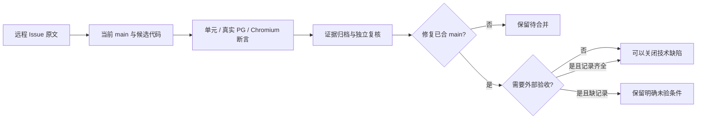
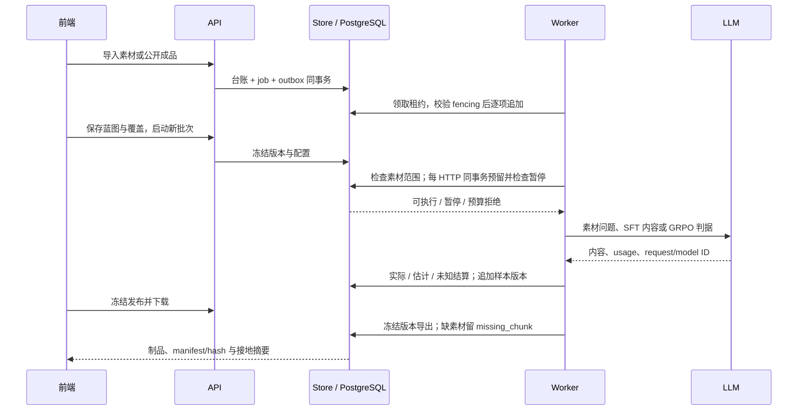
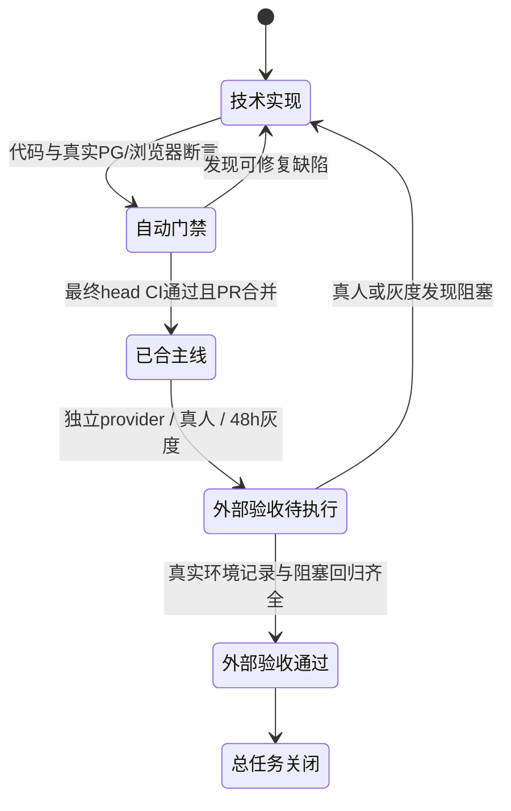

# 远程 Issue 最终交付审计矩阵

审计日期：2026-10-08。目标是让每个远程条目都有代码、验证与合并状态，不以旧关单记录代替当前行为。

本文件初稿在 `fix/TASK-197-final-issue-closure`、基线 `abb73a7` 编写。本次代码基线为 main [`bd439eb`](https://github.com/1420970597/llm/commit/bd439ebae5e25b63419a070986e5e3b9ec885e5f)，包含 #259（`5986da8`）、#261（`6c169af`）、#260（`abb73a7`）、#262（`cd8effc`）及下表五份已合 PR。#266 的工作台、迁移条件与素材 Chromium 门禁，及 #267 真实生成和 GRPO 导出修复均已进入 main。#267 最终 head `476619216c0f19776a9327d40712d198d21782e5` 的 [CI run 37740265957](https://github.com/1420970597/llm/actions/runs/37740265957) 五项全部 SUCCESS；合并提交与该 head 的 Git tree 相同。

远程状态复核：#197 已于 2026-10-08 关闭，[关单评论](https://github.com/1420970597/llm/issues/197#issuecomment-6053549245) 保留固定执行依赖和实际迁移条件的边界。[PR #267](https://github.com/1420970597/llm/pull/267) 于 06:58:50 UTC 合并；它修复批次提交后终态、正文与思考隔离、SFT 占位准入、截断结算、GRPO 自定义档位和默认数组映射，并准确显示目标类型支持的发布格式。真实失败和跨轮恢复记录见 [供应商验收记录](../architecture/source-grounded-acceptance.md)，保留原项目、失败发布和旧映射。跨轮恢复通过不等于精确 main 的全新旅程；后者另行记录。

| 已合 PR | main 提交 | 本次核实的证据 |
| --- | --- | --- |
| #263 模型价格版本配置 | [`9a453e9`](https://github.com/1420970597/llm/commit/9a453e973a52a5eab8b059ec8bf9b43940528ecf) | 管理员连接页保存价格版本，区分免费与估计报价；价格归属及非免费零价格回归，不把估计金额当实际账单 |
| #264 发布、回退与真实故障验收 | [`aef49ad`](https://github.com/1420970597/llm/commit/aef49ad6b34cee6c458b0e5660a3fd2637c048de) | [故障报告](2026-10-studio-failure-validation.md)：真实 Postgres/Redis/MinIO，11/11 必需测试及四个 schema 探针 PASS；发布作业同事务入队、失败状态与固定下载 hash 回归 |
| #265 素材接地与逐请求记账 | [`f10f8fb`](https://github.com/1420970597/llm/commit/f10f8fb5ea8a3247533e9513e40504c0fbcb4229) | [生成与追溯方案](../architecture/source-grounded-generation.md)、[只读盘点](round3-blueprint-workflow-inventory.md)；真实 PG 逐 HTTP 预留/结算、暂停后阻止后续请求与 retry、裁判预算、发布素材擦除回归 |
| #266 工作台、迁移条件与浏览器门禁 | [`e381256`](https://github.com/1420970597/llm/commit/e3812565024e21d402d79e460046f2bb709cac37) | 最终 head `57fb7cd` 的 [CI run 37734281360](https://github.com/1420970597/llm/actions/runs/37734281360)：Backend、Frontend、Integration、Studio failures、Stack 五项 SUCCESS；生产 UI 的五态 Chromium 报告、截图和 trace 归档为 `source217-ui-report` |
| #267 真实生成与 GRPO 导出修复 | [`bd439eb`](https://github.com/1420970597/llm/commit/bd439ebae5e25b63419a070986e5e3b9ec885e5f) | 最终 head `4766192` 的 [CI run 37740265957](https://github.com/1420970597/llm/actions/runs/37740265957) 与合并 main 的 [CI run 37740657964](https://github.com/1420970597/llm/actions/runs/37740657964) 均五项 SUCCESS；本地真 PG 1318 PASS、11 可选 SKIP、必需零缺失；跨轮恢复及精确 main 新项目的 SFT/GRPO 发布与三格式导入均已通过 |

## 判据与证据边界

| 状态 | 判据 | 允许的结论 |
| --- | --- | --- |
| 已合 main | 修复提交可在 main 历史定位，有对应回归或交互证据 | 可以作为对应技术缺陷的关闭依据 |
| 待合并 | 工作树实现或测试已存在，尚未进入 main | 不能据此关闭依赖该实现的总条目 |
| 正在验证 | 新修复或真实旅程仍在运行、复核，最终结果尚未归档并合入 | 不提前记为成功旅程或最终门禁通过 |
| 条件未证实 | 有检测/对账机制，但尚无实际环境证据满足用户条件 | 保留条目中的条件与后续行动 |
| 外部验收未执行 | 独立真实 provider、真实参与者或部署观察尚无记录 | 不用受控 provider、浏览器自动化或短时压测代替 |

真实 Chromium 指真实浏览器执行生产页面，部分测试路由使用受控 API 夹具。真实 PostgreSQL 指临时数据库应用所有迁移后执行真实 Store 事务。两者证明交互和数据库行为，不自动证明模型生成质量、真人可用性或生产运行稳定性。

## Issue #197：17 条用户反馈

原文：[Issue #197](https://github.com/1420970597/llm/issues/197)。远程已关闭，见 [2026-10-08 关单评论](https://github.com/1420970597/llm/issues/197#issuecomment-6053549245)。早期证据见 [逐条修复对照](issue-197-remediation-delivery.md)，最新蓝图闭环见 [蓝图浏览器结果](../audit/issue-197-closure/result.json)。

| 子项 | 当前实现与实际边界 | 代码 / 验证证据 | 合并状态 |
| --- | --- | --- | --- |
| 1 项目分页 | 常显已显示条数、当前页与到底状态；使用服务端游标，不编造总页数 | `ProjectsPages.tsx`；原 #197 分页 DOM 证据 | 已合 main |
| 2 自然语言标准 | 做什么/检查点/具体做法分步表单，JSON 为次视图；真实步骤可排序 | `BlueprintPages.tsx`；#259 Chromium 保存及排序 | 已合 main |
| 3 数据预览 | 问题/推理/答案分字段与原始 JSON 切换，样本版本只读 | `ReviewPages.tsx`；既有审阅浏览器证据 | 已合 main |
| 4 页面超长 | 历史折叠、画布独立滚动、缩放/适应与内部检查器 | #259；390/768/1440px 溢出断言 | 已合 main |
| 5 独立评估难理解 | 检查器先说明作用及执行步骤，再展示配置；实际同源裁判仍被服务端拒绝 | `blueprint_nodes.go`、`QualityPages.tsx`；同源 422 证据 | 已合 main |
| 6 便捷编辑与自动迭代 | 1200ms 自动保存新版本、理由选填、409 保留草稿、请求中继续编辑不丢输入 | #259；11 组真实 Chromium 场景 | 已合 main |
| 7 连接页新增/编辑 | 当前页弹窗，不跳旧控制台；测试连通性与保存分离 | `SettingsPages.tsx`；#214 原测试确认 | 已合 main |
| 8 每项编辑入口 | 每行编辑/启停，留空密钥不覆盖既有配置 | `SettingsPages.tsx`；连接行操作证据 | 已合 main |
| 9 评估/清洗与蓝图联动 | 工作台选项目与不可变蓝图；创建实验消费裁判/seed/SFT 权重；规则预览消费蓝图策略版本。历史模式显式切换，不支持的缺分策略与 GRPO 自定义权重明确阻断，清除深链参数也清除旧上下文 | `blueprintContext.ts`、`LegacyToolPages.tsx`、`QualityPages.tsx`；`project-tools-ui.mjs` 实际请求断言 | #266 已合 main，五项 CI SUCCESS |
| 10 今日工作总览 | 项目/运行/缺口/待判断/近期产出/交付来自真实读模型；待判断与队列统一口径，磁贴有具体跳转 | `activity_store.go`、`TodayPages.tsx`；#200/#205 回归 | 已合 main |
| 11 结构树与工作流 | m×n×z 实际算术、可编辑树、素材块关联；画布表达固定分支依赖、布局拖拽/键盘移动与节点子步骤。执行依赖固定，不承诺任意可编辑执行 DAG | #245/#259/#260；结构树与蓝图 Chromium | 已合 main，固定依赖边界明确 |
| 12 数据与审阅语义 | 数据查看全部内容；审阅默认待判断，行操作与空态不同 | `ReviewPages.tsx`、`routes.ts`；#194 回归 | 已合 main |
| 13 生产预览与自动分析 | 打开即读取样本版本事实，实际字段数、Unicode 字符长度、最近秩 P50/P90 与难度占比；最多 2000 条抽样，不声称 token/全量指标 | #247/#259；`dataset_analysis_test.go` | 已合 main |
| 14 质量文案与模型目录 | 使用“被评测数据集”，裁判目录为可用模型连接；实验冻结裁判模型、接入点与输出上限，每 HTTP 调用受项目/可选批次预算约束 | `QualityPages.tsx`；#211/#238；#265 裁判预算回归；#263 价格版本配置 | 已合 main；预算增量 #265，价格配置 #263 |
| 15 直接建账号 | 用户名/密码建号并加成员同事务，bcrypt、字段校验；账号可实际登录 | `workspace_member_store.go`、`routes_studio_settings.go`；#214 已实测 | 已合 main |
| 16 全迁移后移除入口 | 每资产须有来源键/目标一致且无失败的 completed dataset 台账，并映射到当前账号可访问项目；单 SQL 读错直接报错。壳只在可信 scope、旧资产>0、complete=true、pending=0 时收起主入口；空/部分/错误/无 scope 保留，历史深链只读。2026-10-08 原 `llm` 库只读盘点：53 个旧 dataset、9 条 completed dataset 台账（failed_items 合计 0）、9 个 distinct legacy_dataset_id 映射；账号 1 按成功台账与成员可访问映射仍有 44 pending，因此实际未全迁移，菜单应保留 | `legacy_import_store_test.go`、`StudioLayout.tsx`；`project-tools-ui.mjs` 五种对账状态与只读深链；本次仅 SELECT 的账号 1 对账 | 条件隐藏机制 #266 已合 main；此次数字只代表原 `llm` 环境账号 1 的快照，不代表所有账号范围；未批量迁移或删除 |
| 17 样式与长文本 | 列头、折行、窄屏卡片、加载容器、Markdown 全树守卫；最新页面另有五态/长文本 Chromium 门禁 | `styles.css`、冻结守卫、T29 证据；PR #266 source/workbench 浏览器测试 | 既有修复与 #266 新增门禁均已合 main |

第 9 条是本轮新增的原生工作台联动；第 16 条的原 `llm` 库账号 1 真实盘点明确未全迁移，不能以 9 条成功台账推导 53 个资产全部完成。其他账号与后续时刻必须重新按权限范围查询。第 11 条的布局拖拽与固定依赖展示不能被描述为任意执行 DAG 编辑。

## Issue #214：14 条缺陷索引

原文：[Issue #214](https://github.com/1420970597/llm/issues/214)。旧报告中的“本轮未做”是当时状态，最新 main 与后续 PR 必须覆盖它。以下均可定位到 main 修复；总索引不因为历史报告没有更新而要求重复实现。

| 子 Issue | 修复事实 | 验证与最新补充 | 状态 |
| --- | --- | --- | --- |
| #200 待判断恒 0 | 总览/今日工作/队列共用当前版本审阅口径，缺投影按 pending | `TestOverviewPendingReviewMatchesQueue`、`TestTodosPendingReviewMatchesQueue`、`TestCountPendingReviewSamplesByProjectMatchesQueue`；#262 当前版本边界回归 | 已合 main |
| #201 已完成 1/4 | 聚合复核历史终态与计划缺口，维护循环可达；继续命令同事务派作业 | `TestRefreshBatchCountsCorrectsStaleCompletedWithShortfall`；[第 3 轮报告](../audit/issue-214/REPORT-round3.md) | 已合 main |
| #202 12/12 失败仍运行 | 无活作业/在途时按事实收敛；无待办恢复不生成僵尸 | `TestRefreshBatchCountsConvergesZombieRunningBatch`、`TestResumeBatchEnqueuesJobWithoutClaimingZombie`；#258 复核 | 已合 main |
| #203 未审阅范围说已接纳 | 冻结意图显式，候选门槛继续阻断 pending，不把范围选择当处置 | #234/#253；`TestCreateCandidateBlocksPendingReview` | 已合 main |
| #204 靠后节点不可达 | 深链选中节点进入可视区，URL/检查器一致；补滚动提示、缩放与适应 | #235/#259；[最新复核](../audit/issue-204/README.md) | 已合 main |
| #205 总览磁贴自指 | 运行/缺口/产出导向对应资源与筛选 | `TodayPages.tsx`；#214 对应前后 href 证据 | 已合 main |
| #206 时间线英文键 | Batch 事件取完整中文展示映射，内部 code 不作主文案 | `TestBatchEventLabelsCoverModelConstants`；#214 时间线截图 | 已合 main |
| #207 J/K 帮助承诺 | 审阅 J/K 实际切换，输入状态不劫持键盘 | #214 键盘浏览器证据、审阅守卫 | 已合 main |
| #208 缺口原因写死 | 从失败事实归纳原因，共用可操作建议；未创建单元不归咎素材 | `ShortfallNote`、`ErrorClassAction`；第 3 轮真实批次报告 | 已合 main |
| #209 空连接/非法地址 | 连接保存与可选目录共用可用性规则，未配置连接不混入 | #238 `2717bd4`；连接与 API 边界测试、#256 复核 | 已合 main |
| #210 动态只跳概览 | 事件资源目标与 ID 决定真实详情路径 | `activity_store.go`；#214 资源跳转证据 | 已合 main |
| #211 检查范围英文枚举 | 未审阅中文标签、行内提示与提交前范围说明 | #240 `0fca97e`；全树冻结守卫、#255 复核 | 已合 main |
| #212 阶段进度恒空 | 阶段来自 batch_items 事实投影，runner 和维护循环都可收敛 | #241 `77e5b07`；`TestBatchStepsProjectedFromItemFacts` 与历史/重试/跳过真实 PG 回归 | 已合 main |
| #213 checkbox 无名/字段错误丢失 | 必填复选框可访问名；多个字段错误同时显示 | #214 字段错误与可访问性取证 | 已合 main |

## Issue #217：20 个分步任务

依据：[Issue #217](https://github.com/1420970597/llm/issues/217) 与 [公开成品导入契约](external-product-import-contract.md)。公开 JSONL/Alpaca/ShareGPT 格式是接入边界；没有 Easy Dataset 私有 API、SQLite 或上游代码依赖。ShareGPT 保留全部完整历史轮次，主 question/answer 取最后一个完整轮次。成品导入不调用模型、不冒充素材接地；Markdown/TXT 素材路径也不以 PDF/DOCX 伪实现充数。

| 任务 | 实际落点与验收证据 | 状态 |
| --- | --- | --- |
| A1 覆盖类型与配额 | `CoverageDirection.SourceChunkIDs`、来源枚举、负配额/无块/跨项目校验；显式来源零配额为缺口、不分配单元；已有空来源版本保留旧容量语义，自动生成不得默默降级 | #261/#265 已合；`TestExplicitSourceZeroQuotaIsGapAndLegacyCapacityIsPreserved`、`TestAllocateUnitsFreezesSourceAndKeepsExplicitGaps` |
| A2 计划容量闸门 | 统一覆盖容量与实际分配数；超容量字段级 422；完成不足不得声明 completed | 既有 #190/#201 修复已合，真实 PG 回归 |
| A3 目标结构树 | `TargetStructurePage.tsx` 注册实际路由；m×n×z、配额与来源可编辑，关联真实块 | #260 已合；`source217-ui.mjs` |
| B1 迁移与 smoke | source 文档/块/采集台账迁移，`db-migrate-smoke` 全迁移执行；新迁移只追加 | #261 已合；migration_smoke 守卫与真实 PG 全迁移 |
| B2 第六类 source 文档 | 原文档路由机制增加 source 显式复数映射与解码，新 schema 校验、项目版本摘要与冻结读取 | #261 已合；`TestSourceRoutesRequireAuthentication` |
| B3 确定性分块 | `internal/import/source_document.go`；标题路径、Unicode、空文件、UTF-8、超长段落硬切 | #261 已合；两条分块正常/异常测试 |
| B4 素材 Store 与上传 | 去重块、分页、200MB 边界、MD/TXT 白名单、403/413/415、正文不进 job/Redis | #261 已合；真实 HTTP+PG 上传/越权/类型回归 |
| B5 采集台账复用 | `legacy_imports` 新 source_kind 与 actor 快照，来源键绑定项目，行级去重与游标对账 | #261 已合；真实 PG replay/租户作用域测试 |
| B6 持久 worker 采集 | Studio job/outbox、租约/fencing 校验后提交块与进度；完成追加冻结来源版本 | #261 已合；`TestSourceImportFencesStaleSideEffectsAndRejectsEncoding` |
| B7 素材页面五态 | 来源目录、章节/块预览、切分设置与上传；影响范围说明、版本冻结与历史查看 | #260/#266 已合；强化五态 Chromium CI 与报告已交付 |
| C1 公开格式映射 | Alpaca/JSONL/完整多轮 ShareGPT；缺字段/类型/不完整轮次逐行失败；不伪造推理 | #261 已合；`TestProductPublicFormatsAndFailureLineNumbers`、`TestProductMultiTurnPreservedAndIncompleteRejected` |
| C2 成品导入 | 20MB/5000 行；预检零写入、异步 durable 导入；明确 external_import，GRPO 项目 422 | #261 已合；真实 HTTP/PG 重放、逐行失败、计数对账 |
| C3 导入向导 | 选格式→上传→只显示实际字段→预检→提交，成品无需模型预算 | #260/#266 已合；新增五态浏览器门禁与报告已交付 |
| C4 契约与样例 | 上述公开契约、固定 `test/fixtures/source-import/` 三格式与真实映射测试 | #261 已合；`TestProductContractFixtures` |
| D1 历史模板盘点 | 只读查询 68 个 sample_versions，编号模板 1 个（项目 13/批次 12）；不改写旧版本；该盘点不证明其余样本事实质量 | #265 已合；[盘点报告与 SQL](round3-blueprint-workflow-inventory.md) |
| D2 真问题生成 | SFT/GRPO 共用 questionFor；蓝图→素材版本→块 ID 冻结与项目作用域；AI 必须显式、document 有正文；32000 字符上限 | #265/#267 已合；[生成方案](../architecture/source-grounded-generation.md) 与正常/越界/无来源回归；[真实验收记录](../architecture/source-grounded-acceptance.md) 保留失败和成功运行的各自范围 |
| D3 发布接地追溯 | 保存 source_chunk_ids；冻结样本版本导出 source/ID/hash/章节；删块或擦除正文保留 missing_chunk，制品字节不改 | #265 已合；`TestGroundingReferencesPreserveMissingEvidenceAndExternalImports`、真实 PG `TestReleaseGroundingPersistsAndSurvivesSourceErasure` |
| E1 全量质量门 | Docker Go 格式/vet/build/test、真实 PG 必需测试、前端 build、全迁移、文档与冻结守卫；以最终合并 head 的 CI 为准 | #267 最终 head 与合并 main `bd439eb` 均五项 CI SUCCESS；本地真 PG 1318 PASS、11 可选 SKIP、必需零缺失，43 个迁移及前端 build、24 个冻结守卫通过 |
| E2 五态/溢出 CI | 生产目标结构/素材/导入、项目评估/清洗的真实 Chromium、1440/390、请求 payload 与错误恢复门禁；report/trace/screenshot artifacts | #266 已合的门禁在 #267 最终 head 与精确 main 的 CI 重新执行且 SUCCESS，`source217-ui-report` 可复查。使用生产 UI 与受控 API；后端真实数据流由供应商旅程单独验证 |
| E3 文档证据 | 公开导入契约、素材/目标结构原型、蓝图交付、本矩阵及 [供应商验收记录](../architecture/source-grounded-acceptance.md) | 精确 main 全新旅程 passed；结果 JSON、版本绑定、两份 manifest 和实际发布截图已归档，失败与跨轮恢复历史保留 |

### 原计划与实现差异

| 原计划表达 | 最终实现与理由 |
| --- | --- |
| C2 请求内同步成品写入 | 改为同事务台账/job/outbox，worker 按行租约校验提交；20MB/5000 行不会把复杂导入放入 handler |
| 内容变化后二次导入 | 同来源键绑定原内容与策略，变更返回 409；新内容使用新来源键，按内容 hash 跳过已有行、仅追加新内容，不覆盖旧版本 |
| 复用采集台账与导入基础设施 | 复用 legacy_imports、既有样本追加和 Studio 作业；公开格式解析放在 internal/import，不创建平行导入台账 |
| PDF/DOCX 文档来源 | 本轮只承诺原生 MD/TXT；PDF/DOCX 返回 415，目录枚举未实现也不暴露按钮 |
| 项目乘积必须永远等于覆盖配额 | 项目 m×n×z 为初始估算，覆盖配额为执行容量；界面显示差异，批次不得超冻结容量，避免使既有版本失效 |
| 删除或改写模板问题 | D1 零写入保留历史；新批次追加真实问题与接地引用，审阅/候选显式选择版本 |

## Issue #160：技术证据与真实验收分别记录

| 项 | 已有证据 | 未完成或不能替代的部分 |
| --- | --- | --- |
| T07 请求预算与暂停 | #265 已合：每 HTTP 尝试先事务预留再结算，成功/空响应/解码失败/重试各留账；真实 PG `TestStudioAccountingWritesEachReceiptAndUnknownCost`、`TestReserveUsageChecksBatchPauseInTransaction`；`TestStudioAccountingPauseBlocksNextStepAndHTTPRetry` 的 next-step/http-retry 两路径证实在途结算、暂停后零新增请求、显式恢复可继续；裁判冻结输出上限；#263 已合价格配置 | HTTP 回归使用受控模型响应与真实 PG，不能称真实供应商成功旅程；未知费用不记 0，估计价格不冒充实际账单 |
| T29 浏览器交互 | `t29_measure.mjs`，13/13；断网草稿/同步、390/768/1440、键盘与页面几何，证据归档已存在 | 44px 以下控件仍有读数；真实浏览器测试不是 5–8 名真人会话 |
| T29 十万基准 | #262 真 PG 100K；2 CPU/2GiB，单并发与 4 并发，before/after JSON、完整 EXPLAIN；首页 P95 378.98→5.08ms | 不含 HTTP/前端/LLM，不以本机测量承诺生产 SLA；准确待审计数仍为 O(n) |
| T32 故障和 CI | #264 已合：[真实故障验收](2026-10-studio-failure-validation.md) 11/11 必需测试 PASS，真实 Redis stop/start、MinIO 签名拒绝与修复、schema999、租约/fencing、开关回退和固定下载 hash；fresh/current/future rejected/recovered 四个 schema 探针 PASS；#266 新增素材/工作台 Chromium CI 已合，五项 CI SUCCESS | Chromium 使用生产 UI 与受控 API；11/11 故障验收不调用商业模型，不替代连续灰度或真人会话；后续新修复须单独通过最终 head 门禁 |
| T33 灰度/回退 | #264 已合：真实服务故障、API/worker 不兼容消息、回退停止写入且已发布文件仍可固定下载；开关、health、schema 兼容与 runbook 已交付 | runbook §4 的连续 48 小时真实部署灰度、生产版本观察和 SLO 标定仍未验；临时故障演练不等于已做生产灰度 |
| T34 真人与真实 provider | 任务脚本、三角色越权测试、SFT/GRPO 结构与自动路径证据；供应商失败、跨轮恢复和精确 main 技术旅程分别记录在 [真实验收记录](../architecture/source-grounded-acceptance.md) | 5–8 名真实参与者未执行；实际模型仍使用同一 endpoint，不能充当独立裁判；完整真实独立裁判、两个 pilot 同基准比较、scale 与真人证据审阅仍未验 |

[性能报告](https://github.com/1420970597/llm/blob/cd8effc78c84b64a5dc7f48038abe3a3061167cd/docs/architecture/sample-query-performance.md)、[验收协议](atelier-acceptance-protocol.md) 与 [灰度手册](studio-rollout-runbook.md) 分别记录数据库测量、真人任务和部署观察。#160 因 T33/T34 外部验收缺证据保持开放。

### 真实外部模型尝试记录

| 配置 / 请求 | 本轮实际结果 | 可得结论 |
| --- | --- | --- |
| 原配置连接 1：`global:deepseek-v4.1-flash` | 真实外部请求返回 HTTP 404 | 接入尝试失败，不计为生成、独立评估或发布旅程成功 |
| 原配置连接 33：`global:hy4-preview` | 真实外部请求返回 HTTP 404 | 接入尝试失败；无法据此证明模型输出质量或完整业务旅程 |
| 原配置连接 34：`global:hy3` | 最小真实请求返回 HTTP 404 / `model_not_found` | 接入尝试失败，不是正在运行生成旅程的连接 |
| 隔离库 provider 1：`deepseek-v4.1-flash` | `GET /models` 返回 HTTP 200 后使用目录正式名；跨轮 SFT/GRPO 恢复、三格式导入和下载哈希均通过，详见 [验收记录](../architecture/source-grounded-acceptance.md) | 未改原配置；同一 endpoint 的技术运行不等于独立质量验收；费用为 estimated，不能作为实际账单 |
| 隔离库真实项目 4 | SFT 产出含省略号占位内容，被严格验收拒绝，未发布 | 历史失败保留；相关准入与截断结算修复已合 #267，精确 main 全新项目 9、10 的复验成功另记 |
| 隔离库真实项目 5、8 | 项目 5 有效 SFT 发布 2；项目 8 有效 GRPO 使用新映射 73 发布 5；恢复运行 `2026-10-08T06-47-29-957Z` 通过 | 混合版本跨轮恢复；保留旧映射 67/失败发布 4，未重复模型调用；不能写成精确 main 单次全新生成 |
| 精确 main 全新项目 9、10 | `bd439eb` 三服务一致；运行 `2026-10-08T07-06-05-325Z` passed，phaseErrors 为空；SFT 发布 7、GRPO 发布 9 下载/hash/完整数组通过 | 无 resume/repair，直接使用 GRPO 原生默认映射；三格式导入/重放、逐行失败和冻结 SFT 文件不变通过；费用 estimated，不等于独立质量或真人验收 |

连接编号只标识本次隔离验收使用的配置，不代表跨部署稳定身份；这里不保存凭证。自动化提交的接纳决定只用于结构、引用和门槛检查，不充当真人审阅或独立质量判断。404 探针和项目 4 原失败的完整执行 SHA 未独立证实，不归因于精确 main；已知混合版本及运行 ID 见 [验收环境与失败记录](../architecture/source-grounded-acceptance.md)。成功记录保留失败历史，另记环境、版本和范围。

`test/audit/source-grounded-journey.mjs` 的验收范围为单个 pilot、同源裁判拒绝、规则预览、自动接纳、pending 发布阻断与固定下载 hash。本次成功补齐了对应工程运行证据；两个 pilot 的同基准比较、scale、真实人工审阅与独立裁判仍须另有执行记录。

### #160 尚需的外部验收资源与原始记录

| 未完成验收 | 需要的真实资源 | 关单所需原始记录 | 当前不能替代它的证据 |
| --- | --- | --- | --- |
| T34 真人任务 | 5–8 名真实数据研发参与者，覆盖 owner/reviewer/viewer；须提供真实可用部署、模型与结果存储 | 两版 pilot 同基准比较、scale、异常恢复、证据审阅与发布下载的任务结果；首次点击、迷路/回退、阻塞、帮助次数、原话及阻塞问题复验 | 自动浏览器、脚本自动接纳与虚构参与者不能生成真人研究记录 |
| T34 独立质量旅程 | 与生成端实际不同的裁判接入点及可用模型配置；SFT、GRPO 的真实数据、预算与存储 | 冻结生成/裁判配置与实际接入点、provider 回执及用量/费用状态、完整质量报告、人工判断、发布 ID 和固定下载 hash | 同 endpoint 的新连接或模型别名、规则预览和本地确定性裁判不能证明独立外部评估 |
| T33 连续灰度与 SLO | runbook 第 4 节规定的真实部署、1–2 个 SFT 新项目和 1 个 GRPO 项目，至少连续 48 小时观察窗口 | 起止时间、实际版本、队列/租约/outbox/未知成本/发布失败的 health 记录、阶段推进与回退记录、由真实基线标定的 SLO | 临时容器故障 11/11、100K 查询基准或跳过 48 小时等待不能证明真实运行稳定性 |

这些是既有 #160 验收要求的资源与记录落点，不能通过修改勾选状态、复制同源连接、模拟访谈或把短时测试改名为灰度来补齐。

## 最终复核与关单顺序

代码按 main `bd439eb` 核实，#263–#267 均已合。#267 最终 PR head 与合并 main 五项 CI 全部 SUCCESS；本地同版本 Docker Go 格式/vet/build 与真实 PG 1318 PASS、必需零缺失，43 个迁移冒烟、前端 build、24 个冻结守卫均通过。#217 的 20 项已有逐项落点，E1/E2 门禁在精确 main 再执行，E3 全新供应商旅程及版本/manifest/截图已归档，可据此关单。

#197 已按技术证据关闭；第 16 条原 `llm` 库账号 1 仍有 44/53 pending，菜单保留符合实际，修复不要求批量迁移或删除旧数据。#214/#204 的当前技术行为可据表中证据判断。#160 的完整真实独立质量旅程、真人会话与连续灰度仍缺上表资源对应的执行记录，保持开放。

独立复核者应从本文件直接回答：哪些修复尚未进入 main；Easy Dataset 接入到底依赖什么；同源裁判为何被拒；历史模板与删除素材如何处理；性能数字覆盖哪些层；为什么 #160 仍未完成。若需要依赖对话才能回答，先补证据或说明再关单。
