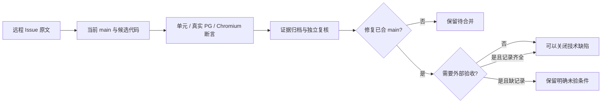
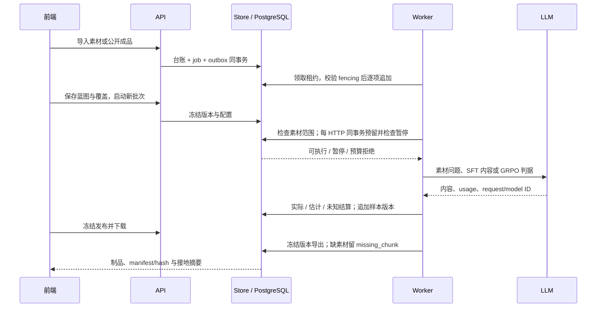
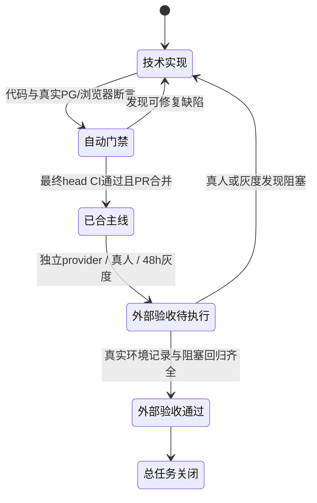

# 远程 Issue 最终交付审计矩阵

审计日期：2026-10-08。目标是让每个远程条目都有代码、验证与合并状态，不以旧关单记录代替当前行为。

本文件初稿在 `fix/TASK-197-final-issue-closure`、基线 `abb73a7` 编写。已核实 main 包含 #259（`5986da8`）、#261（`6c169af`）、#260（`abb73a7`）与 #262（`cd8effc`）。生成接地、裁判预算和模型价格修复由另一工作分支交付；本分支交付工作台联动与 Chromium CI。它们进入 main 且门禁通过前，下表仍保持“待合并”。

## 判据与证据边界

| 状态 | 判据 | 允许的结论 |
| --- | --- | --- |
| 已合 main | 修复提交可在 main 历史定位，有对应回归或交互证据 | 可以作为对应技术缺陷的关闭依据 |
| 待合并 | 工作树实现或测试已存在，尚未进入 main | 不能据此关闭依赖该实现的总条目 |
| 条件未证实 | 有检测/对账机制，但尚无实际环境证据满足用户条件 | 保留条目中的条件与后续行动 |
| 外部验收未执行 | 独立真实 provider、真实参与者或部署观察尚无记录 | 不用受控 provider、浏览器自动化或短时压测代替 |

真实 Chromium 指真实浏览器执行生产页面，部分测试路由使用受控 API 夹具。真实 PostgreSQL 指临时数据库应用所有迁移后执行真实 Store 事务。两者证明交互和数据库行为，不自动证明模型生成质量、真人可用性或生产运行稳定性。

## Issue #197：17 条用户反馈

原文：[Issue #197](https://github.com/1420970597/llm/issues/197)。早期证据见 [逐条修复对照](issue-197-remediation-delivery.md)，最新蓝图闭环见 [蓝图浏览器结果](../audit/issue-197-closure/result.json)。

| 子项 | 当前实现与实际边界 | 代码 / 验证证据 | 合并状态 |
| --- | --- | --- | --- |
| 1 项目分页 | 常显已显示条数、当前页与到底状态；使用服务端游标，不编造总页数 | `ProjectsPages.tsx`；原 #197 分页 DOM 证据 | 已合 main |
| 2 自然语言标准 | 做什么/检查点/具体做法分步表单，JSON 为次视图；真实步骤可排序 | `BlueprintPages.tsx`；#259 Chromium 保存及排序 | 已合 main |
| 3 数据预览 | 问题/推理/答案分字段与原始 JSON 切换，样本版本只读 | `ReviewPages.tsx`；既有审阅浏览器证据 | 已合 main |
| 4 页面超长 | 历史折叠、画布独立滚动、缩放/适应与内部检查器 | #259；390/768/1440px 溢出断言 | 已合 main |
| 5 独立评估难理解 | 检查器先说明作用及执行步骤，再展示配置；实际同源裁判仍被服务端拒绝 | `blueprint_nodes.go`、`QualityPages.tsx`；同源 422 证据 | 已合 main |
| 6 便捷编辑与自动迭代 | 1200ms 自动保存新版本、理由选填、409 保留草稿、请求中继续编辑不丢输入 | #259；11 组真实 Chromium 场景 | 已合 main |
| 7 连接页新增/编辑 | 当前页弹窗，不跳旧控制台；测试连通性与保存分离 | `SettingsPages.tsx`；#214 原测试确认 | 已合 main |
| 8 每项编辑入口 | 每行编辑/启停，留空密钥不覆盖既有配置 | `SettingsPages.tsx`；连接行操作证据 | 已合 main |
| 9 评估/清洗与蓝图联动 | 工作台选项目与不可变蓝图；创建实验消费裁判/seed/SFT 权重；规则预览消费蓝图策略版本。历史模式显式切换，不支持的缺分策略与 GRPO 自定义权重明确阻断，清除深链参数也清除旧上下文 | `blueprintContext.ts`、`LegacyToolPages.tsx`、`QualityPages.tsx`；`project-tools-ui.mjs` 实际请求断言 | 本审计 PR 验证，待合 main |
| 10 今日工作总览 | 项目/运行/缺口/待判断/近期产出/交付来自真实读模型；待判断与队列统一口径，磁贴有具体跳转 | `activity_store.go`、`TodayPages.tsx`；#200/#205 回归 | 已合 main |
| 11 结构树与工作流 | m×n×z 实际算术、可编辑树、素材块关联；画布表达固定分支依赖、布局拖拽/键盘移动与节点子步骤。执行依赖固定，不承诺任意可编辑执行 DAG | #245/#259/#260；结构树与蓝图 Chromium | 已合 main，固定依赖边界明确 |
| 12 数据与审阅语义 | 数据查看全部内容；审阅默认待判断，行操作与空态不同 | `ReviewPages.tsx`、`routes.ts`；#194 回归 | 已合 main |
| 13 生产预览与自动分析 | 打开即读取样本版本事实，实际字段数、Unicode 字符长度、最近秩 P50/P90 与难度占比；最多 2000 条抽样，不声称 token/全量指标 | #247/#259；`dataset_analysis_test.go` | 已合 main |
| 14 质量文案与模型目录 | 使用“被评测数据集”，裁判目录为可用模型连接；实验输出上限冻结由预算修复追加 | `QualityPages.tsx`；#211/#238；新增裁判预算测试 | 文案/目录已合；预算增量待合 |
| 15 直接建账号 | 用户名/密码建号并加成员同事务，bcrypt、字段校验；账号可实际登录 | `workspace_member_store.go`、`routes_studio_settings.go`；#214 已实测 | 已合 main |
| 16 全迁移后移除入口 | 每资产须有来源键/目标一致且无失败的 completed dataset 台账，并映射到当前账号可访问项目；单 SQL 读错直接报错。壳只在可信 scope、旧资产>0、complete=true、pending=0 时收起主入口；空/部分/错误/无 scope 保留，历史深链只读。实际部署未全迁移时应保留菜单 | `legacy_import_store_test.go`、`StudioLayout.tsx`；`project-tools-ui.mjs` 五种对账状态与只读深链 | 条件隐藏机制在本 PR，待合 main；不执行批量迁移 |
| 17 样式与长文本 | 列头、折行、窄屏卡片、加载容器、Markdown 全树守卫；最新页面另有五态/长文本 Chromium 门禁 | `styles.css`、冻结守卫、T29 证据；本 PR source/workbench 浏览器测试 | 既有修复已合；新增门禁待合 |

第 9 条是本轮新增的原生工作台联动；第 16 条有条件隐藏机制及回归，实际全迁移结论仍须真实台账证据。第 11 条的布局拖拽与固定依赖展示不能被描述为任意执行 DAG 编辑。

## Issue #214：14 条缺陷索引

原文：[Issue #214](https://github.com/1420970597/llm/issues/214)。旧报告中的“本轮未做”是当时状态，最新 main 与后续 PR 必须覆盖它。以下均可定位到 main 修复；总索引不因为历史报告没有更新而要求重复实现。

| 子 Issue | 修复事实 | 验证与最新补充 | 状态 |
| --- | --- | --- | --- |
| #200 待判断恒 0 | 总览/今日工作/队列共用当前版本审阅口径，缺投影按 pending | `TestOverviewPendingReviewMatchesQueue`、`TestTodosPendingReviewMatchesQueue`、`TestCountPendingReviewSamplesByProjectMatchesQueue`；#262 当前版本边界回归 | 已合 main |
| #201 已完成 1/4 | 聚合复核历史终态与计划缺口，维护循环可达；继续命令同事务派作业 | `TestRefreshBatchCountsCorrectsStaleCompletedWithShortfall`；[第 3 轮报告](../audit/issue-214/REPORT-round3.md) | 已合 main |
| #202 12/12 失败仍运行 | 无活作业/在途时按事实收敛；无待办恢复不生成僵尸 | `TestRefreshBatchCountsConvergesZombieRunningBatch`、`TestResumeBatchEnqueuesJobWithoutClaimingZombie`；#258 复核 | 已合 main |
| #203 未审阅范围说已接纳 | 冻结意图显式，候选门槛继续阻断 pending，不把范围选择当处置 | #234/#253；`TestCreateCandidateBlocksPendingReview` | 已合 main |
| #204 靠后节点不可达 | 深链选中节点进入可视区，URL/检查器一致；补滚动提示、缩放与适应 | #235/#259；[最新复核](../audit/issue-204/README.md) | 已合 main |
| #205 总览磁贴自指 | 运行/缺口/产出导向对应资源与筛选 | `TodayPages.tsx`；#214 对应前后 href 证据 | 已合 main |
| #206 时间线英文键 | Batch 事件取完整中文展示映射，内部 code 不作主文案 | `TestBatchEventLabelsCoverModelConstants`；#214 时间线截图 | 已合 main |
| #207 J/K 帮助承诺 | 审阅 J/K 实际切换，输入状态不劫持键盘 | #214 键盘浏览器证据、审阅守卫 | 已合 main |
| #208 缺口原因写死 | 从失败事实归纳原因，共用可操作建议；未创建单元不归咎素材 | `ShortfallNote`、`ErrorClassAction`；第 3 轮真实批次报告 | 已合 main |
| #209 空连接/非法地址 | 连接保存与可选目录共用可用性规则，未配置连接不混入 | #238 `2717bd4`；连接与 API 边界测试、#256 复核 | 已合 main |
| #210 动态只跳概览 | 事件资源目标与 ID 决定真实详情路径 | `activity_store.go`；#214 资源跳转证据 | 已合 main |
| #211 检查范围英文枚举 | 未审阅中文标签、行内提示与提交前范围说明 | #240 `0fca97e`；全树冻结守卫、#255 复核 | 已合 main |
| #212 阶段进度恒空 | 阶段来自 batch_items 事实投影，runner 和维护循环都可收敛 | #241 `77e5b07`；`TestBatchStepsProjectedFromItemFacts` 与历史/重试/跳过真实 PG 回归 | 已合 main |
| #213 checkbox 无名/字段错误丢失 | 必填复选框可访问名；多个字段错误同时显示 | #214 字段错误与可访问性取证 | 已合 main |

## Issue #217：20 个分步任务

依据：[Issue #217](https://github.com/1420970597/llm/issues/217) 与 [公开成品导入契约](external-product-import-contract.md)。公开 JSONL/Alpaca/ShareGPT 格式是接入边界；没有 Easy Dataset 私有 API、SQLite 或上游代码依赖。ShareGPT 保留全部完整历史轮次，主 question/answer 取最后一个完整轮次。成品导入不调用模型、不冒充素材接地；Markdown/TXT 素材路径也不以 PDF/DOCX 伪实现充数。

| 任务 | 实际落点与验收证据 | 状态 |
| --- | --- | --- |
| A1 覆盖类型与配额 | `CoverageDirection.SourceChunkIDs`、来源枚举、负配额/无块/跨项目校验；已有空来源版本兼容，但运行不得默默降级 | #261 已合；显式来源零配额运行边界增量待合 |
| A2 计划容量闸门 | 统一覆盖容量与实际分配数；超容量字段级 422；完成不足不得声明 completed | 既有 #190/#201 修复已合，真实 PG 回归 |
| A3 目标结构树 | `TargetStructurePage.tsx` 注册实际路由；m×n×z、配额与来源可编辑，关联真实块 | #260 已合；`source217-ui.mjs` |
| B1 迁移与 smoke | source 文档/块/采集台账迁移，`db-migrate-smoke` 全迁移执行；新迁移只追加 | #261 已合；migration_smoke 守卫与真实 PG 全迁移 |
| B2 第六类 source 文档 | 原文档路由机制增加 source 显式复数映射与解码，新 schema 校验、项目版本摘要与冻结读取 | #261 已合；`TestSourceRoutesRequireAuthentication` |
| B3 确定性分块 | `internal/import/source_document.go`；标题路径、Unicode、空文件、UTF-8、超长段落硬切 | #261 已合；两条分块正常/异常测试 |
| B4 素材 Store 与上传 | 去重块、分页、200MB 边界、MD/TXT 白名单、403/413/415、正文不进 job/Redis | #261 已合；真实 HTTP+PG 上传/越权/类型回归 |
| B5 采集台账复用 | `legacy_imports` 新 source_kind 与 actor 快照，来源键绑定项目，行级去重与游标对账 | #261 已合；真实 PG replay/租户作用域测试 |
| B6 持久 worker 采集 | Studio job/outbox、租约/fencing 校验后提交块与进度；完成追加冻结来源版本 | #261 已合；`TestSourceImportFencesStaleSideEffectsAndRejectsEncoding` |
| B7 素材页面五态 | 来源目录、章节/块预览、切分设置与上传；影响范围说明、版本冻结与历史查看 | #260 已合；本 PR 强化五态 Chromium CI 待合 |
| C1 公开格式映射 | Alpaca/JSONL/完整多轮 ShareGPT；缺字段/类型/不完整轮次逐行失败；不伪造推理 | #261 已合；`TestProductPublicFormatsAndFailureLineNumbers`、`TestProductMultiTurnPreservedAndIncompleteRejected` |
| C2 成品导入 | 20MB/5000 行；预检零写入、异步 durable 导入；明确 external_import，GRPO 项目 422 | #261 已合；真实 HTTP/PG 重放、逐行失败、计数对账 |
| C3 导入向导 | 选格式→上传→只显示实际字段→预检→提交，成品无需模型预算 | #260 已合；本 PR 新五态浏览器门禁待合 |
| C4 契约与样例 | 上述公开契约、固定 `test/fixtures/source-import/` 三格式与真实映射测试 | #261 已合；`TestProductContractFixtures` |
| D1 历史模板盘点 | 只读查询 68 个 sample_versions，编号模板 1 个（项目 13/批次 12）；不改写旧版本 | 另一工作分支报告与 SQL 已完成，待合 main |
| D2 真问题生成 | SFT/GRPO 共用 questionFor；蓝图→素材版本→块 ID 冻结与项目作用域；AI 必须显式、document 有正文；32000 字符上限 | 另一工作分支实现与正常/越界/无来源回归已完成，待合 main |
| D3 发布接地追溯 | 保存 source_chunk_ids；冻结样本版本导出 source/ID/hash/章节；删块或擦除正文保留 missing_chunk，制品字节不改 | 另一工作分支真实 PG 发布/擦除回归已完成，待合 main |
| E1 全量质量门 | Docker Go 格式/vet/build/test、真实 PG 必需测试、前端 build、全迁移、文档与冻结守卫；以最终合并 head 的 CI 为准 | 各阶段已执行；最终生成/预算 PR 与本审计 PR 尚待最终 CI/合并 |
| E2 五态/溢出 CI | 生产目标结构/素材/导入、项目评估/清洗的真实 Chromium、1440/390、请求 payload 与错误恢复门禁；report/trace/screenshot artifacts | 本审计 PR 实现与验证，待合 main |
| E3 文档证据 | 公开导入契约、素材/目标结构原型、蓝图交付与本矩阵；D1/D2/D3 报告由对应实现一并交付 | 已合文档与待合文档分别保留状态；最后统一复核 |

### 原计划与实现差异

| 原计划表达 | 最终实现与理由 |
| --- | --- |
| C2 请求内同步成品写入 | 改为同事务台账/job/outbox，worker 按行租约校验提交；20MB/5000 行不会把复杂导入放入 handler |
| 复用采集台账与导入基础设施 | 复用 legacy_imports、既有样本追加和 Studio 作业；公开格式解析放在 internal/import，不创建平行导入台账 |
| PDF/DOCX 文档来源 | 本轮只承诺原生 MD/TXT；PDF/DOCX 返回 415，目录枚举未实现也不暴露按钮 |
| 项目乘积必须永远等于覆盖配额 | 项目 m×n×z 为初始估算，覆盖配额为执行容量；界面显示差异，批次不得超冻结容量，避免使既有版本失效 |
| 删除或改写模板问题 | D1 零写入保留历史；新批次追加真实问题与接地引用，审阅/候选显式选择版本 |

## Issue #160：技术证据与真实验收分别记录

| 项 | 已有证据 | 未完成或不能替代的部分 |
| --- | --- | --- |
| T07 请求预算与暂停 | 真实 PG 预算边界/并发/未知费用；新每 HTTP reserve/settle、裁判冻结输出上限、暂停后阻止单元后续及 retry 的回归 | 新增代码进入 main 和最终门禁前保持待合；未知费用不宣称 0 或账单精确值 |
| T29 浏览器交互 | `t29_measure.mjs`，13/13；断网草稿/同步、390/768/1440、键盘与页面几何，证据归档已存在 | 44px 以下控件仍有读数；真实浏览器测试不是 5–8 名真人会话 |
| T29 十万基准 | #262 真 PG 100K；2 CPU/2GiB，单并发与 4 并发，before/after JSON、完整 EXPLAIN；首页 P95 378.98→5.08ms | 不含 HTTP/前端/LLM，不以本机测量承诺生产 SLA；准确待审计数仍为 O(n) |
| T32 故障和 CI | 真实 PG 必需测试门禁；蓝图 Chromium 已合；本审计 PR 增加素材/工作台 Chromium CI | 独立 Redis/MinIO/schema999/回退下载固定 hash 的新记录由故障注入任务交付，未核实前不宣称完成 |
| T33 灰度/回退 | 开关、health、schema 兼容与 runbook；独立临时栈可自动演练部分故障 | 48 小时真实部署灰度、生产 API/worker 配套和 SLO 标定仍未验；不操作生产凑证据 |
| T34 真人与真实 provider | 任务脚本、三角色越权测试、SFT/GRPO 结构与自动路径证据 | 5–8 名真实参与者未执行；当前同 endpoint 连接不能充当独立裁判，完整真实独立 provider 旅程仍未验 |

[性能报告](https://github.com/1420970597/llm/blob/cd8effc78c84b64a5dc7f48038abe3a3061167cd/docs/architecture/sample-query-performance.md)、[验收协议](atelier-acceptance-protocol.md) 与 [灰度手册](studio-rollout-runbook.md) 分别记录数据库测量、真人任务和部署观察。#160 因 T33/T34 外部验收缺证据保持开放。

## 最终复核与关单顺序

先对最终 main SHA 核对生成/预算 PR 和本审计 PR 的文件与 CI，再把所有“待合并”改为具体 PR/SHA。#214/#204 的当前技术行为可据表中证据判断；#217 在 D1–D3、E1–E3 都进入 main 后核对；#197 第 16 条根据成功台账和可访问映射决定菜单显示，修复不要求批量迁移或删除旧数据。#160 保持外部验收未完成，不能因这些技术修复而一并关闭。

独立复核者应从本文件直接回答：哪些修复尚未进入 main；Easy Dataset 接入到底依赖什么；同源裁判为何被拒；历史模板与删除素材如何处理；性能数字覆盖哪些层；为什么 #160 仍未完成。若需要依赖对话才能回答，先补证据或说明再关单。
