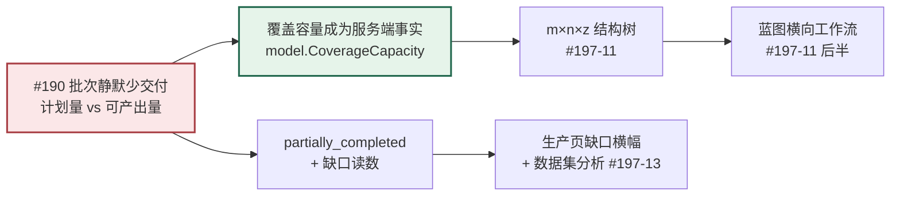
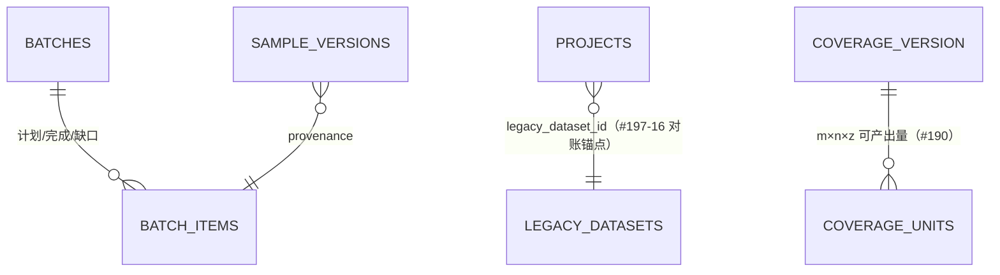
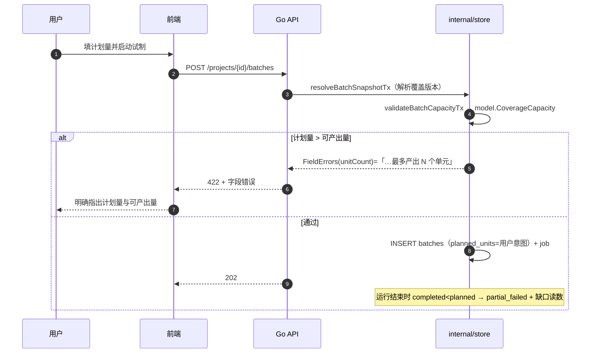
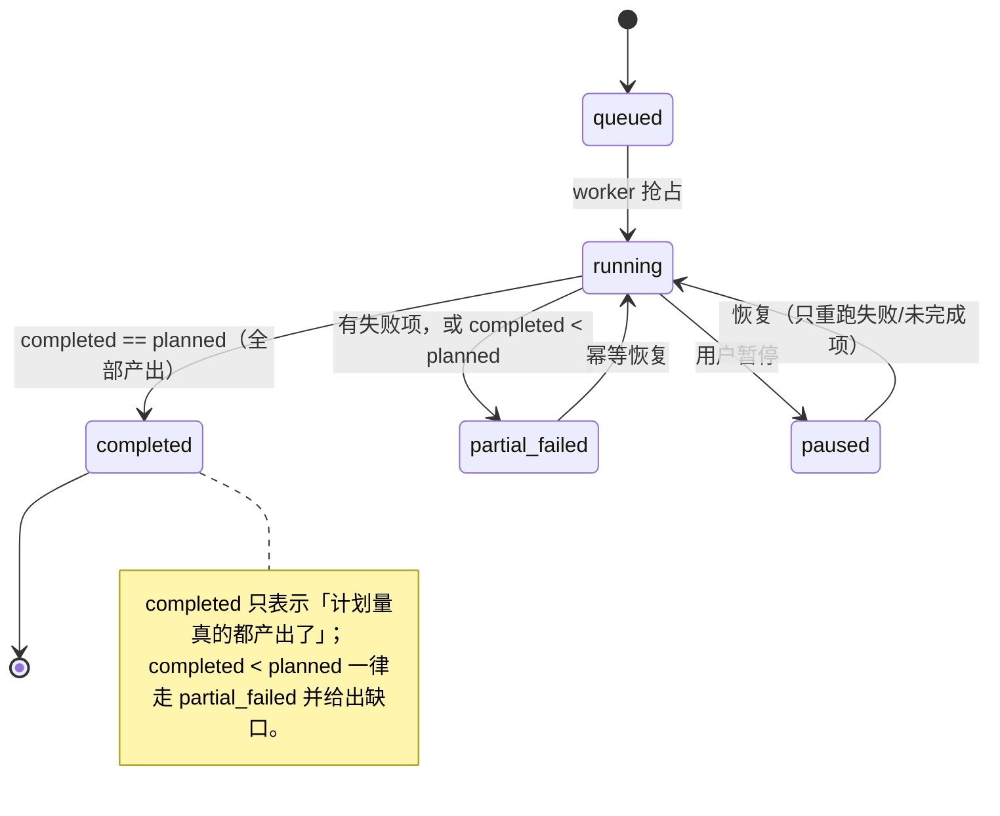

# 用户测试问题逐条落地对照（Issue #197 × #190–#195）

> **状态**：已实现并自测通过（`go vet` / `go build` / `go test`（真实 Postgres）/ `npm run build` 全绿）
> **代码基线**：`origin/main` @ `0b18145`
> **实现分支**：`feat/TASK-197-user-test-remediation`
> **部署自证**：`./scripts/build-with-version.sh --all` → `/version.json` 与本地 HEAD 一致
> **本文的作用**：让「已修复」不只是一句提交信息。每条都给出**改动落点**、**验证方式**与**剩余风险**。

---

## 0. 一句话总览

#197 的 17 条里有 12 条是同一个根因的投影：**界面把内部表示直接暴露给了用户**
（版本行 ID、JSON、分子/分母、游标分页、数字型连接 ID、英文状态枚举）。
本轮按「先让数据可信、再让界面可读」两层修复，并把 5 个横切质量项（分页、页面超长、样式）
并入同一条流水线，而不是留到最后再补。



---

## 1. 逐条对照表

### 1.1 Issue #190–#195（第二轮验收缺陷）

| Issue | 根因 | 改动落点 | 验证方式 |
|---|---|---|---|
| **#190** 批次「已完成」却只产出 1/12 | `plannedUnits`（用户填）与 `AllocateUnits()` 产出（受配额限制）从不比较；`RefreshBatchCounts` 只要 pending 为空就置 `completed` | `internal/model/studio_docs.go` 新增 `CoverageCapacity` / `AllocateCoverageUnits`（权威口径）；`internal/store/batch_store.go` 新增 `validateBatchCapacityTx`（启动前 422 `unitCount`）；`RefreshBatchCounts` 增加「完成 < 计划 → `partial_failed`」分支并在此状态写 `finished_at`；`internal/studio/batch_runner.go` 终态事件改为按缺口选 `BatchPartialFailed`；`internal/model/batch.go` 新增 `Shortfall()` / `ShortfallNote()`；`BatchSummary` 新增 `shortfallUnits` / `shortfallNote`；`RunPages.tsx` 显示「部分完成 1/12」+ 缺口横幅 | `internal/model/coverage_capacity_test.go`（容量=分配数、quota≤0 视为 1、limit≤0 不分配）；`internal/store/batch_store_test.go` 的 `TestBatchRejectsPlanBeyondCoverageCapacity` 与 `TestRefreshBatchCountsNeverClaimsCompletedWithShortfall`（真实 Postgres） |
| **#191** 中文界面漏出内部英文枚举 | `activitySummary` 未登记动作回传原始 code；`cleaningMeta.datasetStatusLabel` 与 `LegacyHistoryPage` 用 `?? status` 回退；项目列表直接渲染 `project.status` | `internal/store/activity_store.go`：新增 `auditActionLabels`（完整取值域）、`auditActionFallback`（资源+动词派生）、`batchStatusLabels`/`describeBatchStatus`、`purposeLabel`；搜索命中项 caption 改中文；`lib/enumLabels.ts` 新增 `describeAuditAction`（与后端同取值域，原 code 保留在 `title`）；`cleaning/cleaningMeta.ts`、`LegacyHistoryPage.tsx`、`AdminWorkspacePage.tsx`、`ProjectsPages.tsx` 全部改走展示层映射 | `npx tsc --noEmit`；`node test/l15_markdown_ui.mjs`；真实栈页面复核 |
| **#192** Markdown 星号扩大到 5 页 6 处 | 上一轮守卫写成**手工文件清单** —— 漏一个文件就是漏一处缺陷且无信号 | `test/l15_markdown_ui.mjs` 重写为**递归扫描 `apps/web-user/src` 下全部 TypeScript 文件** + 注释剥离（块注释/整行/行尾三种形态，保留字符串与模板字符串内容）；6 处已知缺陷在第一轮已改语义标签 | 守卫脚本**注入哨兵验证**：故意加一行 `**裸星号**` → 脚本非零退出并打印 `文件:行号:内容`；移除后恢复通过 |
| **#193** 表单表达缺陷 | 交付映射左右两列只有 placeholder（填完即消失）；覆盖矩阵第 3、4 个输入框只有 `aria-label` 无可见标签；`<Spin tip>` 基础样式是 `inline-block; width:20px`，wrapper 绝对定位 → 20px 宽容器把中文逐字压成竖排 | `studio/DocumentEditors.tsx`：映射区与覆盖区各加**可见列头**（与行同一套 grid 列宽）；`styles.css` 新增 `.document-editor__header-row`；加载态按 Semi 源码成因修复（`.semi-spin` 给 `min-width` + `min-height`，作用域限定页面级容器） | `npm run build`；列头与输入框列宽由同一 `grid-template-columns` 保证对齐 |
| **#194** 数据/审阅同页、移动端表格崩坏、右栏重叠 | `project.review` 与 `project.data` 渲染同一组件（只有标题不同）；560px 断点把 5 个单元格倒进 2 列造成表头与数据错位；`.blueprint-related-config` 无 `flex-wrap` | `ReviewPages.tsx`：默认筛选按模式分化（审阅=pending，数据=全部）、说明文案不同、主 CTA 不同、行操作不同（`审阅` vs `查看内容`）、空状态不同；`routes.ts` 标签与 caption 区分；`SettingsPages.tsx` 每个单元格加 `data-label`，`styles.css` 窄屏整行隐藏表头并改单列卡片；`.blueprint-related-config` 加 `flex-wrap` + `min-width:0` + 按钮 `flex:0 0 auto` | `npx tsc --noEmit`；真实栈 390px 视口复核 |
| **#195** 部署落后 main、版本 unknown | `docker compose up -d --build` 不会执行命令替换；CD 未注入 `GIT_SHA` 且无部署后版本比对 | `.github/workflows/cd.yml`：在**目标机器**上 `git rev-parse HEAD` 并以环境变量传给 compose，写 `.deployed-sha`；新增「线上 `/version.json` 与部署 commit 一致」门禁（`unknown`/不一致即失败→回滚） | `./scripts/build-with-version.sh --all` 输出「✅ 一致」；`curl /version.json` 返回完整 SHA |

### 1.2 Issue #197 用户测试 17 条

| # | 用户原话 | 落地内容 | 落点 | 状态 |
|---|---|---|---|---|
| 1 | 数据项目页面没有分页 | 分页状态行**常显**（已显示 N · 第 M 页 · 是否到底）并显式声明翻页方式为游标分页；服务端不提供总数，因此不编造「共 M 条」 | `ProjectsPages.tsx` + `.project-list-footer` | ✅ |
| 2 | 思考步骤应是自然语言模板而非 JSON | 蓝图内新增**分步表单**（做什么 / 怎么算完成 / 具体做法），JSON 降为可切换的次要视图；缺检查点内联告警 | `BlueprintPages.tsx` `StandardStepsEditor` | ✅ |
| 3 | 数据应当可以预览 | 审阅页内容区默认**分字段人话视图**（问题/推理/答案 + 字数标签），原始 JSON 变为可切换视图 | `ReviewPages.tsx` `PayloadPreview` + `.payload-preview` | ✅ |
| 4 | 蓝图部分节点页面超长 | 版本历史改 `<details>` 折叠；右栏 320→420px；画布横向流程由画布内部滚动 | `BlueprintPages.tsx` + `styles.css` | ✅ |
| 5 | 独立评估页面晦涩难懂 | 节点元数据新增 `purpose`（一句话「会做什么」）与 `steps`（执行顺序 4 步），检查器在字段之前渲染 | `internal/model/blueprint_nodes.go` + 检查器 | ✅ |
| 6 | 节点编辑不应强制关联历史版本 | 折叠历史区并写明「改配置不需要先理解版本」；编辑仍走既有的保存即新版本路径 | 同上 | ✅ |
| 7 | 连接设置点新增/编辑跳旧页面 | 改为**页内弹窗**表单（名称/地址/模型/类型/并发/密钥/状态），不再跳 `/console/admin/providers` | `SettingsPages.tsx` | ✅ |
| 8 | 列表项应有元素级编辑按钮 | 每行新增「编辑」「启用/停用」；密钥留空表示不修改；启用/停用回读完整记录后提交（避免清空 baseUrl） | 同上 | ✅ |
| 9 | 评估/清洗工作台与蓝图未连接 | 两页页头说明「本页以**旧数据集**为单位、不读蓝图快照」，并列出已绑定旧数据集的项目入口 | `LegacyToolPages.tsx` | ✅ |
| 10 | 今日工作数据不对，应是总览 | `/v1/today` 新增 `overview`（项目数/进行中批次/产出缺口/待判断/近 7 天产出/交付）；页面渲染 6 个可点磁贴 | `activity_store.go` + `TodayPages.tsx` | ✅ |
| 11 | 未体现 m×n×z；画布要改成 Dify 式工作流 | ① 覆盖编辑器顶部新增 **m×n×z 结构树**（公式结果=本版本最大可产出量）；② 蓝图画布改**横向工作流带**（左→右、箭头示依赖），保留键盘可访问性、不引入拖拽库 | `DocumentEditors.tsx` + `BlueprintPages.tsx` + `styles.css` | ✅ |
| 12 | 「数据」菜单到底是什么 | 拆成语义不同的两个页面（见 #194 行）；菜单标签改为「数据 / 审阅」 | `ReviewPages.tsx` + `routes.ts` | ✅ |
| 13 | 「生产」缺数据集预览与自动分析 | 新增 `GET /batches/{id}/analysis`（结构、长度分位 P50/P90、难度占比+覆盖配比对照、接地率、重复率、待审阅率），生产页**打开即算**无按钮 | `internal/studio/dataset_analysis.go` + `routes_studio_batches.go` + `RunPages.tsx` | ✅ |
| 14 | 「质量」用词不准 + 新建实验配模型有问题 | 「分母/分子」全部改为「被评测数据集」；裁判模型改为从**已启用连接目录**下拉（含空态与加载态） | `QualityPages.tsx` | ✅ |
| 15 | 新建用户未实现，应用用户名+密码 | 新增 `POST /v1/workspace/members/direct`：同一事务建号+加成员，密码 bcrypt、强度校验（≥8 位且≠邮箱）、字段级 422；团队页新增建号表单 | `auth_store.go` + `workspace_member_store.go` + `routes_studio_settings.go` + `SettingsPages.tsx` | ✅ |
| 16 | 历史资产是否已全部迁移？成功则删菜单 | 新增 `GET /v1/legacy/migration-status`，由**服务端**给出结论（旧数据集数/已导入/已绑定项目/未迁移数）；页面渲染该结论，不再硬编码 | `legacy_import_store.go` + `routes_legacy.go` + `LegacyHistoryPage.tsx` | ✅ |
| 17 | 大量样式问题 | 列头对齐、右栏防重叠、`data-label` 卡片式窄屏、节点副标题取消 ellipsis、加载态防竖排、Markdown 守卫扩到全树 | `styles.css` + 各页面 | ✅ |

---

## 2. 数据结构变更



**没有新增迁移文件**：本轮所有改动都是读模型、校验与前端层，#190 的容量校验由既有
`document_versions.payload` 计算，不引入新表/新列 —— 因此 `make db-migrate-smoke`
的迁移数与 `schema_migrations` 一一对应关系不变。

## 3. 时序：启动批次时的容量闸门（#190）



## 4. 状态机：#190 修复后的批次终态



---

## 5. 验证与可复现

```bash
# 1. 后端格式 + 静态检查 + 编译（容器，AGENTS.md §1）
docker run --rm -v $PWD:/w -w /w golang:1.24-alpine \
  sh -c "gofmt -l apps internal; go vet ./... && go build ./... && go test ./..."

# 2. 真实 Postgres 集成测试（含本轮新增的 #190 / #197-15 / #197-16 用例）
./scripts/go-test-postgres.sh go test ./...

# 3. 前端类型检查 + 构建（含 tsc --noEmit）
npm run build

# 4. 可见文案守卫（递归全树 + 注释剥离）
node test/l15_markdown_ui.mjs

# 5. 版本注入与部署自证（#195）
./scripts/build-with-version.sh --all      # 末尾自动跑 check-deployed-version.sh
curl -s http://localhost:3210/version.json
```

## 6. 已知限制与剩余风险

| 项 | 说明 |
|---|---|
| **验收环境的部署** | 本轮修复的是**代码**。#195 的「远程落后」需要按新 CD 流程重新部署才能让验收环境自证；这是运维动作，不在代码内自动完成 |
| **#197-11 的拖拽** | 按设计文档 R2（拖拽是增强而非唯一路径）**刻意未实现拖拽**：保留键盘可访问性是更高优先级。若甲方明确要求拖拽，需要单独立项并同时补齐无障碍路径 |
| **#197-15 的首次改密** | 账号可立即登录，但「首次登录强制改密」没有独立机制，界面文案如实写为「建议修改」，没有假装已强制 |
| **#197-13 的分位数** | 用最近秩法（返回真实存在的长度，不插值）；`fieldCount` 固定为 1（按 question/reasoning/answer 合并计字符数）。若需按字段分列，属增量需求 |
| **存量数据的 `question` 模板形态** | 设计文档 R5 要求先查库盘点规模；本轮**未改动生成链路**（`questionFor` 替换是本轮范围外的独立改造，需先补回归测试） |
| **移动端长表格** | 连接/存储表已卡片化；项目列表与批次表在极窄屏仍以横向滚动兜底（不是每张表都改了卡片布局） |

## 7. 事实来源

| 来源 | 用途 |
|---|---|
| Issue #190–#195 正文 | 第二轮验收缺陷的现象与根因 |
| Issue #197 正文 + 2 条评论 | 17 条用户反馈与逐条取证 |
| `docs/audit/issue-197/evidence.json` | DOM/接口取证 |
| `docs/architecture/blueprint-workflow-rearchitecture.md` | #197-11 的目标形态与 R2 约束 |
| `docs/prototypes/blueprint-workflow-rearchitecture/README.md` | 逐功能 TODO 与参数三层归位 |
| `docs/plans/legacy-migration-report.md` | #197-16 的对账口径 |
