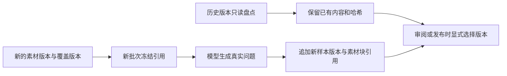

# 素材问题生成切换前存量盘点

2026-10-08，对本机 `llm` Compose 的 PostgreSQL 执行只读查询。所有历史样本版本保留，未执行 UPDATE、DELETE 或生成操作。

| 范围 | 样本版本总数 | 编号模板问题 |
| --- | ---: | ---: |
| 全库 `sample_versions` | 68 | 1 |
| 项目 13，批次 12 | — | 1 |

判定沿用 Discussion #165：`payload->>'question' ~ '：第 [0-9]+ 题$'`。该规则识别已知编号模板，不把全部短问题判为模板。它也不证明其余样本的事实质量。

```sql
SELECT COUNT(*) AS total_versions,
       COUNT(*) FILTER (WHERE payload->>'question' ~ '：第 [0-9]+ 题$') AS template_versions
FROM sample_versions;

SELECT s.project_id, sv.batch_id, COUNT(*) AS template_versions
FROM sample_versions sv JOIN samples s ON s.id=sv.sample_id
WHERE sv.payload->>'question' ~ '：第 [0-9]+ 题$'
GROUP BY s.project_id, sv.batch_id ORDER BY s.project_id, sv.batch_id;
```



新路径在未关联素材且未显式选择 AI 来源时拒绝生成。修改蓝图或素材默认版本不会改写历史样本；用户通过新的批次生成、审阅与发布流程处置旧模板内容。
