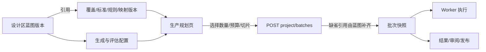
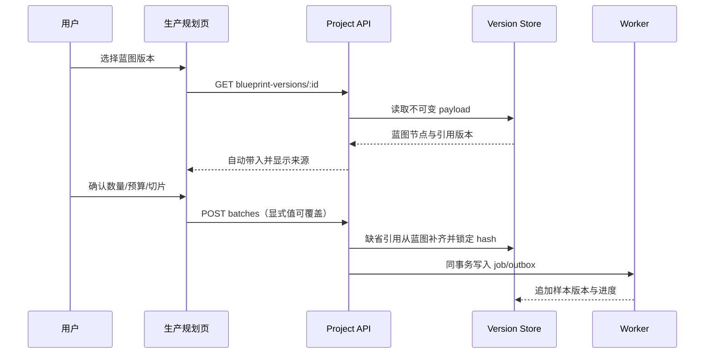
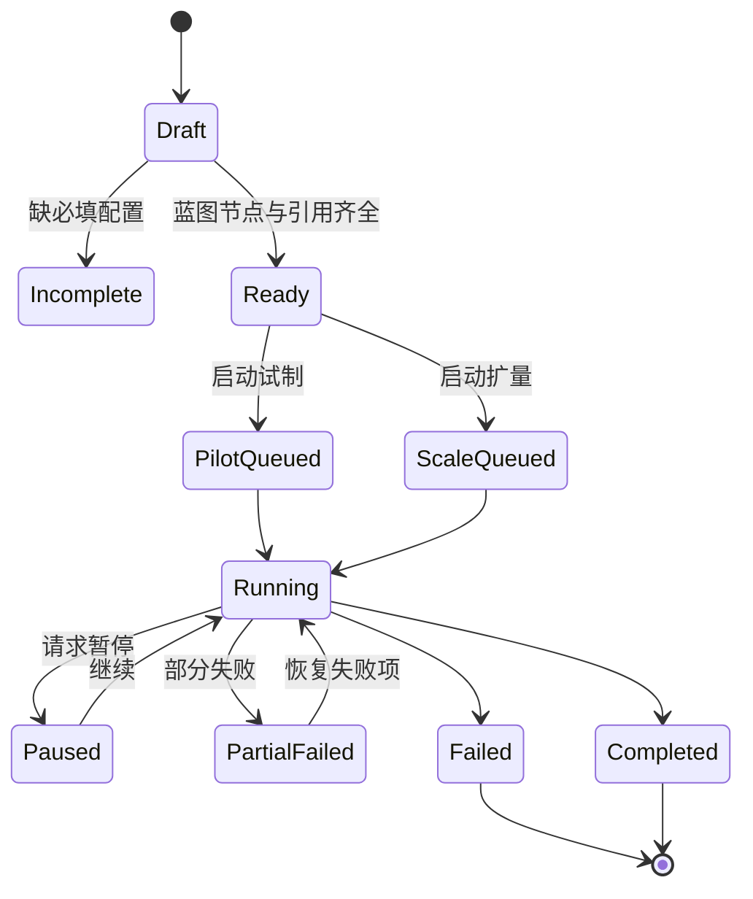

# 生产蓝图可用性与信息闭环审查

本审查针对生产蓝图（设计）到试制/扩量（生产）的真实闭环，记录本轮发现的
信息孤岛、用户难懂表达和样式缺口。蓝图不是说明页，而是一次批次的配置来源；
生产批次必须保存它实际使用的版本快照。

## 发现与修复矩阵

| 断点 | 用户看到的现象 | 根因 | 修复后的行为 | 验证 |
| --- | --- | --- | --- | --- |
| 版本引用孤岛 | 设计区已选择覆盖/标准，生产页仍显示另一套最新版本 | 生产表单独立初始化，未读取蓝图 payload | 选择蓝图后自动带入四类引用；服务端缺省引用再从蓝图补齐 | 生产页快照 + 批次接口测试 |
| `未设置` 不可行动 | 步骤显示未设置，但用户不知道去哪里补 | 状态没有关联配置入口 | 节点状态列出缺失字段，并提供“编辑覆盖范围/模型连接”等直达按钮 | 蓝图 `?node=` 深链 |
| ID/枚举难懂 | 用户看到数字 ID、`risk-based`、`schema.v1` | 内部协议值直接暴露 | 引用用版本选择器，枚举显示业务中文名，帮助文字解释影响 | 节点检查器快照 |
| 复制历史版本丢草稿 | 复制后异步加载最新版本覆盖草稿 | URL 去掉 `?version` 触发 effect reload | 复制动作设置一次性保护，导航不覆盖草稿 | 编辑器状态回归 |
| 团队页拥挤 | 成员、角色、操作挤在一行 | 表格未定义稳定列轨道 | 桌面三列显式 grid，窄屏改为两行布局且操作列固定 | 1440/390 截图 |

## 信息流



## 生产前时序



## 状态机



## 蓝图页线框

```text
+--------------------------------------------------------------------------------+
| Atelier | 项目名称 / 设计                         搜索   账号                   |
+----------+---------------------------------------------------------------------+
| 今日工作 | 生产蓝图                         [小批试制]                     |
| 数据项目 | 先确认每一步需要什么，再保存为新的配置版本。                         |
| 方案库   +------------------------------+----------------------+--------------+
| 交付库   | 生产流程画布                 | 步骤检查器           | 版本历史     |
|          | ① 覆盖范围        可执行     | 覆盖版本 [选择]      | v3 当前      |
| 设置     | ② 思维标准        待补齐 1项 | [编辑覆盖范围]       | v2           |
| 帮助     | ③ 生成            缺模型服务 | 变更理由 [________]  | v1           |
|          | ④ 独立评估        待补齐     | [保存为新版本]       | 复制版本     |
+----------+------------------------------+----------------------+--------------+
```

## 五种状态与边界规则

| 状态 | 设计 | 用户行动 |
| --- | --- | --- |
| Default | 节点显示可执行/待补齐；引用显示 `vN` 和中文理由 | 点击节点编辑；点击关联入口回到上游 |
| Loading | 页面保留画布骨架，检查器显示加载指示 | 不显示“未设置”或可提交按钮 |
| Empty | “还没有保存版本”，提供“创建第一版”或“去配置” | 进入对应编辑器，不显示示例数据冒充真实配置 |
| Error | 顶部错误条说明失败原因，保留当前草稿 | 重试；草稿不被清空 |
| Edge-Case | 长理由折行；版本列表可横向滚动；移动端节点状态换行 | 不发生文字覆盖、按钮溢出或误触 |

## 文案原则

- `hash` 统一显示为“内容指纹”，只在需要核对来源时出现。
- `seed` 显示为“可复现抽样编号”，附带相同编号会得到相同抽样结果。
- `risk-based` 等协议值必须经过中文标签映射；页面不要求用户理解内部枚举。
- “未设置”只能作为可定位的缺失状态，必须同时列出缺少什么和去哪里配置。

