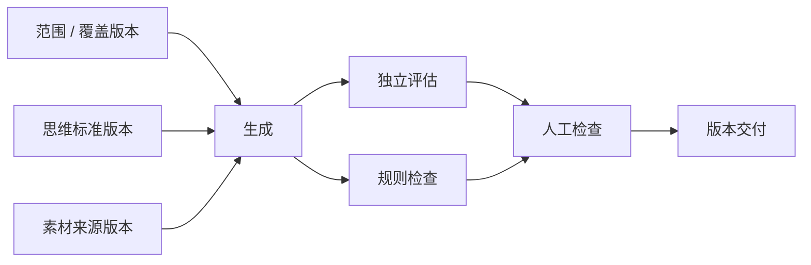
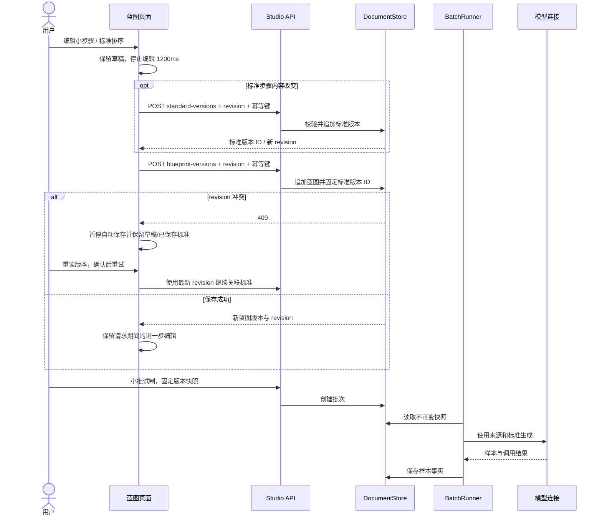
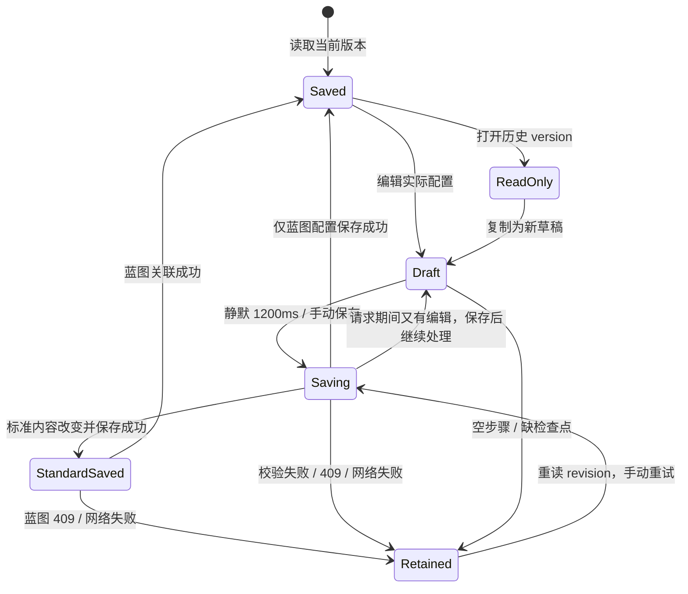

# 蓝图分步编辑与版本迭代闭环

本次交付对应 Issue #197 第 6、11、13 条及 #204 的画布可发现性问题。编辑变更不再要求用户手填理由；画布显示真实配置依赖，节点可拖动整理布局；思考步骤可排序并保存到真实标准版本；数据分析的实际产出来自已保存的样本事实。

实现入口：`apps/web-user/src/studio/pages/BlueprintPages.tsx`。页面继续使用服务端 `blueprint-nodes` 元数据和已有版本 API。参数仍由后端校验，旧批次引用的快照不会随新版本修改。

## 布局与交互

```text
┌ Header：项目 / 生产蓝图                       [素材来源] [小批试制 →] ┐
├ Sidebar ─┬ Content：画布 ────────────────────┬ 检查器 ───────────────┤
│ 项目概览 │ 版本 vN  [-] 75% [+] [适应画布]   │ 当前节点 / 能力说明    │
│ 蓝图     │ [重置布局] 滚动、拖动和键盘提示   │ [配置小步骤 A] [B]     │
│ 生产     │ ┌ 范围 ┐      ┌ 独立评估 ┐      │ 标题、字段、版本选择器 │
│ 数据     │ ├ 标准 ┤→生成→├ 规则检查 ┤→人工→交付│ 内联必填/JSON 提示    │
│ 质量     │ └ 素材 ┘      └──────────┘      │ 变更说明（可选）       │
│ 发布     │ 当前节点下：可点击配置小步骤      │ 自动保存状态           │
│          │                                  │ [保存为新版本]         │
├──────────┴──────────────────────────────────┴──────────────────────┤
│ [版本历史 ▾] 只读版本、复制、差异                                  │
└────────────────────────────────────────────────────────────────────┘
```

桌面默认 75% 显示可读节点；画布宽度不足 600px 时默认 100%，用户通过内部滚动查看节点。缩放与“适应画布”都在画布顶部。`?node=` 深链在加载完成、缩放改变后将节点滚入可视区；`?step=` 固定检查器的小步骤。窄屏检查器在画布下方，页面本身没有横向溢出。

拖动节点、Alt + 方向键、重置布局仅调整本次会话的视觉位置，不改变后台执行顺序，也不创建蓝图版本。思考步骤的拖动排序及上移/下移按钮则修改真实标准内容。

| 节点 | 小步骤 | 保存字段 |
| --- | --- | --- |
| 范围 | 规划领域、方向与数量 | `coverageVersionId` |
| 标准 | 选择思维标准；思考步骤与检查点 | `standardVersionId`、`steps` |
| 生成 | 素材输入；模型；输出结构；边界；并发与失败处理 | 服务端元数据中的来源、模型、结构、限制和调度字段 |
| 独立评估 | 裁判；量表与权重；抽样与缺分 | `judgeConnectionIds`、量表、权重、抽样和缺分策略 |
| 规则 | 规则与风险检查 | `qualityPolicyVersionId` |
| 人工检查 | 分派；必需证据 | 分派、风险范围、抽样和证据字段 |
| 交付 | 映射与文件格式；用途与限制 | 映射、格式、用途、限制 |

服务端新增而尚未列入分组的字段会进入“其他配置”。素材节点和来源目录读取跟随 `sourceVersionId` 元数据能力；来源、覆盖和标准都是固定版本引用。

## 真实依赖



这些箭头是已有 Pipeline 的配置和证据依赖。画布没有提供任意改连线的执行 DAG 编辑器。

## 版本保存与冲突恢复

停止编辑 1200ms 后保存新蓝图版本，留空的变更说明自动记录实际修改节点。未修改的内容不保存。标准步骤先正规化顺序，并要求至少一步、每步都有标题和完成检查点；内容变化时先创建 `standard-versions`，再把新行 ID 固定到蓝图。





蓝图关联失败时页面明确显示“标准 vN 已保存”，重试复用该版本，避免重复创建标准。请求期间继续编辑其他节点会保留新草稿并采用已保存的标准 ID。恢复为原内容不会产生无意义的新版本。

## 五种界面状态

| 状态 | 画布与检查器 | 反馈与动作 |
| --- | --- | --- |
| Default | 当前蓝图、真实依赖、健康状态、当前小步骤 | 编辑后自动保存，手动保存可随时提交 |
| Loading | 加载指示，节点未挂载 | 完成后再滚入深链节点，避免错误定位 |
| Empty | 旧项目尝试真实 bootstrap；目录无候选保持明确缺省 | 前往配置页创建真实版本，不生成假候选 |
| Error | 加载失败卡片；保存失败时保留表单 | 重试加载；重读 revision 后保留草稿重试；不会无限自动重试 |
| Edge-Case | 390px 窄屏内部滚动；长名称换行；历史只读 | 缩放/适应画布；键盘排序；缺标题/检查点和空数组禁止写入 |

## 真实产出统计修复

`DatasetAnalysis.Structure[].Produced` 原先从计划分配函数累加，尚未产出的方向也可能显示“已产出”。现在从 `SampleVersionFact` 按领域/方向累计；覆盖版本只提供计划和零产出方向。无覆盖版本时保留真实产出，计划为 0。

| 输入 | 计划 | 实际产出 |
| --- | --- | --- |
| 方向配额 4，已有 1 个样本版本 | 4 | 1 |
| 方向配额 3，没有样本版本 | 3 | 0 |
| 没有覆盖版本，有 2 个同方向样本版本 | 0 | 2 |

本改动沿用分析接口的样本读取上限；该读模型的 `sampleCount` 是实际参与本次分析的样本版本数。

## 验证与可复查证据

浏览器脚本：`test/audit/blueprint-workflow.mjs`。它在真实 Chromium 和实际登录/元数据端点上运行，以受控蓝图与标准 API 输入验证交互和保存顺序，避免修改共享开发库。受控响应的使用在结果文件明确标注；后端统计另外由正常、部分产出、空产出和无覆盖版本 Go 用例验证。

实际截图：[蓝图编辑界面](../audit/issue-197-closure/workflow.png)。断言结果：[result.json](../audit/issue-197-closure/result.json)。截图仅为布局证据，保存顺序、冲突续接、历史只读、请求期间编辑、无效步骤和三种视口均由脚本断言。

```bash
docker exec -e BASE_URL=http://127.0.0.1:13211 \
  -e PLAYWRIGHT_PATH=/root/.npm/_npx/e41f203b7505f1fb/node_modules/playwright \
  -e OUT_DIR=/w/docs/audit/issue-197-closure \
  llm-workflow-browser node test/audit/blueprint-workflow.mjs
```

验证环境为 Docker 内的 Node 20、Go 1.24 与 Chromium。提交前执行 Go 格式/vet/build/test、前端类型检查与构建、冻结 UI 守卫及 `scripts/check-docs.mjs`。
