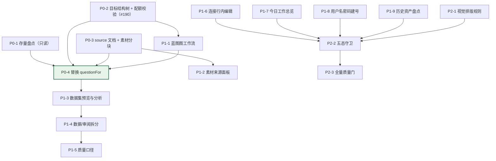

# 蓝图工作流化改造 TODO（讨论 #165 × Issue #197）

> **这是什么**：把讨论 [#165](https://github.com/1420970597/llm/discussions/165) 的集成结论与 Issue [#197](https://github.com/1420970597/llm/issues/197) 的 17 条用户测试反馈，落成**可逐项勾选、可验收、带代码落点**的实施清单。
> **代码基线**：`main` @ [`0b18145`](https://github.com/1420970597/llm/commit/0b18145)
> **设计文档**：`docs/architecture/blueprint-workflow-rearchitecture.md`
> **可运行原型**：`docs/prototypes/blueprint-workflow-rearchitecture/prototype.html`（单文件，双击可开；`#/s01` … `#/s09`，← → 切换）
> **状态**：**本轮只做调研、设计、原型与截图，未修改任何产品代码**（`git diff origin/main..HEAD -- apps internal sql` 为空）

---

## 0. 执行摘要

### 0.1 三句话

1. **#165 的结论对，但还可以再进一步。** 第三轮勘误已证明上游不导出中间产物，因此「只接产物」的路径只剩「接成品问答对」；而真正缺的能力（**素材输入 + 真实问题生成**）完全在本仓库内部，不引入 easy-dataset 反而成本最低。
2. **#197 的 17 条里，12 条是同一条链路断裂的投影。** 业务主体 `m×n×z` 没有载体 → 用户不知道"要什么"；蓝图是纵向卡片列表而不是工作流 → 用户不知道"怎么配"；`question` 是模板占位符 → 用户看到的数据没有意义。
3. **所以本次改造是一件事，不是三件事。** 目标结构树（S01）→ 素材来源（S03）→ 图工作流蓝图（S02）→ 替换 `questionFor`（S09），这条链完成后，其余条款自动变成"可回答的问题"。

### 0.2 与 #190 的合并理由

Issue #190（批次「已完成」却只产出 1/12）与本次改造**是同一个缺陷的两种表现**：
`PlannedUnits`（用户填）与 `AllocateUnits()` 的产出（受配额限制）从不比较，状态机照样走 `completed`。
目标结构树把「可产出量」变成服务端保存版本时就能算出的确定值，**这是 #190 修复方向 2 与 3 的合并版**，因此合并处理，不单开 lane。

### 0.3 本轮交付物

| 文件 | 内容 |
|---|---|
| `docs/prototypes/blueprint-workflow-rearchitecture/prototype.html` | 单文件可运行原型，9 屏 |
| `docs/prototypes/blueprint-workflow-rearchitecture/shots/` | **18 张真实 Chromium 截图**（桌面 1440×1024 / 移动 390×844） |
| `docs/screenshots/issue-165-197-current/` | **14 张现状基线截图** + `baseline.json`（含画布几何测量） |
| `docs/architecture/blueprint-workflow-rearchitecture.md` | 数据结构与前端架构设计（含 Mermaid 图） |
| `test/prototypes/capture-blueprint-flow.mjs` | 原型截图 + 横向溢出断言（失败即非零退出） |
| `test/prototypes/capture-current-baseline.mjs` | 现状基线采集 + 画布几何取证 |
| 本文 | 逐功能 TODO + 竞品对比矩阵 + 五态定义 + 验收标准 |

---

## 1. 现状基线（真实浏览器截图，可反驳）

> 所有截图由 `node test/prototypes/capture-current-baseline.mjs` 在真实容器栈（`:3210`，`docker compose`）上用真实 Chromium 采集。
> 完整测量数据见 `docs/screenshots/issue-165-197-current/baseline.json`。

### 1.1 蓝图不是工作流：可测量的证据


`baseline.json` 中的实测值（不是印象）：

| 指标 | 实测值 | 含义 |
|---|---|---|
| `canvasDisplay` / `canvasFlexDirection` | `flex` / **`column`** | 画布是**纵向堆叠的卡片列表**，不是图 |
| `canvasWidth` × `canvasHeight` | **890 × 791** | 7 个节点在 890px 宽内纵向堆叠 |
| `nodesAreDraggable` | **false** | 节点不可拖拽 |
| `hasEdgeOrConnector` | **false** | **不存在任何连线元素**（无 svg / 无 edge 属性） |
| `hasCanvasZoom` | **false** | 无缩放/适应控件 |
| 生成节点页 `docHeight` | **2437px**（视口 1000px） | 单节点配置把一个页面撑成 2.4 屏 |


**判据**：#197 第 11 条说「改为模仿 dify 的工作流界面设计，把蓝图画布拉宽，左侧展示蓝图流程，点击某个节点在右侧（同一张画布里）展示这个工作流信息」。
上表六项里有五项为「否」——这不是审美判断，是结构事实。

### 1.2 目标结构（m×n×z）没有自己的载体


覆盖矩阵能看到「领域 / 方向 / 配额」，但：

- 没有把 `n × m × z` 作为一个**主体**呈现（用户要自己心算三者关系）；
- 与创建向导里的 `Coverage.Domains / DirectionsPerDomain / QuestionsPerDirection`（`internal/model/project.go:143-144`）是**两处数值**；
- 与批次的实际可产出量**从不校验**（→ #190）。

### 1.3 「数据」与「审阅」渲染同一页面


`baseline.json` 中两条路由的 `bodyFingerprint` 前 400 字**逐字相同**，标题同为「样本工作区 / 样本内容、版本来源与审阅队列」。
这是 #194 与 #197 第 12 条共同指向的事实：用户无法预期点进去看到什么。

### 1.4 生产、质量、连接、成员、今日工作的现状

| 页面 | 截图 | 与 #197 的对应 |
|---|---|---|
| 批次列表 | `15-current-batch-runs-desktop.png` | 第 13 条（缺数据集预览与分析） |
| 新建质量实验 | `16-current-quality-new-desktop.png` | 第 14 条（模型配置有问题） |
| 连接设置 | `17-current-connections-desktop.png`（`natural=2315px`） | 第 7、8 条（跳旧页面、缺行内编辑） |
| 团队与角色 | `18-current-team-desktop.png` | 第 15 条（新建用户未实现） |
| 今日工作 | `19-current-today-desktop.png` | 第 10 条（数据不对，应是总览） |
| 历史资产 | `20-current-legacy-history-desktop.png` | 第 16 条（是否迁移完成） |

移动端实测（`390×844`）：

| 页面 | 结果 |
|---|---|
| 蓝图 | `natural=2789`，**`overflowX=66px`** ← 存在真实横向溢出（#197 第 17 条） |
| 连接设置 | `natural=5075`（5 屏长） |
| 项目数据 | `overflowX=0` |

> 这一条很重要：**溢出是本次原型采集脚本会直接断言并失败的项目**，见 §5.3。

---

## 2. 目标形态（原型截图）

> 原型由 `node test/prototypes/capture-blueprint-flow.mjs` 用**真实 Chromium**采集，
> 桌面 `1440×1024`、移动 `390×844`，共 18 张；脚本同时断言「无 console 错误、无横向溢出」，任一失败即非零退出。

### 2.1 S01 目标结构：让 m×n×z 成为主体


**设计要点**：

- 树是**领域 → 方向 → 题数**三级，每级都带可编辑数字；右侧实时显示 `m × n × z` 公式与结果；
- 缺口方向（`source = none` 或 `quota = 0`）用琥珀色行 + 徽标显式标出，**默认策略是拒绝生成**，不是静默退回模板；
- 计划量只有一处定义，向导 / 蓝图 / 批次 / 数据统计都读它（消除 #190 的"两个互不校验的输入"）。


### 2.2 S02 图工作流：Dify 式左流程 + 右检查器 + 画布内小步骤


**这一屏直接回应 #197 第 11 条的四项要求**：

| #197 原话 | 本原型对应元素 |
|---|---|
| 「把蓝图画布拉宽」 | 画布 `minmax(0,1fr)`，检查器固定 420px；画布内部可横向滚动，**整页不溢出** |
| 「左侧展示蓝图流程」 | 点阵画布 + 绝对定位节点 + SVG 连线 + 4 个节点按列对齐小步骤 |
| 「点击某个节点在右侧展示这个流程对应的工作流信息」 | 右侧检查器（NODE ④ / 生成），URL `?node=` 保持可分享 |
| 「使用拖拉拽的方式…把现有的节点配置下放到小步骤中」 | 画布内展开 4 个小步骤卡片；拖拽作为**增强**（键盘路径必须保留） |
| 「注意步骤不是单一的顺序结构，需要先明确对应流程的参数结构再做设计」 | 4.1 与 4.2 是并列前置（虚线汇入 4.3），4.4 是后置校验；下方「参数结构」表把参数分三层归位 |

**参数三层归位表**（防"每个节点长出一套自己的表单"）：

| 参数 | 归属层级 | 存在哪里 | 改动的影响 |
|---|---|---|---|
| 模型连接、温度 | 节点级 | `blueprint.v1` 生成节点字段 | 新批次生效；已运行批次用快照 |
| 每方向题数 z、难度配比 | 小步骤级（4.2） | 目标结构版本 + 生成节点 | 改变计划量，须重新校验可产出量 |
| 切分算法、块长度 | 文档级（② 素材来源） | 第六类版本化文档 | 只影响之后导入与生成的批次 |
| 并发数、预算上限、批次大小 | 运行级 | 批次记录（**不属于蓝图**） | 只影响该次执行 |


### 2.3 S03 素材来源：第六类版本化文档


**严格按第三轮勘误修正的三点**：

1. **字段表不再出现 `chunks[].hash` / `chunks[].tagPath`**（勘误 1：上游只有 6 个字段）—— `content_hash` 由本系统计算；
2. **没有「素材块 ↔ 领域标签」的自动关联**（勘误 2：标签挂在 `Questions.label` 上）—— 方向与素材的关联由人在覆盖矩阵里建立；
3. **「文档大纲」而不是「领域标签树」**（勘误 3：标签树的输入是 TOC 而非 chunks）—— 大纲随来源一起冻结。

### 2.4 S04 生产：数据集预览 + 自动分析（#197 第 3、13 条）


- **结构预览**：领域 › 方向 → 计划 z / 已产出 / 接地素材 / 状态；
- **内容预览**：样本的问题 / 推理 / 答案 + 来源（素材块、版本、模型）；
- **自动分析**（打开即算，无需点按钮）：长度分布 P50/P90/最长/最短、难度占比与配比对照、接地率、重复率、待人工审阅率；
- **#190 修复的可视化**：批次显示「部分完成 1/12」并给出原因，而不再是绿色的「已完成」。

### 2.5 S05 数据 / 审阅拆分（#197 第 12 条）


| 入口 | 回答的问题 | 默认排序 | 批量动作 |
|---|---|---|---|
| **数据** | 这一版里有什么？ | 领域 › 方向 › 版本序号 | 冻结为发布候选、导出 |
| **审阅** | 哪一条需要我判断？ | 风险 × 等待时长 | 接纳、隔离、补充理由 |

### 2.6 S06 质量实验室（#197 第 9、14 条）


- 「分子 / 分母」→「**被评测数据集：68 条**（41 通过 / 18 需修改 / 9 隔离）」；
- 新建实验时生成者与裁判模型都从**连接目录下拉**选，停用的连接不出现；
- 实验冻结蓝图 v3 / 覆盖 v4 / 标准 v2 / 素材来源 v3 的版本快照 → 消除与蓝图的信息孤岛。

### 2.7 S07 其余体验修正（#197 第 7、8、10、15、16、17 条）


### 2.8 S09 问题生成对比：整套改造的收口处


| 现状（`questionFor` 模板） | 目标（素材接地生成） |
|---|---|
| 温控验证（难度 easy）：第 1 题 | 冷库温度记录出现 30 分钟断档时，验证报告应如何判定该时段的有效性？ |
| 运输记录（难度 medium）：第 1 题 | 委托运输过程中发生温度偏差，受托方与委托方各自需要留存哪些记录？ |
| 委托储运（难度 normal）：第 1 题 | （已拒绝生成：无素材接地） |

---

## 3. 竞品调研矩阵

> 调研对象是「工作流画布的交互形状」与「数据集结构的表达方式」两类问题，分别对应 #197 第 11 条与第 13 条。
> 评分 5 = 最优，1 = 最差；权重反映本仓库的架构红线（AGENTS.md §3）与当前产品阶段。

### 3.1 工作流画布：Dify / n8n / ComfyUI / 现状（Atelier）

| 维度（权重） | Dify | n8n | ComfyUI | **Atelier 现状** | **Atelier 目标** |
|---|---|---|---|---|---|
| 画布形态 | 自由画布 + 节点面板（400px，可拖拽调宽） | 自由画布 + 节点参数面板 | 图编辑器 + 节点属性面板 | ❌ 纵向卡片列表（`flex-direction: column`，无连线） | 点阵画布 + SVG 连线 + 可缩放 |
| 节点配置下放 | 每节点独立 `panel.tsx` + `useConfig` hook | 每节点 `INodeProperties` 声明式表单 | 每节点 input 定义 | ⚠ 单一检查器列出全部字段 | 节点级 → 小步骤级 → 运行级三层 |
| 参数结构 | 节点级 + 变量引用系统 | 节点级 + 表达式 | 节点级（严格类型） | ❌ 无分层，字段平铺 | 三层归位表（见 §2.2） |
| 校验反馈 | checklist 校验 + 运行前拦截 | 节点级校验 + 试运行 | 类型校验 + 执行报错 | ⚠ 保存时校验，执行前另有检查但两套语义 | 保存校验 + 执行前校验分离且显式 |
| 学习成本（面向非工程师） | 中 | **高**（表达式/代码节点） | **很高**（面向生成式 AI 专家） | 低但**不可用**（无法表达结构） | 中（保留闭合节点集合，不开放任意脚本） |
| 与本仓库架构一致性 | — | — | — | 5（无外部依赖） | 5（纯前端改造，节点元数据驱动） |
| 可借鉴 / 不复用 | ✅ 布局与检查器分区、面板可调宽 | ✅ 试运行单节点 | ✅ 缩放/适应控件 | — | 借鉴形状，用 Semi UI 原生实现 |

**结论**：
- **形状学 Dify**（左画布 + 右检查器 + 面板可调宽），**不学 n8n 的表达式与代码节点**（AGENTS.md §3 禁止在 handler 里写业务逻辑，UI 也不应开放任意脚本；`internal/model/blueprint_nodes.go` 已明确「节点集合是闭合的」）；
- **不学 ComfyUI 的自由度**：它的目标用户是生成式专家，而 #197 的反馈全部来自「页面晦涩难懂」一侧；
- **保留现状唯一做对的一点**：节点是可聚焦按钮、Tab 顺序 = 视觉顺序（`BlueprintPages.tsx:392-415`），拖拽必须是增强而非唯一路径。

### 3.2 数据集结构表达：Label Studio / Argilla / Labelbox / 现状

| 维度（权重） | Label Studio | Argilla | Labelbox Catalog | **Atelier 现状** | **Atelier 目标** |
|---|---|---|---|---|---|
| 层级结构表达 | 项目内任务列表 + 滤镜（无原生层级） | 数据集 + 字段/标签体系（层级标签在 roadmap） | Catalog 为可搜索索引 + 切片 | ❌ 表格，无 m×n×z 主体 | 树（可编辑）+ 表格双视图 |
| 数据预览 | 单任务标注视图 | 记录列表 + 详情 | 索引 + 缩略图 | ❌ 无预览（#197 第 3 条） | 结构 + 内容同屏 |
| 指标分析 | 无内建（靠外部） | 有指标面板（进度/标注一致性） | Insights：直方图、热力图、属性分布 | ❌ 无 | 打开即算的分析面板 |
| 评测口径表达 | — | 有（标注一致性、分歧） | 有（标注维度分析） | ❌ 分子/分母 | 「被评测数据集 N 条」 |
| 审阅队列 | Data Manager 按任务分配 | 有待标注/待复核队列 | 有评审流 | ⚠ 与「数据」同页 | 独立「审阅」语义 |
| 版本/不可变性 | 无内容版本 | 无内容版本 | 有数据集版本 | ✅ **只追加 sample_versions + 冻结发布**（本仓库更强） | 保持并前置到界面 |

**结论**：**在数据治理（版本、不可变、发布冻结）上本仓库已强于三个竞品**，缺的是**表达层**（预览、分析、层级、口径）。
因此这部分是「补齐表达」而不是「换模型」—— 这也解释了为什么 #197 第 13、14 条容易修且收益大。

### 3.3 素材侧：easy-dataset（第三轮勘误后的结论）

| 维度 | easy-dataset v1.7.3 | 本方案 |
|---|---|---|
| 中间产物导出面 | ❌ `app/api/**/chunks/*` 与 `tags/*` 下 **0 个 export 路由** | 自建 Markdown/TXT 解析 + 分块 |
| 成品导出 | ✅ `questions/export`、`datasets/export`（alpaca/sharegpt/json/csv） | 通过 `source-imports` 幂等导入（成品即冻结为样本版本） |
| 标签归属 | `Questions.label`（**不是** chunk 属性） | 方向 ↔ 素材关联由人工建立，不伪造耦合 |
| 许可 | AGPL-3.0 + 附加条款 | 不复制代码、不部署界面、不调用 API → 无传染 |
| 引入成本 | 426 MB 镜像 + SQLite 单文件状态 + 5 个月未更新 | 0（Go 侧自建） |

**最终结论**：**不引入 easy-dataset**。第三轮的 C2-lite（完全自建）是推荐路径，本次 TODO 即按此展开。

---

## 4. 五大界面状态定义（#197 第 3、4、10、16、17 条的结构性回应）


| 状态 | 触发条件 | 界面表现 | 行动出口 | 禁止 |
|---|---|---|---|---|
| **Default** | 有版本、可编辑 | 节点状态点（可执行/待补齐/被依赖阻塞）+ 计数；检查器可编辑；小步骤展开 | 主「保存为新版本」；次「试跑当前节点」「版本对比」 | 状态用颜色单独表达（必须带文字） |
| **Loading** | 首屏读取蓝图/素材版本 | 骨架条；表单禁用 + 半透明遮罩；**页签保持可点**；文案「正在读取蓝图 v4 与素材台账…」 | **无按钮** | 数据未就绪时提供写按钮（会产生"看起来成功、其实基于空数据"的版本） |
| **Empty** | 项目已建、无蓝图版本 | 居中说明 + 「先决定要覆盖什么」 | 主「从目标结构生成蓝图」；次「从方案库复制」 | 只写「暂无数据」而不给下一步 |
| **Error** | 解析失败 / 409 版本冲突 / 校验 422 | 红色 Banner 给**可操作原因**（含支持格式清单）；409 提示「已被某某更新为 v5，你的草稿已保留」 | 「重试」「移除该来源」「刷新并比较」 | 部分失败阻断整体；乐观锁冲突丢草稿 |
| **Edge-Case** | 超长名 / 超大文件 / 巨量块 / 深层级 / 390px 窄屏 | 文件名中段省略 + 悬停全名；>200MB 后台解析可离开；块数 >10 万显示「约 12.4 万」；来源 >50 条虚拟滚动 | 「后台解析，可离开页面」「搜索来源」 | 任何被控件边缘遮盖的文字；整页横向滚动（移动端必须 `overflowX = 0`） |


---

## 5. 实施 TODO（逐功能）

> **约定**：
> - 每一项都给出**代码落点**、**验收标准**、**关联条目**。
> - ❌ 严禁新建 `xxx_v2.go` / `xxx_new.go` 平行文件（AGENTS.md §3.1）；改造一律**替换**原实现并同步所有调用方。
> - ❌ 严禁 `// TODO: implement later` / `panic("unimplemented")` / 返回假数据。
> - ✅ 每个新增或重构的 Go 模块必须同目录配套 `*_test.go`，覆盖至少一条正常路径与一条异常路径。

### P0：链路打通（必须先做，其余项依赖它）

#### P0-1 存量盘点：`question` 模板形态规模（**第一步，不改代码**）

| 项 | 内容 |
|---|---|
| 动作 | 查询 `sample_versions` 中 `question` 匹配模板形态（`%：第 % 题`）的版本数与占比；输出按项目、批次分组 |
| 代码落点 | 只读 SQL（`psql` / `internal/store` 一次性查询脚本，不入库）；结论写入 `docs/plans/round3-blueprint-workflow-inventory.md` |
| 验收 | 报告给出准确数字与分组；**对 `sample_versions` 零写入**（只追加不变量） |
| 禁止 | ❌ UPDATE `sample_versions`；❌ 删除历史版本 |
| 关联 | #165 第三轮「R10 存量规模仍未查库」 |

#### P0-2 目标结构树：`m×n×z` 成为服务端事实

| 项 | 内容 |
|---|---|
| 后端 | `internal/model/studio_docs.go` 的 `ValidateCoveragePayload` 增加：① 方向配额之和 = 项目 `PlannedQuestions()`（`internal/model/project.go:194`）否则 422；② `direction.Source ∈ {document, ai, manual, none}`；③ `Source = document` 但无素材块关联 → 422（`fieldErrors` 逐字段指向） |
| 后端 | `internal/studio/batch_runner.go:430` `AllocateUnits` 的调用点增加前置校验：`plannedUnits > len(AllocateUnits(...))` → 422「当前覆盖矩阵最多产出 N 个单元」（**#190 修复**） |
| 前端 | 新增 `apps/web-user/src/studio/pages/TargetStructurePage.tsx`（树 + 实时公式 + 缺口提示） |
| 前端 | `apps/web-user/src/studio/routes.ts` 新增 `project.targetStructure`（`navParent: 'design'`） |
| 测试 | `internal/model/studio_docs_test.go`：正常（配额和匹配）/ 异常（配额和不匹配 → 422 且 fieldErrors 精确到方向）；`internal/studio/batch_runner_test.go`：`AllocateUnits` 小于 `plannedUnits` 时拒绝 |
| 验收 | 树里改 z 后保存 → 服务端拒绝不匹配的组合；批次启动前拦截 #190 场景 |
| 关联 | #197-11、#190 |

#### P0-3 第六类版本化文档 `source` + 素材分块

| 项 | 内容 |
|---|---|
| 迁移 | `sql/migrations/0040_studio_source_documents.sql`：`source_chunks` 表 + `(project_id, content_hash)` 唯一约束 |
| 后端 | `internal/model/studio_docs.go`：新增 `KindSource DocumentKind = "source"`、`SourcePayload`、`ValidateSourcePayload`；`AllDocumentKinds()` / `schemaVersionFor` 各加一项 |
| 后端 | `apps/api/routes_documents.go`：**该文件已用循环注册五类文档，新增一类不需要新增路由代码**（验收时必须证明这一点） |
| 后端 | `internal/import/source_document.go`（新包，单一职责）：Markdown / TXT 解析 → 分块（`recursive` / `text`，参数取自 `source` payload）→ `content_hash` 由本系统计算 |
| Store | `internal/store/source_chunk_store.go`：`UpsertChunks`（`ON CONFLICT (project_id, content_hash) DO NOTHING`）+ `ListChunksByDirection` |
| 测试 | `internal/import/source_document_test.go`：正常（Markdown 切成预期块数、heading_path 正确）/ 异常（空文件、超长单块、编码异常各一条） |
| 验收 | 上传 Markdown → chunks 落库且重复上传零新增；`source` 版本可保存、可回看、可对比 |
| 禁止 | ❌ 不引入 easy-dataset；❌ 不新增 `multipart` 之外的第二种文件入口（本仓库当前 0 处 `multipart`，这是第一个，必须同时定义大小上限、类型白名单、`Content-Type` 校验与审计记录） |
| 关联 | #165 第三轮 C2-lite、#197-3、#197-11 |

#### P0-4 替换 `questionFor`：占位模板 → 素材接地生成

| 项 | 内容 |
|---|---|
| 后端 | `apps/worker/studio_batch.go:210` 的 `questionFor` **直接改造**（不是新增平行函数）：签名改为 `(ctx, deps, request) (string, error)`，内部调用 `internal/llm` 的 `GenerateQuestionsV2`（或单条版本），传入 `Unit.SourceChunkIDs` |
| 后端 | `apps/worker/studio_grpo.go:236` 的 `grpoQuestionFor`（与上逐字相同的副本）**删除**，调用同一实现 |
| 后端 | 缺口方向且未显式降级 → 返回 `ErrDirectionWithoutSource`，单元判为 failed 且错误类别为 `configuration`（**不重试**，避免白花钱） |
| 后端 | `internal/llm/sft_generator.go` 的 `SftInput` 增加素材字段（当前结构上无法接收源材料 —— #165 证据三） |
| 测试 | 先补回归测试再替换：① 有素材 → 生成的问题包含素材引用且非模板形态；② 无素材且未降级 → 拒绝并给出可操作错误；③ `source = ai` 显式降级 → 允许且样本 `source` 字段标为无接地 |
| 验收 | 试跑批次产出的 `question` 不再是「方向（难度 x）：第 N 题」；每条能追溯到素材块 |
| 关联 | #165 核心发现、#197-2、#197-5 |

### P1：表达层（用户直接感知，收益高）

#### P1-1 蓝图页面重构为图工作流（S02）

| 项 | 内容 |
|---|---|
| 前端 | 重构 `BlueprintPages.tsx` 的 `BlueprintPage`：画布区改为点阵 + 绝对定位节点 + SVG 连线；保留现有节点按钮的键盘可访问性（`aria-current="step"`） |
| 前端 | 新增 `WorkflowCanvas.tsx`（纯渲染）+ `WorkflowNodeInspector.tsx`（检查器），字段仍由 `blueprint-nodes` 元数据驱动（`internal/model/blueprint_nodes.go`，加字段元数据后检查器**自动出现**） |
| 前端 | 小步骤在画布内展开；`?node=` 与 `?step=` 保持可分享 |
| 前端 | 拖拽作为**增强**：必须同时保留「用按钮调整顺序 / 用表单建立连接」的键盘路径 |
| 后端 | `internal/model/blueprint_nodes.go`：生成节点增加小步骤元数据（`Steps []NodeStepSpec`），并由既有 `TestBlueprintNodeSpecsCoverPayload` 双向断言 |
| 验收 | 画布宽 ≥ 内容宽、无整页横向滚动；节点可键盘遍历；点击节点右侧切换到对应配置；保存后留在当前节点 |
| 关联 | #197-2、#197-5、#197-6、#197-11 |

#### P1-2 素材来源面板（S03）

| 项 | 内容 |
|---|---|
| 前端 | 新增 `SourceDocumentsPage.tsx`：来源清单（状态徽标 + 块数）+ 文档大纲 + 切分策略检查器 + 导入外部成品入口 |
| 前端 | `routes.ts` 新增 `project.source`（`navParent: 'design'`） |
| 前端 | 影响范围提示**必须在保存按钮之前可见**（Atelier 的核心不变量：已运行批次不被改写） |
| 验收 | Default / Loading / Empty / Error / Edge-Case 五态全部实现（对照 §4 表格逐条核）；五态守卫脚本见 P2-2 |
| 关联 | #165、#197-3 |

#### P1-3 生产：数据集预览 + 自动分析（S04）

| 项 | 内容 |
|---|---|
| 后端 | `apps/api/routes_studio_read.go` 增加数据集统计端点（长度分布分位、难度占比、接地率、重复率、待审阅率），全部**服务端计算**（前端不得拉全量数据自己算） |
| 前端 | `RunPages.tsx` 批次详情增加「数据集结构与内容预览」+ 自动分析面板 |
| 后端 | 批次状态：`completedUnits < plannedUnits` 时不允许 `completed`，改为 `partially_completed` 并给出原因（#190 的状态机修复） |
| 测试 | 统计端点单测（含空数据集 → 返回 `null` 而非 0；这是「无结论」而不是「0%」的既有约定） |
| 验收 | 打开批次即见指标，无需点击按钮；缺口批次状态不再是「已完成」 |
| 关联 | #197-3、#197-13、#190 |

#### P1-4 数据 / 审阅语义拆分（S05）

| 项 | 内容 |
|---|---|
| 前端 | `routes.ts`：`project.data`（浏览）与 `project.review`（待办）分别渲染不同页面组件，不再共用 `SampleListPage` |
| 前端 | 审阅默认排序改为「风险 × 等待时长」；数据默认排序「领域 › 方向 › 版本序号」 |
| 测试 | `test/` 增加守卫：两条路由的 `bodyFingerprint` **必须不同**（正是当前缺陷的可测形式） |
| 验收 | 两条路由渲染不同内容；守卫脚本失败即 CI 失败 |
| 关联 | #197-12、#194 |

#### P1-5 质量实验室口径与模型选择（S06）

| 项 | 内容 |
|---|---|
| 前端 | 「分子 / 分母」全部改为「被评测数据集 N 条」及其可点开的子集合 |
| 前端 | 新建实验的生成者/裁判模型改为从连接目录下拉（`/v1/settings/connection-options`），停用连接不出现 |
| 后端 | 连接目录为空或全部停用时，创建接口返回可操作错误（不是 500） |
| 前端 | 实验详情展示冻结的蓝图/覆盖/标准/素材版本（消除信息孤岛） |
| 验收 | 页面上不再出现「分子」「分母」字样（可 grep 断言）；模型不能手填 ID |
| 关联 | #197-9、#197-14 |

#### P1-6 连接设置行内编辑（S07）

| 项 | 内容 |
|---|---|
| 前端 | `SettingsPages.tsx`：「新增 / 编辑」在**同一张表内**打开抽屉表单，不再跳转旧页面 |
| 前端 | 表格每行提供「编辑 / 测试连通性 / 启用停用」 |
| 验收 | 点击新增或编辑后 URL 不离开 `/settings/connections`；无整页跳转 |
| 关联 | #197-7、#197-8 |

#### P1-7 今日工作 = 工作台总览（S07）

| 项 | 内容 |
|---|---|
| 前端 | `TodayPages.tsx`：待我决定 / 进行中批次（含缺口计数）/ 近 7 天产出 / 待发布候选，数字全部来自真实对象 |
| 后端 | 复用既有统计端点；缺的字段补在 `routes_studio_read.go`（不得在前端做多接口拼装后自己换算口径） |
| 验收 | 每个数字都能点进对应列表；与项目概览的数字一致（同源） |
| 关联 | #197-10 |

#### P1-8 团队与角色：用户名 + 密码创建（S07）

| 项 | 内容 |
|---|---|
| 后端 | 复用既有账号创建路径（本部署无出站邮件，邀请链接永远发不出去） |
| 前端 | `SettingsPages.tsx` 增加创建表单：用户名（邮箱）+ 角色 + 初始密码 + 确认密码 + 「要求首次登录修改密码」 |
| 验收 | 创建后该账号可立即登录；弱密码被拒绝并逐字段提示 |
| 关联 | #197-15 |

#### P1-9 历史资产盘点与去留（S07）

| 项 | 内容 |
|---|---|
| 动作 | 输出旧表 → 新对象的迁移盘点表（行数 / 已迁移 / 未迁移 / 结论） |
| 规则 | **只有「未迁移 = 0 且对账通过」才允许移除「历史资产」菜单**；否则保留为只读盘点页 |
| 验收 | 盘点表随 PR 提交；菜单变化必须在 PR 描述中引用对账结论 |
| 关联 | #197-16 |

### P2：守卫与收口（防止回退）

#### P2-1 视觉与排版规则落地（S07、#197-4、#197-17）

| 项 | 内容 |
|---|---|
| 规则 | 超长文本一律「中段省略 + 悬停全名」；右栏固定最小宽度 380px；数字列右对齐 + `tabular-nums`；**任何页面不得出现整页横向滚动** |
| 修复 | 已知具体缺陷：蓝图右栏文字压住按钮（`inkOverlap` 探针已实现）、移动端蓝图 `overflowX=66px`、深色/浅色 token 不一致 |
| 验收 | 390px 视口下全部路由 `document.scrollWidth - innerWidth <= 1`（脚本断言） |
| 关联 | #197-4、#197-17、#194 |

#### P2-2 五态守卫脚本

| 项 | 内容 |
|---|---|
| 新增 | `test/prototypes/capture-blueprint-flow.mjs` 已实现「无 console 错误 + 无横向溢出」断言（**已在本次交付中跑通**） |
| 新增 | 针对真实产品的五态守卫：`test/audit/*.mjs` 扩展 Error / Empty / Loading 三态断言（对齐 §4 表格） |
| 验收 | 任一状态断言失败 → 非零退出，可作为 CI 门禁 |
| 关联 | §4、#197-3/4/10/16/17 |

#### P2-3 大图标质量门（改造完成后统一跑）

| 项 | 内容 |
|---|---|
| 文档 | `docs/plans/` 下补充本轮契约文档（素材导入契约 + 导出字段冻结定义 + Mermaid 时序） |
| 迁移 | `make db-migrate-smoke` 必须通过（新增 `0040` 迁移） |
| 后端 | `gofmt -s -w apps internal && go vet ./... && go build ./... && go test -v ./...`（容器内） |
| 前端 | `npm run build`（含 `tsc --noEmit`） |
| 端到端 | 3210 真实栈跑通：建项目 → 目标结构 → 上传素材 → 蓝图保存 → 试制 → 预览 → 审阅 → 质量实验 → 发布 |

---

## 6. 实施顺序与依赖



**关键路径**：P0-1 → P0-2/P0-3 → P0-4。**P0-4 是整套改造的验收标准**，其余项都是让这条路径可被理解、可被验证。

---

## 7. 需要决策的问题（请在本 Issue 回复）

1. **缺口方向的默认行为**：本方案定为「**拒绝生成**」（不静默退回模板）。是否同意？另一选择是允许降级但强制在数据卡与界面上标注。
2. **是否接受「不引入 easy-dataset」**：第三轮勘误证明其无中间产物导出面，本方案改为 Go 侧自建 Markdown/TXT 解析 + 分块。是否同意？PDF/DOCX 是否一期内做？
3. **素材块的保留策略**：`source_chunks` 正文可能很大且含原始文档内容，是否需要独立保留期与擦除策略（与样本版本不同）？
4. **拖拽的边界**：节点拖拽是「自由画布」还是「受约束的顺序 + 分支」？本原型按后者设计（保留闭合节点集合），因为 AGENTS.md §3 禁止开放任意脚本节点。

---

## 8. 事实来源与可复现性

| 来源 | 用途 |
|---|---|
| 讨论 #165 正文 + 3 条评论（含第三轮勘误） | 集成结论与上游事实 |
| Issue #197 的 17 条 + `docs/audit/issue-197/evidence.json` | 用户反馈与其 DOM 取证 |
| Issue #190 | 批次静默少交付的根因与本方案的合并理由 |
| `internal/model/studio_docs.go:236`（`CoverageDirection.Source` 死字段） | 缺口语义的落点 |
| `apps/worker/studio_batch.go:210`、`studio_grpo.go:236`（两份 `questionFor`） | 占位问题的证据 |
| `internal/studio/batch_runner.go:430` `AllocateUnits` | #190 的根因 |
| `internal/model/project.go:143-144、194` | n/m/x 字段与 `PlannedQuestions()` |
| `apps/web-user/src/studio/routes.ts` | 路由元数据唯一来源 |
| `docs/screenshots/issue-165-197-current/baseline.json` | 现状几何实测 |
| 竞品来源 | Dify（`web/app/components/workflow/panel/index.tsx`、nodes/*/panel.tsx、DeepWiki 组件文档）、n8n、ComfyUI、Label Studio（`manage_data.html`）、Argilla（docs.v1.argilla.io）、Labelbox/Dataloop（Insights 面板） |

```bash
# 复现全部证据（宿主机无 Node，容器执行 —— AGENTS.md §1）
cd docs/prototypes/blueprint-workflow-rearchitecture && \
  docker run --rm -v "$PWD":/w -w /w node:20-alpine node build.mjs
cd docs && python3 -m http.server 8899 --bind 127.0.0.1 &
cd /root/llm && node test/prototypes/capture-blueprint-flow.mjs        # 18 张原型截图 + 断言
node test/prototypes/capture-current-baseline.mjs                     # 14 张现状截图 + 几何事实
```

---

## 9. 已知限制

- 原型是**静态评审稿**：按钮与表单不产生真实数据流，仅用于确认信息架构、参数结构与状态定义。
- **未验证**：10 万级文档下的分块吞吐；Go 侧 PDF/DOCX 解析可行性未做技术验证（仅有 Markdown/TXT 的明确方案）。
- **未做**：用户访谈（结论来自 #197 的 17 条与既有设计文档）；无障碍审计（生产实施时须按既有标准补齐）。
- 原型截图来自 headless Chromium（Playwright bundeled Chromium 1243），未在真实 macOS/Windows 浏览器复核字体回退差异。
- 竞品对比基于公开文档与源码阅读，**未实际部署运行** Dify / n8n / ComfyUI / Label Studio / Argilla。
