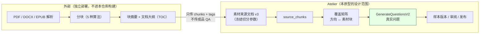
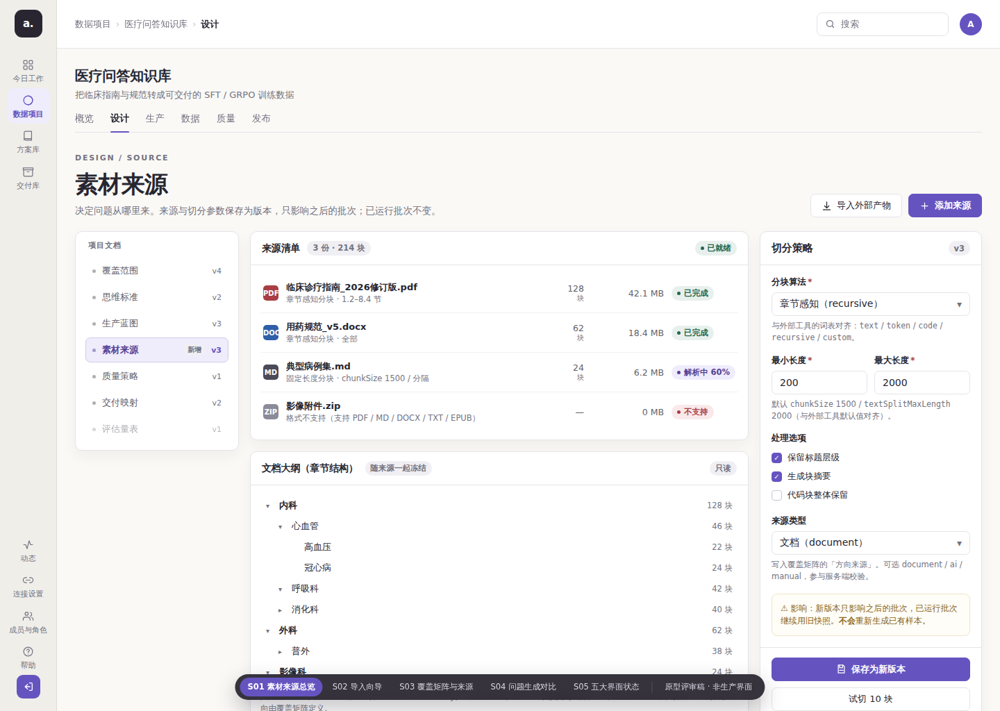
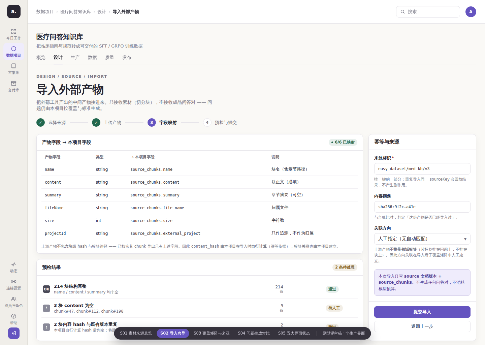
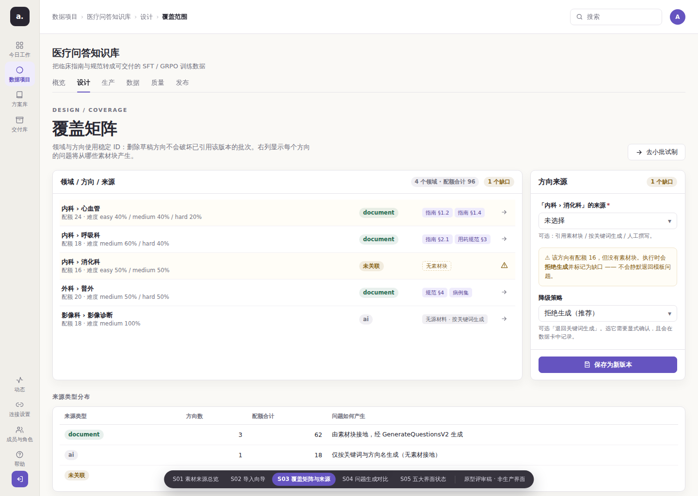
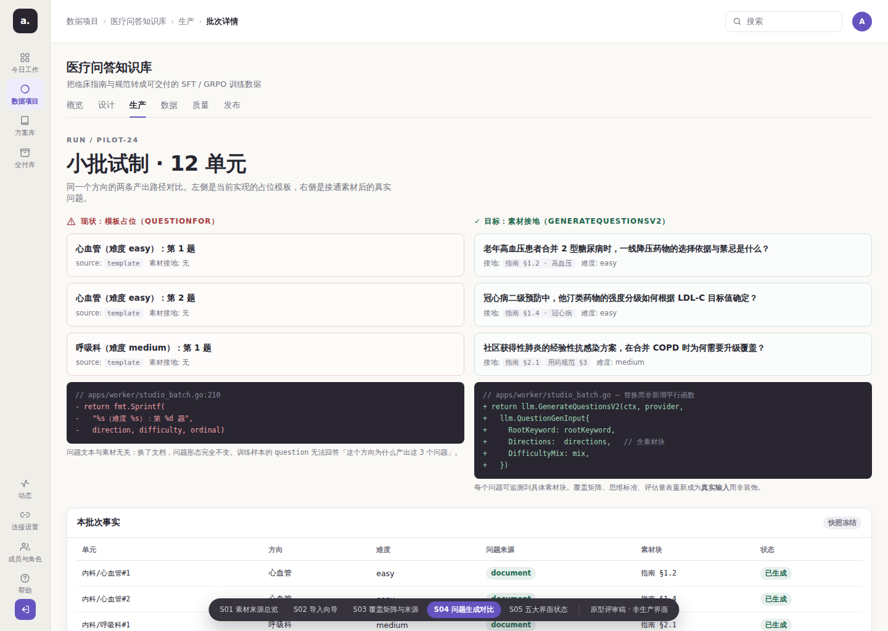
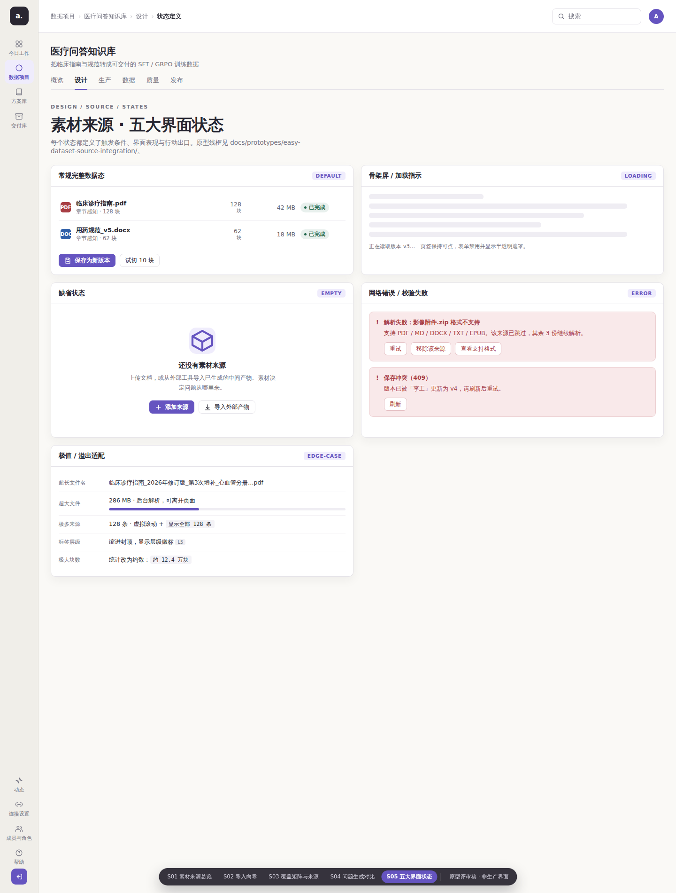

# Atelier「素材来源」原型设计：让问题从文档里长出来

> 承接调研：[`docs/research/2026-09-easy-dataset-integration.md`](../../research/2026-09-easy-dataset-integration.md)
> 关联讨论：[Discussion #165](https://github.com/1420970597/llm/discussions/165)（含本轮设计评论）
> 设计基线：[`docs/design/2026-09-21-data-studio/`](../../design/2026-09-21-data-studio/)（Atelier 信息架构与视觉规范）
> 原型入口：[`prototype.html`](./prototype.html)（下载后用浏览器打开，Hash 路由可浏览 5 个画面）
> 截图证据：[`shots/`](./shots/)（真实 Chromium 1440×1024 / 390×844）

---

## 0. 这份原型要解决的问题

调研结论是：**Atelier 缺的不是"文档解析"，而是生产链路上一个未接完的接口。**

`apps/worker/studio_batch.go:204-220` 的 `questionFor()` 目前返回模板字符串：

```go
return fmt.Sprintf("%s（难度 %s）：第 %d 题", direction, difficulty, request.Unit.Ordinal)
```

于是样本最核心的 `question` 与素材无关 —— 换了文档，问题形态完全不变。**本原型设计的正是把这个接口接上之后，界面应该长什么样。**

### 一个刻意的设计边界

本原型**不**引入 easy-dataset 的界面。理由已在调研中论证：MUI vs Semi、无鉴权 vs 会话 Cookie、App Router vs React Router 三重冲突。本原型用 Atelier 自己的设计语言，**新增一类版本化文档**。



**分界线**：格式解析（贵且难自研）可以外包；**"问题该问什么"必须在 Atelier 内部**，否则覆盖矩阵与思维标准会退化成装饰品。

---

## 1. 五个画面与设计意图

| 画面 | 路由 | 设计意图 | 桌面截图 |
|---|---|---|---|
| S01 素材来源总览 | `#/s01` | 一屏回答"素材有哪些、切分参数是什么、标签树长什么样" | [1440×1024](./shots/source-overview-desktop.png) ｜ [390×844](./shots/source-overview-mobile.png) |
| S02 导入向导 | `#/s02` | 把外部产物接进来，**明确声明只收素材不收成品 QA** | [1440×1024](./shots/import-wizard-desktop.png) ｜ [390×844](./shots/import-wizard-mobile.png) |
| S03 覆盖矩阵与来源 | `#/s03` | 每个方向的问题**将从哪些素材块产生**；缺口可见 | [1440×1024](./shots/coverage-source-map-desktop.png) ｜ [390×844](./shots/coverage-source-map-mobile.png) |
| S04 问题生成对比 | `#/s04` | 占位模板 vs 素材接地的**同屏对照** | [1440×1024](./shots/question-generation-compare-desktop.png) ｜ [390×844](./shots/question-generation-compare-mobile.png) |
| S05 五大界面状态 | `#/s05` | Default / Loading / Empty / Error / Edge-Case 的完整定义 | [1440×1024](./shots/states-desktop.png) ｜ [全页](./shots/states-fullpage-desktop.png) ｜ [390×844](./shots/states-mobile.png) |

### 1.1 S01 素材来源总览



三栏结构复用 Atelier 既有的「对象—内容—检查器」模式（与生产蓝图页一致）：

- **左栏**：项目文档台账。五类既有文档之外，**新增第六类「素材来源」**，带「新增」徽标。这是本设计最关键的架构声明：素材与覆盖、标准、蓝图同级，是**版本化的一等公民**，不是上传附件的附属页。
- **中栏上**：来源清单。四行刻意覆盖四种状态：已完成（PDF/DOCX）、解析中 60%（MD，带进度）、**格式不支持（ZIP，带可操作原因）**。
- **中栏下**：**文档大纲（章节结构）**。只读，随来源版本一起冻结。

> ⚠ **修正（2026-09-24）**：本图早先写作「领域标签树」，并带「已关联 / 未关联」徽标。核实上游后已修正：
> ① 上游的标签树**挂在 `Questions.label` 上，不挂在 chunk 上**（`Chunks` 表无任何标签字段），因此「素材块 ↔ 标签」这种耦合**在上游根本不存在**；
> ② 上游标签树的输入是**文档 TOC（大纲）**，不是 chunks；
> ③ 因此本项目展示的是**大纲**（章节结构），它与「问题属于哪个领域」是两件事 —— 后者由覆盖矩阵定义。
- **右栏**：切分策略检查器。四个字段 + 「来源类型」下拉（`document` / `ai` / `manual`），并明确标注**影响范围**：新版本只影响之后的批次。

**为什么把「影响」写在检查器里而不是提示条**：Atelier 的核心不变量是"已运行批次不被改写"。用户在保存版本前必须看到这条，而不是保存后才从 toast 得知。

### 1.2 S02 导入向导



四步向导（选择来源 → 上传产物 → 字段映射 → 预检与提交），当前停在第 3 步。

- **字段映射表**是核心：**6 个产物字段 → 6 个本项目字段**，全部显式。

> ⚠ **修正（2026-09-24）**：本表早先写作「`chunks[].hash` → `source_chunks.content_hash`」与「`chunks[].tagPath` → `source_chunks.tag_path`」—— **这两个上游字段不存在**，是我未核实而写下的。
> 上游的 chunk 导出（`components/text-split/ChunkListHeader.js:175-183`）只有 6 个字段：
> `name` / `projectId` / `fileName` / `content` / `summary` / `size`。
> 因此：**`content_hash` 由本项目在导入时自行计算**（幂等依据）；**方向关联在导入后人工建立**（上游产物不携带领域标签）。
> 原型与截图已按真实字段重做。

- **预检结果**给出三类可操作结论：214 条通过 / 3 条 `content` 为空（待人工，附具体 chunk 编号）/ 2 条内容 hash 重复（将跳过）。
- **右栏**明确写：「本次导入只写 source 文档版本 + source_chunks。**不生成任何问答对，不消耗模型预算**。」

**为什么要在导入页就强调"不收成品 QA"**：这是 C1/C2 的分界线。如果界面上不写清楚，实施时很容易滑回"直接导入问答对"，而那正是会摧毁产品语义的路径。

### 1.3 S03 覆盖矩阵与来源



在既有覆盖矩阵（`BlueprintPages.tsx` 已实现领域/方向/配额展示）基础上，**新增"来源"列**：

| 方向 | 来源类型 | 素材块 | 状态 |
|---|---|---|---|
| 内科 › 心血管 | `document` | 指南 §1.2、§1.4 | 正常 |
| 内科 › 呼吸科 | `document` | 指南 §2.1、用药规范 §3 | 正常 |
| 内科 › 消化科 | **未关联** | 无素材块 | ⚠ 缺口（黄色行 + 警告图标） |
| 外科 › 普外 | `document` | 规范 §4、病例集 | 正常 |
| 影像科 › 影像诊断 | `ai` | 无源材料 · 按关键词生成 | 显式降级 |

**关键设计决策**：`CoverageDirection.Source` 这个字段**已经存在于 `internal/model/studio_docs.go:236`，但从未被读取或校验**。本设计让它落地为真实语义并参与服务端校验 —— 界面上「未关联」这个黄色标记，对应的是服务端 422。

右栏检查器把缺口变成可操作项：缺口方向的**降级策略**默认是「拒绝生成（推荐）」，可选「退回关键词生成」但需显式确认。**默认拒绝而不是默认降级** —— 静默退回模板问题正是要消除的行为。

### 1.4 S04 问题生成对比



左右同屏对照，这是本原型最有说服力的一屏：

| 左：现状 `questionFor` | 右：目标 `GenerateQuestionsV2` |
|---|---|
| 心血管（难度 easy）：第 1 题 | 老年高血压患者合并 2 型糖尿病时，一线降压药物的选择依据与禁忌是什么？ |
| 心血管（难度 easy）：第 2 题 | 冠心病二级预防中，他汀类药物的强度分级如何根据 LDL-C 目标值确定？ |
| 呼吸科（难度 medium）：第 1 题 | 社区获得性肺炎的经验性抗感染方案，在合并 COPD 时为何需要升级覆盖？ |
| `source: template`、素材接地：无 | 接地：`指南 §1.2 · 高血压`、难度：easy |

下方代码块展示**替换**而非新增平行函数（AGENTS.md §3.1 红线）：

```diff
- return fmt.Sprintf("%s（难度 %s）：第 %d 题", direction, difficulty, ordinal)
+ return llm.GenerateQuestionsV2(ctx, provider, llm.QuestionGenInput{ ... })
```

底部「本批次事实」表把每个单元映射到方向、难度、问题来源、素材块与状态 —— 其中 `内科/消化科#1` 状态为**已拒绝**，与 S03 的缺口一致。

### 1.5 S05 五大界面状态



见下方 §3 的完整定义表。

---

## 2. 线框图（ASCII）

```text
┌──────────────────────────────────────────────────────────────────────────────────────────┐
│ 数据项目 › 医疗问答知识库 › 设计            [🔍 搜索]              (A)                    │  Header 70px
├────────────┬─────────────────────────────────────────────────────────────────────────────┤
│            │  医疗问答知识库                                                              │
│  a.        │  把临床指南与规范转成可交付的 SFT / GRPO 训练数据                             │
│            │  概览 │ 设计 │ 生产 │ 数据 │ 质量 │ 发布                                     │  ← 项目工作区页签 44px
│ 今日工作   ├──────────────┬──────────────────────────────────────┬───────────────────────┤
│            │ 项目文档      │  DESIGN / SOURCE                     │  切分策略       v3    │
│ 数据项目 ◀ │ ─────────    │  素材来源                             │  ─────────────────    │
│            │ ▸ 覆盖范围 v4 │  决定问题从哪里来。来源与切分参数保存  │  分块算法*            │
│ 方案库     │ ▸ 思维标准 v2 │  为版本，只影响之后的批次。           │  [章节感知 recursive▾] │
│            │ ▸ 生产蓝图 v3 │              [导入外部产物][＋添加来源]│  最小长度*  最大长度* │
│ 交付库     │ ▾ 素材来源 v3 │                                      │  [  200  ]  [ 1200  ] │
│            │   新增        │  ┌── 来源清单 3份·214块 ── ●已就绪 ┐  │  ☑ 保留标题层级       │
│ ────────── │ ▸ 质量策略 v1 │  │ PDF 临床诊疗指南_2026修订版.pdf  │  │  ☑ 生成块摘要         │
│ ⚙ 设置     │ ▸ 交付映射 v2 │  │     章节感知·1.2-8.4节  128块 已完成│  │  ☐ 代码块整体保留     │
│ ❓ 帮助     │ ▸ 评估量表 v1 │  │ DOC 用药规范_v5.docx       62块 已完成│  │  来源类型             │
│            │               │  │ MD  典型病例集.md          24块 解析中60%│ [文档 document  ▾] │
│            │               │  │ ZIP 影像附件.zip       —  不支持 │  │                       │
│            │               │  └──────────────────────────────────┘  │  ⚠ 影响：新版本只影响 │
│            │               │  ┌── 文档大纲（章节结构）── 只读 ┐  │  之后的批次，已运行   │
│            │               │  │ ▾ 内科                    128块  │  │  批次继续用旧快照。   │
│            │               │  │   ▾ 心血管            46块 已关联│  │  不会重新生成已有样本 │
│            │               │  │     高血压            22块 已关联│  │                       │
│            │               │  │     冠心病            24块 已关联│  │  [💾 保存为新版本]    │
│            │               │  │   ▾ 呼吸科            42块 已关联│  │  [   试切 10 块   ]   │
│            │               │  │   ▸ 消化科            40块 未关联│  │                       │
│            │               │  │ ▾ 外科                62块       │  │                       │
│            │               │  └──────────────────────────────────┘  │                       │
├────────────┴──────────────┴──────────────────────────────────────┴───────────────────────┤
│ 版本历史（只读） v3 2026-09-23 张工 · v2 2026-09-20 李工 · v1 2026-09-18 张工             │  Ledger 64px
└──────────────────────────────────────────────────────────────────────────────────────────┘
   ↑ 全局导航 82px         ↑ 内容区三栏 236px / 1fr / 320px
```

**空间分配**：Header 70px 固定；左栏全局导航 82px（390px 时隐藏）；项目页签 44px；内容区 `236px / 1fr / 320px`；底部版本台账 64px。窄屏时右栏检查器折叠到内容下方，三栏降为单列。

---

## 3. 五大界面状态定义

| 状态 | 触发条件 | 界面表现 | 行动出口 |
|---|---|---|---|
| **Default** | 有来源且至少一份已解析 | 来源清单显示状态徽标（已完成 / 解析中 60% / 不支持）+ 块数；标签树展开并标「已关联 / 未关联」；右栏检查器可编辑；底部版本台账可见 | 主：「保存为新版本」；次：「试切 10 块」「添加来源」「导入外部产物」 |
| **Loading** | 首次加载文档版本 | 左栏 5 个骨架条；中栏来源清单 3 行骨架；右栏表单禁用并半透明遮罩；**页签保持可点**；文案「正在读取版本 v3…」 | 无按钮（不提供可能产生半状态的写操作） |
| **Empty** | 新项目无任何来源 | 中栏居中插画 + 「还没有素材来源」+ 说明「上传文档，或从外部工具导入已生成的中间产物」 | 主：「＋ 添加来源」；次：「📥 导入外部产物」（直达向导） |
| **Error** | 解析失败 / 版本冲突（409） | 红色 Banner：`解析失败：影像附件.zip 格式不支持`，附支持格式清单，并说明「其余 3 份继续解析」（**部分失败不阻断整体**）；409 时提示「版本已被『李工』更新为 v4」 | Banner 内：「重试」「移除该来源」「查看支持格式」；409 时「刷新」 |
| **Edge-Case** | 超长名 / 超大文件 / 极多来源 / 深标签 / 巨量块 | 文件名 > 40 字符中段省略（`…第3次增补_心血管分册…pdf`）hover 显示全名；单文件 > 200 MB 显示进度条并允许离开页面；来源 > 50 条虚拟滚动 + 「显示全部 128 条」；标签 > 4 级缩进封顶 + `L5` 徽标；块数 > 10 万显示约数 `约 12.4 万块` | 大文件：「后台解析，可离开页面」；虚拟滚动：「搜索来源」 |

**一处刻意的取舍**：Loading 态**不提供**任何写按钮。Atelier 的批次与版本都是权威状态，在数据未就绪时允许保存会产生"看起来成功、实际基于空数据"的版本。

---

## 4. 与既有设计的对比矩阵

| 维度 | 现状（无素材来源） | 本原型（新增素材来源） | 影响 |
|---|---|---|---|
| 问题来源 | `questionFor()` 模板字符串 | `GenerateQuestionsV2` + 素材块接地 | 训练数据可追溯 |
| `question` 可解释性 | 无法回答"为什么是这 3 题" | 每问可追溯到具体素材块 | 覆盖矩阵成为真实输入 |
| `CoverageDirection.Source` | 死字段（从未读取） | 落地为 `document`/`ai`/`manual` 并参与校验 | 契约不再有未实现的话 |
| 素材与覆盖的关系 | 无素材概念 | 方向 ↔ 素材块显式关联，缺口可见 | 缺口在执行前暴露 |
| 文档版本化 | 无 | 第六类版本化文档，与蓝图/标准同级 | 切分参数变更可复核 |
| 外部产物接入 | 无 | 幂等导入（sourceKey + contentHash） | 重复导入零副作用 |
| 缺口降级 | 不存在 | 默认**拒绝生成**，降级需显式确认 | 不静默退回模板 |

### 4.1 为什么不复用 easy-dataset 的前端

| 维度 | 本原型 | easy-dataset |
|---|---|---|
| 组件库 | Semi UI 2.72 + Tailwind | MUI 5.16 + emotion |
| 路由 | React Router 6（41 条，ID 在 URL） | Next.js App Router |
| 鉴权 | 会话 Cookie + 项目成员 + 审计 | **无** |
| 多租户 | 工作区 → 项目 → 批次/样本 | 单实例单用户 |
| 信息架构 | 4 全局入口 + 6 项目工作区 | 项目内 12 页签平铺 |

嵌入会产生三种具体退化：MUI 与 Semi 的 token 打架（同屏视觉不一致）、Next.js `app/` 路由无法挂在 React Router 下、easy-dataset 无会话导致"已登录 → 点进嵌入页 → 变成无身份"。

---

## 5. 可复现性

### 5.1 重新生成原型与截图

```bash
# 1) 构建独立 HTML（宿主机无 Node，走容器）
cd docs/prototypes/easy-dataset-source-integration
docker run --rm -v "$PWD":/w -w /w node:20-alpine node build.mjs

# 2) 起静态服务
cd docs && python3 -m http.server 8899 --bind 127.0.0.1

# 3) 截图（与 docs/screenshots/ 的尺寸约定一致）
CHROME=/root/.cache/ms-playwright/chromium-1243/chrome-linux64/chrome
BASE="http://127.0.0.1:8899/prototypes/easy-dataset-source-integration/prototype.html"
"$CHROME" --headless --screenshot=shots/source-overview-desktop.png \
  --window-size=1440,1024 --hide-scrollbars --no-sandbox --disable-gpu \
  --force-device-scale-factor=1 "$BASE#/s01"
```

### 5.2 文件清单

```text
docs/prototypes/easy-dataset-source-integration/
├── README.md              # 本文件
├── app.js                 # 5 个画面 + Hash 路由
├── styles.css             # token 取自 apps/web-user/src/styles.css
├── build.mjs              # 内联为独立 HTML
├── prototype.html         # 构建产物（可直接下载打开）
└── shots/                 # 11 张真实 Chromium 截图
```

### 5.3 与生产代码的关系

本原型**不进入生产构建**。`apps/web-user/` 未被修改（与 `docs/design/2026-09-21-data-studio/` 的既有原型同一约定）。原型是评审稿，实施时需要按 §6 落成真实组件。

---

## 6. 实施落点（供后续 Issue 引用）

| 原型元素 | 实施落点 | 说明 |
|---|---|---|
| 第六类文档「素材来源」 | `internal/model/studio_docs.go` 新增 `KindSource` | 复用 `registerDocumentRoutes` 循环注册，无需新增路由代码 |
| 切分策略检查器 | `internal/model/blueprint_nodes.go` 元数据表 | 加字段元数据后前端检查器自动出现 |
| `source_chunks` | 新增迁移 | 当前**完全不存在**的实体 |
| 来源清单 / 标签树 | 新增页面模块（Semi UI 原生组件） | 参考本原型的五态定义 |
| 覆盖矩阵「来源」列 | 扩展既有 `BlueprintPages.tsx` | 该页已有领域/方向/配额展示 |
| 问题生成 | `apps/worker/studio_batch.go` + `studio_grpo.go` | **替换**两个 `questionFor` 副本，不是新增平行函数 |
| 缺口降级策略 | `ValidateCoveragePayload` | 让 `Source` 字段真正参与校验 |

**必须先做的存量盘点**：统计 `sample_versions` 中 `question` 匹配模板形态的版本数。**不得 UPDATE `sample_versions`**（违反只追加不变量），只能新增规则命中证据或作废对应 release 候选。

---

## 7. 已知限制

- 原型是**静态评审稿**：按钮与表单不产生真实数据流，仅用于确认信息架构与状态定义。
- 未实现真实的文件上传、分块解析或 LLM 调用；S04 右侧的示例问题是**为说明设计意图而撰写**，不是真实模型输出。
- 未做无障碍审计（键盘遍历、屏幕阅读器）；生产实施时需按 Atelier 既有标准补齐。
- 截图来自 headless Chromium 153，未在真实 macOS/Windows 浏览器中复核字体回退差异。
