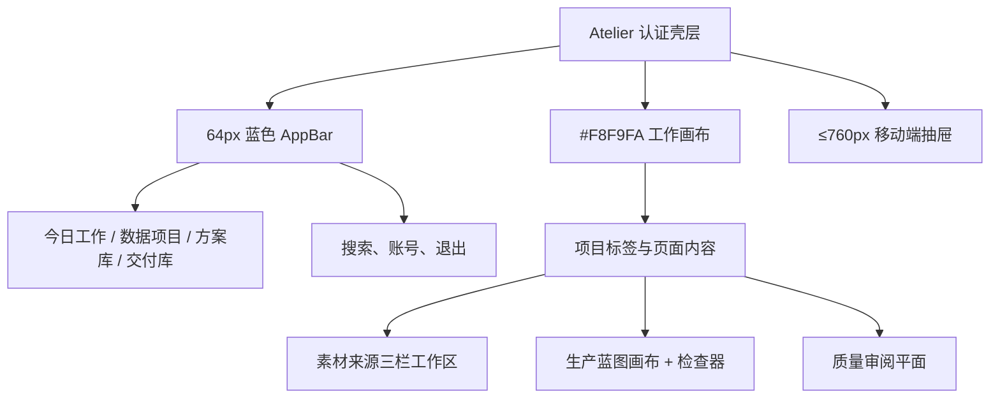
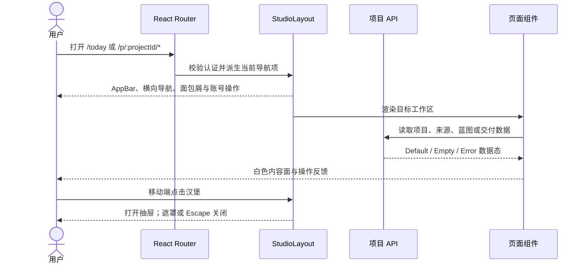

# Atelier EasyDataset 风格界面改造

本次改造把 Atelier 的认证工作区调整为 EasyDataset 风格的应用壳层：64px 蓝色顶部栏、横向主导航、浅灰画布、白色内容面、8px 圆角和低阴影。实现继续复用现有 Semi UI 与路由，不复制 EasyDataset 的 MUI/Next 代码。

参考：[`ConardLi/easy-dataset`](https://github.com/ConardLi/easy-dataset) 的 AppBar、工作区标签和移动端抽屉。实现入口为 [`StudioLayout.tsx`](../../apps/web-user/src/studio/StudioLayout.tsx) 与 [`styles.css`](../../apps/web-user/src/styles.css)。

## 页面关系





## 桌面与移动端线框

```text
桌面（≥761px）
┌────────────────────────────────────────────────────────────────────────────┐
│ Atelier · 数据项目工作室 │ 今日工作 │ 数据项目 │ 方案库 │ 交付库 │ 搜索  A  ↪ │
├────────────────────────────────────────────────────────────────────────────┤
│ 面包屑 / 当前项目与页面上下文                                               │
├────────────────────────────────────────────────────────────────────────────┤
│                                                                            │
│  页面标题、主操作按钮                                                       │
│  ┌──────────────────────┬──────────────────────────────┬─────────────────┐  │
│  │ 来源清单              │ 素材预览                     │ 切分策略 / 状态   │  │
│  │ 文件、状态、块数      │ 搜索、正文、分页             │ 表单、保存、历史   │  │
│  └──────────────────────┴──────────────────────────────┴─────────────────┘  │
└────────────────────────────────────────────────────────────────────────────┘

移动（≤760px）
┌──────────────────────────────┐
│ ☰  当前页面             🔍 A │  ← 固定 60px 顶栏
├──────────────────────────────┤
│ 页面标题与主要操作            │
│ 白色内容卡片                  │
│ 表单字段按单列排列             │
└──────────────────────────────┘
点击 ☰ 后：左侧宽度 min(320px, 85vw) 的抽屉 + 遮罩；点击遮罩或 Escape 关闭。
```

## 五种界面状态

| 状态 | 壳层行为 | 页面内容行为 | 关键操作 |
|---|---|---|---|
| `Default` | AppBar、当前导航高亮、面包屑完整显示 | 白色内容面展示真实数据与分页 | 主操作保持蓝色实心按钮 |
| `Loading` | 导航仍可见，内容区域保留尺寸 | 使用骨架或水平 Spin，避免文字逐字竖排 | 禁用重复提交，保留返回与取消 |
| `Empty` | 壳层与页面标题保留 | 用简短原因说明空状态，并给出创建/上传行动按钮 | 首个行动按钮直接进入下一步 |
| `Error` | 壳层不卸载，当前导航仍高亮 | 内容面显示可读 Banner/错误块与重试按钮 | 重试只重新请求失败区域 |
| `Edge-Case` | 导航横向溢出可滚动，抽屉不超过视口 | 长文本换行、表格允许横向滚动、三栏在窄屏改为单列 | 操作按钮保持可点击尺寸并避免重叠 |

## 视觉令牌

| 令牌 | 值 | 用途 |
|---|---|---|
| `--accent` | `#2A5CAA` | AppBar、主按钮、当前项 |
| `--bg` | `#F8F9FA` | 页面画布 |
| `--panel` | `#FFFFFF` | 卡片与工作区面 |
| `--panel-border` | `#E5E7EB` | 轻分隔线 |
| `--shadow-soft` | `0 2px 8px rgba(15,23,42,.06)` | 低层级浮起效果 |
| `--header-height` | `64px` | 桌面 AppBar 高度 |

移动端抽屉保留原有键盘语义：汉堡按钮提供 `aria-expanded`，抽屉打开时可由遮罩或 Escape 关闭，导航点击后自动收起。

## 验证

- Docker Node 容器内 `npm run build -w apps/web-user` 通过。
- Chromium 桌面断言网格为 `64px + 内容区`、AppBar 为蓝色 `sticky` 横向布局。
- Chromium 移动端断言抽屉打开为 `data-mobile-open="true"`，Escape 后恢复 `false`。
- `/projects`、`/recipes`、`/deliveries`、`/p/:projectId/sources` 与 `/p/:projectId/blueprint` 均加载统一 Atelier 壳层。
