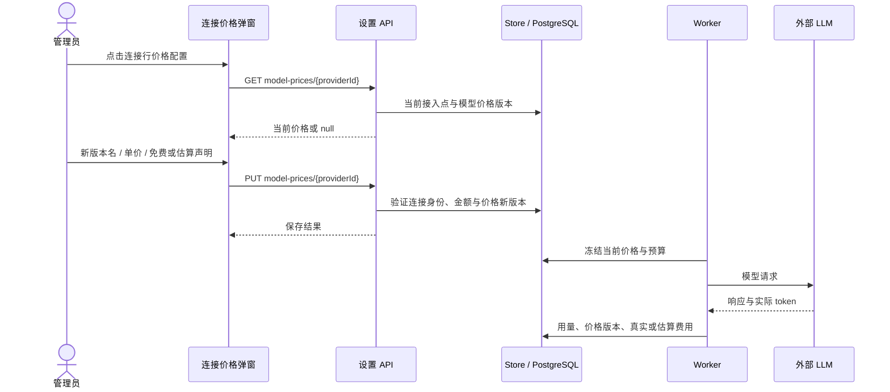
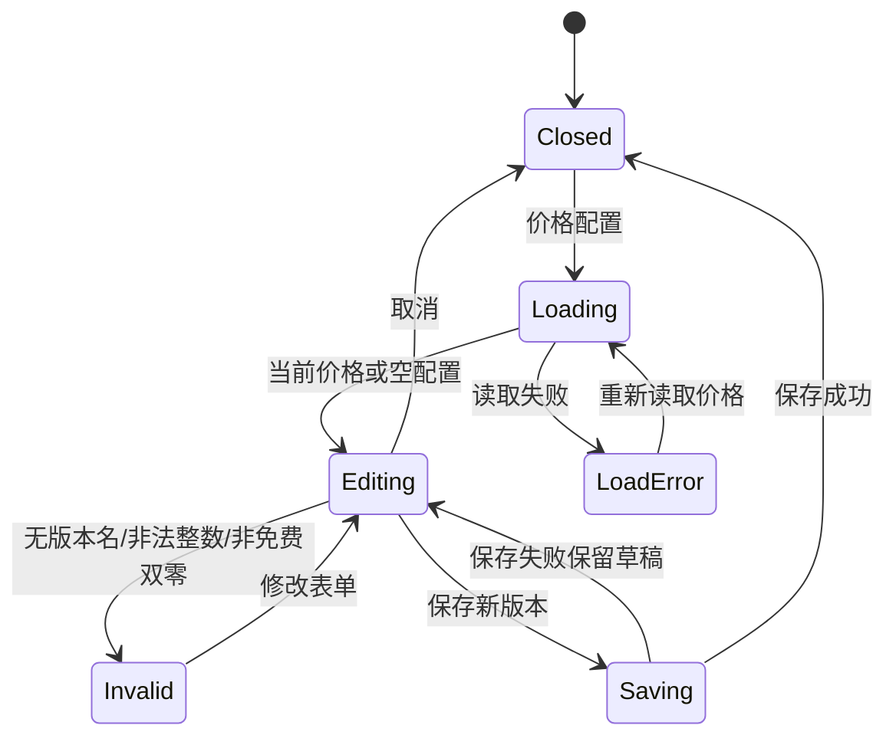

# 模型价格配置

Issue #160 的预算与费用闭环要求每次调用使用明确的价格版本。管理员可从“连接与存储”的模型连接行点击“价格配置”，读取当前模型价格并创建新价格版本。

## 操作与计价边界

| 字段 | 输入与规则 | 使用方式 |
|---|---|---|
| 新价格版本名 | 必填；默认生成时间版本名，支持自定义 | 标识后续调用所用价格，保留旧调用账目 |
| 输入/输出单价 | 人民币分/百万 token；非负安全整数 | 服务端依据实际 token 用量计算费用；100 分为 1 元 |
| 显式确认免费 | 勾选后两个单价设为零，清除估算标记 | 免费事实需要显式声明，零/零且未声明不可保存 |
| 保守估算价格 | 可选；免费时不可勾选 | 供应商 token 与保守报价计算的费用保持估算标记 |
| 价格说明 | 选填，记录公开来源或估算依据 | 价格版本审计说明 |

模型、接入地址与币种由服务端以当前连接确定。界面不允许将另一模型的价格误挂到该连接，也不读取或展示 API 明文密钥。普通用户只看连接清单，不显示价格写入入口；服务端仍负责权限判断。





## 布局与五态

```text
┌──────────────────────────────────────────────────────────────────────────────┐
│ Header · 连接与存储                                                           │
├───────────────┬──────────────────────────────────────────────────────────────┤
│ Sidebar       │ 模型连接清单                                                 │
│ 今日工作      │ 名称 │ 模型 │ 类型 │ 密钥掩码 │ 状态 │ [价格配置][编辑][停用]│
│ 数据项目      │ ┌─────────────────────────────────────────────────────────┐ │
│ 方案库        │ │ 价格配置：连接名称                                      │ │
│ 交付库        │ │ 模型 / 币种与分→元说明 / 当前价格版本                   │ │
│ 设置          │ │ 新价格版本名 [____________________________________]   │ │
│               │ │ 输入单价 [______]   输出单价 [______] 分/百万 token    │ │
│               │ │ [ ] 显式确认免费模型   [ ] 使用保守估算价格            │ │
│               │ │ 价格说明（选填） [_______________________________]    │ │
│               │ │ 校验/保存失败 Banner                                  │ │
│               │ │                         [取消] [保存价格新版本]       │ │
│               │ └─────────────────────────────────────────────────────────┘ │
└───────────────┴──────────────────────────────────────────────────────────────┘
```

| 状态 | 显示与交互 |
|---|---|
| Default | 显示当前版本及已配置单价，新版本草稿可编辑 |
| Loading | Spin；不能保存；弹窗关闭会忽略在途读取结果 |
| Empty | 明确说明无价格配置；保留价格表单；要求填写单价或显式免费 |
| Error | 读取失败提供重新读取；校验失败不发请求；保存失败保留输入 |
| Edge-Case | 负数/小数/安全整数溢出拒绝；免费自动置零；长连接名换行；390px弹窗限宽与行操作换行 |

组件在 `apps/web-user/src/studio/ModelPriceModal.tsx`，实际可从 `/settings/connections` 预览；沿用现有 Semi UI 弹窗与项目设置布局。
