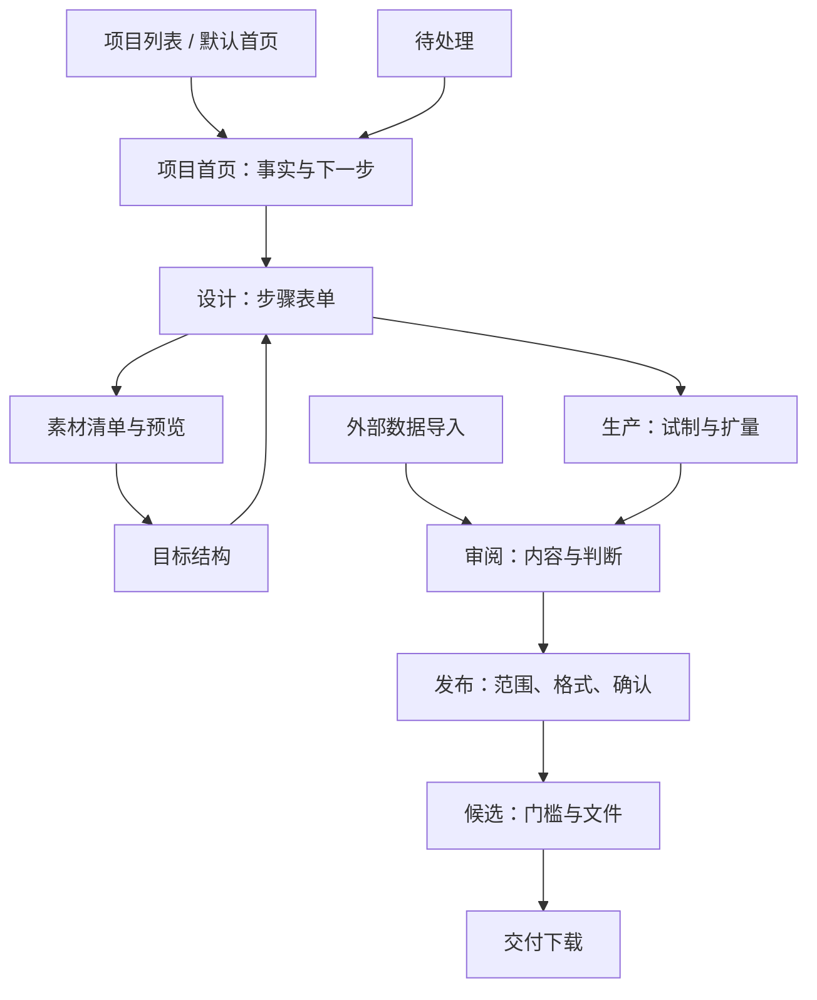

# 数据生产工作区页面原型

本文件配套 [详细重构方案](../architecture/atelier-product-flow-rebuild.md)。可预览实现位于 `apps/web-user/src/studio`，不是独立演示或第二套页面。引用 EasyDataset `4002b09` 的紧凑项目工作区布局，源码来源 https://github.com/ConardLi/easy-dataset 。

## 1. 页面结构与主线



所有页面共享顶部全局导航、面包屑搜索、项目阶段导航；下图省略重复部分，仅第一张绘制完整壳层。全局工具菜单包含连接、成员、清洗、评估、动态、帮助和历史资产。

### 项目列表与首页

```text
┌──────────────────────────────────────────────────────────────────────┐
│ Atelier  数据项目  待处理  方案库  交付库           工具与设置 账号 退出 │
│ 数据项目                                             [搜索全部]      │
├──────────────────────────────────────────────────────────────────────┤
│ 数据项目                   [搜索项目____] [刷新] [新建项目]           │
│ ┌项目名称 · SFT────────┐ ┌项目名称 · GRPO───────┐                     │
│ │目标（最多两行）       │ │目标（最多两行）       │                     │
│ │计划数量 · 当前状态    │ │计划数量 · 当前状态    │                     │
│ │进入项目 →            │ │进入项目 →            │                     │
│ └─────────────────────┘ └─────────────────────┘                     │
│ 已显示 N 个项目 · 第 M 页                               [加载更多]   │
├──────────────────────────────────────────────────────────────────────┤
│ 项目名称                                                             │
│ [项目] [1 设计] [2 生产] [3 审阅] [4 发布]                            │
│ 设计：已配置 │ 生产：2/3完成 │ 审阅：N待判断 │ 发布：查看门槛          │
│ ┌下一步─────────────────┐ ┌计划 / 已生成 / 待审 / 接纳率──────────┐  │
│ │服务端返回的当前操作    │ │真实统计，不用固定0填补失败             │  │
│ │[当前唯一主按钮]       │ └───────────────────────────────────────┘  │
│ └──────────────────────┘  配置缺失与失败批次              [查看 →]  │
└──────────────────────────────────────────────────────────────────────┘
```

### 设计：填写区优先

```text
│ [项目] [设计] [生产] [审阅] [发布]                                    │
│ 设计任务：生成方案 | 目标结构 | 素材来源 | 思维标准 | 外部导入          │
│ 生产方案  vN · 已保存                                                │
│ ┌步骤列表 230px─────┬─────────────────────────────────────────────┐   │
│ │1 范围            │ 当前步骤名称                                 │   │
│ │2 标准            │ 必填字段 [_______________________________]   │   │
│ │3 生成            │ 模型连接 [选择]   参数 [数量]                 │   │
│ │4 评估            │ 高级参数（默认折叠）                         │   │
│ │5 清洗            │ [上一步] [保存方案] [保存并继续 / 进入试制]   │   │
│ └──────────────────┴─────────────────────────────────────────────┘   │
│ ▸ 配置依赖图（拖动/缩放保留，非默认主操作）                           │
│ ▸ 版本历史                                                           │
```

目标结构页：领域 → 方向 → 配额 → AI 合成或素材块，保存后“继续配置生成”。标准页：有序步骤、具体做法与检查点，历史折叠。未保存不能进入执行；历史复制为草稿后再编辑。

### 素材与外部导入

```text
│ 素材来源                     [导入数据集] [上传素材]                  │
│ ┌来源清单──────────┬─────────────────────────────────────────────┐   │
│ │文档A · 12块      │ 当前文档名称     [搜索素材内容_____________]  │   │
│ │文档B · 解析中    │ 素材块标题 / 正文                           │   │
│ │文档C · 8块       │ [上一页]        范围 / 总数       [下一页]    │   │
│ └──────────────────┴─────────────────────────────────────────────┘   │
│ ▸ 切分策略  ▸ 来源版本历史  ▸ 导入记录                                 │
│ N 份素材                                     [关联到目标结构 →]     │
├──────────────────────────────────────────────────────────────────────┤
│ 导入数据集                                                           │
│ ┌选择文件──────────────────┬──服务端导入预览─────────────────────┐   │
│ │ [选择 / 拖入 JSON/JSONL]   │ 源记录 N      有效 N                 │   │
│ │格式 [自动识别，可改]       │ 重复 N        无法导入 N             │   │
│ │导入名称 [_______________] │ 错误行及原因                         │   │
│ │▸ 粘贴或编辑数据           │ [确认导入 N 条有效记录]              │   │
│ │▸ 映射及说明               │                                     │   │
│ │[校验并预览]               │ 结果：[审阅导入数据] [继续导入]      │   │
│ └───────────────────────────┴────────────────────────────────────┘   │
```

文件选择自动预览，不自动写入。修改格式、名称、正文、说明均使已校验预览失效。服务端是格式校验权威；20 MB / 5000 条限制保留。

### 生产：进度与继续操作

```text
│ 生产                          [开始试制] [扩量生产]                  │
│ 批次 | 状态 | 完成/计划 | 缺口 | 失败 | 当前操作 | ▸控制               │
│ 001  |运行中|  20/100   |  80  |   0  | [查看进度]                    │
│ 002  |失败  |   8/10    |   2  |   2  | [处理失败]                    │
├──────────────────────────────────────────────────────────────────────┤
│ 开始试制：当前方案版本（自动带入）                                    │
│ 规模 [__]     预算 [__分]        ▸调整版本                            │
│ 执行前检查：范围、标准、模型连接、预算；错误就地修正                   │
│ [返回]                                           [检查并开始试制]   │
├──────────────────────────────────────────────────────────────────────┤
│ 批次详情：生产进度 20/100           [暂停 / 恢复 / 审阅产出]          │
│ 阶段进度条及完成量 / 失败量 / 缺口                                    │
│ ▸产出分析   ▸配置快照   ▸运行事件                                     │
```

### 审阅：专注正文与判断

```text
│ 样本标题 · vN    状态    [上一条] [下一条] [队列与证据]               │
│ ┌样本内容───────────────────────────┬──审阅判断───────────────────┐ │
│ │问题 / 指令                  [复制] │ [接纳] [隔离]               │ │
│ │思考过程、答案                      │ 判断理由（必填）            │ │
│ │或GRPO教师提示与奖励判据            │ [_______________________]   │ │
│ │正文保留足够阅读宽度                │ ☑保存后下一条               │ │
│ │                                    │ [保存并下一条]              │ │
│ │                                    │ ▸发布门槛  ▸评论            │ │
│ └────────────────────────────────────┴────────────────────────────┘ │
│ 默认隐藏的辅助区：[审阅队列] [证据、版本、判断历史]                    │
```

导航取消、409、网络错误不清理由；成功但有效投影冲突不跳下一条。非队首进入仍前进到正确后继。只读用户没有写入操作。J/K 快捷键在输入框中不抢键。

### 发布：分步缩小决策范围

```text
│ 发布数据                                                             │
│ [1 选择范围] ───── [2 格式与映射] ───── [3 确认候选]                 │
│ 第一步：[筛选] 当前页勾选 / 全部筛选冻结范围，明确选择数量             │
│ 第二步：文件格式 [JSONL/Alpaca/CSV] 映射版本 [当前已保存]             │
│         ▸编辑映射（未保存不得继续）                                   │
│ 第三步：范围、格式、映射；版本名 [必填] 用途 [必填] 限制（选填）      │
│ [上一步]                     [继续 / 创建候选（不会立即发布）]       │
├──────────────────────────────────────────────────────────────────────┤
│ 候选状态 · 质量门槛                          [检查 / 发布]            │
│ 阻塞：具体原因 + 修复入口                                              │
│ 文件名 · 格式 · 状态 · 行数                           [下载]          │
│ ▸文件校验详情  ▸数据卡  ▸manifest  ▸评论                              │
```

SFT/GRPO 是项目数据类型，不是文件格式；GRPO 交付仅支持 JSONL。创建候选不启动构建；明确“冻结并发布”后进入 building，成功后 published，build_failed 保留同一发布 ID 重试。

## 2. 五态定义

| 界面 | Default | Loading | Empty | Error | Edge-Case |
|---|---|---|---|---|---|
| 项目与待处理 | 项目卡、事实、直接处理按钮 | 加载提示保留导航 | 创建项目 / 暂无待办 | 错误与重试，非空列表伪装 | 长名称两行；数值换行；分页常显 |
| 设计 | 左步骤、右填写，当前状态 | 配置加载提示 | 创建第一版本入口 | 字段校验/409草稿保留 | 窄屏步骤横滚，正文单列，历史只读 |
| 素材与导入 | 清单/预览；导入先预览后确认 | 解析/校验进度 | 上传第一素材/选择文件 | 空文件、容量、格式、网络错误就地 | 长正文换行，20 MB/5000条限制，修改预览失效 |
| 生产 | 当前方案、进度、主动作 | 批次读取及执行前检查 | 新建试制入口 | 前置条件或失败恢复 | 极大数量不溢出，部分完成不冒充完成 |
| 审阅 | 两栏、保存后下一条 | 局部样本/队列加载 | 无待判断 / 返回全部数据 | 409不跳，保留理由，本地草稿退路 | 长正文与hash换行；冲突/只读；非队首后继 |
| 发布 | 三步与明确冻结范围 | 候选building轮询 | 返回审阅 / 无候选 | 快照用途、跨项目、dirty映射、质量门阻塞 | 筛选跨页冻结，重试幂等，已发布只读 |

窄屏 390px：全局导航为抽屉，Escape/遮罩关闭并恢复焦点；阶段导航局部横滚；主要操作区一列；底部操作栏不覆盖最后一项。桌面 1440px：减少嵌套留白，正文与配置分栏。

## 3. 验收记录位置

浏览器截图及操作报告写入忽略目录 `output/playwright/`；可复现测试保留在 `test/l15_product_navigation.mjs`、`test/l15_product_production.mjs`、`test/l15_product_review_release.mjs` 与 `test/audit/source217-ui.mjs`。文档的状态表是验收要求，不等同自动化已覆盖所有组合；交付报告逐项记录实际执行结果。
