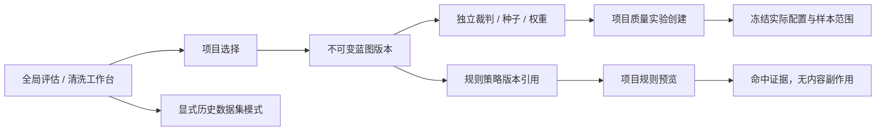
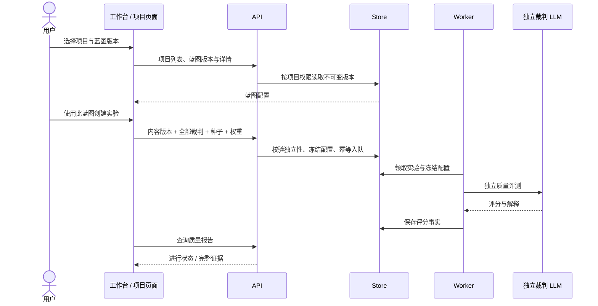

# 评估与清洗工作台的项目蓝图上下文

对应 Issue #197 第 9 条。默认 `/tools/evaluation` 与 `/tools/cleaning` 读取项目和不可变蓝图版本。历史数据集工具通过 `?mode=legacy` 显式进入；既有 `?datasetId=` 深链继续使用历史链路。

2026-10-08 交付基线：[PR #266](https://github.com/1420970597/llm/pull/266) 已合 main [`e381256`](https://github.com/1420970597/llm/commit/e3812565024e21d402d79e460046f2bb709cac37)。最终 head `57fb7cd` 的 [CI run 37734281360](https://github.com/1420970597/llm/actions/runs/37734281360) 五项 SUCCESS，工作台五态、实际请求与迁移菜单断言的 JSON、截图和 trace 位于 `source217-ui-report` artifact。Chromium 执行生产 UI，API 为受控夹具；该证据不代表真人研究或真实 provider 质量旅程已完成。

## 操作与配置映射

| 输入 | 质量实验 | 清洗规则预览 |
|---|---|---|
| 项目 | 项目作用域的样本、批次、权限与质量报告 | 项目作用域的策略与样本版本 |
| 蓝图版本 | 全部裁判连接、抽样种子、维度权重、兼容的缺分策略 | 蓝图引用的 `qualityPolicyVersionId`，可以早于最新策略 |
| 深链 | `projectId` / `blueprintVersionId` 传入项目质量创建页 | 相同参数传入项目规则页 |
| 后续变更 | 创建时冻结实际裁判、量表、种子与内容版本；旧蓝图不改写 | 预览读取不可变策略；不会修改内容或人工处置 |
| 错误 | 不存在/跨项目蓝图、读取失败、不支持的缺分策略阻止提交 | 无策略引用或策略不可用明确报错，不改用最新版本 |

蓝图的 `zero` / `not_applicable` 策略与现有实验策略不兼容时明确阻断，并提示保存支持排除缺分的新蓝图。SFT 维度权重沿用现有质量实验的 0–10 分范围；没有自定义权重时沿用现有准确性维度。GRPO 继续使用服务端内置量表，蓝图含自定义权重时明确阻断，避免静默忽略。移除深链蓝图参数会清空先前配置，不把它带到另一个实验。裁判独立性由实际接入点判定，界面不把两个模型名称当成独立来源。





```mermaid
stateDiagram-v2
    [*] --> Loading
    Loading --> Empty: 无项目或蓝图
    Loading --> Error: API 失败 / 所选版本不属于项目
    Loading --> Default: 版本读取成功
    Error --> Loading: 重试 / 重新选择
    Empty --> Loading: 创建项目 / 配置蓝图
    Default --> Loading: 切换项目 / 蓝图
    Default --> Quality: 进入质量创建
    Default --> Rules: 进入规则预览
```

## 页面布局与五态

```text
┌─────────────────────────────────────────────────────────────────────────────┐
│ Header · Atelier / 评估工作台                             [历史数据集工具]  │
├───────────────┬─────────────────────────────────────────────────────────────┤
│ Sidebar       │ 评估工作台 / 清洗工作台                                     │
│ 今日工作      │ 选择项目与蓝图版本，沿用该版本配置                          │
│ 数据项目      ├────────────────────────────┬────────────────────────────────┤
│ 评估工作台    │ 项目 [真实项目名称 v]      │ 蓝图版本 [v1 · 配置说明 v]     │
│ 清洗工作台    ├────────────────────────────┴────────────────────────────────┤
│ 设置          │ 蓝图 v1 · 配置说明                                         │
│               │ 裁判数量 / 抽样种子 / 缺分策略，或所引用清洗策略            │
│               │ [使用此蓝图创建质量实验 / 预览清洗规则]                    │
│               │ [查看所选蓝图配置] [项目质量报告]                         │
└───────────────┴─────────────────────────────────────────────────────────────┘
```

| 状态 | 表现与行动 | 浏览器断言 |
|---|---|---|
| Default | 显示真实版本配置；操作深链保留项目与蓝图行 ID | 双裁判、seed=88、0.6/0.4 权重进入实际请求；历史策略 55 不被最新 66 替换 |
| Loading | 项目/蓝图加载指示；版本选择暂时禁用；未读取成功不可提交 | 来源 CI 中统一加载门禁；工作台请求成功后才出现上下文 |
| Empty | 无项目→创建项目；无蓝图→配置蓝图；未选择项目明确提示 | 两工作台的无项目状态与行动入口 |
| Error | 保留错误与重试；非法蓝图不显示可操作上下文 | 两页 API 失败/恢复；蓝图 999 明确拒绝 |
| Edge-Case | 390px 不产生页面横向溢出；旧数据集深链维持历史语义 | 两工作台移动布局；多裁判不静默丢弃 |

实现复用 `apps/web-user/src/studio/pages/LegacyToolPages.tsx` 和原 `QualityPages.tsx`，读取逻辑集中在 `apps/web-user/src/studio/blueprintContext.ts`。浏览器脚本 `test/audit/project-tools-ui.mjs` 由 `test/audit/run-source217-ui.mjs` 在真实 Chromium 中运行；受控 API 夹具校验生产页面发出的请求，不宣称真人、真实 provider 或付费质量实验已完成。

## 历史菜单的迁移条件

同一轮闭环 #197 第 16 条：`StudioLayout.tsx` 按真实 `/v1/legacy/migration-status` 结果决定是否显示历史主菜单。只有 `scope=visible_legacy_assets`、明确完成、有旧资产且缺口为零才收起；空库、部分完成、网络错误或旧接口无 scope 都保留入口。当前 legacy 数据集目录按既有 API 对登录账号共同可见；每个资产须有无失败的 completed dataset 导入台账，来源键与映射目标一致，且目标项目存在该账号的成员关系。仅手动绑定或失败导入不能算成功。单 SQL 失败直接报错，避免把失败计数清零后误报完成。

| 对账状态 | 主菜单 | 历史深链 |
|---|---|---|
| 0 个旧资产 | 保留；不冒充迁移成功 | 保留只读 |
| 缺成功台账或项目不可访问 | 保留 | 保留只读 |
| 所有资产成功导入并映射到可访问项目 | 收起历史主入口 | 保留只读 |
| 网络 / 数据库错误 | 保留 | 保留只读 |
| 旧接口未明确账号范围 | 保留 | 保留只读 |

真实 PG 回归覆盖账号范围、不可见映射、无成功台账、失败导入、成功导入、无账号和读取错误；真实 Chromium 覆盖上述五种菜单状态及完成后的只读深链。此修改不批量迁移旧资产，也不删除旧数据。

2026-10-08 原 `llm` 数据库只读现状：53 个旧 dataset，9 条 completed dataset 导入台账且 failed_items 合计为 0，9 个 distinct legacy_dataset_id 映射。账号 1 按成功台账及成员可访问目标的完整判据仍有 44 pending，实际菜单应保留。该快照不代表所有账号或后续时刻；本次未批量迁移、改写或删除旧资产。#197 已关闭，技术修复与实际未全迁移的条件说明见 [关单评论](https://github.com/1420970597/llm/issues/197#issuecomment-6053549245)。
