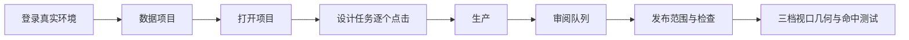
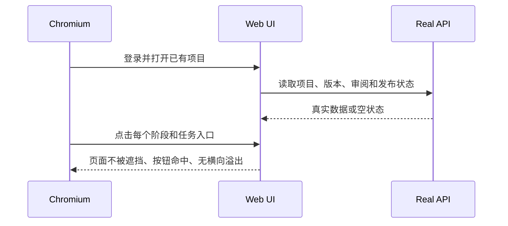
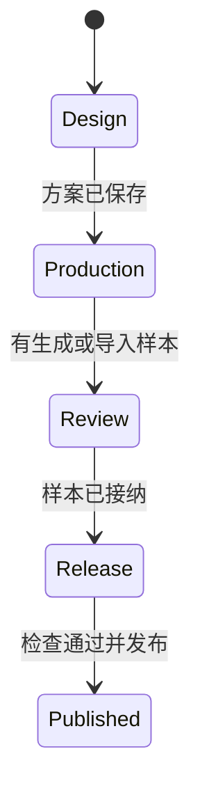

# 真实浏览器布局修复记录

本轮使用真实 API 数据，以 Chromium 在 1440×900、768×900 和 390×900 三档视口点击项目、设计、素材导入、生产、审阅、发布入口。截图与几何证据保存在 `output/playwright/real-layout/`（不纳入发布包）。测试只读现有项目，不代替人工审阅结论。

## 修复目标

```
┌──────────────────────────────────────────────────────────────────┐
│ Atelier | 数据项目  待处理  方案库  交付库          工具/账户      │
├──────────────────────────────────────────────────────────────────┤
│ 面包屑 / 项目名                                                     │
│ 项目  1设计  2生产  3审阅  4发布                                   │
│ 设计任务: 目标结构 | 素材来源 | 标准 | 外部导入                    │
├───────────────────────┬──────────────────────────────────────────┤
│ 步骤列表（桌面可滚动） │ 当前表单 / 数据 / 证据                      │
│ 当前步骤可见且可点击   │ 操作栏处于视口底部，按钮完整可点              │
└───────────────────────┴──────────────────────────────────────────┘
```

移动端以单列内容为唯一文档流；主导航变成紧凑抽屉，步骤列表改为横向滚动。抽屉脱离 Grid 文档流，避免短页面顶部出现空白轨道。

## 本轮发现与根因

| 视图 | 实际问题 | 根因 | 修复 |
| --- | --- | --- | --- |
| 项目列表 | 卡片文字贴边、类型标签拥挤 | 全局 `button` reset 清除了卡片内边距 | 卡片恢复 18px 内边距，标签禁止压缩 |
| 顶部导航 | 768px 交付库只显示一个字 | 导航项按 flex 默认伸缩并被账户区挤压 | 导航项 `flex: 0 0 auto`，960px 以下改抽屉 |
| 设计方案 | 16 步列表撑高第一行，表单下方内容离屏 | 步骤列表没有视口上限 | 桌面 rail 限高并滚动；移动横向滚动 |
| 导入 | 中等宽度导入名称越出卡片 | 字段存在 140/200px 最小列宽 | 列改为 `minmax(0, …)`，900px 以下单列 |
| 移动短页 | 审阅/发布内容从 y299 或 y403 才开始 | fixed 抽屉仍占用旧 Grid 的 sidebar 行 | 移动 shell 改为单一 content grid 区域 |
| 移动抽屉 | 主导航项出现 182px 巨大空行 | `flex: 1` 从桌面样式泄漏到抽屉 | `flex: 0 0 auto` 与 `align-content:start` |

## 页面状态

| 状态 | 设计规则 |
| --- | --- |
| Default | 内容卡片在同一水平节奏内，主操作始终可见或可滚动到 |
| Loading | 页面级 Spin 有可用宽度，提示保持横向阅读 |
| Empty | 审阅/发布明确显示无数据，保留下一步入口 |
| Error | 错误放在当前表单附近，保留重试，不跳走上下文 |
| Edge-Case | 长项目名截断但不覆盖标签；长步骤列表滚动；390px 字段单列且无横向溢出 |

## 浏览器验收流



## 验收约束



状态机保持产品主线：


