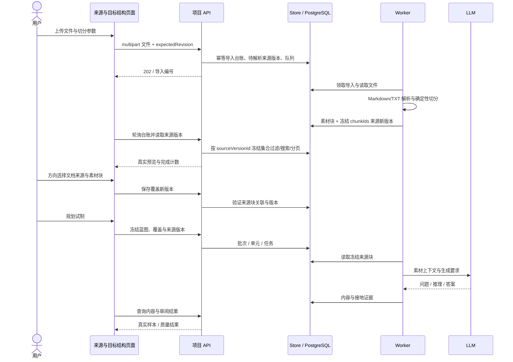
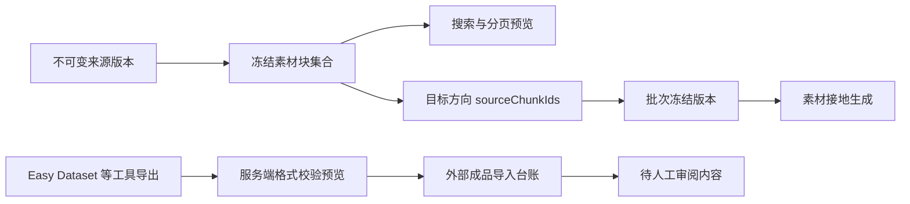
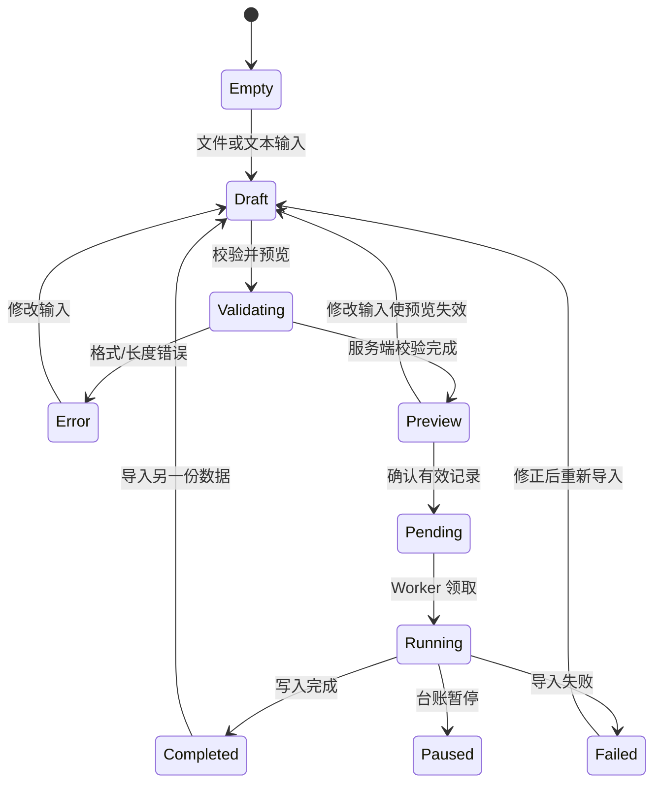

# 素材来源、外部导入与目标结构界面

对应 Discussion #165、Issue #217。实现组件位于 `apps/web-user/src/studio/pages/`，可从项目设计区进入，也可直接访问 `/p/:projectId/sources`、`/p/:projectId/sources/import` 和 `/p/:projectId/coverage`。

2026-10-08 交付基线：[PR #266](https://github.com/1420970597/llm/pull/266) 的五态 Chromium 门禁与 [PR #267](https://github.com/1420970597/llm/pull/267) 的真实生成修复均已合入；代码 main 为 [`bd439eb`](https://github.com/1420970597/llm/commit/bd439ebae5e25b63419a070986e5e3b9ec885e5f)。该精确 main 的 [CI run 37740657964](https://github.com/1420970597/llm/actions/runs/37740657964) 五项 SUCCESS，同一生产 UI 门禁再次通过；真实后端与供应商运行另见 [验收记录](../architecture/source-grounded-acceptance.md)。

## 页面与业务边界

| 页面 | 输入与操作 | 结果 | 权限与版本 |
|---|---|---|---|
| 素材来源 | 上传 Markdown/TXT；编辑递归/分隔符切分、长度和标题路径；搜索、分页预览 | 后台任务与真实导入记录；只读素材块 | 项目读权限查看；设计权限保存策略；运行权限上传；历史版本只读 |
| 外部数据集导入 | 文件或文本、格式、导入名称；服务端校验预览；明确确认 | 有效内容进入人工审阅；重复跳过；失败原因可查询 | 运行权限；20 MB、5000 条；同内容幂等回放 |
| 目标结构 | 编辑领域、方向、配额、来源；分页选择真实素材块 | 新覆盖版本；按稳定方向 ID 规划试制 | 设计权限；显式零配额不生产；历史无来源版本保留旧容量语义 |

Alpaca 映射 instruction/input → 问题、output → 答案、可选 reasoning → 推理；ShareGPT 按 user/human 与 assistant/gpt 配对；JSONL 按 question/reasoning/answer 映射。外部成品标记为未接地，不伪装成基于素材生成的数据。PDF/DOCX 暂需转换为 Markdown/TXT；界面明确说明支持范围。

## 全链路时序与版本关系







## 可预览布局

```text
┌──────────────────────────────────────────────────────────────────────────────┐
│ Header · 项目名称 / 设计     [概览] [设计] [生产] [数据] [质量] [发布]          │
├───────────────┬──────────────────────────────────────────────────────────────┤
│ Sidebar       │ 素材来源                 [目标结构] [外部数据集] [上传素材]    │
│ 今日工作      ├───────────────┬──────────────────────────┬───────────────────┤
│ 数据项目      │ 来源清单      │ 素材预览                 │ 切分策略          │
│ 方案库        │ > 手册.md     │ [搜索素材内容________]   │ 算法 [递归 v]     │
│ 交付库        │   政策.txt    │ 标题路径 / 块编号        │ 最小长度 [200]    │
│ 设置          │ 状态/块数     │ 实际内容                 │ 最大长度 [2000]   │
│               │               │ [上一页] 1–10 [下一页]   │ 分隔符 [\n\n]     │
│               ├───────────────┴──────────────────────────┴───────────────────┤
│               │ 变更说明（选填） [_________________] [保存素材来源新版本]    │
│               │ ▸ 版本历史（只读）                                           │
│               │ 导入记录 [刷新] 状态/新增/重复/缺内容/失败  ▸ 失败明细       │
└───────────────┴──────────────────────────────────────────────────────────────┘

外部导入 Content：格式 [Alpaca v] 导入名称 [____________]
                 [选择文件] / 数据内容 [多行文本________]
                 [校验并预览] → 有效/重复/失败计数 → [确认导入]

目标结构 Content：创建估算与实际结构 / 未选择来源缺口
                 领域 [名称] [稳定 ID]
                 方向 [名称] [ID] [配额] [文档/AI/未选择 v] [删除]
                 已关联素材 [取消] · [选择素材块] → 搜索/分页/复选框
                 [添加方向] [添加领域] [保存新版本] [规划试制]
```

390px 视口下三栏折叠为单列；方向编辑字段按行排列；操作与分页可换行。文件名省略并提供完整 title，正文与失败原因自动换行。

## 五种界面状态

| 状态 | 素材来源 | 外部导入 | 目标结构 |
|---|---|---|---|
| Default | 文件清单、真实块内容、切分参数与台账 | 可编辑内容，格式映射说明；校验后显示确认范围 | 实际结构、来源选择与关联，创建估算单列说明 |
| Loading | 加载来源/块时显示 Spin；台账处理中定时刷新 | 读取文件/校验/确认时禁用重复操作；后台状态可离页 | 文档加载显示 Spin，历史块标签独立加载 |
| Empty | 说明未有素材并提供添加/外部导入入口 | 示例 placeholder 与选择文件操作 | 提供添加领域，新增方向默认未选择来源 |
| Error | 上传/版本冲突/块查询分别展示；块重试重新请求 | 服务端校验错误与逐条失败原因；完成回放也读取台账 | 保存冲突保留草稿；来源目录失败明确告知 |
| Edge-Case | 不支持格式、空文件或超过200MB拒绝；历史预览按冻结ID查询 | 空/超过20MB拒绝；修改输入使旧预览失效；重复导入回放 | 新显式零配额不生产；旧无来源0/负配额保持历史回退；缺来源不运行；长字段换行 |

视觉与交互参考：本仓已审核原型 [`blueprint-workflow-rearchitecture`](./blueprint-workflow-rearchitecture/README.md) 的来源资料与目标结构屏；实现沿用项目现有 Semi UI 和设计壳，所有计数来自实际 API 响应或文档容量推导。

## 验证

容器内 `npm run build`、`test/l15_issue197_remediation.mjs`、`test/l15_studio_shell.mjs` 与 `test/l15_studio_browser_router.mjs` 均通过；Go 格式化、vet、构建与全套单测通过。浏览器验收入口为 `test/audit/run-source217-ui.mjs`，使用真实 Chromium 执行生产页面与 API 契约夹具，覆盖历史冻结分页、查询重试、非法/异步素材上传、跨页关联保存、坏 JSON、超过 20 MB 文件、文件内容导入、预览失效、完成回放失败明细、390px 三页面布局与运行错误。该前端契约验收不替代后端数据库与真实全栈集成验证。

2026-10-08 补齐 E2：来源页与目标结构页分别断言 Default、Loading、Empty、Error 及重试；导入页断言空输入、填写后常规态、受控校验请求期间的加载禁用、格式错误及大小边界。CI 的 Frontend job 安装固定 Playwright 版本，在 Vite 生产构建上运行相同脚本；任一断言失败都会使 job 失败。#266 合并提交为 `e3812565024e21d402d79e460046f2bb709cac37`，最终 head `57fb7cd` 的 [CI run 37734281360](https://github.com/1420970597/llm/actions/runs/37734281360) 五项 SUCCESS。账号与项目来自受控 API，无数据库种子依赖；JSON 结果、截图及 trace 以 `source217-ui-report` artifact 保存，不替代真实后端数据流、独立裁判或真人任务验收。
