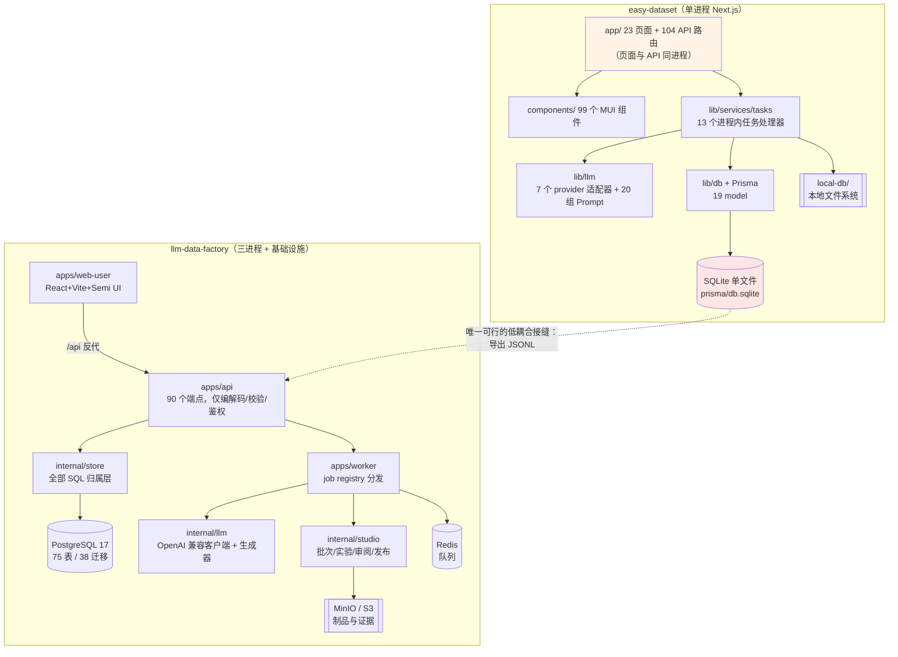
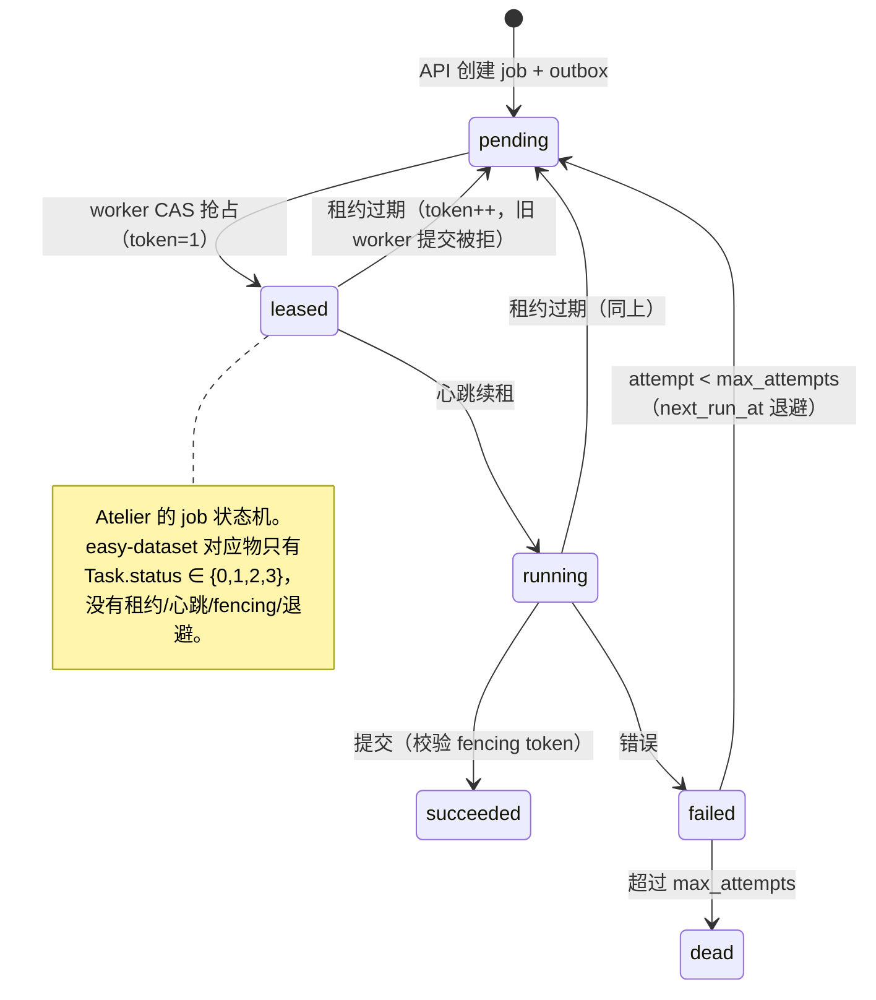
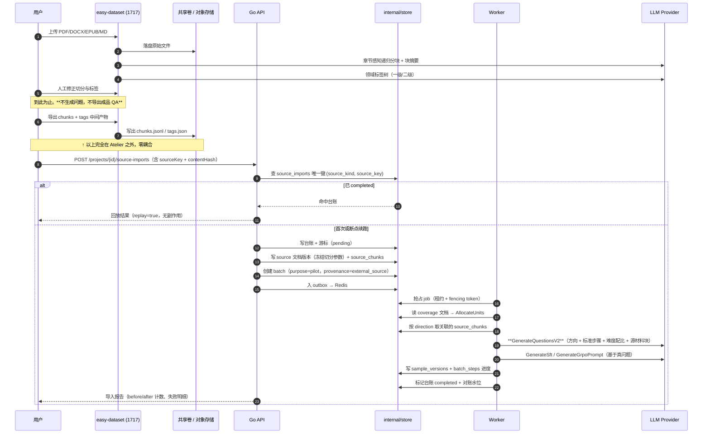
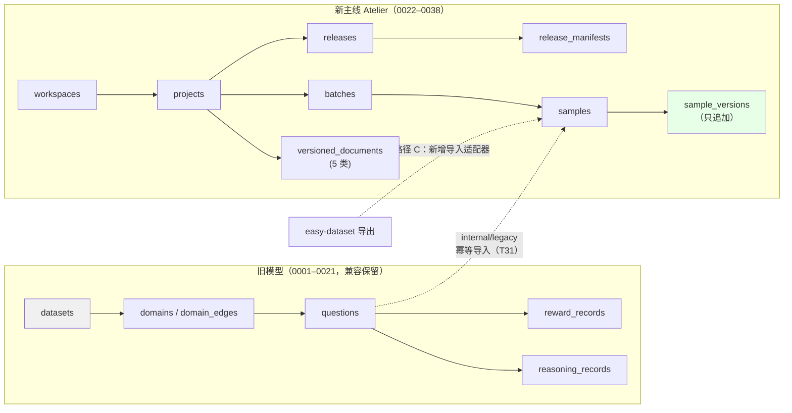
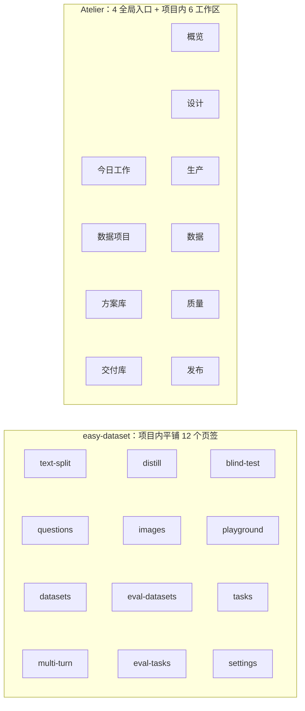

# Easy Dataset 集成可行性调研：技术架构与前端设计双向评估

> 调研对象：[`ConardLi/easy-dataset`](https://github.com/ConardLi/easy-dataset) v1.7.3
> 对照系统：本仓库 `llm-data-factory`（Atelier 数据项目工作室，`main` @ `e77bfcc`）
> 调研日期：2026-09-23 ｜ 类型：纯调研，**未修改任何产品代码**
> 关联讨论：[#159 Atelier 数据项目工作室](https://github.com/1420970597/llm/discussions/159)、[#158 全景设计](https://github.com/1420970597/llm/discussions/158)、[#165 本调研的发布与跟进评论](https://github.com/1420970597/llm/discussions/165)
>
> ⚠️ **2026-09-23 修正（第二轮调研）**：本文 §3.3、§5.3、§7 的「路径 C」定义已修正为 **C2（导入中间产物）**。
> 原 C1（导入最终 JSONL）会绕过 Atelier 的问题生成、使覆盖矩阵与思维标准降级为装饰品，与 #159 的产品语义冲突。
> 修正依据见 §5.3.1「第二轮发现：`question` 是模板占位符」。

---

## 0. 先给结论

**可以集成，但"把 easy-dataset 嵌进 Atelier"是错误的目标形态；正确形态是"把它的产出接进 Atelier 的版本化管线"。**

三句话版本：

1. **技术架构上不是"能不能"的问题，而是"以什么边界"的问题。** 两个系统在运行时（Go+Postgres+Redis+MinIO vs Node+SQLite+进程内任务）、任务模型（DB 租约 + fencing token vs `processTask()` 火忘调用）、领域语义（版本化不可变样本 vs 可变问答对）三个层面**同构度极低**。合并代码库等于同时维护两套运行时。
2. **前端设计上"嵌入"代价高于"借鉴"。** easy-dataset 是 MUI v5 + Next.js App Router 的 **无鉴权单租户工作台**；Atelier 是 Semi UI + Vite 的**多租户、带项目上下文与权限位**的控制台。把 MUI 组件树塞进 Semi 外壳，会同时破坏两边的设计系统、i18n 与路由语义。
3. **真正的集成价值点只有一处，而且当前系统正好缺这块拼图：** Atelier 的生产蓝图（`blueprint` 文档）有 `coverage → standard → generation → evaluation → rules → human_review → delivery` 七个节点，**但没有任何"原始素材从哪来"的输入**。系统没有文档实体、没有分块实体、没有任何 `multipart` 上传端点（全仓库 0 处）。easy-dataset 恰好补的是这个洞：**文档 → 章节感知分块 → 领域标签树 → 问题**。

**推荐路径：近期采用「路径 C2 中间产物级桥接」（easy-dataset 独立部署 + 导入 chunks/标签树，问题生成仍由 Atelier 负责），中期采用「路径 D 能力原生移植」；明确否决「路径 B 反代嵌 UI」与「路径 E 服务化调用」。**

| 决策 | 结论 | 决定性理由 |
|---|---|---|
| 是否集成 | ✅ 是（仅产物/能力层） | Atelier 缺素材侧能力，easy-dataset 已验证可用（14.9k star、28 贡献者、EMNLP 2025 demo） |
| 是否合库 | ❌ 否 | 运行时与任务模型不可调和；无测试、无鉴权、SQLite 单文件状态 |
| 是否嵌前端 | ❌ 否 | 设计系统（MUI vs Semi）、鉴权（无 vs 会话 Cookie）、路由（App Router vs React Router）三重冲突 |
| 是否复用其 HTTP API | ❌ 否 | 104 条路由无鉴权、无 OpenAPI、无版本化契约；AGPL §13 网络服务条款风险最高 |
| 集成入口 | 新增第六类版本化文档 `source`（素材来源）+ 接通 `GenerateQuestionsV2` | 与既有 `internal/legacy` 幂等导入（T31）同构，可复用三层幂等设计 |

---

## 1. 调研方法与证据边界

### 1.1 实际做了什么

| 手段 | 对象 | 得到什么 |
|---|---|---|
| `git` 全量克隆 | `ConardLi/easy-dataset` `main` | 源码级事实：`package.json`、`prisma/schema.prisma`、`ARCHITECTURE.md`、`AGENTS.md`、`Dockerfile`、`docker-entrypoint.sh`、`LICENSE`、`.github/workflows/` |
| 代码统计 | 克隆产物 | 23 页面、104 API 路由、99 组件、83,450 行 JS/JSX、19 个 Prisma model |
| GitHub REST API | 仓库元数据 | star/fork/issue/license/贡献者/发布节奏/最后提交时间 |
| GitHub Registry API | `ghcr.io/conardli/easy-dataset` | 镜像体积 426.3 MB（压缩层合计）、`linux/amd64` + `linux/arm64` |
| 公开检索 | 官方文档站、arXiv 2507.04009、EMNLP 2025 demo、竞品仓库 API | 产品定位、竞品横评、学术出处 |
| 本仓库静态审计 | `apps/`、`internal/`、`sql/` | 38 个迁移、75 张表、280 个 Go 文件、90 个 API 端点、47 个前端源文件 |

### 1.2 明确没有做的事（边界）

- **没有部署运行 easy-dataset**，因此性能、并发上限、大文件解析耗时均为**源码推断**，不是实测数字。
- **没有运行本仓库的 `docker compose`**，集成路径的资源增量是容量估算而非压测结论。
- **没有做用户访谈**，前端结论来自设计系统与交互结构的静态对比。
- 所有 star/issue 数字为 2026-09-23 快照。

---

## 2. 两系统基线对比

| 维度 | `llm-data-factory`（Atelier） | `easy-dataset` v1.7.3 |
|---|---|---|
| 语言/后端 | Go 1.24（280 文件 / 80,649 行） | JavaScript / Node 20（83,450 行 JS+JSX） |
| 前端 | React 18 + Vite + TypeScript + Semi UI + Tailwind（47 文件 / 20,668 行） | React 18 + Next.js 14 App Router + MUI v5（99 组件 / 22,123 行） |
| 持久化 | PostgreSQL 17（75 表 / 38 迁移） | SQLite 单文件（`prisma/db.sqlite`，19 model） |
| 异步 | Redis 队列 + `jobs` 表（租约、心跳、**fencing token**、`job_attempts`、`outbox`） | `processTask()` 在 API 进程内 fire-and-forget + 启动时 `recovery.js` 扫描 `status=0` |
| 对象存储 | MinIO / S3（`internal/storage`） | 本地文件系统（`local-db/`、上传目录） |
| 鉴权 | 会话 Cookie + 工作区/项目成员 + 审计日志 | **无**（`prisma` 无 `Users` model，无 `middleware.js`） |
| 多租户 | 工作区 → 项目 → 批次/样本，服务端授权为最终边界 | 单实例单用户，无租户概念 |
| 领域核心 | **不可变样本版本**（`sample_versions` 只追加）+ 冻结发布清单 | 可变问答对（`Datasets` 可编辑、可 AI 优化、可批量删） |
| 版本化文档 | 5 类（`blueprint`/`coverage`/`standard`/`quality_policy`/`mapping`），内容 hash + 乐观锁 | 项目级 Prompt 覆盖（`CustomPrompts`），无版本 |
| 文档摄入 | **完全缺失**（0 处 `multipart`/`FormFile`，无 PDF/DOCX 解析，无分块实体） | **核心能力**：PDF/MD/DOCX/TXT/EPUB + 4 种切分算法 + 章节感知递归分块 |
| 导出 | `jsonl`/`csv`/`parquet`/`alpaca`/`sharegpt`（`internal/exporter`） | Alpaca / ShareGPT / Multilingual-Thinking，JSON+JSONL，LLaMA-Factory 配置，HF 上传 |
| 模型接入 | `model_providers` 表 + 加密 API Key + 连通性测试 + 推理强度档位 | `LlmProviders`/`LlmModels`/`ModelConfig` 三表，OpenAI 兼容 + Ollama + 智谱/百炼/MiniMax/OpenRouter |
| 测试 | 101 个 `_test.go`，CI 含 `ci.yml` + `cd.yml` | **0 测试**，`package.json` 无 test 脚本，CI 仅 tag 时构建镜像 |
| 许可 | 仓库无 `LICENSE` 文件（GitHub 报告未识别协议），公开仓库 | **AGPL-3.0 + 附加条款**（品牌限制、商用另议） |
| 社区 | 内部项目，1 个 open issue | 14,946 star / 1,536 fork / 128 open issue / 28 贡献者 |
| 交付形态 | Docker Compose（web/api/worker/postgres/redis/minio） | Docker 镜像（426 MB）、NPM、**Electron 桌面端** |
| i18n | i18next 已接入但**资源为空**（仅 `zh-CN` 占位） | en / zh-CN / tr / pt-BR / it 完整翻译 |

### 2.1 结论性观察

- **两者不是同一层的工具。** Atelier 是"**数据项目治理与交付**系统"（版本、证据、发布、审计）；easy-dataset 是"**数据集试制车间**"（解析、生成、编辑、导出）。它们的关系是**上下游**，不是替代。
- **easy-dataset 的能力恰好落在 Atelier 的空白区**，而 Atelier 的能力（版本化、权限、审计、发布冻结）恰好是 easy-dataset 完全不具备的。这是互补，不是重叠。

---

## 3. 技术架构对比

### 3.1 模块分层对照



**读法**：红色是 easy-dataset 的状态单点（一个 SQLite 文件承载全部业务状态）；橙色是它的"页面与 API 同进程"耦合。本仓库则把 SQL 全部收在 `internal/store`，API 层不写业务逻辑（AGENTS.md §3 的红线）。**把 easy-dataset 合进来，等于在一个严格执行分层的仓库里引入一个反分层的子系统。**

### 3.2 异步任务模型：最不可调和的一处

| | easy-dataset | Atelier |
|---|---|---|
| 投递 | API 路由内 `processTask(id).catch(...)`（fire-and-forget） | `outbox` 表 → Redis → worker |
| 抢占 | 无 | DB CAS 抢占租约 |
| 心跳/防重复 | 无（依赖 `status=0` 扫描恢复） | 心跳 + **fencing token 递增**，过期 worker 迟到提交被拒 |
| 重试 | `withRetry`（默认 1 次，进程内） | `attempt` / `max_attempts` / `next_run_at` 退避 |
| 进度 | `Task.completedCount` / `totalCount` | `batch_steps`（`total_units`/`done_units`/`failed_units` + 状态机） |
| 崩溃恢复 | `recovery.js` 启动时重跑 `status=0`（**重跑意味着可能重复调用 LLM**） | 租约过期 → 重新租给其他 worker；`idempotency_records` 表 |
| 并发控制 | `processInParallel` 默认 2 | 连接级 `max_concurrency` + 预算预留（`budget_reservations`） |



**这是"能不能合库"的第一否决项。** easy-dataset 的任务模型在单用户桌面场景下是合理的（甚至优雅：无依赖、零运维）；但它的崩溃语义是"可能重复消费"，而 Atelier 的发布链路上有 `release_manifests` 冻结清单与内容 hash 对账 —— **重复消费会直接污染可交付制品的可复现性**。

### 3.3 若走"路径 C2"的完整时序



**与 C1 的关键差异**：`GenerateQuestionsV2` 出现在 Atelier 侧（`WK->>LLM` 的第四步），而不是被 easy-dataset 取代。easy-dataset 的产物是 `chunks + tags`，**不是成品 QA**。

**关键设计约束**：这条路径**必须**复用 `internal/legacy` 已有的三层幂等（台账唯一键 → 内容 hash → 确定性 `sample_key`）。该包已实现"结构上不可能覆盖已迁移后产生的新版本"（写入路径只有 `AppendSampleVersion`，无 UPDATE），这正是外部导入需要的性质。

### 3.4 领域语义鸿沟（最容易被低估的一处）

| 概念 | easy-dataset | Atelier | 映射可行性 |
|---|---|---|---|
| 项目 | `Projects`（含 5 个 Prompt 字段内联） | `projects` + `workspaces` + 5 类版本化文档 | 需语义降级：Atelier 的"蓝图/标准"比 easy-dataset 的"Prompt 字段"表达力强 |
| 文档 | `UploadFiles` + `Chunks`（含 `summary`） | **不存在** | 需新增实体 |
| 标签 | `Tags`（自引用树，项目内） | `domains` + `domain_edges`（挂在 `dataset` 上，含 `review_status`） | 结构相似，但 Atelier 的 `dataset` 与 `project` 是**两代模型**（见下） |
| 问答对 | `Questions`（可变、`answered` 布尔） | `samples` + `sample_versions`（**只追加**） | 需降级：可变 → 不可变需要"导入即冻结"语义 |
| 答案 | `Datasets`（含 `model`、`answerType`，可 AI 优化） | `sample_versions` 的 payload | 可映射，但 Atelier 要求显式 `source` |
| 任务 | `Task`（status 0/1/2/3） | `jobs` + `batch_steps` + `job_attempts` | 需重写 |
| 评估 | `EvalDatasets` + `EvalResults`（盲测 arena） | `eval_dimensions` + `eval_runs` + `eval_items` + `eval_run_judges` | 语义不同：easy-dataset 评"模型"，Atelier 评"样本" |

**注意 `domains` 的表结构**：`domains.dataset_id → datasets(id)`，而 Atelier 的版本化文档挂在 `project_id` 上。也就是说，仓库里**同时存在两代数据模型**：旧的 `datasets → domains → questions → reasoning_records`（迁移 0001–0021）与新的 `projects → versioned_documents → batches → samples → sample_versions`（迁移 0022–0038）。easy-dataset 的标签树更接近**旧模型**。因此集成时若误接旧模型，会与新主线（Atelier）产生长期漂移。



**这张图是本次调研最重要的架构发现**：仓库里已经存在一条"外部 → 新主线"的导入先例（`internal/legacy`），且它是幂等的、有对账的、只追加的。**easy-dataset 的集成不需要发明新机制，只需要在这条先例上再加一个 source kind。**

---

## 4. 前端设计对比

### 4.1 信息架构



Discussion #159 的核心论证是"**不要按后端模块分菜单**"，而 easy-dataset 的 12 个页签恰恰是**按处理阶段平铺**（切分/问题/答案/多轮/蒸馏/图片/评估/盲测/试验场/任务/设置）。它的用户知道"我在哪一步"，但不知道"这份数据能不能交付"。**这与 Atelier 要解决的问题同源，而 easy-dataset 没有解决它。**

### 4.2 设计系统冲突

| 维度 | Atelier | easy-dataset | 冲突等级 |
|---|---|---|---|
| 组件库 | Semi UI 2.72 + Tailwind 3.4 | MUI 5.16 + `@emotion` | 🔴 高（两套 CSS-in-JS/原子类体系，主题 token 不可互通） |
| 视觉基调 | 暖象牙工作区 `#faf9f6`、墨色标题、紫色动作 | MUI 默认主题 + Inter/JetBrains Mono | 🔴 高 |
| 路由 | React Router 6（41 条路由，ID 全在 URL） | Next.js App Router（文件系统路由 + RSC） | 🔴 高 |
| 服务端状态 | Axios 拦截器统一本地化错误 + `pendingQueue` | `@/lib/util/request` + jotai `atomWithStorage` | 🟡 中 |
| 国际化 | i18next 已接线但**资源为空**（仅 `zh-CN` 占位） | 5 语言完整翻译 | 🟢 低（可借鉴其 locale 组织） |
| 暗色模式 | 未接入 | `next-themes` | 🟡 中 |
| 可访问性 | 未系统化 | MUI 内建 ARIA | 🟢 低 |

**若强行嵌入**，会产生三种具体退化：① MUI 的 `ThemeProvider` 与 Semi 的 token 打架，两套按钮/表格/表单在同一屏视觉不一致；② Next.js 的 `app/` 路由无法挂在 React Router 的 `<Route>` 下（需要 iframe 或反代，见路径 B）；③ easy-dataset 依赖 `window`/SSR 边界的组件（`next.config.js` 显式把 `pdfjs-dist`、`@hyzyla/pdfium` 设为 `externals`）在 Vite 构建下需要重写。

### 4.3 可借鉴而非可复用之处

以下四项**建议借鉴设计思路，用 Semi UI 原生重写**，而不是移植代码：

1. **章节感知递归分块的可视化编辑**（`ChunkCard.js` 449 行 / `ChunkList.js` 413 行 / `MarkdownViewDialog.js` 434 行）：左侧文件树 + 中部 Markdown 预览 + 右侧分块参数，允许手动合并/拆分。这是 Atelier"设计"工作区缺失的一块。
2. **标签树双视图**（`QuestionTreeView.js` 565 行 / `DistillTreeView.js` 535 行）：树 + 列表联动、支持按标签平衡导出。
3. **模型试验场**（`playground/` 页面 + `lib/llm/core/providers/` 7 个适配器）：最多 3 模型并排对比。Atelier 目前只有 `providerConnectivityTest`（连通性），没有**效果对比**。
4. **任务中心的可中断进度**：`Task.completedCount/totalCount` + `tasks/` 页面。Atelier 的 `batch_steps` 数据更丰富，但前端展示可以更直观。

### 4.4 若走路径 D：Atelier「素材导入」面板原型

以下为**建议新增**在 Atelier「设计」工作区内的界面（第六类版本化文档 `source_policy` + 素材导入）。这是原型线框，不是已实现界面。

```text
┌──────────────────────────────────────────────────────────────────────────────────────────┐
│ [Atelier]  数据项目 › 医疗问答知识库 (P-1042)           🔍 命令搜索      👤 张工  [帮助]  │  ← Header 70px
├────────────┬─────────────────────────────────────────────────────────────────────────────┤
│            │  概览 │ 设计 │ 生产 │ 数据 │ 质量 │ 发布                                       │  ← 项目工作区页签
│ 今日工作   ├──────────────┬──────────────────────────────────────┬───────────────────────┤
│            │ 文档类型      │  素材来源与切分策略 v3                │  检查器               │
│ 数据项目 ◀ │ ─────────    │  ────────────────────────────────    │  ─────────────────    │
│            │ ▸ 覆盖范围 v4 │                                      │  当前选中：           │
│ 方案库     │ ▸ 思维标准 v2 │  来源清单                             │  「PDF 章节感知分块」 │
│            │ ▸ 生产蓝图 v3 │  ┌────────────────────────────────┐  │                       │
│ 交付库     │ ▾ 素材来源 v3 │  │ ✓ 指南_v2.pdf    42MB  已完成   │  │  算法    [章节感知 ▾] │
│            │ ▸ 质量策略 v1 │  │ ✓ 规范_v5.docx   18MB  已完成   │  │  最小长度 [  200   ]  │
│            │ ▸ 交付映射 v2 │  │ ⏳ 病例集.md      6MB  解析中 60%│  │  最大长度 [ 1200   ]  │
│            │               │  │ ✗ 附件.zip        0MB  不支持   │  │  ☑ 保留标题层级       │
│ ────────── │  [＋ 添加来源] │  └────────────────────────────────┘  │  ☑ 生成块摘要         │
│ ⚙ 设置     │  [📥 导入外部  │                                      │                       │
│ ❓ 帮助     │   数据集产物]  │  标签树（可编辑）                     │  [保存为新版本]       │
│            │               │  医疗                                       │  [试切 10 块]  │
│            │               │   ├─ 内科  (128 块)                  │                       │
│            │               │   ├─ 外科  (96 块)                   │  ⚠ 影响：            │
│            │               │   └─ 影像科 (54 块)                  │  新版本只影响        │
│            │               │                                      │  之后的批次，        │
│            │               │                                      │  已运行批次不变      │
├────────────┴──────────────┴──────────────────────────────────────┴───────────────────────┤
│ 版本历史（只读）  v3 2026-09-23 张工 · v2 2026-09-20 李工 · v1 2026-09-18 张工            │  ← 底部台账
└──────────────────────────────────────────────────────────────────────────────────────────┘
```

**空间分配**：Header 70px 固定；左侧全局导航 82px（可折叠）；项目页签 44px；内容区三栏 `240px / 1fr / 320px`；底部版本历史 64px。390px 窄屏时右栏折叠为底部抽屉，三栏降为"列表 → 详情"两级。

#### 五大界面状态定义

| 状态 | 触发 | 界面表现 | 行动倡导 |
|---|---|---|---|
| **Default** | 有来源且至少一个已解析 | 来源清单显示状态徽标（已完成/解析中/不支持）+ 块数统计；标签树展开；右侧检查器可编辑 | 主按钮「保存为新版本」；次按钮「试切 10 块」 |
| **Loading** | 首次加载文档版本 | 左栏 5 个骨架条；中栏来源清单 3 行骨架；右栏表单禁用并显示半透明遮罩；页签保持可点 | 无按钮，展示「正在读取版本 v3…」 |
| **Empty** | 新项目无任何来源 | 中栏居中插画 + 文案「还没有素材来源。上传文档，或从 easy-dataset 导入已生成的数据集产物。」 | 主按钮「＋ 添加来源」；次按钮「📥 导入外部产物」（直达导入向导） |
| **Error** | 解析失败 / 版本冲突 / 上传超限 | 顶部 Banner（红色）：`解析失败：附件.zip 格式不支持（支持 PDF/MD/DOCX/TXT/EPUB）`；来源行显示 ✗ + 「查看原因」；保存冲突时返回 `409` 并提示「版本已被 李工 更新，请刷新后重试」 | Banner 内「重试」「移除该来源」「查看支持格式」；409 时「刷新」 |
| **Edge-Case** | 超长文件名 / 超大文件 / 极多来源 / 极长标签 | 文件名超 40 字符中段省略（`指南_v2_2026年修订版…pdf`），hover 显示全名；单文件 > 200MB 显示进度条并禁止离开页面（`beforeunload`）；来源 > 50 条时清单虚拟滚动 + 「显示全部 128 条」；标签层级 > 4 级时缩进封顶并显示层级徽标 `L5`；块数 > 10 万时统计改为「约 12.4 万」 | 大文件：「后台解析，可离开页面」；虚拟滚动：「搜索来源」 |

---

## 5. 集成路径评估矩阵

### 5.1 五条候选路径

| 编号 | 路径 | 一句话说明 |
|---|---|---|
| **A** | 独立并行部署 | easy-dataset 作为独立 compose service（`ghcr.io/conardli/easy-dataset`，端口 1717），与本系统完全隔离，人工搬运 JSONL |
| **B** | 反代嵌 UI | nginx 把 `/easy-dataset/` 反代到 1717，用户在一个域名下看到两套界面；需给 Next.js 配 `basePath` 并前置鉴权 |
| **C** | **产物级桥接** | 不改 easy-dataset；新增 `POST /projects/{id}/source-imports`，按 `internal/legacy` 的幂等模式导入其 JSONL 产物 |
| **D** | **能力原生移植** | 用 Go + Semi UI 在 Atelier 内原生实现"文档→分块→标签→问题"，作为 `generation` 节点的上游输入 |
| **E** | 服务化调用 | 把 easy-dataset 当内部微服务，Go 侧调用其 104 条 HTTP API，并为其补鉴权与项目映射 |

### 5.2 多维评估矩阵

评分：5 = 最优，1 = 最差。权重按 AGENTS.md 的架构红线与当前产品阶段设定。

| 评估维度（权重） | A 独立部署 | B 反代嵌 UI | C 产物级桥接 | D 原生移植 | E 服务化调用 |
|---|---|---|---|---|---|
| 架构一致性（20%） | 5 | 1 | 4 | **5** | 2 |
| 前端一致性（15%） | 4 | 1 | 5 | **5** | 4 |
| 数据语义对齐（15%） | 2 | 2 | **4** | 5 | 2 |
| 交付周期（15%） | **5** | 3 | 4 | 1 | 2 |
| 长期维护成本（15%） | **5** | 2 | 3 | 4 | 1 |
| 许可与合规风险（10%） | 3 | 1 | **4** | 5 | 1 |
| 运维复杂度（5%） | 3 | 2 | **4** | 4 | 1 |
| 可回退性（5%） | **5** | 3 | 4 | 2 | 2 |
| **加权总分** | **3.90** | **1.75** | **3.95** | **3.85** | **1.75** |

**读法**：C 与 D 几乎并列，A 紧随；B 与 E 被明确淘汰。C 与 D 的差别是**时间轴**：C 两周内可用但能力受限（只能消费 easy-dataset 的最终产物，无法在 Atelier 内做分块编辑）；D 需要数月但一次把素材侧能力做对。**两者不是替代关系，C 是 D 的前置阶段。**

### 5.3 路径 C 的详细取舍

#### 5.3.1 第二轮发现：`question` 是模板占位符（路径 C 定义由此修正）

第二轮调研发现了一个比"缺文档摄入"更根本的事实：

> **Atelier 生成路径里，样本最核心的字段 `question` 目前是模板占位符，且它没有任何"源材料"输入。**

**证据一：`question` 在生产路径上是模板字符串。** `apps/worker/studio_batch.go:204-220`：

```go
// questionFor 生成该单元的问题文本。
//
// 目前是确定性的模板：一个单元对应一个方向下的第 N 个问题。
// 真正的「问题内容生成」是 T12 后续与 T13 的规划阶段要接的（问题文本会
// 作为覆盖分配的一部分冻结进快照），因此这里刻意不调模型 —— 编造一个
// 看起来像模型输出的问题是更糟的选择。
func questionFor(request studio.UnitRequest) string {
	...
	return fmt.Sprintf("%s（难度 %s）：第 %d 题", direction, difficulty, request.Unit.Ordinal)
}
```

`apps/worker/studio_grpo.go:236-246`（`grpoQuestionFor`）是**逐字相同**的第二个副本。

**证据二：真正的生成器存在、被完整测试，但新路径从不调用。** `internal/llm/question_generator_v2.go:105` 的 `GenerateQuestionsV2` 接受 `RootKeyword` / `Directions` / `QuestionsPerDirection` / `DifficultyMix` / `SystemPrompt`；**唯一调用点**是旧路径 `apps/worker/job_questions_v2.go:77`。它甚至有 issue #7 的专门回归测试（`internal/llm/question_placeholder_live_test.go:21`）。**能力是齐的，接线是断的。**

**证据三：`SftInput` 结构上无法接收源材料。** `internal/llm/sft_generator.go:15-22` 只有 `DatasetID` / `RootKeyword` / `Question` / `Steps` / `IncludeAnswer` / `PromptTemplate`；`buildSftPrompt` 只替换 `{{question}}` / `{{rootKeyword}}` / `{{steps}}`（`:92-94`）。**即使想用文档接地，也没有参数可传。**

**证据四：`CoverageDirection.Source` 是为这件事预留的死字段。** `internal/model/studio_docs.go:236` 定义了它，但全仓库引用**只有这一行**，`ValidateCoveragePayload`（`:470-514`）完全不碰它，前端也不写它。旧模型有同样先例：`domains.source TEXT NOT NULL DEFAULT 'ai'`（`sql/migrations/0003_dataset_graph.sql`）。

**结论：文档能力不是"锦上添花的新入口"，而是当前生产链路上一个未接完的接口。**

于是路径 C 分裂为两个变体：

| | **C1：导入最终 JSONL**（初版建议） | **C2：导入中间产物**（修正后） |
|---|---|---|
| easy-dataset 的角色 | 产出成品样本 | 产出**素材**（切分块 + 领域标签） |
| Atelier 的问题生成 | **被绕过** | **仍由 Atelier 负责**（调用现有 `GenerateQuestionsV2`） |
| 覆盖矩阵 / 思维标准 / 评估节点 | 变成装饰品 | 保持权威 |
| `CoverageDirection.Source` | 仍无用 | 终于有语义（`document` / `ai` / `manual`） |
| 与 #159 产品语义 | **冲突** | **一致** |

**C1 会摧毁 Atelier 的核心卖点。** #159 的整个论证是"数据版本要有可复核的设计依据"。若 question 由外部工具生成，那"覆盖矩阵""思维标准"就只是在给别人的数据贴标签 —— 用户无法回答"这个方向为什么产出这 3 个问题"，而这恰好是 #159 开头点名要消除的三个持续问题之一。

**分界线**：格式解析（PDF/DOCX/EPUB 是一堆坑，自研不划算）交给 easy-dataset；**"问题该问什么"留在 Atelier**（这是产品语义，也是 `standard` / `evaluation` 节点的输入）。

#### 收益

- 复用已存在的幂等导入模式（`internal/legacy` 的三层幂等 + 只追加写入 + 对账水位），**不需要发明新机制**。
- 零改动 easy-dataset，升级它的版本不影响本系统（产物格式是唯一契约）。
- 满足 Atelier 的核心不变量：素材入版本化文档，样本进 `sample_versions`，进入发布链路。
- 可回退：导入失败只影响一个新 batch，不影响既有项目状态。

#### 代价与必须新建的东西

- **必须新增上传端点**：全仓库当前 **0 处** `multipart`/`FormFile`（`grep` 验证），`apps/api` 与 `internal/storage` 都没有接收文件的路径。这是净新增能力，不是接线。
- **必须新增块级存储**：`source_chunks`（含内容 hash 与标签路径）—— 这是当前**完全不存在**的实体。
- **必须新增导入台账表**：`source_imports(source_kind, source_key, cursor, content_hash, status)`，或复用 `legacy_imports` 并扩展 `source_kind` 的 CHECK 约束（迁移 0034 已有 `LegacyImportSourceKindDataset`，需评估是否扩展语义）。
- **必须接通问题生成**：`questionFor()` / `grpoQuestionFor()` 改为调用 `GenerateQuestionsV2`。**这是替换，不是新增平行函数**（AGENTS.md §3.1 红线），且两个副本必须**同时**消除。
- **产物格式必须冻结为契约**：easy-dataset 的 chunks/tags 中间产物字段需落成 `docs/plans/` 下的导入契约文档，并写契约测试（仓库已有 `routes_studio_contract_test.go` 先例）。

#### C2-lite：连 easy-dataset 都不需要的起步动作

先只做 **原生 Markdown / TXT 上传 + `GenerateQuestionsV2` 接线**。这一步**单独就修掉了占位问题**，且不引入任何外部依赖与 AGPL 风险。easy-dataset 随后只在"它真正贵的那一段"（PDF/DOCX/EPUB 解析 + 章节感知分块）才值得引入。

### 5.4 路径 B 为何被否决（具体机制）

1. **鉴权无法前置**：easy-dataset 无 `Users` model、无 `middleware.js`。反代后 1717 的所有页面与 104 条 API 默认对任何能访问该路径的人开放。要修就必须改它的代码（增加鉴权中间件），而改后即触发 AGPL 的衍生作品义务。
2. **`basePath` 未配置**：`next.config.js` 无 `basePath`，其前端所有请求走相对路径 `/api/...`。挂在 `/easy-dataset/` 下会导致 `/api/projects/...` 打到本系统的 Go API（**路径前缀冲突**），除非给 Next 配置 `basePath` 并重建镜像。
3. **两套会话并存**：Atelier 用会话 Cookie，easy-dataset 无会话。用户会经历"已登录 → 点进嵌入页 → 变成无身份"，这在有审计要求的企业场景不可接受。
4. **合规**：把 AGPL 程序通过网络提供给用户交互，触发 AGPL §13 的源码提供义务。

### 5.5 路径 E 为何被否决

- 104 条路由**无 OpenAPI/Swagger**（`find` 未命中），**无版本前缀**，**无鉴权**，参数在 `params`/`body` 中隐式传递。作为内部微服务依赖它，等于把内部架构绑在一份未承诺的私有 API 上。
- AGPL §13 风险在"服务化对外提供"形态下最高：本系统若作为产品对外，其用户通过本系统间接与 easy-dataset 交互，构成"通过网络交互"。
- 其任务模型（进程内 fire-and-forget）无法给 Go 侧提供可靠的回执语义，Go 侧需要自建轮询 + 超时 + 幂等，复杂度接近路径 D。

---

## 6. 关键风险登记

| 编号 | 风险 | 等级 | 影响 | 缓解 |
|---|---|---|---|---|
| R1 | **许可传染**：AGPL-3.0 §13 + 附加品牌条款 | 🔴 高 | 若以"网络服务"形态向用户提供，需向用户提供 easy-dataset 完整源码；且不得用其名称背书衍生品 | ① 路径 C/D 只消费产物或重写能力，**不复制其代码**；② 若必须部署，隔离为内部工具、不向最终用户暴露其界面；③ 商用前联系 `1009903985@qq.com` 取得另行授权 |
| R2 | **本仓库无 `LICENSE` 文件** | 🔴 高 | GitHub API 返回 `license: null`；与 AGPL 代码混合后权属不清，企业法务无法通过 | 集成前先补齐本仓库许可（建议 Apache-2.0 或 MIT），并明确第三方组件清单 |
| R3 | **任务模型不兼容** | 🔴 高 | 若误把其 `processTask` 模式引入，会破坏 Atelier 的 fencing/幂等保证 | 集成只走 API/产物边界，**严禁**把 Node 任务代码搬进 Go worker |
| R4 | **上游活跃度不确定** | 🟡 中 | 最后提交 2026-05-01，最后发布 2026-04-09，距今约 5 个月；128 open issues | 路径 C 依赖的是**导出格式**而非代码，格式稳定；路径 D 不依赖上游 |
| R5 | **无测试的上游** | 🟡 中 | 上游 0 测试，升级回归风险由使用方承担 | 若走路径 E 需自建端到端回归；路径 C 只需对产物格式做契约测试 |
| R6 | **单文件 SQLite 状态** | 🟡 中 | `local-db/` + `prisma/db.sqlite` 是全部业务状态，备份/并发写/多实例都有隐患（社区 issue #478 即为数据库未初始化） | 若独立部署，纳入统一备份策略；**不允许多副本共享同一 SQLite** |
| R7 | **Atelier 旧/新两代模型并存** | 🟡 中 | `domains` 挂在旧 `datasets` 上；误接到旧模型会造成长期漂移 | 导入目标**只能**是 `projects → batches → samples → sample_versions`；新增 `source_policy` 作为第六类版本化文档 |
| R8 | **i18n 资源为空** | 🟢 低 | 本系统 i18next 已接线但 `resources` 为空对象，任何新增界面文案都是硬编码中文 | 借本次机会补齐 `zh-CN` 资源；easy-dataset 的 5 语言 locale 可作术语参考 |
| R9 | **镜像体积** | 🟢 低 | 426 MB（压缩层），需 `cairo/pango/librsvg` 等原生库 | 独立部署时与主栈分离，不污染主镜像 |
| R10 | **占位 question 可能已进入历史样本** | 🔴 高 | 若已有批次产出过模板问题，它们已在 `sample_versions` 中（不可变、只追加） | 需要一次**存量盘点**：统计 `question` 匹配模板的版本数，决定标记 `invalid` 还是新增质量规则拦截。**注意：不能 UPDATE `sample_versions`**（违反只追加不变量），只能新增规则命中证据或作废对应 release 候选 |
| R11 | **T01–T34 无人承担问题生成** | 🟡 中 | `docs/plans/atelier-implementation.md` 的 34 项清单里没有"真实问题生成" | 要么补一项，要么明确它是 #160 之后的独立 Issue —— **不能继续留在注释里** |
| R12 | **两个 `questionFor` 副本漂移** | 🟡 中 | `studio_batch.go:210` 与 `studio_grpo.go:236` 当前逐字相同 | 若只修一处，SFT 与 GRPO 会产出不同形态的问题，而差异只在人工审阅时才可见 |

---

## 7. 如果决定集成：契约与验收清单

以下清单可直接转为 Issue 的验收项。

#### 阶段一（路径 C2-lite，建议 1–2 周）—— 不依赖 easy-dataset

0. **存量盘点（先做，优先级最高）**：统计 `sample_versions` 中 `question` 匹配模板形态（`"%s（难度 %s）：第 %d 题"`）的版本数。
   - **不得 UPDATE `sample_versions`**（违反只追加不变量）。
   - 处置方式：新增质量规则命中证据，或将对应 release 候选作废。
1. 新增上传端点 `POST /api/v1/projects/{projectId}/source-imports`：接收 `multipart` 或对象存储 key；**这是本仓库第一个上传端点**，必须同时定义大小上限、类型白名单、`Content-Type` 校验与审计记录。
2. 新增第六类版本化文档 `model.KindSource`（素材来源与切分策略），payload 含来源清单 + 切分参数 + 块统计；复用 `registerDocumentRoutes`（`apps/api/routes_documents.go:60-72`）的循环注册。
3. 新增块级存储 `source_chunks`（含内容 hash 与标签路径）—— 当前**完全不存在**的实体。
4. **接通问题生成**：`questionFor()`（`studio_batch.go:210`）与 `grpoQuestionFor()`（`studio_grpo.go:236`）**同时**改为调用 `llm.GenerateQuestionsV2`，输入 = 方向 + 标准步骤 + 难度配比 + 关联源材料块。
   - **这是替换，不是新增平行函数**（AGENTS.md §3.1 红线：严禁 `ProcessQuestion2` 式副本）。
   - 两个副本必须**同时**消除；只改一处会让 SFT 与 GRPO 产出不同形态的问题。
5. `CoverageDirection.Source`（`studio_docs.go:236`）落地为真实取值（`document` / `ai` / `manual`）并**参与 `ValidateCoveragePayload` 校验**（当前是死字段，等于契约里有一句没实现的话）。
6. 契约测试：
   - 新样本的 `question` **不再出现**模板形态；
   - 源材料缺失时的降级行为**显式定义**（拒绝生成 vs 退回关键词生成 —— 需产品决策，但必须写进契约，不能靠默认）；
   - 复算 `CoverageDirection.Source` 与源材料引用的**一致性**（声明来自文档但没有块引用 → 422）。

#### 阶段二（路径 C2 完整版 + 路径 D，中期）

1. 新增导入台账：`source_imports(source_kind, source_key, cursor, content_hash, status)`，或扩展 `legacy_imports.source_kind` 的 CHECK 约束（迁移 0034 已有 `LegacyImportSourceKindDataset`，需评估是否扩展语义）。
2. 新增 `apps/worker/job_source_import.go`：注册为新的 job kind，走既有租约 + fencing + 退避。
3. 新增 `internal/import/`（或在 `internal/legacy` 内扩展）：实现"easy-dataset **chunks + tags 中间产物** → `source_chunks` + `AppendSampleVersion`"的映射，含字段缺失/类型不符的逐条失败明细（复用 `ImportFailure` 形状）。
4. 契约测试：`internal/import/*_test.go` 覆盖①正常导入、②重复执行回放（`replay=true` 且零副作用）、③内容 hash 命中不追加版本、④断点续跑、⑤失败明细精确到源对象。
5. `blueprint` 的 `generation` 节点加 `sourceVersionId`（`internal/model/blueprint_nodes.go` 加一行元数据，前端检查器自动出现）。
6. 新增 Go 侧原生文档解析：至少 Markdown + TXT（PDF/DOCX/EPUB 仍交 easy-dataset），分块算法按 `source` 文档版本化参数执行。
7. 前端：在「设计」工作区新增「素材来源」文档面板（见 §4.4 线框），使用 Semi UI 原生组件，含五态定义。
8. 守卫：扩展 `test/` 下的 UI 守卫脚本，覆盖新面板的 Default/Empty/Error 三态渲染。
9. 文档：`docs/plans/external-source-import-contract.md`（含 easy-dataset chunks/tags 产物的冻结定义 + Mermaid 时序图）；同步修正 `docs/plans/atelier-implementation.md` —— 补一项承担"真实问题生成"，或明确它是 #160 之后的独立 Issue（R11）。

#### 必须同时满足的约束

- 严禁创建 `easy_dataset_adapter_v2.go` 之类平行文件；导入逻辑直接扩展 `internal/legacy` 或新建单一 `internal/import` 包。
- 严禁在 `apps/api` 的 handler 内直接写导入 SQL；全部落 `internal/store`。
- 严禁引入 `TODO: implement later` 或返回假数据的伪实现。
- 新 Go 模块必须配套 `*_test.go`，覆盖至少一个正常路径与一个异常路径。

---

## 8. 事实来源

| 来源 | 用途 |
|---|---|
| `github.com/ConardLi/easy-dataset`（`main`，全量克隆） | `package.json`、`prisma/schema.prisma`、`ARCHITECTURE.md`、`AGENTS.md`、`Dockerfile`、`docker-entrypoint.sh`、`LICENSE`、`next.config.js`、`lib/`、`app/`、`components/` |
| GitHub REST API `/repos/ConardLi/easy-dataset` | star 14,946 / fork 1,536 / open issues 128 / 语言 JavaScript / 最后 push 2026-05-01 |
| GitHub REST API `/repos/ConardLi/easy-dataset/contributors` | 28 位贡献者 |
| GitHub REST API `/repos/ConardLi/easy-dataset/releases` | 最新 1.7.3（2026-04-09） |
| `ghcr.io` Registry API（`conardli/easy-dataset:latest`） | 镜像 426.3 MB（压缩层），`linux/amd64` + `linux/arm64` |
| 本仓库工作树（`main` @ `e77bfcc`） | 38 迁移 / 75 表 / 280 Go 文件 / 101 测试文件 / 90 端点 / 47 前端文件 |
| `docs/design/2026-09-21-data-studio/`、Discussion #159 | Atelier 设计基线与决策依据 |
| `internal/legacy/import.go`、`internal/model/blueprint_nodes.go`、`internal/model/studio_docs.go`、`sql/migrations/0025`–`0038` | 集成接缝的具体契约 |
| `apps/worker/studio_batch.go:204-220`、`apps/worker/studio_grpo.go:236-246` | **第二轮核心发现**：`questionFor` / `grpoQuestionFor` 是模板占位符 |
| `internal/llm/question_generator_v2.go:105`、`apps/worker/job_questions_v2.go:77` | **第二轮核心发现**：`GenerateQuestionsV2` 存在且被测试，但唯一调用点是旧路径 |
| `internal/llm/sft_generator.go:15-22, 92-94` | **第二轮核心发现**：`SftInput` 结构上无源材料字段 |
| `internal/model/studio_docs.go:236` | **第二轮核心发现**：`CoverageDirection.Source` 是从未被读取的死字段 |
| `docs.easy-dataset.com`、arXiv 2507.04009、EMNLP 2025 demo | 产品定位与学术出处（用于竞品矩阵，非代码事实） |

**未验证项**：easy-dataset 在 10 万级文档下的实际吞吐、其 SQLite 在多用户并发写入下的行为、426 MB 镜像在目标宿主机上的冷启动时间。以上三项需实测才能写入结论。

**第二轮未验证项**：R10 的存量规模（有多少历史样本的 `question` 是模板形态）需要**实际查库**才能确定；本文只证明了"占位模板存在于生产路径代码中"，未证明"已有数据被污染"。两者是不同的断言，不应混用。
